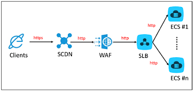
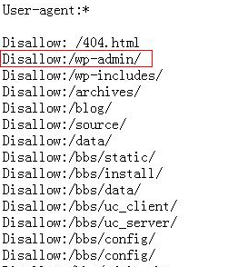
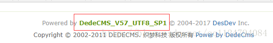
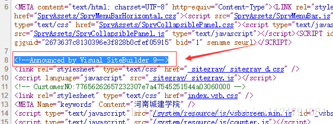

# 第 2 讲 信息收集 与 网络扫描

孙子云：知彼知己者，百战不殆；不知彼而知己，一胜一负；不知彼不知己，每战必殆。

信息收集对于网络攻击、渗透测试非常重要的。只有我们掌握了目标网站或目标主机足够多的信息之后，我们才能更好地对其进行漏洞检测。

信息收集的方式可以分为两种：

- 主动信息收集：
  - 通过直接访问、扫描网站，这种流量将流经网站。
  - 可能获取更多的信息
  - 可能会被记录。
- 被动信息收集：
  - 利用第三方的服务对目标进行访问了解。
  - 例如：Google搜索、Shodan搜索等
  - 收集的信息会相对较少
  - 行动不会被目标主机发现。

信息收集到底要收集哪些信息呢？

- 目标为某个组织时:
  - 具体使用的域名
  - 网络地址范围
  - 因特网上可直接访问的IP地址与网络服务
  - 网络拓扑结构
  - 电话号码段
  - 电子邮件列表
  - 信息安全状况
- 目标为某个人时：
  - 身份信息
  - 联系方式
  - 职业经历
  - 其它个人隐私信息

下面是一个域名探查示例：


在本节主要介绍以下内容：
- Google Hacking 和百度 Hacking
- DNS域名、IP地址收集
- 主机与网络扫描

##  1 Google Hacking 和百度 Hacking

###  1.1 Google Hacking 技术

Google Hacking :使用Google搜索引擎或其他Google应用程序通过特定语法来查找网站配置或代码中的安全漏洞。


####  1.1.1 google 操作符（operator）

**语法： operator:search_term**

> 操作符中以all开头的操作符在一般情况下一个查询中只能使用一次，不能和其他操作符混用。

- intext:

把网页中的正文内容中的某个字符做为搜索条件(但是只能搜索冒号后接的一个关键字).例如在google里输入:intext:钓鱼(广义的).将返回所有在网页正文部分包含"钓鱼(广义的)"的网页，可以与其他操作符混合使用，可单独使用。

- allintext:

使用方法和intext类似，能接多个关键字，能与其他操作符混合使用，可单独使用。

- intitle:

搜索网页标题中是否有所输入字符.例如输入:intitle:五点共圆.将返回所有网页标题中包含"五点共圆"的网页，可以与其他操作符混合使用，可单独使用。

- allintitle:

和intitle类似，能接多个关键字，但是不能与其他操作符混合使用，可单独使用。

- cache:

输入URL，搜索特定页面的缓存快照，即使目标页面发生变动甚至不存在了，依然可以看到它的副本。

- define:

搜索输入关键词或关键词组的定义来源链接,例如搜索:define:script,将返回关于script的定义，该操作符不能与其他操作符及关键字混用。

- filetype:

搜索指定类型的文件.例如输入:filetype:asp.将返回所有以asp结尾的文件的URL，可以与其他操作符混合使用。

- ext:

与filetype等价。

- info:

搜索输入URL的摘要信息和其他相关信息，该操作符不能与其他操作符及关键字混用。

- inurl:

搜索输入字符是否存在于URL中.可以联合site指定来找后台、fck之类，可以与其他操作符混合使用，可单独使用。

- allinurl:

类似inurl:,但是可指定多个字符，不能与其他操作符混合使用，可单独使用。

- link:

搜索链接到所输入URL的页面，该操作符不需要关键字，不能与其他操作符及关键字混用。

- site: 

将搜索范围缩小到特定的网站，域或子域。

- related:

冒号后接一个URL，搜索与该URL相关的页面，该操作符不能与其他操作符及关键字混用。

- numrange:

冒号后接数字范围，用一个减号两边接数字来表示。减号左边为最小值，右边为最大值，从而搜索数字。

- inanchor:

搜索一个HTML标记中的一个链接的文本表现形式，即在链接文本中搜索冒号后紧接的一个关键字。

至于“链接文本”，比如
```<a href="GNU/Linuxhttp://www.linux.org/">GNU/Linux</a>```
以上代码中的“GNU/Linux”就是链接文本。

- stocks:

搜索关于指定公司的股票市场信息。

- insubject:

搜索Google组的标题行。

- daterange:

搜索某个日期范围内Google做索引的网页。

具体内容可以参考：https://en.wikipedia.org/wiki/Google_hacking 以及 https://www.exploit-db.com/google-hacking-database

####  1.1.2 使用Google hacking 发现网站入口

找各种web入口,当然,这里所指的web入口并非仅限于各种常规网站后台(说到网站后台,一定要手工多尝试几个路径,实在猜不到,再用字典跑,节省时间)

例如一些疑似目标内网的各种web管理系统入口,web端的数据库管理入口,某些设备的web端配置入口,以及一些常见的java控制台入口等等...能上传脚本的地方全部都可以尝试。

##### 搜集各版本tomcat入口（默认在8080端口）

```
intext:$CATALINA_HOME/webapps/ROOT/ intitle:apache tomcat 	#直接这样搜结果肯定会非常多
intext:$CATALINA_HOME/webapps/ROOT/ inurl:8080/  #我们可以带指定端口号去搜,因为有些web并非在默认端口上,这样搜的话,可以尽量防止有漏网之鱼
intext:$CATALINA_HOME/webapps/ROOT/ intitle:Apache Tomcat/5.5.27 site:*.hk      针对特定版本特定国家去搜,比如爆出某个版本有远程执行类的漏洞就可以利用这种方式来批量进行
intext:$CATALINA_HOME/webapps/ROOT/ intitle:Apache Tomcat/7.0.32 site:*.gov.br
intext:$CATALINA_HOME/webapps/ROOT/ intitle:Apache Tomcat/5.0.12 site:*.cn
```

##### 搜集weblogic入口
```
inurl:/console/login/LoginForm.jsp 
inurl:/console/login/LoginForm.jsp intitle:Oracle WebLogic Server
inurl:/console/login/ intitle:"Oracle WebLogic Server 管理控制台"
```
##### 搜集jboss入口
```
inurl:/jmx-console/htmladaptor
inurl:/jmx-console/htmladaptor site:*.edu.*
inurl:/jmx-console/htmladaptor site:*.org.*
inurl:/jmx-console/htmladaptor site:*.tw
```

##### 搜集websphere入口
```
inurl:/ibm/console/logon.jsp
```
##### 搜集phpmyadmin入口

```
inurl:/phpMyAdmin/index.php 
inurl:/phpMyAdmin/index.php db+information_schema   	指定命中数据
inurl:/phpMyAdmin/index.php intext:phpMyAdmin 2.7.0 	直接针对特定版本号去搜索,更加精准
inurl:/phpMyAdmin/index.php site:*.tw
inurl:/phpMyAdmin/index.php site:*.org
inurl:/phpMyAdmin/index.php site:*.hk
```
##### 批量搜集webmin入口

其实就是一个web版的linux系统管理工具,默认情况下工作在web端的10000端口上。

```
intitle:Login to Webmin intext:"login to the Webmin server on"
```

##### 批量搜wordpress程序

关于wp的特征比较多,大家可自行构造。

```
inurl:/wp-login.php  site:*.hk
index of /wp-content/uploads inurl:/wp-login.php
inurl:/wp-content/themes/theagency
```

##### 批量搜joomla程序

```
inurl:/administrator/index.php
inurl:index.php?option=com_advertisementboard  找注入
inurl:index.php?option=com_carocci
inurl:index.php?option=com_product
inurl:/administrator/index.php site:*.hk

```

###  1.2 百度搜索

百度不支持Google中的大量语法，但也有一些类似实现。

百度的中文智能语义比Google做的好。

百度网盘、贴吧中的资源有很多有趣内容，值得探索。


##  2 DNS域名 、 IP地址的收集

信息收集目标：

- 域名
- 对应的 ip
- 域名注册人
- DNS记录、
- 子域名
- 其它相关的信息

###  2.1 基本方法

1.使用nslookup等工具查找域名以及相对应的IP地址。

一些和域名查询相关的网站：

- DNS查询：https://dnsdb.io/zh-cn/ 
- 微步在线：https://x.threatbook.cn/ 
- 在线域名信息查询：http://toolbar.netcraft.com/site_report?url=
- http://viewdns.info/
- CDN查询IP：https://tools.ipip.net/cdn.php 
- SecurityTrails平台：https://securitytrails.com/domain/www.baidu.com/history/a


使用nslookup有时候不准确，因为大型网站可能会采用复制的网络架构。



2.判断该域名是否存在CDN的情况。

我们可以去在线CDN查询网站：http://ping.chinaz.com

- 如果查询出的IP地址数量大于1个，说明该ip地址不是真实的服务器地址。
- 如果是2~3个IP地址，并且这几个地址是同一地区的不同运营商的话，则很有可能这几个地址是服务器的出口地址，该服务器在内网中，通过不同运营商NAT映射供互联网访问，同时采用几个不同的运营商可以负载均衡和热备份。
- 如果是大于3个IP地址，并且这些ip地址分布在不同地区的话，则基本上可以断定就是采用了CDN了。

验证CDN还可以使用下列测试网站：
- http://ping.chinaz.com/
- http://ping.aizhan.com/
- http://ce.cloud.360.cn/
- ICP备案查询网站（Beianchaxun.net)
- http://www.miitbeian.gov.cn/publish/query/indexFirst.action
- IP2Location

3.绕过CDN查找网站真实IP地址

方法一：查看 IP 与 域名绑定的历史记录，可能会存在使用 CDN 前的记录，除了过去的DNS记录，即使是当前的记录也可能泄漏原始服务器IP。

例如，MX记录是一种常见的查找IP的方式。如果网站在与web相同的服务器和IP上托管自己的邮件服务器，那么原始服务器IP将在MX记录中。

方法二：查询子域名，毕竟 CDN 还是不便宜的，所以很多站长可能只会对主站或者流量大的子站点做了 CDN，而很多小站子站点又跟主站在同一台服务器或者同一个C段内，此时就可以通过查询子域名对应的 IP 来辅助查找网站的真实IP。


###  2.2 本节实验操作

参考：实验1信息收集技术实验


##  3 主机与网络扫描

在主机和网络扫描环节，需要收集的信息常包括以下内容：

- OS类型与版本
  - Linux or Windows
- 应用服务器的类型与版本
- Web服务器端脚本类型
- 数据库类型
- CMS类型
- 网站敏感目录和文件

###  3.1 OS信息探查

探查方法主要有：

- 使用ping命令

早期，判断是Linux还是Windows最简单就是通过ping来探测。

Windows的TTL值都是一般是128，Linux则是64。所以大于100的肯定是Windows，反之是Linux。

- 使用nmap等扫描器

###  3.2 网站服务探查

我们还需要知道目标网站用的web服务器的类型和版本。

常见的Web server是：
- Apache
- Nginx
- Tomcat
- Mircosoft IIS
- Weblogic
- Websphere
- JBoss

探查方法，仍然是使用nmap\whatweb这类扫描器。


###  3.3 脚本类型

服务器端程序通常会使用php 、Jsp 、Asp 、Aspx 等语言实现，了解它们可以用于漏洞分析。

判断方法主要有：
- 根据web服务器类型判断
- 根据网站URL来判断
- 根据浏览器开发者工具来判断

###  3.4 数据库类型

常见类型的数据库有：
- Mysql
- Oracle
- SqlServer
- Access

Web服务器端常见搭配方式：
- ASP 和 ASPX：ACCESS、SQL Server
- PHP：MySQL、PostgreSQL
- JSP：Oracle、MySQL

###  3.5 CMS 类型

CMS代表“内容管理系统”，是一种软件工具，允许我们创建，编辑和发布内容。

内容管理系统分为四种不同类型：
- 企业内容管理系统（ECM / ECMS）
- Web内容管理系统
- Web组内容管理系统
- 组件内容管理系统

常见的CMS有（https://github.com/postlight/awesome-cms）：
- Zoomla
- StoryServer3 
- WordPress
- Drupal
- Xoops
- CmsTop等

####  3.5.1 判断CMS类型的方法

- 1.阅读网站robots.txt，从中可以发现有用信息，然后借助Google 和 百度查询。
  


- 2.通过版权信息（一般在网站底部，由模板生成）



- 3.查看网页源代码



- 4.通过CMS特性目录或文件名来判断

收集某个cms的是否存在默认路径、默认文件，之后与已经掌握的CMS模板路径和文件进行比较。比较方法是计算两者的md5值。

- 5.搜索引擎探测CMS

在google里site:目标站 CMS 或者内容管理系统。还可以使用：
- site:目标.com cms
- site:目标.com 内容管理系统
- site:目标.com 版权
- site:目标.com title:cms
- site:目标.com title:内容管理
- site:目标.com inurl:cms

- 6.其它工具分析

分析探查时可用工具：
- AWVS
- WWWSCAN
- whatweb，http://whatweb.bugscaner.com/look/
- googlehack

###  3.6 网站敏感目录和文件

网站目录结构，敏感文件有可能会泄漏信息。

特别要注意的是：
- 后台（管理）目录
可以查看是否存在弱口令，万能密码。

- 安装包
从中获取数据库信息，甚至是网站源码。

- 上传目录
尝试是否可以上传脚本、程序等。如果可以，则极有可能形成漏洞利用。

- mysql管理接口
查看是否有弱口令、万能密码。

- 安装页面
可以尝试二次安装，进而绕过访问控制。

- phpinfo
有可能暴漏各种信息。

- 编辑器：fck、ke、等
可能存在注入漏洞、上传漏洞等。

探测目标网站后台目录的工具有： 
- wwwscan
- 御剑
- dirbuster
- cansina 等

###  3.7 本节实验操作：使用 nmap 进行网络扫描

参考：实验2Nmap扫描器应用。


##  4 参考资料

1. https://www.exploit-db.com/google-hacking-database
2. https://klionsec.github.io/2014/12/14/search-hacking/
3. http://sec-redclub.com/archives/116/
4. https://zhuanlan.zhihu.com/p/22161675
5. https://blog.csdn.net/qq_36119192/article/details/84029809
6. https://medium.com/@iyouport/%E8%B6%85%E7%BA%A7%E6%83%85%E6%8A%A5%E6%94%B6%E9%9B%86%E5%B7%A5%E5%85%B7%E5%BA%93-%E5%BC%80%E6%BA%90%E9%AA%8C%E8%AF%81%E5%92%8C%E8%B0%83%E6%9F%A5%E5%B7%A5%E5%85%B7%E5%8F%8A%E4%BD%BF%E7%94%A8%E6%96%B9%E6%B3%95-aef21bbe3b8b