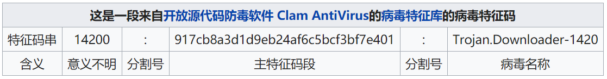

# 第4讲 恶意代码分析概要

本讲主要内容包括：
- 恶意代码的类型
- 恶意代码分析的目的
- 识别恶意代码的方法
- 恶意代码分析方法
  - 静态分析技术

##  1 恶意代码类型

- 后门
- 僵尸网络
- 下载器
- 间谍软件
- 启动器
- 内核套件rookit
- 勒索软件
- 蠕虫
- 病毒

##  2 恶意代码分析的目的

- 为一起网络入侵事件的响应提供所需信息
- 确定发生了什么？
- 找出所有感染的主机和文件
- 确定某个可疑二进制文件到底做了什么？
- 如何在网络上检测出它？它的特征码是怎样的？
- 如何衡量并消除它带来的影响？

##  3 识别恶意代码的方法

恶意代码的识别主要依据两种方法：
- 恶意代码的特征码
- 恶意代码的行为特征

###  3.1 特征码

特征码，可以理解为恶意代码区别于非恶意代码的特征字节序列。通常是hash计算得到的哈希码，以二进制或十六进制表示。

---

如今，单利用“特征码”是无法检测出恶意文件的。恶意软件作者可利用各种技术对特征码进行模糊处理，从而隐匿无踪。

现代反病毒产品必须使用更加高级的检测方法，它们的病毒数据库中不仅含有”特征码”（占数据库的一半以上条目），同时也包含了行为数据等信息。

####  3.1.1 特征码的分类

##### 主机特征码

主机特征码，也称感染迹象，用于在受感染主机上检测出恶意代码。

这些迹象通常是恶意代码所创建或修改的文件，或是他们对注册表的特定修改。

##### 病毒特征码

恶意代码本身的特征。

##### 网络特征码

通过检测网络流量，来检查恶意代码的迹象。

####  3.1.2 特征码的提取

主要有下列一些技术：
- 全文生成
- 人工提取
- 自动提取

例如下列提取算法：
- 1.获取一个病毒程序的长度，根据长度可以将文件分为几份，份数根据样本长度而定，可以是3~5份，也可以更多。
- 2.每份中选取通常为16或32个字节长的特征串。这里一般要用到查重算法，从大量的恶意代码样本中提取相同的部分，这部分自然应该是特征串。
- 3.如果选出来的信息是通用信息，即很多文件该位置都是一样的信息，那么舍弃，调整偏移量后重新选取。
- 4.如果选取出来的信息是全零的字节。那么也要调整偏移后重新选取。当然调整的偏移量多少可以人为事先规定，也可以自动随机调节。
- 5.最后将选取出来的几段特征码及它们的偏移量存入病毒库，标示出病毒的名称即可。

病毒会以下列技术对抗特征码提取，以防止被检查出来：
- 模糊变换
- 等价指令替换
- 加壳
- 花指令

###  3.2 恶意代码的行为分析

一般来说，我们监控的行为包括以下几个部分：
- 修改注册表启动项（RUN、GINA）
- 修改关键文件（PE文件、系统配置文件）
- 控制进程（启动、关闭、修改进程）
- 访问网络资源（创建socket、对外发起连接）
- 修改系统服务（创建、修改、关闭系统服务）
- 控制窗口（隐藏窗口、截取指定窗口消息）

##  4 恶意代码分析方法

主要有两类：
- 静态分析
- 动态分析

###  4.1 通用分析规则

- 不要过于陷入细节，紧紧围绕核心关键部分分析；
- 不同的工作任务，使用不同的方法和工具；
- 不断学习新技术。

###  4.2 静态分析技术

静态分析是研究代码的第一步。

它通过分析程序指令和结构来了解程序的功能和过程。

静态分析技术，包括：

- 检查可执行文件的基本信息，但不执行程序；
- 反编译可执行文件，查看程序指令序列，分析代码意图。

###  4.3 动态分析技术

动态分析技术包括：

- 建立安全运行环境，观察代码运行行为；
- 使用调试器检查程序运行时的状态。

##  5 参考文章：
1.https://bindog.github.io/blog/2015/08/20/microsoft-malware-classification/

2.https://zhuanlan.zhihu.com/p/32251097

