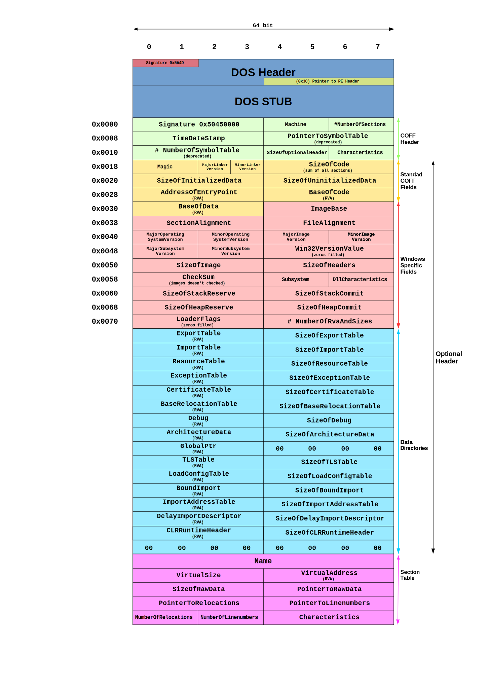

# 第5讲 代码静态分析技术

静态分析是研究代码的第一步。

它通过分析程序指令和结构来了解程序的功能和过程。

---


---

静态分析技术主要包括：

- 不执行程序的情况下，检查可执行文件的基本信息；
- 反编译可执行文件；
- 查看程序指令序列；
- 人工分析代码意图。

## 1 本节主要内容：

- 使用反病毒软件确定样本的恶意性
- 文件基本属性分析
- 计算文件及附件的HASH值，在网上查找匹配Hash值；
- 查看代码内所含字符串；
- 判断代码是否经过混淆或加壳；
- 若为PE文件，进行PE文件专项分析
  - 分析代码所引用的链接库、所使用的函数；
  - 分析文件的PE结构，之后逆向分析。

## 2 反病毒软件/引擎扫描

了解杀毒软件的杀毒过程，是学习恶意代码分析技术非常实用的第一步。

很多杀软是商业软件，但有5款知名的开源杀毒软件：
- OpenAntiVirus Project
- Armadito Antivirus
- ClamAV Open Source
- ClamWin Open Source
- Moon Secure Antivirus

如果你没有本地的反病毒软件，可以使用在线的，例如：

- https://www.virustotal.com/


- http://www.virscan.org/


---

## 3 文件基本属性分析

在这一步，主要是对样本文件的文件格式、作者、创建、编辑日期等文件基本属性；

在Windows中，点击鼠标右键，然后点击“属性”就可查看。


在Linux中，可以使用如下命令：

```ls -l <文件名> ```，可查看文件详细属性。

```lsattr <文件名>```，可查看文件的扩展属性。

```file <文件名>```，可查看文件类型。

```stat <文件名>```，可查看文件的状态。

---

## 4 检查恶意代码的hash值

哈希是一种摘要算法，可以用来确定恶意代码的标识（指纹）。

常用哈希算法有：

- MD5
- SHA-1
- SHA-128
- SHA-256

在windows 中可以使用下列命令计算某个文件的hash值：

```certutil -hashfile <文件名> <hash算法，例如：md5，sha256,...>```

例如：```certutil -hashfile 123.exe MD5```

在Linux中可以使用下列命令计算Hash值：

```md5sum <文件名>```

```sha256sum <文件名>```

---

## 5 查看代码内所含字符串

程序中的字符串就是一串可打印的字符序列。一个程序总会包含一些可打印的消息、URL、文件名或路径。

可以使用Strings程序，查看一个程序中可打印字符串，以此了解程序内的一些情况。

这个程序可疑从：https://docs.microsoft.com/zh-cn/sysinternals/downloads/strings 下载。

在微软的windows中，对于unicode编码，采用的是双字节；而单字节字符串一般是ASCII码字符。

Strings工具有时也会判断错误，将不是字符的的字节翻译为字符，这需要用户确定它的正确性。

---

## 6 判断代码是否经过混淆或加壳

恶意代码经常使用加壳或混淆技术，让他们的文件更难被检测和分析。

混淆程序是恶意代码是尝试隐藏其执行过程的代码。

加壳程序是混淆程序的一类。加壳后的恶意程序会被压缩，难以分析。

混淆后的恶意代码，往往有很少的可打印字符，这与正常程序不同。使用Strings工具检查一个程序，如果里面很少有字符串，那么很可能是加过壳的。

加壳或混淆后的程序，往往包含LoadLibrary和GetProcAddress函数，用来加载其它程序或函数。

### 6.1 文件加壳

已加壳的程序在运行时，会首先运行一段脱壳程序，解压加壳的文件；然后在运行脱壳后的文件。

加壳程序的字符串列表、导入表、其他信息都被压缩，大多数静态分析工具都看不到这些信息了。


### 6.2 使用PEiD检查加壳

检查加壳程序的一种工具是PEiD。

PEiD虽然再2011年就不再更新和支持了，但仍然是很好用的工具。

下图显示了无壳程序：


下图显示了有壳程序：


注意，PEiD的插件会在没有警告的情况下运行恶意代码的可执行文件，一定要建立安全环境后再运行。

### 6.3 壳的分类

主要分为两类：压缩壳和加密壳

压缩壳主要为了压缩软件本身的体积（压缩率）和压缩后软件运行的稳定性，脱壳比较简单。

- FSG压缩壳
- UPX压缩壳
- ASPack压缩壳
- PeCompact压缩壳
- NsPack压缩壳

压缩壳针对软件的加密保护、免杀。

- Armadillo加密壳
- EXECryptor加密壳
- Themida加密壳
- ASProtect加密壳

---

## 7 PE文件专项分析

在这部分介绍以下内容：
- 什么是PE文件
- 分析文件所引用的链接库、所使用的函数
- 分析PE文件结构

---

### 7.1 PE文件

可移植性可执行文件（英语：Portable Executable，缩写为PE）是一种用于可执行文件、目标文件和动态链接库的文件格式，主要使用在32位和64位的Windows操作系统上。

在Windows NT操作系统中，PE文件格式主要用于EXE文件、DLL文件、.sys（驱动程序）和其他文件类型。可扩展固件接口（EFI）技术规范书中说明PE格式是EFI环境中的标准可执行文件格式。


PE格式是由Unix中的COFF格式修改而来的。在Windows开发环境中，PE格式也称为PE/COFF格式。PE格式目前支持IA-32、IA-64和x86-64（AMD64/Intel64）的指令系统，还支持MIPS、Alpha和PowerPC的指令系统。由于Windows CE也在使用PE文件格式，因此PE仍然支持几种不同型号的MIPS、ARM（包括Thumb）和SuperH指令系统。

PE文件格式的主要竞争对手是可执行与可链接格式（ELF）（使用于Linux和大多数Unix版本中）和Mach-O（使用于Mac OS X中）。

“可移植的”是指该文件格式的通用性，可用于多种不同的操作系统和体系结构中。PE文件格式，其实是一种数据结构，它封装了Windows操作系统加载可执行程序代码时所必需的一些信息。这些信息包括：
- 动态链接库
- API导入和导出表
- 资源管理数据
- 线程局部存储数据。
 


如果使用PEVIEW工具查看某个exe文件，会有如下图所示的结果:




参考：https://docs.microsoft.com/en-us/windows/win32/debug/pe-format

注意：windows采用的网络字节顺序是Little-Endian。

所谓 Little-Endian，即将二进制数，低位字节排放在内存的低地址端，高位字节排放在内存的高地址端。。


使用Little-Endian的系统有：
- The Intel x86 and AMD64 / x86-64 系列处理器
  - Windows
  - Linux for x86
  - mac for x86
  
所谓Big-Endian，即将二进制数，低位字节排放在内存的高地址端，高位字节排放在内存的低地址端。。


---

与PE文件格式相关的概念有：

- 导入表（Import table）, 指该PE文件包含了哪些 DLL库，使用了哪些函数。
- 导出表（Export table），指该PE文件期望被其它程序或库所调用的函数。
- 时间戳，指该PE文件何时被编译。
- 分节，指文件分节的名称，所占空间大小
- 子系统，指明程序类型。
- 资源，指该PE文件包含的图片、图标、菜单等等。
- 节，在PE文件头后，会跟随一系列的节，这些节包含了有用信息。

#### 7.1.1 PE文件中常见的节

##### .text

包含了CPU执行命令、所有其它节存储数据和支持性信息。

一般来说，这是唯一可以执行的节，也应该是唯一包含代码的节。

##### .rdata

包含导入与导出函数信息，与Dependecy Walker和PEview工具看到的信息是相同的。

这个节还可以存储程序所使用的其它只读数据。

有些程序还包含.idata和.edata节，分别来存储导入导出信息。

##### .data

包含了程序的全局数据，可以从程序的任何地方访问到。

本地数据并不存储在此节中，而是PE文件某个其它位置上。

##### .rsrc

包含了由可执行文件所使用的资源，而这些内容并不是可执行的，比如图标、图片、菜单项、字符串等等。

字符串可以存在.rsrc节或主程序里，在这个节里经常存储的字符串是为了多语言支持使用。

##### .pdata

只在64位可执行文件中存在，存储异常处理信息。

##### .reloc

包含用来重定位库文件的信息。

##### 注意

不同编译器编译出的可执行文件节名称可能是不同的，但相同编译器编译的名称是相同的。

- visual studio 使用.text作为可执行代码节；
- Borland delphi则使用CODE作为可执行代码节。

windows不关心节名，PE中的其它信息确定了如何使用节。节名有时也会被混淆，使其难于分析。

#### 7.1.2 PE文件与虚拟内存之间的映射

文件偏移地址(File Offset)：数据在PE文件中的地址叫做文件偏移地址,可以理解为就是文件地址。这是文件在磁盘上存放相对与磁盘文件开头的偏移。

装载基址(Image Base):PE装入内存时的基地址。默认情况下，EXE文件在内存中对应的地址是0x00400000,DLL文件是0x10000000。这些位置可能通过编译选项修改。


虚拟内存地址(Virtual Address,VA )，是PE文件中的指令装入内存后的地址。

相对虚拟地址(Relative Virtual Address, RVA)，相对虚拟地址是内存地址相对于映射基址的偏移量。


虚拟内存地址，映射地址，相对虚拟内存地址三者之间:

> VA = Image Base + RVA

文件偏移地址是相对于文件开始处0字节的偏移,RVA(相对虚拟地址)则是相对于装载基址0x00400000处的偏移.由于操作系统在装载时“基本”上保持PE中的数据结构，所以文件偏移地址和RVA有很大的一致性。（不是全部相同）

PE文件中的数据按照磁盘数据标准存放，以0x200直接位基本单位进行组织。当一个数据节(stction)不足0x200字节时，不足的地方将用0x00填充，下一个数据节超过0x200时，下一个0x200将分配给这个字节实用。所以PE数据节大小永远是0x200的整数倍
当代码装入后，将按照内存数据标准存放，并以0x1000字节为基本的存储单位进行组织，不足和超过的情况类似上面。因此，内存中的节总是0x1000的整倍数。

|节(section)|相对虚拟偏移量RVA|文件偏移量|
|-|-|-|
|.text|	0x00001000|	0x0400|
|.rdata|	0x00007000|	0x6200|
|.data|	0x00009000|	0x7400|
|.rscr|	0x0002D000|	0x7800|

由于内存中数据节相对于装载基址的偏移量和文件中数据节的偏移量有上述差异，所以进行文件偏移到内存地址之间的换算时，还要看所转换的地址位于第几个节内:
```
.text  节偏移 = 0x1000-0x400 = 0xc00
.rdata 节偏移 = 0x7000-0x6200 = 0xE00
.data  节偏移 = 0x9000-0x7400 = 0x1C00
.rsrc  节偏移 = 0x2D000-0x7800 = 0x25800
```
文件偏移地址跟虚拟内存地址之间的换算关系可用下面的公式来计算。
> 文件偏移地址 = 虚拟内存地址(VA) - 装载基址(Image Base) - 节偏移​ = RVA - 节偏移


---

### 7.2 使用 Dependency Walker 分析PE文件的依赖关系(Import/Export)

对于一个PE文件，我们可以收集到的最有用信息之一，就是它的导入表。

导入函数是一个程序所使用的，但存在另一个程序中的函数，例如一些通用的函数。

代码库可以被静态链接，也可以在运行时链接，或称为动态链接。了解代码库如何被链接，这对于代码分析很重要。

PE头中可以找到的信息取决于链接了哪些代码库。Dependency Walker 可以轻松帮我们查看PE文件中链接（依赖）的库和函数。

Dependency Walker是一个免费的实用程序，可以扫描任何32位或64位Windows模块（exe，dll，ocx，sys等），并构建所有相关模块的分层树形图。对于找到的每个模块，它列出了该模块导出的所有函数，以及其他模块实际调用了哪些函数。另一个视图显示所需文件的最小集合，以及每个文件的详细信息，包括文件的完整路径，基本地址，版本号，机器类型，调试信息等。

Dependency Walker对于解决与加载和执行模块相关的系统错误也非常有用。Dependency Walker检测到许多常见的应用程序问题，例如缺少模块，模块无效，导入/导出不匹配，循环依赖性错误，模块的机器类型不匹配以及模块初始化失败。

Dependency Walker可在Windows 95,98，Me，NT，2000，XP，2003，Vista，7和8上运行。它可以处理任何32位或64位Windows模块，包括专为Windows CE设计的模块。它可以作为图形应用程序或控制台应用程序运行。Dependency Walker处理所有类型的模块依赖项，包括隐式，显式（动态/运行时），转发，延迟加载和注入。包括详细的帮助。

官方网址：http://www.dependencywalker.com/


#### 7.2.1 模块间的依赖关系

一个模块可以通过多种方式依赖于另一个模块：

##### 隐式依赖

也称为加载时依赖、静态依赖（这种叫法不准确）。

在编译/链接时，模块A与属于模块B的某个LIB文件隐式链接，而且模块A的源代码确实调用了模块B里的一个或多个函数。

模块B是模块A的一个加载时依赖，在运行时无论A是否真的调用了B，B都将被加载到内存中。

隐式依赖是windows中最不经常使用的方法。但在Linux和Unix中常见。

此时，所有代码都被复制到可执行程序中，使得程序变大。在分析时，很难将它们区别开，因为PE文件头中没有表明这个文件包含哪些代码。

此种情况，在Dependency Walker中，模块B将列在模块A的导入表中。

##### 延迟加载依赖

在编译/链接时，模块A与模块B的某个LIB文件之间有延迟加载链接，并且A的源代码确实调用了模块B中的一个或多个函数。

模块B是动态依赖项，并且仅当运行时A真实调用了B，才会加载到内存中。

此种情况，在Dependency Walker中，模块B在A的延迟加载导入表中列出。


##### 转向依赖关系

在编译/链接时，模块A与模块B中的某个LIB文件链接，而且A的源代码确实调用了模块B中的一个或多个函数。

如果模块B中被A调用的函数之一，将转向调用模块C，那么B和C都是A的依赖项，但只有B会被列在Dependency Walker中的导入表中。

##### 显式依赖

也称为动态或运行时依赖。

在编译/链接时，模块A不与模块B链接。

在运行时，A使用LoadLibrary型函数动态调用B，模块B成为模块A的运行时依赖项。

此种情况，在Dependency Walker中，模块B不会在A的各类表中列出。

这种类型的依赖常见于：OCX控件、COM对象和Visual Basic应用。

运行时链接方式，在恶意代码中用的比较多。特别是在加壳、混淆后，只有在运行函数时才被加载。

一些Windows API允许程序员导入并没有在程序的文件头中列出的链接函数。其中最为常见的是：
- LoadLibrary
- GetProcAddress
- LdrGetProcAddress
- LdrLoadDll

前两个函数允许程序访问系统上任何库中的任何函数，这意味着当这些函数被使用时，你无法静态分析出可疑样本程序中会链接哪些函数。

##### 系统挂钩依赖性（也称为注入依赖性）

当另一种应用程序在进程中挂钩特定事件（例如鼠标事件）时，会发生这种类型的依赖性。

当特定事件产生时，OS可以注入一个模块插入进程来处理该事件。

注入到进程中的模块实际上并不依赖于任何其他模块，但模块被加载到该进程的地址空间中。

Dependency Walker 完全支持上述各种依赖的检查，对于排除加载和执行模块故障错误非常有用。 对于程序员来说，Dependency Walker是一项必备技能。

#### 7.2.2 Dependency Walker 应用

Dependency Walker能提供某段PE代码的以下信息：

- 代码的完整模块依赖关系树图。
- 每个模块导出的所有函数的列表。包括：
  - 按名称导出的函数，
  - 按顺序导出的函数
  - 实际转发给其他模块的函数。
  - 命名的C++函数可以以其本地包装格式显示，也可以扩展为人类可读的函数原型，包括返回类型和参数类型。
- 每个模块被其他模块实际调用的函数列表。
  - 帮助了解为什么某个模块要与一个应用程序发生连接
  - 提供有关如何从依赖关系中删除不需要的模块的信息。
- 加载和运行模块所需的最少文件集的列表。
  - 将文件复制到另一台计算机或创建安装脚本时，此列表可能非常有用。
- 对于每个单独的模块，提供以下信息:
  - 模块文件的完整路径。
  - 模块文件的日期和时间。
  - 实际构建模块的日期和时间。
  - 模块文件的大小。
  - 模块文件的属性。
  - 生成模块时的模块校验和。
  - 实际的模块校验和。
  - 为其构建模块的CPU的类型。
  - 构建模块以在其中运行的子系统的类型。
  - 与模块关联的调试符号的类型。
  - 模块的首选基本加载地址。
  - 模块的实际基本负载地址。
  - 模块的虚拟大小。
  - 该模块相对于其他模块的加载顺序。
  - 在模块的版本资源中找到的文件版本。
  - 在模块的版本资源中找到的产品版本。
  - 在模块文件头中找到的映像版本。
  - 用于创建模块文件的链接器版本。
  - 生成模块文件的操作系统版本。
  - 生成模块文件的子系统的版本。
  - 如果在处理文件时发生任何错误，则可能是错误消息。

下图中：
- 1处，列出了当前分析文件名
- 2处，列出了程序导入的DLL
- 3处，列出了左侧指定的Kernel32.DLL的导入表（函数列表）。
  - Hint指序号，可以根据序号确定函数，而不一定靠函数名。
- 4处，列出了左侧指定的Kernel32.DLL中所有可被导入的函数。
- 5、6处，列出了运行程序时装载的DLL版本额外信息、报错信息等。


上图中，底部的两个窗口，会分别显示运行程序时装载的DLL版本额外信息，以及报告错误。

下面举出一些分析实例：

下图是使用dw打开了calc.exe


下图显示使用dw打开一个恶意代码：


如图所示，单击图中的KERNEL32.DLL，可以在右上角的窗格中显示出导入表。其中的CreateRemoteThread很有趣，表示该函数会使用这个函数生成远程线程。注意右侧上下两个窗口中列出了函数的名称和序号（ordinal）。可执行文件可以根据序号，而不是名称来导入函数，适用序号导入函数时，名称就不会在可执行文件中显示。这会造成分析的困难。此时，可以根据右侧下方的ordinal来判断到底导入了哪个函数。

---

### 7.3 使用PEview来分析PE文件

使用这个工具可以分析PE文件结构。


下面重点说明PE文件结构的几个组成部分.

#### 7.3.1 IMAGE_NT_HEADERS

显示了NT文件头， 特征签名都是相同的“00004550”。

- IMAGE_FILE_HEADERS，包含了关于文件的基本信息。
- IMAGE_OPTIONAL_HEADERS，包含了几个重要信息：
  - 子系统subsystem。
  - 导出、导入表的地址和占用内存大小。


#### 7.3.2 分节头部信息

用于描述各个分节，这部分信息很有价值。

编译器通常负责创建和命名可执行文件的各个分节。一般情况下，程序员无法修改这些名字，所以可执行文件的这些分节名称通常都是一致的。而任何偏差都是值得怀疑的。

下图中，可以看到Virtual size告诉我们加载过程中需要分配多少空间给一个分节；Size of Raw Data告诉我们磁盘上这个分节的大小。这两个值应该是相等的，即内存中占的字节和磁盘上的字节应该一样多，小的差别也有可能，但大的差别就有问题了。


注意：

- 分节大小，在检查加壳可执行程序时很有用。
- virtual size 指占用实际内存大小
- size of raw data 原始代码大小
  - 例如，.text节的virtual size比size of raw data 大很多，那么这个节在内存占用了过多的空间，意味着加壳代码的存在。
- .data 分节的virtual size比size of raw data 大很多往往是正常的。
- .text 分节的virtual size比size of raw data 基本一致，并不能说明这个程序是可信的，只能说明没有加壳，这个PE文件头是编译器产生的。

---

### 7.4 使用 Resource Hacker工具检查资源节（.rsrc）

这个工具可以查看资源节.rsrc

下图查看calc.exe的资源使用：


Resource Hacker 可以查看：
- 图标icon
- 菜单menu
- 对话框dialog
- 字符串
- 版本信息

恶意代码，常把一个嵌入的程序或驱动放在资源节里，在程序运行前，他们将嵌入的可执行文件或驱动提取出来，Resource Hacker工具可以帮你分析他们。

### 7.5 其它PE文件分析工具

- https://www.malware-analyzer.com/pe-tools
- PEBrowse Professional
- PE Explorer

---

## 8 Windows 中常见DLL的功能

### 8.1 Kernel32.dll

常用，包含系统核心功能，访问系统内存、文件、硬件等。

### 8.2 Advapi32.dll

提供了对核心Windows组件的访问，比如服务管理器和注册表。

### 8.3 User32.dll

包含了所有用户界面组件，如按钮，滚动条，控制和响应用户操作的组件。

### 8.4 Gdi32.dll

包含了图形显示和操作的函数。

### 8.5 Ntdll.dll

这是Windows内核的接口。可执行文件通常不直接导入这个函数，而是由Kernel32.dll间接导入，如果一个可执行文件导入了这个文件，意味着它企图使用那些不是正常提供给Windows程序使用的函数。例如：隐藏功能、操作进程等等会使用这个dll。

### 8.6 Wsock32.dll 和 Ws2_32.dll

这两个是联网dll，访问其中任何一个dll的程序可能是要连接网络，执行网络相关任务。

### 8.7 Wininet.dll

包含了更高层的网络函数，实现了如FTP、HTTP和NTP等协议。

---

## 9 Windows 中函数名约定

对一些不熟悉的Windows函数，一些命名规则值得考虑。

- 函数名后缀有“Ex"

这表示，该函数与另一个名字中无Ex后缀的函数不兼容。属于后来微软补充的函数。

- 以字符串为参数，且名字后面含一个“A”或一个“W”的函数

以A为结尾，表示接受的字符串参数是ASCII字符串；

以W为结尾，表示接受的是双字节的UNICODE字符串。

- 其它，有待总结...

- 对于导入表中的函数，也许只有少数是特别有意义的。对于不清楚的函数，最好到微软MSDN上弄清楚。恶意代码分析，往往会浏览很多函数，但要特别关注关键信息。


