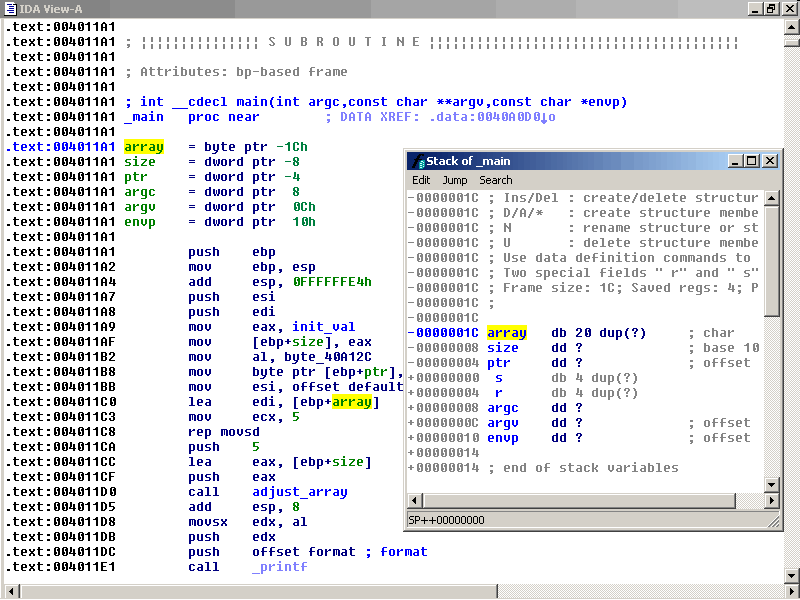
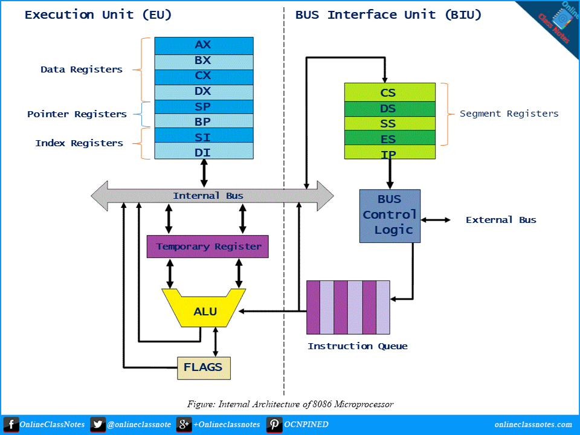
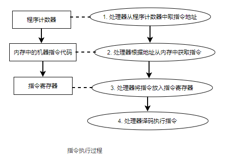
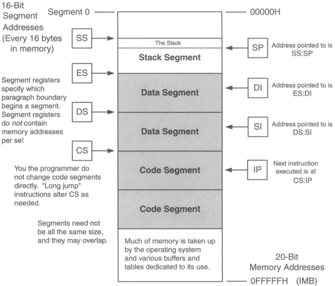
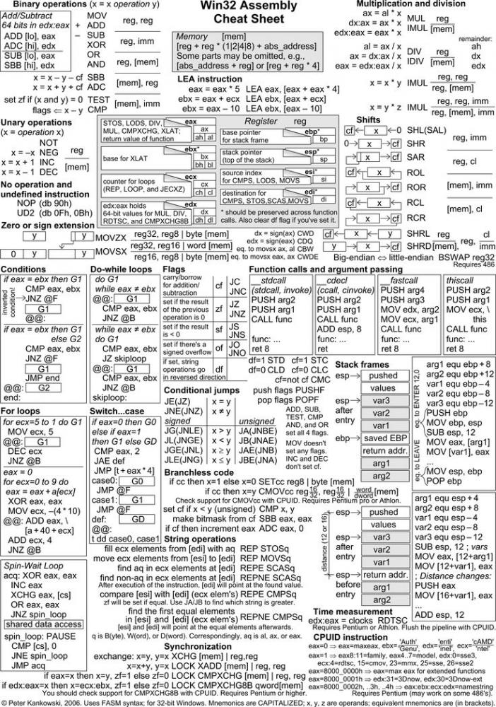
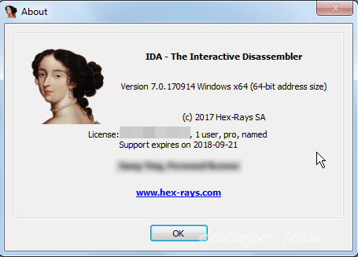

# 第6讲代码静态分析技术进阶


恶意代码静态分析基础技术对初步分类有所帮助，但它们无法提供足够多的信息，来彻底分析清楚样本。

静态分析基础技术就像在解剖时只看尸体表面。通过这些分析，你可以得到一些初步结论。但要了解整体情况，还需要更深层次的分析。

比如，你发现某个函数很重要，但只凭静态分析基础技术却无法知道它是否被使用，以及是如何被使用的。



---

##  1 本讲主要内容

本讲主要介绍恶意代码逆向工程。通过将可执行文件加载到反汇编工具种，查看程序指令，理解程序功能。

逆向工程的学习曲线较为陡峭，需要掌握：
- 汇编语言
- 代码结构
- OS系统知识

本讲主要内容包括：
- x86反汇编速成
- IDA pro
- 分析恶意Windows程序

##  2 x86反汇编速成

###  2.1 逆向工程

**逆向工程就是使用反汇编工具，将恶意代码的二进制文件反汇编为汇编语言形成的程序。**

汇编语言实际上是一类程序的统称，有针对不同cpu机器码的汇编语言，例如：x86、x64、SPARC、powerpc、mips、arm等。

x86是最为常见的pc体系结构，它又称为Intel IA-32。大部分恶意代码都是运行在x86架构上的。

在对程序（恶意代码）进行逆向时需要理解x86架构下程序编写、编译的基本情况。

恶意代码编写、编译过程：
- 恶意代码作者在高级语言层编写程序；
- 然后使用编译器生成可以被CPU执行的机器码。

反过来，逆向分析过程：
- 恶意代码分析师和逆向工程师在低级语言层操作；
- 使用反汇编器生成可以阅读和分析的汇编代码，了解程序是如何运行。

下图反映了3种编码层次：


---

通常，计算机系统被描述为以下六个抽象层次，从底向上依次为：
- 硬件：唯一的一个物理层，有电子电路组成。
- 微指令：又称为固件（firmware）。只能在为它设计的特定电路上执行，提供了访问硬件的接口。在分析恶意代码时，通常不关心微指令，因为通常它们是为特定的计算机硬件设计的。
- 机器码：由操作码和操作数组成。机器码一般是一些16进制形式的数字，用于告诉处理器你要做什么。机器码一般由多条微指令实现，机器码本身由高级语言编写的程序编译而来。
- 低级语言：是计算机体系结构指令集的人类易读版本，主要是汇编语言。恶意代码分析需要使用它。
- 高级语言：程序员使用的C或C++，它们编写的程序经过编译可以转换为机器码。
- 解释性语言：例如C#、java、perl、python等，这一层的代码不会被编译为机器码，而是翻译为字节码。字节码是一种中间表示，相比于传统编译代码，解释器提供了一种自动的抽象层次，它独立于操作系统，自己处理错误和管理内存。


###  2.2 x86 体系结构

x86内部实现了冯诺依曼结构：

- CPU
- RAM
- I/O

####  2.2.1 CPU




---

####  2.2.2 RAM


- 数据，指内存中存放数据的节/段（data section），程序初始加载时会放一些值到这一节。

- 代码，code section，包含了在执行任务时，CPU获得的指令。

- 堆，是为程序执行期间需要的动态内存准备的，用于创建分配新的值，消除不需要的值，也称为动态内存。

- 栈，用于存放函数的局部变量和参数，以及控制程序执行流。

上面这些是某个程序的内存分布，可以存在于内存用户内存区域的任意位置。这个位置由操作系统管理。

####  2.2.3 指令

例如：MOV ecx, 0x42



---

x86 arch中的基本指令有很多：

|指令|示例|含义|
|-|-|-|
|MOV|MOV EAX,ECX |EAX=ECX|
|ADD|ADD EAX,ECX |EAX=EAX+ECX|
|SUB|SUB EAX,ECX |EAX=EAX-ECX|
|INC|INC EAX |EAX+1 |
|DEC|DEC EAX |EAX-1|
|LEA|LEA EAX,[ECX+4] |EAX = ECX+4 |
|CMP|CMP EAX,ECX| if(EAX == ECX) {ZF=1} ; else ZF=0|
|TEST||TEST EAX|if(EAX == 0) ZF=1 else ZF=0|
|JE(JZ)|JE 04001000 |if(ZF==1) 则跳转到 04001000 |
|JNE(JNZ)|JNE 04001000 |if(ZF==0) 则跳转到 04001000 |
|JMP|JMP 04001000 |无条件跳转到 04001000 |
|CALL|CALL lstrcmpW |调用 lstrcmpW指向的程序|
|PUSH|PUSH 00000001 |将 00000001入栈|
|POP|POP EAX |出栈并将获取的值存入EAX|

更多指令参考：https://en.wikipedia.org/wiki/X86_instruction_listings


####  2.2.4 操作码

每条指令在CPU端都被操作码表示，例如上面的指令可表示为：

```
MOV ecx, 0x42
转换为操作码：

B9 42 00 00 00
```

注：x86采用Little-eddian 字节序，即最低位排在最左端。

一些恶意代码在网络通信时必须改变字节序，因为网络数据采用了Big-eddian字节序，而x86采用了小端字节序。

例如，IP地址 127.0.0.1在网络大端字节序下表示为：

```
0x7F000001
```
而在x86机器内部表示为：
```
0x0100007F
```

我们进行恶意代码分析，要了解字节序。

####  2.2.5 操作数

有三种：

- 立即数（immediate），即程序中的常数；
- 寄存器（register），某个寄存器名
- 内存地址（mem address），一般由方括号内包含值、寄存器或表达式给出。

####  2.2.6 寄存器

- 通用寄存器
- 段寄存器
- 状态寄存器
  - ZF
  - CF
  - SF
  - TF
- 指令指针



####  2.2.7 栈

用于函数的内存、局部变量、流控制结构等被存放在栈中。

栈的操作按后进先出规则进行，相应的操作有：

- 入栈 push
- 出栈 pop

CPU中用寄存器ESP指向栈顶；用EBP指向栈底。

与栈有关的指令包括：

- pop
- push
- call
- leave
- enter
- ret

栈只能用于短期存储，主要用途是管理函数调用之间的数据交换。


####  2.2.8 函数调用过程

很多函数都包含一段“序言”用于保存函数中用到的栈和寄存器，而在函数的结语部分又将保存到栈中的数据恢复。

下面是函数调用的常见流程：

1. 使用push将参数压入堆栈
2. 使用call memory_location来调用函数。此时，当前指令地址（EIP内容）被押入堆栈，这个地址会在函数执行完后，被用于返回到主代码。当函数开始执行时，EIP的值被设为memory_location（即函数的起始地址）
3. 通过函数的序言部分，分配栈中用于局部变量的空间，EBP也被压入堆栈，这样就达到了为调用函数保存EBP的目的。
4. 函数开始执行其程序语句；
5. 通过函数的结语部分，恢复栈。调整ESP来释放局部变量，恢复EBP，以使得调用函数可以准确地定位它的变量。leave命令可以用作结语，因为它的功能是使ESP等于EBP，然后从栈中弹出EBP。
6. 函数通过调用ret指令返回。这个指令会从栈中弹出返回地址给EIP，因此程序会从原来调用的地方继续执行。
7. 调整栈，以移除此前压入的参数，除非它们在后面还需要被使用。

####  2.2.9 栈的布局

栈被分配为自顶向下的，高内存地址先被使用。下图显示了栈在内存中是如何布局的。


最下面的是最先被执行的函数，最上面的是当前函数占用的栈。

下图展示了一个栈帧的解剖图。在这个图中，ESP指向栈顶，即内存地址0x12F02C。在函数执行时，EBP的值则始终为0x12F03C，这样就可以通过EBP来引用局部变量和参数。在调用前被押入栈中的参数，在图中位于栈的底层。接下来，它包含了由调用指令自动压入栈的返回地址，然后是老的EBP值，也就是调用者（caller）栈底地址（EBP值）。


当数据被压入栈时，ESP会随之减小。在上图中，如果执行push EAX指令，ESP就会减小4，变为0x12F028,而EAX中的数据则被复制到0x12F028处。如果执行指令pop EBX，则0x12f028处的数据就会被赋给EBX寄存器，而ESP也随之增加4。

除了pop和push，使用mov指令也可以从堆栈中取数，但不会进行堆栈操作。

x86架构还提供了其它堆栈指令，最常用的是：

- pusha，按照AX,CX,DX,BX,SP,BP,SI,DI的顺序将所有16位寄存器压入堆栈。
- popa，执行pusha的逆操作。
- pushad，按照EAX,ECX,EDX,EBX,ESP,EBP,ESI,EDI的顺序将所有32位寄存器压入堆栈。
- popad，执行pushad的逆操作。

在shellcode中，如果要将寄存器的当前状态全部保存在栈中，以便之后恢复，就需要使用上面的指令。而编译器本身很少使用这些指令，因此**看到这些指令，通常说明有人工编写的汇编代码和shellcode**。


####  2.2.10 C语言主函数和偏移

恶意代码和shellcode经常是C语言写的，因此你需要知道C语言的主函数是如何翻译成汇编的。

一个标志C程序的主函数有连个参数，形式如下：
```
int main(int argc, char **argv)
```

参数argc和argv在运行时决定。其中，参数argc是一个整数，说明了命令行中参数的个数，包括程序名字本身；参数argv是一个字符串数据指针，指向了所有的命令行参数。

下面的例子给出了一个命令行的程序，以及程序运行时argc和argv的结果。

```
filetestprograme.exe -r filename.txt


argc = 3
argv[0] = filetestprogram.exe
argv[1] = -r
argv[2] = filename.txt
```

下面时filetestprograme源程序的c代码：

```
int main(int argc, char * argv[])
{
    if(argc != 3){ return 0;}

    if(strncmp(argv[1],"-r",2) == 0) {
        DeleteFileA(argv[2]);
    }   
    return 0;
}
```
下图中的代码显示了上面C代码编译后的结果。这个例子能够帮助我们理解在汇编语言中上面的参数列表是如何访问的。


上图中，在（1）argc与3进行比较，在（2）argv[1]与-r通过strncmp进行比较。请注意这里是如何访问argv[1]的：

- 首先，数组的开始地址被载入eax；
- 然后，对eax加上4，即偏移，得到argv[1]。这里使用4是因为argv数组中每一个元素都是一个指向字符串的地址，而32位系统中每个地址都占4字节长。
- 如果命令行中有 -r ，位于（3）的代码就被执行，此时通过相对于 argv偏移 8 来获得 argv[2]，并将其作为DeleteFileA的参数。

####  2.2.11 更多信息

##### 比较指令

最常见的用于比较的汇编指令是：

- test，这个指令执行与运算，但不修改目的操作数，只改变标志位：ZF。通常可以使用test来检查一个寄存器的值是否为0.

```
test eax,eax
```
- cmp，这个指令与sub指令相同，不影响操作数，只影响标志位：ZF,CF。下图是示例：


##### 跳转指令

最常见的分支指令是跳转指令。跳转指令分为：

- 无条件跳转指令：JMP 位置
- 有条件跳转指令：JXX 位置

下表是条件跳转的具体指令和执行条件：


##### 重复指令

Intel称之为字符串指令，意味着可以连续操作一组连续的内存地址。

最常见的重复指令（数据缓冲区操作指令）是：

- movsx
- cmpsx
- stosx
- scasx

使用时，上面的x既可以写为B、w、d，表示每次操作的单位是字节、字、双字。

##### 调用指令

- CALL
- RET
- LEAVE

CALL指令的步骤：首先是将返回地址（也就是call指令要执行时EIP的值）压入栈顶，然后是将程序跳转到当前调用的方法的起始地址。执行push和jump指令。

RET指令则是将栈顶的返回地址弹出到EIP，然后按照EIP此时指示的指令地址继续执行程序。

RETN指令用于从段内转移CALL进的子程序中返回；RETF指令用于从段间转移CALL进的子程序中返回。带有操作数的RETN/RETF指令则是在POP之后，执行ESP=ESP+操作数1。

RETN等价于一条指令：

```POP   eip```

RETF等价于两条指令：

```
POP   eip
POP   CS
```

LEAVE指令结束一个过程的堆栈帧。它反转了之前的 ENTER 指令操作：恢复了过程被调用时 ESP 和 EBP 的值。

##### 其它指令参考

如果遇到从未见过的指令该怎么办？

可以查阅Intel x86架构手册：

1.http://www.intel.com/products/processor/manuals.index.htm

2.下图是个一个win32 assembly cheatsheet



---

##  3 IDA Pro

IDA Pro是由Hex-Rays发布的极其强大的反汇编器。它是许多恶意代码分析师、逆向工程师、漏洞分析师的首选。



IDA Pro支持分析多种文件格式：

- 可移植执行文件 PE
- 通用对象文件格式 COFF
- 可执行与链接格式 ELF
- a.out

###  3.1 加载一个可执行文件

打开IDA Pro后，可以看到下列界面：


初次使用，一般选“new”，然后会出现下列界面：


我们选择“PE Executable”，然后任意找一个exe文件打开。

另一种使用IDA pro打开某个exe的方式是点击菜单“file”-“open”,然后选一个要分析的exe，打开会出下如下“load a new file"的对话框：


从这个界面可以看到IDA pro识别这个文件的格式、处理器架构。一般不需要更改架构，除非分析移动端的文件。

使用IDA pro加载文件后，程序会被映射到内存中。

如果要让IDA PRO将文件作为一个原始二进制文件进行反汇编，选择“load a new file"对话框界面中的"Binary file"选项。这个选项很有用，因为**恶意代码有时会带有shellcode、其它数据、加密参数，甚至合法的PE文件中带有可执行文件，并且当包含这些附加数据的恶意代码在Windows上运行或被加载到IDA pro时，它并不会被加载到内存中。此外，当你正在加载一个包含shellcode的原始二进制文件时，你应该将这个文件作为二进制文件加载并反汇编它。**

PE文件被编译加载到内存中一个首选的基地址，如果Windows加载器无法将它加载到它的首选地址（可能被占用了），加载器会执行一个叫做基地址重定向操作。

这在DLL中经常发生，因为它们经常被加载到与它们首选地址不同的位置。

这部分暂不深入分析，现在我们只要知道**如果我们遇到进程中加载的一个DLL的位置与你在IDA pro中看到的不一样，这可能是这个文件被基地址重定向的结果。发生这种情况时，选中上图中的“manual load”复选框，这时你会看到一个输入框，你可以指定这个文件要加载的新的虚拟基地址“。**

默认情况下，IDA pro的反汇编代码中不包含PE头或资源节，而这些地方经常被恶意代码用来隐藏恶意指令。如果你指定手动加载，IDA pro会询问你是否要逐个加载每个节，包括PE头文件，这样，这些节就逃不开你的分析了。

###  3.2 IDA pro 界面

加载一个文件到IDA pro后，你会看到反汇编窗口，如下图所示：


这个界面有两种方式：
- 图形模式（上图所示）
- 文本模式

这是我们操作和分析二进制的主要位置，也是反汇编代码所在位置。这个视图也称为IDA VIEW-A.

默认情况下，IDA pro没有行号、操作码等信息，要更改这些选择，可以点击菜单“Options-General"，然后选择Line prefixes，并设置Number of Opcode Bytes 为6。因为多数指令包含6个或更少的字节，这个设置可以让我们查看内存位置和代码清单中每条指令的opcode值。还可以设置缩进instruction Indentation 为 8.


之后，效果如下：


图形模式可以用于查看执行流程。红色箭头表示一个条件跳转没有被采用，而绿色标识条件满足，被采用；蓝色则标识一个无条件跳转被采用。


为了令初学者看到汇编语言，可以选择选项中的”auto comments“。

####  3.2.1 文本模式

这个模式用于查看具体数据。从视图模式切换到文本模式的方法是：”右键-text view“。


左边的箭头和线标识了跳转，实线标记了无条件跳转，虚线标记了条件跳转。向上的箭头标识了循环。

###  3.3 对分析有用的窗口

####  3.3.1 函数窗口

能够列举可执行文件中的所有函数，并显示每个函数的长度。

可以根据长度进行排序，过滤处那些规模庞大、有意思的函数，并排除规模小的函数。

这个窗口也对每个函数关联了一些标志（F、L、S等），最有用的是L，指明库函数。L标志可以节省我们的分析时间，可以识别并跳过这些编译器生成的函数。


####  3.3.2 名字窗口

列举每个地址的名字，包括函数、命名代码、明明数据和字符串


####  3.3.3 字符串窗口

显示所有的字符串。默认情况下，这个列表只显示长度超过4个字符的ascii字符串。可以修改属性改变显示。


####  3.3.4 导入表窗口

列举一个文件的所有导入函数。


####  3.3.5 导出表窗口

列举一个文件的所有导出函数。在分析DLL时这个窗口很有用。


####  3.3.6 结构窗口

列举所有活跃数据结构的布局，也可以提供用自己创建的数据结构作为内存布局模板。

上面的窗口之间还支持交叉引用。

IDA PRO 接口丰富，要恢复默认试图，点击“windows-reset desktop”。

###  3.4 搜索功能

在IDA pro中可以使用Search 搜索：

- Next Code（下一个指令）
- Text
- Sequence of Bytes(十六进制特定字节序列)

####  3.4.1 使用链接和交叉引用

使用反汇编窗口内的链接，可以查看相关函数。


下面是最常见的链接类型：

- 子链接是一个函数开始的链接。例如，printf 和sub_401533
- 本地链接是跳转指令目的地址的链接，比如loc_xxxx
- 偏移链接地址是内存偏移的链接。

####  3.4.2 代码交叉引用

形式例如：CODE XREF: SUB_XXX

这个引用告诉我们“哪个跳转将我们将带我们到这个位置。

默认情况下，IDA PRO只显示给定函数的少数几个交叉引用，尽管有时有很多函数调用发生。

要查看一个函数的所有交叉引用，单击函数名并按X键。弹出的窗口会列举这个函数被调用的所有位置。


双击上面的任意一项，可以转到对应的代码。

####  3.4.3 数据交叉引用

数据交叉引用被用来跟踪一个二进制文件中的数据访问。数据引用可以通过内存应用关联代码中引用数据的任意一个字节。

如果我们发现一个有意思的字符串，就可以使用数据交叉引用，看它在哪里以及如何在代码中被使用。


###  3.5 分析函数

IDA pro最强大的功能是识别函数、标记函数，并且划分出局部变量和参数。

下面代码显示了一个例子：


例子中（1）显示了基于BP的栈顶如何在函数中使用，意味着整个函数中局部变量和参数通过BP寄存器来引用。

IDA PRO将变量用前缀var_进行标记，而参数用arg_标记，将局部变量和参数用相对BP的偏移量作为后缀来进行命名。

IDA仅会对代码中实际使用的局部变量和参数做标记，并不能知道所有信息。

局部变量会在相对BP或EBP的负偏移量的位置；而参数会在相对正偏移量的位置。

例子中（2）显示了栈视图摘要的开始部分。

有时IDA PRO无法识别出一个函数。此时，若分析人员觉得可能是一个函数，可以按P键来创建一个函数。当然，可能还是无法识别出基于EBP的一个栈顶，并且指令 mov [ebp-0ch]，eax 和 push dword ptr[ebp-010h]可能不是按便于理解的记号出现的。多数情况下，可以按ALT+P来修正，并选择BP Based Frame,然后指定4 bytes for saved registers.


###  3.6 图形化选项

有5种显示方式


###  3.7 增强反汇编

IDA pro支持你修改它的反汇编，达到自己的目的。这种修改可能加速我们的分析速度。

注意：修改完成后，不能撤销修改。

####  3.7.1 重命名位置

IDA pro在自动化命名虚拟地址和栈变量方面做的很好，但为了使地址更有意义，我们可以修改这些名字。

具体操作：用右键点击想改变的名字，然后选"rename",进行修改。

例如，IDA Pro自动生成的名字（假名）sub_401000，可以被修改为某个具体函数名，例如ReverseBackdoorThread的函数可能会更好。


####  3.7.2 注释

分析过程中，可以在指令后添加自己的注释。

具体操作：

- 插入普通注释：在某行需要注释的语句后，按冒号（：），然后会弹出一个注释窗口，键入注释就可以。
- 插入跨窗口（可重复回显）的函数注释：按分号（；），然后再弹出窗口中写入注释。


####  3.7.3 格式化操作数

默认情况下，IDA pro中的数据以16进制显示，你可以改变格式，以10进制或其他进制显示。

具体操作：在某个要改变显示格式的数字上点右键，然后选择。

####  3.7.4 使用命名常量

很多恶意程序中，经常会有命名常量，例如：GENERIC_READ。但编译过后，这个名字将改为某个数字。

IDA Pro为Windows API和C标准库提供了大量的命名常量目录，并且你可以在你的反汇编中对一个操作数使用Use Standard Symbolic Constant选项（在某个常量上点右键可以看到）。

下图是IDA pro为数值0xffffffff0 找到的标准符号：


注意，要确定有标准符号常量窗口提供的常用可扩展列表中选择哪个值，需要到MSDN页面上找那个Windows API 调用。

如果你要查看的某个标准符号常量不会显示，这时你需要手动加载有关的类型库。具体操作是：点菜单View-Open Subviews-Type Libraries来查看当前被加载的库。通常mssdk和vc6win会自动被加载，但如果没有可以手动加载。恶意代码通常都需要用到本地的库。

同样在分析linux下程序时，可以手动加载gnuunx(gnu c++ unix)库。

####  3.7.5 重新定义代码和数据

IDA Pro 对一个程序进行反汇编时，可能会发生错误，例如程序的段（segment）会错误分类；代码段被认为是数据段，反之亦然。

最简单的修改程序段的定义方法是按键“U”，取消函数、代码或数据的定义。当取消定义后，后续字节会被重新格式化为一个原始字节列表。

- 定义一个地址后的部分为代码段
  
按"C"键，可以定义原始字节为代码段。例如下图，一个名为paycuts.pdf的恶意pdf，载文件内偏移0x8387处，发现了有shellcode，所以在这个位置处按C键，将其定义为代码段。


- 定义一个地址后的部分为数据段

按“D”键。

- 定义一个地址后的部分为ASC ii字符串

按“A”键。

###  3.8 IDA pro 插件

IDA PRO 可以运行IDC脚本插件和python脚本插件。

选菜单“FILE"-"SCRIPT FILE"，或选“FILE-IDC Command"、“FILE-Python command”以命令形式运行。

IDA python能力强大，提供了许多IDA pro的SDK，主要是三个模块：

- IDA API(idaapi)
- IDC接口（idc）
- IDAPython工具函数（idautils）

商业插件有：

- Hex-Rays反编译器，能够将IDA PRO反汇编为类C伪代码。
- zynamics bindiff ，能够比较两个ida pro数据库，可用于分析恶意代码变种之间的区别。

###  3.9 识别汇编中的C代码结构

评估每一条指令枯燥、耗时。作为恶意代码分析人员，必须有更高层次代码功能视图。要能以组为单位来分析指令，只有特别需要时才将精力放在个别语句上。本部分的目标是，关注整体工作过程，而不是单一细节。

首先要了解恶意程序是如何开发的，才能知道如何将指令分组。

典型情况下，恶意代码是用C编写的，通常包含多个代码结构。例如，循环、if语句、链表、switch等。

此外，不同的编译器和设置会影响一个代码结构在反汇编代码中的表现。

####  3.9.1 全局变量与局部变量

源代码中看全局变量与局部变量是下面的样子：


看起来差不多，但编译后，反汇编代码是下图的样子：


可以看出局部变量位于栈上一个相对ebp的常量便宜出，而全局变量不使用堆栈。

####  3.9.2 理解函数调用约定

在进行函数调用时，栈和call指令是如何使用的。函数调用在汇编代码中的表现可能不一样，而调用约定决定了函数调用发生的方式。

这些约定包含了参数被放在栈上或寄存器中的次序，以及是由调用者还是被调用者负责在函数执行完成时清理栈。

调用约定的使用依赖于编译器，以及其它因素。通常编译器再如何实现这些约定方面，有一些细微差别。

三个最常用的调用约定是：
- cdecl
- stdcall
- fastcall

下面的例子用于讲解：


##### cdecl

这是最常用的约定方式。在cdecl约定中，参数是从右到左按序被押入栈，当函数完成调用时，由调用者清理栈，并且将返回值保存在EAX中。


上面代码中，参数时从右到左压入堆栈，在加粗部分中，栈由调用者清理。

##### stdcall

stdcall约定除了被调用者在函数完成时清理栈，其它与cdecl非常像。

如果使用stdcall约定被使用，在上面的add指令就不需要了，因为被调用者负责清理堆栈。

stdcall是Windows API的标准调用约定。任何调用这些API的程序都不需要清理栈，因为这部分由实现API的DLL程序所完成。

##### fastcall

fastcall调用约定跨编译器时变化最多，但总体上在所有情况下的工作方式都是相似的。

在fastcall中，浅一些参数（典型的是前两个）被传到寄存器中，备用的寄存器是EDX和ECX（微软的fastcall约定）。如果需要的化，剩下的参数再以从右到左的次序被加载到栈上。通常fastcall比其它约定更高效，因为代码不需要设计过多的栈操作。

####  3.9.3 不同编译器的压栈与移动操作

不同编译器对同一代码会有不同的堆栈操作。

下面是一段程序：


addr函数的汇编代码跨编译器编译后是一致的，如下所示：


但是不同编译器，操作堆栈的方法不同，如下所示：

