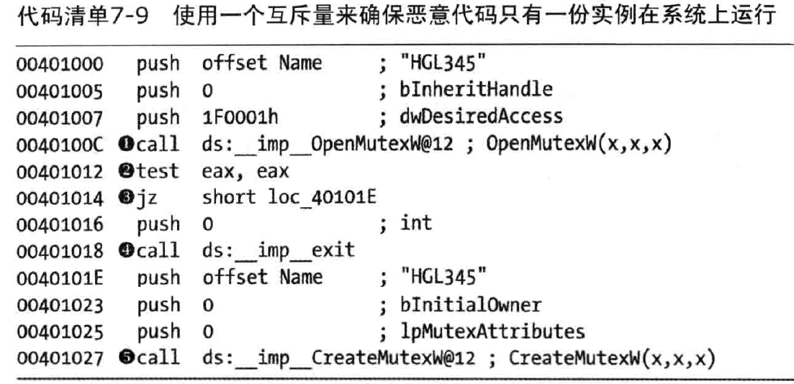
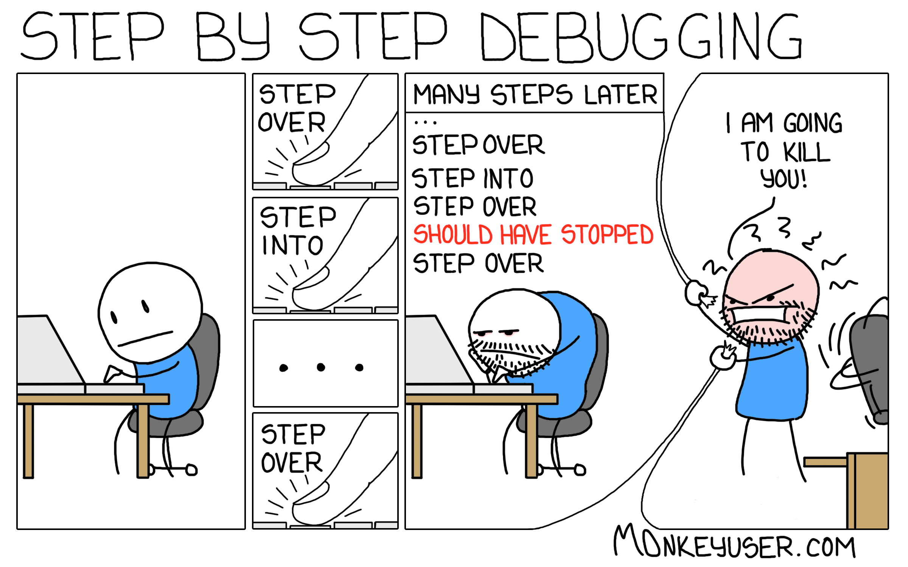
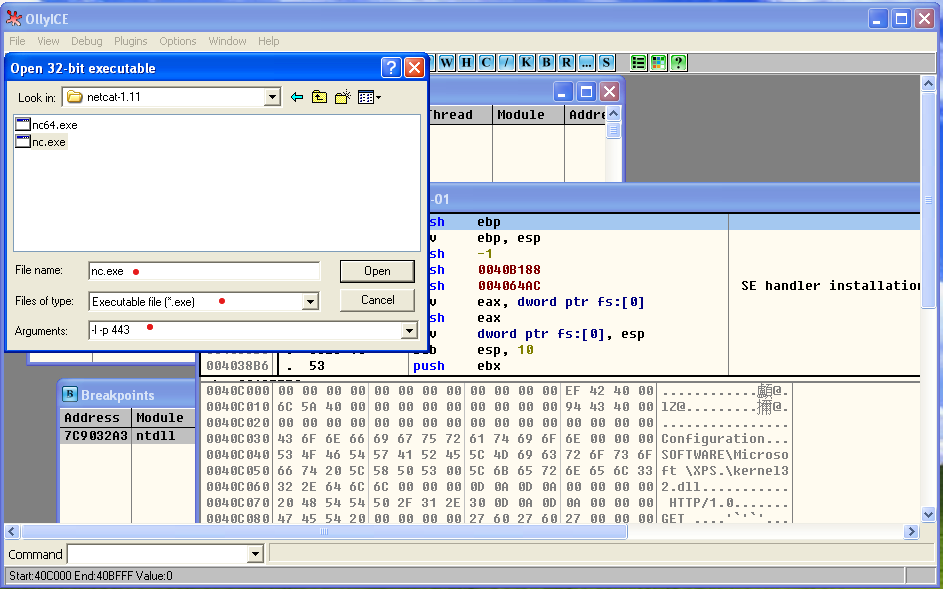
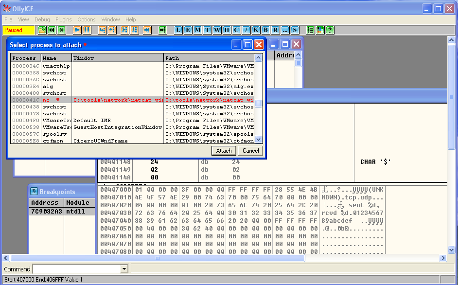
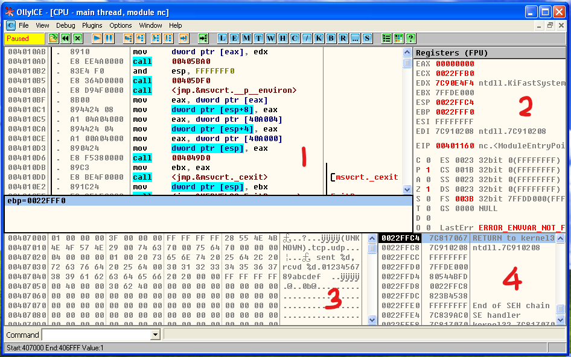
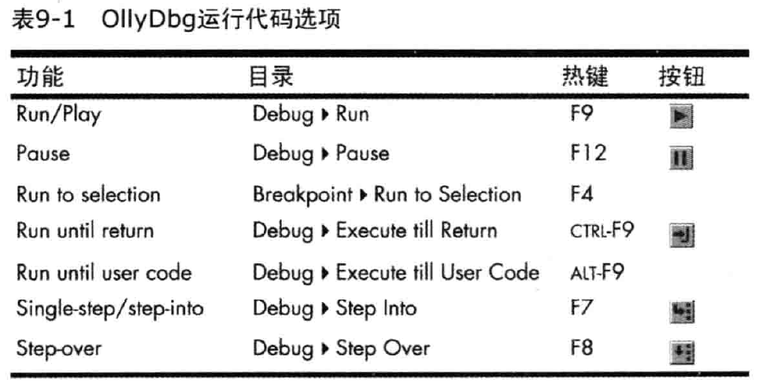
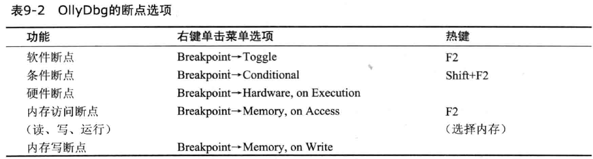
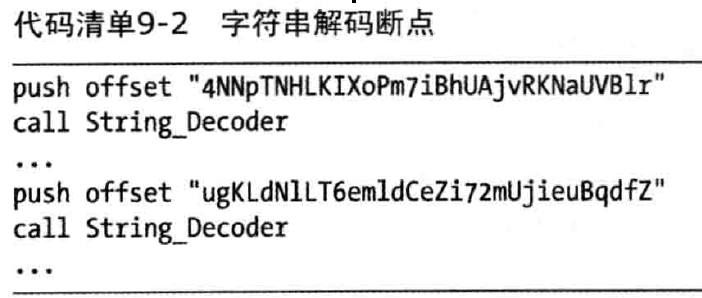
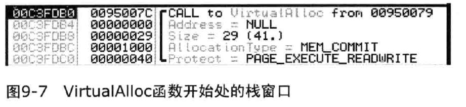
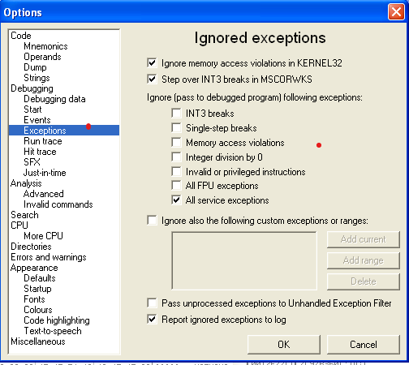

# 第8讲 代码动态分析技术进阶

## 1 本讲主要内容

- 恶意Windows程序
- 动态调试概念
- OllyDbg基本应用

## 2 恶意 Windows 程序

恶意代码多以windows 平台为目标，且于Windows OS紧密交互。

对 Windows 编程概念有所了解能够帮助我们：
- 快速找出感染迹象；
- 跟踪恶意代码执行；
- 辨识恶意代码目的。

由于恶意代码经过混淆加壳或其他刻意处理，代码编译结构较乱，所以下面主要讲恶意代码使用Windows功能的独特方式。

### 2.1 Windows API

Windows API 是个功能广范的集合，管理着应用程序或恶意代码与微软程序库之间的交互。

Windows API 使用特殊的术语、名字、约定。

#### 2.1.1 类型与匈牙利表示法

多数Windows API使用它自己的名字，来表示C语言类型。举例说明：
- DWORD，表示双字无符号整数；
- WORD，表示单字无符号整数；

WindowsAPI函数标识符通常使用匈牙利表达法。即使用前缀命名模式，来使识别一个变量的类型。

举例:
```
BOOL WriteFile( 
  HANDLE hFile, 
  LPCVOID lpBuffer, 
  DWORD nNumberOfBytesToWrite, 
  LPDWORD lpNumberOfBytesWritten, 
  LPOVERLAPPED lpOverlapped
); 
```

**匈牙利表达法使识别变量类型和解析代码更容易，但它也能变得笨重。**


#### 2.1.2 句柄(handle)

句柄是在OS中被打开或被创建的项。

例如一个窗口、进程、文件等等。

- 句柄很像指针
- 但不能进行数学运算
- 也不总表示对象地址
- 唯一操作就是“使用用它调用一个对象”

例如：CreateWindowEx 函数返回一个HWND，这是一个窗口句柄，使用它可以调用窗口操作。

#### 2.1.3 文件系统函数

恶意代码与系统交互的一个最常用的方式就是创建或修改文件。

恶意代码在主机内明显的感染迹象就是：
- 特殊的文件名
- 修改为系统已有的文件名

文件活动可以揭示这个恶意代码在做什么。例如，若恶意代码创建一个文件，并在那个文件中保存Web浏览过程，这个程序可能就是某种形式的间谍软件。

微软提供了下列多个函数来访问文件系统：

##### CreateFile

这个函数被用来创建和打开文件。它可以打开已经存在的文件，管道，流和I/O设备，还能创建新的文件。参数dwCreationDisposition控制CreateFile函数是否创建一个新的文件，或是打开一个己经存在的文件。

##### Readfile 和 WriteFile

上面两个函数被用来对文件进行读和写。两个都将文件作为流来操作。当你第一次调用ReadFile时，你从一个文件中读取后续一些字节;下次你调用它，你读取它后面的一些字节。

例如，若你打开一个文件，并用40字节大小调用ReadFile，下次你再调用它，它将会从前40个字节之后处开始读。

##### CreateFileMapping 和 MapViewOfFile

文件映射经常被恶意代码作者使用，因为它们允许将一个文件加载到内存中，以便更加容易地进行操作。

- CreateFileMapping函数负责从磁盘上加载一个文件到内存中。

- MapViewOfFile函数则返回一个指向映射的基地址指针，它可以被用来访问内存中的文件。

恶意程序调用这两个函数，能够使用从MapViewOfFile函数返回的指针，在文件中的任意位置进行读取和写入。

这个特性在解析一个文件格式时极其顺手，因为你可以简单地跳转到不同内存地址。

**注意:文件映射被普遍用来复制Windows加载器的功能。在获得一个文件的映射以后，恶意代码可以解析PE头，并对内存中的文件进行所有需要的修改，因此使PE文件就像被操作系统加载器加载一样执行起来。**


#### 2.1.4 特殊文件

Windows系统中有一些特殊的文件类型，它们的访问方式与普通文件不太一样，但是它们不能通过它们的盘符与文件夹(比如c:\dots)进行访问。恶意程序经常使用这类特殊文件。他们包括：
- 共享文件
- 通过名字空间访问的文件
- 备用数据流

有些特殊文件要比普通文件更隐蔽，因为它们在列目录时不会显示出来。某些特殊文件可以提供对系统硬件和内部数据更强的访问能力。

特殊文件可以作为字符串参数被传递给任何文件操作函数中，并像普通文件一样进行操作。

##### 共享文件

共享文件是以```\\serverNamel\share或\\?\serverName\share```开头命名的特殊文件。它们用来访问保存在共享目录中的目录或文件。```\\  ?  \```等前缀告诉操作系统禁用所有的字符串解析，并允许访问长文件名。

##### 通过名字空间访问的文件
    
在操作系统中，还有一些文件可以通过名字空间进行访问。名字空间可以被认为是固定数目的文件夹，每一个文件夹中保存不同类型的对象。Windows最顶层的名字空间是NT名字空间，以前缀\开始。

NT名字空间可以访问所有设备，以及所有在NT名字空间中存在的其他名字空间。


注意:可以使用微软免费工具WinObj对象管理器名字空间查看器，浏览Windows系统上的NT名字空间，。

以前缀```\\.\```开始的Win32设备名字空间，经常被恶意代码用来直接访问物理设备，并且像一个文件一样进行读写操作。

例如，一个程序可能使用```\\.\PhysicalDisk1```来直接访问PhysicalDisk1，而忽略它的文件系统，因此这允许程序通过普通API不可能做到的方式来修改磁盘。使用这个方法，恶意代码可以读写数据到一个未分配的扇区，而无须创建或访问文件，这允许它避开防病毒与安全程序的检测。

例如，几年前的Witty蠕虫通过NT命名空间访问```\Device\PhysicalDisk1```，使受害者的文件系统崩溃。它可以打开```\Device\PhysicalDisk1```，并间歇性地写数据到驱动器上的随机空间中，最终使受害者的操作系统崩溃并无法引导。这个蠕虫持续时间不长，因为受害者的系统在这个蠕虫能够传播之前就经常发生故障了，但它对被它感染的系统造成了不小的损失。

另一个例子是恶意代码使用```\Device\PhysicalMemory```来直接访问物理内存，这允许用户空间程序写到内核空间中。这个技术己经被恶意代码用来修改内核，并隐藏用户空间的程序。

注意:从Windows 2003 SP1开始，```\Device\PhysicalMemory```从用户空间已经无法访问。然而，你仍然可以从内核空间访问到 ```\Device\PhysicalMemory```，这可以被用来访问诸如BIOS代码和配置的底层信息。


##### 备用数据流
    
备用数据流(ADS)特性允许附加数据被添加到一个己存在的NTFS文件中，相当于添加一个文件到另外一文件尾部。

当我们使用查看Windows目录时，不会看到ADS附加的内容；而且使用一般工具查看文件内容时也会不显示附加内容。

只有以Windows流形式访问文件才能看到ADS型数据。

ADS数据流根据约定```normalFile.txt: Stream: $DATA```来命名，这允许一个程序去读写一个流。恶意代码作者喜欢ADS，因为它能被用来隐藏数据。

### 2.2 Windows 注册表

Windows注册表被用来保存操作系统与程序的配置信息，比如设置和选项。

与文件系统一样，它是基于主机的感染迹象的很好来源，并且能够揭示出关于恶意代码功能的有用信息。

Windows早期用.ini文件存放配置信息。注册表被引入后，几乎所有的Windows配置信息都被保存到注册表中，包括网络驱动、启动项、用户账户、以及其它信息。

恶意代码经常使用注册表来完成持久驻留或者存储配置数据。

注册表十分庞大，以至于恶意代码有多种方法使自己驻留。

#### 2.2.1 注册表术语

- 根键，注册表一般被划分为5个顶层节。有时，HKEY和储槽也是指根键。每个根键都有自定含义。
- 子健，根键下的子“文件夹”
- 键，一个键是注册表中的文件夹。它可以包含额外的文件夹或键值。根键、子健也是键。
- 值项，即一个配对的名字和值。
- 值或数据，值或数据是存储在注册表项中的数据。

#### 2.2.2 根键

注册表里有5个根键：

- HKEY_LOCAL_MACHINE（HKLM)，保存对本地机器的全局设置。
- HKEY_CURRENT_USER(HKCU)，保存当前用户特定的设置。
- HKEY_CLASSES_ROOT，保存定义的类型信息。
- HKEY_CURRENT_CONFIG，保存关于当前硬件配置的设置，特别是与当前和标准配置之间不同的部分。
- HKEY_USERS，定义默认用户、新用户和当前用户的配置。

最常用的是HKLM和HKCU。

一些键实际是虚拟键值，提供一种引用底层注册表信息的方式。例如，HKEY_CURRENT_USER键实际上存储在HKEY_USERS\SID中，这里SID是当前登录用户的安全描述符。

例如，一个常用的子键，HKEY_LOCAL_MACHINE\SOFTWARE\Microsoft\Windows\CurrentVersion\Run，包含一系列值，这些值列举了当一个用户登录时被自动启动的可执行程序。根键是HKEY_LOCAL_MACHINE，它保存了SOFTWARE、Microsoft、Windows、CurrentVersion以及Run子键。

#### 2.2.3 Regedit

这个工具可以编辑注册表。

#### 2.2.4 自启动程序

向Run子键中写入可执行程序路径，是一个设置程序自启动的方法。虽然不是一个隐蔽技术，但也被恶意程序常用。

Autoruns工具可以显示处当前 OS 启动时自动运行的代码。它会查找注册表中的25~30个位置，来找到被设计为自动运行的代码。


#### 2.2.5 常用注册表函数

恶意代码经常使用作为Windows API一部分的注册表函数，来修改注册表，以使它们自身能够在系统引导时自动启动运行。

下面是最常用的注册表函数：

- RegOpenKeyEx，打开一个注册表进行编辑和查询。
- RegSetValueEx，添加一个新值到注册表，并设置它的数值。
- RegGetValue，返回注册表中一个值项的数值。

当在恶意代码中看到这些函数时，你应该标识出他们访问的注册表键值。


上面程序的注释信息提供了关于这些被压栈参数值的有意义信息。

- samDesired值只是了安全访问请求的类型；
- ulOptions域是一个表示这个调用选项的无符号长整数，
- hKey则是被访问根键的句柄。

这段代码在（1）处调用了RegOpenKeyEx函数，而它的参数需要打开一个到注册表键HKLM\SOFTWARE\Microsoft\Windows\CurrentVersion\Run的句柄。在（5）处的名字和在（4）处的数据，被作为这个函数的参数保存在栈上。在（2）处对lstrlenW的调用是需要的，可以获取到数据的大小，它在（3）处作为对RegSetValueEx函数的一个参数来提供。


#### 2.2.6 使用.reg文件的注册表脚本

用.reg作为扩展的文件包含一个人类可读的注册表数据。当一个用户双击一个.reg文件时，他会自动通过合并文件包含的信息到注册表中，来修改注册表，就像一个修改注册表的脚本一样。


### 2.3 网络API

恶意代码经常要使用网络，Windows API中就有许多可以进行网络通信的函数。

创建网络特征的任务是复杂的，以后专题讨论。

现在，我们主要关注识别和理解常见的网络函数，这样可辨别出一个恶意程序在使用函数时做些什么。

#### 2.3.1 伯克利兼容套接字

在Windows的网络选项中，恶意代码最普遍使用的是伯克利兼容套接字，它们的功能在Windows和Unix上是一样的。

这个网络功能有Winsock库实现，主要在ws2_32.dll中。

在所有库内函数中，下列几个最为常用：

- socket
- connect
- bind
- listen
- accept
- send
- recv


#### 2.3.2 网络的服务器和客户端

网络程序通常会有服务器端和客户端。

服务器端维护一个打开套接字（socket）并等待客户端接入；

客户端，它连接到一个正在等待的套接字。

恶意代码可以是其中任意一个。

在连接一个远程套接字的客户端应用例子中，你会看到socket调用，然后紧跟着一个connect调用，之后，很可能是一个send或recv调用。

对于一个监听入站连接的服务应用，顺序则是socket、bind、listen和accept函数陆续被调用，如果需要的话，跟着是send和recv调用。这个模式是在任何网络程序中都很常见的。

注意：这个例子中没有考虑所有的错误处理和参数设置。一个实际例子中应该有不少WSAGetLastError的调用，和其他错误处理函数。


首先，WSAStartup函数初始化Win32 sockets系统，然后一个套接字通过socket函数被创建。bind函数将这个套接字附加到一个端口，listen调用将这个套接字设置为监听状态，然后accept调用挂起，等待一个来自远程套接字的连接。

#### 2.3.3 WinINet API

除了Winsock API以外，还有一个成为WinINet API的更高一级的Win API。WinINet API函数被保存在Wininet.dll中。如果一个程序从这个dll中导入函数，他就是在使用更高一级的网络API。

WinINet实现了应用层协议，如HTTP和FTP。可以根据恶意代码打开的是何种连接，来理解它在做什么事情。

- InternetOpen被用来初始化一个到互联网的连接。
- InternetOpenUrl被用来访问一个URL（它可以是一个HTTP页面或一个FTP资源）
- InternetReadFile和ReadFile类似，允许程序从一个来自互联网的下载文件中读取数据。

### 2.4 跟踪恶意代码的运行

除了使用IDA Pro中可见的跳转和指令调用之外，恶意代码还有很多方式可用来转移执行。弄清如何调用其它代码运行，是分析恶意代码很重要的。

最常见的，访问单一文件以外的代码的方法是使用DLL程序。

#### 2.4.1 DLL

动态链接库是使用库来在多个应用程序之间共享代码的Windows特有方式。一个DLL程序是不能独自运行的可执行文件，但它可以导出一些被其它应用程序使用的函数。

静态库是在DLL程序引入之前的标准方案，并且仍然在使用，但很少见。现在Windows中主要使用DLL，主要优势是被DLL程序使用的内存可以在正运行的进程之间共享。

例如，若一个库被两个不同的运行进程使用，静态库的代码会占用两倍于动态库的内存。

此外，Windows系统上已知的DLL程序，不需要在发布一个可执行文件时重新发布。这可以使代码最小化。

DLL程序也是一种有用的代码复用方式。

##### 恶意代码如何使用DLL

常见的有三种方式：

- 使用DLL保存恶意代码

有时，恶意代码作者发现将恶意代码保存到一个DLL文件比.exe文件更加有利。有些恶意代码会附加到其他进程，但是每一个进程只能包含一个.exe文件。因此恶意代码有时使用DLL程序，来将它
自己加载到另外一个进程中。

- 调用使用Windows DLL中的函数
  
几乎所有的恶意代码都使用在每个系统上都可以发现的Windows基础DLL程序。Windows DLL程序包含了需要与操作系统交互的功能。而一个恶意程序使用Windows DLL的方式，经常为恶意代
码分析师提供巨大的洞察力。之前学到的导入函数，以及本章中覆盖的函数，全部都是从Windows DLL程序导入的。

- 调用使用第三方 DLL中的函数

恶意代码也可以使用第三方DLL来和其他程序交互。当你看见从一个第三方DLL导入函数的恶意代码时，你可以推断它正在和那个程序交互，来完成它的目标。例如，它可能使用Mozilla Firefox DLL来连接到一个服务器，而不是直接通过Windows API进行连接。恶意代码也可能和一个自定义DLL程序一起发布，它使用这个DLL程序中一个还未在受害者机器上安装库的功能，例如，使用作为DLL程序发布的加密功能。


##### 基本DLL 结构


基本上，DLL文件看起来几乎和.exe文件一模一样。

DLL使用PE文件格式，并且只有一个单一标志，指示这个文件是一个DLL，而不是一个.exe。DLL经常有更多导出函数，并且通常导入函数较少。除了那个标志之外，一个DLL和一个.exe之间没有实质的区别。

DLL的主函数是DLLMain，它没有标记，而且并不是一个DLL中的导出函数，但是它在PE头中被指定为文件的入口点。任何时候一个进程加载或卸载库，会创建一个新线程，或一个已存在的线程结束时，这个函数都会被调用来通知DLL。这个通知允许DLL来管理每个进程或每个线程的资源。

多数DLL没有线程粒度的资源，并且它们忽略由线程活动引起对DllMain的调用。然而，如果DLL有必须在线程粒度进行管理的资源，那么这些资源可以为分析师提供一些提示，来了解这个DLL的目的。

#### 2.4.2 进程

恶意代码也可以通过创建一个新进程，或修改一个己存在的进程，来执行当前程序之外的代码。一个进程是Windows正在执行的程序。每一个进程管理它自己的资源，诸如打开的句柄与内存。一个进程包含一个或多个由CPU执行的线程。传统上，恶意代码包括它自己的独立进程，但更新型的恶意代码则普遍将自身代码作为其他进程的一部分执行。

Windows使用进程作为管理资源的容器，并保持程序隔离且不相互干扰。一个Windows系统上任意时间通常有至少20-30个进程在运行，它们共享相同的系统资源，包括CPU、文件系统、内存以及硬件。如果每一个程序都需要和所有其他程序管理共享资源，那么写程序将十分困难。操作系统允许所有进程访问这些资源，而不会相互干扰。进程也通过防止一个程序的错误或崩溃影响其他程序，来为稳定性做出贡献。

操作系统中在多个进程间共享的一个尤其重要的资源是系统内存。为了达到这个目的，每一个进程被给予一块与所有其他进程隔离的内存空间，而这是进程可以使用的内存地址范围。

当进程需要内存时，操作系统会分配内存，并为这个进程提供一个地址来访问这块内存。进程可以共享内存地址，这经常发生。例如，若一个进程在内存地址0x00400000位置保存了一些东西，另一个进程也可以在那个地址保存一些东西，但是这些进程不会冲突。这些地址是相同的，但是保存数据的物理内存却是不同的。

像寄信地址一样，内存地址只在上下文环境中才有意义。就像主大街202号并不会告诉你一个具体位置，除非你同时还拥有邮政编码，地址Ox0040A010也没有告诉你数据保存在哪，除非你知道是哪个进程。一个访问内存地址Ox0040A010的恶意程序，只会影响包含恶意代码那个进程在这个位置上保存的东西;系统中其他使用这个地址的程序则不会受到影响。

##### 创建一个新进程

恶意代码最常使用的创建新进程函数是CreateProcess。这个函数有许多参数，并且调用者有很多控制它如何被创建的方法。

例如，恶意代码能够调用这个函数，来创建一个进程去执行它的恶意代码，这样便可以绕过基于主机的防火墙以及其他安全机制。或者它可以创建一个Internet Explorer的实例，然后使用那个程序来访问恶意内容。

恶意代码通常使用CreateProcess，来创建一个简单的远程shell。CreateProcess函数的一个参数，STARTUPINFO结构，包含一个进程的标准输入、标准输出以及标准错误流的句柄。一个恶意程序可以设置这些值为套接字，这样当这个程序写入标准输出时，它实际上会写到套接字上，因而允许一个攻击者执行远程shell，而不需要运行除CreateProcess之外的任何函数。

下图代码显示了CreateProcess如何用来创建一个简单的远程shell。在这段代码之前，代码已经打开了一个到远程位置的套接字。这个套接字的句柄被保存在栈上，并且输入到STARTUPINFO结构体中。然后调用了CreateProcess函数，所有这个进程的的输入输出都被路由到这个套接字上。


在代码的第一行，栈变量socketHandle被放到EAX寄存器中。( socket句柄在这个函数外面被初始化。)这个进程的 lpStartupInfo 结构体保存标准输出（2）、标准输入（1），以及标准错误（3），它们会被新进程使用。

套接字被放到lpStartupInfo结构体中所有这3个值里(1，2，3)。在（4）处对
dword 403098 的访问包含这个程序要执行的命令行，它最终被压到栈上作为参数（5）。在（6）处对CreateProcess的调用有10个参数，但除了lpCommandLine、1pProcessInformation以及lpStartupInfo之外的所有参数不是0就是1。(有些代表NULL值，其他代表标志，但是这些对恶
意代码分析都没有意义。)

对CreateProcess的调用会创建一个新进程，以便所有输入和输出被重定向到一个套接字。要找到这台远程主机，我们需要判断这个套接字在哪里被初始化(没有包含在上面代码中)。要发现哪个程序将被运行，我们需要通过在IDA Pro中导航到dword_ 403098地址，来找到保存在这个位置的字符串。

恶意代码经常在一个程序的资源节存储另一个程序，并创建一个新进程。恶意代码有时会在资源节中保存另外一个可执行文件。当程序运行时，它会从PE头中提取附加的可执行文件，将它写到磁盘上，然后调用CreateProcess来运行这个程序。这也可以通过DLL程序和其他可执行文件完成。当这种情况发生时，你必须打开Resource Hacker工具集中的程序，并将这个嵌入的可执行文件保存到磁盘上，然后再分析它。

#### 2.4.3 线程

进程是执行代码的容器，线程才是Windows操作系统真正要执行的内容。线程是被CPU执行的独立指令序列，而不需要等待其它线程。一个进程包含一个或多个线程，它们执行进程中的一个部分代码。一个进程中的所有线程共享同样的内存空间，但是每一个有他自己的处理器、寄存器和栈。

##### 线程上下文

当一个线程运行时，它对CPU或CPU核有着完全控制，其它线程不能影响CPU或核的状态。一个操作系统在线程间切换之前，在CPU中的所有值会被保存到一个称为线程上下文的结构体中。然后操作系统加载这个线程上下文到一个新的线程中，并使这个新线程在CPU中执行。

下列代码显示了访问一个局部变量并将它压到栈上的例子：
```
004010DE lea edx, [esp+58h]
...
004010E2 push edx
```

上述代码中第一行，访问了一个局部变量（esp+58h），并且在EDX中保存它，然后将EDX压到堆栈上。现在，如果另一个线程正好要在这两条指令间运行一些代码，并且要修改EDX，则EDX的值就是错误的，而且代码不会正确执行。

当线程上下文切换被使用时，如果另一个线程在这两条指令之间运行，EDX的值会被保存到线程上下文中。当这个线程再次开始并执行push指令时，线程上下文就会被恢复，EDX将再次保存正确的值。通过这种方式，没有线程能够干扰其它线程的寄存器或标志。

##### 创建一个线程

CreateThread函数被用来创建一个新线程。函数的调用者指定一个起始地址，他经常被叫做start函数。执行从这个起始地址开始直到这个函数返回（尽管这个函数不需要返回），这个线程可以在进程结束前一直运行。当分析调用CreateThread的代码时，除了分析这个start函数外，你还需要分析调用CreateThread的剩余代码。

CreateThread的调用者可以指定线程开始的函数位置，并且一个单一参数可以被传递给这个
start函数。这个参数可以是任意值，依赖于这个线程要开始执行的函数。

恶意代码可以通过多种方式使用〔reateThread，比如下面这些:

1. 恶意代码可以使用CreateThread，来加载一个新的恶意库文件到进程中，通过在调用CreateThread时将起始地址设置为LoadLibrary的地址。（传递给CreateThread的参数是要被加载库的名字。新的DLL被加载到这个进程的内存中，然后DllMain被调用。）

2. 恶意代码可以为输入和输出创建两个线程：一个用来在套接字或管道上监听，并输出到一个进程的标准输入里；另一个用来从标准输出读取数据，并发送到套接字或管道上。恶意代码的目标是发送所有信息到单一的套接字或管道，来和运行的应用程序进行无缝通信。

下面的代码显示了如何通过标识邻近的两个CreateThread调用，来识别上面第2类技术。（只有系统对ThreadFunction1 和 ThreadFunction2 的调用被显示出来。）这段代码调用CreateThread两次，参数是lpStartAddress值，它们告诉我们到哪里去查找这些线程启动时会运行的代码。


上面代码中，我们对第一次调用CreateThread时（2）的起始函数ThreadFunction1（1），以及第二次调用CreateThread（4）时的起始函数ThreadFunction2（3）做了标记。要判断这两个线程的目的，我们首先导航到ThreadFucntion1，如下所示。

第一个线程函数执行一个循环，在这个循环中它调用ReadFile，从一个管道中读取数据，然后它将数据通过send函数转发到一个套接字。

```
# 线程例子的ThreadFunction1
...
004012C5 call ds:ReadFile
...
00401356 call ds:send
...
```

如下代码显示了第二个线程函数执行一个循环，这个循环调用recv函数，来读取通过网络发送的任何数据，然后将哪些数据通过WriteFile函数，转发到一个管道，这样啊就可以被应用程序读取了。

```
# 线程例子的ThreadFunction2
...
004011F2 call ds:recv
...
00401271 call ds:WriteFile
...
```

注： 除了线程之外，微软系统还是用纤程。纤程和纤程类似，但是被一个线程管理，而不是操作系统。纤程共享一个单一的线程上下文。

#### 2.4.4 使用互斥量的进程间协作

一个和线程与进程相关的话题是互斥量（mutex），在内核中也称为互斥量（mutant）。互斥量是全局对象，用于协调多个进程和线程。

互斥量主要用于控制共享资源的访问，并且进场被恶意代码所使用。例如若两个线程必须访问一个内存结构，但是一次只能有一个线程可以安全访问，互斥量就可以被用来控制这种共享访问。

同一时刻，只有一个线程拥有一个互斥量。互斥量对恶意代码分析很重要，因为它们经常使用硬编码的名字，将它们作为基于主机的感染迹象是很好的选择。互斥量名字硬编码十分常见，因为如果一个互斥量被两个不使用其他方式通信的进程使用时，它的名字必须是相互一致的。

线程通过一个对WaitForSingle0bject的调用，获取对互斥量的访问，并且任何后续线程试图获取对它的访问时，都必须等待。当一个线程完成对互斥量的使用后，需要使用ReleaseMutex函数。

一个互斥量可以通过CreateMutex函数进行创建。而进程可以通过OpenMutex调用来获取另一个进程中互斥量的句柄。恶意代码通常创建一个互斥量，并试图使用同一个名字来打开一个己存在的互斥量，通过这种方式，可以确定恶意代码一次只有一个唯一实例在运行，如代码清单7-9所示。



上述代码中使用了硬编码名字HGL345来创建互斥量。他首先在（1）处使用OpenMutex调用，来检查HGL345的互斥量是否存在。如果在（2）处的返回值是NULL，它（3）跳过exit调用，并继续执行。如果返回值不是NULL，他在（4）调用exit，进程就会退出。如果代码继续执行，互斥量在（5）处被创建，来确保这个程序的其它实例在执行到这段代码时会退出。

#### 2.4.5 服务

恶意代码执行附加代码的另一种方式是将它作为服务安装。Windows允许通过使用服务，来使任务作为后台应用程序运行，而不需要它们自己的进程或线程；代码被Windows服务管理器调度和运行，但没有用户输入。在Windows操作系统上的任何指定时间，都会有多个服务在运行。

使用服务对恶意代码作者来说有很多优势。其中一个是服务通常作为SYSTEM或其他特权账户运行。这并不是一个漏洞，因为你需要管理员访问权限，才能安装一个服务，但是对恶意代码作者来说很方便，因为SYSTEM账户有比管理员或用户账户更多的权限。服务也提供另一种在系统上维护持久化驻留的方式，因为它们可以被设置成当操作系统启动时自动运行，并且可能甚至不在任务管理器中作为一个进程显示出来。一个用户查找所有运行的应用
程序，也不会找到任何可疑的东西，因为恶意代码不是运行在一个独立进程中。

> 注意:在命令行使用net start可以列举出正在运行的服务，但是这样做只会显示出运行服务的名字。有些程序，比如前面提到过的Autorun、工具，可以被用来搜集关于运行服务的更多信息。

服务可以通过一些Windows API函数来进行安装和操作，它们是恶意代码的主要目标。有几个关键函数值得你查找:
1. OpenSCManager返回一个服务控制管理器的句柄，它被用来进行所有后续与服务相关的函数调用。所有要和服务交互的代码会调用这个函数。
2. Create5ervice添加一个新服务到服务控制管理器，并且允许调用者指定服务是否在引导时自动启动，或者必须手动启动。
3. StartService启动一个服务，并且仅在服务被设置成手动启动时使用。
 
Windows操作系统支持多种服务类型，它们以独特的方式执行。恶意代码最常使用的是WIN32 SHARE PROCESS类型，这种类型将这个服务的代码保存在一个DLL中，并且在一个共享的进程中组合多个不同的服务。在任务管理器中，你可以找到一个名为svchost.exe进程的多个实例，它们在运行WIN32 SHARE PROCESS类型的服务。

WIN32_OWN_PROCESS类型有时也被使用，因为它在一个.EXE文件中保存代码，而且作为一个独立进程运行。

最后一个常见的服务类型时KERNEL_DRIVER,它被用来加载代码到内核中执行。

关于本地系统上服务的信息被保存在注册表中。每个服务在HKLM\SYSTEM\CurrentControlSet\Services下面有一个子键。

SC程序是Windows包含的一个命令行工具，你可以使用它来调查和操作服务。它包含了添加、删除、启动、停止，以及查询服务的命令。例如，qc命令通过以一个更加可读的方式，


#### 2.4.6 组件对象模型

微软组件对象模型（COM）是一个接口标准，它使得不同软件组件在不知道其它组件代码的接口规范时，相互之间可以进行调用。分析使用COM的恶意代码时，你需要能够判断哪段代码会被作为一个COM函数进行调用运行。

COM支持任何编程语言，并被设计为可复用的软件组件，可以被所有程序利用。COM使用了一个对象结构，在与面向对象的编程语言中可以很好地配合使用，COM也不排斥非面向对象语言。

由于COM是如此多才多艺，它在底层操作系统以及多数微软应用程序中无孔不入。COM也被用于第三方应用程序中。使用COM功能的恶意程序会比较难分析，但是你可以使用在本节展示的分析技术。
    
COM被实现成一个客户/服务器框架。客户端是那些使用COM对象的程序，服务器是那些可复用的软件组件，也就是COM对象本身。微软提供了很多COM对象给程序使用。

每一个使用COM的线程，必须在调用任何其他COM库函数之前，至少调用一次 OleInitialize 或 CoInitializeEx 函数。所以，一个恶意代码分析师可以搜索这些调用，来判断一个程序是否使用了COM功能。然而，知道恶意代码片段作为客户端程序使用COM对象并没有提供很多信息，因为COM对象是繁杂且广泛的。一旦你判断程序在使用COM，你就需要找到一些正在被使用对象的标识符来继续分析。

##### CLSID、IID，以及COM对象的使用

COM 对象通过它们的全局唯一标识符（GUID),分为类型标识符（CLSID）以及接口标识符（IID)来进行访问。

CoCreateInstance函数被用来获取对COM功能的访问。恶意代码使用的一个常用函数是Navigate，它允许一个程序启动Internet Explorer，并访问一个Web地址。

Navigate函数是IWebBrowser2组件接口的一部分，这个接口指定了一个必须被实现的函数列表，但是它没有指定哪个程序会提供这个功能。提供这个功能的程序就是实现了IWebBrowser2接口的COM类。在多数例子中，IWebBrowser2接口被Internet Explorer实现。接口通过一个叫做IID的GUID来标识，而COM类通过一个叫做CLSID的GUID来标识。

考虑一个恶意代码例子的片段，它使用了被Internet Explorer实现的IWebBrowser2接口的Navigate函数。恶意代码首先调用CoCreateInstance函数。这个函数接受恶意代码正在请求对象
的CLSID和IID。然后操作系统查找这个类信息，并在这个程序没有在运行时，加载要执行这个功能的程序。CoCreateInstance函数返回一个接口指针，指向包含函数指针的结构体。要使用这个COM服务器的功能，恶意代码需要调用一个函数，这个函数的指针被保存在从CoCreateInstance返回
的结构体中。下列代码中的代码显示了如何获取对一个IWebBrowser2对象的访问。


上面的代码中，查看（1）和（2）处保存的IID和CLSID的结构，它表示IWebBrowser2接口，以及CLSID 0002DF01-0000-0000-C000-000000000046，它表示Internet Explorer。 IDA Pro可以识别并标记IWebBrowser2的IID，因为它很常用。软件开发这可以创建它们自己的IID，这样一来IDA Pro不可能总是成功标记出被一个程序使用的IID，并且它不能标记CLSID，因为反汇编没有包含足够信息。

当一个程序调用CoCreateInstance函数时，操作系统使用注册表中的信息，来判断哪个文件包含被请求的COM代码。HKLM\SOFTWARE\Classes\CLSID\和HKCU\SOFTWARE\Classes\CLSID。注
册表键存储了关于哪些代码执行这个COM服务器的信息。键值 ```C:\Program  Files\Internet
Explorer\iexplore. exe``` 被保存在注册表项HKLM\SOFTWARE\Classes\CLSID\0002DF01-0000-
0000-C000-000000000046的LocalServer32子键中，标识了当CoCreateInstance函数被调用时要加载的可执行文件。

一旦结构体从CoCreateInstance调用返回，COM客户端调用位于这个结构体中某个偏移处的一个函数。下列代码显示了这个调用。对这个COM对象的引用保存在栈上，然后被移动到EAX中。然后这个结构体的第一个值指向一个函数指针表。在这个表中偏移0x2C处是被调用的Navigate函数。


为了标识当恶意代码调用一个COM函数时正在做什么，恶意代码分析师必须确定一个函数被保存在哪个偏移，这其中会有些技巧。IDA Pro为常用的接口保存了偏移和结构体，它们可以通过结构子视图来查看。按INSERT键来添加一个结构，然后单击Add Standard Structure。要添加的结构体名字是InterfaceNameVtbl。在我们的Navigate例子中，我们添加IWebBrowser2Vtb1结构体。一旦结构体被添加，在反汇编视图中右击在.处的偏移，将来自2Ch处的标记修改为
IWebBrowser2Vtbl.Navigate。现在IDA Pro会为这个调用指令与被压到栈上的参数添加注释。

对于在IDA Pro无法标识的函数，识别被COM客户端调用函数的一个策略是检查头文件以寻找在调用CoCreateInstance时指定的接口。这些头文件包含在微软Visual Studio和平台SDK中，互联网上也可以找到。这些函数通常在头文件中是与在函数表中同样的次序声明。

例如：Navigate函数是在.h文件中的第12个函数，它对应到偏移0x2C处。第一个函数是在0处，并且每一个函数占用4个字节。

在前面的例子中，Internet Explorer在CoCreateInstance被调用时，以它自己的独立进程加载，但实际上并不总是这样。有些COM对象会被作为DLL实现，它们被加载到COM客户端可执行文件的进程空间中。当这个COM对象被安装成作为DLL加载时，CLSID的注册表项会包含子键InprocServer32，而不是LocalServer32。

##### COM服务器恶意代码

有些恶意代码实现了一个恶意COM服务器，继而被其他应用使用。对恶意代码来说，常用的COM服务器功能是通过浏览器帮助对象（BHO)，这是Internet Explorer的第三方插件。BHO没有限制，所以恶意代码作者使用它们在Internet Explorer进程中运行代码，这允许它们监控Web网络流量、跟踪浏览器的使用，以及与互联网通信，而且并不适用它们自己的集成。

实现一个COM服务器的恶意代码通常很容易检测，因为它导出了几个函数，包括DllCanUnloadNow、DllGetClassObject、DllInstall、DllRegisterServer，以及DllUnregisterServer，它们都必须由COM服务器软件导出。

#### 2.4.7 异常

异常机制允许一个程序在普通执行流程之外处理事件。

多数异常由错误引起。异常发生时，执行转移到处理这个异常的特殊程序。有些异常，例如除数为零，是硬件抛出的，有些异常是操作系统抛出的，有些是应用程序抛出的。

你可以在代码中使用RaiseException调用，显示地抛出一个异常。

结构化异常处理（SEH）是Windows的异常处理机制。在一个32位系统中，SEH信息被保存在栈上。

异常处理器是可嵌套的，并且不是所有的处理器都会对应着所有异常。如果当前帧的异常处理器不处理这个异常，这个异常会被传递给调用者帧的异常处理器。最终，如果这些异常处理器中没有一个响应这个异常，那么顶层的异常处理器将使应用程序崩溃。

异常处理器可以让恶意代码获得执行机会。一个指向异常处理信息的指针被保存在栈上，在栈溢出时，一个攻击者可以覆盖这个指针。通过指定一个新的异常处理器，攻击者可以在一个异常发生时获得执行机会。


### 2.5 内核模式与用户模式

Windows使用两种处理器特权级别:内核模式与用户模式。所有在本章讨论的函数都是用户模式函数，但也有内核模式的等效方法来做同样的事情。

几乎所有代码都运行在用户模式，除了操作系统和硬件驱动，它们运行在内核模式。在用户模式，每一个进程有它自己的内存、安全权限，以及资源。如果一个用户模式程序执行一个无效指令并崩溃，Windows可以回收所有资源，并终止这个程序。

通常，用户模式不能直接访问硬件，并且它被限制只能访问CPU上所有寄存器和可用指令的一个子集。为了在用户模式中操作硬件或改变内核中的状态，你必须依赖于Windows API。

当你调用一个Windows API函数操作内核结构体时，它会通过一个调用进入内核。在反汇编中SYSENTER、 SYSCALL或者INT 0X2E的存在，指明一个调用被使用进入到内核。直接通过跳转从用户模式到内核模式是不可能的，这些指令使用查找表来定位一个预定义函数，从而在内核中执行代码。

所有运行在内核的进程共享资源和内存地址。内核模式代码有更少的安全检查。如果在内核运行的代码执行并且包含无效指令，操作系统就不能继续运行，产生的结果就是著名的Windows蓝屏。

运行在内核中的代码可以操纵运行在用户空间的代码，但是运行在用户空间的代码只能通过定义好的接口来影响内核。即使所有运行在内核的代码共享内存和资源，处于活跃状态的进程上下文也总是只有一个。

内核代码对恶意代码作者来说非常重要，因为在内核模式下可以做比用户模式更多的事情。大多数安全程序，比如反病毒软件和防火墙，都运行在内核模式，这样它们能够访问和监控运行在系统上的所有应用程序的活动。运行在内核模式的恶意代码可以更容易地干扰安全程序或绕过防火墙。

明显地，运行在内核模式的恶意代码比运行在用户空间的恶意代码更加强大。在内核空间中，以特权用户运行和非特权用户运行进程间的任何区别都被移除了。除此以外，操作系统的审计特性也不应用于内核。出于这些原因，几乎所有的rootkit都会利用运行在内核的代码。

开发内核模式代码比开发用户代码更加困难。一个主要障碍是内核代码在开发和调试时更加可能使系统崩溃。另外，许多常用函数在内核中也是不可用的，并且能用来编译和开发内核模式代码的工具也更少。鉴于这些挑战，只有复杂的恶意代码在内核模式运行，多数恶意代码没有内核模块。


### 2.6 原生API

原声API是用来和Windows进行交互的底层API，它们很少被非恶意程序使用，但在恶意程序中很受欢迎。

调用原声API可以绕过普通的Windows API。

当调用Windows API中的一个函数时，这个函数通常不会直接执行请求的动作，因为大多数重要数据结构都被保存在内核中，在内核外面的代码(用户模式代码)是无法访问它们的。微软为了使用户应用程序能够达到必需的功能，创建了一个多步骤的调用过程。下图说明了对于大多数API调用来说明这是如何工作的。


用户应用程序被给予对用户API(比如kernel3l.dll和其他DLL)的访问，这些DLL会调用
ntdll.dll，这是一个特殊的DLL程序，它管理用户空间与内核的交互。然后处理器切换到内核模式，

并执行一个内核中的函数，通常它位于ntoskrnl.exe中。这个过程是令人费解的，但是内核和用户API之间的分离，允许微软修改内核而不会影响应用程序。ntdll函数像内核中的函数一样，使用API和结构体。这些函数组成了原生API。

应用程序不建议调用原生API，但是操作系统中没有任何东西能阻止它们这样做。尽管微软不提供关于原生API的完整文档，还是有网站和书来文档化这些函数。最好的参考书是由Gary Nebbett ( Sams } 2000 )撰写的 Windows  NT/2000 Native API Reference，尽管它已经很旧了。在线资源如 http://undocumented.ntinternals.net/ 可以提供最近的信息。

调用原生API不仅能做一些普通API无法做到的事，还比较隐蔽，有些低质量的杀毒软件中并不检测原生API的调用。

有一系列的原生API调用可以被用来获取关于系统的信息、进程、线程、句柄，以及其他项目。这些包括NtQuerySystemInformation ,  NtQueryInformationProcess ,  NtQueryInformationThread ,NtQueryInformationFile，以及NtQueryInformationKey。这些调用提供比任何可用Win32调用更详细的
信息，并且其中一些函数允许你给文件、进程、线程等设置细粒度的属性。

另一个恶意代码普遍使用的原生API函数是NtContinue。这个函数被用来从一个异常处理返回，并且它的意图是在一个异常被处理后转移执行回到一个程序的主线程。然而，要返回的位置在异常上下文中被指定，并且它可以被修改。恶意代码经常使用这个函数来以复杂的方式转移执行，从而使一个分析师感到困惑，并且使一个程序更加难调试。

注意:我们涵盖了几个以前缀Nt开始的函数。在有些实例中，比如ntdll.dll的导出表中，同样的函数会同时有Nt前缀或Zw前缀例如，有一个NtReadFile函数，以及一个ZwReadFile函数，在用户空间，这些函数的行为完全相同，并且通常调用完全一样的代码:有时从内核模式调用的时候会有一些微小的差别，但是那些差别可以被恶意代码分析师安全地忽略掉。

原生应用程序是那些不使用Win32子系统而只调用原生API的应用程序。这样的应用程序对恶意代码来说是罕见的，对非恶意代码来说几乎是不存在的，所以一个原生应用程序很可能就是恶意的。在PE头中的子系统指明了一个程序是不是原生应用程序。


## 3 动态调试概念

调试器是用来测试或检测其他程序运行的一类软件或硬件。



新编写的程序经常包含错误，因此调试器在软件开发过程中可以大显身手。

调试器让你能够洞察程序在执行过程中做了什么、调试器的目的是允许开发者监控程序的内部状态和运行。

从调试器获得程序的信息可能比较困难，但并不意味着不可能，可以从反汇编器中获得所需信息。当程序运行时，调试器提供了查看程序动态视图的功能。例如，调试器可以显示内存地址值的变化。

调试器监控程序执行的能力在恶意代码分析过程中扮演着十分重要的角色。它可以实现以下功能：
- 查看任意内存地址的内容
- 查看任意寄存器的内容
- 查看每个函数的参数
- 改变程序执行的参数值、中间结果、或其他任意内容

### 3.1 调试器类型

可分为：
- 源码级调试器
  - 它允许编程者在编码的同时调试程序。这类调试器一般内置于集成开发环境中IDE中。

- 汇编级调试器
  - 也称为底层调试器，它的操作对象不是源代码而是汇编代码。

分析恶意代码，主要靠汇编级调试器。

### 3.2 内核模式与用户模式调试

一般的源码调试是在用户模式下调试。此时，调试器与被调试的代码运行在同一个系统中。操作系统会将应用程序与其他可执行程序隔离。

相比用户模式代码的调试，内核模式代码的调试更具挑战性。如果内核中有一个断点，那么就没有任何应用程序可以在该系统下运行，所以内核模式调试一般需要两个不同的系统：
- 一个系统运行被调试的代码
- 另一个系统运行调试器

除此之外，你必须配置操作系统使其开启内核调试功能，并将两个系统连通。

用户模式调试和内核调试拥有不同的软件包。WinDbg是当前唯一支持内核调试的流行调试器；OllyDbg是恶意代码分析人员使用最多的调试器，但是它不支持内核调试。

### 3.3 调试器的使用

两种方式：
- 使用调试器启动程序，这样你将拥有所有控制权。
- 附加调试器到一个已运行程序，此时当所有线程暂停，就可调试了。

#### 3.3.1 单步调试

用调试器能做的最简单事情，就是单步执行一个程序，也就是说每运行一条指令，控制权就返回到调试器。单步执行让你看到一个程序中发生的每个细节。


- 单步跳过(Stepping-Over)
- 单步跳入(Stepping-Into)
- 用断点暂停执行

##### 软件执行断点

如果设置断点时没有选择子日可选项，则大多数凋试器将该断点默认设置为软件执行断点。


##### 硬件执行断点
利用专门的硬件寄存器，x86结构可以支持硬件执行断点。处理器每次执行一个指令时，硬件都会检测指令的指针是否与断点地址相等。与软断点不同的是，硬断点并不关心断点地址存储哪些字节。

例如，你在地址0x00401234处设置了一个断点，处理器将会在那个位置处中断，而不关心该地址所存储的内容。当调试修改自身的代码时，硬断点会非常有益。

硬断点相比于软断点的另一个优点是，它们可以设置访问中断的断点而不是执行中断的断点。

例如你可以设置这样一个硬断点，无论断点处的内存被读或被写都将引起中断。如果你试着判断某个内存地址值的含义，你可以在那个内存地址上设置一个硬断点。然后，无论那个内存地址处的指令是否被执行，只要该地址有写操作，调试器都会中断。(你也可以设置读、写或者读写访问时触发的断点。)

不幸的是，硬件执行断点有个明显缺点:只有四个硬件寄存器存储断点的地址。硬断点的深层缺陷之一是它们容易被运行的程序修改。虽然CPU芯片有八个调试寄存器，但只有六个在使用。

前四个寄存器DR0~DR3用来存储断点地址。调试控制寄存器(DR7)存储DR0~DR3 寄存器中的值是否有效，以及它们是否表示读、写或者执行断点等信息，恶意代码可以修改这些寄存器来干扰调试器。

令人欣慰的是，X86芯片组具有防御该干扰的功能。通过设置DR7寄存器中的通用探测（General Detect )标志位，任何执行mov指令访问调试寄存器的操作都会触发中断。而这让你能够探测调试寄存器的改变。虽然这种方法并不完美(它只能探测出访问调试寄存器的mov指令)，但它仍具有重要的意义。

##### 条件断点

条件断点是软件断点的一种，它在某些条件满足时才会被触发。例如，在函数GetProcAddress上设置了一个断点。每次调用函数GetProcAddress时都会产生中断。然而，假设你只想在传递给函数GetProcAddress的参数值为RegSetValue时才触发中断，那么条件断点可以帮助你来完成这个工作。在本例中，条件就是栈中与第一个参数对应的值。

### 3.4 异常

异常是调试器取得运行程序控制权的从本方式。本质上，除了断点产生异常外，与调试无关的事件，如非法内存访问、除0操作也会产生异常。

#### 3.4.1 首次异常和二次异常

调试器通常有两次机会来处理同一个异常:
- 首次处理异常
- 二次处理异常。

调试器第一次附加到进程时，会发生一个异常，然后被调试的程序停止执行，此时调试器开始获得控制权。调试器可以自己处理异常，也可以将异常转给被调试的应用程序处理(当调试程序时，你需要决定怎样去处理异常，即使这与你感兴趣的代码毫不相关)。

如果程序注册了一个异常处理函数，它会在调试器处理异常后，获得处理异常的权限。例如：一个计算程序注册一个除0异常的处理函数，如果程序执行了除0操作，异常函数会通知用户这个错误，并继续执行。这是没有连接到调试器时，应用程序的运行情况。

如果应用程序没有处理异常，调试器将获得另一个处理它的机会：二次异常处理。调试器接收到一个二次处理的异常后，意味着如果程序没有附加到调试器就会崩溃。

为了让应用程序正常运行，调试器必须处理异常。

**一般来说，分析恶意代码并不是查找Bug，因此首次异常处理经常会被忽略。为使程序难以调试，恶意代码也许有意地产生首次异常处理。二次异常处理不能被忽略，因为忽略以后程序将不能正常运行。如果在调试恶意代码时，你遇到了二次异常处理，则说明恶意代码中可能存在使它自身崩溃的Bug，但更可能的是恶意代码并不想在当前环境中运行。**

#### 3.4.2 常见异常

- 最常见的是INT 3指令产生的异常
  - 调试器有专门代码处理INT 3异常
- 单步调试产生的异常
  - 这会在cpu标志寄存器中置位TF。
- 某程序访问无权访问的内存位置时，会产生内存访问冲突（memory access violation）异常。
- 非特权模式下执行特权模式操作产生的异常

### 3.5 使用调试器修改可执行文件

调试器可以用来改变程序的执行方式。

可以通过下列方式，改变程序执行方式：
- 修改控制标志
- 指令指针
- 修改代码本身等方式


例如，为避免一个函数被调用，在函数被调用的位置设置一个断点。当执行到断点时，你可以将指令指针指向被调用函数之后的指令，从而阻止调用发生。如果该函数特别重要，跳过它后可能会导致程序不能正常运行甚至崩溃。如果该函数并不影响程序中的其他部分，则跳过它不会产生任何问题。

你也可以使用调试器改变指令指针。例如，程序中有一个操作字符串的函数encodeString，但你不能确定在何处它被调用。你可以使用调试器运行函数而不需要知道该函数被调用的位置例如，查看输入字符串“Hello World”后encodeString函数发生的变化，设置esp+4指针的值指向字符串“Hello World”。然后设置指令指针指向函数encodeString的第一条指令，并通过单步调试查看函数发生了什么。当然，做这些操作的时候，你破坏了程序的栈，一旦函数encodeString执行完，程序就不能正确运行，但是当你只是想看某段代码的行为时，该技术十分有用。


## 4 OllyDbg

OllyDbg免费、易用，是逆向分析的好工具。


### 4.1 加载恶意代码

OllyDbg有几种调试恶意代码的方法：
- 直接加载可执行文件（.EXE）；
- 直接加载加载DLL程序，执行其中函数；
- 通过附加到进程的方式调试正在执行的程序。

#### 4.1.1 打开一个可执行文件

使用OllyDbg调试恶意代码的最简单的方式，是选择OllyDbg界面中的File——Open，然后浏览到要加载的可执行文件。

如果要调试的程序 需要参数，则在Open对话框的Arguments输入。


一旦打开了可执行文件，OllyDbg 会使用它的加载器来加载这个二进制程序。这种加载方法与windows操作系统加载文件的方法相似。默认情况下，如果能够确定软件的入口点位置，即WinMain, OllyDbg 会在这个位置暂停程序的执行。否则OllyDbg会在软件PE头部提供的入口点处中断。另外，你也可以选择OllyDbg的Debugging Options菜单(Options- Debugging Options)来修改这些启动选项。

#### 4.1.2 附加调试器到一个运行程序
    
OllyDbg也支持附加到一个正在运行的进程。当你想要调试一个正在运行的恶意代码时，你会发现这个特性很有用。


为将OllyDbg附加到一个进程上，可以选择OllyDbg界面的File--Attach。然后会弹出一个菜单，你可以在这个菜单中选择要附加的进程(如果有多个同名的进程，你需要知道调试进程的ID )。



接下来，选择要调试的进程，并从菜单中选择Attach。此刻OllyDbg会立即暂停这个程序以及它所有的线程。

OllyDbg附加上进程后，进程当前执行线程的代码会被暂停，并显示在OllyDbg的窗口中。然而，有可能在进程正在执行一个系统DLL的指令时把它暂停了，你肯定不希望调试Windows库，所以此时回到主代码最简单的方法是：在整个代码段中设置一个断点。这样会让这个程序在下次访问代码段时中断执行。

#### 4.1.3 ollydbg窗口界面

默认打开的OllyDbg cpu视图，有4个窗口。
- 1：反汇编窗口
  - 在此窗口可以增加或修改指令，设置断点等多种操作。
- 2：寄存器窗口
  - 在此窗口可以查看、编辑寄存器中数据。
- 3：内存栈窗口
  - 在此窗口可以查看、编辑栈中数据。
- 4：内存转储窗口
  - 显示了被调试进程的实时内存转储。在此窗口按ctrl+G，输入一个内存地址即可跳转和观察内存内容。




#### 4.1.4 内存映射

打开菜单view-memory，可以查看被调试程序所有内存块。

##### 基地址重定位

内存映射能够帮助你理解一个PE文件在运行时如何被重定位。基地址重定位是指Windows中的
一个模块没有被加载到其预定基地址时发生的情况。

###### 基地址

Windows下的所有PE文件都有一个预定的基地址，它在PE文件头中被称为映像基地址。

Windows允许映像基地址与要被加载到内存的实际地址不一致，虽然大部分情况下是一致的。

大部分执行程序都被预定加载到0x00400000处，这个地址是Windows平台下大多数编译器使用的默认地址。不过，开发者可以选择将执行程序的基地址设置为一个与此不同的地址。支持地址空间布局随机化(ASLR)安全增强特性的可执行程序会经常被重定位。这就是说，DLL的重定位变得更加普遍。

因为一个应用程序可能导入许多DLL，而每个DLL都有一个希望被加载到内存中的预定基地址，
所以重定位是十分必要的。

假设有两个DLL被加载，并且它们拥有相同的预加载地址0x10000000,则它们不可能都加载到这个位置，Windows会将其中一个DLL加载到这个地址，另一个DLL重定位到另外某个地址。

Windows操作系统自带的大多数DLL有不不同的预定基地址，而且它们之间不会产生冲突。然而
第三方应用程序会经常出现使用同一个预定基地址的情况。

###### 绝对地址与相对地址

重定位过程比简单将代码加载到另一个位置要复杂得多。

虽然多数指令会引用内存中的相对地址，但是有却引用内存的绝对地址。因为使用相对地址，所以无论被加载到内存的哪个位置，大多数指令都能正常工作。使用绝对地址，可能会无法正常工作。

为了动态改变指令中的地址，多数PE文件会在PE头的.reloc节打包一个修订位置的列表。

DLL在.exe载入后以任意顺序加载。这意味着如果DLL的基地址被重定位了，通常情况下不能预
测DLL会被定位到内存的什么位置，DLL的重定位节也可以被移除，一个缺乏重定位节的DLL不能被加载到它的预定基地址，因此它也就不能被加载。

DLL的重定位对性能会造成影响，会增加加载的时间。所有的DLL在被编译时，编译器会为它
们选择一个默认的基地址，通常这个默认基地址对所有的DLL来说是相同的。因为所有的DLL被预先设置加载到同一个地址，这种策略极大地增加了重定位发生的可能性。优秀的程序员会意识到这一点，他们通过为DLL选择基地址的方法，来减少重定位。

使用IDA-PRO 和 ollydbg打开同一个应用程序，会发现他们的同一函数的地址不同。


### 4.2 查看线程和堆栈

恶意代码通常会使用多线程。

可以打开 ollydbg菜单 view——threads，查看当前线程。

这个窗口显示了线程的内存位置，以及当前的活动状态（active、pause、hanging）。

由于OllyDbg是单线程的，可能需要你先暂停所有的线程，设置一个断点后，继续运行程序，这样可以确保在一个特定线程内调试。

给定进程中的每个线程有自已的栈，通常情况下，线程的重要数据都保存在栈中。可以使用
OllyDbg的内存映射，来查看内存中栈的内容。

### 4.3 执行代码

彻底理解调试器中执行代码的能力是决定调试成功的重要因素，在OllyDbg中有多种执行代码的方式。下表列出了最常用的方法。




OllyDbg提供两种单步跟踪方式:
- 单步进入(stepping-into )，按F7键；
- 单步跳过(stepping-over)，按F8键。

警告:多数情况下，单步跳过会按照预期工作。但是在极少数情况下，混淆代码或恶意代码可能会利用这个过程。例如一些子过程可能永远不会执行ret，或者它可能是一个从栈中弹出地址来获得EIP的操作。在这几种少数情况下，单步跳过使程序在不暂停的情况下继续执行，所以你需要留意这种情况的存在，并小心使用它。

### 4.4 断点

在汇编面板窗日中选择中选择一条指令，通过按F2键可以增加或移除一个断点。

或者通过菜单，选择View--Breakpoints，可以看到一个程序中的活跃断点。



#### 4.4.1 软件断点

调试字符串解码函数时，软件断点特别有用。

字符串是深入了解一个程序功能的有效方式，这也是恶意代码编写者经常使用混淆字符串的原因。当恶意代码编写者在恶意代码中使用混淆字符串时，在使用字符串之前，他们通常会使用字符串解码函数。

例如：恶意代码首先将混淆的字符串压入堆栈，然后调用String_Decoder函数。



栈中，混淆数据常被解码成一个有用的字符串，所以查看堆栈中混淆数据内容的唯一方法是:
待字符串解码函数执行完成后，查看字符串的内容。因此，查看字符串内容的最好办法是，在字符串解码函数的结束位置设置断点。这样，OllyDbg调试程序时，程序都会在字符串解码完成后中断。但是，这种方法只能在程序使用字符串时识别出它们。

#### 4.4.2 条件断点

通过前面章节的学习可知，条件断点是软件断点的一种，只有某些条件得到满足时这个断点才
能中断执行程序。

OllyDbg调试器允许使用表达式来设置断点，每当断点命中时，都会先计算表达式的值，如果其值不等于零，断点生效，程序运行中断。

警告:使用条件断点时要格外小心。设置一个条件断点会大大降低程序的运行速度，另外，如果你设置了一个错误条件，调试程序将永远不会被中断运行。

对于调用频繁的API函数，仅当特定参数传给它时才中断程序执行，这种情况下，条件软件断点
特别有用，它可以帮助你节省调试的时间。

可以使用条件断点探测具有一定大小的内存分配。

例如Poison Ivy，一个很流行的后门病毒，它通过网络从攻击者操纵的命令与控制服务器接收命令。Poison Ivy接收的命令是以shellcode实现的，因此Poison Ivy会分配内存来存储它接收的shellcode。然而，除了Poison Ivy为命令与控制服务器发送的大量需要运行的shellcode分配内存外，它执行的多数内存分配都是较小的内存，且对调试没有任何意义。

捕获Poison  Ivy为shellcode分配内存的最好方法是在kerne132.d11的VirtualAlloc函数处设置条件断点。VirtualAlloc是一个API函数，Poison Ivy使用它进行动态的内存分配。因此，如果设置一个分配内存大于100字节的条件断点，则当程序分配的内存大小低于100字节时(非常频繁)，程序不会被中断。

为了设置陷阱中断，首先我们在VirtualAlloc函数开始处设置一个标准断点，然后运行程序直
到它命中这个断点。

下图显示了命中VirtualAlloc函数开始处断点之后栈面板窗口的内容。



上图给出了栈顶前5项的内容：
- 栈顶的第一个元素是VirtualAlloc函数的返回地址
- 接下来是VirtualAlloc函数的4个参数
  - Address,
  - Size
  - AllocationType
  - Protect

图中给出它们在堆栈中的位置和对应值。在本例中，分配的内存大小为0x29字节（41个字节）。由于ESP寄存器存放栈顶指针，因此为了获取分配内存的大小，需要使用[ESP十8]引用内存。

本例中，为了捕获Poison Ivy接收大量shellcode时的操作，我们设置一个[ESP+8]>100的条件断点。下面是设置这个条件断点的步骤:

1.右击反汇编窗口 VirtualAlloc函数的第一条指令，选择Breakpoint--Conditional。然后会弹出一个对话框，要求输入条件表达式。

2.输入表达式，点击ok。

3.点击play，等待命中。

#### 4.4.3 硬件断点

OllyDbg提供了利用专门的硬件寄存器设置硬件断点的功能。

硬件断点非常强大，它可以在不改变你的代码、堆栈以及任何目标资源的前提下进行调试。

另外，调试进程时，它也不会降低代码的执行速度。在前而的章节中我们指出，硬件断点的问题是只能同时设置4个断点。   

OllyDbg中，在某一指令上设置硬件断点的方法是：右击该指令选择Breakpoint--Hardware,on Exccution。

通过使用Debugging Options菜单，你可以告诉OllyDbg默认使用硬件断点来代替软件断点。同时，使用硬件断点可以帮助你防御反调试技术。


#### 4.4.4 内存断点

OllyDbg支持设置内存断点。在一个内存块上设置内存断点，可以让被调试程序在访问这段内存时中断执行。OllyDbg支持软件内存断点和硬件内存断点，此外还支持对内存进行读、写、执行或其他权限访问是否产生中断的设置。

为了设置一个基本的内存断点，在内存转储面板窗口中选择一部分内存，或者在内存映射面板
窗口中选择一个内存段，然后右击它，选择Breakpoint-Memory,on Accesso 。

OllyDbg只允许你一次设置一个内存断点。如果你设置了一个新的内存断点，那么之前设置的内存断点会被移除。

OllyDbg通过改变所选内存块的属性，来实现软件内存断点。然而，这种技术并不是完全可靠的，同时也会带来相当大的性能开销。因此，应该有节制地使用内存断点。

在分析恶意代码时，如果想知道恶意代码何时使用了某个加载的DLL，这时内存断点变得很有用。

可以设置这样一个内存断点，当DLL中的代码运行时程序被中断。

下面是使用步骤:

1.打开内存映射窗口，并右键单击需要跟踪的DLL的.text段。(.text段包含DLL的可执行码)

2.选择Set Memory Breakpoint on Access。

3.按F9键或者单击Play，恢复程序运行。当应用程序运行到DLL的.text段代码时会中断执行。

### 4.5 加载DLL

OllyDbg还可以调试DLL。DLL不能直接运行，OllyDbg使用一个名为loaddll.exe的虚拟程序来加载它。

由于恶意代码经常打包成DLL，且大部分代码都包含在DLL的DllMain函数中，因此OllyDbg的这种技术非常有用。

默认情况下，一旦DLL被加载，OllyDbg会在DLL的入口点DllMain处中断。

如果要用参数调用被调试DLL中的导出函数，首先用OllyDbg加载DLL，然后在其入口点处暂停执行，最后单击play，运行dllmain函数，以及其他一些初始化操作。

通过在主菜单中选择Debug--Call DLL Export，你可以使川参数来调用DLL导出的具体函数，并调试它。

### 4.6 跟踪

跟踪是强大的调试技术，它可以记录程序的详细运行信息。

OllyDbg支持：
- 标准回溯跟踪
- 堆栈调用跟踪
- 运行跟踪

#### 4.6.1 标准回溯跟踪

每次你在反汇编窗口上执行Step Into和Step Over操作时，OllyDbg都会记录下这种动作。

- 可以使键盘上的减号键(-)，退回到到上一步运行的指令；
- 可以使键盘上的加号键(+)，退回到到下一步运行的指令；


#### 4.6.2 堆栈调用跟踪

在OllyDbg中，通过堆栈跟踪可以查看一个给定函数的执行路径。

为了查看堆栈调用，在主菜单中选择view--Call Stack，会弹出一个窗口，窗口中显示了当前位置之前的调用序列。

为了跟踪堆栈调用，单击地址或者堆栈调用窗口中的某段。当你在那个堆栈位置时，寄存器和堆栈并不会显示什么，除非你执行运行跟踪操作。

#### 4.6.3 运行跟踪

运行跟踪是指在运行代码时，OllyDbg会保存所有运行过的指令，以及它们运行过程中对寄存器和标志所做的改变。

下面是几种激活运行跟踪的方法:
    
- 在反汇编窗口中高亮你要跟踪的代码。右键单击代码，选择Run Trace——Add Selection。代码运行后，选择View-Run Trace，查看运行过的指令。使用键盘上的-(减号键)和+(加号键)，来上下浏览代码(与标准回溯跟踪小节讨论的一样)。使用这种方法，可以查看每条指令执行时所有寄存器发生的变化。

- 使用Trace Into与Trace Over选项。这些选项比Add Selection更容易使用，因为它们不需要你选择需要跟踪的代码。Trace Into可以单步执行并且记录命中断点前所有的运行指令，但Trace Over 仅记录当前正在运行函数的指令。

- 选择Select Debug-Set Condition。可以在命中条件使程序暂停之前，跟踪程序的运行。如果你想在条件断点命中时停止跟踪，并且从发生中断的位置，回溯跟踪查看如何或者为什么发生中断，这种跟踪方法将对你非常有帮助。

### 4.7 异常处理

默认情况下，OllyDbg被附加后会产生异常，附加程序也会停止运行，此时调试器开始接管控制权。

调试器可以处理该异常，也可以将异常转到被调试的应用程序处理。当异常发生时，OllyDbg会暂停运行，然后你可以使用下列任一种方法，来决定是否将异常转到应用程序处理:
- Shift+F7将进入异常。
- Shift+F8将跳过异常。
- Shift+F9将运行异常处理。
    
OllyDbg提供异常处理的选项（在OPTIONS-DEBUGGING-EXCEPTIONS中），这些选项可以告诉调试器忽略某些特定异常，并且将它们直接转到应用程序处理。(恶意代码分析期间忽略所有异常通常是个不错的主意，因为调试的目的并不是修复异常）。



### 4.8 修补（Patching）

OllyDbg可以很容易修改实时数据，如寄存器和标志。

它也可以将汇编形式的修补代码直接插入到一个程序。

你可以通过鼠标左键选择某块区域，然后右击这块区域，选择（Edit-）Binary--Edit，会弹出让你添加操作码和数据的窗口。然后使用copy to executable或save file来保存修改。

### 4.9 分析shellcode


OllyDbg有一种分析shellcode的简单方法。

基本步骤:
- 将shellcode从一个16进制编辑器复制到剪切板。
- 在内存映射窗口中，选择类型为Priv的内存区域(这是分配给进程的私有内存，与只读的可执行镜像不同，这些内存被多个进程共享)。
- 双击内存映射面板窗口的某行，会弹出一个16进制转储窗口，你可以检查它的内存。该区域应该包含几百个连续为0的字节。
- 在内存映射面板窗口中，右击被选择的区域，选择Set Access--Full Access,赋予该区域读、写、运行的权限。
- 返回内存转储窗口， 0字节填充的高亮区域足以容纳整个shellcode,右键单击选择的内存区域。
- 然后选择Binary-Binary Paste。这个操作将步骤1中复制的shellcode粘贴到选择的区域。
- 设置EIP寄存器，指向你修改的内存区域〔右击反汇编窗口的一条指令.选择New Origin Here，你可以很容易设置EIP寄存器的值)。
- 上述步骤结束后，你可以轻易阅读shellcode了。

### 4.10 辅助功能

OllyDbg中有许多辅助功能，帮助分析。

常用的有：
- 日志
- 监视（watches）
- 帮助
- 标注（labeling）

### 4.11 插件

OllyDbg拥有一些标准插件，其中一些可以免费下载到。在网站http://www.openrce.org/downloads/browse/OllyDbg_Plugins 中，你可以找到一些对分析恶意代码有用的OllyDbg插件。
    
OllyDbg的插件以DLL式存在，如果要安装某个插件，你将这个插件的DLL放到OllyDbg的安
装根目录下即可。一旦将DLL放入OllyDbg的安装根目录，OllyDbg会自动识别这个插件，并将其添加到插件菜单。

常见插件有：

#### 4.11.1 OllyDump

OllyDump插件，它能够将一个被调试的进程转储成一个PE文件。

当加载器加载一个可执行文件时，OllyDump会尝试逆向这个进程。然而，OllyDump利用的是进程内存中各段(代码段、数据段等)的状态。最典型的应用就是脱壳。


#### 4.11.2 调试器隐藏插件

调试器隐藏插件用多种方法对探测者隐藏调试器的存在。为了防止恶意代码使用反调试技术，恶意代码分析人员通常在分析恶意代码期间，一直运行调试器隐藏插件。

这个插件主要针对：
- IsDebuggerPresent检测
- FindWindow检测
- 未处理异常欺骗
- 用OutputDebugString反OllyDbg调试等反调试技术

#### 4.11.3 命令行插件

运行执行命令

#### 4.11.4 书签插件

可以将一个内存位置加到书签，便于下次使用。

#### 4.11.5 脚本调试插件

支持python脚本扩展。


