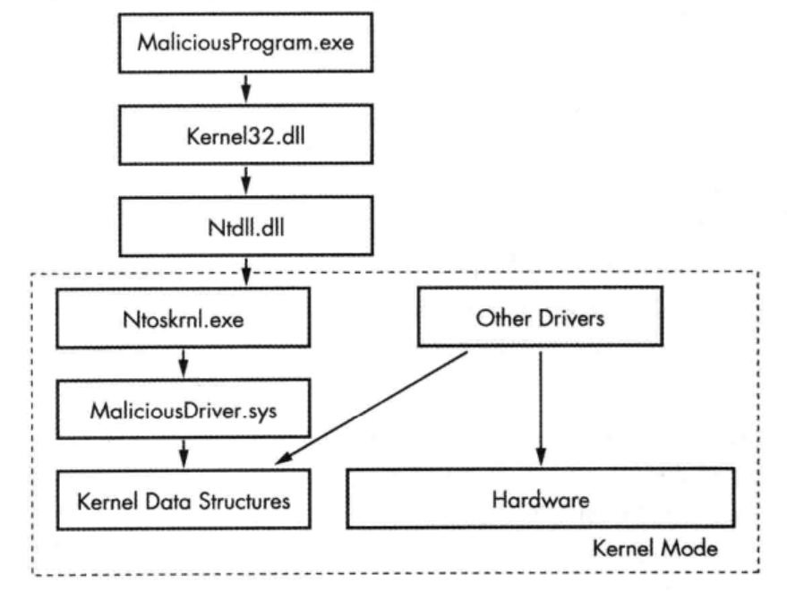

# 第9讲 使用WinDbg调试内核

WinDbg(常被读作“Windbag”)是微软提供的一个免费调试器。

虽然在恶意代码分析中 WinDbg 不如 OllyDbg 调试器那么流行，但是它有很多独特的优点，比如它支持内核调试。

我们将探索使用 WinDbg 进行内核调试和Rootkit分析的方法。

虽然WinDbg也支持用户模式调试，并且下面介绍的内容同时适用于内核模式和用户模式调试，但是恶意代码分析人员通常会使用 OllyDbg 调试器进行用户模式的调试。因此本章的重点是介绍如何使用WinDbg进行内核模式调试。另外，WinDbg 也具有监控Windows系统交互的功能，并且有很多帮助文档。

主要内容有：
- 驱动与内核代码
- 安装内核调试
- 使用WinDbg
- 微软符号表
- 内核调试实践
- Rootkit
- 加载驱动
- Windows 7 和x64版本的内核问题

##  1 驱动与内核代码

为了更好地理解 WinDbg 内核调试，在介绍内核代码调试之前，我们首先介绍内核代码的工作原理、恶意代码使用内核代码的原因，以及内核代码存在的一此特殊挑战等。Windows设备驱动简称为驱动，它让第三方开发商在 Windows 内核模式下运行代码。

由于驱动程序常驻内存，并且负责响应用户态应用程序的请求，因此分析它十分困难。

另外，由于应用程序不直接与驱动程序通信，而是直接访问设备对象，向具体的物理设备发送请求，使得驱动程序更加难以分析。

设备对象由驱动程序创建和销毁，可以被用户态的程序直接访问，但它们井不一定是真实的物理设备。

举例来说，USB闪存驱动器在系统中拥有一个处理USB闪存驱动器请求的驱动，但用户态的应用程序并不能直接发送请求到这个驱动程序.而只能发送请求到一个具体的设备对象。

当用户插入一个USB设备到计算机后，Windows 系统为USB设备创建一个如F:的设备对象。当应用程序发送请求到F:设备后，最终将由F:设备的驱动程序进行处理。第二个USB设各的处理可由同一驱动程序完成，但应用程序必须通过不同设备访问，如G:。

为了系统能够正常工作，驱动程序必须加载到内核空间，这与DLL需加载到进程空间是同样的道理。

当驱动首次被加载时，DriverEntry 函数将被调用，这与DLLMain相似。

与DLL通过函数导出表提供其功能接口不同，驱动通过注册回调函数来提供功能。当用户态的应用程序请求一个服务时，这些回调函数将会被调用。回调函数在DriverEntry程序中被注册。

Windows会为每个驱动创建一个驱动对象，并以参数形式将其传给DriverEntry函数，DriverEntry函数用回调函数填充这个驱动对象。

然后DriverEntry会创建一个可以被用户态应用程序访问的设备对象，应川程序与驱动的交互请求都将通过这个设备对象进行。

考虑来自用户态应用程序的一个读数据请求。最终这个请求被发送到负责管理硬件并存储读入数据的驱动程序。

- 首光，用户态应用程序应该获得该硬件设备的一个文件句柄；
- 然后在该句柄上调用函数ReadFile；
- 接着内核将会处理ReadFile函数的请求，最终由驱动程序的回调函数来响应对I/O设备的读请求。

请求内核态恶意组件的最常见函数是 DeviceIoControl，它是从用户态模块到内核设备的一种通用请求方法。使用该函数时，用户态应用程序传递一个任意长度的缓冲区数据作为输入，并且接收一个任意长度的缓冲区数据作为输出。

用户态应用程序到内核态驱动的调用由操作系统完成，这种调用难以被跟踪。例如，下图展示了清求从用户态程序发起并最终到达一个内核驱动的过程。从图中可以看出，请求由用户态程序发起，最后到达内核驱动。在发送到内核的请求中，一部分请求发送到设备驱动去控制硬件设备，而另外一部分仅影响一些内核的内部状态。



注意：一些内核态恶意代码并没有明显的用户态组件，也没有创建内核对象，他们仅仅运行在驱动程序中。


恶意驱动通常不控制硬件设备，而是与Windows操作系统主要的内核组件 ntoskrn1.exe、hal.dll进行交互。

- ntoskn1.exe组件包含OS核心功能的代码；
- hal.dll包含与主要硬件设备交互的代码。
 
恶意代码常通过从个或者多个这样的内核组件中导入函数，来操纵内核。


##  2 安装内核调试

内核调试比起用户模式调试来说更加复杂，因为进行内核调试时，操作系统将被冻结，这种情况下不可能运行调试器。因此，调试内核的常用方法是使用VMware。

与用户态调试不同，内核调试需要一些初始化设置。
- 首先需要设置虚拟操作系统并开启内核调试；
- 然后配置VMware使虚拟机与宿主系统之间有一条虚拟化的串口；
- 同时还应该配置宿主操作系统的 WinDbg。

虚拟操作系统的设置是编辑 C:\boot.ini (Windows XP)下请确保文件夹选项设置为显示隐藏文件)，
该文件在系统中通常是隐藏的。建议在编辑boot.ini文件之前，为你的虚拟操作系统做一个快照，如
果配置文件错误或者损坏了boot.ini，你可以使用快照还原系统。

下列代码清单，是设置内核调试功能之后，boot.ini文件的内容：
```
[boot loader]
timeout=30
default=multi(0)disk(0)rdisk(0)partition(1)\WINDOWS
[operating systems]
multi(0)disk(0)rdisk(0)partition(1)\WINDOWS="Microsoft Windows XP Professional" /noexecute=optin /fastdetect
multi(0)disk(0)rdisk(0)partition(1)\WINDOWS="Microsoft Windows XP Professional with Kernel Debugging" /noexecute=optin /fastdetect /debug /debugport=COM1 /baudrate=115200

```

当再次开机运行你的虚拟操作系统时，系统会提供一个开启内核调试的选项让你选择。

另外，系统会给你30秒的时间，决定是否以调试模式启动系统。如果想要连接内核调试器 (即WinDbg)，你需要在每次开机时选择调试版本启动项。

>注意:操作系统以调试模式启动，并不意味着需要连接调试器，在没有连接调试器的情况下，系统也会正常运行。

下一步，需要设置VMware,在虚拟操作系统和宿主操作系统之间创建一个虚拟连接。为此，我们
在VMware上添加一个新的设备来使用宿主系统中的一个命名管道上的串口。

下面是关闭虚拟机后，添加设备的步骤:
- 1.单击VMWare Settings，然后会弹出VMware设置对话框。
- 2.在VMware设置对话框中，单击右下角的Add按钮，在弹出的设备类型选择窗口中选择Serial Port,然后单击下一步。
- 3.在请求串口类型的对话框中，选择Output to Named Pipe，然后单击下一步。
- 4.在接下来的窗口中，输入```\\.\pipe\com_1```对管道进行命名，然后选择This end is the server 和 The other end is an application。
- 5.选择轮询时主动放弃CPU。
- 当完成串口的添加后，虚拟机的设置对话框应该与下图中所示的串口设备的配置类似。


完成虚拟机的配置后启动虚拟机。

在宿主操作系统中，使用下列步骤使WinDbg连接虚拟机并开始调试内核。
- 1.启动WinDbgo
- 2.选择File--Kernel Debug单击COM标签，然后输入文件名和先前在oot.ini文件中设置的波特率，本例中我们设置为115200
- 3.选中Pipe复选框后确定。

设置窗口如下图所示：


如果虚拟操作系统处于运行状态，调试器会在数秒内连接到虚拟机操作系统。如果虚拟操作系统没有运行，调试器将处于等待，直到虚拟操作系统启动，启动过程中调试器将连接到被调试系统。

调试器连接后，为了更加个面地获取到调试过程发生的事件，建议在调试过程中启用详细信息输出功能。启用详细信息输出功能后，每当驱动程序被加载和卸载时，你将会得到通知。这些信息在某些情况下可以帮助你识别恶意驱动的加载。