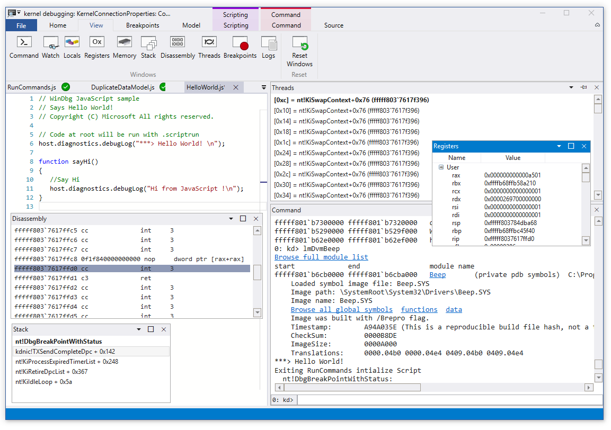

# 第9讲 恶意代码分析实战之使用WinDbg调试内核

WinDbg(常被读作“Windbag”)是微软提供的一个免费调试器。


虽然在恶意代码分析中 WinDbg 不如 OllyDbg 调试器那么流行，但是它有很多独特的优点，比如它支持内核调试。

我们将探索使用 WinDbg 进行内核调试和Rootkit分析的方法。

虽然WinDbg也支持用户模式调试，并且下面介绍的内容同时适用于内核模式和用户模式调试，但是恶意代码分析人员通常会使用 OllyDbg 调试器进行用户模式的调试。因此本章的重点是介绍如何使用WinDbg进行内核模式调试。另外，WinDbg 也具有监控Windows系统交互的功能，并且有很多帮助文档。



主要内容有：
- 驱动与内核代码
- 安装内核调试
- 使用WinDbg
- 微软符号表
- 内核调试实践
- Rootkit
- 加载驱动
- Windows 7 和x64版本的内核问题

## 1 驱动与内核代码

为了更好地理解 WinDbg 内核调试，在介绍内核代码调试之前，我们首先介绍内核代码的工作原理、恶意代码使用内核代码的原因，以及内核代码存在的一此特殊挑战等。Windows设备驱动简称为驱动，它让第三方开发商在 Windows 内核模式下运行代码。

由于驱动程序常驻内存，并且负责响应用户态应用程序的请求，因此分析它十分困难。另外，由于应用程序不直接与驱动程序通信，而是直接访问设备对象，向具体的物理设备发送请求，使得驱动程序更加难以分析。

设备对象由驱动程序创建和销毁，可以被用户态的程序直接访问，但它们井不一定是真实的物理设备。举例来说，USB闪存驱动器在系统中拥有一个处理USB闪存驱动器请求的驱动，但用户态的应用程序并不能直接发送请求到这个驱动程序.而只能发送请求到一个具体的设备对象。

当用户插入一个USB设备到计算机后，Windows 系统为USB设备创建一个如F:的设备对象。当应用程序发送请求到F:设备后，最终将由F:设备的驱动程序进行处理。第二个USB设各的处理可由同一驱动程序完成，但应用程序必须通过不同设备访问，如G:。

为了系统能够正常工作，驱动程序必须加载到内核空间，这与DLL需加载到进程空间是同样的道理。当驱动首次被加载时，DriverEntry 函数将被调用，这与DLLMain相似。与DLL通过函数导出表提供其功能接口不同，驱动通过注册回调函数来提供功能。当用户态的应用程序请求一个服务时，这些回调函数将会被调用。回调函数在DriverEntry程序中被注册。

Windows会为每个驱动创建一个驱动对象，并以参数形式将其传给DriverEntry函数，DriverEntry函数用回调函数填充这个驱动对象。然后DriverEntry会创建一个可以被用户态应用程序访问的设备对象，应川程序与驱动的交互请求都将通过这个设备对象进行。考虑来自用户态应用程序的一个读数据请求。最终这个请求被发送到负责管理硬件并存储读入数据的驱动程序。

- 首光，用户态应用程序应该获得该硬件设备的一个文件句柄；
- 然后在该句柄上调用函数ReadFile；
- 接着内核将会处理ReadFile函数的请求，最终由驱动程序的回调函数来响应对I/O设备的读请求。

请求内核态恶意组件的最常见函数是 DeviceIoControl，它是从用户态模块到内核设备的一种通用请求方法。使用该函数时，用户态应用程序传递一个任意长度的缓冲区数据作为输入，并且接收一个任意长度的缓冲区数据作为输出。

用户态应用程序到内核态驱动的调用由操作系统完成，这种调用难以被跟踪。例如，下图展示了清求从用户态程序发起并最终到达一个内核驱动的过程。从图中可以看出，请求由用户态程序发起，最后到达内核驱动。在发送到内核的请求中，一部分请求发送到设备驱动去控制硬件设备，而另外一部分仅影响一些内核的内部状态。


注意：一些内核态恶意代码并没有明显的用户态组件，也没有创建内核对象，他们仅仅运行在驱动程序中。


恶意驱动通常不控制硬件设备，而是与Windows操作系统主要的内核组件 ntoskrn1.exe、hal.dll进行交互。

- ntoskn1.exe组件包含OS核心功能的代码；
- hal.dll包含与主要硬件设备交互的代码。
 
恶意代码常通过从个或者多个这样的内核组件中导入函数，来操纵内核。


## 2 安装内核调试

内核调试比起用户模式调试来说更加复杂，因为进行内核调试时，操作系统将被冻结，这种情况下不可能运行调试器。因此，调试内核的常用方法是使用VMware。

与用户态调试不同，内核调试需要一些初始化设置。
- 首先需要设置虚拟操作系统并开启内核调试；
- 然后配置VMware使虚拟机与宿主系统之间有一条虚拟化的串口；
- 同时还应该配置宿主操作系统的 WinDbg。

具体步骤请参考实验指导。

## 3 使用 WinDbg

WinDbg的大部分功能通过命令行接口提供，本节将涵盖一些较重要的命令。

### 3.1 从内存中读取

WinDbg的内存窗口支持直接通过命令来查看浏览内存。

#### 3.1.1 命令d

命令 d 用来读取如程序数据、堆栈等内存信息。

- dx 0x401020，以16进制形式显示地址0x401020处的内容。
- da 0x401020，以ASCII文本显示地址0x401020处的内容。
- du 0x401020，以UNICODE进制形式显示地址0x401020处的内容。
- dd 0x401020，以双字形式显示地址0x401020处的内容。

#### 3.1.2 命令 e

命令 e 用来改变程序数据、堆栈等内存信息。


- ex 0x401020 FFFF，表示将地址0x401020处的内容改写为FFFF。

### 3.2 使用算术运算符

WinDbg支持在命令行中进行简单运算，完成对内存和寄存器的直接操作。

- “+” ，表示加
- “-” ，表示减
- “*” ，表示乘
- “/” ，表示除

命令 dwo 用来解引用一个32位的指针，并查看该指针代表的地址。

例如：设置一个函数断点，该函数的第一个参数是一个宽字符串指针，可以通过下列命令查看内容：

```du dwo (esp+4)```

### 3.3 设置断点

命令 bp 用来设置断点。

命令 go(g)，用来执行断点后所有语句，直到下一个断点或程序结束。

例如：下列命令可以每次调用GetProcAddress时，在不中断程序的情况下，打印第二个参数：
```bp GetProcAddress "da dwo (esp +8); g"```

这个例子在每次调用GetProcAddress函数时打印函数名。这是一个比较有用的功能，囚为断点的运行速度远远快于将控制流转到用户后等待用户确认的速度。

当使用条件语句时，如if语句、while循环等，这个命令行字符串会变得相当复杂。另外，WinDbg支持使用这些命令的脚本。

> 注意:有时一些命令会试图访问无效的内存位置，例如GetProcAddress的第二个参数可以是一个字符串也可以是一个序号如果这个参数是一个序号，WinDbg可能会试图解引用一个无效的内存位置。但幸运的是，WinDbg并不会崩溃，而是简单的输出????作为该地址的值。

### 3.4 列举模块

在OllyDbg调试中，内存映射可以列举出所有内存段与加载模块，但是WinDbg却没有相似的功能。

WinDbg 的命令 lm，可以列举出加载到进程空间的所有模块，包括用户模式下的可执行模块，DLL以及内核模式下的内核驱动，同时也会列举出每个模块的起始与结束地址。

## 4 微软符号表

调试符号表是一种帮助信息，它提供了有限的源代码信息，来帮助理解汇编代码。

微软提供的调试符号表中包含某些函数和变量的名字。

在这里所说的调试符号就是某个特定内存地址的一个名称，大多数调试符号提供一个地址名称来表示一个函数，也有一些地址名称表示数据地址。

例如，在没有调试符号信息的情况下，地址```8050f1a2```的函数不会被标注。

如果你已经配置了符号信息，WinDbg将告诉你该函数的名字为```MmCreateProcessAddressSpace```（假设这是地址```8050f1a2```处的函数名)。

仅靠一个地址，你不会了解关于这个函数更多的信息，但这个函数名却告诉我们这个函数创建了一个进程的地址空问。同时，你也可以使用符号名称，来查找内存中的函数和数据。

### 4.1 搜索符号

WinDbg中符号的格式如下：
```moduleName!symbolName```

- 这种语法可以在任意一个拥有正常地址的地方使用。
- 其中moduleName表示.exe. .dll或者.sys格式文件的文件名(不包括其扩一展名)。
- symbolName是与这个地址相关联一个名字。
- ntoskrnl.exe是一个特例，它的module Name是nt，而不是ntoskrnl。

例如，若你想反汇编ntoskrnl.exe中的NtCreateProcess函数：

- 可以使用反汇编命令u(表示反汇编)
- 命令格式: u nt!NtCreateProcess

如果你不指定库名，WinDbg会搜索所有的已加载模块，来寻找匹配的符号。这可能需要花费很长时间，因为它必须加载每个模块，并且搜索每个模块的符号。
    
**bu命令允许使用符号在没有加载的代码中设置一个延迟断点。延迟断点是一个断点，仅当加载一个名字匹配的模块时，延迟断点才会被设置。**

例如，```bu newModule!exportedFunction``` 命令会指示WinDbg：一旦newModule模块加载，在exportedFunction上设置断点。

分析内核模块时，该命令与 ```$iment```命令搭配非常有用，因为它可以确定一个给定模块的入口点。

命令```bu $iment(driverName)```会在任何驱动程序代码运行之前在其入口点设置1个断点。

```x```命令允许你使用通配符来搜索函数或符号。

例如，若你希望寻找执行进程创建的内核函数，可以搜索ntoskrnl.exe中包含字符串 CreateProcess 的所有函数。

命令```x nt!*CreateProcess*```将会显示导出函数和内部函数。

以下是```x nt!*CreateProcess*命令的输出信息。


另一个有用的命令是```Ln```，它用来列出最接近给定内存地址的符号，它可以用来确认指针指向的函数。

例如，若我们看到一个到地址0x805717aa的函数调用，我们想知道这个地址处代码的意图，就可以使用以下命令:
```ln 805717aa```


上面结果中，第一行是相似匹配，最后一行是精确匹配。

### 4.2 查询结构信息

微软符号也包含多个数据结构的类型信息，包括没有被公开的内部类型。

对于恶意代码分析人员，这些信息非常有用，因为恶意代码经常操作未公开的数据结构。下图显示了驱动对象结构的前几行，它存储若个关于内核驱动的信息。


结构的名称预示着结构中存储了什么数据。例如.偏移地址0x00c是一个显示驭动加载位置的指针。

WinDbg允许你覆盖数据结构上的数据。例如，我们知道在偏移地址为828b2648处有一个驱动对象。现在，我们想显示这个结构以及这个结构中的每个值。

可以执行命令：```dt nt!_Driver_OBJECT 828b2648```


这是Windows系统自带的一个beep驱动程序。

当系统出问题时，该驱动程序会发出报警声。我们可以看到当驱动被加载时，调用的初始化函数位于偏移量0xf7adb66c的（1）。

如果这是一个恶意驱动，我们希望能够知道位于这个地址的代码是什么，因为当驱动被加载时，这个位置的代码总是首先被调用。

初始化函数是唯一一个在驱动每次被加载时都调用的函数。有时，恶意代码会将所有的恶意攻击载荷（payload）放在这个初始化函数中。

### 4.3 配置Windows符号表

符号表依赖于被分析文件的具体版本，它们随着文件的更新或修复而改变。如果配置正确，WinDbg将查询微软的服务器，自动获得正在调试文件的正确符号表。

你可以通过选择File Path，来设置符号文件路径。

为了配置WinDbg，让其使用在线符号服务器，输入以路径:

```srv*c:\symbols*https://msdl.microsoft.com/download/symbols```

例如，在执行WinDbg时：
```"C:\Program Files (x86)\Windows Kits\10\Debuggers\x86\windbg.exe" -y "srv*c:\symbols*https://msdl.microsoft.com/download/symbols"```

SRV配置了一个服务器，路径C:\websymhols是符号信息的本地缓存，网址则是微软符号服务器的固定位置。
    
如果要调试的机器并不能一直连接互联网，你可以根据你使用操作系统、服务包、机器的体系结构等信息，手动从微软服务器下载指定的符号包。

符号文件通常有几百兆大小，因为它们包含操作系统和服务包的所有修改和补丁版本的符号信息。

## 5 Rootkit

通过修改操作系统内部函数，来隐藏自己存在的痕迹。通过这种修改，Rootkit可以隐藏一个正在运行程序的文件、进程、网络连接以及其他资源。这使得其恶意活动难以被反病毒产品、管理员以及安全分析员发现。

现在大部分Rootkit都是通过采用某种方式修改操作系统内核来工作的。尽管Rootkit可以使用多种隐藏技术，但在实际应用中，系统服务描述表(SSDT:  System Service Descriptor Table)挂钩技术的使用程度远远超过其他技术。

这种技术已经有多年的历史，与其他rootkits技术相比，它更容易被探测。然而，由于它容易理解、实现灵活且容易，因此到现在它依然被恶意代码所使用。

系统服务描述表(SSDT)，也称为系统服务分发表，微软使用它来查找进入内核的系统调用，它通常不被第三方应用程序或者驱动程序访问。

内核态代码只能被用户态的SYSCALL, SYSENTER或INT 0x2 指令来访问。

当前Windows版本(Windows XP之后)使用SYSENTER指令，它从存储在寄存器EAX的函数代码中获取指令。

下面是ntdll.dll中实现NtCreateFile 函数的一段代码，每次NtCreateFile被调用时，它都会处理用户空间到内核空间的一个转换。


上面代码中（1）处EAX寄存器被设置为0x25，栈指针被保存到EDX寄存器中，然后调用sysenter指令。其中EAX值是NtCreateFile函数的序号。当代码进入内核后，系统会使用这个值作为索引来检索SSDT。

具体来说，在内核模式下，系统会调用SSDT偏移量0x25处（1）的函数。

下面代码展示了SSDT中的部分项，其中包含偏移量0x25处的函数NtCreateFile.


Rootkit挂钩到这些函数后，它将会改变SSDT中某项的值，从而当内核态系统调用发生时，将会调用Rootkit的代码，而不是SSDT中预期的系统函数。在前面的例子中，0x25偏移处的值被改变成恶意驱动中的一个函数指针。

这种改变可以修改函数，使其不能打开或是检查到恶意文件。一般通过在Rootkit代码中调用原始的NtCreateFile函数，并根据Rootkit的配置来过滤返回值。

为了防止其他应用程序获取这些文件的句柄.在调用返回时，Rootkit需要删除需要隐藏的文件。

仅仅挂钩NtCreateFile函数，Rootkit并不能在遍历目录时隐藏一个文件。在本章的实验中，将会看到更加实用的Rootkit，它可以在遍历目录时隐藏文件。

### 5.1 中断

有时，Rootkit会使用中断来干扰系统事件。

现代的处理器实现了用硬件方式触发软件事件的中断。系统发送一条命令到硬件，硬件处理完请求事件后会中断处理器。

有时，驱动或者Rootkit会利用中断来执行代码。驱动程序调用IoConnectInterrupt函数为特定中断注册一个处理程序，然后为这个中断指定一个中断服务例程(ISR)，每当触发该中断时，系统都会调用注册的中断服务例程。

中断描述表(IDT)存储着ISR的信息，在WinDbg中可以通过!idt命令查看。

下面代码展示了一个正常的IDT，其中所有中断都在微软签名的驱动中。


如果中断位于一个没有名字、没有签名或可疑的驱动中，则表明存在Rootkit或者恶意代码。

## 6 加载驱动

本章中，我们假设要分析的恶意代码都有一个加载它的用户态应用程序。假设你拥有一个恶意的驱动程序，但没有用户态应用程序安装它，这个时候就可以用如OSR Driver Loader 的加载工具来加载它。

OSR Driver Loader驱动加载器非常容易使用而且免费，但需要注册。安装了
装OSR Driver Loader，只需在它运行后指定需要加载的驱动，然后单击Register Service和Start Service就可以启动驱动。

## 7 Windows Vista, Windows 7和x64版本的内核问题

新版本的Windows做了很大的改变，这些改变将会影响内核调试的过程，以及内核态恶意代码的有效性。

当前大部分恶意代码主要针对x86平台的Windows XP系统，但是随着Windows 7和x64的日益增加，恶意代码会将目标转移到这些系统。

从Windows Vista开始，最大的一个改变就是boot.ini文件不再用来决定引导哪个系统。

之前，我们使用boot.ini文件来开启内核调试功能。Vista及之后的Windows版本使用一个名为BCDEdit的程序来编辑引导配置数据，因此你可以在新版本的Windows操作系统中，使用BCDEdit开启内核调试。


在安全力而，最大的改变是使用了一种内核保护补丁机制，通常被称为PatchGuard，这种机制从Windows XP开始在x64系统上实施。

内核补丁保护能够阻止第三方程序修改内核，这包括修改内核代码自身、修改系统服务表、修改IDT以及其他补丁修改技术。

引入这种功能时存在一定程度上的争议，因为不仅恶意程序使用内核补丁，正常程序也使用它。例如，防火墙、反病毒程序以及其他一些使用内核补丁来检测和阻止恶意活动的安全产品。
    
同时，在64位系统中，内核补丁保护也能干扰调试过程，因为调试器在插入断点时会修改代码。

因此，如果内核调试器在系统引导时附加到系统的话，补丁保护将不会运行。如果系统引导结束后再将内核调试器附加到系统，PatchGuard将会使系统崩溃。

从64位版本的Vista开始，Windows强制执行驱动签名机制，这也就意味着在没有数字签名的情况下，你不能将驱动加载到Windows Vista系统中。

因为恶意代码通常不会使用数字签名，所以这是一种对抗恶意内核驱动的有效安全措施。

事实上, x64系统上的恶意内核驱动实际上还很少，但是随着x64版本的Windows越来越普及，恶意代码无疑将会解决这一个障碍。

如果你需要加载一个未签名的驱动到x64的 Vista系统中，你可以使用BCDEdit工具去修改引导项。具体来说就是将要求驱动签名的功能关闭，即关闭nointegritychecks。
