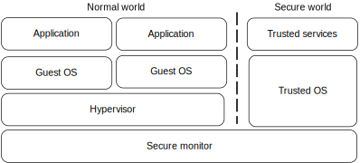
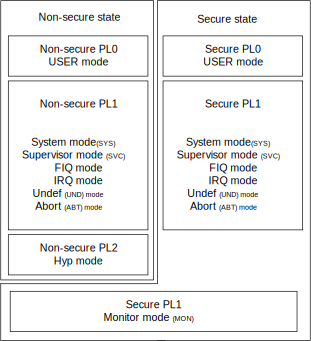
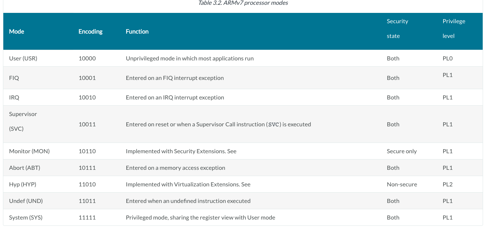
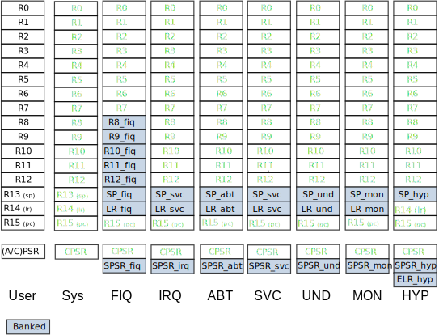

# ARM CPU 模式与寄存器

ARM 架构是一个模型架构。

Privilege 是一种能够执行特定任务的模式，这些任务不能又用户模式执行。
User mode在操作时有限制，这个限制手全局系统配置。例如：MMU 配置和 cache 操作。

处理器模式与异常事件相关联。

## ARMv7-A

### 处理器mode
在有Security Extensions 前他已经有 7 种处理器模式，其中有6个特权模式（privileged modes）和一个非特权用户模式（non-privileged user mode）。

模式类型：
- User（USR）：最常用的模式，大多数程序和应用运行时均为此模式
- FIQ：快速中断异常模式
- IRQ：IRQ中断异常模式
- Supervisor（SVC）：重启或当一个Supervisor Call 指令（SVC）被执行时的模式
- Abort（ABT）：内存访问异常时的模式
- Undef（UND）：进入未定义指令异常
- System（SYS）：在OS运行中的模式，与用户模式共享寄存器。

引入TrustZone Security Extensions 后产生了两个处理器安全状态，这与特权和处理器模式时独立的，有了新的 monitor mode ，作为 Secure 和 Non-Secure状态之间的关口，并且已有modes 与每个安全state相独立。

虽然 TrustZone Security Extensions 被描述了，但对当前实现TZE的处理器，系统安全是通过所有硬件和软件资源的隔离划分来实现，以便他们既存在于安全子系统的安全世界中，也存在于其他非安全世界中。

在这种情况下，Secure Monitor 扮演了一个在两个世界中移动的关口。

如果安全扩展被实现，软件执行在 Monitor mode中，控制Secure 和非Secure状态的转换。

除了已存在的特权模式，ARMv7-A 架构虚拟扩展增加了一个 hypervisor mode （HYP）。虚拟化能够使不止一个OS共存和运行在同一个系统中。ARM VE因此能够是多个OS运行在同一平台上。

如果实现了虚拟化扩展，则有一种不同于以前体系结构的特权模型。在非岸区状态下，有3种特权等级：
- PL0：应用软件特权等级，在user mode 执行。运行在user mode下的软件被描述为非特权软件。这些软件不能访问某些架构特性，特别的，他不能改变许多配置设置。运行在PL0下的软件，仅能使用非特权内存访问。
- PL1：当软件执行在除User 和Hyp外的其他所有模式时，就处于PL1 特权等级下。正常的，OS软件运行在PL1。PL1模式是指除用户模式和Hyp模式之外的所有模式。
- PL2：Hyp mode 通常由一个hypervisor使用。他控制并实现运行在PL1下的客户OS系统的切换。如果实现了VE，一个hypervisor将执行在PL2 下。

这些权限级别与TrustZone安全和正常（非安全）设置分开。

注意：特权等级定义了当前安全状态中访问资源的能力，不意味着在别的安全状态中的访问资源能力。

下图显示了在不同处理器states时，可用的处理器modes：

在表达特定处理器modes 和 states 时，依赖于处理器是否实现了相应的架构扩展，如下图所示：

通用目的OS，例如linux和他的应用，一般安排在非安全状态。安全状态一般被供应商特定固件或安全敏感类软件所占据。有些情况下，运行在安全状态的软件比运行在非安全状态的软件拥有更多特权。

当前处理器mode和执行state被表达在 Current Program Status Register（CPSR）中。改变处理器state和mode可以有特权软件实现，也可以调用异常link到相应的section。

### 寄存器

参考：https://developer.arm.com/documentation/den0013/d/ARM-Processor-Modes-and-Registers/Registers

ARM架构提供了 16 个 32位通用目的寄存器：R0～R15，以供软件使用。前15个 （R0～R14）可用于通用目的数据存储，而 R15 是程序计数器PC，它的值会随着内核执行指令而改变（PC存放当前指令地址）。

软件还可以访问 CPSR 当前程序状态寄存器，以及保存CPSR的值到 SPSR 保存程序状态寄存器。

尽管软件可以访问这些寄存器，但它依赖于软件正在执行是所处的模式（cpu mode），一个寄存器可能对应不同的存储位置。这本称为 banking，共享的寄存器在下图中已被banked。

在所有模式中，“low registers” 和 R15 共享同样的物理存储位置。上图显示了一些“high registers” 被banked用于特定模式。

例如： R8～R12 被banked用于 FIQ mode，也就是说，访问他们将到另外的物理存储位置。

- 除 User 和 System mode， R13 和 SPSR 是 banked的，即各有各的专用存储位置。
- 对于 banked 寄存器，软件通常不指明到底哪个寄存器将被访问，由CPU根据所处mode来自动选择。例如，user mode 下会使用 R13—user，svc mode 会使用 R13-svc
- 所有模式中的 R13 是OS堆栈指针，但是可用于通用目的。
- R14 是链接寄存器，保存了使用BL跳转到某个子程序后的返回地址。它也可用于通用目的。 R14_svc, R14_irq, R14_fiq, R14_abt and R14_und 用于保存 R15 的值，用于异常发生前的指令。
- R15 作为程序计数器，保存了当前程序地址。它在 ARM state 下总是指向当前指令的前 8 个字节，在Thumb state下总是指向当前指令的前 4 个字节。
  - 在ARM state 下读取R15时，bits[1:0] 为 0；bits[31:2] 包含了了PC；
  - 在Thumb state 下读取R15时，bits[0] 为 0；
  - R0～R14 的 reset 时不可预期的；
  - SP指针（R13）必须在启动阶段使用stack前被初始化
- ARM 架构过程调用标准（AAPCS） 或 [ARM 嵌入式ABI](https://developer.arm.com/documentation/den0013/d/Application-Binary-Interfaces?lang=en) 定义了软件如何使用通用寄存器，从而满足在不同工具链或编程语言件的互操作。
### hypervisor mode

### 程序状态寄存器 PSR

在任意给定时刻，都可以访问16个通用寄存器和CPSR寄存器。

- In User mode, a restricted form of the CPSR called the Application Program Status Register (APSR) is accessed instead.

CPSR 用于存储下列内容：
- APSR 寄存器
- 当前处理器mode
- 中断禁止标志
- 当前处理器状态（state），即：ARM state、Thumb state、ThumbEE state、Jazelle state。
- 大小端设置
- 用于IT block的执行 state 位

PSR 形成一个banked 寄存器的额外的集合，每个异常mode都有自己的 SPSR，当一个异常发生时，SPSR 它是前一个异常CPSR内容的拷贝。这些 SPSR 不能在user mode下访问。

应用程序开发人员必须使用 APSR 来访问 CPSR 的内容，CPSR 可能在非特权下被改变。APSR 仅仅能用于访问 N、Z、C、V、Q 和 GE[3:0] 等CSPR位。这些位通常不直接可访问，而是通过条件码设置指令来设置，由可条件执行的指令进行测试。

例如：`CMP R0, R1` 指令比较两个寄存器的值并在相等时设置零标志位 Z 。

下图显示了CPSR的位的定义：

## references

https://developer.arm.com/documentation/den0013/d/ARM-Processor-Modes-and-Registers

