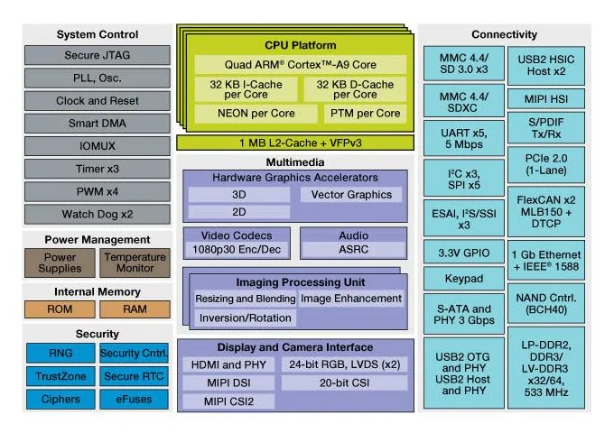
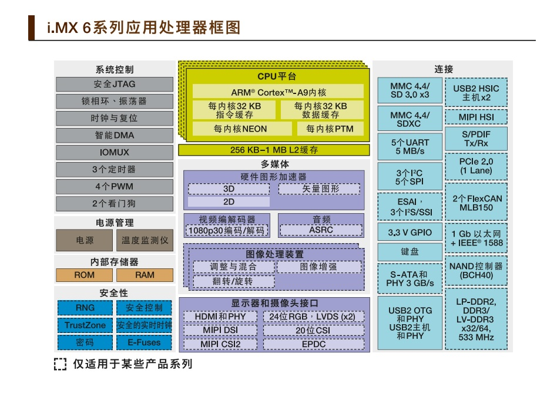
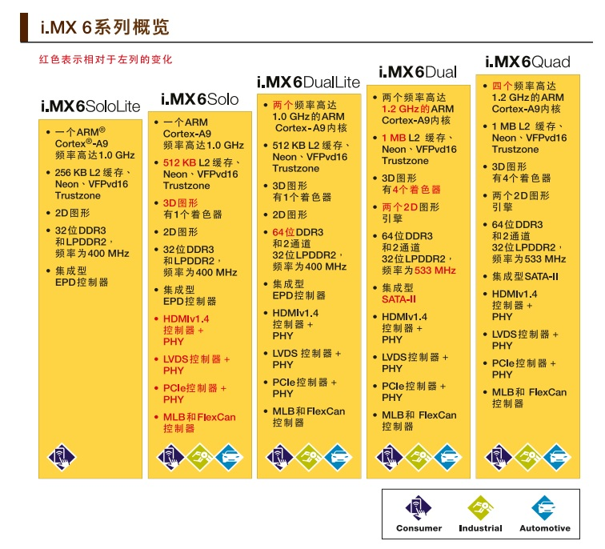
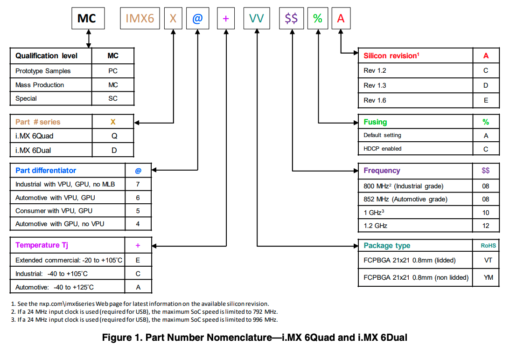
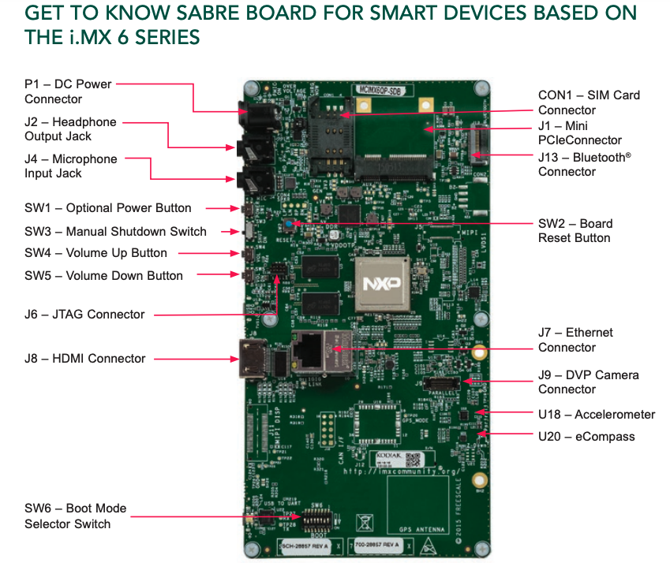
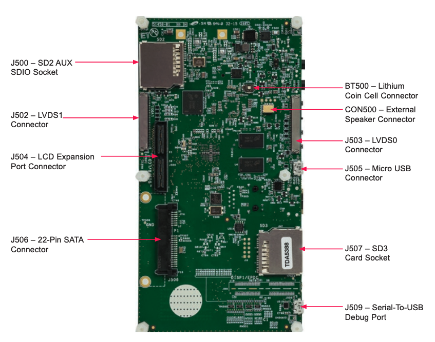

# MCIMX6Q-SDB

NXP i.MX 6Quad Processors - High-Performance, 3D Graphics, HD Video, Arm® Cortex®-A9 Core

i.MX 6Dual/6Quad
Automotive and
Infotainment Applications
Processors 

## 理解处理器
首先要熟悉CPU 的pin脚，以及整个板子的block图。

IMX6Q-SDB使用 IMX6Q的处理器。IMX6系列处理器具有以下功能。

需要注意，虚线框图的注释。适用某些产品，解释为IMX6系列有多种产品线。
查文档后得知，IMX6 CPU系列有好几种CPU，所以需要理清IMX6系列不同CPU之间的区别。如下图所示。

仔细观察SDB板子上CPU代号，MCIMX6Q6AVT10AD。这里对 CPU 的代号进行解析。

找IMX6-6Q的datasheet，找到part number 解析的图。

在[nxp网站](https://www.nxp.com.cn/docs/en/data-sheet/IMX6DQAEC.pdf)上找到 《i.MX 6Dual/6Quad Applications Processor Data Sheet for Automotive Products》的datasheet，里面记录了这个MCIMX6Q6AVT10AD

|Part Number  | Quad/Dual CPU  | Options  | Speed Grade | Temperature Grade| Package |
|-|-|-|-|-|-|
| MCIMX6Q6AVT10AD  |i.MX 6Quad | Includes VPU, GPU  |1 GHz  |Automotive  |21 mm x 21 mm, 0.8 mm pitch, FCPBGA (lidded) |

通过这张图我们可以理解：MCIMX6Q6AVT10AD为：
- mass production
- imx6 Quad 4核
- Automotive with VPU，GPU 车用芯片，带vpu、gpu
- 温度范围为车辆级
- FCPBGA 21*21 0.8mm（lidded）
- 频率为1GHz
- Fusing 为默认设置
- silicon revision为 Rev1.3

## 理解电路板
MCIMX6Q-SDB
SDB：Smart Device system

MCIMX6Q-SDB是NXP Smart Application Blueprint for Rapid Engineering（SABRE）board 即nxp的快速工程化应用蓝图板系列的一种，用于智能设备开发者，具有多核、低功耗。

此时，我们对SDB板，只有初步了解。继续深入下去，有两条路可以选。
1.读datasheet,仔细阅读cpu pin定义，而后与SDB线路图比较。
2.直接看SDB接口，需要的时候看datasheet PIN定义。

在网上找到了 [Quick Start Guide](https://www.mouser.com/pdfDocs/NXP_MCIMX6QP-SDB_QS.pdf)

需要注意的是CPU mem lcd pannel flash等厂商以及参数。
如有可能，需要及时拿到bom以及器件的datasheet.

## 软件支持

从 [Quick Start Guide](https://www.mouser.com/pdfDocs/NXP_MCIMX6QP-SDB_QS.pdf) 上的Jump start your design 部分可以看到一些开发用的支持：
- 文档
  - schematics、layout 、Gerber files
  - quick start guide
- 软件开发工具
  - android BSPs
  - Linux BSPs
- board demo images
  - bootable os demonstration image proivdec on the SDcard

## References

- [NXP i.MX 6Q SABRE Board](https://www.nxp.com/design/development-boards/i-mx-evaluation-and-development-boards/sabre-board-for-smart-devices-based-on-the-i-mx-6quad-applications-processors:RD-IMX6Q-SABRE)
- [Linux BSP](https://www.nxp.com/design/software/embedded-software/linux-software-and-development-tools:CW_BSP)
- [Android BSP](https://www.kynetics.com/android-bsp)