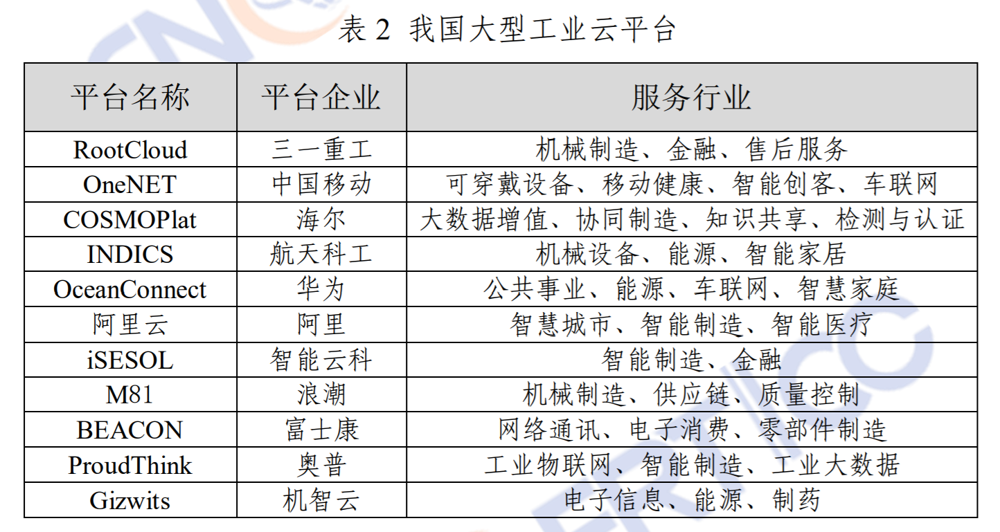

# 2019年我国互联网安全态势

## 2019年我国互联网安全状况

- 1.DDoS攻击呈现高发频发态势，攻击组织性和目的性更加凸显
- 2.APT攻击向重点行业领域渗透，重大活动和敏感时期更为猖獗
- 3.事件型漏洞和高危零日漏洞数量上升，漏洞形式更加严峻
- 4.数据安全防护意识淡薄，大规模数据泄露事件频发
- 5.灰色程序大量出现
- 6.黑产猖獗
- 7.工业控制系统产品安全问题突出
 
## 2020年网安关注方向

- 1.规模性、破坏性急剧上升成为有组织网络攻击新特点
- 2.体系化协同防护将成关键信息基础设施网络安全保障新趋势，《关键信息基础设施安全保护条例》将出台。
- 3.政策法规与执法监管多管齐下为数据安全和个人信息保护提供新指引
- 4.精准网络勒索集中转向中小型企事业单位成为网络黑产新动向
- 5.远程协同热度突增引发新兴业态网络安全风险新思考
- 6.5G 等新技术新应用大量涌现或面临网络安全新挑战

## 对策建议

- 强化关键信息基础设施保护
- 提升数据安全管理和个人信息保护力度
- 加快网络安全核心技术创新突破
  - 建立一体化的防护机制：强化威胁预测、强化态势感知、强化威胁防御。
- 壮大网络安全技术产业规模和网络安全人才队伍
- 扩大国内外网络安全合作

工业控制系统正从专用、封闭状态逐步向通用、开放方向发展，建议进一步加强工业控制系统网络安全研究投入，构建面向新应用形态的高仿真工控系统实验环境，能够满足互联网新技术的融合并持续迭代升级，实现跨行业、跨领域的仿真环境互联互通与共建共用。

## 恶意程序

### 勒索软件
2019年最为活跃的勒索病毒家族：
- GandCrab
- Sodinokibi
- Globelmposter
- CrySiS，全年出现了上百个变种。
- Stop

### 挖矿木马

2019年挖矿木马更加活跃，以下挖矿团伙频繁推出挖矿木马变种：
- “永恒之蓝”下载器木马
- WannaMiner
- BuleHero 

2019 年最为流行的挖矿木马家族：
- WannaMine
- Xmrig
- CoinMiner

### 智能设备上的恶意程序

目前活跃在智能设备上的恶意程序家族超过 15 种，包括：
- Mirai
- Gafgyt
- Dofloo
- Tsunami
- Hajime
- MrBlack 等。

这些恶意程序一般通过漏洞、暴力破解等途径入侵和控制智能设备。联网智能设备被入侵控制后存在大量安全威胁和风险，主要包括用户信息和设备数据泄露、硬件设备遭控制和破坏、被用于DDoS 攻击或其他恶意攻击行为、攻击路由器等网络设备窃取用户上网数据等。2019 年，CNCERT 捕获智能设备恶意程序样本约 324.1 万个，其中大部分属于 Mirai 家族和 Gafgyt 家族（占比 86.1%）。

##  APT

投放高诱惑性邮件钓鱼是大部分APT组织常用方法。2019年，我国重要党政机关收到的此类邮件达50万次。携带恶意代码的 Office 文档成为主要载荷，主要漏洞包括：
- cve-2017-8570
- cve-2017-11882

#### APT 攻击组织

- 海莲花
- 方程式
- APT28
- 蔓灵花
- 黑店
- 白金

## 主要漏洞
2019年，CNVD新收录的通用软硬件漏洞数量达到历史新高，达16193个。

从类型上看，排名前三的是：
- 应用程序漏洞（占 56.2%）
- Web 应用漏洞（占 23.3%）
- 操作系统漏洞（占 10.3%）

从问题厂商来看：
- google
- wordpress
- oracle
- adobe
- mircrosoft
- ibm
- cisco
- cloudbees
- cpanel
- linux
- 其他

- office
  - cve-2017-8570
  - cve-2017-11882
- 微软远程桌面RDP漏洞
  - RDP远程执行漏洞。境内可用RDP的ip由193万个，其中34.9万个受此漏洞影响
- Weblogic WLS组件反序列化漏洞
- ElasticSearch数据库未授权访问漏洞

## 黑产

- 手机号资源接码平台
- 提供IP地址的秒播平台
- 提供支付功能的第4方支付平台
- 跑分平台
- 账号售卖发卡平台
- 为赌博网站推广的广告联盟等
- 社交账号“养号”平台（账号有完整的社交信息，具有迷惑性）
- 恶意注册
- 薅羊毛
- 刷量
- 改机
- 勒索病毒，勒索病毒 GandCrab 的“商业成功”引爆互联网地下黑灰产。
- 挖矿木马

## 工业互联网安全

2019年印发十部门印发了《工业互联网安全工作指导意见》，[查看原文](http://www.gov.cn/xinwen/2019-08/28/content_5425389.htm)

主要任务：
- 推动工业互联网安全责任落实
  - 依法落实企业主体责任
  - 政府履行监督管理责任
- 构建工业互联网安全管理体系
  - 健全安全管理制度
  - 建立分类分级管理机制
  - 建立工业互联网安全标准体系
- 提升企业工业互联网安全防护水平
  - 夯实设备和控制安全
  - 提升网络设备安全
  - 强化平台和工业应用程序安全
- 强化工业互联网数据安全保护能力
  - 强化企业数据安全防护能力
  - 建立工业互联网全产业链数据安全管理体系
- 建设国家工业互联网安全技术手段
  - 建设国家、省、企业三级协同的工业互联网安全技术保障平台
  - 建立工业互联网安全基础资源库
  - 建设工业互联网安全测试验证环境
- 加强工业互联网安全公共服务能力
  - 开展工业互联网安全评估认证
  - 提升工业互联网安全服务水平
- 推动工业互联网安全科技创新与产业发展
  - 支持工业互联网安全科技创新
  - 促进工业互联网安全产业发展

保障措施：
- 加强组织领导，健全工作机制
- 加强支持力度，优化创新环境
- 发挥市场作用，汇聚多方力量
- 加强宣传教育，加快人才培养

### 2019工业互联网安全情况

我国根云、航天云网、OneNET、COSMOPlat、奥普云、机智云等大型工业互联网云平台，其服务行业如表 2 所示，持续遭受来自境外的网络攻击，平均攻击次数达 90 次/日，较上一年提升了 43%，攻击类型如图 19 所示，涉及远程代码执行、拒绝服务、Web 漏洞利用等，工业云平台承载着大量接入设备、业务系统，以及企业、个人信息和重要数据，使其成为网络攻击的重点目标。

## 云平台安全

- 主流云平台各类安全事件仍然较高，DDoS攻击为主、还有被植入后门、盗取数据、篡改网页。
- 攻击者常利用国内云平台发起网络攻击