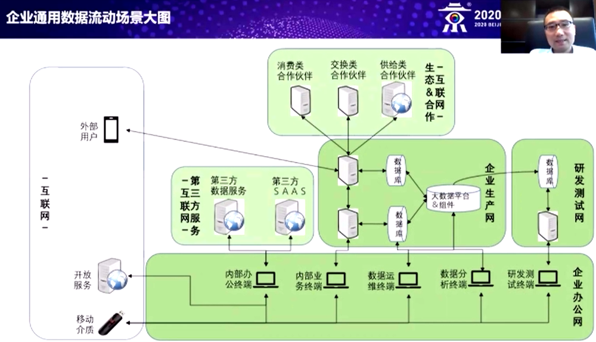
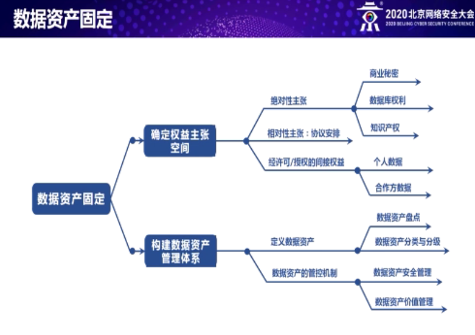

# 2020 北京网络安全大会

## 数据安全

### 科技·安全·生态”：新基建中的关键建设领域安全剖析
>李洋 雪松控股集团CIO

当前的时代是IT时代后的数据技术时代。

大数据平台风险类型和痛点：
- 数据访问风险
  - 缺乏统一账号管理。大数据技术组件多，各成体系，缺乏统一用户账户管理体系。
  - 缺失身份认证管理：大数据组件鉴别访问身份薄弱，对平台访问入口缺乏有效的身份认证手段。
  - 数据授权能力弱：数据使用缺乏细粒度授权方式和精细化的权限控制保护机制。
- 数据流动风险
  - 缺乏审计溯源能力：大数据组件审计能力薄弱，缺乏对数据流动的全面双向审计溯源能力。
  - 平台保护能力较弱：缺乏对数据使用和数据导出的风险控制能力和脱敏保护机制。
  
- 数据运维风险
  - 数据管理成本较大：各类数据汇集，数据量大种类杂，数据资产梳理难，缺乏敏感数据的分类分级手段。
  - 运维行为缺乏监督：系统管理和运维管理权限巨大，其数据行为缺乏有效的监督和控制和追责能力。

管理方法论
- 分维度：数据资产管理维、合规维、风险维度。
- 分场景：金融场景、能源场景、互联网场景。
- 分数据管理过程：规范标准、管理对象梳理、管理对象监控、问题识别、问题处置。

规范标准，要使管理对象可明确、行为可规范；
管理对象梳理，要使对象可感知，属性可关联；
管理对象监控，要使管理对象状态可获取，变化可监控。
问题识别，要使变化影响可评估，变化异常可发现；
问题处置，管理对象风险可处置，效果可度量。

企业数据通用流动图示：

数据安全方法论：
- 事前
  - 威胁建模
  - 设计安全审计
  - 安全技术把关
- 事中
  - 定期安全审计
  - 安全监控
  - 传播控制
- 事后
  - 问题复盘
  - 动态调整
  - 取证溯源

### 全球数据安全监管重点与数据资产化趋势
> 吴涵 北京市金杜律师事务所 合伙人

全球数据安全监管：执法活动频繁、力度增强，数据跨境活动受到限制，网络及数据主权理念被强调。

- 2020.6. 印度新闻部发布消息，新都信息电子与技术部援引《信息技术法案》第639A部分第2009条，禁止用户再印度境内访问59款中国移动应用，理由在于上述应用以非法方式窃取用户数据传输至境外服务器，可能损害印度的主权以及国家安全与公共秩序。
- 2019.1.法国数据保护机构对一家建筑公司开出罚单，其中一个原因是该公司再将拨打印象电话过程中收集的数据传输到非欧洲地区的呼叫中心提供商过程中，未采取有效的数据跨境传输措施。
- 2020.3.Twitter ,Facebook 因为拒绝将数据首次存储在俄罗斯服务器而遭到俄罗斯法院高额处罚。

跨国化运营，首先关注的是数据跨境的问题。数据主权既属地又属人。

企业数据合规成本普遍增加

#### 全球数据资产化的趋势

以个人数据为例，说不清楚。

