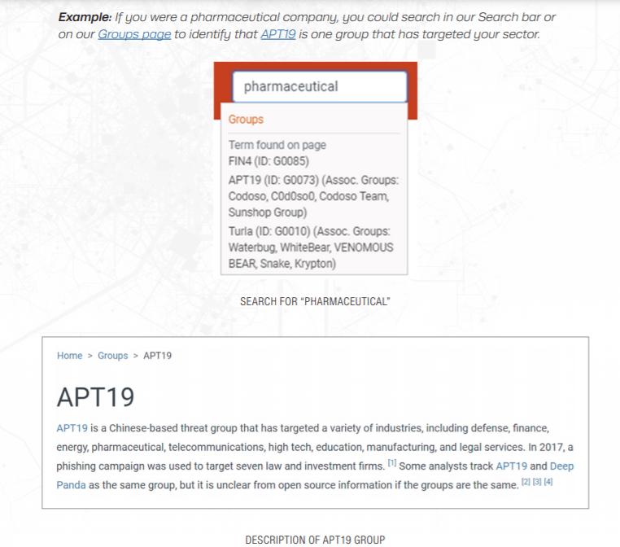
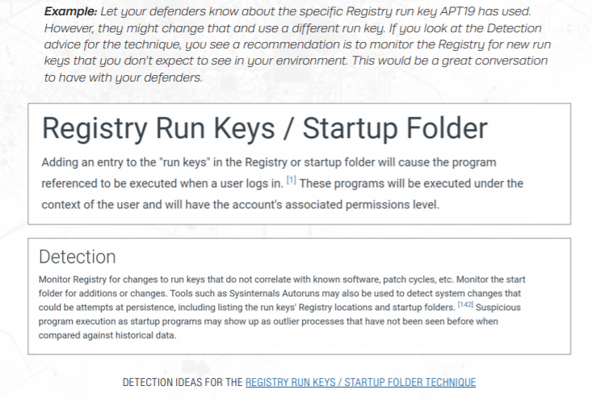
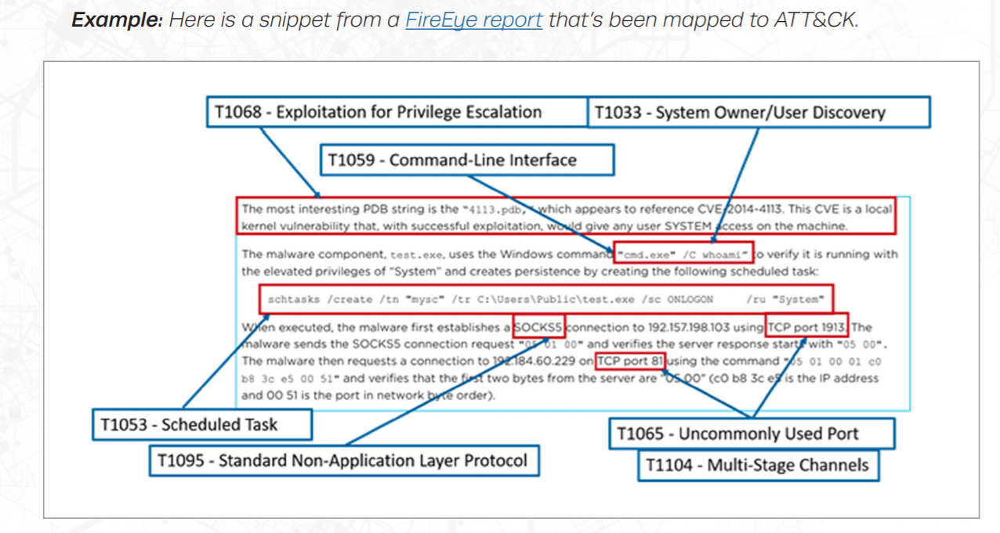
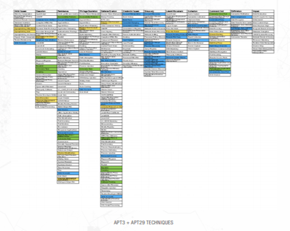

# ATT&CK 框架应用

Adversarial Tactics, Techniques, and Common Knowledge (ATT&CK)

网站：https://attack.mitre.org/

ATT&CK的全称是Adversarial Tactics, Techniques, and Common Knowledge (ATT&CK)。它是一个站在攻击者的视角来描述攻击中各阶段用到的技术的模型。ATT&CK对于任何组织来说都是非常有用的，因为组织需建立一个基于威胁的防御体系。该模型由MITRE公司提出，这个公司一直以来都在为美国军方做威胁建模，之前著名的STIX模型也是由该公司提出的。

官方对ATT&CK定义如下：
> MITRE’s Adversarial Tactics, Techniques, and Common Knowledge (ATT&CK) is a curated knowledge base and model for cyber adversary behavior, reflecting the various phases of an adversary’s attack lifecycle and the platforms they are known to target.

ATT＆CK™View是一种规划工具，可帮助防御者以结构化方法基于MITRE™ATT＆CK™框架设计对手的攻击计划。作为演示，ATT＆CK™View捆绑了由MITRE™开发的针对的xxx完整对手攻击计划

威胁情报（Threat Intelligence）是关于敌对方目标内容和攻击方式方法的所有信息，以提升决策水平。一个小规模组织使用ATT&CK获得威胁情况时，可以拿单一的关注的威胁组织作为起点，按照ATT&CK的结构化方法检查他的攻击行为。

可以先看看[MITRE ATT&CK 罗列的威胁组织](https://attack.mitre.org/groups/)，这些组织大多有特定的攻击目标。或者，许多威胁情报订阅提供方也使用了ATT&CK，你可以引用他们的信息。

例如，如果您是一家制药公司，可以在我们的搜索栏或我们的group页面上搜索，以确定APT19是针对您所在行业的一个组织（group）。

从ATT&CK收集的攻击组织的信息中，查找他们使用的技术（基于一些开源报告），你可以了解关于敌人更多的信息。如果你需要有关技术的更多信息，ATT&CK网站可疑提供。你可以对每个ATT&CK收集的攻击组织使用的每个软件样本进行查看。

在得到上面的攻击者信息、技术信息后，如果运用呢？让我们把这些信息与我们的防护者共享这些信息。你可查看ATT&CK网站，获得一些检测和缓解技术。

总之，开始使用ATT&CK进行威胁情报的一个简单方法是查看您关心的单个敌对group，识别他们的一些行为有助于你告诉你的安全人员他们是如何发现那个群体可能的入侵行为。

如果你有一个威胁分析团队，他们定期审查对手的信息，你可以采取的下一步行动是将威胁情报映射到自己身上，而不是使用其他人已经绘制的映射。如果你有关于事故的报告组织运作良好，这可能是一个大量内部资源映射到ATT&CK，或您可以像博客一样使用外部报告。

例子：

当你不知道所有数百种技术时，试图映射到ATT&CK是很可怕的。下面是一个你可以遵循的过程来帮助解决这个问题。

- 理解 ATT&CK。熟悉ATT&CK的总体结构：tactis（敌人的技术目标）、techniques（如何实现目标）、过程（技术的特定的实现）。
- 发现行为。从更广泛的角度考虑对手的行动，而不仅仅是他们使用的原子指示符（如IP地址）。例如，上述报告中的恶意软件“建立SOCKS5连接”。建立连接的行为是对手采取的行为。
- 研究行为。如果对行为不熟悉，则需要研究具体细节。
- 转换行为为战术。考虑一下对手的技术目标，并选择一个合适的策略。好消息是：在ATT&CK 企业版中只有12种战术可选择。对于SOCKS5连接示例，建立与以后通信的连接属于指挥控制策略(Command and Control tactic)。
- 指出哪种技术会应用于行为。应用经验和ATT&CK网站的例子，分析这部分内容
- 比较不同的分析结论

如果你的团队在威胁情报分析方面非常高端，那么可疑将更多的信息映射到ATT&CK中，然后利用信息设计安全防护。

你可以将内部获外部的信息映射到ATT&CK上，包括：
- 事件响应数据
- 来自开源网络情报OSINT的报告
- 威胁情报订阅者信息
- 实时告警
- 你组织的历史信息

一旦完成这些信息的映射，你就可以做很多很酷的事情。例如，使用矩阵试图。

