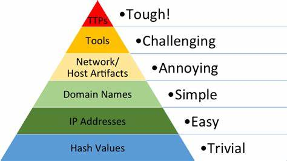
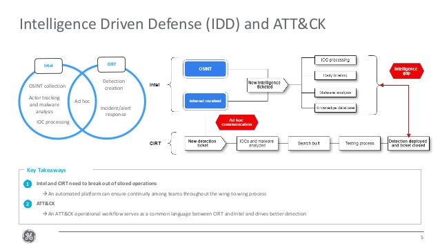
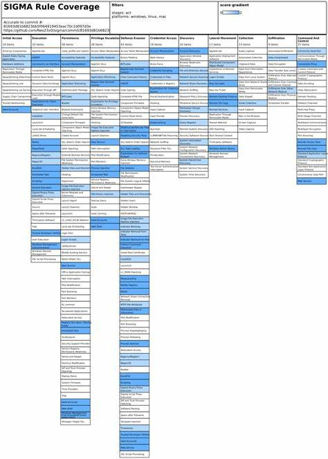

# ATT&CK 解读

## 安全大背景

防御者面临的痛点：
- 我们的防御方案有效么？
- 我们的安全框架工具覆盖范围有重叠吗？
- 我们能检测到APT攻击么？
- 我们收集的数据有用么？
- 新产品对组织的防御有用么？

回答这些问题的难点是
- 难以量化。没有可用的标准进行度量。
- 不清楚APT组织的目的和手段。

痛苦金字塔

- 痛苦金字塔由IOC组成，TTPs（tactics，technologies，procedures）处于痛苦金字塔塔尖。
- 对攻击方：TPPs反映了攻击者的行为，调整TTPs所需付出的时间和金钱成本也最为昂贵。
- 对防御者：由于大多数安全工具并不适合利用TTPs，将其应用到防御中难度是最高的。

## 框架介绍
ATT&CK可以做一把尺子，且能应用于实践。
- 是一个对抗行为的知识库。
- 基于真实观测数据创建。
- 是公开免费的标准。
- 提供了一个沟通交流的通用语言。
- 由社区驱动。

### 核心概念
ATT&CK可分为Enterprise版和Mobile版本。

#### Tactic 战术 （攻击者的目标）
ATT&CK一共有12个Tactic（目标不大会改变，所以战术基本保持为12个）：
- 初始访问
- 执行
- 持久化
- 提升权限
- 防御绕过
- 凭据访问
- 发现
- 横向移动
- 收集
- 命令和控制
- 数据渗透
- 影响

战术是高度抽象的，所以企业版的ATT&CK战术在windows、macOS、Linux上基本一致。无论是IT,OT,IoT都可以应用。

##### 初始访问

尽管ATT&CK并不是按照任何线性顺序排列的，但初始访问是攻击者在企业环境中的立足点。对于企业来说，该战术是从PRE-ATT&CK到ATT&CK的理想过渡点。攻击者会使用不同技术来实现初始访问技术。

例如，假设攻击者使用Spearphishing（鱼叉式）附件。附件本身将利用某种类型的漏洞来实现该级别的访问，例如PowerShell或其它脚本技术。如果执行成功，可以让攻击者采用其它策略和技术来实现其最终目标。幸运的是，由于这些技术众所周知，因此有许多技术和方法可用于减轻和检测每种技术的滥用情况。

此外，安全人员也可以将ATT&CK和CIS控制措施相结合，这将发挥更大作用。对于初始访问这种战术，我认为其中三项CIS控制措施能发挥极大作用。

- 控制措施4：控制管理员权限的使用。如果攻击者可以成功使用有效帐户或让管理员打开spearphishing附件，后续攻击将变得更加轻松。

- 控制措施7：电子邮件和Web浏览器保护。由于这些技术中的许多技术都涉及电子邮件和、Web浏览器的使用，因此，控制措施7中的子控制措施将非常有用。

- 控制措施16：帐户监视和控制。充分了解帐户应执行的操作并锁定权限，不仅有助于限制数据泄露造成的损害，还可以发挥检测网络中有效帐户滥用的功能。

初始访问是攻击者将在企业环境中的落脚点。想要尽早终止攻击，那么“初始访问”将是一个很合适的起点。此外，如果企业已经采用了CIS控制措施并且正在开始采用ATT&CK的方法，这将会很有用。

##### 执行

在对手在进攻中所采取的所有战术中，应用最广泛的战术莫过于“执行”。攻击者在考虑现成的恶意软件、勒索软件或APT攻击时，他们都会选择“执行”。由于恶意软件必须运行，因此防御者就有机会阻止或检测到它。但是，并非所有恶意软件都是可以用杀毒软件轻松查找其恶意可执行文件。

此外，对于命令行界面或PowerShell对于攻击者而言非常有用。许多无文件恶意软件都专门利用了其中一种技术或综合使用这两种技术。这些类型的技术对攻击者的威力在于，终端上已经安装了上述技术，而且很少会删除。系统管理员和高级用户每天都依赖其中一些内置工具。ATT&CK中的缓解控制措施甚至声明了，这些控制措施也无法删除上述技术，只能对其进行审计。而攻击者所依赖的就是，终端上安装采用了这些技术，因此要获得对攻击者的优势，只能对这些技术进行审计，然后将它们相关数据收集到中央位置进行审核。

最后，应用白名单是缓解恶意软件攻击时最有用的控制措施。但和任何技术一样，这不是解决所有问题的灵丹妙药。但是，应用白名单会降低攻击者的速度，并且还可能迫使他们逃离舒适区，尝试其它策略和技术。当攻击者被迫离开自己的舒适区之外时，他们就有可能犯错。

如果企业当前正在应用CIS关键安全控制措施，该战术与控制措施2——已授权和未授权软件清单非常匹配。从缓解的角度来看，企业无法防护自己未知的东西，因此，第一步是要了解自己的财产。要正确利用ATT&CK，企业不仅需要深入了解已安装的应用程序。还要清楚内置工具或附加组件会给企业组织带来的额外风险。在这个环节中，可以采用一些安全厂商的资产清点工具，例如青藤等主机安全厂商都能提供详细的软件资产清单。

##### 持久化

除了勒索软件以外，持久化是最受攻击者追捧的技术之一。攻击者希望尽可能减少工作量，包括减少访问攻击对象的时间。即便运维人员采取重启、更改凭据等措施后，持久化仍然可以让计算机再次感染病毒或维护其现有连接。例如注册表Run键、启动文件夹是最常用的技术，这些注册表键或文件系统位置在每次启动计算机时都会执行。因此攻击者在启动诸如Web浏览器或Microsoft Office等常用应用时开始获得持久化。

此外，还有使用“镜像劫持（IFEO）注入”等技术来修改文件的打开方式，在注册表中创建一个辅助功能的注册表项，并根据镜像劫持的原理添加键值，实现系统在未登录状态下，通过快捷键运行自己的程序。

在所有ATT&CK战术中，笔者认为持久化是最应该关注的战术之一。如果企业在终端上发现恶意软件并将其删除，很有可能它还会重新出现。这可能是因为有漏洞还未修补，但也可能是因为攻击者已经在此或网络上的其它地方建立了持久化。与使用其它一些战术和技术相比，使用持久化攻击应该相对容易一些。

##### 提升权限

所有攻击者都会对提权爱不释手，利用系统漏洞达到root级访问权是攻击者核心目标之一。其中一些技术需要系统级的调用才能正确使用，Hooking和进程注入就是两个示例。该战术中的许多技术都是针对被攻击的底层操作系统而设计，要缓解可能很困难。

ATT&CK提出“应重点防止对抗工具在活动链中的早期阶段运行，并重点识别随后的恶意行为。”这意味着需要利用纵深防御来防止感染病毒，例如终端的外围防御或应用白名单。对于超出ATT&CK建议范围之外的权限升级，一种良好的防止方式是在终端上使用加固基线。例如CIS基线提供了详细的分步指南，指导企业如何加固系统，抵御攻击。

应对此类攻击战术另一个办法是审计日志记录。当攻击者采用其中某些技术时，它们将留下蛛丝马迹，暴露他们的目的。尤其是针对主机侧的日志，如果能够记录服务器的所有运维命令，进行存证以及实时审计。例如，实时审计运维人员在服务器上操作步骤，一旦发现不合规行为可以进行实时告警，也可以作为事后审计存证。也可以将数据信息对接给SOC、态势感知等产品，也可以对接给编排系统。

##### 防御绕过

到目前为止，该战术所拥有的技术是MITRE ATT&CK框架所述战术中最多的。该战术的一个有趣之处是某些恶意软件，例如勒索软件，对防御绕过毫不在乎。他们的唯一目标是在设备上执行一次，然后尽快被发现。

一些技术可以骗过防病毒（AV）产品，让这些防病毒产品根本无法对其进行检查，或者绕过应用白名单技术。例如，禁用安全工具、文件删除和修改注册表都是可以利用的技术。当然防御者可以通过监视终端上的更改并收集关键系统的日志将会让入侵无处遁形。

##### 凭据访问

毫无疑问，攻击者最想要的凭据，尤其是管理凭据。如果攻击者可以登录，为什么要用0Day或冒险采用漏洞入侵呢？这就犹如小偷进入房子，如果能够找到钥匙开门，没人会愿意砸破窗户方式进入。

任何攻击者进入企业都希望保持一定程度的隐身。他们将希望窃取尽可能多的凭据。他们当然可以暴力破解，但这种攻击方式噪声太大了。还有许多窃取哈希密码及哈希传递或离线破解哈希密码的示例。最后，攻击者最喜欢方式是窃取明文密码。明文密码可能存储在明文文件、数据库甚至注册表中。攻击者入侵一个系统、窃取本地哈希密码并破解本地管理员密码并不鲜见。

应对凭据访问最简单办法就是采用复杂密码。建议使用大小写、数字和特殊字符组合，目标是让攻击者难以破解密码。最后一步就是监视有效帐户的使用情况。在很多情况下，是通过有效账户发生的数据泄露。

当然最稳妥办法办法就是启用多因素验证。即使存在针对双重验证的攻击，有双重验证（2FA）总比没有好。通过启用多因素验证，可以确保破解密码的攻击者在访问环境中的关键数据时，仍会遇到另一个障碍。

##### 发现

“发现”战术是一种难以防御的策略。它与洛克希德·马丁网络Kill Chain的侦察阶段有很多相似之处。组织机构要正常运营业务，肯定会暴露某些特定方面的内容。

最常用的是应用白名单，可以解决大多数恶意软件。此外，欺骗防御也是一个很好方法。放置一些虚假信息让攻击者发现，进而检测到对手的活动。通过监视，可以跟踪用户是否正在访问不应访问的文档。

由于用户通常在日常工作中执行各种技术中所述的许多操作，因此，从各种干扰中筛选出恶意活动可能非常困难。理解哪些操作属于正常现象，并为预期行为设定基准时，会在尝试使用这一战术时有所帮助。

##### 横向移动

攻击者在利用单个系统漏洞后，通常会尝试在网络内进行横向移动。甚至通常一次只针对单个系统的勒索软件也试图在网络中移动以寻找其它攻击目标。攻击者通常会先寻找一个落脚点，然后开始在各个系统中移动，寻找更高的访问权限，以期达成最终目标。

在缓解和检测对该特定技术的滥用方面，适当的网络分段可以在很大程度上缓解风险。将关键系统放置在一个子网中，将通用用户放置在另一个子网中，将系统管理员放置在第三个子网中，有助于快速隔离较小网络中的横向移动。在终端和交换机级别都设置防火墙也将有助于限制横向移动。

遵循CIS 控制措施 14——基于需要了解受控访问是一个很好的切入点。除此之外，还应遵循控制措施4——控制管理员权限的使用。攻击者寻求的是管理员凭据，因此，严格控制管理员凭据的使用方式和位置，将会提高攻击者窃取管理员凭据的难度。此控制措施的另一部分是记录管理凭据的使用情况。即使管理员每天都在使用其凭据，但他们应该遵循其常规模式。发现异常行为可能表明攻击者正在滥用有效凭据。

除了监视身份验证日志外，审计日志也很重要。域控制器上的事件ID 4769表示，Kerberos黄金票证密码已重置两次，这可能表明存在票据传递攻击。或者，如果攻击者滥用远程桌面协议，审计日志将提供有关攻击者计算机的信息。
##### 收集

ATT&CK “收集”战术概述了攻击者为了发现和收集实现目标所需的数据而采取的技术。该战术中列出的许多技术都没有关于如何减轻这些技术的实际指导。实际上，大多数都是含糊其辞，称使用应用白名单，或者建议在生命周期的早期阶段阻止攻击者。

但是，企业可以使用该战术中的各种技术，了解更多有关恶意软件是如何处理组织机构中数据的信息。攻击者会尝试窃取有关当前用户的信息，包括屏幕上有什么内容、用户在输入什么内容、用户讨论的内容以及用户的外貌特征。除此之外，他们还会寻求本地系统上的敏感数据以及网络上其它地方的数据。

了解企业存储敏感数据的位置，并采用适当的控制措施加以保护。这个过程遵循CIS控制措施14——基于需要了解受控访问,可以帮助防止数据落入敌手。对于极其敏感的数据，可查看更多的日志记录，了解哪些人正在访问该数据以及他们正在使用该数据做什么。

##### 命令和控制

现在大多数恶意软件都有一定程度的命令和控制权。黑客可以通过命令和控制权来渗透数据、告诉恶意软件下一步执行什么指令。对于每种命令和控制，攻击者都是从远程位置访问网络。因此了解网络上发生的事情对于解决这些技术至关重要。

在许多情况下，正确配置防火墙可以起到一定作用。一些恶意软件家族会试图在不常见的网络端口上隐藏流量，也有一些恶意软件会使用80和443等端口来尝试混入网络噪音中。在这种情况下，企业需要使用边界防火墙来提供威胁情报数据，识别恶意URL和IP地址。虽然这不会阻止所有攻击，但有助于过滤一些常见的恶意软件。

如果边界防火墙无法提供威胁情报，则应将防火墙或边界日志发送到日志服务处理中心，安全引擎服务器可以对该级别数据进行深入分析。例如Splunk等工具为识别恶意命令和控制流量提供了良好的方案。

##### 数据渗漏

攻击者获得访问权限后，会四处搜寻相关数据，然后开始着手数据渗透。但并不是所有恶意软件都能到达这个阶段。例如，勒索软件通常对数据逐渐渗出没有兴趣。与“收集”战术一样，该战术对于如何缓解攻击者获取公司数据，几乎没有提供指导意见。

在数据通过网络渗漏的情况下，建立网络入侵检测或预防系统有助于识别何时传输数据，尤其是在攻击者窃取大量数据（如****库）的情况下。此外，尽管DLP成本高昂，程序复杂，但可以确定敏感数据何时会泄露出去。IDS、IPS和DLP都不是100%准确的，所以部署一个纵深防御体系结构以确保机密数据保持机密。

如果企业组织机构要处理高度敏感的数据，那么应重点关注限制外部驱动器的访问权限，例如USB接口，限制其对这些文件的访问权限，即可禁用他们装载外部驱动器的功能。

要正确地解决这个战术，首先需要知道组织机构的关键数据所在的位置。如果这些数据还在，可以按照CIS 控制措施14——基于需要了解受控访问，来确保数据安全。之后，按照CIS控制措施13——数据保护中的说明了解如何监视试图访问数据的用户。

##### 影响

攻击者试图操纵、中断或破坏企业的系统和数据。用于影响的技术包括破坏或篡改数据。在某些情况下，业务流程可能看起来很好，但可能已经更改为有利于对手的目标。这些技术可能被对手用来完成他们的最终目标，或者为机密泄露提供掩护。

例如攻击者可能破坏特定系统数据和文件，从而中断系统服务和网络资源的可用性。数据销毁可能会通过覆盖本地或远程驱动器上的文件或数据使存储的数据无法恢复。针对这类破坏可以考虑实施IT灾难恢复计划，其中包含用于进行可用于还原组织数据的常规数据备份的过程。

#### 技术 Technologies （目标如何达成）
- 目前有300多种攻击技术。

技术通常分为三个抽象级别：
- 以通用方式应用于多个平台的通用技术；
- 以特定方式应用于多个平台的常规技术；
- 仅适用于一种平台的特定技术。

ATT&CK中的技术信息有：
- 技术名称
- 战术名称
- 详细信息
- 缓解措施
- 检测方式

#### 过程 Procedures （具体技术实现）

### ATT&CK与Kill-Chain的关系
Kill Chain攻击链是一个高度抽象，不易落地的攻击过程描述。分为七个阶段。

ATT&CK四个矩阵包括：
- PRE-ATT&CK，覆盖了Kill Chain模型的前两个阶段；
- Enterprise ATT&CK，覆盖了Kill Chain 的后5个阶段。
- Mobile ATT&CK 
- ICS

### 学习方法
- 尝试使用 ATT&CK Navigator，具有良好的交互性和筛选功能。Navigator项目主要是针对特定技术进行着色，做好标记，为后续工作奠定基础。
- 标记为红色，表示攻击
- 标记为蓝色，表示防守
## 使用场景解析

四大场景：
- 检测分析，使用ATT&CK框架来指导威胁发现活动，设计检测产品和规则。
- 威胁情报：利用威胁情报确定技术检测的优先顺序。现在很多安全产品解决的都是痛苦金字塔下面3层。
- 差距评估：将当前安全控制、方案映射到ATT&CK框架，发现并弥补差距。
- 攻击模拟：模拟攻击者，衡量针对相关威胁的防御措施。属于红蓝对抗、渗透测试的更高级模式。

### 场景一：基于ATT&CK框架的入侵检测分析

- 第1步，选择检测分析的攻击技术，例如 Bypass User Account Control。
- 第2步，查阅检测该技术所需“数据源”，例如检测日志和进程命令行参数。
- 第3步，完成检测脚本和命令。
- 第4步，收集数据。
- 第5步，分析收集到数据源是否可行。数据源是否完整，格式如何。
- 第6步，收集到数据后进行正式分析。
- 第7步：判断是否存在误报等，设计缓解方式。

#### 攻击检测场景推荐项目1  CAR项目（蓝队可用）
CAR项目是分析攻击行为以及如何进行攻击检测的一个项目。CARET项目是CAR的UI可视化项目。

CARET网络图，该图从左到右分为5个部分：
- APT组织
- 攻击技术
- 分析技术
- 数据模型，
- Sensor，指通过哪些事件源采集事件。例如audit，sysmon等

APT组织的行为步骤为从左到右，安全团队分析是从右往左看。在分析列交会。

#### 攻击检测场景推荐项目2 EQL项目（Blue Team）

EQL是一种入侵、威胁事件查询语言，本质上属于威胁捕获的领域，实现与ATT&CK的良好结合，除了提供语言能力外，还提供了很多与TTPs相结合的分析脚本。

- 该项目可以进行事件日志的收集，不局限于终端数据，还可以是网络数据。
- EQL语言有shell类型的PS2，也有lib类型。
- 该语言比较局限的地方是要输入json类似的文件才可以查询。

### 场景2：基于ATT&CK框架的威胁情报生产

- Level 1：依赖于ATT&CK情报。
  - 小安全团体，可以在ATT&CK搜索框中查找行业常见APT组织，了解涉及的技术和缓解措施。
- Level 2：将APT报告映射到ATT&CK框架。
  - 将APT攻击情况映射到ATT&CK框架中，这些威胁情报既可以来源于内部输出，也可以来源于外部渠道。
- Level 3：自己生产威胁情报
  - 将更多的内外部情报映射到ATT&CK，包括事件响应数据、威胁订阅报告、实时警报、组织历史信息等。

情报团队（Intelligence Team）和事件响应团队（CIRT）需要打破隔离：自动化的平台可以确保团队之间的连续性。

ATT&CK工作流程是CIRT和Intel之间的通用语言，可以更好的驱动检测。

#### 威胁情报场景开源项目1 Sigma项目（CTI团队适用）

[Sigma项目](https://github.com/Neo23x0/sigma)是一个SIEM的特征库格式项目：
- 可以直接使用Sigma格式进行威胁检测的描述
- 可以进行共享
- 可以进行不同SIEM系统的格式转换

Sigma规则在ATT&CK框架中的覆盖度

#### 威胁情报场景开源项目2 MISP项目（CTI团队适用）

[恶意软件信息共享平台MISP](https://github.com/MISP/MISP)是一个开源的威胁情报平台，该项目已经集成了ATT&CK框架，可以将MISP中的数据映射到ATT&CK框架中。
- 威胁情报中心会定期同步威胁事件
- 可查看历史威胁情报记录，也可导出相关数据。
- 支持API方式
- 适合威胁情报比较成熟的单位。

### 场景3：基于ATT&CK框架的差距分析

- 评估覆盖范围：映射ATT&CK，评估自身应对攻击的防御技术。
- 确定差距的优先级顺序，确定当前优先级最高的风险。
- 调整防御方案：修改防御策略或采用新手段，解决风险。

既可以比较不同时期的防御水平；也可以横向比较不同部门和厂商的水平。ATT&CK是量化防护能力的标尺。能够反应出安全团队的工作。

#### ATT&CK差距分析场景推荐项目1 Atomic Threat Coverage 

[Atomic Threat Coverage 项目](https://github.com/atc-project/atomic-threat-coverage)类似企业内部使用的一种安全评估场景。

- 红队模拟攻击
- 蓝队检测攻击并作出响应
- CSO利用ATT&CK框架在内部演练、按照ATT&CK覆盖度来观察安全能力的改进情况。
- 该框架将3个团队结合起来，让其按照ATT&CK提供的通用语言与规则。
- 以游戏的方式进行模拟训练，从而达到提升安全防护能力的目的。

#### ATT&CK差距分析场景推荐项目2 DeTT&CT

DeTT&CT帮助蓝队利用ATT&CK 框架提高安全防御水平，帮助防御团队评估日志质量、检测覆盖度的工具。

- 分析数据源数据的覆盖度；
- 分析攻击检测的覆盖度。

可以通过Yaml文件、脚本进行评估，自动导出navigator导航工具可以识别的文件。
快速看出ATT&CK关于数据收集、数据质量、数据丰富度、检测方式的覆盖度。

### 场景4：基于ATT&CK框架的攻击模拟

$攻击模拟 \neq 红队模拟攻击 \neq 渗透测试 \neq 风险扫描$

- 风险（漏洞）扫描：自动化扫描
- 渗透测试：人工，为发现漏洞而进行；受限的测试，以漏洞为目标。
- 红队：真正的攻击，没有限制。模拟真的黑客组织，目的不是漏洞，而是系统控制和数据。
- 攻击模拟：是最高阶段。红队攻击带有特定的技术和目的，但攻击模拟还要模拟APT组织的攻击，既不仅扮演自己还要扮演其他高级团队。

#### 基于ATT&CK框架的攻击模拟推荐项目1 atomic-red-team项目（red team）
由Red Canary公司推出的非常著名的红队项目。很有研究价值。

MITRE的caldea项目较atomic-red-team项目还有差距

#### 基于ATT&CK框架的攻击模拟推荐项目2 Tools项目（red team）

APT3模拟计划：
- 第一步初步尝试渗透
- 第二步网络扩展渗透
- 第三步真正实施攻击。

可以用于制作PLAN，用于和客户交互沟通。

### 场景5 SOC成熟度评估

ATT＆CK可用作一种度量，确定SOC在检测、分析和响应入侵方面的有效性。SOC团队可以参考ATT＆CK已检测到或未涵盖的技术和战术。这有助于了解防御优势和劣势在哪里，并验证缓解和检测控制措施，并可以发现配置错误和其他操作问题。

## 威胁捕获实践

### 被动发现vs主动发现

被动发现（安全领域应用很多，基于报警和已存在威胁。）：
- firewall
- ipds
- av software
- sandbox
- SIEM

主动发现（反恐应用很多，安全领域还少）：
- Threat Hunting
  - 依赖细粒度数据
  - 基于假设-分析验证

### 威胁捕获过程与方式

一个循环过程：
- 创建假设
  - 是否有攻击者隐藏在这里；
  - 如果我是一个攻击者，我将这样做；
  - 确定攻击者是否在内网站稳脚跟。
- 调研所需工具与技术
- 发现新模式与TTPs
- 通知并丰富事件分析结果

威胁捕获的3种方式：
- 基于分析
  - 机器学习和UEBA
  - 自动分析细粒度数据
- 基于重点
  - 皇冠珍珠分析
  - 企业风险分析
  - 公司及员工级趋势
- 基于情报
  - 威胁情报报告
  - 威胁情报源
  - 风险扫描

理想的SoC应该有3部分构成：
- SIEM（完整的事件收集，支持细粒度数据采集）
- Threat Hunting（提供SOAP可用的case）
- SOAP（自动化编码安全处置工作）