# DevOps

DevOps 是一种流程、管理、架构和文化。它是重视开发人员和运维人员沟通合作的文化，运动或管理。通过自动化软件交付和架构变更的流程，使得构建、测试、发布软甲更快捷、频发、可靠。


## devops概念

### 背景
- 传统瀑布模型中流程过程（问题定义、可行性分析、需求分析；系统设计、系统编写、系统测试于调试；系统部署与交付、系统维护和升级），很多企业分为三套人马来实现，很容易出现三不管、推诿责任、任务延迟等。
- 现代应用交付场景的变革要求有app，web，大团队变为多个小组，互联网交付，越来越多元、快速、敏捷。
- 随着devops工具逐渐成熟，甚至构成了devops元素周期表，DevOps开始被广泛应用。

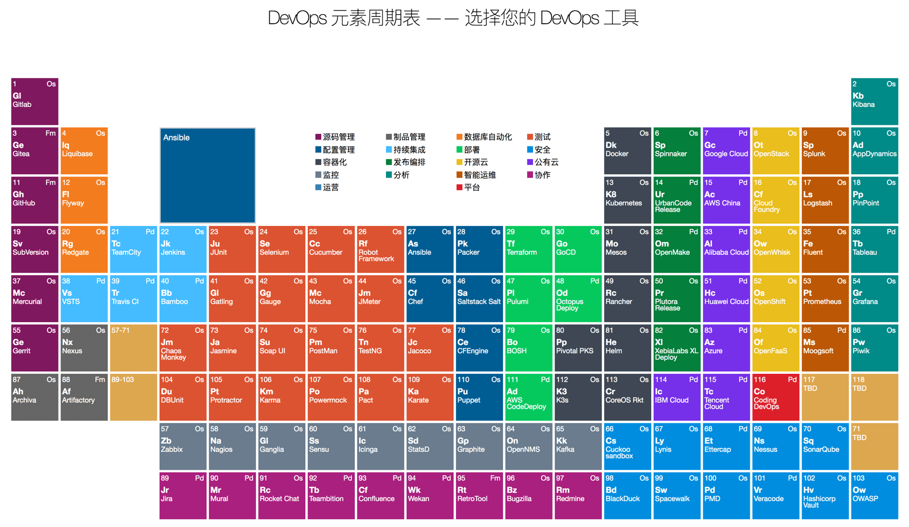


### 现有的devops flow
从流程看包含：Plan，code，build，test，release，deploy，operate，monitor。

工具上看：
- plan阶段：slack, basecamp, gitlab, trello，office，project，enterprise architect，ibm rational。
- code阶段：git, vagrant,ansible,puppet enterprise,kubernetes
- build阶段：jenkins, gradle, bamboo，git，github，mercurial，eclipse，cobertura，docker，plastic，perforce，
- test阶段：querysurge，selenium，cucumber，jmeter
- release阶段：jenkins，CA release，Electric cloud
- deploy阶段：kubernetes，urbancode deploy，xebialabs，CA release automation，jenkins
- operate阶段：splunk，prometheus，moogsoft
- monitor阶段：splunk, nagios, prometheus

**但注意devops不只是流程+工具**

现在安全融入其中，成为devsecops：

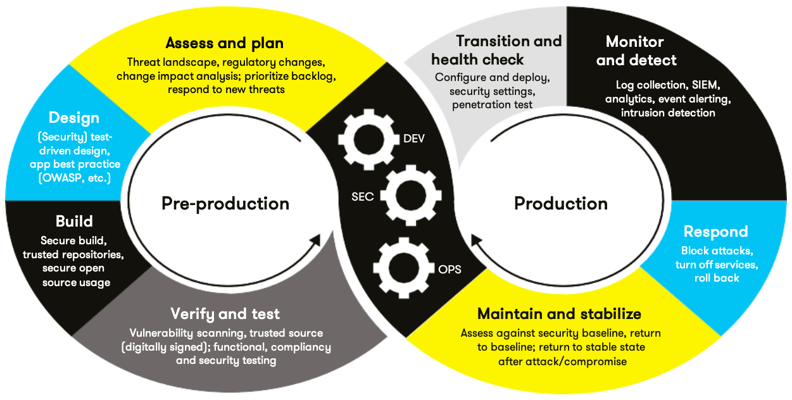


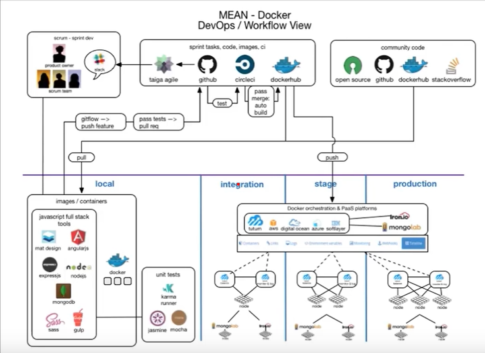

别人家的不一定合适。盲目照搬会有”大象问题“

### Devops 内涵

- Devops is about workflow **流程化、标准化**减少脱节环节时间浪费；
- Devops is about culture **节约时间**人人有责
- Devops is about automation **自动化**降低人工时间消耗
- Devops is about quality **质量**的提升可以避免返工。

可以这么理解：初创原型后，经优化成为流程惯例；流程经优化形成标准；标准经优化成为效率化标准；效率化标准再经优化成为自动化标准；自动化再经优化可跃升为智能标准。

DevOps核心是时间和质量的优化。期望消除等待和浪费。

开发运维中的时间杀手：各环节之间间的等待。等待基础架构、等待应用部署、等待其它团队、等待审核...开发运维中的质量杀手：各环节的质量控制不标准；质量控制依赖于人；质量控制纠错不及时...

DevOps就是要消除（使用自动化）：
- 不必要的流程
- 不必要的特性
- 不必要的人工
- 不必要的返工


### 正反案例

#### 反面案例
A公司成立了专门的devops部门，负责公司从基础设施、应用测试、系统集成等全方位工作，将基础设施的变更、系统变更等通过代码进行抽象，建立自动化系统实现devops。（概念性错误，过于理想，难以实现）

B公司采购了某咨询公司的方案，要求所有应用通过devops的流程和系统进行规约开发，严格遵守上线流程，代码上线要有90%的覆盖度，要求包含单元测试、E2E测试、黑盒测试、质量测试等，不定期召开小组会议评审交付，实现devops交付。（教条主义）

上面两个案例主要的问题就是基本上废弃了原有流程和经验，全新的架构、管理、流程通常会给企业带来灾难。

#### 正面案例

C公司拥有数万员工，成立了质量保证和交付团队，开发持续交付平台，并整合发布系统，通过容器的方式降低由于框架和版本差异带来的交付问题；通过自动容器化工具降低开发的学习成本和技术成本；通过兼容的发布方式，一键迁移原有的发布系统到现有的集成交付平台；通过配置文件的方式支持支持多种测试、质量保证的接入，质量团队提供标准模板，对于不同的应用提供多种可选模板实现快速测试与质量保证。（质量平台型的持续交付）

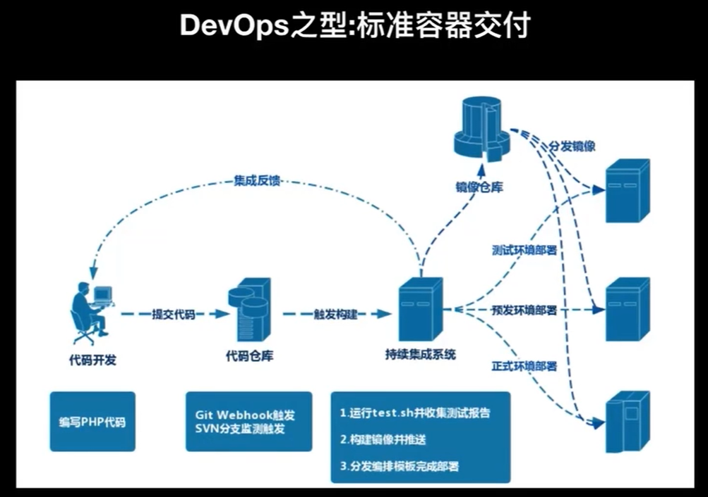

D公司拥有十余名极客工程师，公司有十几个产品线，数十个应用，每个工程师自己提供dockerfile和部署的yaml文件，并在团队的jenkins上构建自己的任务，通过jenkins blueocean的git workflow 实现快速交付，并定期相互交交付规范，逐渐统一交付标准。（灵活简单型的持续交付）

### devops的外形

传统应用交付方式下的DevOps过程：
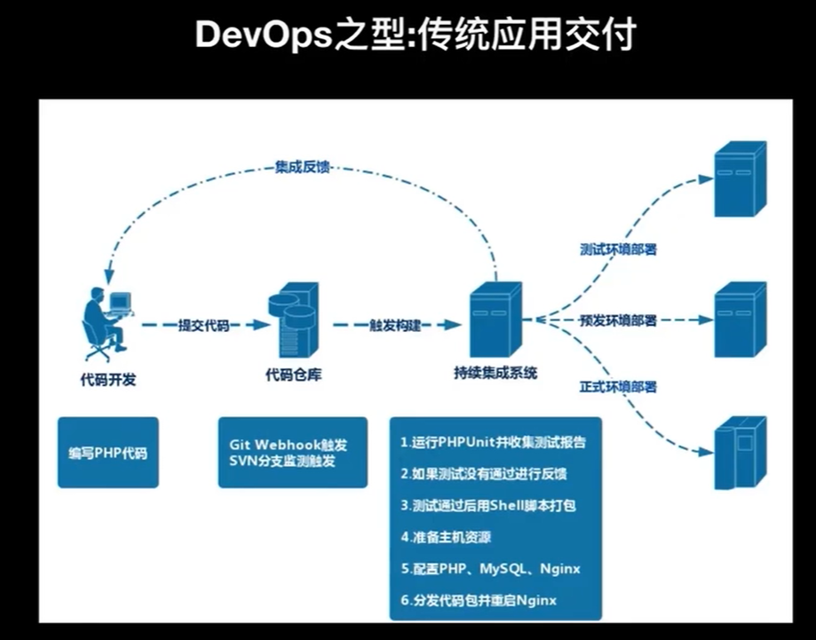

现代标准容器交付DevOps过程：


Devops不仅是自动化，更多是开发方式、流程的变革。由于团队架构、工具生态、技术架构等因素，自2007出现以后直到2018年前后才变得大量落地。主要是微服务和容器的出现推动了devops。

### 微服务
2014 martin fowler 和james lewis共同提出的概念。定义了微服务是由以单一应用程序构成的小服务，微服务之间相互解耦，以全自动方式部署，与其它服务使用 HTTP API 通信。同时，服务会使用最小规模的集中管理（如docker）能力，服务可以用不同的编程语言与数据等元件。


特点：
- 服务组件化，每个最简都有完整的生命周期，包含自己的api，可独立存在；
- 安装业务组织团队：缩小模块的边界，每个模块可以独立负责；
- 做产品的态度：模块的owner要以产品思维，考虑模块的设计和演进
- 智能端点和哑管道：服务之间调用的端点，可以动态获取，以服务发现的方式提供，对于出错的场景提供熔断器。
- 去中心化治理：根据业务特点选择语言和框架
- 去中心化管理数据：不同的模块使用不同的库或表，不会出现相互调用的场景
- 基础设施自动化：自动部署、自动交付
- 容错设计：组件是不可信的，对于失败的状态需要有降级的处理
- 演进式设计：设计组件的时候需要明确和规划组件的边界。

#### 示例：打车软件设计微服务化

微服务化之前的架构，各种对外服务接口依赖中心。这个系统本身很复杂，某一个组件出错会影响全局。
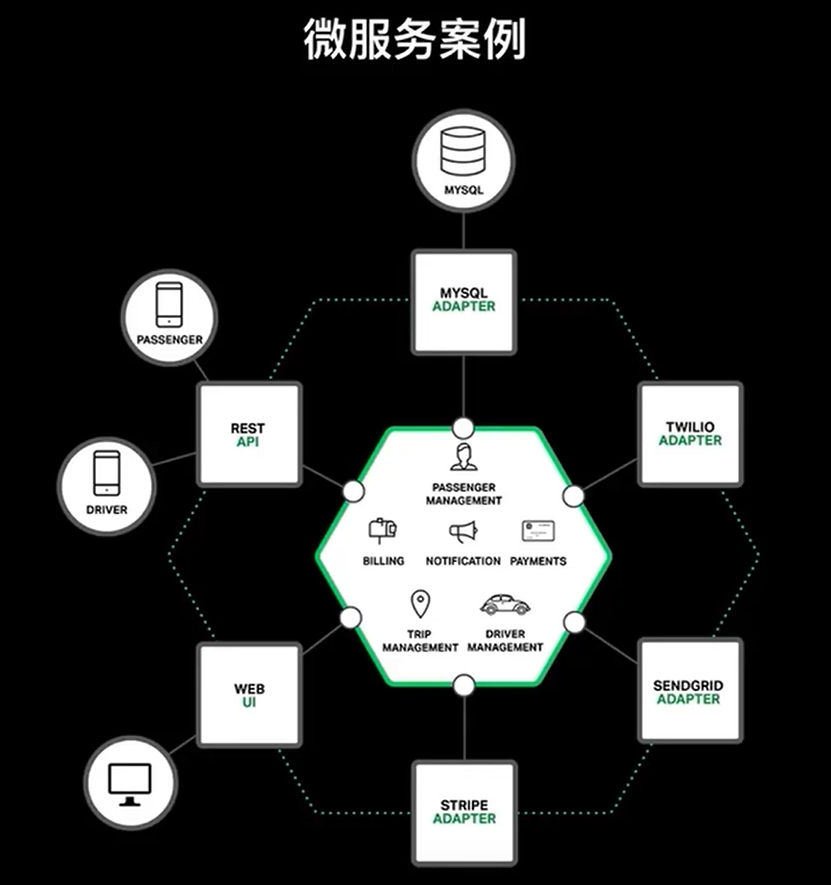

微服务重构系统：
- 将原有系统拆解为：passenger 管理、driver管理、trip管理、billing管理、payments、notfication。
  - 3个gatway passenger 管理、driver管理、trip管理
  - 3个webservice billing管理、payments、notfication
- 由api gateway提供完整功能
- 使用web ui包装底层，实现web端应用。


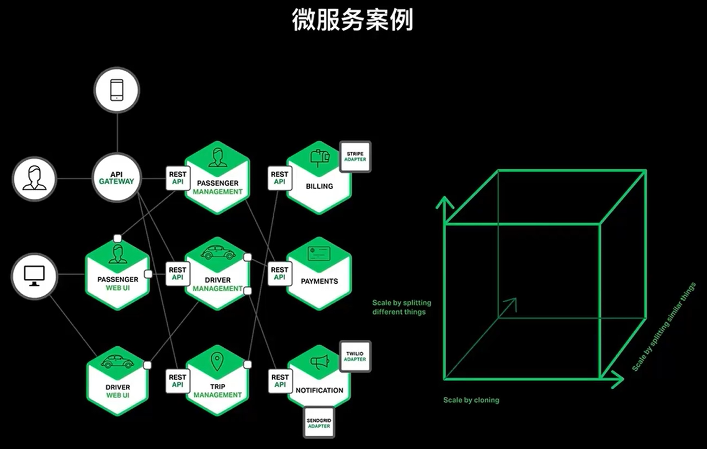

微服务是按不同类型扩展。下面3列都有独自库或表。

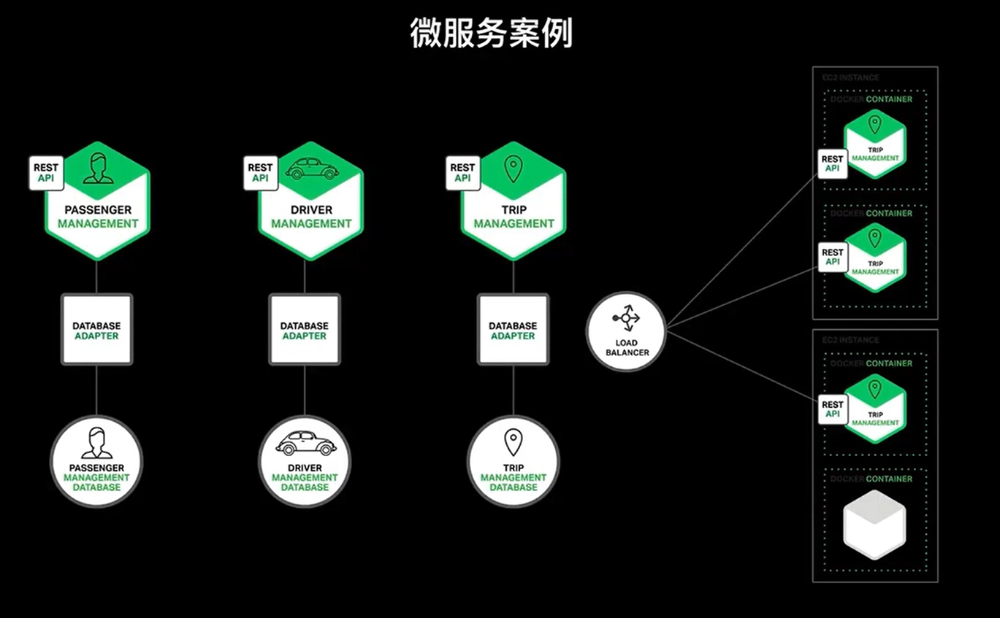

#### 微服务的优势：
- 将大型单体系统拆分为多个微服务，可以解决应用复杂性的问题；
- 每个微服务可以更好的切分业务；
- 每个微服务由专门团队负责，可以自行选择最佳技术栈实现，使得演进方便，降低历史技术债务。
- 微服务之间低耦合，互相影响弱，可独立升级，相互不信任，可方便降级。
- 微服务切分后都是独立部署，可根据业务特征动态调整。

以上优点非常契合DevOps。优化时间和质量。实现分而治之、连续集成、快速交付。

#### 微服务的缺点

- 将大型负责应用系统拆分为微服务涉及系统分布式改造，技术成本高；
- 更清晰的边界划分，意味着各自为政，使标准化变得困难；微服务依赖上层框架进行规约；
- 单体应用内的通信成本，远低于微服务间的通信成本；
- 管理多个组件或组件拓扑，成为微服务系统的头等要务；
- 数据库设计和业务规划成为微服务难点，对开发者要求更高。

总的来看：架构方式、管理方式、自动化集成方式、标准化方式等的要求更高了。

### 容器

#### Docker

一个开源的应用容器引擎。

几个重要概念：
- dockerfile：配置文件，用来生成docker image
- docker image：交付部署的最小单元
- docker 命令与api：操作docker即image，支持三方系统集成。

#####  示例
dockerfile 示例
```dockerfile
FROM 
COPY . /app
RUN make /app
CMD python /app/app.py

```

更为真实的示例：

```dockerfile
FROM

RUN \
  add-apt-repository -y ppa:nginx/stable && \
  apt-get install


```


###### 常见dockerfile语法
- FORM
- MAINTAINER leo<hhh@1.com>（可用LABEL替代）
- RUN
- LABEL app="demo" （kubernetes中常用）
- EXPOSE 80/tcp
- ENV app demo
- ADD src dest (ADD是COPY的超级，支持压缩包和远程路径)
- COPY src dest （常用）
- ENTRYPOINT ["executable","param1"]
  - 是/bin/sh -c 执行的，不是PID1的进程，无法收到信号量（例如关闭）
- CMD  ["executable","param1"] 
  - CMD会自动添加到ENTRYPOIT后面，CMD不会被dockerfiles继承
- SHELL  ["executable","param1"]
  - linux下  ["/bin/sh","-c"]
  - windows下 ["cmd","/S","/c"]
- VOLUME /myvol
- USER root
- WORKDIR /myvol
- ONBUILD RUN /usr/local/bin/python-build --dir /app/src
- STOPSIGNAL SIGKILL
- HEALTHCHECK --interval=5m --timeout=3s CMD curl -f http://localhost/ || exit 1

##### 编排模板

```yaml
web:
  image:registry.aliyuncs.com/acs-sample/wordpress:4.5
  environment:

```

##### docker 命令 与 api


#### 容器能解决微服务的一些问题
- Dockerfile 将各个微服务的一些技术细节（语言、框架等）进行了封装；
- Docker image 成为最小交付单元，降低了交付复杂性（便于自动化集成和管理）
- Docker 的 API 以及上层编排系统（Kubernetes等）实现了拓扑管理（便于管理和管理标准化）
- 丰富的容器生态使微服务不仅从交付上，而且从架构上得到了支持。

#### 容器交付自身的难点与问题
- 使用容器有较高学习成本、技术成本；
- 容器架构与现有架构集成存在问题
- 容器的交付改变了现有的交付方式，引入更多步骤和成本。

解决办法：
- 使用阿里云等云服务商的容器服务。

### 小结


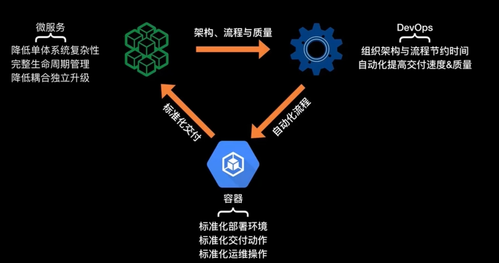


## 快速高质量的应用容器化迁移

### 容器化交付流程划分

可分为4个大阶段：
- 本地开发阶段
  - 代码编写
  - 测试编写
  - 容器化测试
  - dockerfile编写
  - 编排模板编写

- 持续集成与持续交付
  - 构建代码
  - 打包构建产物
  - 构建docker镜像
  - 推送docker镜像
  - 部署编排模板

- 环境部署
  - 调整应用拓扑
  - 调整接入层配置
  - 调整扩缩容配置

- 监控、运维、调优
  - 基础监控资源设置告警
  - APM监控应用内部指标
  - 安装调优工具进行调优

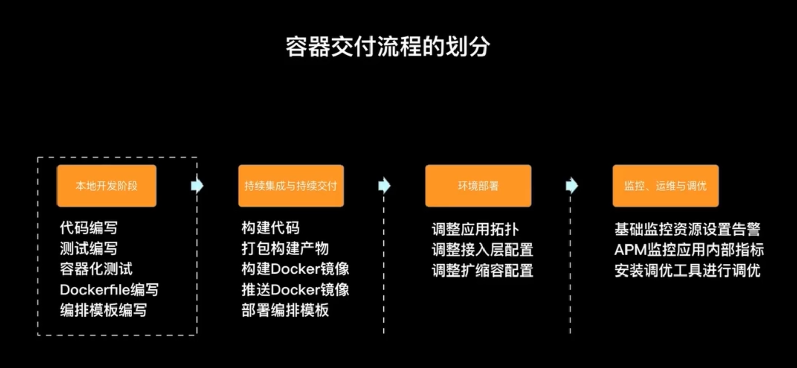


### 标准化交付的理论基础

#### cloud foundry 
cf是vmware推出的业界第一个开源paas云平台，使开发人员快速进行应用部署和扩展，无需担心基础架构问题。

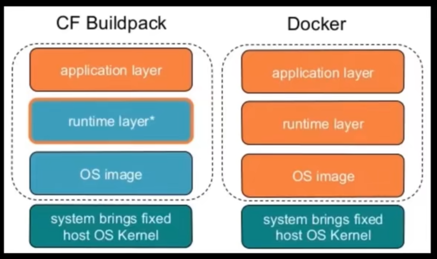

CF将运行的应用分成了application layer、runtime layer、os image layer，认为任何运行时的应用都可以通过这3个维度进行抽象表达。

从这个角度考虑，如何包装和实现这3个层次的定义，达到标准化交付的目的，就是CF或docker所要做的。

Dockerfile实现了这3个层次的抽象。例如：

- os image layer：`FORM ubuntu：15.04`
- Runtime layer：`COPY . /app` 和 `Run make app`
- Application layer: `CMD python /app/app.py`

#### 从dockerfile到docker image


dockerfile中的每一条指令都是一个layer，而docker image 就是一个由多个layer组成的文件，相较于普通的iso系统镜像而言，分层存储由两个优点：
- 比较容易扩展
- 可以优化存储空间

##### Docker image的底层实现

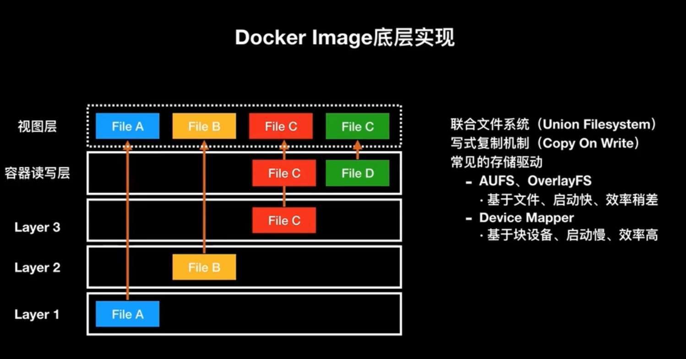

##### 优化dockers image

优化思路：
- 尽量减少layer，尽量把一些功能上相同的命令合起来。
- 删除不必要的中间产物，如安装包、cache文件和临时文件
- 注意优化网络请求，使用快速镜像。
- 尽量去用构建缓存，把不变的或变化少的放在前面，形成缓存；
- 多阶段进行镜像构建，例如可以将构建和最终产物分开。

下面举例说明：

- 初学者写的dockerfile

```dockerfile
FROM openjdk:8-jdk-alpine

LABEL com.project.version="1.0"
LABEL com.project.release="2017-09-09"

RUN wget http://muug.ca/mirror/apache-dist/maven/maven-3/3.5.0/binaries/apache-maven-3.5.0-bin.tar.gz
RUN tar xzvf apache-maven-3.5.0-bin.tar.gz
RUN cp -R apache-maven-3.5.0 /usr/local/bin
RUN export PATH=apache-maven-3.5.0/bin:$PATH
RUN export PATH=/usr/local/bin/apache-maven-3.5.0/bin:$PATH
RUN ln -s /usr/local/bin/PATH=apache-maven-3.5.0/bin/mvn /usr/local/bin/mvn

ADD ./pom.xml pom.xml
ADD ./src src/

RUN mvn clean package
RUN cp target/app-*.jar app.jar

CMD ["java","-jar","app.jar"]
```

- 第一次优化: 合并多行cmd run等命令为一行。17 层layer变为7层。

```dockerfile
FROM openjdk:8-jdk-alpine

LABEL com.project.version="1.0" \
      com.project.release="2017-09-09"

RUN wget http://muug.ca/mirror/apache-dist/maven/maven-3/3.5.0/binaries/apache-maven-3.5.0-bin.tar.gz \
  && tar xzvf apache-maven-3.5.0-bin.tar.gz \
  && cp -R apache-maven-3.5.0 /usr/local/bin \
  && export PATH=apache-maven-3.5.0/bin:$PATH \
  &&  export PATH=/usr/local/bin/apache-maven-3.5.0/bin:$PATH \
  && ln -s /usr/local/bin/PATH=apache-maven-3.5.0/bin/mvn /usr/local/bin/mvn

ADD ./pom.xml pom.xml
ADD ./src src/

RUN mvn clean package \
    && cp target/app-*.jar app.jar

CMD ["java","-jar","app.jar"]
```

- 第二次优化：删除不必要的安装包、cache文件和临时文件，使得 137M变为119M，20M的减少带来性能10s以上的优化。

```dockerfile
FROM openjdk:8-jdk-alpine

LABEL com.project.version="1.0" \
      com.project.release="2017-09-09"

RUN wget http://muug.ca/mirror/apache-dist/maven/maven-3/3.5.0/binaries/apache-maven-3.5.0-bin.tar.gz \
  && tar xzvf apache-maven-3.5.0-bin.tar.gz \
  && cp -R apache-maven-3.5.0 /usr/local/bin \
  && export PATH=apache-maven-3.5.0/bin:$PATH \
  &&  export PATH=/usr/local/bin/apache-maven-3.5.0/bin:$PATH \
  && ln -s /usr/local/bin/PATH=apache-maven-3.5.0/bin/mvn /usr/local/bin/mvn \
  && rm -rf apache-maven-3.5.0-bin.tar.gz apache-maven-3.5.0


ADD ./pom.xml pom.xml
ADD ./src src/

RUN mvn clean package \
    && cp target/app-*.jar app.jar

RUN apt-get update && apt-get install -y \ 
  aufs-tools \ 
  automake \ 
  build-essential \ 
  curl \ 
  && rm -rf /var/lib/apt/lists/*


CMD ["java","-jar","app.jar"]
```


- 第三次优化：利用缓存进行优化。dockerfile 缓存生效关键点（认为是缓存的情况 或不会重新构建）：
  - 镜像父层无变化
  - 构建指令不变
  - 添加文件校验和一致


```dockerfile
FROM openjdk:8-jdk-alpine

LABEL com.project.version="1.0" \
      com.project.release="2017-09-09"

RUN wget http://muug.ca/mirror/apache-dist/maven/maven-3/3.5.0/binaries/apache-maven-3.5.0-bin.tar.gz \
  && tar xzvf apache-maven-3.5.0-bin.tar.gz \
  && cp -R apache-maven-3.5.0 /usr/local/bin \
  && export PATH=apache-maven-3.5.0/bin:$PATH \
  &&  export PATH=/usr/local/bin/apache-maven-3.5.0/bin:$PATH \
  && ln -s /usr/local/bin/PATH=apache-maven-3.5.0/bin/mvn /usr/local/bin/mvn \
  && rm -rf apache-maven-3.5.0-bin.tar.gz apache-maven-3.5.0


ADD ./pom.xml pom.xml
RUN mvn verify clean --fail-never


ADD ./src src/

RUN mvn clean package \
    && cp target/app-*.jar app.jar

RUN apt-get update && apt-get install -y \ 
  aufs-tools \ 
  automake \ 
  build-essential \ 
  curl \ 
  && rm -rf /var/lib/apt/lists/*


CMD ["java","-jar","app.jar"]
```

- 4次优化：使用快速镜像


```dockerfile
FROM openjdk:8-jdk-alpine

LABEL com.project.version="1.0" \
      com.project.release="2017-09-09"

RUN cat>mirror<<EOF
    <mirror>
      <id>alimaven</id>
      <name>aliyun maven</id>
      <url>http://maven.aliyun.com/nexus/content/groups/public</url>
      <mirrorOf>central</mirrorOf>
    </mirror>
EOF

RUN wget http://muug.ca/mirror/apache-dist/maven/maven-3/3.5.0/binaries/apache-maven-3.5.0-bin.tar.gz \
  && tar xzvf apache-maven-3.5.0-bin.tar.gz \
  && cp -R apache-maven-3.5.0 /usr/local/bin \
  && export PATH=apache-maven-3.5.0/bin:$PATH \
  &&  export PATH=/usr/local/bin/apache-maven-3.5.0/bin:$PATH \
  && ln -s /usr/local/bin/PATH=apache-maven-3.5.0/bin/mvn /usr/local/bin/mvn \ 
  && sed -i '/<mirrors>/r mirror' /usr/local/bin/apache-maven-3.5.0/conf/settings.xml \ 
  && rm -rf apache-maven-3.5.0-bin.tar.gz apache-maven-3.5.0


ADD ./pom.xml pom.xml
RUN mvn verify clean --fail-never


ADD ./src src/

RUN mvn clean package \
    && cp target/app-*.jar app.jar

RUN apt-get update && apt-get install -y \ 
  aufs-tools \ 
  automake \ 
  build-essential \ 
  curl \ 
  && rm -rf /var/lib/apt/lists/*


CMD ["java","-jar","app.jar"]
```

注意使用sed命令时，如果使用环境变量，需要特别注意。

- 第5次优化：多阶段构建,把两个dockerfile组成一个

```dockerfile

FROM registry.cn-hangzhou.aliyuncs.com/acs/maven:3-jdk-8 AS builder
ADD ./pom.xml pom.xml
RUN /usr/local/bin/mvn-entrypoint.sh mvn verify clean \ 
 && ./src src/


FROM openjdk:8-jdk-alpine
COPY --from=builder target/*.jar app.jar
CMD ["java”,"-jar","app.jar"]

```

第一个是基础环境，第二个是生产环境，事实上构建了一个流程。

### 容器编排系统

例如：swarm，kubernetes

#### kubernetes

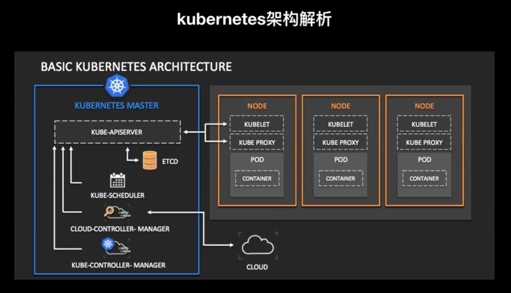

- kube-apiserver
- ETCD: 分布式存储，k8s所有数据均在其中；
- kube-scheduler
- cloud-controller-manager
- kube-controller-manager


- kublet
- kube proxy

从kubernetes pod的创建流程来看组件通信：


##### 设计思路
- 面向资源简化模型（go-restful）
  - 所有在kubernetes中操作的实体都可以用资源进行抽象，所有的资源都有restful的api与之对应。
  - kubernetes有各种抽象，如pod是容器的抽象，又如deployment，statefulset，daemonset，cronjob，replicaset等等。
  - services抽象接入层
  - configmap 是对配置的抽象
  - 每一种抽象都用yaml定义，还有api交付
- 异步动作保证性能（informers）
  - 所有依赖资源的组件都通过异步进行监听，具体的执行由各自的消费者决定频度。
- 状态机提供状态基线（etcd）
  - 所有的信息流都通过期望、实施、反馈的机制存储在etcd中，数据即状态。

- 反馈机制保证状态
  - informers中可以实现定期的sync，可以通过sync来处理中间状态。
- 组件松耦合可插拔
  - 组件之间通信要么是通过APIServer进行中转，要么是通过APIGroup进行解耦合，组件之间没有强依赖关系，部分组件自带熔断器。
 


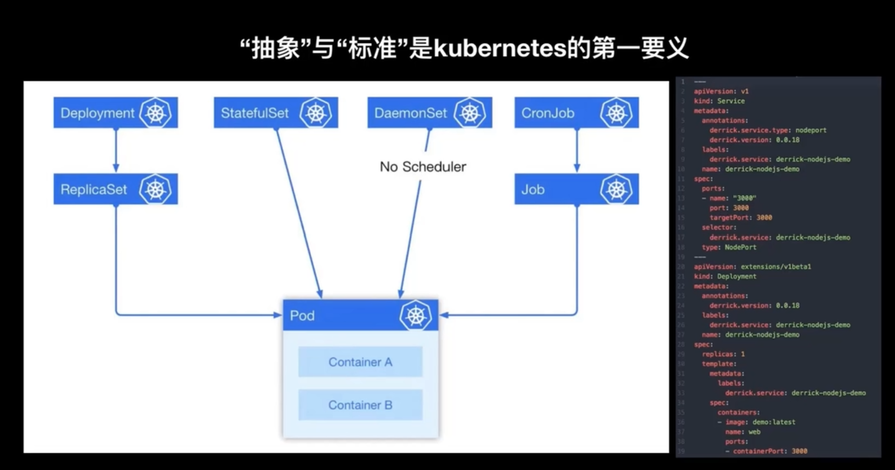

kubernetes 设计思路是通过各种抽象来定义标准化交付，掌握了设计思路后可以快速入门。

部分开发者从swarm向kubernetes迁移，kompose可以帮助实现迁移。

阿里云开发的derrick容器迁移工具可以加速容器迁移。

##### 典型yaml示例

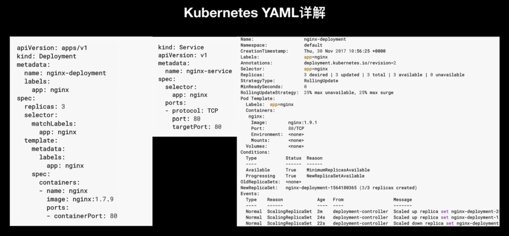

- apiVersion : api 版本
- kind ： 抽象的类型，定义内容类型
- metadata：特定类型的元定义
- spec：定义副本数、匹配label，容器，端口等等

