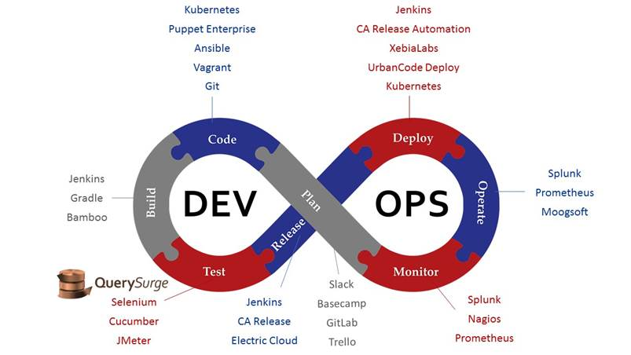

# DevOps

DevOps 是一种流程、管理、架构和文化。

从流程看包含：Plan，code，build，test，release，deploy，operate，monitor。

工具上看：
- plan阶段：slack, basecamp, gitlab, trello，office，project，enterprise architect，ibm rational。
- code阶段：git, vagrant,ansible,puppet enterprise,kubernetes
- build阶段：jenkins, gradle, bamboo，git，github，mercurial，eclipse，cobertura，docker，plastic，perforce，
- test阶段：querysurge，selenium，cucumber，jmeter
- release阶段：jenkins，CA release，Electric cloud
- deploy阶段：kubernetes，urbancode deploy，xebialabs，CA release automation，jenkins
- operate阶段：splunk，prometheus，moogsoft
- monitor阶段：splunk, nagios, prometheus

**但注意devops不只是流程+工具**

现在安全融入其中，成为devsecops：

## devops概念

### 背景
- 传统瀑布模型中流程过程，很多企业分为三套人马来实现，很容易出现三不管、推诿责任、任务延迟等。
- 现代应用交付场景的变革要求有app，web，大团队变为多个小组，互联网交付，越来越多元敏捷。
- devops工具成熟，甚至构成了devops元素周期表。

### 已有的devops flow

别人家的不一定合适。盲目照搬会有”大象问题“

### Devops 内涵

- Devops is about workflow **流程化、标准化**减少脱节环节时间浪费；
- Devops is about culture **节约时间**人人有责
- Devops is about automation **自动化**降低人工时间消耗
- Devops is about quality **质量**的提升可以避免返工。

主要是时间和质量。

开发运维中的时间杀手：各环节之间间的等待。等待基础架构、等待应用部署、等待其它团队、等待审核...开发运维中的质量杀手：各环节的质量控制不标准；质量控制依赖于人；质量控制纠错不及时...

DevOps就是要消除（使用自动化）：
- 不必要的流程
- 不必要的特性
- 不必要的人工
- 不必要的返工

### 正反案例

#### 反面案例
A公司成立了专门的devops部门，负责公司从基础设施、应用测试、系统集成等全方位工作，将基础设施的变更、系统变更等通过代码进行抽象，建立自动化系统实现devops。（概念性错误，过于理想，难以实现）

B公司采购了某咨询公司的方案，要求所有应用通过devops的流程和系统进行规约开发，严格遵守上线流程，代码上线要有90%的覆盖度，要求包含单元测试、E2E测试、黑盒测试、质量测试等，不定期召开小组会议评审交付，实现devops交付。（教条主义）

上面两个案例主要的问题就是基本上废弃了原有流程和经验，全新的架构、管理、流程通常会给企业带来灾难。

#### 正面案例

C公司拥有数万员工，成立了质量保证和交付团队，开发持续交付平台，并整合发布系统，通过容器的方式降低由于框架和版本差异带来的交付问题；通过自动容器化工具降低开发的学习成本和技术成本；通过兼容的发布方式，一键迁移原有的发布系统到现有的集成交付平台；通过配置文件的方式支持支持多种测试、质量保证的接入，质量团队提供标准模板，对于不同的应用提供多种可选模板实现快速测试与质量保证。（质量平台型的持续交付）

D公司拥有十余名极客工程师，公司有十几个产品线，数十个应用，每个工程师自己提供dockerfile和部署的yaml文件，并在团队的jenkins上构建自己的任务，通过jenkins blueocean的git workflow 实现快速交付，并定期相互交交付规范，逐渐统一交付标准。（灵活简单型的持续交付）

### devops的外形

Devops不仅是自动化，更多是开发方式、流程的变革。由于团队架构、工具生态、技术架构等因素，自2007出现以后直到2018年前后才变得大量落地。主要是微服务和容器的出现推动了devops。

### 微服务
2014 martin fowler 和james lewis共同提出的概念。定义了微服务是由以单一应用程序构成的小服务，微服务之间相互解耦，以全自动方式部署，与其它服务使用 HTTP API 通信。同时，服务会使用最小规模的集中管理（如docker）能力，服务可以用不同的编程语言与数据等元件。

特点：
- 服务组件化，每个最简都有完整的生命周期，包含自己的api，可独立存在；
- 安装业务组织团队：缩小模块的边界，每个模块可以独立负责；
- 做产品的态度：模块的owner要以产品思维，考虑模块的设计和演进
- 智能端点和哑管道：服务之间调用的端点，可以动态获取，以服务发现的方式提供，对于出错的场景提供熔断器。
- 去中心化治理：根据业务特点选择语言和框架
- 去中心化管理数据：不同的模块使用不同的库或表，不会出现相互调用的场景
- 基础设施自动化：自动部署、自动交付
- 容错设计：组件是不可信的，对于失败的状态需要有降级的处理
- 演进式设计：设计组件的时候需要明确和规划组件的边界。

#### 示例：打车软件设计微服务化

微服务化之前的架构，这个系统本身很复杂，某一个组件出错会影响全局。

微服务重构系统：
- 将原有系统拆解为：passenger 管理、driver管理、trip管理、billing管理、payments、notfication。
  - 3个gatway passenger 管理、driver管理、trip管理
  - 3个webservice billing管理、payments、notfication
- 由api gateway提供完整功能
- 使用web ui包装底层，实现web端应用。

微服务是按不同类型扩展。下面3列都有独自库或表。

### 容器
