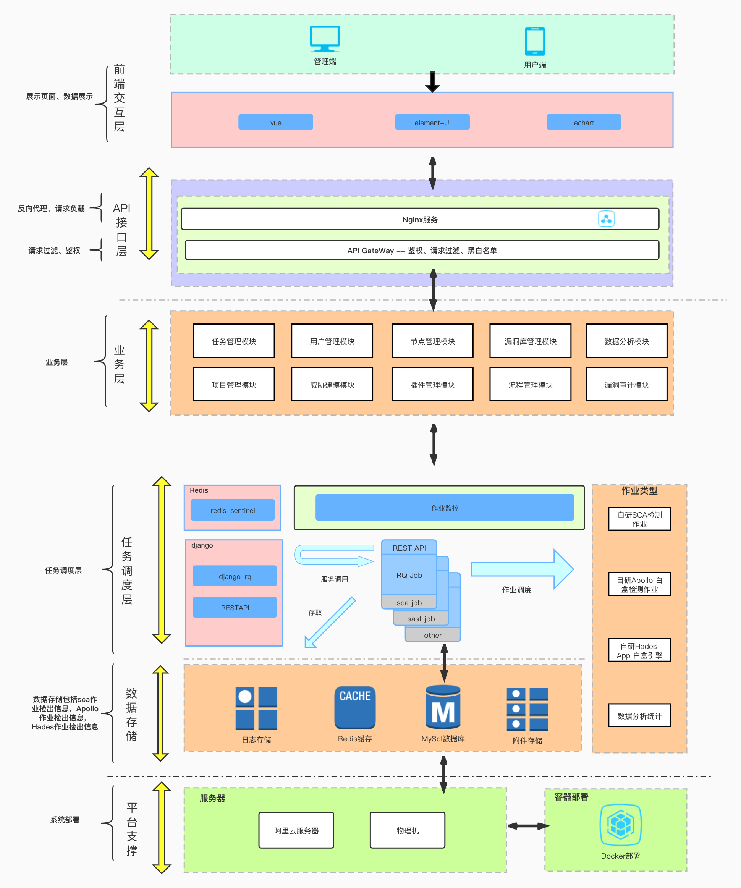

# DevSecOps
> 内容来自：https://www.freebuf.com/articles/es/259762.html


Gartner 2012年创建了这个概念。核心理念是：安全是整个IT团队（设计、开发、测试、运维、安全等团队）所有成员的责任，需要贯穿整个业务生命周期的每一个环节。“每个人都对安全负责”，安全工作前置，糅合嵌入开发流程体系。

在DevSecOps方法指导下的新一代应用开发流程中，应用的安全检测不再仅仅依靠传统的黑盒测试和白盒测试,安全测试方法将出现多样化，交互式的灰盒测试(iast)将会逐步流行，而且将会成为提高漏洞检出率和降低漏洞误报率的重要环节。

安全能力渗透范围将会扩大，在传统的sdl中，安全能力仅仅集中在编码阶段的白盒检测和测试阶段的黑盒检测，虽然绝大多数的安全问题都在这两个环节发现，但是从软件安全修复成本来看，这并不是很好的方案。如果能够在安全需求分析阶段就能够将尽可能的考虑到所有的安全风险问题，并给出相应的威胁模型和解决方案，那么后续软件修复的成本将会大大的降低。

## 基本思路

- 需求分析阶段，进行威胁建模和制定解决方案
- 编码阶段，进行安全检测额代码安全检测
- 测试阶段，进行白、灰、黑等多种测试
- 应用上线阶段，持续监测风险

在未来，sdl将逐步走向自动化，安全检测工具将不再零散分布，而是在一个平台中集中管理和编排，安全检测更趋向于自动化。


## 案例

### 理想汽车白盒检测


上图所示的理想汽车内部在用的自研白盒系统(apollo)拓扑图，目前第三方方面支持三种方式接入分布式白盒系统。第一种方式是直接登陆web平台进行任务提交操作，第二种是通过jenkins piplines方式，将白盒引擎能力集成到pipline流水线中，第三种是直接通过客户端程序提交任务到master节点。

#### apollo工作流程介绍
apollo白盒引擎采用redis-sentinel作为消息队列，worker集群中的节点通过抢占方法获取任务信息(似乎应该优化下)，节点获得任务信息后将会通过远程共享磁盘获取到待检测源码包，启动对应分析引擎进行自动化白盒审计分析，审计任务完成后，结果数据将会被存储到mysql主服务器中，通过数据同步，将数据同步到从服务器中，master节点通过读操作从从服务器上读取相关到任务数据信息(包括漏洞信息，任务信息等)，渲染到web前端展示。

分布式白盒系统架构图



以上是分布式白盒检测系统的整体架构。web前端技术部分主要包括vue，elementUI及echart.

#### 功能模块
Apollo分布式白盒检测系统实现了一些必要的一些后端交互，如用户管理交互，作业管理交互，漏洞审计交互，项目创建交互，以及对引擎检出的数据进行了相对友好的可视化展示。
##### 首页-可视化模块

首页针对以往检测的项目信息进行可视化分析展示，基本信息展示方面，除了总项目数，总代码行数，总风险数等信息外，我们还展示了总的万行代码漏洞率，用于评估现阶段企业内部的代码安全性。为了使得展示效果比较友好，以及避免泄漏企业内部的一些敏感信息，上图可视化展示的数据均为测试数据。下面简要的介绍下图表内容的含义。第一个图表展示了本年度，从一月份到十二月份每个月的漏洞检出情况，以及漏洞修复情况(红色为漏洞数趋势图，绿色为漏洞修复数趋势图)相关的研发负责人可据此来评估各个项目组的月度及年度的代码安全性，代码安全性数据可作为评估研发工程师研发能力的一部分，加入到绩效考核之中。

##### 项目管理模块
项目管理模块主要实现了项目创建，项目列表展示，项目详情展示三个部分的内容。

首先介绍下项目管理模块的作用，项目管理模块的主要作用就是为了方便对devsecops流程的管控，详细点说就是将需求分析，威胁模型构建，防护规避方案，项目安全检测的进展，漏洞详情信息以项目为单位进行呈现，方便相关的研发负责人对于当前的项目组的代码安全性有一个比较全面的了解。

针对项目创建方面，我们提供了两种方式，一种是手动添加方式，另一种是项目管理平台(如jira)自动拉取项目信息的方式。手动创建方式可能对于自动化方面会收到一些影响，但是考虑到并非所有公司、所有的项目组都喜欢用项目管理平台，所以，要全面落地devsecops，提供手动创建项目还是很有必要的。

关于威胁建模方面，如果是手动创建项目的话，我们会要求创建者给出当前项目的当前版本的功能模块信息，然后后端知识库将会根据这些给定的功能模块信息，会自动化的构建当前项目版本的威胁模型信息，并提供相应的风险规避方案(如下图所示)

在项目详情信息对最下方是项目流程信息展示，在这里，我们将展示当前项目版本安全检测推进的情况。

初定主要分为这几个流程节点:项目创建,威胁建模，白盒检测(包含组件安全检测)，灰盒检测，黑盒检测，上线。

##### 作业管理模块
作业管理模块主要实现了作业提交，作业信息展示，作业报表生成三个方面的功能。

1、作业详情展示
作业详情信息里我们将会展示当前作业检出结果的概要信息(包括文件数，代码行数，万行代码漏洞率，漏洞总数，各个等级漏洞的总数，以及任务开始和结束的时间)，另外我们还会在任务结束后通过邮件的形式给相关的负责人发送一份检出的结果报告，以方面相关负责人知晓白盒任务的大致的检测情况。

2、邮件通知
3、作业报表

作业结束后，我们会对作业检出结果进行统计分析，然后通过echart进行数据可视化展示，并使用selenium对报表页面进行自动化快照截取，最后以邮件形式发送给相关的负责人。

整个作业的流程大致如下:获取任务、执行白盒检测、数据分析可视化、快照截取、邮件发送、结束。另外，其他人员如果希望获得一份作业的报表信息的话，也可以通过手动点击报告生成按钮，选择期望生成的报表格式，进行作业报表的生成。

漏洞管理模块主要实现了漏洞审计及漏洞多条件查询两个方面的功能，以满足代码审计同学日常的代码审计工作。提供的漏洞条件查询方式，包括作业编号，项目编号，漏洞等级，检测模式(sca,白盒,灰盒，黑盒),状态(未确认，已确认，未修复，已修复),漏洞类型。通过检索作业编号即可以获取该作业下检测出的所有漏洞信息，搭配其他条件，即可找到期望找到的漏洞信息。漏洞详情信息方面我们会给出详细的漏洞发生原理，危害性，然后给出具有说服力的证明信息(包括sink点，source点，数据流信息)以证明我们分析的可靠性。在漏洞详情信息展示下方即为当前漏洞的处理进度情况。相关的审计人员在对漏洞进行二次评估之后，可以对漏洞的状态信息进行修改，以推进漏洞处理的进度。

目前apollo白盒引擎方面已支持200个java应用漏洞检测规则，涵盖98%java类型漏洞。

#### DevSecOps自动化

##### 将静态代码检测嵌入devops。
静态代码检测和devsecops结合主要有四种方式：
- 第一种是webhook方式，即监控git的push操作，对push上来的代码进行增量扫描检测；
- 第二种方式则是在piplines中集成客户端脚本，在项目进行编译打包时候，对源代码进行安全性分析。目前apollo引擎支持源码分析及jar包分析。源码分析方面，通过客户端程序将源代码直接打包到apollo远程源码缓存磁盘中，由后端apollo白盒引擎进行代码属性图构建，以及漏洞分析检测。jar包分析方面，客户端程序将上传打包生成对jar包到后端apollo白盒引擎进行风险检测。
- 第三种方式是在jenkins上建立一个定时任务，定时针对目标项目进行静态代码安全性检测。
- 第四种方式是由apollo方面通过约定的时间点主动拉取项目分支代码进行检测。

就devsecops建立早期而言，二、三、四相对来说比较容易落地，而实际操作来说，三、四应该是主要对落地方案。

##### 与jira项目管理平台进行对接(将威胁建模嵌入到devops中)
这是我们一直在沟通和完善的一个点。有句古话说得好，上医治未病，如果能够在开发前期就规避掉95%的问题，那么后续用于漏洞修复的成本将会大大降低。我们的主要思路是在项目版本创建的时候，由项目管理人员发布项目启动的issue，在issue中单独创建一个key，包含当前项目版本将要实现的功能模块，devsecops管理平台这边通过监控项目issue信息，提取相关功能模块信息列表，然后将这个列表作为输入，自动化构建威胁模型，并根据威胁建模分析，自动化给出风险规避方案，最后以邮件形式通知到相关的项目研发负责人。这样项目研发成员在开发过程中针对安全问题规避方面就会有法可依。


#### DevSecOps白盒引擎实现
白盒检测方面，我们主要基于两款自研白盒引擎进行检测，一款基于代码属性图(cpg)，我们内部叫apollo，另一款基于字节码分，我们内部叫hades。关于hades方面，此前demo版本已经开源(https://github.com/zsdlove/hades)，而且我在git仓库的readme中已经做过详细的说明了，这里就不做过多的介绍了。而基于代码属性图的漏洞检测方案，相信有做过白盒引擎的应该多少都会了解一些，该理论最早应该是由Fabian Yamaguchi在其一篇学术论文中提出的《Modeling and Discovering Vulnerabilities with Code Property Graphs》，讲的是如何将源代码抽象成属性图结构以及如何基于这个属性图进行漏洞的挖掘，该理论给予笔者关于白盒方面的引擎开发相当大的启发。难得的是，为了让外界对这套理论有更好的了解，其还开源了c/c++部分的检测引擎，感兴趣的话，各位可以去学习了解下，github地址是:https://github.com/ShiftLeftSecurity/joern。

那么基于cpg图查询方案的源代码风险检测到底是怎么做的呢？按我的理解来说，总的可以分三个阶段：
- 第一阶段是ast信息提取，这部分，需要对源代码进行第一阶段的抽象处理，即将源代码抽象为ast。一般来说，这部分不需要自己实现，而且也不建议各位自己实现，只需要找到相应的ast解析库即可。这里给个建议，java方面的话可以使用javaparser来提取,c/c++方面可利用eclipse的CDT库来进行解析。
- 下面我们来讲下第二阶段要做的事情，在第一阶段中，我们已经获得了一个ast列表，基于这个ast列表，我们在第二阶段要做的事情是对每一个函数进行过程内的cfg(control flow graph)和eog(evalution order graph)，以及基于cfg遍历和eog遍历的dfg(data flow graph)的构建。cfg和eog两个图很像，都可以理解为针对程序执行路径的描述，按我的理解是，cfg一般是将一组线性执行顺序的表达式合并为一个block，各个block之间通相应的条件分支关系连接在一起，而eog是描述过程内的各个语句以及表达式之间的求值计算关系的，两者可以用来进行后续的数据流分析，但是一般来说，eog会更适合做数据流分析，因为它是直接描述每个表达式之间的求值关系的，而cfg的话，我们还需要考虑到block和block之间的一些数据流传递关系。当然，这只是我个人的观点，如有错误，敬请斧正。关于数据流，如果真的要展开来讲的话，是一个大篇幅，这里我就分享下我在分析处理的过程中遇到的一些问题，以及我的一些解决问题的想法。我们知道直接的赋值肯定是一种数据流的关系，但是一个复杂结构的过程中不仅仅是只有简单的变量赋值的，比如数组成员的存取，再比如枚举器取值，这些也是可能影响数据流传递的中间因素。举个例子来说:
  
```
enumeration headers=request.getheaders();

String header=headers.getelement();
```
这里getelement()和header是直接的赋值关系，他们是可以被认为是数据流关系，但是headers和getelement是什么关系？求值关系。这种情况我们实际在处理的时候也应该认为是一种数据流的关系，否则的话，getelement之前的数据流边就断了。

关于frontend部分，shiftleft方面给出了一个架构图，可以参考学习一下：


其中cpg2scpg应该就是将ast构成点基本图升级为带有cfg边和dfg边点scpg，即第二个level的cpg。

shiftleft将这个过程用一个金字塔模型进行描述:


这部分似乎在之前的图的上层加入了两个新图，即服务依赖图和组件依赖图，以丰富原有的cpg。不过按照我的理解，这个针对漏洞漏洞分析最有用，也是最实用的应该是下面这个层状结构：
- ming flaws
- DFG
- CFG/EOG
- AST

只要我们能够构建起一个比较完整的数据流图，那么后续的漏洞分析就基本没问题了。而关于过程间的数据流分析。在前面，我们针对每一个函数进行了eog的构建，此时，各个过程内的eog之间是没有任何联系的。如果我们需要进行过程间的数据流分析，那么我们就需要进行进一步的分析处理。那么这里首先第一个问题就要抛出来了，如何将所调用的函数和具体的函数的声明信息联系在一起呢？我们知道，每个函数都会有一个自己的函数签名信息的，所谓签名，就是你的一种身份凭证，所以，我们只要将函数调用节点和函数声明节点的函数签名比对一下就可以建立起函数调用节点和函数声明节点之间的关系了，当然，要做过程间的数据流分析，还需要对形参节点和实参节点进行映射关联，即将两者进行数据流边连接。

#### 基于cpg方案的java漏洞挖掘实战
基于以上理论，让我们来实践下基于cpg方案的java代码漏洞挖掘。apollo使用neo4j作为存储cpg的数据库，所以以下讲解均在neo4j web控制台上进行，使用的是neo4j自带的cypher查询语言。

1、过程内漏洞挖掘
首先我们知道，白盒审计主要关注三个方面，第一个是污点传入的地方(也就是所谓的source点)，第二个是污点沉降的地方(也就是所谓的sink点)，第三个是从source点到sink点之间的数据流路径。如果这三个点都满足，那么我们就认为sink点处是可能存在风险点的。当然，为了降低误报，通常我们还会检查下，污点经source点流到sink点的过程中是否经过了一些净化函数。

下面我们使用apollo白盒引擎对benchmark java漏洞靶场中的一个sql注入漏洞进行检测，看看效果如何。

靶场源码如下:

```
package org.owasp.benchmark.testcode;

import java.io.IOException;
import org.owasp.benchmark.testcode.Test;
import javax.servlet.ServletException;
import javax.servlet.annotation.WebServlet;
import javax.servlet.http.HttpServlet;
import javax.servlet.http.HttpServletRequest;
import javax.servlet.http.HttpServletResponse;

@WebServlet(value="/sqli-00/BenchmarkTest00008")
public class BenchmarkTest00008 extends HttpServlet {
	
	private static final long serialVersionUID = 1L;
	
	@Override
	public void doGet(HttpServletRequest request, HttpServletResponse response) throws ServletException, IOException {
		doPost(request, response);
	}

	@Override
	public void doPost(HttpServletRequest request, HttpServletResponse response) throws ServletException, IOException {
		// some code
		response.setContentType("text/html;charset=UTF-8");
		
		String param = request.getHeader("BenchmarkTest00008");

		// URL Decode the header value since req.getHeader() doesn't. Unlike req.getParameter().
		param = java.net.URLDecoder.decode(param, "UTF-8");

		String sql = "{call " + param + "}";
		try {
			java.sql.Connection connection = org.owasp.benchmark.helpers.DatabaseHelper.getSqlConnection();
			java.sql.CallableStatement statement = connection.prepareCall( sql );
		    java.sql.ResultSet rs = statement.executeQuery();
            org.owasp.benchmark.helpers.DatabaseHelper.printResults(rs, sql, response);

		} catch (java.sql.SQLException e) {
			if (org.owasp.benchmark.helpers.DatabaseHelper.hideSQLErrors) {
        		response.getWriter().println(
"Error processing request."
);
        		return;
        	}
			else throw new ServletException(e);
		}
	}
	
}
```

这里我们先确定一下sink点和source点信息。我们已知souce点为getHeader函数，它的函数签名是javax.servlet.http.HttpServletRequest.getHeader。我们可以将这两个信息作为约束条件，查找出满足条件的source节点，下面是cypher查询语法：

```
MATCH sourcenodes=(source{name:"getHeader",fqn:"javax.servlet.http.HttpServletRequest.getHeader"}) RETURN sourcenodes limit 25
```

sink点定位语法类似：

```
MATCH sinknodes=(sink{name:"prepareCall",argumentIndex:0,fqn:"java.sql.Connection.prepareCall"}) RETURN sinknodes limit 25
```

ok，我们已经找到了source点以及sink点，下面我们来看看是否存在一条数据流路径连接source点和sink点。我们使用如下查询语法：
```
MATCH p=(source{name:"getHeader",fqn:"javax.servlet.http.HttpServletRequest.getHeader"})-[r:DFG*1..]->()<-[r2:ARGUMENTS]-(sink{name:"prepareCall",argumentIndex:0,fqn:"java.sql.Connection.prepareCall"})  RETURN p
```

简单解释下该条cypher语法的含义。p代表路径，source点和sink点用于定位，”-[r:DFG*1..]->()<-[r2:ARGUMENTS]-“这个部分语句采用夹逼查询方式，查询是否存在一个节点满足以下两个条件：

1)污点处存在1或多个单位长度边到该节点。

2)该节点将作为sink点函数的一个参数，参数索引位置是0。

下面是查询出来的路径信息:


很明显，getheader和prepare之间是存在数据流路径的，那么我们有理由认为这个sql注入漏洞是存在的。

据此我们可以得出一条通用的漏洞查询语句

MATCH p=(source{name:”source_name”,fqn:"source_fqn"})-[:EOG|DFG*]->()<-[r2:ARGUMENTS]-(sink{name:"sink_name",argumentIndex:0,fqn:"sink_fqn"}) RETURN p limit 1
2、过程间漏洞挖掘
我们把上例中的benchmark漏洞靶场修改以下，将source点和sink点分开到两个文件中，如下所示：

文件BenchmarkTest00008.java

package org.owasp.benchmark.testcode;
import java.io.IOException;
import org.owasp.benchmark.testcode.Test;
import javax.servlet.ServletException;
import javax.servlet.annotation.WebServlet;
import javax.servlet.http.HttpServlet;
import javax.servlet.http.HttpServletRequest;
import javax.servlet.http.HttpServletResponse;
@WebServlet(value="/sqli-00/BenchmarkTest00008")
public class BenchmarkTest00008 extends HttpServlet {
	
	private static final long serialVersionUID = 1L;
	
	@Override
	public void doGet(HttpServletRequest request, HttpServletResponse response) throws ServletException, IOException {
		doPost(request, response);
	}

	@Override
	public void doPost(HttpServletRequest request, HttpServletResponse response) throws ServletException, IOException {
		// some code
		response.setContentType("text/html;charset=UTF-8");
		
		String param = request.getHeader("BenchmarkTest00008");

		// URL Decode the header value since req.getHeader() doesn't. Unlike req.getParameter().
		param = java.net.URLDecoder.decode(param, "UTF-8");
		String sql = "{call " + param + "}";
		Test.runexec(sql);
	}
	
}
Test.java文件

package org.owasp.benchmark.testcode;
import java.io.IOException;
import javax.servlet.ServletException;
import javax.servlet.annotation.WebServlet;
import javax.servlet.http.HttpServlet;
import javax.servlet.http.HttpServletRequest;
import javax.servlet.http.HttpServletResponse;
public class Test {
	@Override
	public static void runexec(String sql){	
		try {
			java.sql.Connection connection = org.owasp.benchmark.helpers.DatabaseHelper.getSqlConnection();
			java.sql.CallableStatement statement = connection.prepareCall( sql );
		    java.sql.ResultSet rs = statement.executeQuery();
            org.owasp.benchmark.helpers.DatabaseHelper.printResults(rs, sql, response);

		} catch (java.sql.SQLException e) {
			if (org.owasp.benchmark.helpers.DatabaseHelper.hideSQLErrors) {
        		response.getWriter().println(
"Error processing request."
);
        		return;
        	}
			else throw new ServletException(e);
		}
	}
}
简要说明一下，在BenchmarkTest00008.java文件中，函数dopost中传入污点getheader，污点经过数据流传播，进入到过程Test.runexec。在Test.runexec过程中，将传入的参数作为sql语句，进行sql查询，并且没有过滤操作。

下面我们验证下是否是否还能够查询出sink点到source之间的路径信息

我们还是使用之前的语句进行查询

MATCH p=(source{name:"getHeader",fqn:"javax.servlet.http.HttpServletRequest.getHeader"})-[r:DFG*1..]->()<-[r2:ARGUMENTS]-(sink{name:"prepareCall",argumentIndex:0,fqn:"java.sql.Connection.prepareCall"}) RETURN p
查询结果：

1609751802_5ff2dcfaf1a2ba0987be3.png!small

没有问题，还是能够得到原来的结果。那么过程间漏洞查询是如何实现的呢？在构建cpg阶段进行过程间数据流分析。我们知道每一个函数都有一个函数签名，我们自己将函数调用处函数的签名和函数声明处的函数签名进行比对就可以将两个过程进行关联，然后我们在基于此对相应的数据流节点进行连接即可，即将形参与实参进行连接，这样我们就能够进行过程间的数据流跟踪分析了。

六、业界主流白盒是怎么做的呢？
我们来分析下简单分析下codeql的一个规则实例：

import java
import semmle.code.java.dataflow.FlowSources
import SqlInjectionLib
import DataFlow::PathGraph

string getSourceLocation(DataFlow::PathNode sink){
    result=sink.getNode().getLocation().toString()
}

string getSinkLocation(DataFlow::PathNode source){
    result=source.getNode().getLocation().toString()
}

from QueryInjectionSink query, DataFlow::PathNode source, DataFlow::PathNode sink
where queryTaintedBy(query, source, sink)
select query, source, sink, "Query might include code from $@.", source.getNode(), "this user input"
这里QueryInjectionFlowConfig对sink点和source点进行了配置，相当于我们上面的source点和sink点的定位语句。

private class QueryInjectionFlowConfig extends TaintTracking::Configuration {
  QueryInjectionFlowConfig() { this = "SqlInjectionLib::QueryInjectionFlowConfig" }

  override predicate isSource(DataFlow::Node src) { src instanceof RemoteFlowSource }

  //override predicate isSink(DataFlow::Node sink) { sink instanceof SqlInjectionSink }
  override predicate isSink(DataFlow::Node sink) { sink instanceof QueryInjectionSink }

  override predicate isSanitizer(DataFlow::Node node) {
    node.getType() instanceof PrimitiveType or
    node.getType() instanceof BoxedType or
    node.getType() instanceof NumberType
  }
}
跟进queryTaintedBy看看，

predicate queryTaintedBy(
  QueryInjectionSink query, DataFlow::PathNode source, DataFlow::PathNode sink
) {
  exists(QueryInjectionFlowConfig conf | conf.hasFlowPath(source, sink) and sink.getNode() = query)
}
这里调用QueryInjectionFlowConfig这个规则配置类的hasflowpath函数查询source点到sink点之间是否存在数据流路径。

那么我们进一步跟进hasflowpath函数，

predicate hasFlowPath(PathNode source, PathNode sink) { flowsTo(source, sink, _, _, this) }
跟进flowto

private predicate flowsTo(
  PathNode flowsource, PathNodeSink flowsink, Node source, Node sink, Configuration configuration
) {
  flowsource.isSource() and
  flowsource.getConfiguration() = configuration and
  flowsource.getNode() = source and
  (flowsource = flowsink or pathSuccPlus(flowsource, flowsink)) and
  flowsink.getNode() = sink
}
跟进pathsuccplus函数，

private predicate pathSuccPlus(PathNode n1, PathNode n2) = fastTC(pathSucc/2)(n1, n2)
这里用的是一个codeql语法中的一个快速传递闭包语法，作用类似我们刚才的cypher语法中的DFG*1..，即查询是否存在1或多个单位边长路径连接source点到sink点。看来英雄所见略同，哈哈，当然，apollo白盒引擎还有long way to go。

七、后续一些想法
1、分布式构建图数据库。

单个节点构建cpg的话，相对比较缓慢，或许可以将源代码文件分发给多个节点进行构建，或许可将构建时间尽可能控制在10s之内？

2、增量检测。我的理解是，就代码安全审查的角度来说，增量扫描并不是只对新增加/修改的代码进行检测，因为白盒审计过程中需要对完整对数据流进行跟踪，而增量代码中并不能够提供完整的数据流，无法无法确定漏洞的存在与否，正确的做法应该是先对原本的分析信息(such as cpg)进行缓存，然后单独对修改或增加的源码文件进行cpg子图构建，将其融合到原来的cpg中，然后针对融合后的cpg进行重新检测，这样做的好处是可以避免因全量构建cpg而浪费大量的时间。

八、Join US
1、精通编译原理。

2、精通python，java，go，c，c++中的一种或以上编程语言，并具备良好的编码风格和团队协作能力。

3、熟悉cpg方案，并且有落地经验者优先。

4、熟悉分布式架构，精通web全栈开发者优先。

九、CONTACT WITH ME

747289639@qq.com(微信同)

by 郑斯碟

理想汽车DevSecOps负责人