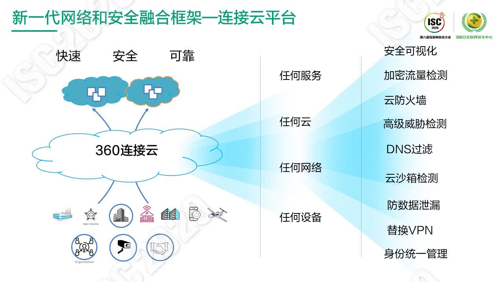
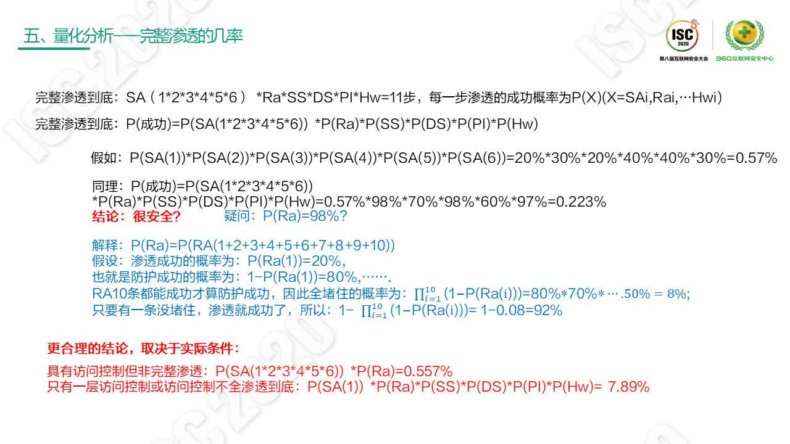
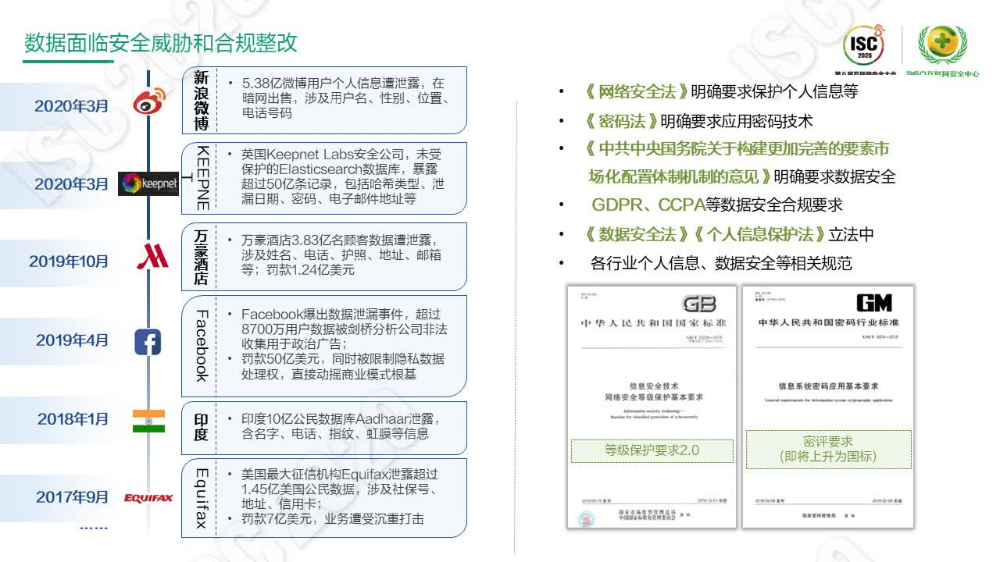
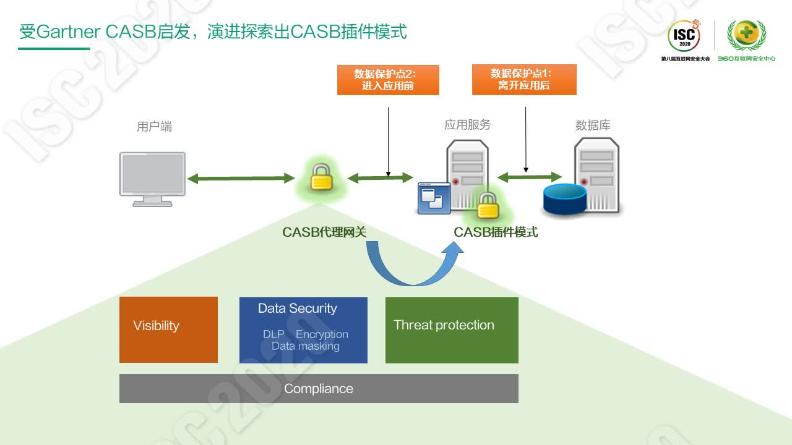
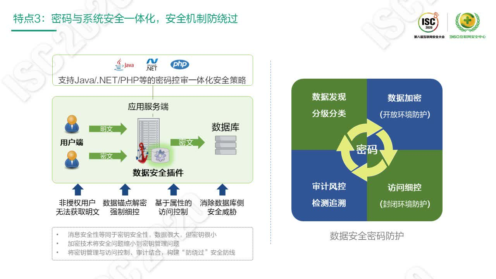

# ISC2020云安全分论坛纪要

## 基本概念

### 云时代的传统安全面临的问题

- 适配困难
- 网络延迟
- 安全盲点
- 缺乏弹性
- 繁重管理

### 云时代客户需要的云安全

### 安全模型

## 360提出的新一代网络和安全融合框架”连接云平台“

## 联通智慧安全提出的”安全岛链“

安全岛链——云化建设、云化提供、云化支持

- 从点状防护到立体防御
- 从被动抵抗到主动防御
- 集中管控统一调度全网协同
- 基于大网部署、大网数据的感知和处理能力

## 云环境下服务集群的渗透和防护

### 云计算集群结构

通常云计算中的功能模块：
- 负载均衡与代理
- Web主站服务
- APP接口服务
- 图片服务器
- 数据库和缓存服务

#### 负载均衡与代理

常见架构有：
##### LVS+Keepalived：

LVS工作于网络四层结构，针对IP地址进行网络数据包转发，实现负载均衡代理功能。服务器配置相对复杂，性能稳定，支持超大访问量的集群负载。对外提供统一的虚拟IP，有三种工作模式，十种左右的轮询算法。

##### Nginx+Keepalived

Nginx工作于网络七层，配置相对简单，支持URL、目录等正则处理，更加贴近实际生产需求，可以支持较大访问量的集群负载。

##### Haproxy+Keepalived

Haproxy 工作于网络四层和七层都可以，配置相对简单，负载均衡速度不亚于Nginx。

特别的是Haproxy可以进行DDoS防御。

#### 主站结构

主站框架是Web服务器（apache、tomcat、nginx等）集群，集群中全部机器运行相同的业务系统。

通过负载均衡代理与客户端通信，每一次通信只有一台服务器为当前客户服务。

主站框架需要解决session共享的问题，否则将会丢失用户的登录状态，造成用户体验下降和逻辑错误。常见的共享session方案有：
- 数据库共享
- cookie共享
- 内存共享

使用最多的是memcache共享方法，memcache把多个服务器的共享内存拼接成一个大的内存使用，保存用户的session信息。

#### 接口服务

app接口服务于主站服务功能大同小异，也是web服务集群

### 分析渗透途径与概率

- 增加访问控制，可以增加渗透路径的长度，起决定性作用，提升60%-80%
- 加强用户的安全管理，抑制社会关系网的拓展，提升40%
- 及时更新软件、设备，技术降低漏洞风险，提升20%-80%
- 尽量减少服务的互联，减少入侵途径

## 企业数据安全体系建设思路
> 北京炼石网络技术有限公司创始人 CEO白小勇

网络安全应由注重网络边界转移到注重数据安全。

传统的纵深防御体系

北京炼石网络技术有限公司创始人 CEO白小勇用18款开源软件构建的层次防御体系

这样的系统在目前的大量数据流动情况下已经不能再有效防护。

思考之后，目前正确的思路应该是这样的：

### 数据安全目标

在数据全生命周期中实施安全技术与管理手段，按照数据业务属性意图控制数据访问，保障数据的流转与共享价值。

### 数据生命周期(时间维度)中的安全防护需求

### 数据安全防护措施

通过统一的数据安全防护策略，将加密、脱敏、检测响应等技术相结合作用到数据流转各环节以增强防护。

### 安全增强点

说明：
- 终端上的桌面VDI目前是技术厂商的主流做法
- 应用层的集成加密及可以采用改造应用程序代码（加载密码模块）的方法实现，也可以使用新的技术——面向切面的加密技术（Aspect oriented encryption 简称AOE），这种技术可以不改代码并提供应用层的加密，同样也是细颗粒度的。
- CASB是一种被验证有效的加密方案。
- 以上方案需要协同使用，没有哪一种能覆盖所有方面，没有绝对的强弱。

目前，数据安全从基础设施扩展到应用层。

我们发现层级越高，价值点越高。从安全合规上看也是这样。从企业上来看，需要有一个综合的体系的保障。

### 实战化的防护

受Gartner CASB启发，演进探索出CASB插件模式

CASB是指云访问安全代理（Broker），它的功能点大致有：
- 可见性：完全透明，全面、深入洞悉您的云应用和基础设施（包括用户、设备等）状况。
- 治理与合规性：有效识别云应用风险，遵守法规，提供一致的合规性报告。
- 简化监视：持续监视云端活动、配置和事务，全面识别所有云应用中的异常以及欺诈或违规模式。
- 安全供应：主动使用适当的安全配置和基准来完成云设置，从第一步开始即确保云应用安全，从而降低企业风险，为成功做好准备。
- 数据安全性：设置适当的策略，基于策略审计、加密和隔离关键内容并设置警报。进而有效发现并阻止针对云端敏感内容和数据的恶意操作。
- 威胁防护：检测、预测并可视化洞察云是否受到攻击；借助集成式威胁智能，利用机器学习和高级行为分析技术增强威胁检测。
- 事件响应：发生云应用事件时，快速采取应对措施并取证；所有措施都基于您的同意和批准经过精心编排，可有效消除流程中的人为错误。

CASB网关的实施成本有依赖性。可以将CASB网关转变为CASB插件（引入AOE）。

最终实现的效果

以上的加密、脱敏主要面向结构化数据，解决了结构化数据的问题后，再从操作系统内核层提供逐密钥逐文件的加密。

最终实现AOE、TFE等方式加密的分布式部署

总结:

## DNS安全

NO DNS means no Business

