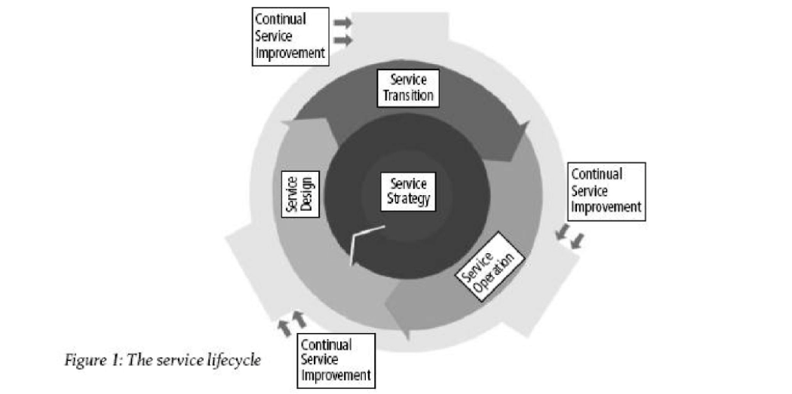
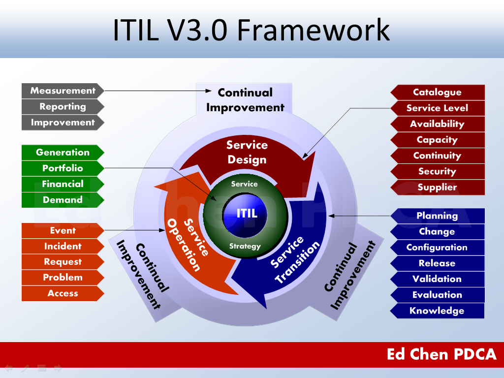

# ITIL 4

## 概述
ITIL®（Information Technology Infrastructure Library）：即信息技术基础构架库，由英国政府部门CCTA在20世纪80年代末制订，现由英国商务部OGC（Office of Government Commerce）负责管理。

随着时代的快速发展，ITIL 认证也随之演变。截至目前,ITIL 经历了ITIL v1、ITIL v2、ITIL v3、ITIL 2011以及ITIL4等。

### ITIL 4
ITIL 4是此完善框架的演进。它提供了灵活的端到端IT /数字运营模型，用于技术支持产品的交付和运营和服务，这可以帮助公司更好的应对这些不同的挑战。

itil4认证包括ITIL foundation、ITIL中级、ITIL 大师级。

ITIL v3描述服务管理和26个流程及运营职能，其按照ITIL服务生命周期的五个阶段分布。ITIL v3的内容依然是很值得参考的。而ITIL 4提出了演进版的服务价值体系(Service Value System (SVS))，它提供了全面的端到端的全景图关于如何给业务带来价值，它同时也吸收了Cloud，Lean IT，Agile和DevOps的模型。

### ITIL v3的5步生命周期模型

- 战略阶段(Service Strategy)
- 设计阶段(Service Design)
- 转换阶段(Service Transition)
- 运营阶段(Service Operation)
- 改进阶段(Service Improvement)

### ITIL 4的7项指导原则(Guiding Principles)

### ITIL 4全新的服务价值链
### 服务管理的4个维度(four dimensions)

## 实践

34个ITIL实践，特别关注其中的18个(基础阶段)

Lean IT、Agile、DevOps和组织变革管理的关键概念，以及为何它们对业务价值交付如此重要。

### 通用管理实践(14)

架构管理、持续改进、信息安全管理、知识管理、度量和报告、组织变革管理、组合管理、项目管理、关系关系、风险管理、服务财务管理、战略管理、供应商管理、人力资源管理；

### 服务管理实践(17)

可用性管理、商业分析、容量和性能管理、变更控制、事件管理、IT资产管理、监控和事态管理、问题管理、发布管理、服务目录管理、服务配置管理、服务连续性管理、服务设计、服务台、服务级别管理、服务请求管理、服务验证和测试；

### 技术管理实践(3)

部署管理、基础架构和平台管理、软件开发和维护管理。