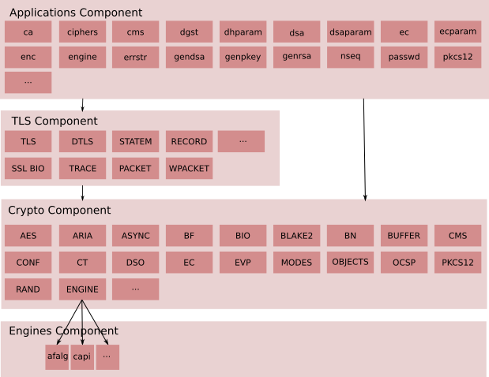
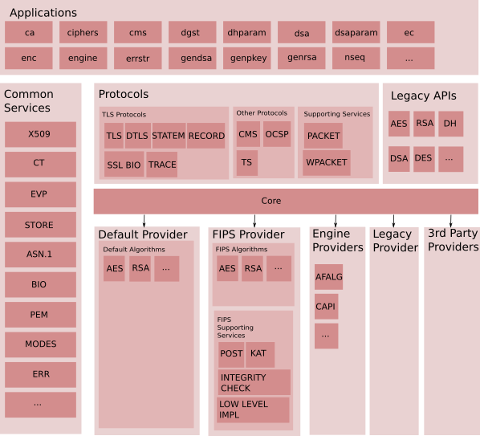
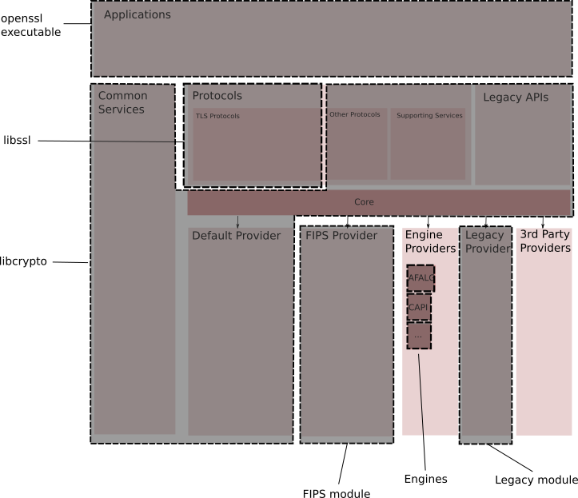
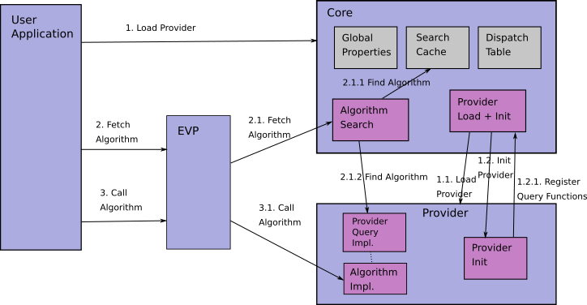

# PKI系统构建与运维

## PKI 概念

PKI，即公钥基础设施，它是一个包括硬件、软件、人员、策略和规程的集合，用来实现基于公钥密码体制的密钥和证书的产生、管理、存储、分发和撤销等功能。

PKI 是指支持公钥管理体制的基础设施，提供:鉴别、加密、完整性和不可否认性服务。它为实施电子商务、电子政务、办公自动化等提供了基本的安全服务，从而使那些彼此不认识或距离很远的用户能通过信任链安全地交流。

我国的PKI技术从1998年开始起步，政府和各有关部门对PKI产业的发展给予了高度重视。2001年PKI技术被列为“十五”863计划信息安全主题重大项目，并于同年10月成立了国家863计划信息安全基础设施研究中心。国家电子政务工程中明确提出了要构建PKI体系。我国已全面推动PKI技术研究与应用。2004年8月28日，十届全国人大常委会第十一次会议28日表决通过了电子签名法，规定电子签名与手写签名或者盖章具有同等的法律效力。这部法律的诞生极大地推动了我国的PKI建设。 

1998年国内第一家以实体形式运营的上海CA中心(SHECA)成立，此后，PKI技术在我国的商业银行、政府采购以及网上购物中得到了广泛应用。国内的CA机构大致可分为区域型、行业型、商业型和企业型四类，并出现了得安科技、创原世纪、国创科技、吉大正元、国瑞数码等一批PKI服务提供商。

### 基本构成

一个典型的PKI系统包括：
- PKI策略
- 软硬件系统
- 证书机构CA
- 注册机构RA
- 证书发布系统
- PKI应用等。


#### PKI安全策略
建立和定义了一个组织信息安全方面的指导方针，同时也定义了密码系统使用的处理方法和原则。它包括一个组织怎样处理密钥和有价值的信息，根据风险的级别定义安全控制的级别。

#### 证书机构CA
证书机构CA是PKI的信任基础，它管理公钥的整个生命周期，其作用包括：
- 发放证书
- 规定证书的有效期
- 通过发布证书废除列表(CRL)确保必要时可以废除证书。  

#### 注册机构RA

注册机构RA提供用户和CA之间的一个接口，它获取并认证用户的身份，向CA提出证书请求。它主要完成收集用户信息和确认用户身份的功能。这里指的用户，是指将要向认证中心(即CA)申请数字证书的客户，可以是个人，也可以是集团或团体、某政府机构等。

注册管理一般由一个独立的注册机构(即RA)来承担。它接受用户的注册申请，审查用户的申请资格，并决定是否同意CA给其签发数字证书。注册机构并不给用户签发证书，而只是对用户进行资格审查。因此，RA可以设置在直接面对客户的业务部门，如银行的营业部、机构认识部门等。当然，对于一个规模较小的PKI应用系统来说，可把注册管理的职能由认证中心CA来完成，而不设立独立运行的RA。但这并不是取消了PKI的注册功能，而只是将其作为CA的一项功能而已。

PKI国际标准推荐由一个独立的RA来完成注册管理的任务，可以增强应用系统的安全。 

#### 证书发布系统

证书发布系统负责证书的发放，如可以通过用户自己，或是通过目录服务器发放。目录服务器可以是一个组织中现存的，也可以是PKI方案中提供的。

### PKI的应用

PKI的应用非常广泛，包括应用在web服务器和浏览器之间的通信、电子邮件、电子数据交换(EDI)、在Internet上的信用卡交易和虚拟私有网(VPN)等。 

通常来说，CA是证书的签发机构，它是PKI的核心。众所周知，构建密码服务系统的核心内容是如何实现密钥管理。公钥体制涉及一对密钥(即私钥和公钥)，私钥只由用户独立掌握，无须在网上传输，而公钥则是公开的，需要在网上传送，故公钥体制的密钥管理主要是针对公钥的管理问题，较好的方案是数字证书机制。

## PKI 相关标准

### 作为基础的 ISO/IEC 9594-8 即 ITU-T x.509

在整个 PKI 体系中，ISO/IEC 9594-8 为其中的基础标准，该标准最新版本为 ISO/IEC 9594-8：2017，发布于 2017 年 5 月，该标准由ISO/IEC与国际电信联盟电信标准分局（ITU-T）共同开发，被同步发布为 ITU-T X.509（10/2016）。在业界，一般沿用 ITU-T X.509，而很少用 ISO/IEC 9594-8。

ITU-T X.509 最早发布于 1988 年，从一开始就与 ISO 9594-8 保持了合作同步开发。X.509 的版本变迁非常复杂，目前最新版本为 V8。ITU-T X.509（10/2016）最重要的贡献是定义了公钥证书的数据格式，在此基础上，定义了公钥证书框架和属性证书（attribute certificates）框架。其中包括证书撤销列表（Certificate Revocation Lists，CRLs）和特定权限管理基础设施（Privilege Management Infrastructure，PMI）等 PKI 要素。

值得指出的是，ISO/IEC 9594 为开放系统互连（Open Systems Interconnection，OSI）的系列标准之一，这意味着 ISO/IEC 9594-8 在互联网应用中有着重要的意义。事实情况的确如此，为了在 Internet 应用基于 X.509 的 PKI，互联网工程任务组（IETF）
在 1995 年成立了 PKIX 工作组.

### PKI 相关的国家标准
ITU-T X.509 并没有特定某个国家标准与之对应，但是主要内容都被分拆至不同的标准中。例如，GB/T 20518—2006 专门定义了数字证书格式，作为配套标准的 GB/T 20519—2006《信息安全技术 公钥基础设施 特定权限管理中心技术规范》（已废止）和 GB/T 16264.8—2005《信息技术 开放系统互连 目录 第 8 部分：公钥和属性证书框架》则配合构成完整的权限管理系统标准。

整体而言，全国信息安全标准化技术委员会（SAC/TC 260）发布的国家标准与上述国际标准基本保持了一致，只是成文的组织形式略有区别。

数字证书格式在不同的领域或者不同的国家，应用时是否需要与 ITU-T X.509 保持一致，只是习惯问题，或者是否看重国际互认。但是，作为 PKI 体系在各个国家应用，一般会重新进行规范，而且类似 CA 机构建立等问题，本身就是行政管理的范畴。

表 1~5 根据 SAC/TC 260 的标准分类， 给出了 PKI 相关国家标准的目录，并进行了简要的介绍。表 1 中的 2 个标准，都比较基础，尤其是 GB/T 20518—2018，是 PKI 中最重要的国家标准。

| 标准编号| 标准名称|
|-|-|
|GB/T 25056—2018 |信息安全技术 证书认证系统密码及其相关安全技术规范（2019 年 1 月 1 日开始实施,）|
|GB/T 25056—2010| 信息安全技术 证书认证系统密码及其相关安全技术规范（废止）|
|GB/T 20518—2018 |信息安全技术 公钥基础设施 数字证书格式（2019 年 1 月 1 日开始实施）|
|GB/T 20518—2006 |信息安全技术 公钥基础设施 数字证书格式（废止）|


GB/T 25056—2018 代替 GB/T 25056—2010。两个版本的最大变化是对算法要求，以及修改了相关的密码协议。新版本引用了两个重要的标准：
- GM/T 0014—2012《数字证书认证系统密码协议规范》
- GM/T 0019—2012《通用密码服务接口规范》。


GB/T 20518—2018 标识的规范性引用文件为 GB/T 16264.8—2005，而该标准等同采用的 ISO/IEC 9594-8：2001，也就是说对应的是 X.509 V4，而 RFC 2459 对应的则是 X.509 V3。

GB/T 20518的改版主要也是因为对国产算法的支持，例如，在附录 E 中增加了对 SM2 和 SM3 密码算法的支持，删除了 MD5 和 SHA-1 的介绍。根据 SAC/TC 260 的分类，PKI 相关标准主要在“验证与证明”中，下表中给出了该类标准中 PKI相关的国家标准。

|标准编号| 标准名称|
|-|-|
|GB/T 35285—2017| 信息安全技术 公钥基础设施 基于数字证书的可靠电子签名生成及验证技术要求|
| GB/T 32213—2015 |信息安全技术 公钥基础设施 远程口令鉴别与密钥建立规范|
| GB/T 31508—2015 |信息安全技术 公钥基础设施 数字证书策略分类分级规范|
| GB/T 29767—2013 |信息安全技术 公钥基础设施 桥 CA 体系证书分级规范|
GB/T 26855—2011 |信息安全技术 公钥基础设施 证书策略与认证业务声明框架|
| GB/T 25061—2010 |信息安全技术 公钥基础设施 XML 数字签名语法与处理规范|
| GB/T 25064—2010 |信息安全技术 公钥基础设施 电子签名格式规范|
| GB/T 25065—2010 |信息安全技术 公钥基础设施 签名生成应用程序的安全要求|
| GB/T 21053—2007 |信息安全技术 公钥基础设施 PKI 系统安全等级保护技术要求|
| GB/T 21054—2007 |信息安全技术 公钥基础设施 PKI 系统安全等级保护评估准则|
| GB/T 20520—2006 |信息安全技术 公钥基础设施 时间戳规范|
| GB/T 19713—2005 |信息技术 安全技术 公钥基础设施 在线证书状态协议|
| GB/T 19714—2005 |信息技术 安全技术 公钥基础设施 证书管理协议|

表 3 中为现行的 PKI 国家标准中被分类至集成应用与身份管理的集成应用 2 项标准。

GB/T 29241—2012 从 PKI 系 统 和 PKI 应 用 的 5个互操作能力等级，完成了分等级的 PKI 互操作性评估准则，为 PKI 系统和 PKI 应用提供了互操作能力等级评估的依据。GB/T 19771—2005 主要讨论了公钥证书的产生、更新和撤销，签名的产生和验证，以及证书和证书认证路径检验等内容。

|标准编号| 标准名称|
|-|-|
| GB/T 29241—2012 |信息安全技术 公钥基础设施 PKI 互操作性评估准则|
| GB/T 19771—2005| 信息技术 安全技术 公钥基础设施 PKI 组件最小互操作规范|


下表是现行国家标准中分类为集成应用及身份管理的身份管理 2 项标准。

|标准编号| 标准名称|
|-|-|
| GB/T 35288—2017| 信息安全技术 电子认证服务机构从业人员岗位技能规范|
| GB/T 35289—2017 |信息安全技术 电子认证服务机构服务质量规范|

综上所述，PKI 可以认为是一系列的规范和标准，在此基础上发展出的为了实现安全基础服务目的的
技术都可以称为 PKI。从这个角度讲，需要强调两点：
- 第一，标准化是 PKI 的内在要求，或者说，PKI本身就是一类标准的总称；
- 第二，PKI 是广义词汇，原则上说，任何以公钥密码技术为基础的安全基础设施都是 PKI。

## PKI证书生成流程

### 单证书的签发

依次有下列步骤：
- 第1步，用户填写信息注册（或由RA业务员负责）；
- 第2步，用户信息提交到RA；
- 第3步，RA初审，通过则继续，否则回溯；
- 第4步，用户请求发证；
- 第5步，RA审核通过；
- 第6步，用户签发证书请求；
- 第7步，RA把用户信息传递到CA；
- 第8步，CA到KMC中取密钥对；
- 第9步，CA把用户信息和从KMC取得的公钥制作成证书；
- 第10步，CA用自己的私钥给用户证书签名；
- 第11步，CA把自己的用户证书和用户的私钥通过SSL通路传递给RA；
- 第12步，用户从RA下载证书；
- 第13步，用户安装证书。

### 双证书的签发
双证书分为：
- 签名证书
- 加密证书


#### 签名证书的签发
依次有下列步骤：
- 第1步，用户填写信息注册（或由RA业务员负责）；
- 第2步，用户本地ACTIVE控件调用IE中的加密机生成签名证书的密钥对；
- 第3步，用户填写的信息和签名证书的公钥传递给RA；
- 第4步，RA把用户信息和公钥传递给CA；
- 第5步，CA把用户信息和从KMC中去得到公钥制作成证书；
- 第6步，CA用自己的私钥对用户证书进行签名；
- 第7步，CA把生成的用户证书传递给RA；
- 第8步，用户从RA下载证书；
- 第9步，用户安装签名证书。

#### 加密证书的签发

依次有下列步骤：
- 第1步，用户把用户的签名证书传递到RA；
- 第2步，RA用户的签名证书传递到CA；
- 第3步，CA到KMC中取密钥对；
- 第4步，CA把从签名证书中得到的用户信息和从KMC中取得的公钥制作成证书；
- 第5步，CA用自己的私钥给用户证书签名；
- 第6步，CA调用签名证书的公钥给加密证书和用户加密证书的私钥加密；
- 第7步，CA把加密后的加密证书和加密证书的私钥传递给RA；
- 第8步，用户从RA取回加密之后的加密证书和加密证书的私钥；
- 第9步，用户在本地调用签名证书的私钥解密加密证书和加密证书的私钥；
- 第10步，用户安装加密证书。

## openssl

在计算机网络上，OpenSSL是一个开放源代码的软件库包，应用程序可以使用这个包来进行安全通信，避免窃听，同时确认另一端连接者的身份。这个包广泛被应用在互联网的网页服务器上。

### openssl 架构

#### 概念与术语

- Algorithm, or sometimes cryptographic algorithm, is a method to perform a set of operations (such as encryption or decryption). Our use of the term is abstract, and usually represents an algorithm by its name, such as "aes-128-cbc".
- Algorithm implementation, or sometimes just implementation, is a concrete implementation of an algorithm. This is mainly represented in code in the form of a set of functions.
- CAVS is the Cryptographic Algorithm Validation System. A tool used to test that a cryptographic implementation conforms to FIPS standards.
- CMVP is the Cryptographic Module Validation Program. A process that validates that cryptographic implementations conform to FIPS standards.
- EVP is a family of APIs implemented by libcrypto that enables applications to perform cryptographic operations. The implementation of the EVP API uses the Core and Provider components.
- The Core is a component in libcrypto that enables applications to access the algorithm implementations offered by providers.
- CSP is Critical Security Parameters. This includes any information (e.g. private keys, passwords, pin numbers etc) that might compromise the security of a module in the event of their unauthorised disclosure or modification.
- Explicit Fetch is a method for finding an algorithm implementation where the application makes an explicit call to locate the implementation and supplies search criteria.
- FIPS is the Federal Information Processing Standards. This is a set of standards defined by the US government. In particular, FIPS standard 140-2 is applicable to cryptographic software.
- A FIPS module is an implementation of cryptographic algorithms that has been validated by the CMVP as conforming to FIPS standards. In OpenSSL the FIPS module is implemented as a provider and is available in dynamically loadable module form.
- Implicit Fetch is a method for finding an algorithm implementation where the application does not explicitly make a call to locate the implementation and therefore default search criteria are used.
- The Integrity Check is a test that is automatically run when the FIPS module is loaded. The module checksums itself and verifies that it hasn't been inadvertently altered.
- KAS is Key Agreement Scheme. A method by which two communicating parties can agree a shared key between them.
KATs are Known Answer Tests. A set of tests used to perform a health-check of a FIPS module.
- libcrypto is a shared library implemented by OpenSSL that provides applications with access to various cryptography related capabilities.
- libssl is a shared library implemented by OpenSSL that provides applications with the ability to create SSL/TLS connections either as a client or as a server.
- A Library Context is an opaque structure that holds library "global" data.
- Operation is a class of functions to be performed on data, such as calculating a digest, encrypting, decrypting, etc. An algorithm may offer one or more operations. For example RSA provides asymmetric encryption, asymmetric decryption, signing, verifying, etc
- Parameters are an implementation agnostic set of key-value pairs that are used to communicate object data between the Core and providers. For example they could be used to transfer private key data.
- POST refers to the FIPS module Power-Up Self-Tests (a.k.a. Power-On Self-Tests) that are run at installation time, at power up (i.e. each time the FIPS module is loaded for an application) or on demand. These tests include the Integrity Check and the KATs. If the KATs were run successfully at installation time then they don't need to be run again at power up, however the Integrity Check is always performed.
- Properties are used by providers to describe the features of their algorithm implementations. They are also used in application queries to find specific implementations.
- Provider is a unit that provides one or more algorithm implementations.
- Provider module is a provider in dynamically loadable module form.

#### v1.x 架构



crypto层在底端，TLS层依赖crypto层，应用层依赖TLS和crypto层。

上图中的组件被打包在库中和命令中：
- libcrypto库：主要包含Crpto组件
- libssl库：主要包含TLS 组件
- 应用层组件：相关联的引擎接口就是名为```openssl```的命令。
- 引擎组件：引擎模块。

#### v3.x 架构



这一新架构于2020年8月推出。

新组建包括：
- Core：这是一个基础组件（component），用于连接一个操作请求到一个操作提供者。他提供了定位一个提供特定操作的算法的具体实现的能力，特定操作需要给定一个属性集合才能完成，例如某个加密算法的属性可能包含一个最小的fips。
- Default Provider：实现了一个默认的算法集合；
- FIPS Provider：实现了一个经过FIPS验证和经过Core组件可获得的算法集合。它包含下列支持的服务：
  - POST: Power On Self Test
  - KAT: Know Answer Tests
  - Integrity Check
  - Low Level Implementations: 这是一个真正实现密码学原语（满足FIPS强制的自约束的需求）
- Engines Provider：一个垫片，允许经Core调用现有引擎工作。
- Legacy Provider：提供较老的算法实现，将由EVP-level APIs暴露。
- 3rd Party provider: 第三方提供自己的providers。估计国产密码可以由此接入。

上述概念化的组件被打包成3个物理部分：
- 用户使用的可执行的应用
- 由应用调用的库
- 由Core可动态调用的模型

OpenSSL 3.0 提供了多种不同的打包选项，例如单一库 libcrypto 包含了除FIPS provider外的每一个Provider，所有providers 作为独立地动态可加载模型。

动态可加装模型在运行时，被注册、使用或配置。

下图显示了物理包的架构：



#### Core 和 Provider 设计

Core组件与Provider们间的交互关系，可参考下图。有4个主要组件：
- User Application
- EVP component
- Core
- cryptographic Provider



The Core 组件有以下特点：
- 能对 Provider 进行发现、装载、初始化、卸载；
- 提供基于属性的算法查询；
- 实现算法查询缓存和实现细节
- 在一个库上下文中运行，库上下文包含全局属性、搜索缓存和分发表。

Providers 有下列点：
- 能访问特定的算法实现
- 连接算法实现和一个预定义属性集
- 支持在一个以不可知方式实现的参数传递
- 可以随时被加载
- 有一个周知模块入口点

上图显示了清楚地获取途径，步骤如下：
- 每个provider 需要被加载（默认provider隐式加载，其它provider 在请求中显示加载）。
- 用户应用通过调用一个fetch程序来请求算法；
- 用户应用使用EVP APIs使用算法（例如EVP_DigestInit()等)

## 实践：构建CentOS上的私有CA

### 了解 openssl.cnf

CentOS上的openssl.cnf在```/etc/pki/tls/```中。

openssl.cnf 文件用于配置OpenSSL，默认内容是最长使用的证书请求生成配置。

openssl.cnf 包含以下部分：

- 主目录
- RANDFILE
- 额外对象标识符信息
- CA，定义默认CA
- req，定义请求
- tsa

### 建立CA

#### 建立CA私钥

CA要有自己的私钥，用于数字签名，证明己身，也用于解密用户使用其公钥加密后的结果。

以建立RSA算法密钥为例，可以建立加密的私钥或不加密的私钥，方法如下：

- 不加密私钥生成：```(umask 077; openssl genrsa -out /etc/pki/CA/private/cakey.pem 4096)```
- 使用aes加密的私钥生成：```(umask 077; openssl genrsa -aes256 -out /etc/pki/CA/private/cakey.pem 4096)``` 
    - 期间会要求输入一个口令2次。

#### 生成自签证书

CA可以为用户应用建立证书，也可以为自己建立证书。


使用openssl req命令签名一个符合x.509的证书。

新请求建立一个x.509标准、使用上面私钥签名的、为期3655天的证书：

```openssl req -new -x509 -key /etc/pki/CA/private/cakey1.pem -out /etc/pki/CA/cacert1.pem -days 3655```

- ```-new```标识生成新证书签署请求；
- ```-x509```：生成自签格式证书，专用于创建私有CA时；                                                          
- ```-key```：生成请求时用到的私有文件路径；                                                                   
- ```-out```：生成的请求文件路径；如果自签操作将直接生成签署过的证书；                                         
- ```-days```：证书的有效时长，单位是day；

假设CA信息如下：
- 国家代码：cn
- 省份：Beijing
- 城市：Beijing
- 组织名：mycompany
- 组织内单位名：myca
- 服务器名：caserver
- 邮件：caserver@mycompany.com


```shell
sudo openssl req -new -x509 -key /etc/pki/CA/private/cakey1.pem -out /etc/pki/CA/cacert1.pem -days 3655

You are about to be asked to enter information that will be incorporated
into your certificate request.
What you are about to enter is what is called a Distinguished Name or a DN.
There are quite a few fields but you can leave some blank
For some fields there will be a default value,
If you enter '.', the field will be left blank.
-----
Country Name (2 letter code) [XX]:cn
State or Province Name (full name) []:Beijing
Locality Name (eg, city) [Default City]:Beijing
Organization Name (eg, company) [Default Company Ltd]:mycompany
Organizational Unit Name (eg, section) []:myca
Common Name (eg, your name or your server’s hostname) []:caserver
Email Address []:caserver@mycompany.com

```

#### 为CA提供所需的目录及文件

```bash
mkdir -pv /etc/pki/CA/{certs,crl,newcerts} # centOS7 中可能已经有了

touch /etc/pki/CA/{serial,index.txt}

echo 01>/etc/pki/CA/serial # 不行就用vi写入01
```

#### 请求证书

需要证书的服务，需要向CA请求签署证书。
##### 安装httpd或apache2在某服务器上（用户应用）
假设在某台ubuntu server 16.04中安装apache 
安装命令 ```sudo apt update```,```sudo apt install apache2```
修改我们的防火墙以允许外部访问默认的Web端口.键入```sudo ufw app list```,可以看到
- Apache ：此配置文件仅打开端口80（正常，未加密的Web流量）
- Apache Full ：此配置文件打开端口80（正常，未加密的Web流量）和端口443（TLS / SSL加密流量）
- Apache Secure ：此配置文件仅打开端口443（TLS / SSL加密流量）


如今，选择Apache Secure应该是比较好，但一些向下兼容的站点选择Apache Full。所以我们现在键入 ```sudo ufw allow 'Apache Full'```,可以键入下列命令查看```sudo ufw status```,如果没有开启，则使用```sudo ufw enable```。


之后，要检查web服务器是否正常运行：
- 运行```sudo systemctl status apache2```查看状态；
- ```sudo systemctl stop apache2```停止服务；
- ```sudo systemctl start apache2``` 启动服务；
- 设置自启动```sudo systemctl enable apache2```;
- 取消自启动```sudo systemctl disable apache2```

为了验证apache2建立成功，还可以使用web浏览器访问该web服务器。

apache2中的重要目录和文件：
- ```/var/www/html``` 实际的web内容放在这里。可以改配置文件。
- 服务器配置目录在```/etc/apache2```;
- 主配置文件```/etc/apache2/apache2.conf```；
- 指定Apache监听端口的文件```/etc/apache2/ports.conf```；
- ```/etc/apache2/sites-available/``` ：可以存储每个站点“虚拟主机”的目录。
- ```/etc/apache2/sites-enabled/``` ：存储启用了每个站点“虚拟主机”的目录。
- ```/etc/apache2/conf-available/``` 、 ```/etc/apache2/conf-enabled/``` ：这些目录与sites-available和sites-enabled目录具有相同的关系，但用于存储不属于虚拟主机 conf-available目录中的文件可以使用a2enconf命令启用，并使用a2enconf命令禁用。
- ``` /etc/apache2/mods-available/``` ， ```/etc/apache2/mods-enabled/``` ：这些目录分别包含可用和启用的模块。 以.load结尾的文件包含加载特定模块的片段，而以.conf结尾的文件包含这些模块的配置。 可以使用a2enmod和a2dismod命令启用和禁用模块。
- ```/var/log/apache2/access.log``` ：默认情况下，对Web服务器的每个请求都记录在此日志文件中，除非Apache被配置为执行其他操作。
- ```/var/log/apache2/error.log ```：默认情况下，所有错误都记录在此文件中。 Apache配置中的LogLevel指令指定错误日志将包含多少细节。

##### 在用户应用中新建用户私钥

```shell
mkdir  /etc/httpd/ssl 
cd  /etc/httpd/ssl
(umask  077; openssl  genrsa -out  /etc/httpd/ssl/httpd.key  2048)
```

##### 生成证书签署请求

```openssl req -new -key /etc/apache2/ssl/apache2.key -out /etc/apache2/ssl/apache2.csr -days 365```

执行命令时，注意私有CA要把公司名与上一步骤中CA中的保持一致。主机名一定要与客户端访问的地址一致，否则会有证书名称不一致的警告。

假设用户应用服务器安装了apache2，使用下列信息：
- 


## 安装 openssl 3.0 on CentOS 7

- 安装perl的CPAN（Comprehensive Perl Archive Network） ```sudo yum -y install perl-CPAN```
- 进入CPAN交互模式``` sudo perl -MCPAN -e shell```
  - 第一次进入CPAN有很多交互问题，可以都按默认。
  - ```install IPC::Cmd.pm```