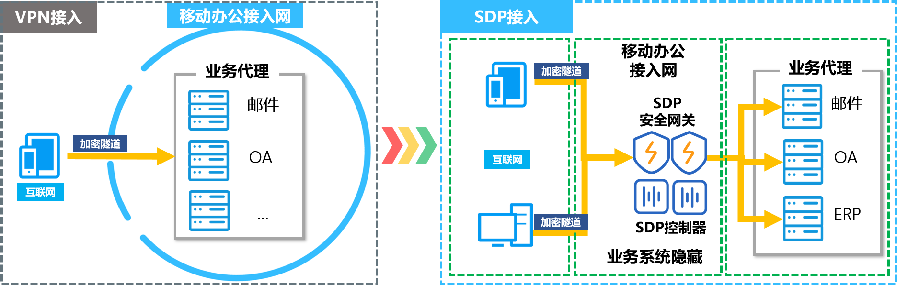
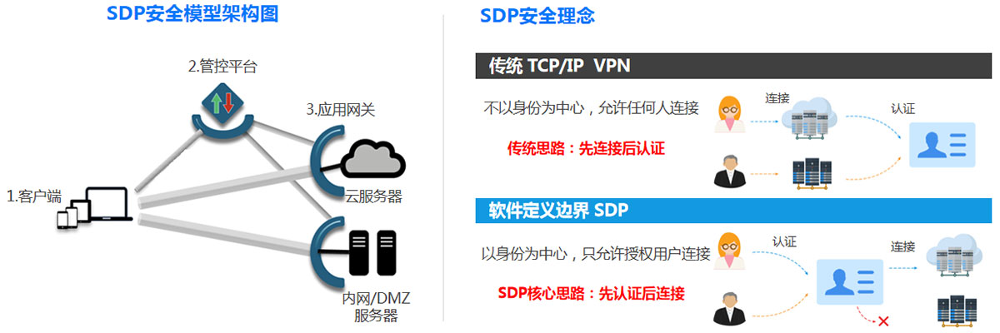
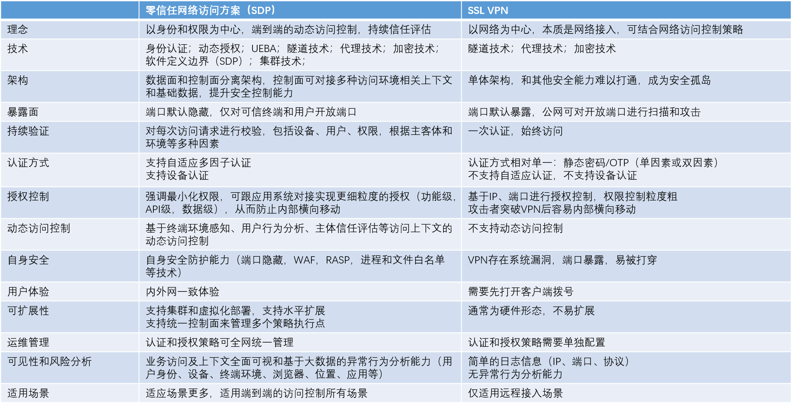

# PC远程办公方案

## 背景

目前，移动安全办公项目方案中采用了“移动安全办公APP+VPN”方式，接入移动办公接入区。基本场景如下：

- 接入前：用户输入用户名和密码，通过APP集成的VPN客户端向VPN服务器发出接入请求；
- 接入中：VPN服务器验证用户身份认证信息，允许或拒绝用户访问移动办公区网络；
- 接入后：用户通过APP提供的邮件、OA等应用开展移动办公，期间通过VPN加密信道与移动办公接入区进行数据交换。

随着工作推进，项目组了解到集团内各单位对移动安全办公项目有新的需求，主要有以下几点：
- 个人PC端是否可接入移动办公区？
- 能否在移动安全办公系统中融入更多应用？
- 能否实现PC端“数据不落地”？

为了回答这些问题，提高用户使用体验和网络安全能力，我们对安全接入技术进行了调研，发现基于软件定义边界（SDP）的接入方案具有技术优势和安全优势。

### SDP简介

软件定义边界（SDP）是国际云安全联盟（CSA）于2013年提出的新一代网络安全架构，CSA《SDP标准规范1.0》给出的SDP的定义是：“SDP旨在使应用程序所有者能够在需要时部署安全边界，以便将服务与不安全的网络隔离开来，SDP将物理设备替换为在应用程序所有者控制下运行的逻辑组件并仅在设备验证和身份验证后才允许访问企业应用基础架构。”

SDP架构主要包括四个部分：
- SDP 控制中心，用于定制访问控制策略；
- SDP 网关，完成策略身份验证、访问控制策略审核、流量转发；
- SDP 连接发起主机，例如用户的手机、PC等；
- SDP 连接接受主机，例如内部的门户网站服务器、邮件服务器、OA服务器等。

### SDP接入与VPN接入对比分析

SDP作为一种新型的安全接入方案，具有以下特点。

SDP方案的优势：
- 在授权上粒度更细，在策略执行上更灵活；
- 在远程访问网络延迟性能上有更好的用户体验；
- 在后期容量扩展上，有更好的弹性和成本优势。

SDP方案的劣势：
- 初次建设需要更多预算，投入较大。
  - 终端客户端（软件）
  - SDP网关和控制器（服务器）、终端agent等，
- 终端客户端策略和控制权策略需要与现有应用适配，需要时间。

详细对比见下图：

### 对现有需求的支持

#### 对“远程安全接入”的支持
SDP与VPN都能够实现安全接入，但验证方式不同。
- VPN在验证终端可信性时，使用单一的身份验证信息（用户名、口令或证书）实现；
- SDP在验证终端可信性时，使用综合身份验证信息（用户名、口令、声纹、面部...证书)、设备信息、网络环境信息等，综合判断实现。

#### 对“个人PC端接入移动办公区”的支持

SDP与VPN两种接入方式都支持PC端接入移动办公区，都能验证用户身份，实现加密传输。

#### 对“在移动安全办公系统中融入更多应用”的支持

事实上，VPN技术与SDP技术与这个问题关联不大，但在授权使用上存在一定的支持作用。

VPN仅解决安全接入的问题，某用户一旦经过身份验证，所有应用对次用户都可使用。

SDP除了解决安全接入问题，还能够帮助应用进行动态的身份验证和细粒度的权限控制。例如：
- 可实现“某部门的用户仅访问自己的应用，对其它单位的应用不可见”；
- 可实现“某个用户或设备能访问某些应用，更换用户或设备就不能使用这些应用”。

#### 对“数据不落地”的支持

VPN技术与SDP技术与这个问题没有直接关系。这个问题的解决需要数据防泄漏技术（DLP）进行解决。

一些SDP提供商将部分DLP功能集成到SDP控制器中，并借助SDP的身份验证、设备验证、环境验证等功能实现数据防泄漏的控制。而VPN提供商很少集成DLP能力。

### 建设方案

#### 基本考虑

考虑到移动办公系统将逐步平台化，需要适配多元使用场景、集成更多的应用系统、增强数据安全与防泄漏能力，以及弹性扩展移动办公接入网性能，建议将SDP技术作为一种安全接入手段列入移动安全办公项目方案。原VPN接入仍保留，VPN接入与SDP接入互为备份（这也是一些单位的实践经验）。

由于SDP技术主要解决的是安全接入问题，所以对原方案的影响不大，具体可见下图：

