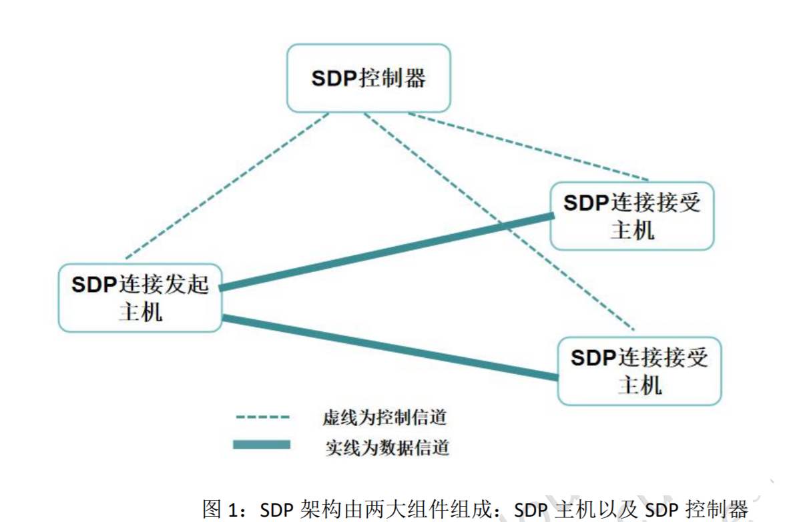
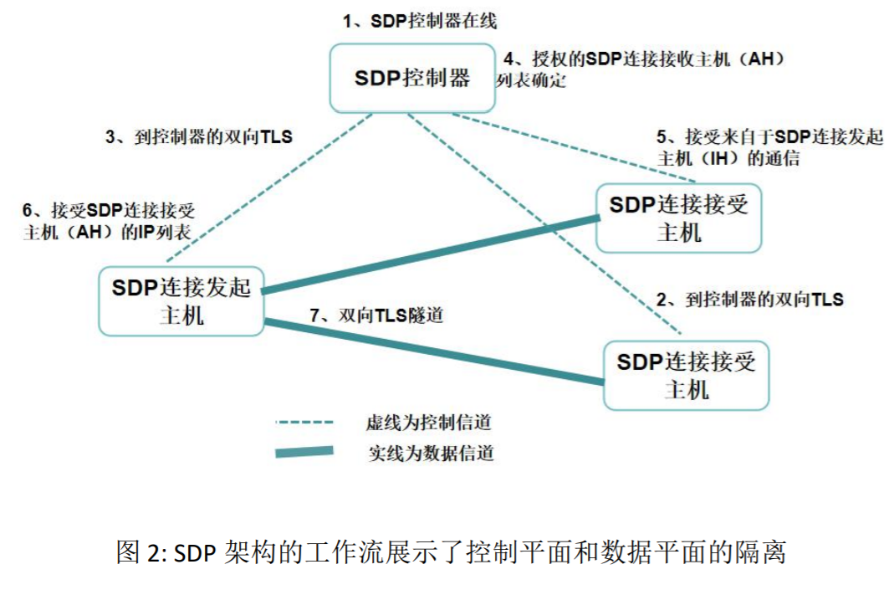

# SDP 标准 v1.0

本文档概述了云安全联盟（CSA）为软件定义边界（Software Defined Perimeter，即 SDP）规范发起的协议，并征求讨论和改进建议。本文档的分发无限制。本文档是基于 RFC 4301 IP 安全架构构建的。

“软件定义边界（SDP）协议”，旨在提供按需、动态配置的安全隔离网络。安
全隔离网络是与所有不安全网络隔离的可信网络，避免受到网络攻击。SDP 协议基于的工作流程是由美国国防部（DoD）发明并被一些联邦机构（Federal Agencies）使用。基于这些工作流程的网络提供了更高级别的安全性，但与传统企业网络相比，它们被认为非常难以使用。

软件定义边界（SDP）虽然基于广义的 DoD 工作流程，但已为商业用途而将其修改，使其能与现有的企业安全控制兼容。在适用的情况下，SDP 遵循 NIST 关于加密协议的指南。 SDP 可用于政府应用，例如安全访问 FedRAMP 认证的云网络以及企业应用程序，或实现对公有云的安全移动访问。

## SDP介绍

SDP协议分两部分：
- 控制层面：描述了SDP连接发起主机（IH）和SDP连接接受主机（AH）如何与SDP控制器通信。
- 数据层面：描述了SDP连接发起方如何与SDP连接接收方通信。

### 设计目标
SDP 协议的设计目的是为IPv4和IPv6提供可互操作的安全控制，包括：
- 控制器和受SDP连接接受方保护的服务的隐藏和访问控制
- 从SDP连接发起方到控制器和SDP连接接收方的通信机密性和完整性。

### 背景

- 企业网络边界变得模糊，云、移动、物联;
- 传统边界并不安全，设备多，漏洞也多。

### SDP 概念

SDP旨在使用户能够在需要时部署安全边界，将服务与不安全的网络隔离开。SDP将物理设备替换为逻辑部件。SDP仅在设备验证和身份验证后才允许访问企业应用基础架构。

SDP中，每个server都隐藏在远程访问网关之后，在授权服务可见且允许前，用户要进行身份验证。

### SDP架构

最简形式由两部分组成：
- SDP主机，负责发起连接、或接受连接。这些操作由安全控制通道与SDP控制器交互管理。
- SDP控制器

#### SDP 控制器
SDP 控制器确定哪些 SDP 主机可以相互通信。SDP 控制器可以将信息中继到外部认证服务，例如认证，地理位置和/或身份服务器。

#### SDP 连接发起主机（Initiating Host,即 IH）
SDP 连接发起主机（IH）与 SDP 控制器通信以请求它们可以连接的 SDP 连接接受方（AH）列表。 在提供任何信息之前，控制器可以从 SDP 连接发起主机请求诸如硬件或软件清单之类的信息。

#### SDP 连接接受主机（Accpeting Host，即 AH）
默认情况下，SDP 连接接受主机（AH）拒绝来自 SDP 控制器以外的所有主机的所有通信。 只有在控制器指示后，SDP 连接接受主机才接受来自 SDP 连接发起主机的连接。

### SDP 工作流

- 1.一个或多个SDP控制器服务上线，并连接至适当的可选认证和授权服务，例如：
  - PKI 颁发证书认证服务
  - 设备验证服务
  - 地理定位
  - SAML
  - OpenID
  - Oauth
  - LDAP
  - Kerberos
  - 多因子身份验证服务
- 2.一个或多个SDP连接接受主机（AH）上线。这些主机连接到SDP控制器，并由其进行身份验证。目前，AH不会应答来自任何主机的通信，也不响应非预分配的请求。
- 3.每个上线的SDP连接发起主机（IH）都与SDP控制器连接并进行身份验证。
- 4.在验证SDP连接发起主机（IH）之后，SDP控制器确定可以授权给SDP连接发起主机（IH）与之通信的SDP连接接受主机（AH）列表。
- 5.SDP控制器通知SDP连接接受主机AH接受来自SDP连接发起主机IH的通信以及加密通信所需的所有可选安全策略。
- 6.SDP控制器向SDP连接发起主机IH 发送可接受连接的SDP连接接受主机AH列表以及可选安全策略。
- 7.SDP连接发起主机IH向每个可接受连接的SDP连接接受主机AH发起单包授权，并创建这些SDP连接接受主机AH的双向TLS连接。