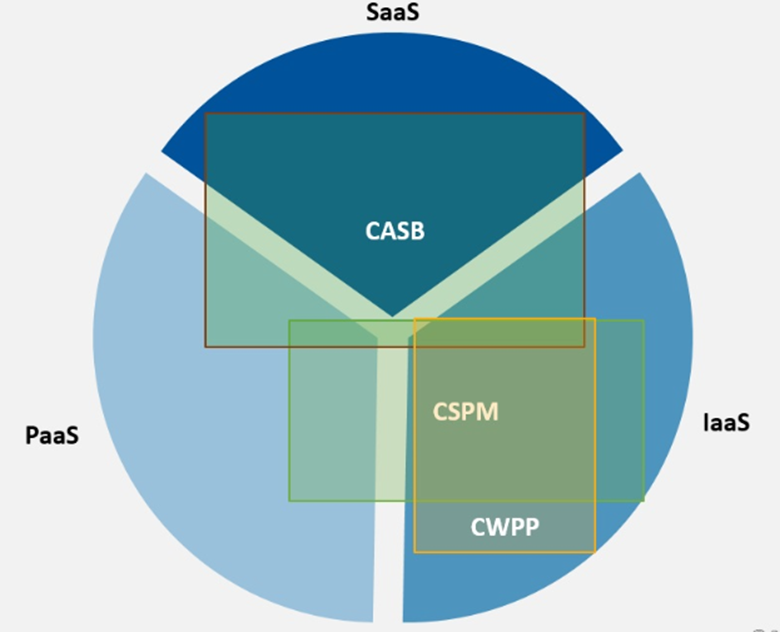
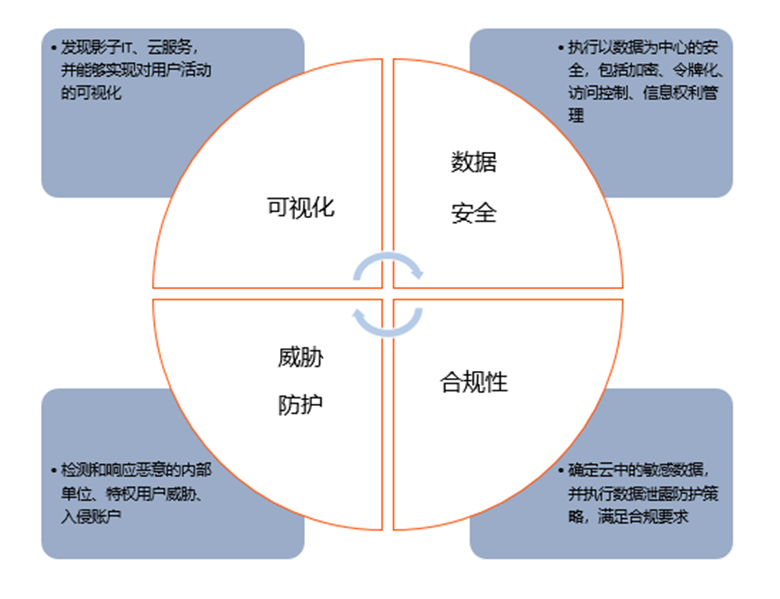
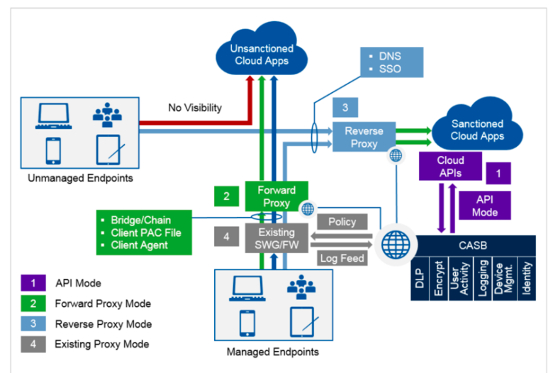
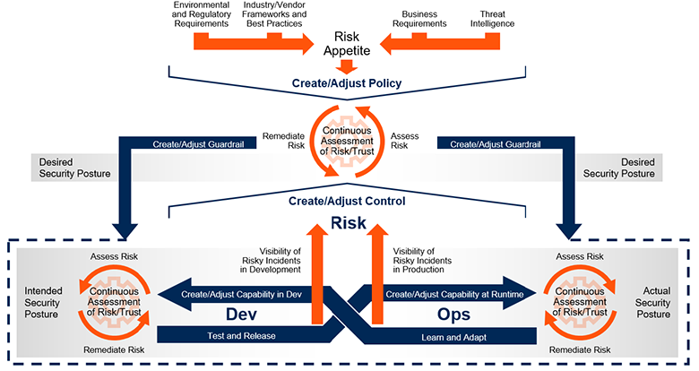
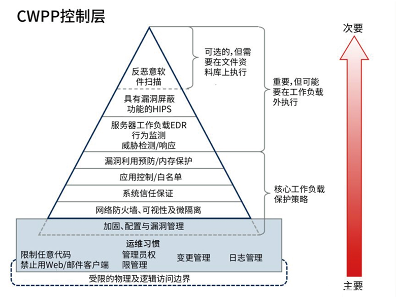

# 三大云安全工具（CASB、CSPM、CWPP）的使用场景

- https://www.aqniu.com/vendor/59616.html

由于“云安全”的概念所涉范围非常广，本文只针对Gartner提出的比较流行的三类云安全产品进行阐述。Gartner曾提出三大云安全管理工具，分别是CASB、CSPM和CWPP。虽然这三大工具在一些功能上有所重叠，但三者之间更多是起到互补作用。下文首先简单介绍了三大安全工具在应用场景上的差别，然后介绍了三大云安全工具的详细应用情况。对于这三类产品不熟悉的读者可以阅读后文的详细内容。

责任共担与三大云安全工具的应用场景
为了切实解决云安全问题，供应商和企业都需要共同承担责任，双方各自负责处于其控制之下的技术。双方各自需要承担哪些职责，是由具体场景决定的：本地部署、IaaS、PaaS或SaaS（请参见图2）：

在传统的企业级IT场景下，所有基础架构均在本地运行，企业负责所有安全措施；
在IaaS场景下，云提供商负责保护后端数据中心、网络、服务器和虚拟化；企业负责保护有效负载，例如操作系统、数据库、安全性和应用程序。这种情况下，企业要负责保护自己在公有云中运行的工作负载；
而在PaaS这种无服务器场景下，企业则主要负责保护应用程序；
对于SaaS场景，应用程序和数据的安全性全部由服务提供商负责，而访问安全性则取决于企业及其用户。

为了切实解决云安全问题，供应商和企业都需要共同承担责任，双方各自负责处于其控制之下的技术。双方各自需要承担哪些职责，是由具体场景决定的：本地部署、IaaS、PaaS或SaaS.

## 云访问安全代理 CASB

CASB出现最早是为解决影子资产问题，尤其是随着SaaS服务的快速发展，从底层硬件资源到上层软件资源，最终用户都无法实施控制。而CASB能很好解决此类问题，并且很多用户在使用CASB产品之后，发现自身企业的云服务数量是他们所认知十倍之多。

主要功能：
(1) 深度可视化—CASB提供了影子IT发现、组织机构云服务格局的统一视图以及从任何设备或位置访问云服务中数据的用户的详细信息。

(2) 数据安全性—CASB能够实施以数据为中心的安全策略，以防止基于数据分类、数据发现以及因监控敏感数据访问或提升权限等用户活动而进行有害活动。通常是通过审计、警报、阻止、隔离、删除和只读等控制措施来实施策略。DLP（数据丢失防护）功能很普遍，并且是仅次于可视化的最常用的一项控制措施。

(3) 威胁防护—CASB通过提供AAC来防止有害设备、用户和应用程序版本来访问云服务。可以根据登录期间和登录之后观察到的信号来更改云应用程序功能。CASB此类功能的其他示例包括通过嵌入式UEBA识别异常行为、威胁情报、网络沙箱以及恶意软件识别和缓解。

(4) 合规性—CASB可帮助组织机构证明，是组织机构在管理云服务的使用情况。CASB提供了信息来确定云风险偏好并确定云风险承受能力。通过各种可视化、控制和报告功能，CASB有助于满足数据驻留和法律合规性要求。

CASB可以通过API、转发代理、反向代理等方式来实现:

## 云安全配置管理（CSPM）
公有云IaaS和PaaS服务中的高度自动化和用户自助服务，更加突出了正确的云配置和合规性的重要性。一个错误就可能立即暴露出数千个系统或大量敏感数据。云服务的采用率不断增长，加之平台服务的数量不断增加，而云技能（包括安全性）却相对匮乏，这让企业信息和工作负载暴露无遗。雪上加霜的是，对程序化云基础架构缺乏全面了解，这意味着很长一段时间都不会发现配置不正确和不合规问题。这就导致了，即便底层的云提供商基础架构本身是安全的，但大多数企业都没有准确的流程、成熟工具或规模来确保安全使用云服务。

CSPM能够对基础设施安全配置进行分析与管理。这些安全配置包括账号特权、网络和存储配置、以及安全配置（如加密设置）。如果发现配置不合规，CSPM会采取行动进行修正。如图6所示，应该将CSPM视为一个持续改进和适应云安全态势的过程，其目标是降低攻击成功的可能性，以及在攻击者获得访问权限的情况下降低发生的损害。

由于云基础架构始终处于变化之中，因此，CSPM策略应该是在云应用的整个生命周期中进行持续评估和改进的一个策略，从研发开始一直延伸到运维（图6中从左到右），并在需要时做出响应和改进。同样，由于不断提出新的云功能，不断颁发新法规，云使用安全的策略也在不断变化。图6的顶部显示，CSPM策略应不断发展并适应新的情况、不断发展的行业标准和外部威胁情报，并根据在开发和运维中观察到的风险进行改进。

## 云工作负载保护平台（CWPP）
云工作负载保护平台（CWPP）市场是指以工作负载为中心的安全产品，旨在解决现代混合云、多云数据中心基础架构中服务器工作负载的独特保护要求。CWPP应该不受地理位置的影响，为物理机、虚拟机、容器和无服务器工作负载提供统一的可视化和控制力。CWPP产品通常结合使用网络分段、系统完整性保护、应用程序控制、行为监控、基于主机的入侵防御和可选的反恶意软件保护等措施，保护工作负载免受攻击。（关于CWPP产品市场近几年来的发展演进，请参考之前的《干货|CWPP产品市场演进》。）

下图显示了现代混合多云数据中心架构中工作负载保护策略的主要构成要素。

上图是一个分层金字塔，底部是一个矩形基座。服务器工作负载的安全性源于阴影基础中良好的运维习惯。任何工作负载保护策略都必须从此处开始，并确保满足以下条件：

- 任何人（攻击者或管理员）都很难从物理和逻辑上访问工作负载。
- 工作负载镜像仅包含所需的代码。服务器镜像中应禁止使用浏览器和电子邮件。
- 需要通过严格管理流程，才能更改服务器工作负载，并且通过强制性强身份验证来严格控制管理访问。
- 收集和监控OS和应用程序日志。
- 对工作负载进行固化、缩小容量及打补丁，减少攻击面。

总结
目前，Gartner提出的三大云安全工具CASB、CSPM、CWPP，针对基础架构中IaaS、PaaS和SaaS层中的不同安全问题，给出了针对性的解决方案。虽然这三大工具不一定能全面覆盖所有安全问题，却也为企业在采用云服务时，加强安全控制措施指明了方向，提供了思路，可以更好地针对具体问题制定具体的解决方案。

当然未来，随着云服务的不断发展，安全控制措施肯定也会紧跟云服务的发展步伐，为云服务的发展保驾护航。