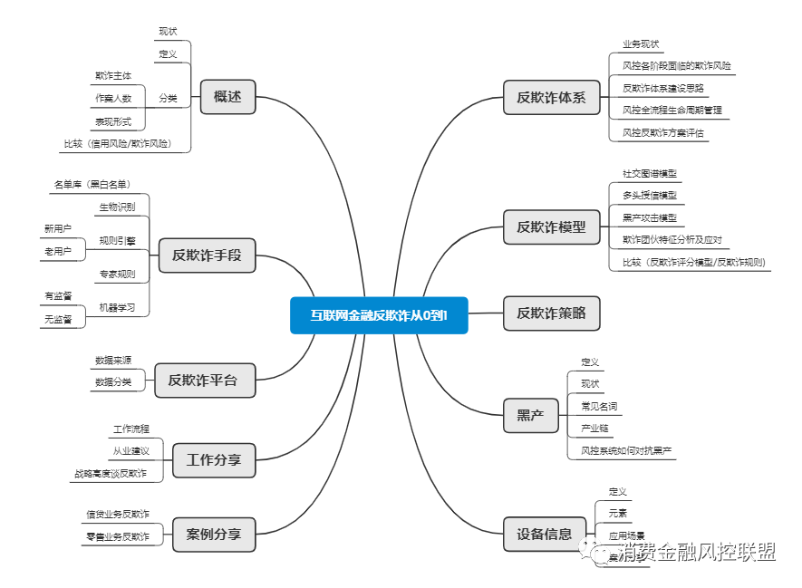

# 业务反欺诈

## 业务各阶段反欺诈要点
欺诈风险贯穿于整个业务之中，反欺诈也要从事前、事中、事后的闭环流程上考虑。

### 事前-识别
主要为客户身份核验、银行卡核验、运营商核验、黑灰名单以及关系图谱等进行反欺诈策略的提取、测试和框架搭建。
### 事中-检测
工作重点集中在贷度监控、风险异常排查以及交易监控等多维度去构建监控框架。

### 事后-判定和响应
重点在逾期失联客户的排查、失联信息修复以及欺诈发生资产构建贷保全的欺诈框架。

## 体系建设

### 思路

构建风险预测、风险预防、风险识别、风险决策、风险响应、风险回溯的闭环。

风控全流程生命周期管理
这里说的全流程风险管理，特指的是线上业务，还是以消费金融业务为例。
一个完整风控平台需要包括对借款申请全生命周期进行管理，是一个极为复杂的过程，每一个流程都会影响整体的风控质量。
风控平台是相对独立的系统，信审的案件可以从借款端平台推过来，也可以从第三方平台推过来。案件到达风控平台后，自动创建工作流，根据风控流程处理各流程环节任务。
在此我们没有按照贷前贷中贷后三个环节划分，而是从申请人角度从操作层面上， 把线上业务进行流程划分：注册-登录-申请-审核-放款-催收。为了方便大家理解， 我们简要罗列下每个业务环节的风控点。 

3.5风控反欺诈方案评估
反欺诈方案好不好，是否准确，需要不断评估并进行优化。相应的数据指标暂不提及，仅针对于常规评估方案讨论