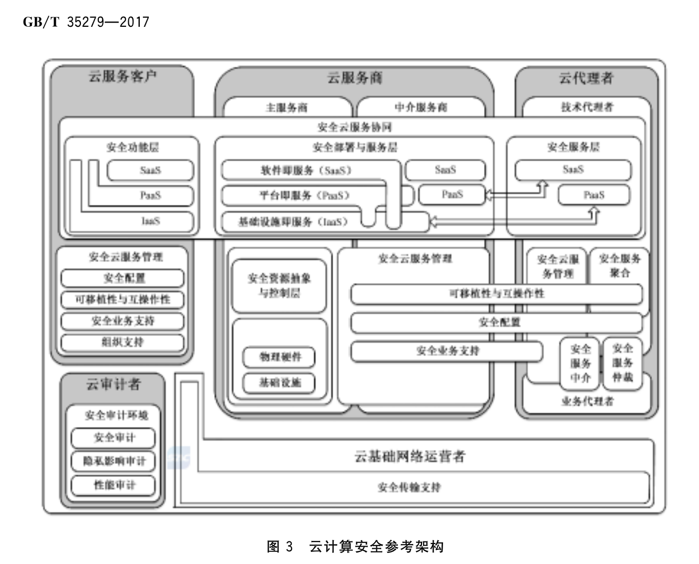

# 云计算安全参考架构

> 引用GB/T 35279-201 《信息安全技术 云计算安全参考架构》内容

在一种云服务中，信息与业务的安全性涉及所有参与该服务的云计算角色。为了清晰地描述云服务中各种参与角色的安全责任，需要构建云计算安全参考架构，提出云计算角色、角色安全职责、安全功能组件以及它们之间的关系。

本标准适用于指导所有云计算参与者在进行云计算系统规划时对安全的考量与设计。

## 术语

### 云计算
通过网络访问可扩展的、灵活的物理或虚拟资源池，并按需自助获取与管理资源的模式。

注：资源实例包括服务器、操作系统、网络、软件、应用与存储设备。

### 云计算环境

云服务商提供的云计算平台，及客户在云计算平台上部署的软件及相关组件的集合。

## 概念

### 云计算相关概念
云计算由一个可配置的共享资源池组成，该资源池提供网络、服务器、存储、应用与服务等多种硬件和软件资源。资源池具备自我管理能力，用户只需少量参与就可以方便快捷地按需获取资源。云计算提高了资源可用性，具有5个基本特征、3种服务模式、4种部署方式。

具体可参考GB/T31167-2014

5个基本特征：
- 按需自助服务
- 泛在化接入
- 资源池化
- 快速伸缩性
- 服务可计量

3种服务模式：
- SaaS
- PaaS
- IaaS

4种部署方式：
- 私有云
- 公有云
- 社区云
- 混合云

### 云计算参与角色

有5类角色：
- 云服务商
- 云服务客户
- 云审计者：负责对云服务进行独立评估、审计、负责审计云服务的供应与使用。云审计通常覆盖运营、性能与安全，检查一组特定的审计准则是否得到满足。
- 云代理者
- 云基础网络运营者

### 云计算的安全挑战

云的安全特性：
- 宽带网络接入
- 降低云服务客户对数据中心的可视性及控制力度；
- 动态的系统边界；
- 多租户；
- 数据驻留在云服务商
- 自动部署与弹性扩展。

云计算的自身特性给云服务客户带来了与传统信息技术解决方案不同的安全风险，影响生态系统的安全。为保持迁移到云后的数据的安全级别，云服务客户应提前确定所有云特有的风险及调整后的安全措施，并通过商业合同或服务级别协议（SLA）要求云服务商识别、控制并正确部署所有的安全组件。

云服务客户应基于风险分析确定应部署的安全措施，确保迁移到云中的数据与应用安全。

所有的云参与者都有责任保障云服务安全，确保能够满足云服务客户的安全需求，包括但不限于：
- 风险分析、风险评估、脆弱性评估、业务持续性规划、灾难备份规划
- 物理与环境安全策略、用户账户终止程序、持续规划，包括：测试协议、实践报告与应急响应规划、设备布局。
- 符合国家、行业、企业等相关信息安全标准
- 供应商设施、安全基础设施、人力资源管理、物理安全与环境安全
- 将服务的恢复计划纳入量化的恢复点目标（RPO）与恢复时间目标（RTO）。
- 云服务商与云代理者的安全现状。

## 云计算安全参考架构

基于云计算特性，3种服务模式、5类角色建立的云计算安全参考架构如下图所示：

上图的云计算安全参考架构是基于角色的分层描述，其中包括下述安全组件和子组件：

### 云服务客户

#### 安全云服务管理
安全云服务管理包含支撑用户业务运行与管理所需的安全功能。

用户业务运行与管理的安全需求包括：
- 业务支持安全需求
- 服务提供与配置安全需求
- 可移植性与互操作安全需求
- 安全组织支持

由上述需求得出该组件的功能如下：
- 业务支持安全
- 配置安全
- 移植与互操作安全
- 组织性支持安全

##### 业务支持安全
云服务客户的业务支持安全架构组件涵盖用于运行业务操作的服务，包括：
- 管理与其他云参与者（云服务商、云代理者、云基础网络运行者与云审计者）的业务关系，提供符合最佳安全实践的协作，例如认证与授权云参与者之间的交互。
- 跟进业务流程，并根据安全最佳实践解决与其他云参与者之间的云相关问题，包括：安全业务处理与操作的持续性。
- 管理服务合同，包括：建立、协商、关闭或终止合同，确保不存在安全隐患。
- 仅在安全隐患解决后实现服务。
- 付款与发票管理，确保不存在欺诈性付款并遵循网络安全最佳实践。

通过云服务客户的访问控制策略、业务持续性规划与多种生产效率跟踪机制，业务支持安全架构组件也可实现对组织成员与合约商的身份与凭证管理。这些服务能够保证云计算环境中业务的日常运行安全。

##### 配置安全

云服务客户配置安全架构组件包括保证云资源配置安全并与现有的安全标准、规范、法规相一致，同时满足服务级别协议需求的任何能力、工具与策略。云资源配置安全准则可能还包括云服务客户与云服务商规定的专有措施。

云服务客户的云资源配置安全管理应涵盖下述领域：
- 快速部署：基于所请求的服务、资源或能力自动部署云服务。例如，安全快速部署管理确保请求来自一个已通过认证与授权的源。
- 资源变化：在修复、升级与新增云节点时调整配置与资源分配。例如，安全资源变化管理确保资源变化请求来自一个已通过认证与授权的源。
- 监测与报告：发现与监测虚拟资源，监测云的操作与事件，并生成安全报告。
- 度量：度量的安全管理是指云服务商实施特定的内部控制措施，确保可对存储加密、可对处理沙箱化、可报告异常带宽使用、且用户账户管理与云服务客户的安全策略一致。
- 服务级别协议管理：根据已确定的策略进行SLA合同定义（带有服务质量参数的基本模式）、SLA监控与SLA实施。

##### 可移植性与互操作安全
云服务客户、云供应商与云代理者均应满足如下安全可移植性与互操作性要求：
- 安全可移植性与互操作性架构子组件应确保数据与应用程序可安全地转移到多个云服务中。
- 应保证系统维护时间与中断次数符合服务级别协议（SLA）中的最低接受等级。
- 应通过安全与统一的管理接口为云服务客户提供一种机制，使云服务客户可在多个云服务中进行数据与应用的互操作。
- 安全可移植性与互操作性的需求应根据所选择服务类型的不同而不同。

对于云服务客户，映射到架构子组件的安全组件应为数据与/或应用程序转换到不同的云服务商或云技术代理者提供更大的灵活性。

##### 安全组织支持
安全组织支持架构子组件覆盖了组织机构提供的策略、规程与处理过程，支持整体云安全服务管理。对于云服务客户，映射到组织支持架构子组件的安全组件包含（但不限于）：一致性管理；基于治理风险与合规性的审计管理；技术安全标准；最佳实践与管理的相关性；符合规范与标准的信息安全策略。

####　安全云服务协同

云服务协同是系统组件的一种组合，支持云服务商对计算资源进行部署、协调与管理，为云服务客户提供安全的云服务。安全服务协同是一个过程，需要所有的云参与者通力合作，基于云服务类型与部署模型不同程度地实现各自的安全职责。

安全服务层涉及云服务商、云代理者与云服务客户。云服务客户仅需确保云服务接口，以及接口之上功能层的安全。根据云部署模型的不同，云服务接口可能位于IaaS、PaaS或SaaS层。云服务客户只能依靠云服务商或云技术代理者保障云服务接口以下服务的安全。

##### 安全功能层
基于使用的云服务模型（IaaS、 PaaS与SaaS），云服务客户部署安全组件集保护云功能层安全，并与其他云参与者已部署的安全组件集密切相关。

在SaaS云服务中，云服务客户对其使用的应用服务具有很少的管理权限，即对云及其安全组件具有很少的控制权。

在PaaS云服务中，云服务客户对应用服务具有控制权，并对主机环境设置具有部分控制权，但对平台下层的基础设施(如网络，服务器，操作系统与存储介质等)具有有限的管理权或访问权。

在IaaS云服务中，云服务客户可以使用系统提供的基础设施与计算资源（例如虚拟计算机）满足基本的计算需求。同时，云服务客户也可以访问更多的基础计算资源，并控制更多的应用软件，包括操作系统与网络等。例如，在IaaS云服务中，云服务客户可以在各个服务层(IaaS、PaaS与SaaS)实现基础设施保护服务（例如边界防火墙）。然而，云服务客户无法在PaaS与SaaS层部署服务器防火墙安全组件，只能依靠云服务商提供服务器防火墙服务。因此，云服务客户应在服务级别协议中明确所需的安全防护级别。

###　云服务商
#### 云服务商的框架组件与子组件描述

根据云服务商的服务范围与实施的活动，云服务商的架构组件为：服务部署、服务编排、云服务管理、云服务安全与隐私保护。由于安全与隐私保护、数据内容管理、服务级别协议（SLA）等是跨组件的，安全参考架构模型将云服务商的安全活动交错分布到所有的组件层，覆盖云服务商负责的全部领域，并且将安全性嵌入到与云服务商有关的全部架构组件中。另外，云部署作为云服务的一部分，直接与云服务商提供的服务相关。因此，安全参考架构为云服务商定义了下列框架组件与子组件：
- 安全云服务管理
  - 安全供应与配置
  - 安全可移植性与互操作性
  - 安全业务支持
- 安全云服务协同
  - 安全物理资源层（硬件与设施）－仅主服务商
  - 安全资源抽象与控制层（硬件与设施）－仅主服务商
  - 安全部署与服务层
  
主服务商通过技术代理者直接向云服务客户提供服务，或与中介服务商等合作伙伴间接地向云服务客户提供服务。中介服务商也可将一个或多个主服务商的服务集成后向云服务客户提供服务。多个云服务商之间形成依赖关系，此依赖关系通常对云服务客户不可见，即主服务商与中介服务商提供服务的方式对云服务客户没有区别。中介服务商负责的安全组件与控制措施与主服务商相同，并需在多个云服务商之间进行协调。

####　安全云服务协同
本标准描述一个3层模型，代表云服务商交付服务需提供的3种类型的系统组件，这三层是：
- 服务层：代表云服务商提供的3类服务（IaaS, PaaS与SaaS）；
- 资源抽象与控制层：包含通过软件抽象，云服务商用于提供与管理访问物理计算资源的系统组件；
- 物理资源层：包括所有的物理计算资源，例如硬件资源（CPU与内存）、网络设备与软件（路由器、防火墙、交换机、网络链接与接口）、存储组件（硬盘）以及其他物理计算基础设施元素。

安全参考体系架构组件由下述三层构成：
- 安全部署与服务层
- 安全资源抽象与控制层
- 安全物理资源层

##### 安全部署与服务层

基于所提供的云服务类型（例如SaaS, PaaS或Iaas）与云部署模型（例如公有云或私有云），云服务商实施保障服务层安全的安全组件集。对于云服务中的每一个实例，云服务商负责实施的安全组件集都与其他云参与者实施的安全组件集密切相关。

对于IaaS云服务，云服务商提供与物理计算资源相关的服务，包括服务器、网络、存储与主机基础设施。云服务商运行所需的云软件，通过一套服务接口与计算资源抽象（例如虚拟机与虚拟网络接口），将计算资源提供给IaaS云服务客户。不管采用哪种云服务，云服务商始终控制物理硬件与云软件，因此能够提供这些基础设施服务（例如，物理服务器、网络设备、存储设备、主机操作系统、虚拟监控器等）。

对于PaaS云服务，云服务商管理平台的计算基础设施，并运行提供平台组件能力的云软件，例如运行时软件执行栈、数据库与其他中间件组件。通常，提供PaaS服务的云服务商也为云服务客户提供开发、部署与管理的工具。这些工具可集成到开发环境（IDEs）、云软件开发版本、软件开发套件（SDKs）或部署与管理工具中。

对于SaaS云服务，云服务商部署、配置、维护与更新云基础设施上的应用软件，使服务可以按照期望的服务级别供应给云服务客户。SaaS云服务商对管理和控制应用程序与基础设施负主要责任。

##### 安全资源抽象与控制层

安全资源抽象与控制层是包含云服务商实现的安全组件的架构组件，通过软件抽象提供安全访问与管理物理计算资源的功能。资源抽象组件的例子包括虚拟监控器、虚拟机、虚拟数据存储这样的软件元素。资源抽象组件应确保相关物理资源有效、安全与可靠的使用。虚拟机技术通常在本层使用，但提供必要软件抽象的其他方法也可以使用。本层的控制部分系指负责资源分配、访问控制与使用监控的安全软件组件。这是将多种物理资源及其软件抽象进行绑定，实现资源池化、动态分配与测量服务的软件架构。

云服务商应采用适当的安全机制，确保只有经过授权的用户才能访问系统、服务与数据，且用户或租户不能未经许可访问其他租户的信息。系统应隔离系统管理功能与用户相关的功能（包括用户接口服务），不能将系统管理功能暴露给向非特权用户。安全功能应与非安全功能隔离，并可作为分层结构实施，使各层之间最少交互，并保障低层功能与高层功能的独立性。

##### 安全物理资源层

安全物理资源层是架构子组件，包含需要确保物理计算资源安全的安全组件。本层包括硬件资源，例如计算机（CPU与内存）、网络（路由、防火墙、交换机、网络连接与接口）、存储部件（硬盘）与其他物理计算基础设施元素。它还包括设施资源，例如：供暖、通风与空调（HVAC）、电力、通讯及其他物理设备。

####　安全云服务管理
云服务管理可以如下描述：
- 供应与配置需求
- 可移植性与互操作性需求
- 业务支持需求

此外，基于不同的云服务结构，安全云服务管理的不同部分可由云服务商或云代理者支持与实现。这些服务可通过云服务客户的安全云服务管理进行补充。

##### 安全供应与配置
安全供应与配置架构子组件包含确保云资源安全配置与供应的所有安全组件（例如，能力、工具或策略），并应符合相应的安全标准、法规与规范。安全配置云资源的准则也包含云服务客户与云服务商在服务级别协议（SLA）中确定的专用措施。

云服务商对云资源配置的安全管理与供应涉及到的领域参见“云服务客户的配置安全”。 

##### 安全可移植性与互操作性
云服务客户、云供应商与云代理者均应满足的安全可移植性与互操作性要求，参见“云服务客户的可移植性与互操作性要求”。

基于不同的云服务模型，安全可移植性与互操作性的需求也不同。例如对于云服务商，SaaS云服务可能要求在不同云上运行的多个应用之间进行数据集成；IaaS云服务可能要求迁移数据与应用到新的云上，与此同时确保应用程序仍可操作。第一个例子只需简单地将数据以标准格式提取并备份即可。第二个例子则需首先捕获虚拟机映像，然后将它们迁移到一个或多个有可能采用不同虚拟化技术的新云服务商。基于云服务客户在服务级别协议（SLA）中定义的安全策略的配置仍需保留。迁移后，需删除或记录任何云服务商特定的虚拟机映像扩展。云服务商应理解并满足云服务客户的可移植性与互操作性需求。

##### 安全业务支持

安全业务支持架构子组件包含运行面向客户的业务操作所用的所有安全组件，使云服务商以安全方式对云服务客户、云代理者及其他云服务商进行业务支持。

中介云服务商应确保下游服务商适当地实施了他们自己负责的安全组件与控制措施，且风险与责任已经明确。

与云服务客户签署合同并明确责任后，业务支持的责任由主服务商与中介服务商共同承担。云服务商业务支持的职责包括：
- 云服务客户管理：管理云服务客户账户、打开/关闭/终止账户、管理用户配置文件、管理云服务客户关系、基于云服务客户的安全策略解决云服务客户的问题等。
- 合同管理：管理服务合同，包括建立/协商/关闭/终止合同等；提供云服务客户安全审计与报告所需的信息。
- 仓储管理：以安全方式建立与管理服务目录等。
- 记帐与计费：管理云服务客户的计费信息、发送计费状态、处理收到的支付、追踪发票等，确保有效跟踪与纠正欺诈活动。
- 报告与审计：监控用户操作、生成报告等，支持云服务客户的安全审计与监控需求。
- 定价与评级：评估云服务并确定价格，在不违反云服务客户保护的法律下，基于用户的配置处理促销与定价规则等。

### 云代理者
云代理者系指管理云服务的使用、性能与交付，并协调云服务商与云服务客户之间关系的实体。云计算安全参考架构模型中强调了两种类型的云代理者：技术代理者与业务代理者。

通常，云代理者提供的服务组合可以分为五种架构组件：安全服务聚合、安全服务仲裁、安全服务中介、安全云服务管理和安全云服务协同。其中，前四个组件分别对应云代理者所提供的服务，第五个组件则对应云代理者的责任，即作为安全云服务协同的一部分保障云服务的安全性。五个架构组件的详细定义如下：

- 安全服务聚合：该架构组件包含将多个独立服务融合与集成到一个或多个新服务的安全组件。云代理者提供数据集成功能，并确保基于云服务客户的安全策略数据在云服务客户与多个云服务商间之间安全迁移。安全服务聚合可从如下描述：
  -	可移植性与互操作性的技术需求
  - 供应与配置的技术需求
- 安全服务仲裁：该架构组件类似于安全服务聚合组件，只是所聚合的服务是不固定的。服务仲裁意味着云代理者可以从多个云服务商灵活地选择服务。例如，云代理者可使用信用评分服务选择一个具有最高分数的云服务商。

- 安全服务中介：该架构组件包含的安全组件，可使云代理者为云服务客户改进某些服务，或提供增值服务增强原有的服务，同时确保云服务客户的安全策略正确实施。增强原有云服务的例子包括：访问云服务的管理、身份管理、性能报告、增强的安全性等。

- 安全云服务管理：该架构组件包含云代理者提供运营服务所必须的，支持全部服务功能（技术与业务）管理的所有安全组件。安全云服务管理可以如下描述：
  - 业务支持需求
  - 供应与配置的业务需求
  - 可移植性与互操作性的业务需求

- 安全云服务协同：该架构组件包含的安全组件，可使技术代理者基于云部署模型（例如私有云和公有云）与服务模式（例如IaaS、PaaS和SaaS），确保所提供服务及附加服务的安全。

在实践中，技术代理者用于保护云服务客户的数据迁移到云的安全组件集，与提供类似服务的中介服务商所使用的安全组件集相同。

### 云审计者

云审计者是对云服务、信息系统运维、性能、隐私影响与安全进行独立评估的云参与者。

云审计者需要一个安全的审计环境，确保从责任方以安全与可信的方式收集目标证据。通常云审计者可用的安全组件与相关的控制措施独立于云服务模式与/或被审计的云参与者。

支持云审计过程的安全审计环境架构组件需要（但不限于）下列机制：
- 安全组件与相关安全控制
- 安全档案
- 安全存储
- 数据位置
- 度量
- 服务级别协议
- 隐私

