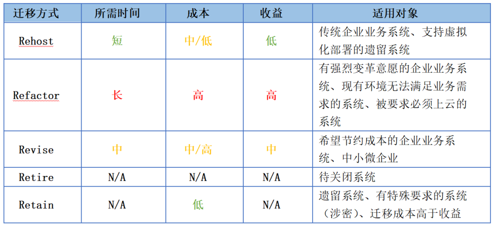

# 云迁移

## 云安全担忧的问题
> 以下内容和数据来自[freebuf《云迁移安全先导篇：2020云安全趋势及主要威胁》](https://www.freebuf.com/articles/es/249945.html)
### 用户关切问题
2020年 freebuf有调研，发现作为云服务的一部分，云供应商开始提供越来越健壮的安全措施，但是最终负责保护云上工作负载的依旧是用户自己。在调查中，最突出的云安全挑战是关于
- 数据泄漏(69%，比去年上升5个百分点)和
- 数据隐私(66%，比去年上升4个百分点)。

紧随其后的是
- 对凭据意外暴露和
- 事件响应的担忧(从去年的29%上升到44%)。

今年看到数据主权问题开始进入大家的视线，因为最近关于数据出境的一些讨论和国际政策，争论比较激烈，具体可以参考《数据安全法（草案）》相关的分析文章。

### 上云后的运维
在运维安全痛点方面，随着越来越多的工作负载迁移到云上，网络安全专业人士已经意识到保护这些工作负载的复杂性。
- 缺乏合格的安全人员(47%)从去年的第三名上升到了排行榜的第一名，这是企业上云后普遍开始遇到的一个问题，目前主要方式还是选择第三方服务机构来进行管理，但这并非适合所有企业。
- 其次是合规性(40%)
- 跨云及本地环境一致性的安全策略(36%)。
- 其他方面可以发现，是近2年来大家一直在关注的问题，安全可视化大屏和监控，
- 自动化监测与响应平台（SOAR、SOC）
- DevSecOps
- 以及遗留系统迁移上云的技术集成等问题。

### 企业上云阻碍（担忧）
- 企业提到缺少专业员工(37%)是加速上云的最大障碍
- 与现有IT环境集成方面的挑战（35%)。
- 以及数据安全问题(并列35%)。
- 合规性31%
- 通用安全风险29%
- 缺少预算24%
- 担心受制于供应商22%

### 云安全最大威胁

- 云平台的错误配置（68%）
- 未授权访问（68%）
- 不安全接口（52%）
- 账户劫持（50%）
- 数据外部共享
- 内部恶意人员
- 国家级的网络攻击
- DDoS

### 传统工具云上集成情况

大多数遗留安全工具都不是为云而设计的。82%的受访者表示，传统的安全解决方案要么根本无法在云环境中工作，要么功能有限——与去年的调查(66%)相比，情况明显恶化。

### 云安全解决方案的驱动因素

企业快速上云是云计算不可否认的一些优势所驱动的。企业认识到部署云安全解决方案的一些关键驱动因素，包括：
- 更快的部署时间41%
- 成本节约(41%持平)。
- 在补丁和软件更新方面的投入减少(40%)。
- 更好的了解用户活动和系统行为
- 任意地点的APP安全访问需求
- 数据、工作负载存放在云上
- 满足云合规

随着上云的普及，一些成熟的解决方案开始被推广，企业上云速度越来越快，云上运营成本越来越低，使企业尝到了云计算的甜头。例如：
- 一些自动化工具和流程的应用，大大减少企业资源的投入，
- 可以节省更多时间对业务和安全进行优化。

这两点相比去年数据，没有太大变化，占比略有提升。这其中也有疫情因素，似的企业不得不改变传统的工作和交付方式。

### 采用云安全方案的阻碍

尽管云安全解决方案提供了显著的优势，但采用它的障碍仍然存在。当涉及到业务转换和上云时，必须将三个重要方面结合起来：人、流程和技术。调查显示，企业面临的最大挑战不是技术，而是人员和流程。

主要有：
- 员工专业知识和培训(55%，去年为41%)仍然是最大的障碍，
- 其次是预算(46%，去年为40%)
- 数据隐私问题(37%)
- 缺乏与本地安全工具的集成(36%)。
- 解决方案成熟度
- 合规需求
- 数据驻留

## 上云收益

参与调查的企业普遍觉得云计算实现了之前的承诺：
- 灵活的功能和弹性(51%)
- 改善可用性和业务连续性(46%)
- 提高敏捷性 (45%)。
- 快速部署和上线
- 将费用从固定资本支出（采购）转变为可变运营支出（租赁、订阅）
- 成本降低
- 扩大范围
排名前三的收益较去年没有变化，但占比有较大幅提高（去年分别为39%、34%和32%）。

## 强化云安全的途径

- 培训和认证IT员工(61%)连续4年被列为组织部署的主要策略，以确保满足不断变化的安全需求。排名前3的认证是CISSP\SECURITY+\CCSP\CISM\CISA\NETWORK+
  - 网络安全专家选择了云网络安全(66%)、应用安全(45%)和基于风险的框架(43%)作为培训和教育成功最有价值的主题。此外还包括：事件响应、DevOps、软技能（领导力、协作、沟通、说服）、合规。
- 使用云原生安全工具，例如AWS SECURITY HUB、Azure 安全中心、google云Command center（58%的受访者依赖于云供应商的原生安全工具。）
- 34%的受访者希望雇佣更多致力于云安全的员工。
- 部署独立供应商提供的安全软件
- 与安全托管服务商MSSP合作
- 其他

## 云迁移安全
> 内容来自 [云迁移安全（一）：Gartner的5R安全迁移模型](https://www.freebuf.com/articles/es/248386.html)

### Gartner的5R安全迁移模型

中国与欧美企业上云率差异明显，国内用户依旧心存疑虑。

从云平台普及情况来看，截止2018年底统计，我国企业上云率约为43.9%，相比2017年增长8.9%，这与美国85%（欧盟70%）的上云率相比，还有一半的差距。但同时也说明，我国云计算市场还有很大潜力有待开发。

可能对于业内人士、互联网公司和安全圈来说，云计算并不陌生，但是对大多数人，云还是一个陌生的东西，现在一切都很平稳，为何要走出安逸去尝试一个未知的东西，这是现在大多数中小微企业的一种思维。

归其根源，主要是现在云计算供应商对于用户迁移上云和应用集成的用例缺乏或不够完善，无法很好的帮助企业快速迁移上云，无缝切换。这也是全球云计算市场的一个痛点。无论云供应商把云上未来描述的多么美好，但是迁移伴随而来的各种问题，大家全都束手无策，这种局面对于企业来说，大多数人不会去冒这个风险（即使AWS、Azure也是一样面临这个问题）。

AWS 云安全报告2019报告指出，85%的原有安全解决方案无法在云环境中工作，功能也受限制。23%的网络安全工具无法在云上工作；15%的所有能力能在云上工作。

另一方面，现在私有云、公有云、混合云市场混乱，主要是由于没有哪朵云可以为企业提供所需的所有服务和工具（主要是整合企业应用，拥有良好的兼容性），这就不得不使得企业采用多云部署，增加了系统复杂度，管理越来越困难。

同时，对于新技术、新环境，企业还要面临新的问题。比如，缺乏有云上运维管理经验的员工、云上安全、云上合规以及云上数据隐私等问题。这也是企业（尤其是中小微企业）不愿迈出这一步的原因之一。

Gartner早在2010年就发布了“5R”模型，定义了将特定应用程序迁移到云上的所有可用选项。即Rehost、Refactor、Revise、Rebuild和Replace。

#### Rehost（也称为Lift and Shift，原封不动的迁移）
是将系统/应用从本地迁移到云环境而不进行修改的方法。这种策略只需要很少量的风险和工作。同时降低了基础设施和运营成本。从长远来看，这有利于企业，因为它将鼓励公司采用云优先的方法，并在业务中不断扩展云上技能。个人觉得（包括部分企业客户也是如此），这是目前大多数企业期望的，也是AWS想要改善的地方，尤其体现在遗留老系统迁移过程，多数云无法很好兼容系统和应用。目前来看，做得最好的仍然是AWS。

#### Refactor（也称为Re-architect，重新设计适应云环境的迁移）
是将非云应用转换为云上应用的方法。要求对应用进行彻底变革（重新设计），使其适应云环境。希望将应用和基础设施从单一体系结构修改为面向服务(或无服务器)结构的企业可以采用此策略提高敏捷性或业务连续性，并最大化云中的运营成本效率。个人认为这种方式一般适用于新建系统或大公司，因为有钱任性，起初投入大，但是随着系统投入运行，会逐步体会到云上优势和收益，运营成本相比本地环境差距明显。

#### Revise（也称为Re-platform，包含少量修改的迁移）
是按照系统的原有设计迁移，同时进行少量的版本更新。这种策略，在迁移到云计算之前基本不做优化（因为优化可能不适用于新环境），比如从自运维的基础设施切换到托管服务，从商业软件切换到开源软件。通过迁移到数据库即服务平台(如Amazon RDS)或将系统迁移到完全托管平台(如Amazon Elastic Beanstalk)，可以将管理数据库实例的时间降到最低，为企业节省大量时间和人力资源去从事更关键的工作。该方法能够帮助企业弥补专业技能不足、运维人员不足、安全人员不足等差距，不再为运维和安全问题烦心，一心专注公司业务。

#### Retire（剥离无关应用的迁移）
是在项目迁移上云过程中，可能会存在一些冗余的应用（多余的或非重要应用），可以将其关闭或不做迁移，以节省成本。省下来的钱可用来增强业务用例，将团队注意力引向大家都关注的问题上，同时减少企业的云上暴露面。也就是把钱花在刀刃上，不花冤枉钱。

#### Retain（成本过高或受强制要求，拒绝迁移）
属于当本地业务系统进行过大额投资、系统处于活跃阶段、版本迭代快或是需要强大硬件支撑的系统（相比云上提供的资源，可能无法满足，也可能投入高于本地化部署），再者现有系统运行良好,企业数据不适合对外的系统,在这些情况下，企业可以考虑在必要时再进行迁移，否则，最好继续维持本地化部署，不必盲目跟风。

Rehost方法客户接受度最高，Repurchase方式最便宜最快速，Replatform工作量和难度适中，而Refactor/Re-architect最贵也是最难的，但却提供了优化应用和利用云原生特性的优势。

### AWS 迁移方法 虽不完美但欧美用户买账

AWS目前的一套针对用户迁移上云的策略——6R迁移策略。

AWS利用云计算服务来创建有效的、自动化的、可扩展的动态计算环境。然而，迁移上云对于客户来说是一项有挑战的事。无论公司处于何种考虑，是为了降低成本、提高资源利用率、从新的基础设施能力中获利，还是为了其他好处，对该模型的深入理解也许会帮助组织的应用选择采用哪一个“R”。 “6R”模型描述了成功迁移到AWS的有效方法。

>“有的企业喜欢做一些很酷的东西，也想要别人觉得他们很酷。但是我们AWS并不是为了追求酷才去积极进步，我们所做、所想的一切，都只是要去帮助我们的客户。”

 来源iNTRAWAY

Rehost——货拉拉搬家。把现有家居和用品用车拉到新房，按照原来的位置重新摆放，还是熟悉的环境，熟悉的家居，熟悉的用品，只是房子换了。

Repurchase——缺什么买什么。可能是搬家后，根据需要购买一些家具和用品。也可能是不用搬家，但是我会购买一些家政服务来帮家里做些家务。

Replatform——重新装修和摆放。搬家后新房的房型和配套（电线、水管等）与之前房子不同，家具和用品需要根据房间结构重新设计摆放，感觉上会和老房子有一定差异。

Refactor——毛坯房。新房是毛坯房，所有都要重新装修和走线，所有家具和用品都重新购买。入住后，是一个全新的环境。

Retire——没用的家居和用品。一些用不上或陈旧的用品，可以直接丢掉，不用在新房里占用空间。

Retain——不搬家。搬家成本太高，获得的新体验可能不如现在的小区，那么就可以选择不搬。

企业通常在“迁移过程”中（项目组合发现和计划）考虑如何规划。确定环境中有什么、依赖关系是什么、迁移哪些部分比较容易、迁移哪些部分比较困难，以及什么时间迁移哪个应用。利用AWS的6R策略，企业可以就如何迁移应用以及迁移顺序制定计划。
#### Rehost迁移（无更改或少量更改）
Rehost（LiftandShift）是一种快速迁移到云的解决方案，可以轻松地将应用、软件和数据迁移上云。在大规模的遗留迁移过程中，企业希望快速迁移以满足业务需要。在AWS上有一些成熟的工具，允许运维人员以较低的工作量完成迁移。但缺点是，由于没有对应用进行修改，其对云环境的利用能力有限。一个典型的例子就是通过互联网将虚拟机(包含应用程序和数据)和存储文件复制到预先部署好的AWS环境中。

Rehost是将本地IT基础设施转移到云上最简单的方法，因为它只需要对工作负载和工作方式进行最少的更改（或者无更改）。是一种快速将服务器导入云的方法，使用云服务提供商(如AWS cloud Endure和Azure Site Recovery)提供的成熟工具将服务器镜像复制到云上。

许多早期的云项目倾向于使用云原生功能进行新的开发，但在大型遗留系统迁移场景中，企业希望快速扩展迁移以满足业务需求，大多数应用被重新托管。例如，GE Oil&Gas，即使没有实现任何云上优化，重新托管也可以节省大约30%的成本。

尽管一些客户更喜欢手工将其遗留系统应用到新的云平台上，但大多数Rehost都可以通过工具实现自动化(如AWS VM导入/导出、Racemi)。

一旦应用程序已经在云中运行，它们更容易进行优化/重构。原因之一是企业会开发出更好的技能来实现这一点，因为最困难的部分（迁移应用、数据和流量）已经搞定了。

大多数迁移计划都会有一部分Rehost，但是它不适合在整个应用迁移中统一、不假思索地采用。如果能够正确选择，它是一个很好的工具。通过Rehost方式将应用程序和数据迁移到AWS中，并不代表迁移结束了。之后仍然有很多工作，包括非云工具、流程和人员，要让这些都能很好的与云融合。就像电影《飞屋环游记》中，当飞屋升空后，你会发现好多东西其实并不如你所想的那么容易。

##### 成功案例——流利说
流利说®（NYSE：LAIX）是科技驱动的教育公司，于2012年9月共同创立。作为智能教育的倡行者，流利说拥有一支专业的人工智能团队，经过多年积累，流利说已拥有巨型的“中国人英语语音数据库”，截止至2019年12月31日，已累积实现记录大约32亿分钟的对话和433亿句录音。在此基础上，公司自主研发了领先的英语口语评测、写作打分引擎和深度自适应学习系统，致力于为用户提供一整套系统性的英语学习解决方案，从听、说、读、写多个维度提升用户的英语水平，并获得多项专利。

2018年9月27日，流利说以股票交易代码“LAIX”正式挂牌纽交所。目前，流利说®旗下拥有包括“流利说®英语”、“流利说®阅读”、“流利说®少儿英语”在内的英语教育类 APP，以及“流利说®懂你英语”、“流利说®发音”等英语学习产品，进一步满足细分用户群体需求。截止2019年12月31日，累计注册用户1.616亿。

挑战

早期，流利说采用本地部署与公有云平台相结合的方式，在 2013 年 2 月 14 日推出了第一款产品，即“英语流利说”应用程序。

随着业务的快速发展，流利说的现有 IT 框架开始面临新的挑战。首先，突飞猛进的发展使得数据流量呈指数增长。而且，每天不同时段流量变化很大，高峰时段的流量比非高峰时段高4-5倍，这就需要IT 架构能够提供足够的可扩展性。其次，业务快速发展，产品组合和功能越来越多，使得复杂度不断增加。特别是在 2016 年开始商业化运营之后，付费用户数量猛增，对访问性能和稳定性提出了更高的要求。第三，大数据分析给系统性能和容量带来了挑战。随着业务的发展，流利说的“中国人英语语音数据库”容量不断增长，系统每天需要处理的用户行为分析和反馈也日益复杂。在这种情况下，如何快速合理地分配资源和提高分析效率对于公司来说至关重要。“应对这些挑战的关键是要选择一个稳定、安全并且功能强大的云平台。

为什么选择Amazon Web Services

旗舰 App“英语流利说”基于大数据和人工智能构建，是一款面向成人的英语学习产品。安全性、稳定性和可扩展性是流利说在选择云平台时重点考虑的因素。AWS 凭借稳定可靠的技术、全面的安全管理功能和丰富的生态系统，成为流利说的最终选择。

稳定可靠的技术

AWS 的稳定性和可靠性是由其各种功能产品的稳定性和整体技术架构决定的。流利说使用的 AWS 产品主要涉及计算、存储和数据分析功能。在计算方面，AWS 提供了一系列可以相互配合的功能，包括 Amazon EC2、Amazon ECR、AWS Lambda、AWS Auto Scaling 和 Elastic Load Balancing。这些功能相互配合，不仅可以提供大小可调的计算容量，让用户能够控制需要的计算机资源并根据计算需求的变化扩展或缩减计算容量，还可以自动检测运行状况不佳的实例并将流量重新路由到运行状况良好的实例，直到运行状况不佳的实例恢复正常运行。这样可以提高应用程序的容错能力。在存储方面，Amazon Simple Storage Service (Amazon S3) 以冗余方式将数据存储在多个设施和一个设施中的多个设备上，从而为用户提供 99.9999% 的数据持久性。另外，Amazon Glacier 和 AWS Storage Gateway 让用户不仅能够安全、无缝地将本地存储与 AWS 存储集成，还能够以更低的成本安全可靠地存储海量数据。

“AWS 全方位的稳定性让我们的开发团队能够专注于产品研发，不必担心基础架构会出现任何问题。”流利说负责人表示。

全面的安全管理功能

流利说拥有庞大的“中国人英语语音数据库”，这是它的核心资产。随着数据量不断增长，AWS 的安全数据管理的重要性日益凸显。随着业务快速发展，以及产品组合不断增多，流利说需要在优化资源的同时进行集群隔离和划分不同业务。Amazon Virtual Private Cloud (Amazon VPC)、AWS Identity and Access Management (IAM) 和其他安全管理功能为我们提供了多种便捷的方式来实现安全管理目标。例如，借助 Amazon VPC，可以在前端为用户访问的应用程序系统创建公有子网，而将数据库和应用程序服务器等后端系统置于不能访问 Internet 的私有子网中，并且利用 IAM 来创建和管理 AWS 用户和组，以便通过安全组和访问控制列表等多个安全层来实现对整个系统的安全管控。

丰富的生态系统

“作为一家初创公司，流利说必须专注于核心业务。所以，如果有开源工具可以满足公司的需求，那么我们肯定首选开源工具。不管是开源产品还是闭源产品，一涉及到与公有云平台集成，自然就会选择 AWS，无论我们身在何处。丰富的生态系统让我们能够根据具体需求轻松选择应用程序系统，降低人工成本。例如，我们使用开源工具 Terraform 来管理资源，而它支持的云平台就包括 AWS。”流利说负责人表示。

除了技术丰富的生态系统之外，AWS 还提供各种线上和线下培训以及用户和开发人员活动，将全球顶尖的开发人员和行业用户聚集在一起，让他们有机会分享自己的成功经验。

优势

2014 年 9 月，流利说将整个系统迁移到 AWS，包括流利说的官方网站、数据分析平台、支付流程和业务应用程序等系统，并在整个过程中保持安全稳定的运行。目前，流利说使用的 AWS 服务包括 Amazon EC2、Amazon S3、Amazon Relational Database Service (Amazon RDS)、Amazon ElastiCache、AWS Support、Amazon Elastic Block Store、Amazon CloudWatch、AWS Data Transfer、Amazon EMR、Amazon DynamoDB、AWS Config、AWS Storage Gateway、Amazon Route 53、AWS CloudTrail、Amazon Simple Queue Service 和 Amazon Simple Notification Service。

部署AWS 为流利说带来了两方面好处：

第一，系统的整体稳定性显著提高，应用的可用性达到 99.99%——流利说的业务发展有两个特点：用户数快速增长，用户数在 4 年间就从 100 万增长到 7000 万；每天 24 小时用户流量分布不均匀，在中午和下午 6 点后的高峰时段，用户流量激增，是非高峰时段的 10 倍。AWS 的自动运维功能让流利说的整个系统能够轻松应对流量的变化，从而为用户提供稳定可靠的访问服务和更好的用户体验。

第二，节省了资源成本和人力成本。在资源分配方面，AWS Auto Scaling 和 Amazon EC2 Spot 实例等 AWS 提供的功能使得资源占用成本大幅降低。特别是部署 Amazon EMR 之后，数据处理速度和处理量大幅提高，而在夜间采用低成本的实例来处理数据也有效地降低了成本。在人工成本方面，AWS 的自动管理功能降低了对系统运维的需求，节省了雇用专职运维人员的成本。

#### Repurchase 

Repurchase策略是访问云服务提供商为企业业务需求基于云上SaaS定制的一种优秀而快速方式。

SaaS将公司现有的数据和应用程序连接到基于云的产品中，以帮助管理运营，如人力资源(HR)、客户关系管理(CRM)或内容管理(CMS)。许多商用应用程序现在都可以作为软件即服务(SaaS)使用，企业无需再管理原有基础设施上的应用，而只是将这些应用作为SaaS来使用。或者是用来自不同供应商的不同产品替换该应用。

Repurchase是向SaaS的转变。例如，将一个本地运行的电子邮件系统转换为一个在线电子邮件即服务模式、将本地搭建的VPN服务器转换为云供应商提供的设备、再或者不想再使用云服务提供商一些服务，转而使用专业的第三方设备，比如云WAF。

简单来说就是，在本地运行的服务或系统，如果比较脆弱不适合迁移，或者运营成本相比云上购买同类服务较高，那还不如直接在云上购买能满足企业需要的类似服务或产品。

对于轻量级上云的企业，可能需要关注的问题除了在上篇说到的数据保护外（轻量级迁移情况下合规问题不会很突出），还要考虑云安全运营和管理人员的知识以及经验技能是否足够，这是上云后企业将面临的主要问题之一。

驱动Repurchase迁移的因素
企业转向基于消费的采购模式；

下线遗留应用或系统。

Repurchase的收益
用现代设备和SaaS替换过时的系统；

简化采购流程

降低对内部技能的需求

减少迁移工作和迁移时间

Repurchase的风险
集成和依赖问题——SaaS替换过时系统后，相关配置和权限都要重新设置；

采购流程冲突——企业原先的采购流程可能与新的云上采购方式不兼容，采购部门需要了解一些新的知识；

与财务模式、文化和流程冲突——比如AWS的按时计费扣费模式；

运维模式改变——非云人员和流程不适应云上运行方式。

Repurchase与Rehost、Replatform不同，因为要放弃当前的系统并购买新系统。这减少了实际迁移活动的数量。对于具有导入特性的系统，数据迁移会容易得多。Repurchase是实现应用现代化的好机会，应将其视为所有迁移计划的第一步，尽管很少有人这样想，但事实就是如此。

成功案例——Scripps Networks Interactive
Scripps Networks Interactive 是一家大众传媒公司，专门经营HGTV、DIY Network 和 Food Network等以实用为基础的日常生活电视节目。

挑战
数字特效和动画可能是电影和电视节目的标配，但它们并不是看起来那么简单。实际上，创作这些内容需要完成一个要求极严苛、资源需求量很大的过程。即使是为一组简单的镜头渲染（CGI）也涉及数百项独立任务，其中任何一项都需要处理数GB的文件。

这就是为什么仓促短暂的交付日期对于负责为HGTV、DIY Network和Food Network等 Scripps品牌创建广播和数字图形的团队而言似乎是个难题。

“我们的设计和运动服务部有48小时为HGTV Dream Home Sweepstakes提供数据包，这对于他们需要处理的本地硬件来说太仓促了”——Scripps云和基础设施服务架构总监 Mark Kelly。

曾经，像这样的时间期限对Scripps来说真的过于紧张。但现在，借助AWS和AWS Thinkbox Deadline中提供的按需计算资源，这对他们来说只是小事一桩。

“我们能够在两小时内为他们完成广播质量级渲染。”

Scripps 长期以来一直使用Thinkbox Deadline来管理本地资源，以便并行处理复杂的 CGI 任务。Thinkbox Deadline是一种适用于创意工作室和专业人员的渲染管理解决方案。（Thinkbox Deadlin的创始公司 Thinkbox Software于2017年3月被AWS收购。） 在为Scripps品牌的节目开幕、缓冲广告投放以及其他动画和展示图形制作CGI效果方面，Deadline 解决方案对于设计和运动服务团队至关重要，但季节性高峰已经超过公司的本地渲染能力。

“利用本地资源，我们无法以所需方式扩展和扩大我们的基础设施。例如，我们的食品和烹饪品牌从11月到1月产生了非常高的负载。为了应对这些品牌的高峰需求，我们不得不临时购买两倍所需的硬件，而在非高峰期这些完全用不上。”

除了这种过度预置所产生的成本之外，公司所有过期的服务器都需要进行昂贵的升级。

更高的性能？ 缩减成本？ 优化的资源？ 对于Scripps的IT人员来说，这听起来像是完美的云案例。最重要的是，由于Thinkbox Deadline 10推出了一项颠覆性功能，Scripps 不必再依赖其首选的渲染管理解决方案。

AWS Thinkbox Deadline
该方案的关键是Thinkbox Deadline 10的 AWS 门户，Scripps团队可使用它来忽略本地资源，在 AWS 云中构建渲染通道。Thinkbox Deadline的架构旨在通过使用高度可扩展的数据库和基本的文件共享协议来管理渲染库，从而避免使用集中式节点管理应用程序。

新的Scripps管道使用Amazon EC2 Spot实例按需提供灵活且经济高效的渲染节点，因此Scripps可以根据需要扩展或缩减其渲染库。团队使用各种3D动画渲染工具（如 Maxon Cinema 4D、Redshift 和 Autodesk Arnold）将其 Amazon EC2实例整理到资源组中，团队的专员可以根据项目要求通过Thinkbox Deadline的简单界面访问各个工具。

团队使用标签（如隔夜、次日、三天或低优先级）定义每个渲染组，这样专员可以轻松选择最符合其需求的渲染组，以便进行高效渲染。有了 AWS 按实际使用量付费的定价模式，还有Thinkbox Deadline 基于使用情况的许可，团队只需为实际使用的资源付费，并且可以按项目收费。

一旦团队成员看到这种基于云的方法的强大功能后，他们肯定爱不释手。在POC之后，团队表示，希望绕过本地数据中心，并将所有操作转移到AWS。

使用AWS Thinkbox Deadline将CGI渲染时间缩短了95%
通过使用Thinkbox Deadline的 AWS 门户，Scripps 缩短了产品上市时间并节省了资金。

“在AWS云中运营彻底改变了我们的业务。利用AWS Thinkbox Deadline，在本地需要两天才能完成的创意作业在云中只需两小时即可完成。”

渲染时间缩短95% 就是Kelly所说的“重新思考整个Scripps架构方法”的结果。 他解释说，在云中，我们不再需要预先部署大量硬件来管理我们的应用。而是能够依靠AWS为其进行扩展。这对团队来说是天大的好消息。

新的渲染速度极快，让业务人员也感到非常开心。Franks 表示，“我们现在计划把所有都放到AWS上，并且不会后悔。凭借云的可扩展性，我们在数量和创造能力方面可以实现的内容不会再受限制，可以说几乎是无限的。在AWS上运行将使我们能够以创新方式不断提高标准，满足更紧迫的交付任务，同时还能降低成本。”

Retire
Retire策略包括识别那些没有用处的应用，可以将其关闭而不用迁移上云。这可以为企业真正需要的系统释放资源，并从云中获益。

通过评估产品、服务或应用程序的价值，确定业务环境中有可能迁移的所有东西。

将应用作为迁移项目的一部分选择退役的理由

多数情况下，在迁移期间，可以识别出冗余的应用，将其关闭可以节省成本；

可能已经有将应用退役或将其与其他应用整合的计划。

AWS发现高达10%(甚至20%)的企业IT投资组合不是必须的,且可以关闭。用节省下来的资金，去优化企业需要的项目和能力。

Retain
有些应用可能不适合或者还没有准备好迁移到云上。可以将它们保留在本地，或者至少在迁移项目的初始阶段中保留。这时，Retain策略是一种适合的选择。

也许企业为部分应用投资了全新的基础设施，那么迁移上云对其没有商业意义，或者某个特定软件，供应商拒绝或无法在公有云平台上予以支持。也可能迁移成本太高，并且公司可以通过使用本地应用或服务来维护更多价值。

保留应用本地化的理由

业务在本地应用上投入了大量资金，并且可能有在行的开发项目；

云环境不支持遗留操作系统和应用；

应用运行良好，迁移的成本和中断没有业务案例；

适用于必须遵守严格的法规，要求数据是预先配置的行业；

对于需要非常高性能的应用，内部配置选项可能是更好的选择。

应该只迁移对业务有意义的应用，而且，随着企业投资组合的重心从本地到云的转变，企业保留本地化应用的理由可能会越来越少。

#### Replatform迁移策略
Replatform策略是几乎原封不动地将应用迁移到云上，但会替换一些组件以适应云服务。尽管迁移速度相对较快，但其利用云优势的能力可能会受到限制。企业可以进行一些云上优化，以获得收益，但是不会改变应用程序的核心架构。

使用的场景可能是因为系统已经过时，云提供商不再支持这些系统，所以Replatform是迁移的前提。或者，可能希望从一个商业平台转移到一个开源平台，以进一步增强迁移到云的业务案例。在维护核心应用代码的同时，只更改底层服务，应用的架构不会改变。再或者成熟企业通常会有自己较为结构化的遗留系统，以至于无法转移到IaaS平台上。不更改应用核心，而是通过虚拟机模拟应用，以便遗留系统可以与现代云技术兼容。对于那些在云迁移时无法重组的遗留系统来说，Replatform虽然有时成本过高，但可能会是一个更好的选择。

识别易得的收益
尝试发现那些在迁移上云之前只需要进行小幅优化的应用。在多数情况下，这涉及从托管的设施切换到托管服务。另一种常见的优化是从商业软件转向开源软件。企业在云上可以自由选择，不必担心每个额外实例的许可成本。

测试和监控至关重要
尽管这种策略涉及到的修改或组件更换较少，但对于生产网，必须进行通用测试和云上部署，而后进行长期观察。注意性能、基本功能和用户指标——如果转化率或商品结算下降，就可能存在问题。

驱动Replatform迁移的因素
Rehost后，希望更进一步利用云的优势；

具备更多云计算技能，可以做更多云上尝试；

Replatform的收益
AWS专家将帮助企业如何用AWS服务替换通用应用组件；

从云原生能力中直接获益；

减少应用/数据的拷贝。

Replatform的风险
云计算技能不足，导致选择错误的服务或配置；

未进行充分考虑的跟风行为；

还不需要进入自动化阶段。

Replatform所需工具
AWS Migration Hub

AWS Application Discovery Service

AWS Server Migration Service

AWS Database Migration Service

Application Modelling/Blueprinting

AWS服务的一家大型媒体公司将其在本地运行的数百台Web服务器迁移到了AWS，并且在这个过程中，它从WebLogic切换成了Apache Tomcat。这家媒体公司迁移到AWS后，除了节省成本和增加灵活性外，还节省了数百万美元的授权费用。

通过经验和技能，Replatform不仅是Rehost的自然发展，它还通过在迁移期间采用云服务提供更多的业务收益。但AWS Replatform专家通常不是程序员，他们所能提供的是一种云原生能力，这可能会导致企业应用Refactor（重构）组件。

成功案例——环球电信
环球电信（Globe Telecom, Inc.）是菲律宾领先的电信服务提供商，拥有超过6500万移动电话和150万家庭宽带客户。创新是公司的核心，公司的使命是成为国内领先的数字生活方式服务提供商。2014年，环球电信首席执行官欧Ernest Cu推行了云优先政策。该政策旨在将公司环球电信的IT支出从依赖于持续购买服务器的资本支出模式，转变为易于扩展的运营支出模式。到目前为止，大约60%的新工作负载是放在AWS上运行的的。

挑战
从专有走向开源

作为菲律宾电信市场上仅有的两大运营商之一，环球电信一直在寻求降低成本和改善服务的途径。Oracle在其90%的服务中使用，但事实证明，要想维持竞争地位，目前的成本太高了。IT团队决定采用非专用的数据库。

AWS响应了环球电信寻找最适合的开源数据库的需求，提供了迁移建议以及优化这些工作负载的最佳方法。该团队还联系了环球电信的一家独立软件供应商（ISV），以支持该公司脱离Oracle。

承诺伙伴合作

AWS合作网络(APN)标准技术合作伙伴DANATEQ同意与环球电信在开源方面合作。DANATEQ是一家为企业提供基于人工智能和机器学习分析解决方案的ISV。

环球电信使用DANATEQ公司的LINK认知流媒体分析软件作为其中央消息平台。该平台为每个用户建立档案，包括使用模式和账单数据，用于为多个计划发送与活动相关的营销信息。LINK每秒处理120,000事务，这是电信级工作负载的标准，但在其他行业却是繁重的工作量。

在谈到环球电信的开源计划时，DANATEQ的销售主管Monica Raymundo说，“我们必须确保在从Oracle转到AWS的同时，还能保持平台的完整性，同时提供更低的成本。”

该项目还将使我们能够为预期的增长提供一个经得起未来考验的平台。截至2018年6月，环球电信的移动用户总数为6510万，比去年同比增长了9%。

为何选择AWS

环球电信选择PostgreSQL作为项目的开源数据库，它运行在Amazon EC2实例上。在七个月内，电信类工作量全面转移，服务质量没有受到影响。

环球电信ISG转型办公室负责人Melissa Banzon表示，“AWS的支持非常强大。但我们在这方面仍是新手，因此，就如何开始我们的数字转型之旅而言，得到指导是至关重要的。每年，我们都会更新我们的战略，AWS的反应非常积极，真正理解了组织的目标，并主动提供相关支持。”

在谈到谷歌与AWS最初几天的对比时，Banzon补充道，AWS从一开始就给我们提出了削减成本的建议，这让我们很吃惊。事实证明AWS是真正相信客户至上，并致力于与客户建立长期的战略合作伙伴关系。

培训也是环球电信的一个优先事项，目前有四名团队成员获得了AWS解决方案架构师的认证。AWS为环球电信的员工以及供应商合作伙伴提供云技能培训，每个季度都提供专家课程、非正式培训和架构设计与状态审查。

与其他基于AWS的应用一样，使用LINK平台，环球电信的许多安全问题都得到了解决。电信企业有一个政策，批准所有在AWS上运行的新应用，因为AWS拥有良好的合规性。这改善了环球电信新服务的上线时间。

“快速扩张对我们来说非常重要，我们的信息安全团队对AWS非常满意，”Banzon说。“我们已进入开放服务目录的最后阶段，这将使我们更快地提供新产品和新服务。”

收益

2018年2月完成的LINK开源项目已经产生影响。在生产和开发环境中都释放了20个处理器和40个DBEE核心。Oracle的退出还将在未来三年内节省大约100万美元的授权费——这些资金可以用于新的数字化转型项目。而且性能非常稳定——远超预期40毫秒延迟目标。

这一成功将为其他ISV的电信级工作负载迁移的提供最佳实践。今年，AWS和环球电信将与另外三家ISV接触，讨论开源迁移。

“带着像LINK这样的系统告别Oracle给了我们很大信心，让我们相信这是可能的。我们开始与其他ISV进行对话，因为我们希望专注于云上开源和敏捷开发，如果供应商的路线图与之不一致，那么他们可能不会成为我们未来的一部分”—— Banzon。

#### Refactor/Re-architect迁移策略
Re-architect策略旨在重新设想应用架构和开发方式，通常使用云原生特性。这通常由增加特性、弹性或性能的强业务需求所驱动，因为在现有环境中很难实现这些需求。

该策略要求对应用进行全面检查，以便在云原生环境重新构建应用。对于那些存在提高性能、增加规模或无法在本地实现某些功能的现有业务需求项目来说，它是一种合适的选择，能够为企业提供高效率和灵活性。在某些情况下，重构/重新构建意味着将应用分解为自治服务并转移到微服务体系结构。

最贵的方法
Re-architect是一种迁移策略，它涉及的成本最高、投入和风险也最大。但实际上，许多应用最终都要为云进行重构，不管是在迁移之前还是之后。

例如企业是否希望从单片架构迁移到面向服务（或无服务器）架构，以增强敏捷性或改善业务连续性？这种模式往往很昂贵，但是，如果企业有很好的产品市场适合，这也可能是企业获得最大收益的选择。

临界点
Re-architect策略不是二元决策，它更多的是何时的问题——在什么时间会达到一个临界点，即云原生特性（收益）将超过重构项目所带来的投入和阻碍。

这里存在一个风险：如果通过Rehost或Replatform方式迁移企业原本想Re-architect迁移的应用,那么Re-architect选项将不再存在，应用现代化（与新兴技术或云原生优势融合）可能永远再无可能。

驱动Re-architect迁移的因素
Re-architect由强大的业务需求驱动（这些业务需要通过利用云来增加特性、弹性/性能——在现有的非云环境中很难实现这些优势。也就是说，旧的方法不能解决问题，如果你坚持旧的方法，你的业务在面对敏捷性能竞争时将面临在市场上生存的威胁）；

Re-architect也许会成为最有效的云模型（应用借助云原生特性，利用持续的云创新，从降低成本、改进操作、弹性和安全性中获益）。

Re-architect的收益（所有好处都将在未来实现）
长期成本优化/降低；

增加弹性；

快速业务事件响应；

借助AWS的云上创新。

Re-architect的风险
应用的强云原生性，使得它与云密不可分；

需要有丰富且高级应用、自动化和AWS技能经验，并非所有企业有适合；

从非云应用切换到云原生应用十分复杂，迁移时间过长；

相当于重新设计开发应用，这就意味着更容易出错。每一个错误都可能导致延迟、成本增加和潜在的业务中断。

很少有迁移计划会选择Re-architect策略，这就好比是太阳系外环行星旅行。只有具备充足资源、技术和导航的人才能造访该星球。

Re-architect最关键的是这么做的理由和自身能力，其通常只适用于大型、小众和技术驱动的公司。例如，Uber、Twitter、Facebook彻底重写了他们的应用。

如果企业从未进行过云迁移，那么Re-architect绝对不是首选，因为它需要深入的应用和云技能。对于一个没有经验的团队来说，一夜之间将一个独立的Web应用改为微服务和功能即服务并非明智之举。这不仅困难重重，而且云原生模式的操作工具和流程与“传统”应用完全不同，日后运维也将是一项挑战。

如果企业非要尝试Re-architect方法，那么可以试试寻找像Cloudsoft这样的合作伙伴，其拥有深入应用、自动化和AWS技能的员工，可以以合作伙伴方式为企业提供托管服务。

Re-architect最好的方法之一是随着时间的推移迭代地进行，重新分步构建应用，并使用收集的数据检查进程，而非一蹴而就。

成功案例——国泰航空
国泰航空 (Cathay Pacific) 是一家在香港注册总部位于香港的国际航空公司。它为 49个国家和地区的近200个目的地提供定期的客运和货运服务。该公司运营146架飞机，并订购了最新的空客A350-900、A350-1000和波音777-9X飞机。国泰航空及其子公司国泰港龙在香港雇用约18500名员工，是香港的一家大型企业。

挑战
现在网上机票预订已经成为主要方式。自 2014 年以来，超过90％的旅客在网站购买机票。鉴于这一统计数据，航空公司网站和预订引擎的性能至关重要。国泰航空IT解决方案总经理Lawrence Fong认为：“如果其中任何一个环节出现问题，客户就无法购买机票，而且势必会影响收入。”

实际上，受影响的不仅仅是收入，还有公司的声誉。国泰航空是一个伟大的品牌，要确保客户在他们旅途的每个阶段都有很好的体验，这也包括在线服务使用体验。

为国泰航空公司网站和预订引擎提供更高的性能是一项挑战。公司过分依赖手动流程来进行网站改进。这就减缓了创新的步伐。由于网站和预订引擎由物理基础设施提供支持，因此公司如果想要刷新和扩展平台，就会面临上市时间的问题。

“我们不得不过度配置该平台，以确保我们能够支持越来越多的在线客户。” ——Fong

国泰航空计划重组其网站和预订引擎基础设施。希望通过使用专为云设计的容器化软件Red Hat OpenShift来实现基础设施、应用部署和自动化扩展。在这一点上，Fong将AWS 视为可能的云服务提供商。

国泰航空使用AWS启动了为期三个月的POC，创建了多个模拟环境来运行云原生工具集。在这期间，团队发现Red Hat OpenShift在AWS云上表现良好，并且AWS提供了敏捷的开发环境。而且，AWS 的每一层都内置了安全性，这让公司十分放心。

继POC之后，国泰航空将其网站应用程序重构于Amazon EC2实例上运行的Red Hat OpenShift平台。位于Amazon VPC内部的网站使用Amazon RDS来存储应用数据和来自网站应用的事务处理数据。公司还利用Amazon ElastiCache提供内存数据缓存来提高Web应用性能，并利用 Amazon S3来存储站点静态图像。

优势
如今，国泰航空在线服务性能再无后顾之忧。自从迁移到AWS以来，企业客户体验到Web应用性能的提高。期间，系统没有发生过任何停机，并且重构的Web应用具有100%的可靠性。这不仅有助于航空公司增加在线收入，还可以保护企业的品牌声誉。

由于网站应用在AWS上运行，因此开发时间也大幅缩短。“使用AWS以及其开发运营，现在国泰航空工软件开发速度提高了三分之二，当新软件即将发布时，会被转移到AWS环境中，其中开发运营会自动进行部署，而Red Hat OpenShift可以实现环境扩展。

迁移到AWS确保了企业的可扩展性、可靠性、成本效益和上市速度。Fong和他的同事们按需扩展了其网站应用的基础设施，IT团队可以避免提供过资源。

“由于我们可以使用AWS动态扩展IT基础设施，因此节省了50％的资源，开发和预置的速度使我们能够专注于软件创新，这反过来又提高了IT员工的工作满意度，因为他们可以专注于自己喜欢做的事情。” ——Fong

1599818961.png!small

每种策略的复杂性和收益（来源：Cloud Management Insider-CMI，2019）

根据6Rs策略对应用程序进行分类，企业需要事先与每位系统负责人进行讨论确定策略，并获得他们的同意。在执行时，自上而下的企业战略很有必要，这样系统负责人就能了解与云迁移相关的公司业务策略，并制定迁移计划。

切记不要盲目决策，应根据自身能力和实际情况选择最适合的迁移方式。
### 企业上云整体策略

选择Replatform或Refactor迁移的企业，一般是决定进行变革的企业，希望充分利用云的优势。在AWS的调查中，询问了一些企业，云供应商可以采取哪些手段来提高他们向云迁移的信心。他们确定了 几个关键的信心增强因素，以帮助他们减轻对安全的顾虑： 静态数据加密是需要解决的首要问题，其次是： 报告、审计和安全事件报警的API，以及跨云设置和实施安全策略。

客户最关心的安全问题是：
- 静态数据加密
- 报告、审计、安全事件告警API
- 跨云设置和实施安全策略
- 自动化合规
- 建立数据便捷
- 虚拟机隔离、保护
- DLP工具利用

对于企业上云的战略规划，可以借鉴一些优秀的实践，选择适合自身需求和发展的方法，并通过持续实践和改进以达成企业目标。企业在制定战略计划前，可以考虑：
1. 安全需要一开始就集成于云环境中，安全应成为加速云使用的助推器；
2. 要在各类云部署中创建一致的安全策略，可在工具助力下实现完美部署，并且能够对全部云资产以及其面临的威胁形成统一视图；
3. 允许多云环境的平滑部署和轻松扩展，消弭高度受控的安全团队与高度敏捷的研发团队之间的差距；
4. 增加对 IT 和非 IT 人员的审核与培训；
5. 借助本地集成的、数据驱动且基于分析的方法（包括机器学习、人工智能），实现威胁情报的自动化，避免人工出错情况的发生。

### 云平台安全建设实践

如今云平台安全建设在安全能力要求方面强调变被动防御为主动防御、变单点防御为全局防御、变静态防御为动态防御、变粗粒度防护为细粒度防护。实时构建弹性防御体系，对可能发生的网络攻击进行全局分析和安全防护策略的实时、动态调整，实现精准、及时的预警，以期最大限度地避免、降低系统所面临的风险。

#### 原则
##### 主动防御原则 （事实上2021年更倾向于主动检测+主动防御）
主动防御是一种防止恶意攻击和恶意程序执行的技术，即在入侵影响网络和信息系统之前，能够及时准确地给出预警，并实时构建灵活的防御系统，以避免和降低网络和信息系统面临的风险。初级主动防御主要采用隐患扫描或网络安全漏洞扫描技术，部署传统入侵检测系统进行入侵检测；中间主动防御技术主要采用联动方式，如防火墙和防病毒、入侵检测、日志处理等；先进的主动防御技术主要采用取证、入侵欺骗、自动恢复、主动响应等。

主动防御要求对被保护的信息资产有清晰的认识和认知，特别是对信息资产面临的风险有全面、量化的分析，对内外网络威胁有完整的情报监控和预警机制；基于威胁和风险制定主动防御策略和系统，针对未知威胁和风险建立发现和识别蜜罐、沙箱等陷阱的系统；主动防御的核心是靠威胁和风险行动，而不是靠事件。知己知彼，百战不殆。在网络空间安全攻防对抗博弈日益激烈的今天，我们必须打破以往“被动挨打”的局面，把真实有效的攻击当成假想敌，充分深入地了解对方的攻击手段、工具和攻击能力。然后，针对各种攻击，不断构建和完善网络安全防护体系，变被动为主动，使网络安全建设有目标，实现有效防护。

##### 动态防御原则
动态防御的核心是安全策略的动态调整和联动，体现在相关产品的“协同作战”，将防护、检测和响应结合起来，实现网络和信息系统的联动和整体防护。现阶段成熟的动态防御措施是将防火墙、入侵检测、病毒防护等安全手段进行交互和结合。比如入侵检测系统检测到网络受到攻击后，会立即进入交互程序，通知防火墙及时响应，并修改相关安全策略，阻断攻击源；反病毒系统监控网络中传输的文件，一旦发现异常信息，会自动告知防火墙重置动态安全设置。这种联动包括多种方式，比如入侵检测与防火墙的联动，可以有效防止外部入侵或攻击；入侵检测与内部监控系统的联动可以有效控制恶意用户等等。从信息安全的整体防御来看，这种联动是非常必要的。

##### 纵深防御原则
纵深防御是从网络的全局角度构建整体网络安全防御体系。过分强调任何单一的安全防御都不能最大限度地保证整个网络的安全，恶意攻击者可能会通过其他安全防护较弱的环节进入并危害网络。纵深防御本质上是一种多层防御概念。多渠道防御是从数据层、应用层、主机层、网络层和网络边界构建的。恶意攻击者必须突破所有防线才能接触到核心数据资产，大大增加了攻击成本。经过长时间的实践证明，深度防御是目前最有效的网络安全防御体系之一。

纵深防御需要避免没有纵深防御。深度和边界的设计很完美，但防御系统缺失。特别是在云计算、物联网、大数据平台等领域，需要实践纵深防御系统的概念。

#### 云平台风险分析
下面以政务云平台为例，结合一些常见安全问题和关心的重点来进行设计，为各位提供参考。

|风险类型|攻击场景|影响|
|-|-|-|
|系统|风险|安全配置：提权风险|
|网站被攻破|安全加固：口令、权限控制、访问源IP限制|网站被攻破、内容错误或者信息泄露|
|业务风险|稿件转静态页源码审核|内容错误|
|业务风险|文件校验：附件攻击载荷传递|网站被攻破|
|业务风险|权限安全：文章越权查看|数据泄露|
|业务风险|权限安全：搜索内容配置审核、签发编辑缺少审核|内容错误|
|业务风险|权限安全：审核业务逻辑绕过（跳过多级审核）|内容错误或者信息泄露|
|业务风险|信息泄漏：OSS ak泄漏|内容错误或者信息泄露|
|应用风险|网闸：节点机操作系统漏洞、节点机客户端漏洞、网闸硬件设备漏洞、网闸私有协议漏洞、网闸前置逻辑绕过|网站被攻破、内容错误|
|应用风险|应用程序：外链JS调用风险以及相关漏洞|网站被攻破或者信息泄露|
|应用风险|授权认证：硬件key绕过、硬件key伪造、key会话认证固定、key逻辑重放|内容错误或者信息泄露|
|应用风险|FTP服务：匿名访问、口令风险、FTP Server攻击载荷传递风险|网站被攻破、内容错误或者信息泄露|
|开发风险|开发留后门、部署后门、内部管控API、内部管控控制台越权|网站被攻破、内容错误|
|运维|租户运维：运维恶意操作、稿件、供稿恶意篡改、数据库篡改／不可用、业务／系统配置错误|网站被攻破、内容错误或者信息泄露|
|运维|平台运维：运维通道风险、运维恶意操作、业务／系统配置错误|网站被攻破、内容错误或者信息泄露|

#### 云平台安全设计思路
##### 网络边界安全

根据系统业务流程和安全需求，对安全域进行合理划分。

从互联网接入云的流量通过在入口处部署的分光器和分流器镜像至安全产品组件。安全组件包括流量监控、防DDoS攻击、WAF、堡垒机、数据库审计和态势感知等。其中，流量监控和防DDoS攻击可以及时发现异常流量并进行清洗，加密机的数据加密、签名验签可以防止网站防篡改；堡垒机和数据库审计可以对用户的异常行为进行审计；态势感知可以实现对云资产进行管理、安全基线检查，安全事件报警。

物理主机上安装基于物理主机的主机防护系统，虚拟机上安装基于虚拟机的主机防护系统。用户认证采用账密和证书双因素认证，同时采用全隧道模式，通过访问控制禁止访问互联网，运维人员通过认证后访问云管理控制台和堡垒机，并禁用对公网的访问。

##### 风险管理

（1）网站防篡改机制

对外网站资源静态化：对外网站内容HTML全静态化，无动态交互和动态展示内容。

应用系统内容数字签名：各个应用系统通信数据流采用硬件加密机实现签名和验证，防止内容篡改。如果发现被篡改，该稿件将停止流转，并在数据库中存储，以备审计和追溯。

（2）CDN防篡改机制

整个CDN链路设计防篡改方案包从客户端发起HTTPS请求，到CDN服务器判断加密机返回的结果，确保整个CDN防篡改。

（3）存储

读写权限策略包括：涉及用户上传文件的要单独使用基于权限子账号的临时令牌（Token），要求使用独立存储空间，不得与其他资源混用；文件名及目录为单独随机生成，临时令牌不暴露给用户。涉及网页资源文件和公开新闻、稿件的存储空间使用公共读取权限。涉及非公开资源（内部、涉密、后台）等资源要使用独立存储空间，并且设置为私密权限。所有读写调用的访问密钥（AK）均为指定存储单元权限子账号AK。

（4）源代码检测

根据系统对安全的全等级需求及要求，安全团队采用SDL流程来保障平台系统代码安全工作。

检测流程中的检测手段包括白盒代码自动化安全检测工具、云服务商安全团队人工代码安全审计和自动化及黑盒、渗透测试辅助。

（5）DDoS攻击防御方案

防范DDoS的高防IP服务部署在云入口，针对所有入口流量进行清洗。

（6）防DNS攻击

云解析DNS服务存在被网络攻击、DNS篡改、DNS污染等安全风险，针对这些风险，采用的DNS的安全防护包括域名信息保护和DNS防护。

（7）未知威胁检测

系统从未知威胁的检测范围、检测引擎、检测方案和检测结果四个层次的不同安全组件，实现对未知威胁的检测过程。

（8）供应链安全

软件层面：系统应用软件为客户定制开发，采用SDL流程来保障系统平台代码安全工作，对发现的问题及时修复。

设备层面：系统所需设备以国产产品优先，其中重要安全产品如果有能力尽可能自主研发，外部采购的安全产品全部要通过第三方测试，并具备销售许可证，同时评估供应商的交付能力，选择产品和服务质量较好的厂商。

系统层面：系统实施过程中由专职风险管理人员阶段性进行脆弱性检测，对系统进行漏扫，上线前邀请第三方对系统进行风险评估、等保测评，对网站进行远程渗透攻击检测，及时修复发现的问题和隐患。

管理层面：系统人员均为正式员工，均在公司严格的行政管理、项目管理和保密管理可控范围内，在系统方案设计、工程实施过程中，人员固定，分工明确、精细，严格授权，配备专职审计人员，对项目开发、配置策略、人员操作等及时进行审计，避免内部人员权限过大而产生的破坏活动。系统涉及文档全部有效归档保存，由公司严格的数据披露流程进行管控。

（9）灾难恢复

系统的DRP主要通过双活容灾方案实现。

涉及的安全产品和服务

|序号|产品名称/服务|安全防护能力|
|-|-|-|
|1.||安全管理中心（SOC/SASE）|实现安全入侵检测、弱点分析和可视化大屏等安全集中管控|
|2.|抗DDoS|防御各类基于网络层、传输层及应用层的DDoS攻击|
|3.|云堡垒机（包括租户侧）|为云平台提供基于角色管理的运维审计功能|
|4.|内容安全|内容安全管控|
|5.|数字证书|网站HTTPS证书|
|6.|SSL VPN防火墙|登录准入控制|
|7.|云加密服务|数据加密、密码应用测评|
|8.|APT攻击检测（蜜罐）|文件攻击检测、WEB攻击检测和mail攻击检测|
|9.|内容防篡改系统|内容防篡改系统|
|10.|SDL|软件安全生命周期评估服务（SDL)|
|11.|主机防护|安全配置核查、主机漏洞管理、 主机入侵防护|
|12.|WAF|防御WEB应用攻击、防撞库、防刷等|
|13.|数据库审计|数据库风险操作等数据库风险行为记录与告警，为数据库提供安全诊断、维护和管理|
|14.|硬件防火墙|实现不同区域间访问控制|
|15.|身份认证网关（IAM）|实现运维区域与主备机房身份认证|
|16.|可信组件|实现终端策略可信连接和访问控制|
|17.|云安全运营服务|提供安全加固、日常巡检、安全运维等安全服务。|
|18.|渗透测试服务|从攻击者视角挖掘业务系统中的安全隐患,提供检测报告和漏洞修复方案。|
|19.|等保咨询及整改服务|提供等级保护咨询方案、配合等保测评现场答疑和相关整改服务。|