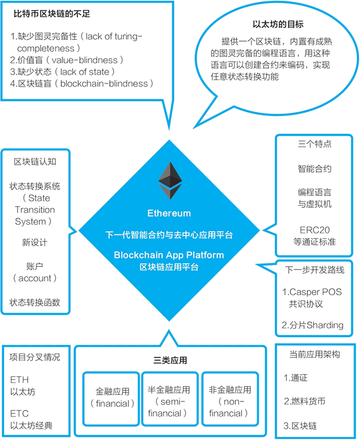
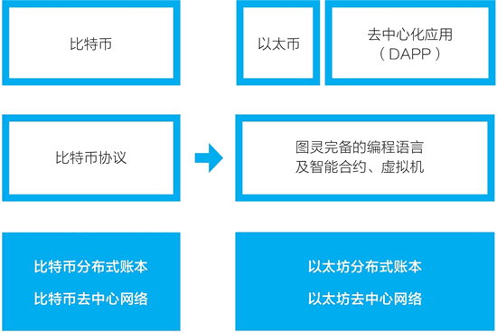
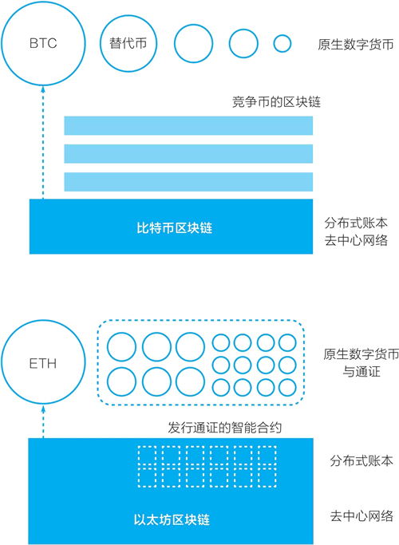
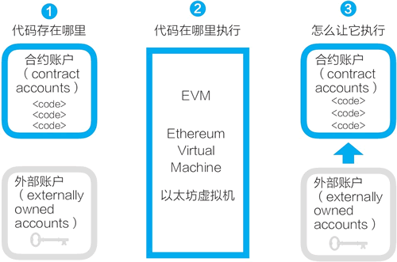
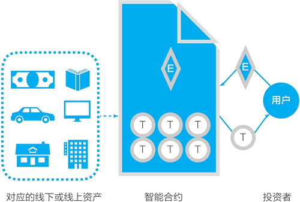

# 以太坊与智能合约

区块链技术使我们无须借助第三方，就可以直接进行价值表示和价值转移，此外他还给数字世界带来了价值表示物——“通证”。

区块链将使互联网从“信息互联网”阶段跨越到“价值互联网”阶段。但区块链技术要应用起来，还需要持续迭代升级。比特币系统和它的区块链都是专为创建一个去中心化的点对点电子现金而设计的。

以太网就是区块链2.0.

对于区块链的发展阶段，普遍接收的是梅兰尼.斯万在《区块链：新经济蓝图》一书中的论述：
- 区块链1.0 是货币
- 区块链2.0 是合约
- 区块链3.0 是应用

以太网白皮书的标题就宣传，它试图称为智能合约和去中心化应用的平台。

## 以太坊基本概念

维塔利克在以太坊白皮书中，分析了比特币区块链，他认为在比特币系统的基础上开发高级应用的三种可能：
- 建立一个新的区块链
- 在比特币区块链上使用脚本
- 在比特币区块链上建立元协议

维塔利克认为比特币系统的主要设计UTXO（未使用的交易输出）和其对应的脚本语言有缺陷，主要表现在：
- 缺少图灵完备性（Lack of turing-completeness），即比特币脚本不支持所有计算。
- 价值盲（Value blindness），即UTXO脚本不能为账户的取款额度提供精确的控制。
- 缺少状态（Lack of state)，UTXO只能是已花费或未花费状态，这意味着UTXO只能用于简单、一次性的合约。
- 区块链盲（Blockchain-blindness）。UTXO看不到区块链的数据，比如区块链头部的随机数、时间戳和上一个区块数据的哈希值。

维塔利克认为应当开发一个“下一代智能合约和去中心化应用平台”。他这样描述：
> 以太坊的目标是提供一个区块链，内置有成熟的图灵完备的编程语言，用这种语言可以创建合约来编码，实现任意状态转换功能。

在以太坊白皮书中，维塔利克认为，在以太坊上可以开发三大类应用（见图1）：
- 金融应用（financial）：为用户提供更强大的的方法，用他们的钱去管理和参与合约。这些应用包括子货币、金融衍生品、对冲合约、储蓄钱包、遗嘱，甚至雇用合约。
- 半金融应用（semi-financial）：这里有钱的存在，但非金钱的方面所占的比例也很重。一个好例子是为了解决计算问题而设的自动执行的悬赏。
- 非金融应用（non-financial）：如在线投票和去中心化治理等。

以太坊的最初设计目标是建立一个智能合约和去中心化应用平台，它和比特币区块链的最大不同是，它包括了一个图灵完备的编程语言（Solidity）。利用 Solidity，我们可以在以太坊上更方便地编写“智能合约”，以太坊也提供了一个代码运行环境——以太坊虚拟机（EVM）。有了这些，在以太坊区块链上，逻辑上我们就可以开发去中心化应用（decentralized application）了。去中心化应用常被简写为 DAPP，现在它通常指利用了区块链技术的网站或移动 App 应用（见图2）。

### 使用以太坊编写智能合约
目前以太坊并没有像最初设想的那样，从比特币区块链的加密数字货币功能跨出两大步，成为应用的平台。按梅兰妮·斯万的区分，区块链 1.0 是货币，区块链 2.0 是合约，区块链 3.0 是应用，而以太坊的初始目标是建立智能合约和去中心化应用平台。在实践中，它跨出了一步或者说半步：以太坊区块链上最常用的功能并非去中心化应用，而是编写智能合约，更符合实际情况的说法是，编写智能合约以管理用通证表示的数字资产。

在以太坊的二次开发或应用中，最为广泛的是基于它的智能合约创建符合ERC20标准的通证。以太坊的智能合约将创建通证的门槛降到了很低（见图3）。

当维塔利克和团队开发与运营以太坊时，它已经不太可能是一个宿舍里的作品，以太坊团队需要资金来运转。

在发布白皮书后，维塔利克吸引合伙人加入，建立了一个项目所需的商业和法律架构（一个瑞士公司以及后续的一个瑞士的非营利性基金会）。他和团队一起进行项目的设计与开发。在2014年4月，以太坊发布了由联合创始人加文·伍德（Gavin Wood）撰写的技术白皮书。

通过这次代币众筹，以太坊获得了 31531 个比特币，按当时的比特币价格换算，它获得了 1843 万美元，这是当时排名第二的众筹项目。

2015 年 6 月 30 日，以太坊的首个版本正式上线，预挖的 7200 万枚以太币被分配给众筹参与者与项目团队（见图4）。在之前的众筹中，以太坊共售出了 6010 万枚以太币。到此，以太坊的代币众筹过程就完成了。

在 2015 年 11 月 19 日，以太坊的主要开发者费边·沃格尔斯特勒（Fabian Vogelsteller）向社区提议了 ERC20 标准。

ERC 是 Ethereum Request for Comment 的缩写，除了 ERC20 这个可互换通证标准之外，主要采用的标准还有 ERC721 不可互换通证标准（non-fungible tokens），它也被称为契约（deeds）。在 2018 年年底大为流行的加密猫（CryptoKitty）是基于 ERC721 通证标准发行的。

ERC20 最初的建议见：https://github.com/ethereum/eips/issues/20，最终标准文件见：https://github.com/ethereum/EIPs/blob/master/EIPS/eip-20.md。ERC721标准地址见：https://github.com/ethereum/EIPs/blob/master/EIPS/eip-721.md。

这是一个用以太坊区块链智能合约发行可互换通证（fungible token）的方案。所谓可互换通证，指的是每一个通证都是一模一样的，比如任何两张 100 美元的价值是完全相同的，又比如你持有的一家上市公司的1万股普通股股票和我持有的 1 万股普通股是可互换的。

另一种方案是在 2018 年 6 月正式获得以太坊社区认可的 ERC721 通证标准，它是不可互换通证（non-fungible token）。不可互换通证的参照物是棒球卡、邮票等收藏品等，比如我的一本专门题名给我的签名书和你的同一本书是不同的，二者不可互换。

有了 ERC20 通证标准，我们可以在以太坊上很简单地编写一个智能合约，创建表示价值的通证。虽然这些通证所表示的价值是什么仍不明确，但大量的通证已经被创建出来。截至 2018 年 5 月，在以太坊上有 8 万多种创建 ERC20 标准通证的智能合约。

## 智能合约

尼克·萨博最早于 1994 年提出了智能合约。他定义道：“一个智能合约是，一个计算机化的交易协议，它执行一个合约的条款。”

尼克·萨博说：“智能合约的设计目标是，执行一般的合同条件，最大限度地减少恶意和意外的状况，最大限度地减少使用信任中介。” 他认为，我们需要一个这样的计算机协议：它能够完全保证，如果付款了，商品会被发送，或者商品寄出去了，就会收到钱。在现实生活中，我们有很多办法来实现这一点。而计算机科学家的目标是，用事先确定的代码自动执行合约条款，无须人工干预和第三方中介。智能合约中的“智能”可以理解为，按条件自动执行，无须人的干预，是自动的或自治的。

按其名字，智能合约的好类比是不是我们在商业活动中所签订的“合同”？其实不是。智能合约贴切的形象类比，是我们在说起计算机术语“有限状态机”或“状态机”时常用的自动可乐售卖机：
- 我们向可乐售卖机投入硬币，按一下出可乐的按钮。
- 售卖机将一听可乐从出货口放出来。
- 售货机恢复到最初的状态。

在以太坊白皮书中，维塔利克还特别指出，这里的“合约”不应被理解为需要执行或遵守的东西，而应看成是存在于以太坊执行环境中的“自治代理”（autonomous agents），它拥有自己的以太坊账户，它们收到交易信息后就相当于被捅了一下，然后自动执行一段代码。

在智能合约论文中，萨博还讨论了如何把智能合约用于实体资产，形成所谓的智能财产（smart property）。

所谓智能财产，是智能合约程序按照设定的规则控制的财产。萨博举例说明如下：
例如，为了防止一部车被偷窃，除非确定拥有者完成正确的“挑战响应协议”，否则车是不会启动激活的。例如，如果车是贷款买的，当拥有者无法偿还贷款时，智能合约将会自动启动扣押令，并将车钥匙的控制权交给银行。一旦拥有者还清贷款，智能合约就移除扣押令。

智能资产的概念后来被扩大了，在对比特币的相关介绍中有这样说法：由比特币区块链上的智能合约控制的资产，不管是实体的还是数字的，都叫智能资产（见图1）。

### 以太坊的智能合约

以太坊的智能合约并非现实中常见的合同，而是存在区块链上，可以被触发执行的一段程序代码，这些代码实现了某种预定的规则，是存在于以太坊执行环境中的“自治代理”。以太坊的账户与合约如图 1 所示。

以太坊的智能合约设计很简明:
- 任何人都可以在以太坊区块链上开发智能合约，这些智能合约的代码是存在于以太坊的账户中的，这类存有代码的账户叫合约账户。对应地，由密钥控制的账户可称为外部账户。
- 以太坊的智能合约程序，是在以太坊虚拟机（Ethereum Virtual Machine,EVM）上运行的。
- 合约账户不能自己启动运行自己的智能合约。要运行一个智能合约，需要由外部账户对合约账户发起交易，从而启动其中的代码的执行。

以太坊和比特币的一个重大不同是，前者提供了图灵完备的编程语言（Solidity）和相应的运行环境（EVM）。所谓图灵完备，指的是这个脚本编程语言可以运行所有可能的计算，而比特币的UTXO模型和脚本只能运行部分计算。

### 以太坊的智能合约有什么用
以太坊的智能合约被广泛应用的一个用途是创建通证，通证对应的多是以太坊区块链之外的资产。

图 2 是一个简明的图示，这是从 Komhar 咨询公司的一个图示重绘而来的。图示是一个典型的 ERC20 通证发行过程：一个项目通过智能合约创建通证，这个通证是实体资产或线上资产的价值表示物。投资者（用户）发起交易，向智能合约转入以太币（ETH），智能合约自动运转，在满足一定规则后，它向投资者账户转入相应数量的通证。

## 以太坊的Token系统

以太坊的重要应用是在它上面用智能合约发行通证。在白皮书中，维塔利克（人称“V神”）详细地讨论了所谓的“Token 系统”。

### Token system

链上令牌系统有很多应用，从代表美元或黄金等资产的子货币到公司股票，代表智能资产的单独令牌，安全的，不可伪造的优惠券，甚至与传统价值完全无关的令牌系统，如积分奖励。

在以太网中，实施令牌系统非常容易。关键的一点是理解**所有的货币或令牌系统从更本上来说都是带有如下操作的数据库: 从A中减去X单位并把X单位加到B上。** 前提条件是：
- A在交易之前有至少X单位；
- 交易被A批准。

实施一个令牌系统，是把这样一个逻辑实施到一个合约中去。

区块链能够方便的承载Token系统，这是源于它特殊的存储机制。它存储的是状态。我们熟悉的数据库存储的不是状态，数据库记录可以反复修改；而区块链中存储的是状态不能修改，是某一时刻所保存的信息。

在《商业区块链》一书中，区块链专家威廉·穆贾雅提出了一个可以用Token系统表示的事物的分类。他把区块链中可存储的事物的首字母组成了一个单词“ATOMIC”：
- 可编程的资产（assets）。
- 可编程的信任（trust）。
- 可编程的所有权（ownership）。
- 可编程的货币（money）。
- 可编程的身份（identity）。
- 可编程的合同（contracts）。

## 通证有什么用

如图 1 所示，我们可以用两个维度把自己所处的世界分成几个部分，一个维度是区分数字世界和物理世界；另一个维度是区分信息互联网和价值互联网。我们在这里把所有线下资产都视为一类，为第三类 ③。

我们可借用这张图示来思考“通证有什么用”这个问题。

通证的作用是，在数字世界中，在区块链上表示价值。比特币、以太币等是凭空在区块链上发行出来的。

要把其他象限的价值映射到链上、用通证来表示，主要有两个路径：
- 路径之一是，把原本在互联网上通过中心化机构的数据库表示的价值和价值转移，切换到去中心化的区块链上来。比如常见的有网络零售的支付、社交网络的积分、游戏里的道具等，反映在图中就是从象限 ② 到象限 ③。
路径之二是，把实体中的资产映射到链上，通过区块链进行流通。比如常见的有：把线下的民宿、供应链金融、资产证券化（ABS）中的资产用通证进行表示，反映在图中就是从象限 ③ 到象限 ①。

这两个都是值得探索的方向，但在这两个方向上探索时，我们逐渐地感到困惑：通证除了可以更大范围地进行交易，似乎并没有带来多少独特优势。对于路径一，互联网上的各类点卡、积分、道具一直运作良好；对于路径二，用通证进行表示依然没有能解决线下资产如何数字化的问题，也没有解决它们的流通性问题。

问题可能出在，把线上、线下资产变成链上资产，用通证进行表示，通过自由市场交易来发现其价格，这只是表面的变化。当我们意识到自己还在把它们折算为法币值多少钱时，我们发现，传统的法币在代表这类价值时已经做得足够好。

在如上这些领域中，用法币来表示这些价值以及相关的金融工具都非常成熟。把线下、线上资产用通证进行表示，可以带来一些优势，比如，过去在互联网上一个点赞 0.0001 美元的行为也许就被忽略了，而现在可能被通证记录下来了。但是，这带来的变化还是不那么大。出现这样的困惑是因为，我们始终站在人的视角来看通证的可能性，而通证能发挥作用的地方应当是法币不那么有效的地方。

当站到机器的视角去看通证时，我们会发现通证的独特价值，它的角色是法币无法替代的。

token 这个词在网络通信中的原始含义是令牌，只有有令牌的节点才能参与通信，令牌代表权利。当数字世界的范围扩大，在看机器相互交互的场景时，我们会看到，它们比人类更需要通证。

来看一种场景，在讨论中我们暂用 token 而不是通证。

假设，为了防止网络中的机器发出垃圾邮件，我们设定如下规则：个人电脑或手机在发出邮件时，需要消耗一个 token；发件邮件服务器也要消耗一个 token。如果这个邮件不被垃圾邮件规则拦截，或不被个人举报为垃圾邮件，那么在一定时间内，所消耗的 token 又会回到我们手中。

在这个过程中实际发生的是 token 的抵押，从而确保我们行为的正当性。系统可以预先给各个邮件账号和邮件服务器分配适量的 token，这样我们正常发送邮件就不会受到影响。对于那些需要大量发送推广邮件的人而言，他们发送的邮件有一定可能被认为是垃圾邮件，他们就需要用法币换取一定的 token，否则他们可能因为 token 数量为零而无法再发送邮件。

要让这样一个使用 token 的反垃圾邮件系统投入运营，我们的设计肯定不应是每个电脑、手机、服务器都需要存入法币，以购买 token，那只是特殊情况。我们的设计可能是，让这些机器可以自行以某种方式获取 token，比如这些计算机可以完成什么计算任务以获得 token。

从这样一个简单的例子中可以看到，机器在交互时比我们更需要 token。