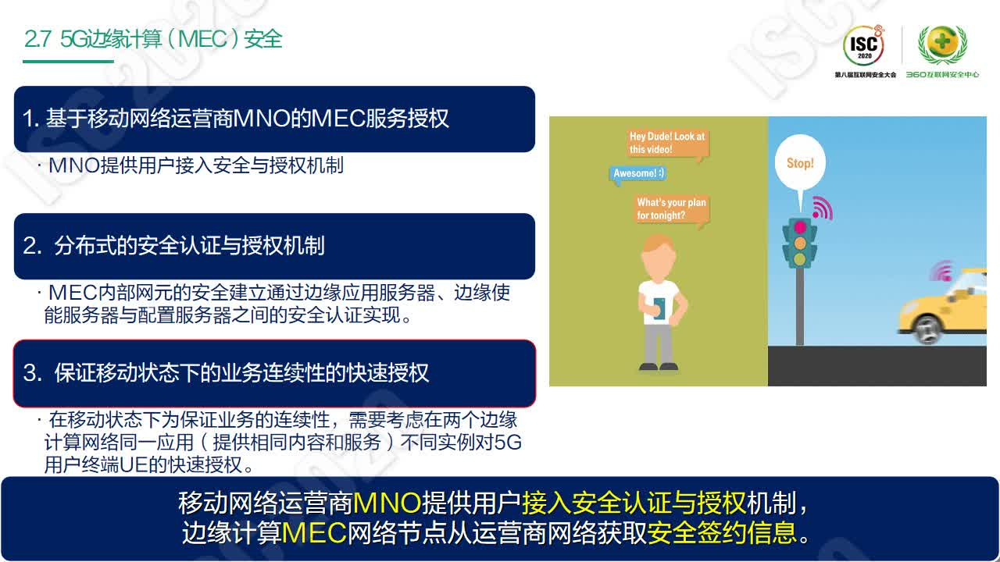

# 企业安全创新思路

## 数据安全

### 数据安全法
数据安全法与网络安全法是同一层次的上位法。

#### 意义
- 从法律层面明确市场规则
- 缓解数据安全与开放应用之间的矛盾
- 对信息化和数字化的发展有规范和促进作用
#### 什么是数据
数据是事实或观察的结果，是对客观事物逻辑的归纳。数据是表达客观事物的未经加工的原始素材。数据的形态可以是连续的值或是离散的值。数据是信息的表现形式和载体，可以是符号、可以是文字、可以是语音或是视频。

信息是数据的内涵，信息是加载于数据之上的，对于数据有含义的解释。数据和信息是不可分离的。信息依赖数据来表达，数据生动具体的表达了信息本身。数据是客观的、物理性的。信息是主观、逻辑性的。

数据是表现形式，信息是内涵。数据只有对实体产生影响时才有意义。

#### 数据的分类
《数据安全法》是从数据所影响的价值出发，考虑数据安全。

- 重要数据：只要是危及国家、民族、社会整体利益安全的数据都是重要数据。这个数据的所有者可能是多样的。

《数据安全法》对数据的定位、数据的信息保护、数据的跨境保护都有要求。数据安全法是网络安全法的核心。

### 数据安全法的内容

共分7章：
- 总则
  - 数据是任何以电子或非电子形式对信息的的记录。
  - 定义了国家各级单位的职责。
- 数据安全与发展
- 数据安全制度
- 数据安全的保护义务
- 政务数据安全与开放
  - 体现了安全与共享并重的思路。
- 法律责任
- 附则

## 构建社会信息化环境下的融合安全生态

> 万宁 钛媒体联合创始人
融合安全生态衔接传统与信息化系统安全，是社会信息环境基础保障。信息与网络空间安全直接影响国家安全、经济安全和社会安全。全球数字化背景之下，融合安全生态是建设中国特色的信息安全之路，需要政府、企业围绕安全可控的技术路线，实现信息网络安全对信息化投资和业务运营的有效保障，保证社会经济安全。

国家、经济、社会与信息网络空间深度融合：
- 全方位面对网络威胁，信息安全面临空前挑战；

安全威胁在融合：政治目的、商业利益与恐怖破坏：
- 出于政治目的、商业利益和恐怖破坏目的的多元交织，高智商利用高技术集团化、组织化对抗，“组织化”的网络攻击成为常态化。

信息与网络安全直接影响：经济安全、社会安全及国家安全。

所以我们需要构建社会信息环境基础保障——融合安全生态。
### 融合安全生态

企业视角：如何结合新旧系统，进行安全融合

几个步骤落实：
- 1.落实国家、行业网络安全政策要求，强化公司安全管控能力。优化管控机制，明确安全管理任务，提升风险预警及应急处置管理能力。
- 2.完善健全标准规范支撑体系。研究国家、行业标准规范，借鉴国外先进标准“为我所用”。
- 3.完善技术防护体系，实现安全技防能力全面覆盖。以安全即服务思想构建安全基础设施。提供通用安全服务能力，有效支撑安全运营。
- 4.完善安全组织机构、明确组织职责、优化协同机制、完善人员管理，加强人员培养，提升人员安全意识。
- 5.构建闭环的一体化安全运行体系，以安全预警监测平台为技术载体，实现人员，技术，流程的整合。

中国安全产业链发展与融合

全球数字化背景下，融合安全生态是建设中国特色的信息安全之路，需要政府、企业围绕安全可控的技术路线，实现信息网络安全对信息化投资和业务运营的有效保障，保证社会经济安全。

## 构筑数字时代的可信底座
> 余虎 华为云首席战略官
安全问题难以根绝的根本原因是缺乏可信基础机制。当前的互联网体系结构缺乏安全可信基础，很容易发生网络攻击，值得深入研究。全球主要经济体通过立法，强化数据安全及关键基础设施安全可信。数字时代正在到来，发展与挑战共存，可信是安全框架的重点，安全需要各方合作。

当前的信息化数字化带来了3大挑战：
- 关键基础设施是基石，如何保护好关键基础设施？
- 数据是数字经济的生产要素，如何保护数据？
- 数据安全、信息安全立法如何应对变化？

需要重点关注3个方面：
- 网络安全方面
- 数据安全方面
- AI安全方面

安全的根源：
- 互联网设计之初的安全考虑不足
- 开源软件的广泛使用

华为云的思考和做法：
- 可信是云服务最重要、最根本的要求；
- 建立并完善信任机制是云服务业务的第一优先级；
- 云服务的可信包括5个特征：安全、合规、透明（清晰便捷获取信息）、韧性（受攻击、有故障时的业务连续性）、隐私。
- 可信的维度有：组织可信、过程可信、产品可信三个维度。
  - 组织可信，是指坚持数据中立原则，通过管理体系牵引，将可信根植于企业中，从企业的战略、企业文化、风险管理等，以致到工业链和生态全面的合规、内控稳定的机制。是组织和治理的结果。
  - 过程可信，指建立实施保持一套从产品研发、运行维护、客户服务的全业务流程的管理体系，并持续改进，确保流程严谨完备，过程可追溯。华为云有超过1000项的可信要求。
  - 产品可信，包括很多方面，基础设施、云服务等安全。按照纵深防御和默认隔离原则，全球化部署高等级的IT云基础设施，保证网络、平台、应用、app的安全，实现应用和数据全生命周期的安全保障。

开发运维安全一体化，即DevSecOps。可信运营中心。

### [华为官方网站信任中心](https://www.huawei.com/cn/trust-center)内容

2018年底，华为公司董事会发布《关于启动彻底变革，提升软件工程能力，打造可信的高质量产品的决议》，计划用5年时间开展系统性变革，投入20亿美金，全面提升公司软件工程能力，面向华为的客户，提供可信的ICT高质量产品、服务与解决方案。

一时间，可信成为了华为公司坊间最热的年度词汇。从去年开始，华为公司启动从可信产品定义，可信设计，可信实现，可信测试，可信运维，可信Build-In流程、文化乃至可信价值观的全面变革。

华为成立三十年来，如此顶层设计且覆盖全集团的研发变革并不多，第一次是1999年左右引入并建立的IPD流程，第二次是2009年左右启动的敏捷变革，2018年启动的以可信为主要目标的软件工程变革是第三次。2019年，是华为面临前所未有巨大挑战的一年，公司依然决定投入巨资，启动涉及8万多研发员工、横跨消费者业务，企业业务，运营商业务的集团变革，这背后可以肯定，不是因为华为钱多，一定是因为华为在背后敏锐地捕捉到了什么？

日前，在HUAWEI CONNECT 2019期间，在华为云服务开发者Session《下一代软件工程，全云化，更可信、更智能、更高效》上，华为云布道师分享了《AI驱动的软件开发》，主要介绍了华为云DevCloud在AI方面对软件开发做了新探索，通过AI驱动软件开发，全面提升软件工程能力与实践，打造可信的高质量产品。在2019华为全联接大会上，华为云DevCloud两位专家，首次揭晓了华为近一年来面向可信的下一代软件工程的思考和实践探索。

华为云DevCloud是沉淀华为30年研发思考和实践的一站式软件开发平台，承载精益、敏捷、DevOps最佳实践。华为云DevCloud帮助众多客户显著提升研发效率与质量。打造DevCloud的团队，不仅对外部客户提供云上的服务，同时也承担内部8万多研发员工的可信研发工具链的交付，对华为可信工具链、研发作业效率和体验结果负责，DevCloud团队一直秉承对内外用户提供最先进的的研发装备。

#### 信任
##### 我们是谁？ 独立的商业精神
华为坚持独立的商业精神，全力为客户网络和业务的安全运营提供保障支持。

为客户服务是华为存在的唯一理由。无论是面临自然灾害、社会冲突、还是网络攻击，我们都全力与客户共同维护网络的稳定、可靠、安全运行。

华为是一家100%由员工持有的民营企业，没有任何政府部门及其它第三方机构持有公司股权、干涉公司经营、或影响公司决策。虽然华为不是上市公司，但我们一直参照上市公司的标准和实践，坚持每年发布公司年报，年报中的财务报表经独立审计师毕马威（KPMG）审计，让外界了解华为业务的真实性、完整性和独立性。

最近，围绕中国情报法的辩论非常激烈。有些政治家宣称，中国法律允许政府强迫企业为其收集情报。这并不是事实。中国政府已经做过澄清，独立的法律教授及知名的国际律师事务所也清晰表达了他们的观点：企业的协助支持义务的前提必须是“依法”，中国没有任何一部法律赋予国家情报机关权力要求电信设备制造企业植入后门或者中断客户网络。中国政府没有对华为业务或产品安全进行干涉。如果我们真的收到来自任一国家或组织的此类强迫性要求，我们会直接加以拒绝。

我们在这一点上的态度是明确的：如果我们的独立性、产品安全或客户网络受到安全威胁，我们宁愿关闭公司，也不愿违背我们的原则。如果签署“无后门、无间谍”协议能让我们的全球客户或政府更放心，我们愿意签署这样的协议。

在过去30年里，华为在170多个国家和地区运营，服务全球30多亿人，没有重大网络瘫痪，也没有恶性网络安全事故。没有任何证据表明华为曾做过任何危及客户网络或设备安全的事情。
##### 我们相信什么？ 共同建设全程全网的安全

云计算、人工智能、万物互联等新技术的发展，给人类社会带来新的发展机遇，也带来了新的安全挑战。今天，西方和世界其他国家的政府都在重新审视对新一代移动通信设备技术的监管。这是一种对公众利益负责任的态度，但必须依靠技术来解决。作为世界领先的全球领先的ICT（信息与通信）基础设施提供商，我们认为从技术上看，未来的网络安全必须要建立在一种协作机制之上：网络是由不同供应商的设备和运营商的服务连接起来的。任何一个服务流程的缺失，任何一个单点设备的缺陷，都可能造成网络安全的风险。为了有效应对在网络安全上面临的挑战，需要政府、行业组织和相关企业协同起来，共同建设全程全网的安全。

首先，我们需要一个共同的规则。政府、行业组织和相关企业要共同制定统一的安全标准，保证全网的设备、全程的服务都能达到一致的安全水平。任何一个设备、服务没有达到安全标准，都会影响全程全网的安全。过去一些年，3GPP是移动通信领域的国际标准组织，卷入华为、爱立信等相关企业，一起制定了安全标准，促进了通信网络网的安全。相比4G，5G的安全标准具有更强的加密算法和更灵活的认证机制，并将在安全产品部署和新业务的安全上探讨相应的标准。

其次，我们需要一个统一的安全认证标准。各国政府和相关企业需要共同制定安全认证标准，如：CC认证是目前全球认可度和权威性最高的IT产品安全认证。运营商以及各垂直行业要基于安全标准，匹配行业特点和相应的安全要求，决定所需要的安全认证等级，并要求所有设备和服务都达到相应的安全认证等级，以保证全程全网的网络安全。我们必须思考如何运用和升级当前的安全认证标准，并同相关利益人一起完善安全认证标准、流程和方法，构建政府、客户都认可的标准、流程和方法，这是我们建立技术信任的基础，比如，韩国LGU+要求5G设备做CC EAL 4级认证，以此作为5G产品准入的要求。

再次，我们需要安全的制造和服务流程。设备与服务供应商要努力提升自身产品的网络安全设计能力，使自己的产品符合安全标准，并达到客户要求的安全认证等级。华为、爱立信等设备与服务供应商根据3GPP、CC等安全标准设计LTE、5G设备和服务的安全。

最后，我们需要建立公开公正的第三方安全认证机制，解决产业界需共同面对的网络安全认证问题。建立政府、设备商、运营商、认证机构等多方在内的第三方安全认证机制，统一标准，并且所有的设备厂商都需要进行认证。要建立全社会和全行业对第三方认证机构的信任，由其按照安全标准对入网设备和服务进行独立认证，保证认证结果的公正。对当前认证标准不适合或未覆盖的场景，可以通过认证过程中的发现，改进现有认证体系或者建设新的认证体系。3GPP正在进行NESAS（网元安全评估机制）的标准制定，GSMA已对第三方认证实验室进行资质审核，由具备相应资质的第三方认证实验室对网元的安全性进行认证。

总而言之，非专业的监管机构审查或者舆论焦虑并不能实现网络安全，我们也没法依靠人为的隔离来远离风险。相反，人类通过对技术的开发和共享更紧密地链接为一个整体，才是实现全程全网安全的唯一出路。

##### 我们构建什么？端到端网络安全保障体系

早在1999年，华为就开始了网络安全旅程，发布了首批安全技术规范，以增强产品与解决方案的安全性。2011年，公司创始人及CEO任正非签署并发布了如下的网络安全保障政策，进一步强调了我们的承诺：

“作为全球领先的电信解决方案供应商，华为技术有限公司（以下简称“华为”）充分理解网络安全的重要性，同时我们也理解各国政府及客户对此的担忧与高度关注。随着电信网络和信息技术的不断演进与发展，网络安全面临的威胁和挑战将日益严重。华为对此高度重视，并致力于采取切实有效的措施提升产品和服务的安全性，从而帮助客户规避和减少安全方面的风险，以赢得各利益相关方的信赖。华为认为，构建一个开放、透明、可视的安全问题解决框架，将有助于整个产业链的持续健康发展，也将会促进通信技术创新和人类沟通交流。

鉴于上述认识，华为在此承诺：将构筑并全面实施端到端的全球网络安全保障体系作为公司的重要发展战略之一，在遵从所有适用的国家和地区安全法规、国际电信标准和参考行业最佳实践的基础上，从政策、组织、流程、管理、技术和规范等方面建立和完善可持续、可信赖的安全保障体系，并与有关政府、客户及行业伙伴以开放和透明的方式，共同应对安全方面的挑战，全面满足客户的网络安全需求。华为同时承诺：将公司对网络和业务安全性保障的责任置于公司的商业利益之上。”

为了持续交付高质量产品和服务，需要有先进的业务流程保障。华为自1997年起聘请了世界知名公司，为华为提供业务流程咨询。基于网络安全的要求，华为在公司标准流程、基线、政策和规范中融入了所需要的最佳实践。这种方式使网络安全成为华为日常经营的标准动作，而不是亡羊补牢。华为将网络安全规范嵌入到如下12个公司流程与业务模块。

自上而下保障网络安全战略执行

仅靠流程并不能解决所有问题，如果董事会和高层管理者不重视网络安全，员工也不会重视。为此，华为建立了自上而下的网络安全治理架构，以确保安全战略落地执行。

全球网络安全与用户隐私保护委员会作为华为公司的最高网络安全管理机构，负责决策和批准公司总体网络安全战略。全球网络安全与隐私保护官是全球网络安全与隐私保护委员会的重要成员，直接向公司CEO汇报。全球网络安全与隐私保护官负责领导团队制定安全战略，统一规划、管理和监督研发、供应链、市场与销售、工程交付及技术服务等相关部门的安全组织和业务，确保网络安全保障体系在各体系、各区域、全流程的实施，积极推动与政府、客户、合作伙伴、员工等各利益相关方的沟通。

##### 我们提供什么？打造可信的高质量产品和解决方案

今天，ICT正在从一个垂直行业演变成全社会的平台性产业，使能各行各业的数字化、智能化转型，驱动新一轮工业革命，推动人类社会迈向万物互联的智能世界。全面云化、智能化、软件定义一切等发展趋势，对ICT基础设施产品的可信提出了前所未有的要求。可信将成为客户愿买、敢买一个产品的基本条件。可信不仅仅是产品外在表现的结果，更是产品内在实现的过程，是结果和过程的双重可信的高质量。

华为公司把网络安全和隐私保护作为公司的最高纲领。华为将在遵循ISO9000的质量管理体系、遵循ISO/IEC/IEEE 15288和12207的系统工程和软件开发过程之上建设更加强壮的管理系统，使每一位具备可信价值观的员工，基于华为可信任过程相互协作创新，开发出具备可信特征的产品，给客户提供可信的高质量产品，并持续改进。

华为对业界主流安全标准、流程规范、指导书，以及法规指令、白皮书、学术论文等150+篇文档开展研究,我们发现每一个标准不一定都是完备的，或者关注点各自有侧重。未来在电信行业、在ICT社会里面构建全联接的基础底座，需要什么样的可信标准？为了在设计和信任之间建立起桥梁，便于产品定义者和设计者、以及产品的使用者和运营者对如何可以达成可信形成一致地理解，我们结合华为自身大规模的研发、网络部署和运维经验，有设计大型复杂产品的系统知识和系统架构能力。我们从系统工程的行业共识出发，基于可解释、可落地、可验证和有相当业界共识基础的四个原则定义华为可信框架。

华为可信任框架Huawei Trustworthiness Framework

我们要在每一个ICT基础设施产品和解决方案中，都融入信任、构建高质量，包括：

安全性（Security）：产品有良好的抗攻击能力，保护业务和数据的机密性、完整性和可用性。

韧性（Resilience）：系统受攻击时保持有定义的运行状态（包括降级），遭遇攻击后快速恢复并持续演进的能力。

隐私性（Privacy）：遵从隐私保护既是法律法规的要求，也是价值观的体现。用户应该能够适当地控制他们的数据的使用方式。信息的使用政策应该是对用户透明的。用户应该根据自己的需要来控制何时接收以及是否接收信息。用户的隐私数据要有完善的保护能力和机制。

安全性（Safety）：系统失效导致的危害不存在不可接受的风险，不会伤害自然人生命或危及自然人健康，不管是直接还是通过损害环境或财产间接造成的。

可靠性和可用性（Reliability& Availability）：产品能在生命周期内长期保障业务无故障运行，具备快速恢复和自我管理的能力，提供可预期的、一致的服务。

每一个产品在产品定义和完整实现环节、在创新中融入可信思考和控制，从源头就注入可信。我们还要保证产品从创新到客户现场的整个过程是完整、双向一致可追溯的，并在必要的时候提供恰当的（权限分离、信任、行为监控）机密性保护，确保产品没有被仿冒、篡改，确保部署、维护、处置作业过程和作业工具可信，敏感数据没有被泄漏。各产业落实可信产品定义、可信系统设计、可信软件实现、可信交付运维、产品生命周期管理变革，实现结果和过程可信。

过去一百年来，世界上许多成功的公司都因不能适应变化而倒下。要适应外部变化，唯有自我进化，我们必须保持开放和持续变革。华为公司董事会已决定，全面提升软件工程能力与实践将以变革的方式来开展，由轮值董事长徐直军总负责,华为公司初始投入20亿美元,计划用5年时间，在ICT基础设施领域实现为客户打造可信的高质量产品的目标。如此，我们才能实现未来的愿景和使命：把数字世界带入每个人、每个家庭、每个组织，构建万物互联的智能世界。

#### 隐私保护
##### 透明
我们坚持开放的态度，在处理个人数据和华为端到端的隐私保护方法时，对监管机构，客户和消费者都是透明的。信息的使用政策应该是对用户透明的。用户应该根据自己的需要来控制何时接收以及是否接收信息。
###### 隐私保护和通用数据保护条例(GDPR)
欧盟《通用数据保护条例》（GDPR）已于2018年5月25日起适用。该条例将影响适用于GDPR的企业收集和管理其客户及雇员个人数据的方式。根据GDPR，任何在欧盟设立机构的企业或者向欧盟境内提供产品和服务的企业在处理欧盟数据主体的个人数据时都应当遵从该要求。

作为ICT（信息与通信）基础设施和智能终端提供商，华为一直充分重视隐私保护并郑重的对待相应的责任。华为已经将隐私保护的要求融入日常业务活动中的流程。

华为遵从全球适用的隐私法律，包括GDPR。华为将确保相关业务遵从适用的GDPR要求。

1. 华为对隐私保护高度重视。为了确保有效的落实隐私保护各项要求，我们采取了跨部门协同的方式。成立已久的全球网络安全与用户隐私保护委员会是公司网络安全和用户隐私保护的最高管理机构。全球网络安全与用户隐私保护官直接向CEO汇报。华为所有业务单元均设置有专职的隐私相关的角色和/或组织。根据GDPR的要求，我们任命了欧盟数据保护官。

2. 华为采用了业界认可的隐私保护方法和实践。为了帮助各业务部门更好的识别和削减业务活动中的隐私风险，我们在几年前就引入了隐私影响评估方法来评估我们的产品和服务。在GDPR适用的业务场景中，我们：（1）建立了个人数据清单来维护个人数据处理记录；（2）建立了个人数据泄露应急响应机制，一旦发生个人数据泄露，华为会基于现有响应流程立即组建应急团队。为了尽可能保护用户隐私，我们努力减少个人数据泄露可能导致的损失以及确保受数据泄露影响的人员得到适当的通知；（3）重新审视和优化了对适用于GDPR的供应商的个人数据处理活动的隐私保护要求并在管理供应商流程中嵌入了遵从要求。

3. 华为定期持续向员工提供隐私合规培训，其中，华为非常重视提升员工的GDPR合规意识，确保每一位涉及GDPR的员工和合作伙伴都基于其特定的工作和职能的需要，能够准确理解数据保护的法律原则，并严格执行公司适用的制度和流程。

4. 华为持续获得国际认可的认证和鉴定，展示华为遵从了业界公认的国际标准，包括ISO 27001，CSA STAR，ePrivacy Seal等。

5. 为确保我们合规，我们的内部审计部门完成了全面的技术和流程的审视。

对于华为来说，GDPR合规只是华为隐私保护的一部分。隐私保护不仅仅是法律的要求，也是华为作为ICT（信息与通信）基础设施和智能终端提供商的社会责任。我们将持续改进和优化我们的产品和服务来保障安全和隐私，减少客户和用户的隐私保护风险。

##### 责任

遵从隐私保护既是法律法规的要求，也是价值观的体现。用户应该能够适当地控制他们的数据的使用方式。用户的隐私数据要有完善的保护能力和机制。

华为已发布并定期审视和刷新全球隐私政策（《华为隐私保护总体政策》），系统地阐述了华为的隐私政策，旨在确保华为遵从业务所在国隐私和个人数据保护方面所有适用的法律法规。我们也明确了相关部门在GDPR合规方面的责任。

##### 合规
华为遵从全球适用的隐私法律，包括GDPR。华为将确保相关业务遵从适用的GDPR要求。

隐私风险评估
我们使用隐私风险评估（PIA）方法来评估和削减产品和服务中的隐私风险。在隐私影响评估的流程中，我们要求项目充分评估项目场景中是否涉及处理个人数据、个人的数据清单和数据流图是什么、识别在数据处理场景中华为的角色。如果华为为数据控制者，且数据处理场景属于高风险场景，我们要求项目执行要求更高的DPIA来评估隐私风险影响。

1.我们首先要求项目充分评估项目场景中是否涉及处理个人数据，对于不涉及个人数据的项目不需要进行PIA；

2.如果涉及个人数据，项目需要建立数据清单和数据流图；

3.项目要分析在数据处理场景中华为的角色。如果华为是数据控制者，华为则需要判断是否要执行要求更高的DPIA评估；如果华为为数据处理者，则需要判断是否执行PIA评估；如果华为两个角色都不是，则需要符合隐私保护设计规范。

4.在执行完DPIA或者PIA之后，项目需要输出相应的报告。

###### 数据泄露流程
华为建立了个人数据泄露应急响应机制，一旦发生个人数据泄露，华为会基于现有响应流程立即组建应急团队。为了尽可能保护用户隐私，我们努力减少个人数据泄露可能导致的损失以及确保受数据泄露影响的人员得到适当的通知。

1）个人数据泄露隐私风险定级公式
风险等级R = 个人数据敏感度（DC） X 个人数据可识别度（EI） + 个人数据泄露场景（CB），其定义及赋值描述如下：

个人数据敏感度（Data processing context）：分为非敏感个人数据（基础分值1分）和敏感个人数据（基础分值2分）。
如果属于同一个数据主体的个人数据泄露数量过多，或个人的特殊特征明显，则该项分值可在原有基础分值上适当增加，最高可增加至4分；
个人数据可识别度（Ease of Identification）：根据对泄露的个人数据识别相应数据主体的难易程度，分为加密数据（基础分值1分）和明文数据（基础分值2分）。
如果加密数据采用安全的最先进的密码算法加密，且密钥的机密性是完整的，从而导致泄露的个人数据无法破解为明文数据的，则该项分值设置为0.25分；
如果从泄露的明文数据或破解的加密数据识别数据主体的可能性较少或可以忽略时，则该项分值可在原有基础分值上适当减少，最低减少至0.25分。
个人数据泄露场景（Circumstances of breach）：
A1、机密性损失，权限设置不当导致的个人数据泄露；
A2、完整性损失，个人数据被篡改或替换导致相应的数据主体利益受损；
A3、可用性损失，个人数据无法被正常访问导致相应的数据主体利益受损；
A4、恶意行为导致的个人数据泄露。
每个CB要素所获得的分数都会添加到最终分数,它们与DC和EI互补，具体赋值及描述举例如下表所示：

2)利用风险定级之后，对个人数据泄露事件分级如下：

用户对隐私数据的处理请求
“华为数据主体权利请求”是由华为技术有限公司为您提供行使数据主体权利请求的平台。我们为您提供了多个提交请求的途径：

1: 打开华为官网，点击“隐私政策”，在第4章节找到“点击此处”，打开数据主体请求提交页面，提交请求。页面链接： 个人数据维护>>

2: 打开消费者官网，点击“隐私声明”，点击“告知我们”，打开数据主体请求提交页面，提交请求。页面链接： 隐私问题>>

3: 或在手机上打开HiCare应用，点击“隐私问题”，进入官网入口页面，提交请求

## AI反欺诈

> 蔡准 芯盾时代联合创始人 

可以补充传统方式无法发现欺诈行为。

有以下问题：
- 冷启动阶段数据缺少标注
- 黑白样本比例悬殊，不均衡（需要使用半监督、增强学习等方法）
- 复杂业务场景，需要多种模型配合和融合（分层次方法）。

步骤是：无监督——半监督——融合模型。

- 无监督阶段可以筛选样本，大幅降低样本数量。这样人工才有可能参与标注。
- 半监督阶段，专家知识有效应用，进行有限样本的标注；
- 积累的样本（数据）足够多时，可以采用不同的模型算法。
- 最终使算法进行融合。

在此基础上，还可以结合传统的规则，有机构建防护体系和检测系统。

## 未来信息安全5个洞见
> 林明峰 杭州安恒信息技术有限股份公司副总裁

进入网络时代，信息安全重要性愈加凸显，从目前来看，未来数据安全法将给行业带来重要影响，身份和数据之间的控制依旧是信息安全核心问题，新兴基础设施带来安全交付方式变化和国产化发展等都将给信息安全带来新机遇。

### 数据安全法给信息安全行业带来的影响

数据安全法给信息安全产业带来了深远的影响。

整个信息安全行业以前一直都在围绕着合规要求和客户业务要求这两个维度在做工作。

在做了很多产品和服务之后，我们反思，我们要保护的用户有价值资产到底是什么？数据没有成为生产要素和重要资产之前，这个问题是不清楚的。我们以前保护了网络、保护了设备、保护了终端，但如何量化保护的效果也是不清楚的，即保护这些对企业来说有多重要。

数据成为了生产要素，数据有了权力，数据有了价值，那么保护数据就可以量化了。

之后的信息安全，将围绕着有价值的数据而展开。安全防护理念和技术将有长远发展。数据安全成为出发点和落脚点。

### 信息安全本源问题：身份和数据的访问控制问题

要采用新的控制方式来控制数据流转。

原有方式不适应大数据和数据高价值时代。局部琐碎的控制方式不适合现代以数据为基本生产资料的情况。

### 基础设施的变化带来的挑战

数据既然很重要，当数据导入到数据中心中，新的5G时代和物联网获取使用数据的方式方法不同了。数据的产生和使用是由机器驱动的，是连续的。

物联网和5G网络中传统边界打破，上千万的设备在向数据中心传递数据。海量的数据整合起来时能提炼的价值会很高。

新基建时代的安全防护会很复杂。监控手段和防护手段与之前是非常不同的。

5G成为焦点的原因也在于此。海量数据的承载平台也会发生变化，云平台和大数据的平台都将融合起来，很可能是混合云结构。安全的部署方式也因此不同，安全设备不能以硬件方式部署在云内，而是要云化，使其云原生化才能应用。

安全厂家的工作是否由云厂家来完成？不可否认的是如果由云厂家来完成，会显得交付上更加便捷、协同、一致。但也有问题，IaaS层和网络层这一部分的安全防护，对云厂商来说是自然且便利的，但是在向上应用层和数据层，以及外部的安全情报和安全支持、应急响应，云厂商不如安全厂家专业。

例如海外的公有云厂家，提供了云上waf和安全监控能力，但他们发现他们无法理解各行业对云上数据的管控要求和实时变化。尤其是无法提供个性化服务。专业的特别是基于数据的安全规则与控制由专业厂家来完成。

#### 基础设施的变化会对未来的信息安全产生影响

传统基础设施是由国外八大金刚构成的，现在或将来将变为国产化的CPU和OS。

国产化的过程中如何研究安全漏洞和安全机制？嵌入式、原生式的安全机制将变得更多。可能会有颠覆式的机制。可信、监控将内嵌在系统底层。

总结一下：
- 数据安全会为行业带来深刻影响
- 数据安全的本源是解决身份与数据的访问控制问题，这将是信息安全的持续核心话题，传统边界防护无法解决这类问题；
- 新兴基础设施、大量设备的涌入会带来新的安全防护要求
- 国产化过程将有新的挑战和机遇。

## 5G网络安全研究现状及进展

> 刘建伟 北京航空航天大学网络空间安全学院院长 

5G网络在统一认证、终端安全等方面均面临着诸多安全风险和挑战。随着物联网的发展，5G网络业务从1G-4G面向个人的通信扩展到工业互联网和智慧城市，并支持更多的业务场景、更高的性能指标、更强更灵活的通信安全能力。5G安全问题已经成为人们关注和研究的热点课题。

### 5G网络安全现状

### 5g 网络安全关键技术

- 5G网络接入安全
- 5g网络控制面用户面信令面加密
- 5g网络保密与认证协议
- 5g智能移动终端安全
- 5g网络切片及安全管理

### 5G安全研究进展
- 5G安全标准
- 5G安全防护框架

### 我们的工作

## 高位视角下的网络攻击团伙发现与追踪方法探讨
>饶毓 国家互联网应急中心高级工程师

大量网络攻击背后隐含着多重利益团伙，单维度的攻击观测已经无法满足对攻击态势的掌握和研判。近几年来，国家互联网应急中心在高位视角下，尝试对全域海量攻击事件进行综合关联分析，发现其中的团伙攻击行为，并实现对攻击团伙的长期持续追踪。

### 思路

#### 网络攻击团伙在数据上的呈现

- 困难：高维数据的特点，与现实意义上的攻击团伙有一定距离。
- 团伙攻击行为：通过相对独占的资源，基于一定的攻击手段，进行规模化攻击的行为。往往带有典型的情报、经济利益目标。

团伙攻击场景——异构图的建立：
- 对不同的攻击事件构造不同的分析场景，纳入不同的相关的安全事件类型，构造异构图。
- 例如在DDoS攻击场景下，异构图包括：
  - 控制端
  - 攻击资源
  - 攻击目标
  - 关联域名
  - 关联样本
  - 关联PDB路径等
- 异构图带有时间属性，团伙也是在不断演变的。

- 短周期关系及相似度构建：基于相似度的同构图构建。基于元路径提取方法，从异构关系图中提取实体与实体的相似性，形成包含了相似度关系的同构图。

## 基于知识图谱的智能渗透引擎构建

> 四维创智CEO 司红星
### 为什么要做智能化渗透引擎
- 漏洞扫描器的问题
  - 核心技术是20多年前的，不能满足漏洞发现
  - 版本匹配方法，有高误报
  - Fuzz扫描，网络负载很高
  - PoC扫描，必须采用专用的PoC，可用的PoC并不多。
- 人才培养难，且培养后难已留住

### 人的问题

- 人的惰性，类似问题不愿意穷举
- 人性的误判，认为小的问题不去测试

### 人工智能在渗透测试方面的应用

- 人工智能计算在攻击方面应用很少
- 目前AI是弱人工智能时代，黑客经验很难成为学习样本，需要将黑客经验进行数字化

#### 要关注漏洞的分类和属性

从CVE来看，有18万条漏洞。从1999年至今互联网漏洞类型有限，利用方式有限。CVE漏洞是有限的。

除了CVE，还有OWASP web漏洞等，最多还有10余种漏洞，这不像人脸数据等无限集。

为了将黑客经验数据化，我们先将有限的漏洞信息构建一个专家系统，然后由此为基础构建知识图谱模型，之后在构建上层系统模型。

#### 专家系统

渗透测试中，专家系统可以做的是：
- 建立WHEN-THEN规则，定义一系列经验。
- 使用规划决策语言PDDL语言定义比较复杂，我们简化了PDDL语言进行简化，简称DPL（基于PYTHON定义的规则描述），将规则进行简化定义。
- 规则交给解释引擎去理解，根据实际输入而应用。
- 有了规则后，可以将规则生成图，也即漏洞之间的关联图，我们使用图数据库来存储这些图。
- 大量的关联构成了知识图谱的关键组成。
- 在知识图谱的基础上，制定优化决策，例如快速渗透的方法等。

#### 生物识别算法
- 识别验证码，利用人脸识别算法，难在通用性
- 页面内容分类
- Web攻击包生成
  - 经验丰富的人会根据http请求和响应了解漏洞利用点和结果

## AI让内网渗透行为无处躲藏

> 黄胜蓝 西安四叶草信息技术有限公司 VP

系统中每个资产的网络行为往往具备各自特性，有经验的运维人员往往通过观察资产网络行为就能判断资产是否被入侵。然而，随着业务系统越来越复杂，资产数量和网络复杂度急剧提升，依靠人工已经无法有效从网络行为特性中分析潜在风险。四叶草安全通过利用图神经网络技术，对系统各资产网络行为特性进行拟合，当行为出现较大偏差时意味着资产存在入侵风险，将及时通知运维人员核查处理，利用AI大大降低了运维人员工作强度，大大提升了对黑客入侵的检测能力。

## 零信任安全在数字转型中的应用实践

> 冀托 云深互联 产品负责人
数字转型带来的网络变革中，零信任是适合时代需求的安全模型。详细阐述零信任如何构建安全架构体系，适合哪些应用场景，又有哪些落地实践。

