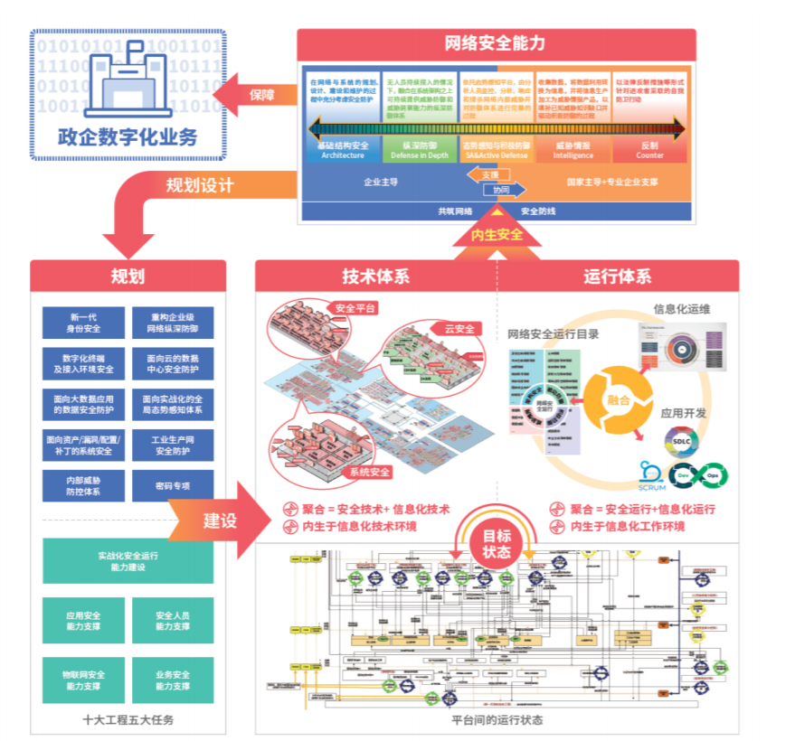
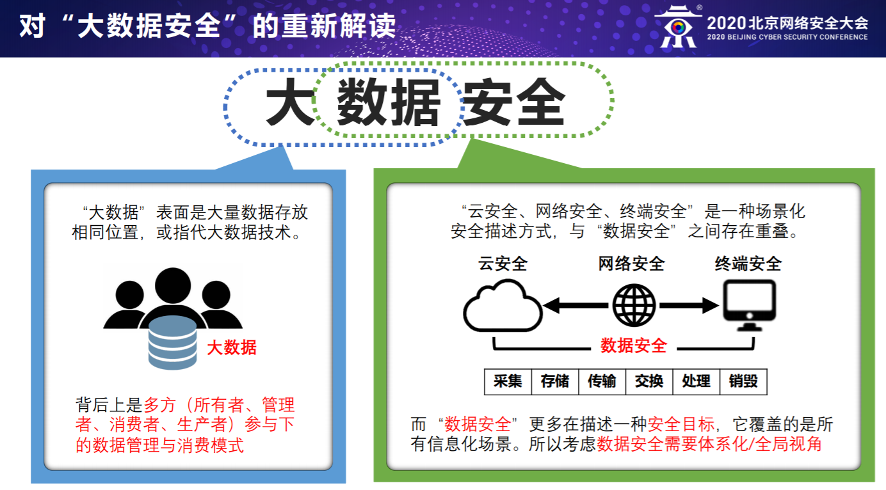
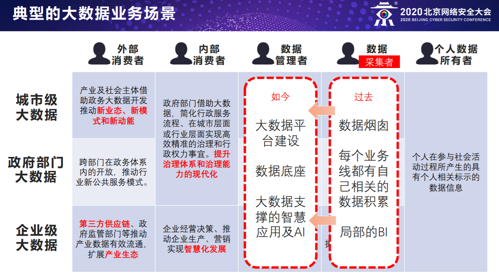
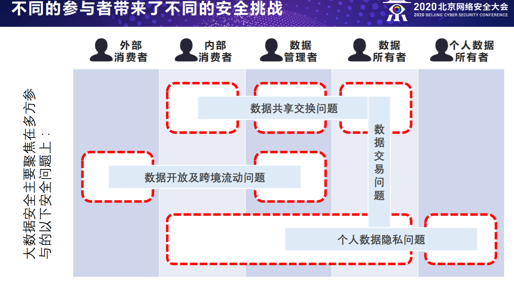
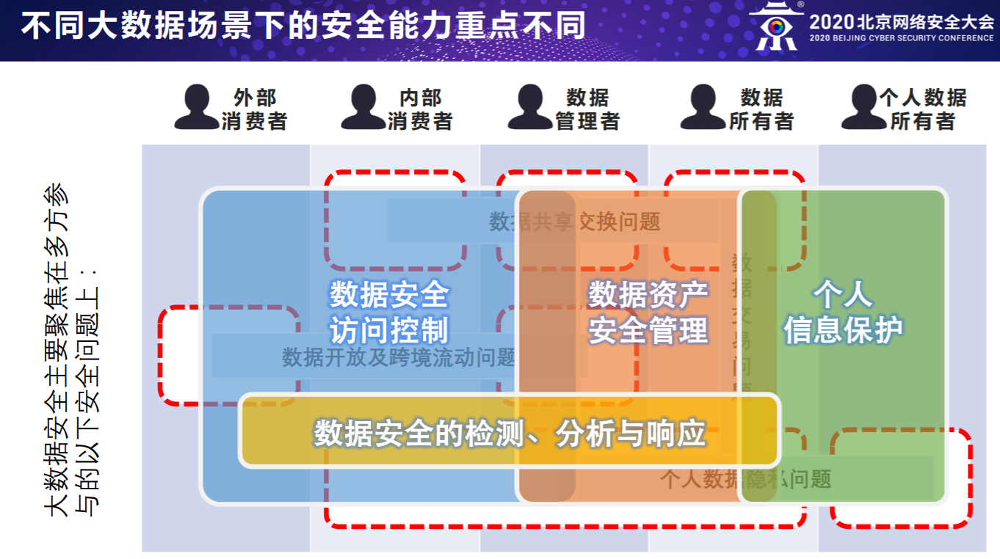
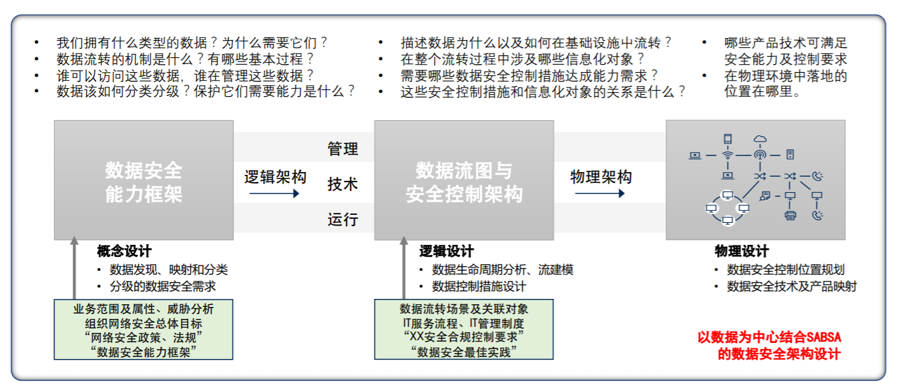
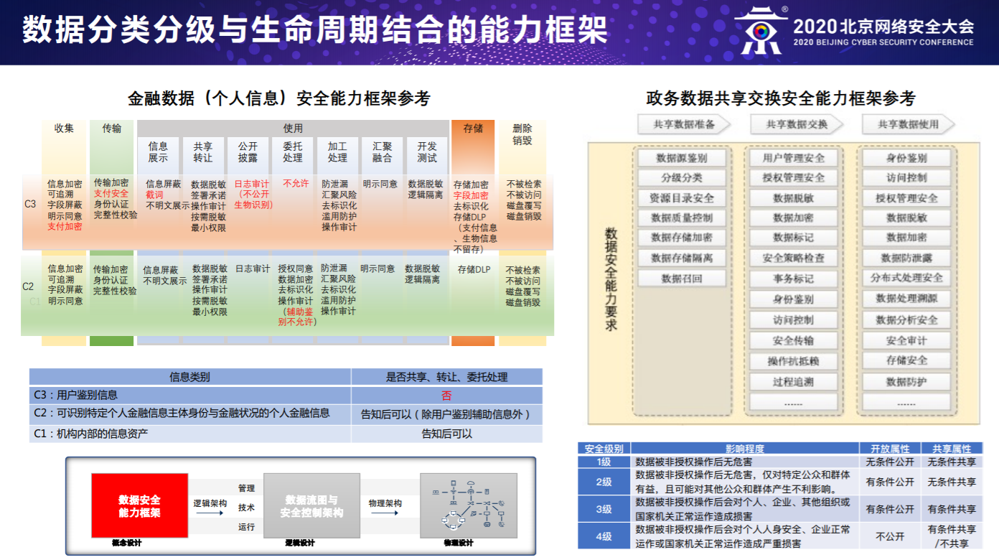
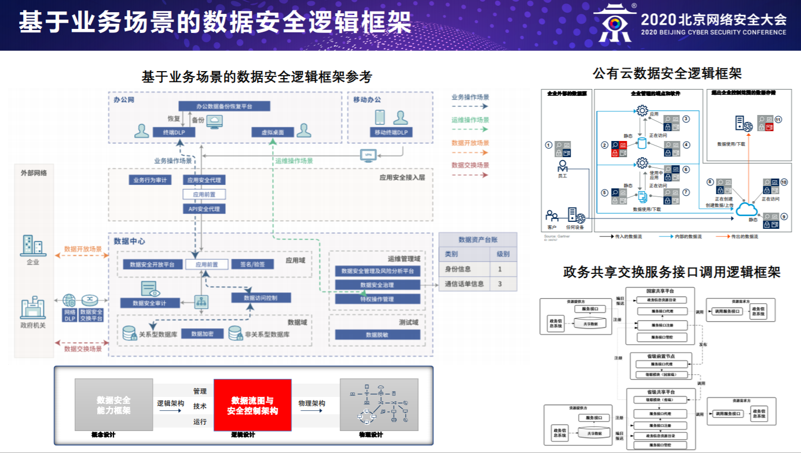
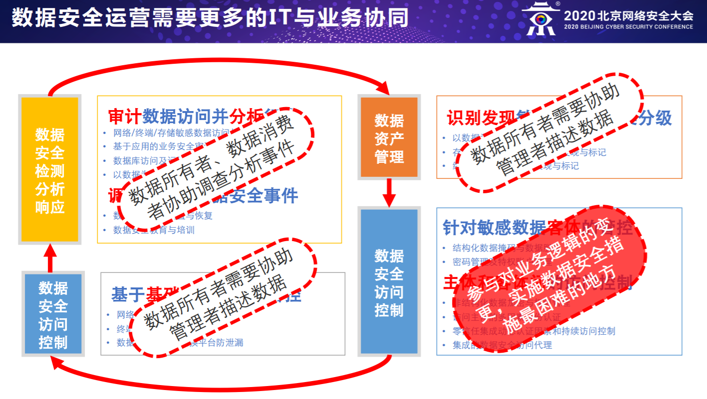

# 企业安全建设思路

> 参考资料：
> - 奇安信集团董事长齐向东，在2020 北京网络安全大会演讲《内生安全 从安全框架开始》

## 问题（痛点）
- 漏洞不可避免
  - 85%的安全威胁来自内部
  - 所有体系都是人来操控，而人会犯错
- 无论技术水平多高，体系仍有失效可能，而且能力往往不足；
- 采用“局部整改”为主的安全建设模式，体系化缺失、碎片化严重、协同能力差。
- 老系统用老办法，新系统用新办法，造成巨大浪费和系统畸形
- 云安全、网络安全、终端安全、数据安全概念纷杂，难理头绪。

## 建设思路

内生安全的关键是管理
  - 2016年美国东海岸断网是缺乏管理
  - 2017永恒之蓝事件是缺乏管理
  - 2020推特账号被劫持也是缺乏管理
  
**内生安全靠管理，管理靠框架，框架的关键是组件化。**

内生安全框架，是指使用系统工程的思想，将安全需求分布实施落实，逐步建成面向未来的安全体系，将支撑行业信息安全的建设模式从“局部整改外挂式”走向“深度融合体系化”（改变原先“局部整改”为主的安全建设模式）。

## 建设内容

内生安全框架的3个重点：
- 理清楚
- 建起来
- 跑得赢

### 理清楚
- 体系化地梳理、设计出所需的安全能力
- 梳理时充分考虑所有可能涉及到的问题
- 设计时根据实际情况挑选、组合和规划

### 捡起来
- 融合是建设的关键、做到深度结合、全面覆盖
- 安全能力组件化，将安全能力合理地分配部署
- 具体建设过程中，需要全景化的技术部署模型

### 跑得赢

- 缺乏安全运行的安全系统，相当于“靠天吃饭”
- 把管理作为关键，就能跑赢漏洞、内鬼、黑客
- 确保安全运行的可持续性，实现安全管理闭环

## 框架

框架的关键是组件化。

信息化系统的替代是“立新破旧”的过程，对老系统用老办法，新系统用新办法，会造成巨大浪费。

应当“统一设计，分步实施” 把安全框架组件化，让组件既是新体系的一部分，又能部署到老系统中。

组件与信息化体系化地聚合是安全框架落地的关键。

## 落地

“十大工程 五大任务”内生安全框架的具体落地手册

### 十大工程

- 新一代身份安全
- 重构企业级网络纵深防御
- 数字化终端及接入环境安全
- 面向云的数据中心安全防护
- 面向大数据应用的数据安全防护
- 面向实战化的全局动态感知体系
- 面向资产、漏洞、配置、补丁的系统安全
- 工业生产网安全防护
- 内部威胁防控体系
- 密码专项

十大工程

工程一：新一代身份安全。对应新场景下身份管理和使用模式的改变，构建基于属性的身份管理与访问控制体系，全面纳管数字化身份，为网络安全与业务运营奠定基础。

工程二：重构企业级网络纵深防御。对应新技术应用产生的更多网络出口、更复杂的管理挑战，采用标准化、模块化的网络安全防护集群，适配网络节点接入模式，构建覆盖多层次的网络纵深防御体系。

工程三：数字化终端及接入环境安全。对应数字化时代终端类别繁多、接入与管控、数据安全的风险，在终端和接入环境上构建一体化终端安全技术栈，构建全面覆盖多场景的数字化终端安全管理体系。

工程四：面向云的数据中心安全防护。对应云数据中心复杂的应用场景，将安全能力深入融合到云数据中心多层次的网络纵深和组件中，同时满足传统数据中心安全和云计算安全要求。

工程五：面向大数据应用的数据安全防护。对应数据集中、流转和应用场景中的安全挑战，以数据安全治理为基础，将数据生命周期与数据应用场景结合，严控数据流转与使用，加强行为监控与审计，确保数据安全。

工程六：面向实战化的全局态势感知体系。对应目前重展现轻分析，实战支撑力不足的现状，覆盖所有信息资产的全面实时安全监测，持续检验安全防御机制的有效性、动态分析安全威胁并及时处置。

工程七：面向资产/漏洞/配置/补丁的系统安全。对应当前各大机构安全体系的最短板，聚合IT资产、配置、漏洞、补丁等数据，提高漏洞修复的确定性，实现及时、准确、可持续的系统安全保护。

工程八：工业生产网安全防护。对应企业工业生产网长期以来安全防护普遍缺失的现状，面向工控网络内部、工控与IT网络边界、数据采集与运维、集团总部数据中心构建多层次安全措施，强化纵深防御，全面掌握工业生产网的安全态势。

工程九：内部威胁防控体系。对应内部人员导致严重业务损失的巨大威胁，基于操作监控、访问控制、行为分析等手段，结合管控制度、意识培训等管理措施，提升内部威胁防护能力。

工程十：密码专项。对应密码相关的法律要求和业务需求，秉承“内生安全”理念规划、设计密码体系，实现密码与信息系统、数据和业务应用紧密结合。
#### 五大任务

- 实战化安全运行能力建设
- 应用安全能力支撑
- 安全人员能力支撑
- 物联网安全能力支撑
- 业务安全能力支撑

任务一：实战化安全运行能力建设。按次开展的安全检查与测评模式无法达到业务安全保障要求。应全面涵盖安全团队、安全运行流程、安全操作规程、安全运行支撑平台和安全工具等，并持续的评估、优化，持续提升安全运行成熟度，以达成对信息系统的持久性防护。

任务二：应用安全能力支撑。应用系统建设过程中安全长期缺位，安全与信息化建设普遍割裂，系统带病上线，后期整改困难。结合开发运行一体化（DevOps）模式，推进安全能力与信息系统持续集成，使安全属性内生于信息系统，保持敏捷的同时满足合规，使信息系统天然具有免疫力。

任务三：安全人员能力支撑。人的能力决定安全体系建设和运行的能力。设计企业网络安全团队、设置岗位与能力要求，开展能力实训，建设网络安全实战训练靶场，提升人员的实战能力，形成安全团队建制化。

任务四：物联网安全能力支撑。物联网设备类型碎片化、网络异构化、部署泛在化的特性引入了大量安全风险。结合物联网“端边云”的架构，构建具有灵活性、自适应性和边云协同能力的物联网安全支撑体系。

任务五：业务安全能力支撑。数字化业务剧增，由恶意操作、误操作行为引发的业务风险显著增长。聚合业务与行为数据，利用大数据分析技术，保护客户隐私、交易安全，加强欺诈防范，打击涉黄、涉政等行为，保障业务运营。

某“新基建”项目136个信息化组件 29个安全区域场景 79类安全组件。（待了解）

### 数据安全

数字产业、智慧城市的背后是数据的协同，数据安全已上升到国家安全。
- 大数据安全需要体系化、全局化、跨组织协同的安全思考。
- 分类分级下的数据生命周期能力要求定义了数据安全能力框架。
- 数据的流转过程的安全控制及关联IT对象定义了数据安全逻辑框架。
- 其中，数据访问控制是大数据安全问题的核心，也是安全内生的关键。
- 从局部整改为主的外挂式建设模式走向深度融合的“内生安全”建设框架模式。

#### 大数据安全常见能力：
- 数据资产管理
  - 分类
  - 分级
  - 识别敏感数据
  - 形成以数据为中心的可视化及资产地图
  - 存储及数据库敏感数据扫描发现与标记
  - 终端敏感数据的扫描发现与标记

- 数据安全访问控制
  - 基于基础设施环境的管控
    - 网络及应用系统数据防泄漏
    - 终端数据外发防泄露
    - 数据隔离及共享交换平台防泄漏
  - 针对没敢数据客体的管控
    - 非结构化数据加密与权限管理
    - 结构化的数据掩码与数据脱敏
  - 主体和客体间的访问控制
    - 密码管理及特权账户管理
    - 访问主体的多因素身份认证
    - 零信任集成动态认证因素和持续访问控制
    - 集成的数据安全访问代理
- 数据安全检测分析响应
  - 审计数据访问并分析行为
    - 网络、终端、存储敏感数据访问与内容审计
    - 基于应用的业务安全审计
    - 数据库访问及运维审计
    - 以数据为中心的用户行为分析
  - 调查并处置数据安全事件
    - 数据安全事件处置与恢复
    - 数据安全教育与培训

#### 以数据为中心的大数据安全架构设计方法

数据是很难全面保护的资产类别，除非对其生命周期进行更广泛的了解。数据已成为一种无限可变和可移动的资源，通常会在分散的数据系统中进行存储和处理，传统的以基础设施为中心的数据安全方法常常效果不佳。

#### 数据分类分级与生命周期结合的能力框架

#### 基于业务场景的数据安全逻辑框架

