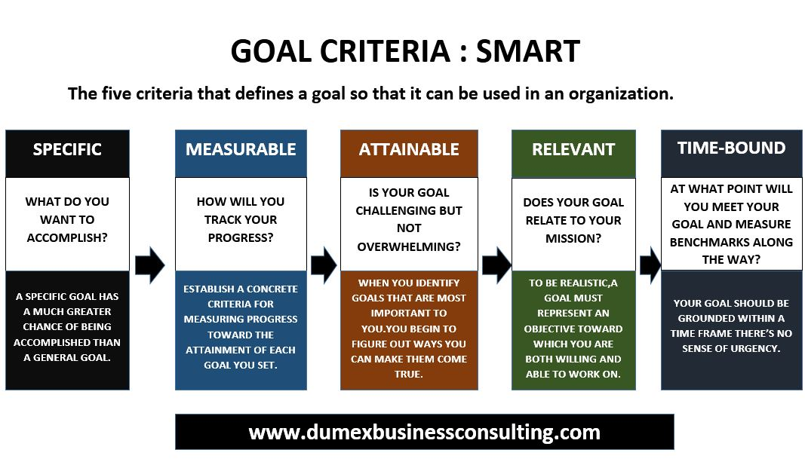
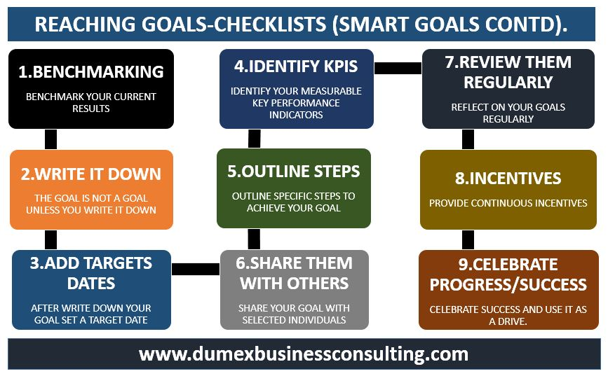

# 企业安全建设指南——学习笔记1

## 基础原则

企业安全建设的原则：
- 持续改进，采用PDCA循环。
- 纵深防御，采用主动防御PPDR模型
- 非对称攻防态势长期存在。
- 进行有效和尽可能完整的安全度量
- 基于问题管理（参考ISO20000服务管理体系），对历史问题和故障举一反三持续改进，使历史故障免疫。
- 将安全作为产品、系统、流程、人员的属性。

正确处理几个关系：
- 科学与技术
- 管理与技术
- 业务与安全
- 甲方与乙方

## 金融行业信息安全

### 特点：
- 金融行业高度依赖信息化
  - 高度信息化、自动化、流程化，几乎所有服务都依赖信息系统展开。
- 属于强监管部门
- 数据极为敏感，数据安全要求极高
- 业务安全要求极高
- 风险极高
  - 影响范围大、突发性强、破坏性大、资金损失风险大
- 可用性要求高。实时性和准确性要求高

### 建设标准或依据：
- 主要参考2009年中国银监会印发《商业银行信息科技风险管理指引》，形成安全架构、管理制度、流程，建立安全检查、风险评估和管理机制。
- 《商业银行数据中心监管指引》
- 《商业银行业务连续性监管指引》
- 《银行业金融机构信息科技外包风险监管指引》
- 《证券期货业信息安全保障管理办法》
- 《证券公司信息技术管理规范》
- 《证券期货业信息系统运维管理规范》

### 行业信息安全建设发展历程与趋势
发展历程：
- 2010年前，“管理流派”为主
- 2010-2015，“设备流派”为主
- 2015年至今，“数据流派”唱主角。

监管趋势：
- 董事会、管理层秉承“实质重于形式”的原则
- 监管重点从“管理为主”转向“管理与技术并重”。从组织架构、制度建设、流程机制等管理层面，延申至业务流程设计、企业技术架构、系统逻辑设计等具体技术实现层面。
- 对信息技术部分的规定和约束越来越精细化、具体化、层次化。
- 风控要求全行风险管理部门、内控合规部门、稽核审计部门、信息科技部门共同参与。
- 风险管控与业务紧密结合
- 安全教育与培训全员展开
- 监管手段逐渐像技术化发展。

### 安全建设思路

#### 建立信息安全的核心目标
- 必须建立和保证信息安全的核心目标与安全基线。
- 根据企业战略方向、风险偏好、管理要求量体裁衣，纵深防御，持续改进。
- 实务方面，一手抓安全合规，一手抓风险控制；一手抓安全管理，一手抓安全技术。

#### 明确信息安全基线

为实现目标，必须从实践操作层面，明确信息安全功德范围，建立工作基线，采用具体措施保证基线达成。

安全基线是信息系统最基本（必须实现的）的安全要求，是最小限度的安全保证。可以分为管理安全基线和技术安全基线。

##### 安全管理基线

- 安全组织
  - 决策层、管理层、执行层
  - 合规、风控、审计等业务部门
  - 汇报路线
  - 职责分工
  - 日常工作机制

- 安全制度
  - 确定制度的体系框架
  - 制度等级
  - 制度覆盖度必须完整生命周期和各项管理工作
  - 制度必须与法律法规、行业标准、监管要求保持一致
  - 制度之间必须满足 MECE(相互独立、完全穷尽)等法则。

- 人力资源安全
  - 人员仍用前、中、后的基本安全管理要求。
  - 任用筛选、背景调查、安全职责确定和岗前培训等。
  - 任用中的各项权限分配、安全检查、奖励制度等
  - 任用终止前的权限冻结或取消。

##### 安全技术基线

- 机房
  - 环境选址、物理安全
  - 基础设施相关设备
  - 风火水电
  - 环境监控
  - 访问控制等方面
- 网络
  - 网络结构
  - 边界安全
  - 网络设备安全
  - 入侵防范
  - 网络的访问控制
  - 安全审计
- 系统
  - 系统配置
  - 服务安全
  - 访问权限
  - 协议管理
  - 系统日志审计
- 应用
  - 身份鉴别
  - 抗抵赖性
  - 资源控制
  - 应用访问控制
  - 应用日志审计
- 终端
  - 设备管理
  - 软件管理
  - 用户管理
  - 终端网络隔离
  - 自助终端管理
- 数据
  - 数据的完整性
  - 数据保密性
  - 数据可用性
  - 数据访问控制
  - 数据备份与恢复。
- 通信
  - 内网信道安全
  - 外网信道安全（vpn等）
  - 加密算法
  - 加密范围
- 软件
  - 软件开发、设计、测试、运维（全生命周期管控）
  - 访问控制

#### 安全与业务的关系

- 安全与业务存在矛盾
- 安全与业务的一致性，体现在共同构成企业目标。
- 安全与业务的结合，具体体现在事前预防、事中拦截、事后告警。

为实现两者共赢，通常采用的方法有：
- 风险分类，安全技术人员与业务人员对风险进行分类分级，根据风险大小、发生频率、优先化解高风险。
- 前轻后重，前端关注客户体验，后端风控务必到位。建立黑白名单，要有风险监测。
- 客户风险等级分类。
  - 低风险客户使用白名单，身份验证简单设计；
  - 中风险客户，验证升级
  - 高风险用户，面核面签
  - 不良记录用户，黑名单。
- 额度管控。从交易金额角度控制。
  - 小额免密免签，或简单验证
  - 大额用数字证书或动态令牌

#### 信息安全与监管的关系，约束与保护

## 安全规划

企业信息安全建设中，最基本的是安全规划。

### 规划前的思考

如果不想浪费时间，徒劳无益，就常问自己3个问题：
- 你为什么会辛苦？
  - 很多情况是想让别人/下属做的事，他们没做。
- 你为什么很辛苦？
  - 很多时候事效率不够
- 你为什么那么辛苦？
  - 因为很多人做的事情并不真正产生效益。

企业战略规划（5~10年）——IT战略规划（3~5年）——信息安全规划（3~5年）——年工作计划，等等规划自上而下，一脉相承。

信息安全规划，建议每年10月启动编撰，12月定稿。

### 规划框架

安全规划的框架包括：
- 概述
  - 安全形式分析，涉及外部、行业、监管与股东要求、对手分析等。
- 需求分析
  - 各层次、各方面的需求。
- 安全目标
  - 规划周期结束要达到的安全水平。
- 各安全领域的现状与差距分析
  - 管理差距
  - 技术差距
- 解决方案和计划
- 安全资源规划
- 当年重点项目和重点任务
- 上一版安全规划目标差距分析

### 安全规划制定步骤

- 调研
  - 了解现状、了解需求
- 确定规划目标、现状、差距。
  - 目标是一种决心、一种战略规划。
  - 目标可以超过现实，但行动必须紧密联系实际。
- 制订解决方案
- 持续改进规划
- 汇报
- 回顾

#### 调研
大BOSS喜欢提出下列类似问题：
- 过去几年，团队做的最牛的3件事是什么？
  - 总结回顾
- 未来3年，团队要做的最牛的3件事是什么？
- 未来3年，世界上最好的团队会做哪3件事？以及我们不做的原因？
  - 行业最佳实践
  - 自我感知与反思
- 未来3年，想做但不敢写入规划的3件事是什么？
- 本领域，很有价值但没有可能实现的事情有哪些？

回答以上问题，需要：
- 较好的安全态势感知能力
- 有一定的安全人脉
- 多参加各种年度研讨会。
- 多了解同行的好做法。

#### 目标

目标来自于企业战略规划和IT战略规划，分为总体目标和具体目标。
- 总体目标，要清晰、简洁、宏观、前瞻。
- 具体目标，要明确、量化、微观、务实。
- 总体目标可以远大一点，但实现途径一定要联系实际。

制订目标时要遵循以下原则：
- 目标应从上至下，切记部门内部决策，一定要由上级确定。
- 目标一定是个人的目标，而不要给一个部门定目标，否则无法实现。
- 每个人承接的不是目标，而是一套解决方案。目标不是要确保结果，而是要确保如何行动。

制订目标的原则可以参考SMART模型：
- Specific 明确性
  - 要用具体的语言清楚说明要达成的行为标准。例如，防黑反黑就是一个不明确的目标，应该具体何种黑客技术，如何反制。
- Measurable，可度量性
  - 目标应当量化
- Attainable，可实现性
  - 能够被执行人所接受的。
- Relevant，相关性
  - 实现此目标与其他目标的关联情况。
- TIME-BOUND，时限性
  - 有时间限制。

#### 现状

分析维度要全、敢于揭老底、敢于自我否定。

### 制订解决方案

注意几个原则：
- 体系化，切忌头痛医头。
- 可持续。
- 可被人接受。

### 汇报

如何管理你的领导？

向高层的安全汇报每年要做1~2次，包括：
- 安全规划
- 安全态势
- 重大安全事项
- 重大安全决策

IT部门与安全团队内部的汇报要经常化，主要围绕3个问题：
- 取得的成果
- 惩前毖后、治病救人
- 鼓励先进
- 汇总、申报资源

### 执行与回顾

方向可以大致正确，组织必须充满活力（执行力）。

规划不能再制定后就束之高阁，而是要执行并滚动反馈，持续改进。

将安全规划分解落实到安全重点项目何工作计划，再将重点项目和任务分解到每个员工的年度绩效考核。至少每个季度要检查一次。

### 注意

规划是行动指南。