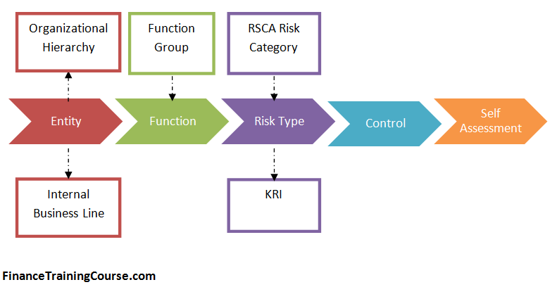

# 企业安全建设指南——学习笔记1

## 内控合规管理

金融等强监管行业，各项业务开展以及IT发展，必须遵守各项管理规定。合规是企业的底线和最低要求。

### 概述

#### 合规、内控、风险的关系

- 合规管理是基础，合规管理的目标是避免违反内外部法律、法规、规章制度、流程规范，避免不合规风险。
- 内控是合规管理的升级，在要求企业各项合规的基础上，确保合规完善，有执行点、有效。
- 风险管理，全面风险管理是风险管控的最高形式。风险按标准划分市场风险、信用风险、流动性风险、操作风险、法律风险。而合规、内控只是操作风险管理的手段。

一般而言，风险管理>内控>合规，但很多时候，行业或企业内称的内控就是风险管理。

#### 目标及领域

IT内控合规管理的目标：通过建立有效机制，实现对金融企业IT风险的识别、计量、监测和控制，对外保障IT活动符合监管机构要求，对内确保管理制度落地和控制措施有效，最终实现IT风险可控。

#### 落地方法

- 外规对内规：将外部要求分解，与内部规定建立联系，标识相互关系，可能有的关系包括：满足、冲突、缺失，列表整理后形式报告，和最终的内部规定。
- 内规对检查：根据最终制订的内部规定，形成全面覆盖的检查机制，包括常规检查、专项检查、事件驱动检查。
- 检查对整改：最好有一套电子系统，方便流程管理。
- 整改对考核：将检查的结果与绩效挂钩。

### 信息科技风险管理

原则：
- 事前预防为主
- 全描性原则
- 成本效益原则

组织架构：
- 风险管理，领导组——执行部门
- 审计管理，领导组——执行部门
- 信息管理，领导组——执行部门

三道防线：
- 第1道防线
  - 信息科技部门负责
  - 主要关注日常风险管理
  - 识别、分析、评估、控制、监测及报告风险管理情况
  - 严格执行各项风险管理政策和要求
  - 向首席信息官、信息科技管理委员会报告。
- 第2道防线
  - 风险管理部门负责
  - 侧重制订风险政策、制度、流程，在第一道防线的基础上对风险进行管理。
  - 总部的风险管理部门，负责协调、监督整个风险管理框架的有效性和完整性。
  - 提供精细化风险管理策略和支持
  - 与第1道防线保持独立，独立向首席风险官、风险管理委员会报告
- 第3道防线
  - 稽核审计部门负责
  - 按期进行全面的或专项的审计和稽核。
  - 与第1，第2独立
  - 对风险管理框架、内控体系的完整性和有效性提供独立审计和管理意见
  - 向审计管理委员会报告。

管理内容：
- IT治理
- 信息安全
- 系统开发、测试、运维
- 信息科技运行
- 业务连续性管理
- 外包管理
- 内部审计
- 外部审计

管理方法：
- 一般根据第2道防线下发的风向管理工具和要求开展工作。
- 操作风险管理的三大工具：
  - 风险与控制自我评估（RCSA)
  - 损失数据收集（LDC)
  - 关键风险指标（KRI)
- 三大工具贯穿风险管理始终，为高效、系统地操作风险管理提供帮助。

管理流程：
- 风险识别
- 风险分析与评估
- 风险控制
- 风险监测
- 风险报告

RCSA是一套为管理和员工准备的操作风险管理框架和工具：
- 识别、排序业务目标 Identify and prioritize their business objectives
- 评估、管理业务过程的高风险域Assess and manage high risk areas of business processes
- 自我评估控制的充分性 Self-evaluate the adequacy of controls
- 开发风险应对活动计划 Develop risk treatment action plans
- 确保业务目标和风险控制的标识、识别和评估在整个组织所有级别的一致性Ensure that the identification, recognition and evaluation of business objectives and risks are consistent across all levels of the organization

#### 风险监控指标

为了避免遗漏和重复需要建立：
- 风险库
  - 全描覆盖行业监管合规要求、行业风险事件、行业标准、公司风险现状、专家知识。
  - 威胁*脆弱性=风险，风险条目来源于：
    - 监管要求和标准的详细条款
    - 业界、企业内部的历史问题
    - 信息系统和技术控制目标（COBIT)
    - 信息技术基础架构库（ITIL)
    - 信息安全管理体系ISO27001
    - 软件成熟度集成模型CMMI
    - 其它相关标准、经验等。
- 风险监控指标体系
  - 根据风险库中风险点的评估，确定各风险点的驱动因素，进行关键风险指标的识别。
  - 根据重要性、系统性、合规性、可操作的原则，对风险监控指标进行筛选；
  - 指标确定后，明确指标的含义和计算方法等关键属性。
- 运用指标体系开展工作
  - 监控指标体系的运行
  - 有效评估信息科技风险的管理水平
  - 动态监测信息风险状况
  - 合理配置资源
  - 及时采取措施
  - 指标监测和报告。

### 监督监查

- 根据监管要求、外部标准、内部规范梳理出一套适用的检查标准，并进行全面覆盖的检查。
- 制订全年检查计划，采用常规检查、专项检查、事件驱动检查相结合的方式。
- 制订完善的检查标准
- 100%覆盖信息风险检查标准库
- 常规检查：注重变更、发布、值班等日常运维重点；
- 专项检查：围绕风险领域，如外包管理、可用性管理、数据安全、业务连续性管理等。
- 事件驱动检查：一般在可用性事件、信息安全事件、重大违纪事件等发生前后进行。
- 检查结果的报告与发布
- 问题追踪，整改追踪

### 制度管理

任何企业都需要有一套科学的制度体系，保证制度的合规、有效、可操作和规范，才能使企业发展有序健康。

#### 制度体系

制度体系要架构合理、层级清晰、覆盖全面。制度体系一般包括3层次：
- 政策级
- 办法级
- 规程级

制度内容一般包括：
- 总则（目的、依据、适用范围、管理原则、职责分工、定义等）
- 管理流程
- 监督检查
- 奖惩
- 细则
- 其它声明

### 业务连续性管理（BCM)

可以参考标准：ISO 22301和国内相关标准。

BCM实施过程：
- 制度和组织建设
- 业务影响分析（BIA)和风险评估（RA)
- 资源建设、预案制订
- 演练、维护和评估
- BCM企业文化建设

#### 业务影响和风险评估

几个概念：
- 重要业务
- 恢复时间目标RTO，指业务或系统从中断到恢复所需要的时间。体现了及时性。
- 恢复点目标RPO，指业务或系统数据恢复到某个恢复点的目标。体现了完整性。
- 业务影响分析BIA，整个BCM流程建立的基础。
- 风险评估：风险识别、风险分析、风险评估的整个过程。

