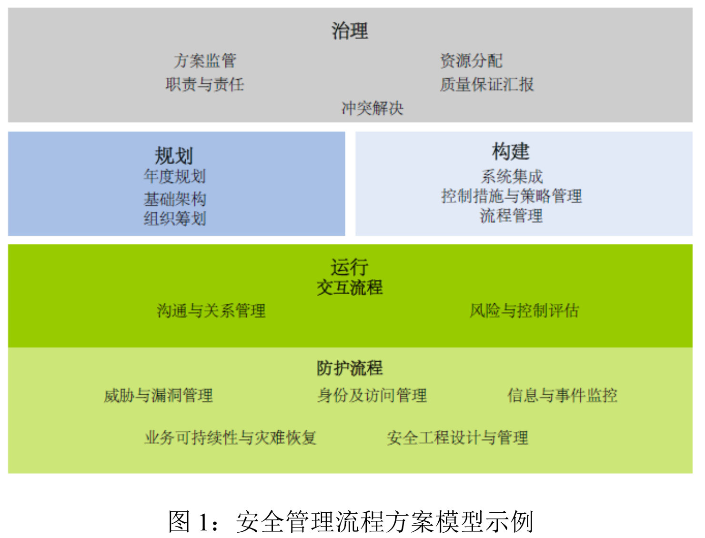
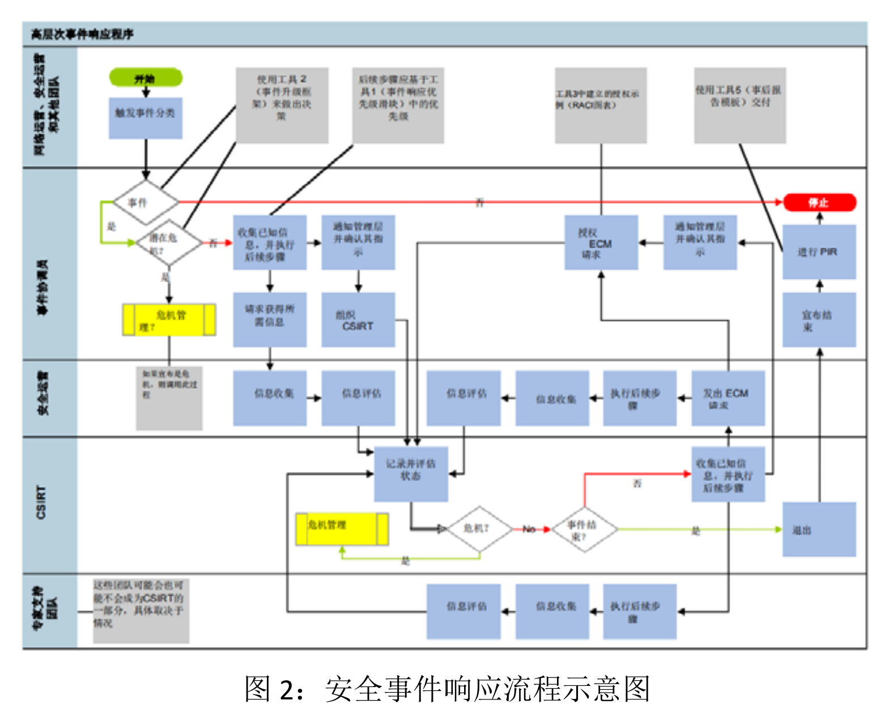
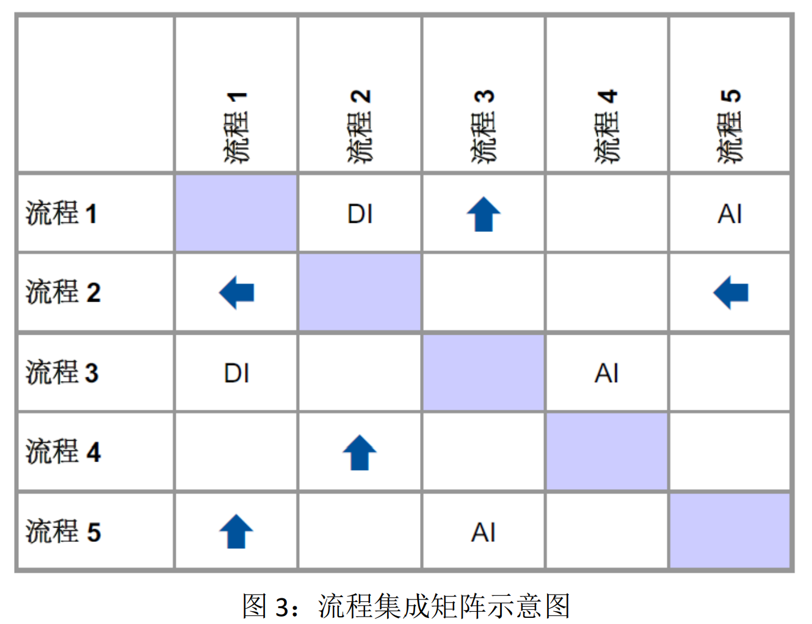

# 企业安全流程
> 内容：1.青藤云安全报告2021

以流程为中心的安全管理方法，是有效提高安全管理效率和效果的常见手段。

企业的安全负责人在制定年度安全管理规划可以分为3步：
- 制定一个安全流程目录，阐明预期要实现的流程状态；
- 根据安全流程目录及企业自身的资源情况，有选择地确定安全流程的优先级；
- 对于已经确定需要优先制定和实施的安全流程，要通过评估现有流程、职责划分、正式规定以及资源分配等步骤正式将这些优先流程规定下来。

## 制定安全流程目录

要进行有效的安全流程管理，首先需要制定一个安全流程目录，确定未来 2-4 年内要实施并逐渐发展成熟的安全流程。

目录主要包括下列部分：
- 治理
  - 方案监管
  - 资源分配
  - 职责与责任
  - 质量保证汇报
  - 冲突解决
- 规划
  - 年度规划
  - 基础架构
  - 组织筹划
- 构建
  - 系统集成
  - 控制措施与策略管理
  - 流程管理
- 运行、交互流程
  - 沟通与关系管理
  - 风险与控制评估
- 防护流程
  - 威胁与漏洞管理
  - 身份及访问管理
  - 信息与事件监控
  - 业务可持续性与灾难恢复
  - 安全工程设计与管理

下图列出了一个详细的信息安全流程方案模型。

### 治理流程
安全治理流程可确保采取合理、适当的措施，以最有效、最高效的方式保护组织机构的信息资源，以实现其业务目标。

尽管治理流程是整体安全流程模型的一个组成部分，但通常不归安全部门负责。

### 规划流程

规划流程往往是周期性的，而不是连续性的，通常涵盖与组织机构的安全计划管理相关的战略活动，包括战略制定、年度计划、安全架构设计等。

### 构建流程
构建流程与建立安全生态系统有关，包含控制措施与策略管理、流程管理和系统集成三个相互关联的流程。

### 运营流程
运营流程包括支撑安全团队与组织机构其余团队之间关系的流程（交互流程）和那些日常安全管理流程（防护流程）。

上图所列的安全流程管理方案内容很详细，涉及到的具体实施流程范围广泛，更适合于具有相对成熟的安全计划的大型组织机构。对于安全计划尚处于早期阶段或资源受限的组织机构，
可重点关注运营流程中的防护流程。

## 确定安全流程的优先级
对于大多数组织机构而言，将安全流程正式规定下来，并一定要从头开始确定和实施安全流程。这需要根据现有流程所处的发展阶段和成熟度情况进行修改、调整。

几乎没有一家企业可以立即实施整套流程方案。更现实的方法是对各安全流程进行优先级排序，分阶段地正式实施安全流程。

在确定各个流程的优先级时要考虑的因素包括：
- 哪些安全流程是组织机构实现最低安全标准所必不可少的。
- 可以更新和改进哪些现有流程和活动。
- 对于那些明显解决了重大风险的现有流程，应优先将这些流程正式规定下来。
- 应优先考虑在短期内能够显著改善风险管理的新流程构想。
- 是否有所需的知识和技术资源将特定流程正式规定下来。
- 信息安全计划的当前阶段和成熟度（在还没有适当的治理和组织功能的时候，就尝试实施安全体系结构流程，效果可能适得其反）。

## 正式规定安全流程
对于特定流程，第一步是确定流程所有权，然后开始对各个流程进行记录。

流程的正式制定过程应包括以下内容：
- 流程说明——概述流程目标和范围。
- 流程图——包括构成流程的子流程与活动之间工作流程。开始时，这可能是一个简略的模型，以后可以根据需要将其分解含有更多详细信息的多层次模型。
- 集成矩阵——展示集成点以及与其他安全、运营和服务管理流程之间的相互关系。除了流程之间的集成点外，集成矩阵还应指出构成该流程的其他流程（例如，风险评估流程是业务连续性管理流程的一个关键部分）。
- 技能和人员配备需求——表明该流程所需的直接和间接人力资源的数量和性质。如果组织机构内没有所需的技能或资源，则应重点突出一下。
- 角色和职责定义——确定有助于流程的特定组织职能以及这些职能的各自职责。这通常是通过职责分配（RACI）矩阵来实现的。
- 用指标来度量和跟踪流程绩效——运营型或管理性更强的流程（例如，用户配置）比战略流程（例如，风险管理）更适合采用指标来衡量。流程指标包括进行访问控制更改时的服务请求周转时间，或补丁程序管理流程时的平均关键补丁程序实施时间。
- 自动化——确定有哪些流程组成部分可以通过技术自动化实现。

流程图示例：

流程集成矩阵示意图：

## 哪些安全流程必须要做？
某些流程对于有效管理安全至关重要，通常被认为是最基本的安全实践。虽然这些流程并不是成熟的安全计划所需的全部流程，但却是满足基本安全标准必须实施的基本流程。

下面六个流程是企业安全的核心，通常是由 CISO 负责，其中某些内容可能不是由安全团队执行，但应该由 CISO 负责管理。
- 安全治理：由功能和流程组成，可确保采取正确的措施来平衡保护组织机构的安全和业务经营的需求。
- 策略管理：确定并记录了企业在安全风险方面的特定情况，必须对这些风险加以控制才能满足企业的风险偏好
- 宣传教育：通过宣传教育可以在一定程度上提高安全意识，帮助重塑更加安全的企业文化
- 身份与访问管理：对用户在组织机构的整个生命周期中对用户身份和访问进行的系统化管理，包括管理、访问（即身份验证和授权）和情报（即审计和分析）等一系列流程。
- 漏洞管理：识别、评估和解决企业中安全漏洞的流程，重点在于组织机构的技术基础设施上
- 事件响应：事故造成的损害程度在很大程度上取决于响应的质量，因此，至关重要的一点是要有一个良好的事件响应流程。

面对攻防领域天然不对等的状况，在企业规模较小、安全防御体系发展并不健全时，采取临时的救火策略可能是不得已的权宜之计；而随着企业业务发展壮大、全防御体系发展日趋成熟，安全负责人应该考虑更有效的安全管理方式。以流程为中心的安全管理方式，能够有效提高安全管理的效率与有效性，应该是企业安全负责人在进行新一年的安全管理规划时不容忽视的一个重要环节。

