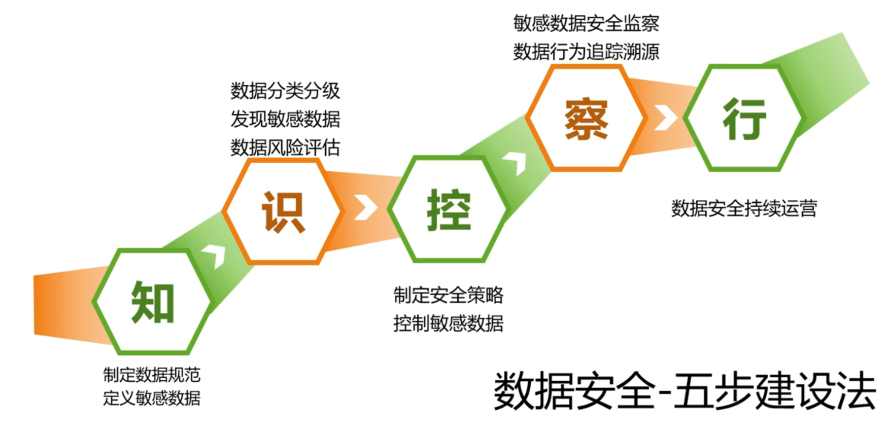

# 企业数据安全
## 概念

根据GB/T 25069-2010 《信息安全技术术语》，数据安全指保护数据的机密性、完整性、可用性。

当前数据安全关注的防护对象包括重要数据和个人隐私。

根据2017《个人信息出境安全评估办法（征求意见稿》所附的《重要数据识别指南》，重要数据指不涉及国家秘密，但与国家安全、经济发展以及公共利益密切相关的数据，包括但不限于公共通信和信息服务、能源、交通、水利、金融、公共服务、电子政务等重要行业和领域的各类机构在开展业务活动中采集和产生的，不涉及国家秘密，但一旦泄露、篡改、滥用会对国家安全、经济社会发展和公共利益造成不利影响的数据。

个人信息的定义，参考《网络安全法》第7章附则第76条第5项，

数据安全涉及三个维度：
- 人：管理人员、内部、外部、供应商
- 环境：传统IT,云大物移等
- 数据：内容、形态、属性

数据安全的目标：
- 进不来
- 看不懂
- 拿不走
- 改不了
- 赖不掉

## 背景
### 数据安全挑战
- 数据共享时敏感数据的泄露
- 新中泰技术需要新的安全技术
- 新的应用创新需要数据安全保障

### 数据主权

### 各国数据保护
#### 中国

### 产业对数据资产的关注

在中国共产党十九届四中全会上，中央首次公开提出“健全劳动、资本、土地、知识、技术、管理和数据等生产要素按贡献参与分配的机制。”这是中央首次在公开场合提出数据可作为生产要素按贡献参与分配，反映了随着经济活动数字化转型加快，数据对提高生产效率的乘数作用凸显，成为最具时代特征新生产要素的重要变化13。

#### 数据：从资源到资产
“数据资产”这一概念是由信息资源和数据资源的概念逐渐演变而来的。信息资源是在 20 世纪 70 年代计算机科学快速发展的背景下产生的，信息被视为与人力资源、物质资源、财务资源和自然资源同等重要的资源，高效、经济地管理组织中的信息资源是非常必要的。

数据资源的概念是在20 世纪90年代伴随着政府和企业的数字化转型而产生，是有含义的数据集结到一定规模后形成的资源。

数据资产在21 世纪初大数据技术的兴起背景下产生，并随着数据管理、数据应用和数字经济的发展而普及。

中国信通院将“数据资产”定义为“由企业拥有或者控制的，能够为企业带来未来经济利益的，以一定方式记录的数据资源”。这一概念强调了数据具备的“预期给会计主体带来经济利益”的资产特征。企业中数据资产的概念边界随着数据管理技术的变化而不断拓展。在早期文件系统阶段，数据以“文件”的形式保存在磁盘之上，初步实现了数据的访问和长期保存，数据资产主要指这些存储的“文件”。随后的数据库与数据仓库阶段，数据资产主要指结构化数据，包括业务数据和各类分析报表等，被用来支撑企业的经营和高层各项决策。在大数据阶段，随着分布式存储、分布式计算以及多种 AI 技术的应用，结构化数据之外的数据也被纳入到数据资产的范畴，数据资产边界拓展到了海量的标签库、企业级知识图谱、文档、图片、视频等内容。

国家层面
- 2015 年，国务院印发了《促进大数据发展行动纲要》，明确提出“数据已成为国家基础性战略资源，要加大投入力度，加强数据存储、整理、分析处理、可视化、信息安全与隐私保护等领域技术产品的研发，打造较为健全的大数据产品体系”。
- 2019 年，中共十九届四中全会从国家治理体系和治理能力现代化的高度把数据与劳动、资本、土地、知识、技术、管理一并视为生产要素，

目前，许多行业的数据资产管理已经进入到数据资产运营阶段，数据成为了企业核心的生产要素，不仅满足企业内部各项业务创新，还逐渐成为服务企业外部的数据产品。企业也积极开展如数据管理能力成熟度模型（DCMM）等数据管理能力评估工作，不断提升数据资产管理能力。

- 金融、电信等行业普遍在2000 年至2010年间就开始了数仓建设，并将数据治理范围逐步扩展到生产域，建立了比较完善的数据治理体系。2010 年后通过引入大数据平台，企业实现了数据的汇聚，并逐渐向数据湖发展，内部的数据应用较为完善，不少企业逐渐在探索数据对外运营和服务。
- 能源、工业等领域数据治理的起步较晚，大都在2010 年后开始数仓建设。南方电网经历了早期标准化阶段、一体化应用解决、数据质量提升阶段和数据资产管理体系建设四个阶段，当前已经形成了丰富的制度体系和技术工具体系。国家电网多年前建立了大数据团队，内部自研大数据产品，建设统一数据应用中心，研发了大量的电力大
数据应用，2019 年 5 月成立了专业的大数据中心，围绕泛在电力物联网，建设省级和总部两级联动的数据中台能力，目前也在构建较为完善的数据资产管理体系。

- 数据资产管理工具是数据资产管理工作落地的重要手段。由于大数据技术栈中开源软件的缺失，数据资产管理的技术发展没有可参考的模板，工具开发者多从数据资产管理实践与项目中设计工具架构，各企业数据资产管理需求的差异化使得数据资产管理工具的形态各异。因此，数据资产管理工具市场呈现百花齐放的状态。

#### 数据资产化面临诸多挑战
目前，困扰数据资产化的关键问题主要包括数据确权困难、数据估值困难和数据交易市场尚未成熟。
1.数据确权困难
明确数据权属是数据资产化的前提17，但目前在数据权利主体以及权力分配上存在诸多争议。

## 数据生命周期

GBT《信息安全技术 数据能力成熟度模型》简称DSMM，定义了6个阶段。特定的数据经理的生存周期由实际业务所决定，可以是完整的6个阶段，也可以是其中几个阶段。

通常认为数据的生命周期包含6个环节：
- 采集
- 传输
- 存储
- 处理
- 交换共享
- 销毁

以上每个环节都有一定的安全风险存在。

昂凯科技认为的一些安全需求（精准可视、安全可控）：
- 采集
  - 隐私保护
  - 完整性
  - 采集审计
- 传输
  - 通道安全
  - 保密性
  - 完整性
- 存储
  - 访问控制
  - 完整性
  - 容灾备份
  - 安全审计
- 处理
  - 访问控制
  - 数据脱敏
  - 授权审计
- 交换共享
  - 安全交互
  - 数据脱敏
  - 防泄漏
  - 监控审计
- 销毁
  - 历史审计

### 数据采集安全
=======
### 以数据生命周期和作用域为线索的数据安全治理

可能涉及：
- 敏感信息、机密数据、重要数据的分类分级
- 访问控制
- 容灾备份
- 加密、防泄漏
- 数据安全审计
- 数据水印
- GB/T 37988-2019 数据安全成熟度模型DSMM
- GARTNER 连续自适应风险和信任评估CARTA,检测和预防灰色区域造成的网络攻击和数据泄露

#### 数据安全治理体系

##### 制度

##### 产品

##### 运营

### 数据安全成熟度模型DSMM

分为5级、6个过程、4种安全能力

能力成熟度等级维度：
- 1级：非正式执行
- 2级：计划跟踪
- 3级：充分定义
- 4级：量化控制
- 5级：继续优化

安全能力维度：
- 组织建设
- 制度流程
- 技术工具
- 人员能力

#### 数据采集安全

##### PA01 数据分类分级

这是是数据治理的基础，也是开展数据安全工作的前提。合规性要求中也对这部分有众多要求。

良好的分类分级可以：
- 突出重点
- 精确定义访问控制策略和防护措施
- 节约资源
- 避免数据保护措施与敏感级别不匹配

### 数据传输安全

#### 数据传输安全
##### PA05 数据传输加密
默认全加密传输。

### 数据存储安全

- 密钥信息的加密处理
- 数据库的纵深防护
### 数据处理安全

##### PA06 网络可用性管理
#### 数据存储安全
- 密钥信息的加密处理
- 数据库的纵深防护
##### PA07 存储介质安全
##### PA08 逻辑存储安全
##### PA09 数据备份和恢复

#### 数据处理安全

- 防止而已操作
- 加强审计
- 闭环管理

### 数据交换共享

##### PA10 数据脱敏
##### PA11 数据分析安全
##### PA12 数据正当使用
##### PA13 数据处理环境安全
#### 数据交换共享

- 敏感信息脱敏处理
- 可追溯性
- 应用接入的访问控制
##### PA14 数据导入导出安全
##### PA15 数据共享安全
##### PA16 数据发布安全
##### PA17 数据接口安全

#### 数据销毁安全
##### PA18 数据销毁处置
##### PA19 介质销毁处置

#### 通用安全过程域
##### PA20 数据安全策略规划
##### PA21 人力资源安全
##### PA22 合规管理
##### PA23 数据资产管理
##### PA24 数据供应链安全
##### PA25 元数据安全
##### PA26 终端数据安全
##### PA27 监控与审计

## 数据安全5步建设法

一个中心、四个领域、五个阶段
- 一个中心：以数据安全防护为中心。
- 四个领域：
  - 组织建设
  - 制度建设
  - 技术工具
  - 人员能力
- 五个阶段
  - 业务梳理
  - 分级分类
  - 策略制定
  - 技术管控
  - 优化改进

## 数据安全治理

### 数据安全治理框架
根据Gartner 《How to Use the Data Security Governance Framework》

#### 知

#### 识

#### 控

##### 身份管理

##### 主机
EDR HDLP 邮件安全

##### 业务

##### 运维
堡垒机要有数据授权、访问、审计能力才行，有的堡垒机没有这些能力。

##### 数据库

防止sql查询结果集泄密，要脱敏。

#### 查
要进行UEBA. 

日志分析（UEBA）

ueba更多应用：

DLP与ueba结合实现泄露溯源

使用学习算法分析

#### 行
业务在变，数据在变，安全也在变。

### 昂凯方案

具体落地

具体场景

## 合规要求

### 国内情况

#### 上位法
- 网络安全法
- 2020.7.3. 数据安全法（草案）
- 密码法
- 2020.10.21 《个人信息保护法（草案）》
##### 《个人信息保护法（草案）》

个人信息的定义：与已识别或者可识别的自然人有关的各种信息。

个人敏感信息：一旦泄露或者非法使用，可能导致个人受到歧视或人身、财产安全受到严重危害的个人信息。

个人信息保护的原则：方式合法正当、目的合理明确、最小必要、公开透明、准确完整、安全可靠。获取个人敏感信息要得到个人的独立统一并告知其必要性。

- 个人信息处理
- 个人信息跨境提供
- 个人信息主题权力
- 个人信息处理者义务
- 履行个人信息保护职责的部门
  - 网信办负责中央统筹和监管，国务院各部门负责相关职责内保护和监管。
  - 法律后果包括责令整改、没收非法所得、罚款、赔偿损失；
  - 情节严重的面临5千万以下或上一年度营业额百分之五以下的罚款。

##### 数据安全法
数安法草案共七章五十一条，以“数据活动”（即数据的收集、储存、加工、使用、提供、交易、公开等行为）为监管对象，而其中“数据”的定义并不像《个人信息保护法》那样仅局限于个人信息。

草案搭建了数据保护的法律框架，包括：
- 数据安全等级保护制度
- 数据安全风险管理系统
- 安全应急处置机制
- 数据安全审查制度
- 数据出口管制
- 以及歧视性国际措施的反制机制等。

数安法草案规定，中央国家安全领导机构在负责统筹协调各部门实施数据安全战略及重大方针政策，国家网信部门、公安机关、国家安全机关分别负责各自职责范围内的数据安全工作。

违反数安法的主体或将面临责令改正、警告、罚款、没收违反所得、吊销营业执照等处罚。

#### 强制性规定

- 等保2.0
- https://www.secrss.com/articles/12854

2021年3月，国家互联网信息办公室、工业和信息化部、公安部、国家市场监督管理总局四部门联合发布《常见类型移动互联网应用程序必要个人信息范围规定》，旨在落实《中华人民共和国网络安全法》关于个人信息收集合法、正当、必要的原则，规范移动互联网应用程序（App）个人信息收集行为，保障公民个人信息安全。《规定》明确了**地图导航、网络约车、即时通信、网络购物等39类常见类型移动应用程序必要个人信息范围**，要求其运营者不得因用户不同意提供非必要个人信息，而拒绝用户使用App基本功能服务。

#### TC260数据安全国家标准

2016年，全国信安标委（TC260）成立大数据安全标准特别工作组（SWG-BDS），主要负责数据安全、云计算安全等新技术新应用标准研制。目前，TC260围绕数据安全和个人信息保护两个方向，已发布6项国家标准，在研标准10项，研究项目18项。现有数据安全国家标准已初成体系。

|计划号|项目名称|制修订|计划下达日期|项目状态|
|-|-|-|-|-|
|20111693-T-469|	智能交通 数据安全服务|	制订|2012-01-09|	已发布|
|20193254-T-469	|信息安全技术 健康医疗数据安全指南|	制订|2019-10-24|	正在征求意见|
|20191028-T-320	|证券期货业数据安全风险防控 数据分类分级指引|制订|	2019-03-28|	正在起草|
|20190907-T-469	|信息安全技术 政务信息共享 数据安全技术要求|	制订	|2019-03-28	|正在批准|
|20173852-T-469|	信息安全技术 数据安全能力成熟度模型|	制订	|2018-01-09	|已发布|
|20170577-T-469	|信息安全技术 大数据安全管理指南	|制订|	2017-07-05|	已发布|
|20100411-Z-469	|信息技术 用于物品管理的射频识别 实施指南 第4部分:标签数据安全|	制订|	2010-12-17|	已终止|

#### GB/T 30146 《公共安全业务连续性管理体系要求》

业务连续性管理的定义：识别对组织的潜在威胁以及这些威胁一旦发生可能对业务运行带来的影响的一整套管理过程。该过程卫组织建立有效应对威胁的自我恢复能力提供了框架，以保护关键相关方的利益、声誉、品牌和创造价值的活动。

GB/T 30146中对业务连续性管理体系（BCMS）的定义：用于建立、实施、运行、监视、评审、保持和改进业务连续性，是一个组织整个管理体系的一部分。

#### CCSA数据安全行业标准

2019年7月1日工信部发布《电信和互联网行业提升网络数据安全保护能力专项行动方案》，方案中提到了要出台行业《网络数据安全标准体系建设指南》，加快完善行业网络数据安全标准体系。该项工作由CCSA TC8 SWG1（数据安全特设组）承担，目前规划的数据安全标准体系四大类标准如下所示：

- 基础共性
  - 术语定义
  - 数据安全框架
  - 数据分类分级
- 关键技术
  - 数据采集
    - 数据清洗比对
    - 数据质量监控
  - 数据传输
    - 数据完整性保护
    - 数据加密传输
  - 数据存储
    - 数据库安全
    - 云存储安全
    - 数据安全审计
    - 数据防泄漏
  - 数据处理
    - 匿名化、去标识
    - 数据脱敏
  - 数据交换
    - 多方安全计算MPC
    - 透明加密
    - 数据溯源
  - 数据销毁
    - 数据销毁
    - 介质销毁
- 安全管理
  - 数据安全规范
    - 数据安全通用要求
    - 个人信息保护要求
    - 重要数据保护要求
  - 数据安全评估
    - 数据安全合规性评估
    - 数据安全风险评估
    - 个人信息安全影响评估
    - 数据出境安全评估
  - 监测预警与处置
    - 监测预警与处置技术要求
    - 监测预警与处置接口规范
    - 监测预警与处置测试规范
  - 应急响应与灾难备份
    - 数据安全应急响应指南
    - 灾难备份技术要求
    - 恢复能力评价
  - 安全能力认证
    - 管理安全认证
    - 产品安全认证
    - 安全服务认证
    - 人员能力认证
- 重点领域

### 国际情况

#### 欧盟 电子隐私规定 草案

2021年1月5日，欧洲盟理事会发布了新的《电子隐私规定》（ePrivacy Regulation）草案（“电子隐私规定草案”）。该草案旨在代替原有的《电子隐私指令》（ePrivacy Directive），配合《通用数据保护条例》（“GDPR”），以便应对信息技术发展带来的新挑战。

电子隐私规定草案将电子通信网络的定义扩展至包括Whatsapp、Facebook、Messenger等即时通讯服务，以确保它们在保密性上与传统的电信服务处在同一水平。与GDPR类似，电子隐私规定草案对于那些位于欧盟境外但是向欧盟终端客户提供服务的电子通信服务尚同样适用。

值得注意的是，《电子隐私指令》中的“cookie条款”被电子隐私规定草案修改，其将覆盖终端设备上类似cookie程序，例如数字指纹。在新规定下，用户同意或拒绝使用cookie的流程也将被简化。除此之外，新的规定还禁止未经接收者同意的电子通信，包括垃圾邮件、垃圾短信以及电话营销。

负责监督执行GDPR的数据保护机关也将同时负责新规定的执行。欧盟委员会相信，这一安排将会带来更加有效的执法。
#### 美国：地方立法活跃
近一年中，美国数据方面的立法活动主要以州为单位进行，其中的代表是加利福尼亚州。2020年11月3日，美国加利福尼亚州选民投票通过了《加州隐私权法案》（California Privacy Rights Act of 2020，“CPRA”）。CPRA极大地改变了2018年《加州消费者隐私法案》（California Consumer Privacy Act，“CCPA”）确立的隐私保护法律框架，以对标欧盟的GDPR。

与CCPA相比，CPRA拓展了加州居民的隐私权范围，赋予居民更正权，使得其可以要求存有不准确个人信息的商业机构修正这些信息。同时，**CPRA亦创设了“敏感个人信息”（sensitive personal information）这一概念，其中包括政府颁发的个人身份信息（如驾照号码、护照号码）、金融信息、精确的地理位置、种族、信仰、工会成员身份、消费者信件或电子信息内容等**。此外，CPRA完善了有关受监管主体认定、自动化决策以及未成年人保护方面相关的问题。

CPRA还建立了新的隐私保护主管机关：加州隐私保护局（California Privacy Protection Agency）。该机构将调查并举行听证会，以确定受监管主体是否符合CPRA的要求，并对违规行为处以罚款。按照计划，CPRA将于2023年1月生效。

此外，2021年3月2日，弗吉尼亚州州长签署批准了《弗吉尼亚州消费者数据保护法》（Virginia Consumer Data Protection Act, “VCDPA”），该州也继加州之后，成为了美国第二个颁布消费者数据保护法的州。VCDPA借鉴了CCPA以及欧盟GDPR的成熟经验，赋予了该州居民访问权、更正权、删除权及可携权等权利，并设置了用户画像、定向广告、敏感信息等相关规定。

#### 新加坡：《个人数据保护法案》修正案
新加坡于2012年通过的《个人数据保护法案》（Personal Data Protection Act，“PDPA”）在2020年11月2日迎来第一次修订。
PDPA修正案创设了数据泄露时的强制报告义务。PDPA修正案要求，如果数据泄露规模达到500人及以上，则该组织必须在知道泄露后72小时内通知个人数据保护委员会（Personal Data Protection Committee，“PDPC”），并且尽快告知受影响的个人。
PDPA修正案还增加了“同意”的例外情形。当数据处理符合数据处理者的“合法利益”（legitimate interest）、为了业务改进（business improvement）或商业研究及发展（commercial research and development）时，数据处理者无需获得个人的同意。在数据处理是履行合同所必须，或者数据处理者已经告知个人数据处理新的目的时，个人将被视为已经同意这种对其数据的处理。
数据可携权也被写入PDPA修正案中。个人将有权要求某一数据处理者将其个人数据以常用的机器可读的格式传输到另一个组织处。
PDPA修正案通过后，年度营业额超过1000万新币的组织在违反该法的情况下可能面临高达其年度营业额10%的罚款。而对于其他组织来说，违法的罚款上限将依旧是100万新币。

#### 日本：《个人信息保护法》修订版
2020年6月5日，日本参议院通过了《个人信息保护法》修订版（“个保法修订版”）。该法预计将于2022年春季完全生效，修订后的法律将适用于外国主体。
个保法修订版扩大了个人的权利。旧的《个人信息保护法》不适用于将在6个月内被数据处理者删除的数据，而个保法修订版删除了这一豁免。个人要求数据处理者停止或删除自身数据的权利也在个保法修订版中得到扩张。
在向第三方传输问题上，个保法修订版进一步限制了适用opt-out规则的传输情形，并赋予个人要求数据处理者披露传输记录的权利。此外，当数据接收方有意将新接收的数据与已有数据结合时，其必须获得个人的同意，而传输方必须提前确认接收方已经获得必要的同意。
个保法修订版还增加了信息匿名化处理的相关规则，填补了旧法在这方面的空白。数据处理者现在可以自由处理经过匿名化的个人信息。
在数据泄露的情形下，个保法修订版要求数据处理者及时通知个人信息保护委员会（個人情報保護委員会）以及受影响的个人。

#### 巴西：《通用数据保护法》生效
2020年9月，巴西《通用数据保护法》（Lei Geral de Proteção de Dados，“LGPD”）正式生效。这是巴西首个针对数据保护的特别立法，也是拉丁美洲在这一问题上的首部主要法律。
LGPD大量借鉴了欧盟GDPR的规定。其全文共十章，对适用范围、数据处理原则、数据主体权利、数据跨境传输、个人数据处理代理人、数据安全监管等内容做出了规定。值得注意的是，LGPD第17条明确了自然人对其个人数据享有所有权。
违反LGPD的数据处理代理人将会面临最高可达其年度营业收入2%且不超过5000万雷亚尔（约合1290万美元）的罚款。其他法律责任形式包括警告、责令改正、公开其违法行为、要求删除相关违法数据、暂停涉案数据库运行、暂停涉案个人数据处理以及部分或完全禁止数据处理的相关活动等。

#### ISO 隐私和数据安全标准

ISO/IEC JTC1 SC27是指定隐私和数据安全标准的ISO安全技术分委会。其发布的隐私保障体系如下：

特定领域:
- 智慧城市 27570
- 物联网 27030
- 大数据20547-4

通用架构：
- 通用架构 术语和原则 29100
- 通用架构 隐私参考列表 29100

管理：
- 隐私影响评估 29134
  - 风险
  - 控制措施
- 基于隐私首选项的PII处理 27556
- ISMS在隐私管理中的扩展 27701（27552）
  - 要求与指南
  - 控制措施
- 控制措施 29151 PII控制措施
- 控制措施 27018 云控制措施
- 控制措施 27555 删除项

实施：
- 隐私工程 27550
  - 指南
- 隐私告知与同意 29184
  - 协商
- 隐私能力成熟度模型 29190
  - 成熟度等级

具体技术方面：
- 隐私架构框架 29101 ICT组件
- 隐私增强数据去标识 20889 技术和分类
- 具体技术要求 29191 部分匿名和部分不相关

支持：
- 标准隐私评估 SD4

上述过程的图示如下：

其中，SC27 WG5身份管理和隐私保护技术工作组，主要负责隐私保护标准研制，目前已发布8项隐私保护标准，2项技术研究报告，在研1项标准，如下表所示：

此外，SC27 WG4安全控制和服务工作组已发布3项数据安全相关国际标准，在研6项标准，研究项目1项，如下表所示：

#### ITU-T数据安全标准
ITU-T国际电联SG17安全标准工作组硏制的数据安全和隐私保护标准，主要涉及电信运营商、通信组织、电子商务等的数据安全和个人信息保护标准。

#### 美国NIST数据安全标准

美国国家标准与技术研究院（NIST）于2012年6月启动了大数据相关基木概念、技术和标准需求的研究，2013年5月成立了NST大数据公共工作组（ NBG-PWG），对所有感兴趣的相关方开放，无会员费，旨在通过结合行业、学术和政府等各方力量加速对大数据这一新兴产业的采纳，其成果由NIST评审和发布。

美国NIST标准现有数据安全标准，主要涉及受控非保密信息、个人可识别信息等主题的数据安全和隐私保护标准，如下表所示：

参考：https://www.secrss.com/articles/19005

## NCCoE 隐私加强联合指南（Privacy-Enhanced Identity Federation）
这个项目研究如何隐私保护技术，充分利用市场的主导标准，可以集成到身份联合解决方案，以满足用户和组织的隐私目标。
### 构建技能模块（Building Blocks）

#### 5G security
#### Adversarial Machine Learning
#### Continuous Monitoring for IT Infrastructure
#### Data Security
#### Derived PIV Credentials
#### Internet of Things
#### Managed Service Providers
#### Mobile Device Security
#### Patching the Enterprise
#### Post-Quantum Cryptography
#### Supply Chain Assurance
#### TLS Server Certificate Management
#### Trusted Cloud
#### Zero Trust Architecture
