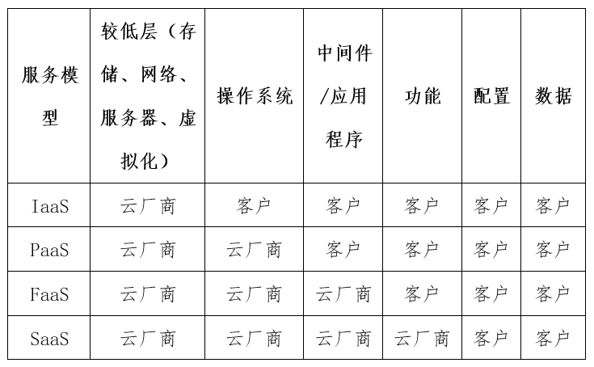

# 使用ATT&CK分析云安全威胁

内容取自：
- 安未然 《报告：ATT&CK框架指导云安全威胁调查》, 虎符智库  2020年11月18日

## 报告：ATT&CK框架指导云安全威胁调查
云计算的迅速采用，使得组织正面临着安全责任划分、安全防护和安全运营等方面的新挑战。云安全责任共担模型在管理和控制方面进行了明确的划分，但对于具体发生的安全事件来说仍是模棱两可。组织正在努力同时应对多种类型高风险威胁，在云安全防护方面仍然面临诸多重大挑战。随着云安全挑战和问题日渐复杂，安全运营中心单一的威胁调查方法也不再有效。
 
统一云端和本地环境的威胁调查框架有助于改善组织的网络安全态势、优化组织流程和提高产出。ATT&CK框架成为当前最广泛采用的威胁调查框架，并且仍在快速发展之中。

从技术认同上来看，ATT&CK框架的使用有助于组织展现履行云服务保护责任的良好形象。从采用目的上来看，大多数组织使用ATT&CK框架的目的是确定当前部署的安全产品或重要任务与框架范围或要求之间所存在的差距。从采用效果上来看，ATT&CK框架全面反映了现有攻击者的战术和技术，在实际的云安全实践和安全运营中被普遍采用。从采用程度上来看，大多数企业已经处于规划和后续的实施阶段。从采用方式上来看，安全事件标记后的策略实施仍然是以手工作业方式为主，缺乏有效的自动化。
 
ATT&CK框架在实现时也存在一些鸿沟。大中型企业对自己的安全产品是否能够有效检测ATT&CK矩阵中所有攻击技术的信心不足。一些安全产品尚未完全覆盖ATT&CK战术相关的所有技术和子技术，ATT&CK框架实现时缺乏多源事件的关联，安全产品之间缺乏互操作性。ATT&CK作为风险管理框架（或与之集成），仍然需要说明云厂商和客户之间责任共担的细节。
 
调查报告认为，云端威胁仍不断发展变化中，但大多数威胁都是可以检测和防范的。不论责任共担模型如何划分职责，云厂商应采取全面的方法来调查云端威胁。首先，云厂商应当采用ATT&CK框架进行威胁调查，识别攻击者的战术和技术。其次，云厂商要全面调查来自网络、终端和云端等所有数据源的安全事件，并将三者关联起来进行综合分析。最后，安全运营团队面临着日渐增多的威胁调查，有必要基于安全框架采取自动化方式进行事件标记和安全策略实施等。

### 云安全责任共担模型

云计算在安全责任划分、安全防御和安全运营等方面面临挑战。例如，服务模型的多样化带来了安全责任划分问题，现在的云安全责任共担模型（如表1所示）在责任划分上仍然过于粗糙。IaaS模型中，云厂商承担较低层（即存储、网络、服务器和虚拟化层）的安全责任，客户承担操作系统及以上层的安全责任；PaaS模型中，云厂商承担除数据和应用程序之外的所有责任，包括网络、存储、服务器、虚拟化、操作系统、中间件和运行时；FaaS模型（也称无服务器架构）中，客户承担微服务单个编程模块的安全责任，云厂商承担其他剩余责任；SaaS模型中，云厂商承担与运营服务等相关的所有安全责任，客户只承担配置和数据的安全责任。

为了评估组织当前所面临的云安全挑战，有必要对云端威胁进行全面和深入的调查。组织正在越来越多地采用MITRE ATT&CK框架调查威胁。

ATT&CK是一个根据真实的观察数据来描述和分类攻击者战术和技术的知识库，已经被广泛应用到网络安全产品或服务威胁模型和方法的开发之中。

最新的企业8.0版本提供了14种战术（共计205种技术），包括:
- 侦测（如收集受害者主机信息）
- 资源开发（攻破基础设施或账户）
- 初始化访问（如鱼叉式网络钓鱼）
- 执行（如利用PowerShell）
- 持久化（如使用登录脚本）
- 提权（如进程注入）
- 防御绕过（如修改注册表）
- 凭证访问（如从web浏览器提取凭证）
- 发现（如网络共享发现）
- 横向移动（如通过远程桌面协议连接）
- 收集（如本地系统的数据）
- 命令和控制（如通过非标准端口通信）
- 数据渗出（如通过命令和控制通道渗出数据）
- 施加影响（如勒索软件加密的数据）。

### 云安全挑战

首先，云安全责任共担模型在管理和控制方面进行了明确的划分，但对于具体发生的安全事件来说仍然模糊不清。云厂商控制的服务层次缺乏可见性（例如，较低层的存储、网络、服务器和虚拟化），很难确定客户的数据泄露是否是由云厂商宿主平台上的安全事件引起的。更为严重的是，随着云厂商正越来越多地引入“即服务”产品，新的服务模型不断形成，安全责任的划分将会更加复杂。例如，目前已被亚马逊、谷歌和微软等企业广泛采用的功能即服务（FaaS）是一个相对较新的产品，对这种新服务模式需要重新界定安全责任。
 
其次，组织正在同时与多种高风险的威胁类型作斗争。ATT&CK 框架云矩阵中10种战术，从初始化访问到数据渗出等战术攻击都十分频繁。为了应对这些威胁，安全运营团队正在对攻击进行分类和补救。60%的组织建立了安全运营中心，并雇佣了专门的云端威胁调查工程师。32%的受访者目前所在的安全运营中心有10-20名云端威胁调查工程师，15%的受访者目前所在的安全运营中心有20多名云端威胁调查工程师。
 
再次，组织在云安全防护方面仍然面临诸多重大挑战。34%的受访者在检测正在进行中的攻击方面遭遇挑战，32%的受访者在保护和管理多个云服务方面遭遇挑战，31%的受访者在与第三方共享数据时遭遇挑战，31%的受访者在防范未经授权访问方面遭遇挑战，81%的受访者正在遭受ATT&CK云矩阵中的战术攻击，且频率非常高。
 
此外，随着云安全挑战和问题日渐复杂，安全运营中心单一的威胁调查方式不再有效。许多威胁并非孤立于云或本地基础设施，在混合云部署模型这种异构环境下，来自云服务的威胁可以穿透本地基础设施，来自本地基础设施的威胁也可以穿透云服务。无论是云端威胁，还是传统的场内基础设施的威胁，云端威胁调查工程师需要确保云威胁调查与其他安全运营调查相结合。
 
所有这些挑战都突出了ATT&CK威胁调查框架的必要性，该框架既既要包含云环境威胁，也要包含传统本地基础设施的威胁。

### ATT&CK威胁框架解决方案

ATT&CK威胁框架有助于全面掌握攻击者的战术和技术，在安全运营中心采用ATT&CK威胁框架调查威胁已成为广泛共识。63%的大中型企业的安全运营中心正在同时使用ATT&CK 的云矩阵和企业矩阵。
 
从技术认同上来看，ATT&CK框架的使用有助于政府和企业展现履行云服务保护责任的良好形象。87%的受访者认为采用ATT&CK 云矩阵有助于改善组织云安全，79%的受访者认为采用ATT&CK 云矩阵有助于推动云计算的采用。69%的受访者认为将安全运营中心外包给采用ATT&CK框架的第三方会感到放心。ATT&CK框架正在被政府和企业的防御者广泛使用，以发现可见性、安全工具和流程方面的不足。
           
从采用目的上来看，**大多数组织使用ATT&CK框架的目的是确定当前部署的安全产品或重要任务与框架范围或要求之间所存在的差距**。57%的受访者认为ATT&CK框架有助于确定当前部署的安全工具中的实现差距，55%的受访者认为该框架对安全策略实施有用，54%的受访者认为该框架对威胁建模有用。

从采用效果上来看，ATT&CK框架全面反映了现有攻击者的战术和技术，在实际的云安全实践和安全运营中被普遍采用。81%的企业现在正在使用ATT&CK框架，其中63%的企业使用企业矩阵（Windows/Mac/Linux），其中也有63%的企业正在使用云矩阵。83%的企业矩阵采用者认为企业矩阵全面反映了他们面临的攻击者战术和技术，86%的云矩阵采用者认为云矩阵全面反映了他们面临的攻击者战术和技术。

使用ATT&CK的意义：
- 查缺补漏，即判断当前部署的安全产品是否存在不足？
- 检查和推进安全政策实施；
- 便于安全威胁建模；
- 量化云服务等技术的安全风险；
- 管理安全事件，为安全事件添加标签，进行有效组织管理。
- 实现安全术语的一致化，便于与开发人员、运维人员、安全人员的沟通交流。
- 评估产品与企业目标的一致性。
- 架构设计与配置
- 参考范例推荐的缓解损失的办法。

从采用程度上来看，大多数企业已经处于规划和后续的实施阶段。报告首先将云矩阵采用程度划分为无实施计划、前期规划、规划、早期实施（主要用于参考和知识管理）、中期实施（主要用于知识决策和自动响应）和高级实施（主要用于主动式威胁狩猎）。其中，44%的企业处于规划和早期实施阶段，44%的企业正处于ATT&CK云矩阵的中高级阶段。并且，框架采用程度与最佳安全实践有关。中高级实施阶段通常需要将云端、终端和网络环境的安全事件关联在一起，60%的受访者表示云矩阵正处于中高级实施阶段，57%的受访者表示企业矩阵正处于中高级实施阶段。对来自所有来源的安全事件进行全面分析，能够全面促进安全事件检测和防御能力的构建。
 
从采用方式上来看，安全事件标记后的策略实施仍然是以手工方式为主，缺乏有效的自动化。所有来源的安全事件，意味着海量的数据，分析这些数据往往导致安全运营中心的人力资源耗尽，迫切需要引入自动化的分析机制。91%的ATT&CK的云矩阵受访者使用云安全产品标记事件，但不到一半的人实现了安全策略的自动化更改。其中，48%的云矩阵受访者（在早期实施、中期或高级阶段）表示会使用云安全产品标记事件，并允许安全策略自动化的更改。43%的受访者表示虽然会使用云安全产品标记事件，但并没有考虑安全策略自动化更改。安全运营团队有必要利用端到端的自动化工作流实现基于安全事件标记的威胁识别，以及实施防范安全事件和及时响应的安全策略。

### ATT&CK威胁框架实现鸿沟

首先，一些安全产品尚未完全覆盖ATT&CK战术相关的所有技术和子技术。组织应当对所有安全产品进行持续测试，识别与ATT&CK战术相关的所有技术和子技术，确保安全产品的有效性。
 
其次，ATT&CK框架的落地仍需相关基于ATT&CK框架的安全产品的支持。ATT&CK框架的使用正在面临一些挑战，45%的组织认为ATT&CK的安全产品之间缺乏互操作性，43%的组织认为很难将安全事件数据映射到战术和技术，36%的组织表示收到误报率太高。这些挑战需要基于ATT&CK框架的安全事件标记产品来解决。例如，“渗出”战术优先于“初始化访问”战术。
 
再次，ATT&CK在实现时缺乏多源事件的关联。云计算的分布式特点以及通过互联网为用户提供的全球可访问性，增加了识别和调查企业威胁的复杂性。这些威胁包括的网络、终端和云组件的威胁，需要网络、终端和云等3个数据源的事件关联。只有39%的受访者在调查威胁时纳入了所有三种环境中的事件，大多数受访者（57%）只使用终端和云2个源的安全事件调查威胁。
 
第四，ATT&CK作为风险管理框架（或与之集成），仍然需要说明云厂商和客户之间责任共担的细节。例如，美国政府的联邦风险和授权管理计划（Federal Risk and Authorization Management Program，FedRAMP）是一个很好的模式。通过划分联邦政府和云厂商之间所有部署的责任，FedRAMP使美国政府加快了云计算的部署，包括通过了国防部的联合企业防御基础设施（JEDI）等重大合同。云厂商为美国政府提供了专门的产品，如AWS GovCloud和Azure Government。
 
第五，ATT&CK框架缺乏攻击者技术的优先级和权重。许多组织不使用ATT&CK框架，一个主要原因是其不考虑任何攻击者技术的优先级和权重。报告认为这种做法是有意为之，目的是促使对每个业务或安全产品的独立风险评估，并确定各自威胁的可能性和影响力。每个企业需要根据所在部门的威胁情报和具体的威胁模型，对战术和技术进行优先排序。

最后，大中型企业对自己的安全产品是否能够有效检测ATT&CK矩阵中所有攻击技术的信心不足。只有大约49%的受访者对其组织的安全产品在每个ATT&CK矩阵中检测攻击者战术和技术的能力高度自信。 

### 建议措施

云端威胁仍不断发展变化中，但大多数威胁都是可以检测和防范的。不论责任共担模型如何划分职责，云厂商应采取全面的方法来调查云端威胁。虽然有些企业采用了其他框架达到同样的效果，但ATT&CK框架的应用最为广泛的，超过80%的企业采用了该框架。ATT&CK框架的采用有助于改善网络安全态势，使企业更加自信地利用云计算资源。
 
为此，报告建议采取以下措施进行全面的云端威胁调查：

1）采用ATT&CK框架进行威胁调查，识别攻击者的战术和技术。大多数组织已经正在使用ATT&CK框架来标准化组织的知识库，识别当前部署的安全产品或工具中的漏洞，指导安全策略的实施，对威胁进行建模，并评估与采用新技术（如云服务）相关的风险。
 
2）调查来自所有数据源的威胁。保持对事件的可见性对于检测和防范威胁至关重要。在威胁调查中，全面调查来自网络、终端和云的事件，并将三者关联起来进行综合分析。目前，只有39%的受访者在调查威胁时将所有三种环境结合在一起。
 
3）自动化。安全运营团队面临着日渐增多的威胁调查，有必要使用安全框架进行自动化的事件标记。

