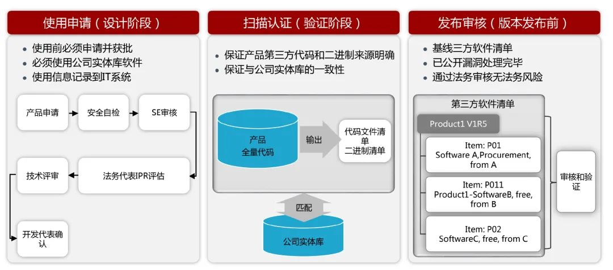

# 安全开发

引入新系统和对已有系统进行大的变更，可以按照从文件、规范、测试、质量控制到实施管理这个正式的过程进行。

## SDL

> 参考华为SDL经验

### 从华为任正非的“公开信”看背景与方向
2018年12月27日，华为任正非签发文章《全面提升软件工程能力与实践，打造可信的高质量产品——致全体员工的一封信》.

> 我今天写信，是要和大家沟通公司如何全面提升软件工程能力和实践。二十年前的IPD变革，重构了我们的研发模式，实现了从依赖个人、偶然性推出成功产品，到制度化、持续地推出高质量产品的转变。至今为止，我们的产品和解决方案已经在170多个国家安全稳定运行，并因此积累和赢得了全球数万客户的信任。今天，我们又处在一个新的起点，全面云化、智能化、软件定义一切等发展趋势，对ICT基础设施产品的可信提出了前所未有的要求。可信将成为客户愿买、敢买和政府接受、信任华为的基本条件。可信不仅仅是产品外在表现的高质量结果，更是产品内在实现的高质量过程，是结果和过程的双重可验证的高质量。而只有全面提升软件工程能力和实践，才有可能打造出可信的高质量产品。
> 公司已经明确，把网络安全和隐私保护作为公司的最高纲领。我们要在每一个ICT基础设施产品和解决方案中，都融入信任、构建高质量，关键内容包括：
> 安全性(Security)。产品有良好的抗攻击能力，保护业务和数据的机密性、完整性和可用性。
韧性(Resilience)。系统受攻击时保持有定义的运行状态，包括降级，以及遭遇攻击时快速恢复的能力。
隐私性(Privacy)。遵从隐私保护既是法律法规的要求，也是价值观的体现。用户应该能够适当地控制他们的数据的使用方式。信息的使用政策应该是对用户透明的。用户应该根据自己的需要来控制何时接收以及是否接收信息。用户的隐私数据要有完善的保护能力和机制。
可靠性和可用性(Reliability& Availability)。产品能在生命周期内长期保障业务无故障运行，具备快速恢复和自我管理的能力，提供可预期的、一致的服务。
全面提升软件工程能力和实践，关乎公司未来的生存和发展，与我们每一个人都息息相关。在此，我希望全体员工、特别是软件工程师们主动参与进来，从自己做起，踏踏实实，共同打造可信的高质量产品。
我们要转变观念，追求打造可信的高质量产品，不仅仅是功能、特性的高质量，也包括产品开发到交付过程的高质量。我们知道，功能、特性对产品至关重要，我们更知道，进度对满足客户需求也至关重要。今天，我们要把可信作为第一优先级，放在功能、特性和进度之上。除非客户信任我们的产品，否则这些优秀的特性都没有机会发挥价值。我们各级管理者和全体员工都不得以进度、功能、特性等为理由来降低可信的要求，确保可信的要求在执行过程中不变形。
我们要从最基础的编码质量做起，视高质量代码为尊严和个人声誉。代码就像是高楼大厦的一砖一瓦，没有高质量的代码，可信的产品就是空中楼阁。我们要优化并遵循公司各种编程规范，遵从架构与设计原则，熟练使用各种编程库和API，编写出简洁、规范、可读性强、健壮安全的代码。
我们要深刻理解架构的核心要素，基于可信导向来进行架构与设计。在确保可信的前提下，要在性能、功能、扩展性等方面做好权衡;慎重地定义我们的模块与接口，真正做到高内聚与低耦合;我们要遵循权限和攻击面最小化等安全设计原则，科学设计模块之间的隔离与接口，提升安全性;低阶架构与设计要遵循高阶的架构与设计原则，在充分理解原有架构与设计的情况下，持续优化;我们要熟悉各种设计模式，重用公共成熟组件和服务，避免重复劳动。
我们要重构腐化的架构及不符合软件工程规范和质量要求的历史代码。我们知道，再好的架构，其生命力也是有限的。随着时间的推移、环境的变化以及新技术、新功能特性的引入，架构也会腐化。面对腐化了的架构，要毫不犹豫地去重构它。同时主动以可信设计原则为导向，去重构不符合软件工程规范和质量要求的历史代码，提升软件架构的生命力。
我们要深入钻研软件技术，尤其是安全技术。软件技术是我们打造产品的基本工具，技术是否先进，技术选择是否合理，将决定我们软件的高度;我们要深入学习架构与设计、编码、测试、安全、可用性、性能、维护性、体验等技术，并科学运用这些技术。
我们要遵守过程的一致性。遵守适用的法律法规、遵循业界共识的标准、规范，确保规范到实现的一致性、代码到二进制的一致性。架构要符合架构原则，设计要遵循设计模式，代码要符合编程规范，最终做到需求与实现一致，达成各项对客户的承诺。我们只有脚踏实地做好每一步，才能真正打造出可信的高质量产品。
为此，我们要改变行为习惯，追求精品。我们要开放透明、积极和勇于揭示问题并主动推动改进。软件开发是一种创造性和艺术性的工作，需要充分发挥我们的聪明才智和潜力。我们要改变只重视功能结果、不重视代码质量的行为习惯，要严格遵守软件工程规范;改变被动的修修补补;改变碎片化知识获取，主动去学习提升并贡献经验、代码，形成共享知识库。我们需要改变的行为和习惯还有很多，对绝大多数人来讲都将是一个痛苦的转变过程，会脱一层皮，但我相信大家能够迎接这种挑战。
更为重要的是，我们将通过变革形成一套适应上述变化的流程、组织与考核机制。我们要完善并增强透明、可回溯和可审计的全流程管理机制，以可信的视角，从初始设计、完整构建到产品生命周期管理，全面提升软件工程能力和实践。我们将全面强化以Committer角色为核心的代码审核和提交机制，代码经过更加严格和系统的审核才能合入版本。为此我们将建立一支更高水平的Committer角色群体，负责软件架构的看护、代码的审核和提交，整体保障合入代码的高质量。我们要变革考核机制，要让架构设计好、代码写得好的人脱颖而出，对编程能力不满足要求的人给予帮助和培训。但任何人如果编写的代码长时间不能合入版本，将会被团队抛弃。
过去一百年来，世界上许多成功的公司都因不能适应变化而倒下。要适应外部变化，唯有自我进化，我们必须保持开放和持续变革。董事会已决定，全面提升软件工程能力与实践将以变革的方式来开展，由轮值董事长徐直军总负责,公司初始投入20亿美元,计划用5年时间，在ICT基础设施领域实现为客户打造可信的高质量产品的目标。希望您支持并积极投入到这一伟大的变革。唯有如此，我们才能实现未来的愿景和使命：把数字世界带入每个人、每个家庭、每个组织，构建万物互联的智能世界。

华为对待安全的要求是：“公司已经明确，把网络安全和隐私保护作为公司的最高纲领。我们要在每一个ICT基础设施产品和解决方案中，都融入信任、构建高质量...”

安全行业，虽然仍有很大的思想惯性是“以攻促防”，但越来越多的领先企业正在将外挂安全变为内生安全。华为倡导的务实的安全工程思想为：
- 安全性S
- 韧性R
- 隐私性P
- 可靠性R
- 可用性A

从思想到实践：
- 需要从最基础的需求、设计、架构、编码、测试、部署、运维、终止等环节去实现。
- 需要遵循过程的一致性
- 需要改变行为习惯，追求精品
- 需要通过变革形成适应性流程、组织、考核机制。

### 组织架构

华为的安全组织：
- 华为全球网络安全和隐私官John Suffolk（前英国政府首席信息官）
- 华为国内及各国的首席安全官（例如美国的是安迪·帕迪，之前负责网络安全的白宫高级官员）
- 全球有7个研发团队
- 2个专门安全实验
  - 谢尔德实验室负责面向未来的安全技术研究
  - 未然实验室对攻防、渗透、漏洞挖掘、情报收集负责
- 云安全实验室
- 2012安全实验

### SDL 实践

从企业视角看：
- 单件产品交付，需要关注：安全需求、安全设计、安全开发等问题；
- 多产品交付，需要关注：单件产品交付安全问题、产品间的安全依赖；
- 综合解决方案交付，需要关注：业务安全、引入标准化技术、组件漏洞、供应链安全、可信边界扩大后的风险增加。

### 需求阶段

综合分析，形成安全需求基线，识别产品需要交付的网络安全需求：
- 聚焦市场（国外、国内、特定区域、特定领域）
  - 识别法律、法规等合规要求
  - 识别隐私数据保护要求
- 分析客户（终端或家庭、政府、企业）
  - 识别标书、建设方案等材料中的安全需求
  - 识别心理与趋势
- 分析行业
  - 行业合规要求
  - 行业惯例与发展
- 分析产品
  - 识别产品安全基线要求
- 分析竞争力
  -  分析竞争者的能力与产品

识别之后，将安全需求分级：
- 基本需求
- 扩展需求
- 增强需求

需求分析的结果要以威胁建模方式表达：
- 业务分析
- 数据分析
- 攻击面分析
- 威胁识别
- 消减措施分析

### 设计

设计阶段要遵循安全设计原则和设计规范，开展产品安全架构和特性设计。

安全架构设计从宏观角度讲安全可信内生于产品，换句话说，就是在产品模块与关联中布局。

安全设计遵循的基本原则:
- 职责分离原则
- 最小权限原则（含默认无权限原则）
- 最小公共化原则
- 纵深防御原则

安全架构设计内容：
- 系统可信保护
- 一致的访问控制
- 安全管理
- 安全运维（检测与响应）
- 数据安全
- 网络安全
- 隐私保护

微软提出的威胁建模组件，每一个都是有必要的。

### 开发阶段

- 以安全基线、规范、标准、指导书为基准；
- 关注配置管理、交付安全、第三方软件安全，将其列为安全技术检查点（checkpoint）
- 遵循安全编码规范，进行代码安全扫描和人工检视，确保代码安全质量。
  - 采用安全的SDK
  - 采用安全的第三方组件
  - 适当的安全培训
  - 开发中交叉review
  - 核心代码组织专家开展专项检查
  - 编译时，使用安全编译选项

### 上线前测试

- 配备专门的安全测试团队，提前识别产品安全问题
- 通过第三方对产品进行安全验证和渗透测试，确保交付安全。
- 内部构建安全测试用例库和安全测试平台，确保安全测试能力统一，降低漏测率；
- 自动化执行安全测试用例，提升测试效率。

### 上线后的应急响应

对于产品，通过PSIRT建立预警流程，对内通过DTS工单跟踪解决。PSIRT负责接受、处理和公开披露华为产品和解决方案相关的安全漏洞，同时华为PSIRT是公司对漏洞信息进行披露的唯一出口。内部漏洞由ctr处理。

对于内部IT，通过CSIRT

### 供应链安全
- 产品使用开源或第三方软件之前，必须申请；
- 发布前必须通过认证和审核，以确保来源可靠、使用可追溯。
- 建立映射关系，使第三方组件具备产品组件用途反查能力，发现组件安全漏洞后能立即找到相关联（受影响）的产品。
- 具备二进制溯源能力，能够对上线版本的二进制进行逆向分析；
- 指定镜像、指定源码下可以编译出与上线版本一致的二进制内容。

### 白盒测试

华为的白盒安全测试日均扫描5万个项目，扫描次数13万次，日均扫描313亿行代码，每小时扫描百万行，平均误报率小于10%。

目前华为的商业安全工具能力已经部分移植到华为的devsecops平台，白盒扫描时各项安全措施中效果最好的。但gartner指出，代码检查只能发现20%的安全漏洞，SAST和DAST共能发现40%的漏洞。

阿里的PRECFIX可能是未来白盒扫描的方向。

#### 建设

BAT将pmd，p3c,coverity,foritify作为工具，华为自研的平台类似sonarqube。扫描方面做了如下拆解：
- 工程拆分，将大工程拆分为小工程；
- 检查引擎拆分，按引擎拆分，并行扫描
- 规则拆分，按规则拆分，并行扫描
- 增量分析，只对变更部分扫描
- 与构建协同，复用构建过程
- 差异化调度，小规模拆分本地化扫描，减少调度开销；
- 多地域，就近调度，与代码仓库构建等服务就近部署，解决网络带宽问题
- 缓存，避免每次代码下载

规则方面：
- 支持owasp top N
- CWE编码问题
- GDPR风险排查
- NVD已知漏洞排查。

扫描架构如下：

防误报模型是为了提高缺陷修复的效率，所以对误报类增加了屏蔽处理自动继承、AI自动屏蔽、代码自动修复、智能修复建议。

#### 运营

上面的图中有个3*3运营。

华为的员工有点像亚马逊，由一群并不是天才的软件工程师构成，虽然早期开发电信级的软件，也有使用cppcheck、checkstyle、cpplint这样的工具类代码检查功能。但是在这时候安全检查工具依赖于新员工入职时的口口相传，具体配置的规则在各个不同的bg、产品线是不同的，而这样原始的技术栈在编译构建完，再跨模块进行审查需要花费大量的时间，这也是SDL太重了的通病，3*3运营体系应运而生。

3*3体系：
- 3级检查
  - IDE检查
  - 门禁级检查
  - 版本级检查

对开发人员在编码、入库、持续集成阶段对检测速度和能力的要求不同，在不同的阶段配置不同的检测规则，较好地兼顾了对检测时间和检测能力的要求。华为是同互联网公司不同的，现在开发的产品可能需要数年时间才面市，所以有时间在最后的大版本发布时，进行全面全量的检测。

||IDE|	门禁|	版本|
|-|-|-|-|
|原则|	快速、精准|	快速、精准、增量	|全面、全量|
|检查效率	|秒级	|分钟级	|小时级|
|检查频道|	随时|	1次/代码提交|	1次/天|

3*3体系：
- 3级运营
  - 产品
  - 产品线
  - 公司层

产品做具体产品的规则集，例行的工单、缺陷修复，产品线有制定产品线的规则要求，搭建运营平台和人员沟通机制，公司层负责构建总体的代码检测能力，规定，通过数据和服务，实现工具、规则的可视化运营。在扩展性方面，类似于Google的Tricorder，支持插件、引擎的、DSL的多项扩展，为云核、无线、网络等产品线提供能力。

### 代码权限管控

### 安全专家

安全是奢侈品。没有钱搞不了SDL，也不可能配备专家。

JD:
- 对软件版本安全设计质量负责，负责产品安全特性的分析与设计，对非安全特性的安全性设计进行把关。
- 对公司及产品线下发和本产品/解决方案发生的安全设计问题组织分析排查，避免问题重犯。
- 负责公司安全设计要求传递、安全漏洞应急响应技术分析。
- 负责本产品/解决方案的安全设计能力提升，对特性SE开展安全设计培训。
- 任职要求：
- 熟悉安全设计流程和安全设计原则、典型安全架构。
- 精通安全设计及威胁分析工具使用，熟悉常见的安全威胁及对应的消减方案。
- 安全知识全面，具备安全管理，安全协议，密码算法，认证管理，会话管理、身份管理、隐私保护、可信计算相关能力。
- 具备安全漏洞影响分析、漏洞挖掘、漏洞修复能力。