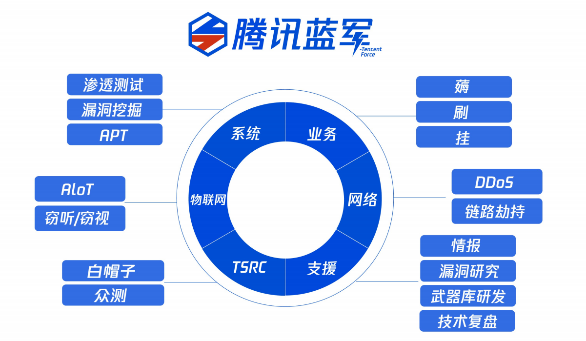
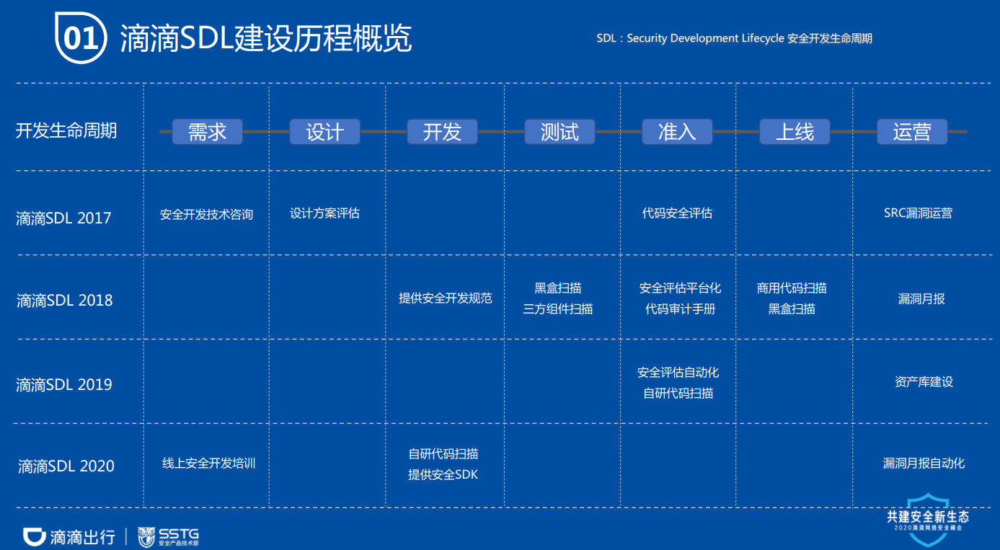
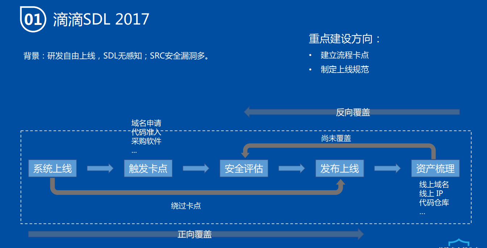
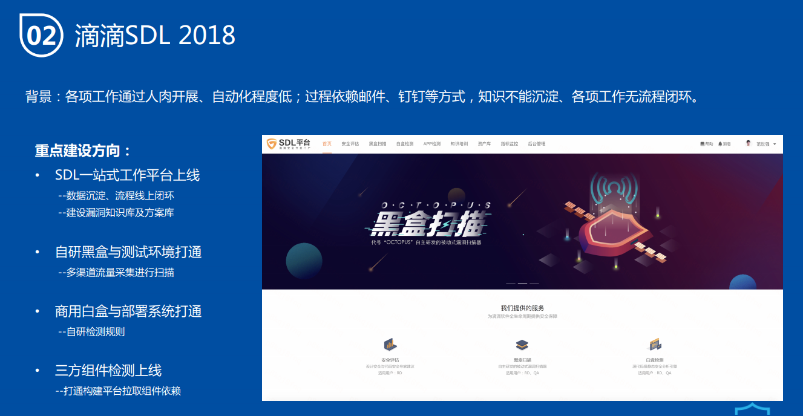
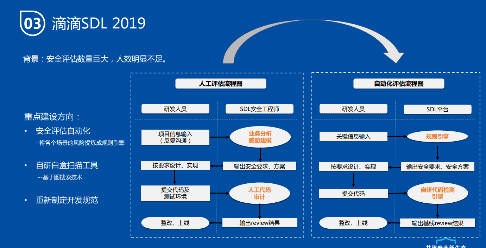
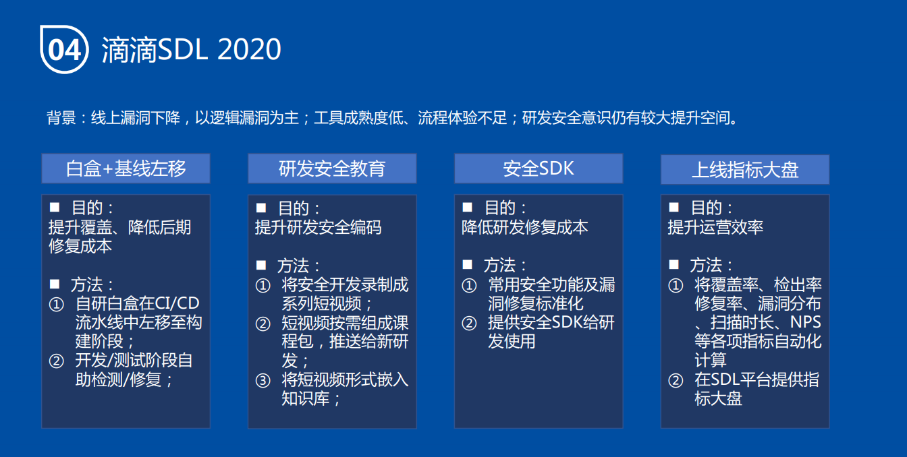
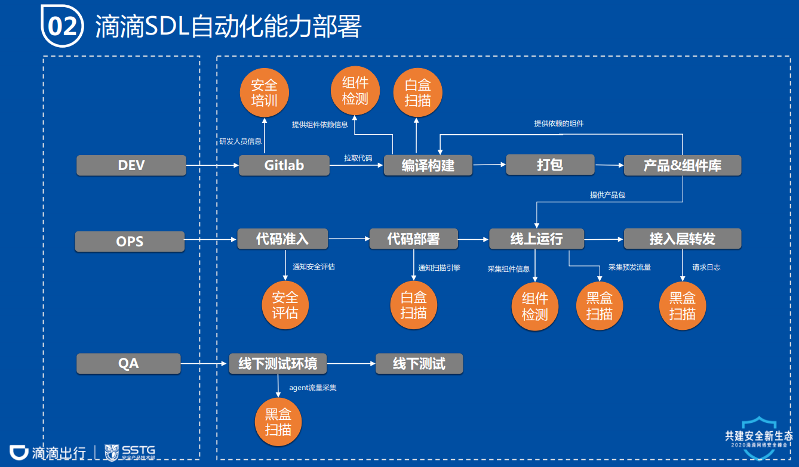

# 外部安全攻防组织调研

## 阿里web类安全部门
主要业务：内部web系统的安全测评。

主要检测方式有3种：

### 源代码检测（白盒）
- 应用阶段：代码发布。
- 应用位置：代码发布平台。
- 是否自动化：自动化。
- 基本情况：使用自研的代码静态安全分析引擎进行分析，类似checkmax，但比checkmax专业高效（checkmax不是专门的安全工具）。

### 结合型检测（灰盒）
- 应用阶段：系统预发布。
- 应用位置：系统预发布平台。
- 是否自动化：自动化。
- 基本情况：web系统标记为预发布状态时，通过自研的动、静态代码测试及Fuzz引擎进行自动化灰盒测试。。

### 渗透型检测（黑盒）
- 应用阶段：系统上线。
- 应用位置：生产环境。
- 是否自动化：自动化。
- 基本情况：web系统进入生产环境后，运维会将可用的测试账号建立好，提交给黑盒测试引擎（自研），之后黑盒测试引擎启动自动测试过程（渗透测试）。

## 腾讯蓝军

### 主要业务
- 以攻促防；
- 检验安全态势和防护水平（解决现状不清，效果无法量化的问题）；
- 挖掘风险盲点和攻击场景（解决策略缺漏、场景认知不全的问题）；
- 还原攻击现场，提升认知（解决对抗战场不断升级的问题）。

### 工作方向
- 点：增加攻防技术点的广度，提高单点对抗与绕过能力(依照ATT&CK矩阵)。
- 线：执行完整攻击演习，加强隐蔽性、躲避检测。
- 面：探索更多攻击面、风险盲点，举一反三。
- 使用ATT&CK模型建立攻防场景地图、衔接测试环境与真实环境、构建完整的攻击链路和关联告警，- 严格风险控制；不断实现对抗、建设、复盘提升。
- 检测自动化。
- 开展红蓝对抗，"攻击目标趋于具象化，贴近真实业务，甚至应用APT攻击目标。

### 业务类型
- 内部系统安全测评（包括渗透测试、漏洞挖掘、APT研究）
- 业务安全（防止薅羊毛、刷单、挂马）
- 网络安全（防DDoS和链路劫持）
- 应急响应（威胁情报、漏洞研究、武器库开发、技术复盘）
- 召集白帽子和组织安全众测
- 物联网安全：反窃听反监视

### 业务指标
- 入侵发现率
- 攻击场景发现率
- 攻击覆盖度
- 演习频次
- 安全风险数
- 策略缺陷数
- 效率提升
- 攻击成本
- 目标达成率。

### 红蓝对抗实践

- "第一要素：战术思路、执行规范，行动计划，如：
  - 禁止扫描、Web RCE类漏洞利用
  - 禁止在目标环境使用公开攻击工具
  - 清理痕迹、后门，手法暴露后要及时更换
- APT手法：合法用户身份（IT、Web、IDC）
- 技术手法灵活运用：钓鱼、水坑
- 从漏洞利用对抗，到用户行为分析对抗，绕过安全系统
- 代码能力，全栈业务能力（逆向、密码学）"

## 滴滴SDL建设

### 关于如何做好SDL的几个观点
- 一开始不要研究多么牛逼的技术和工具，先把覆盖率搞上去。
- 做好资产建设，资产不清楚是很多问题的根源。
- 工具不在多、技术不需要多牛，对标问题是关键。
- 建立有效的指标评价体系，保证运营的有效性。
- 做好漏洞和事件的持续复盘、改进，发生事件不一定是坏事。
- 技术栈的复杂度、代码来源的多样性、互联网业务高频迭代给SDL带来了极大的挑战，把漏洞不是唯一的手段，
- 也要多依赖安全培训、网络隔离、内外部蓝军、白帽子等其他手段。

### 滴滴sdl现状

### 滴滴sdl未来
- 降发生：
  - 逻辑漏洞检测自动化
  - 工具链+资产库打通
- ...
- 安全感：
  - Devsecops体系建设
  - 赋能研发提升效率体验
  - ...

