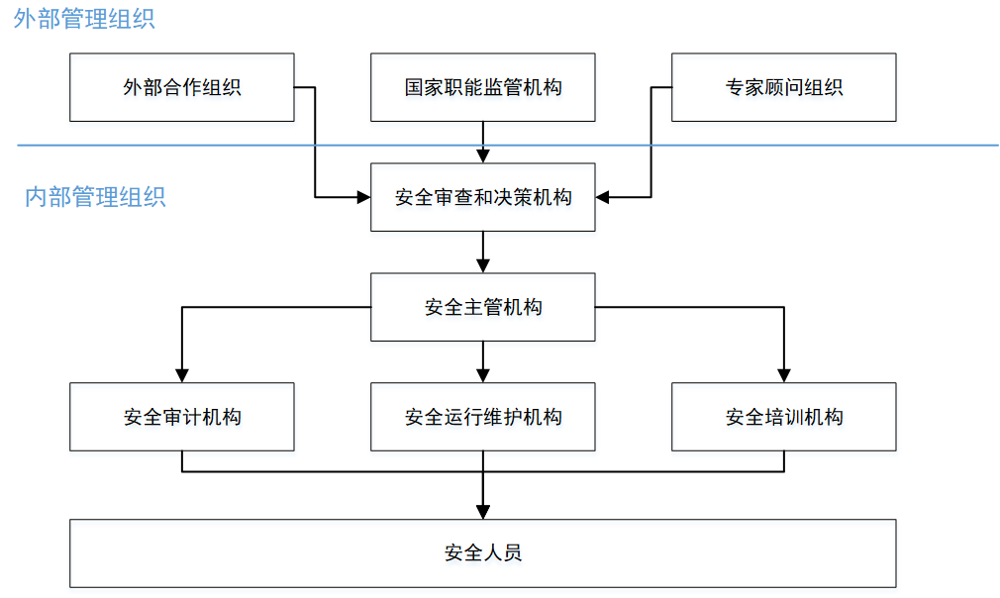

# 安全机构

## 安全管理组织

《网络安全法》规定要设置专门的安全管理机构和安全管理负责人。

## 案例

### 腾讯安全团队

- 公司最高层：安全管理委员会，马化腾任主席。

- 管理层：安全管理部，集团层面整体安全策略指定与执行
- 执行层面：安全平台部，集团层面安全技术团队，为所有产品线、客户提供服务。
- 技术研究与攻防体系搭建： 腾讯安全9大安全实验室
- 业务部门中的安全团队
- 各安全产品部门

