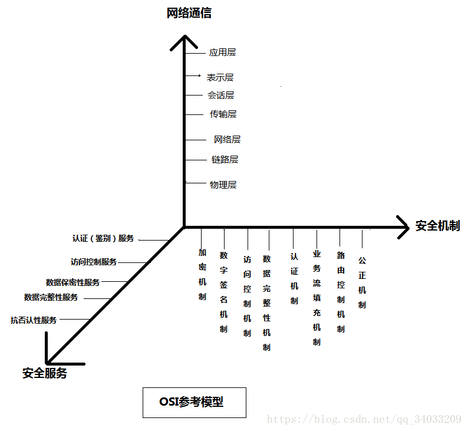
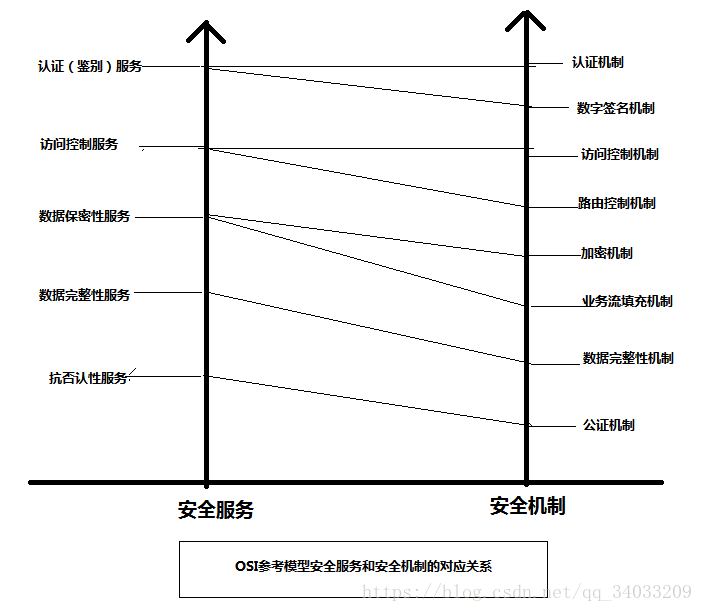
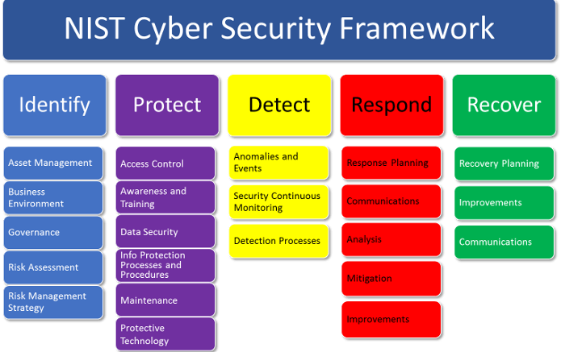

# 企业安全框架概述

## 全局性框架

### NIST SP-800-53 信息系统和组织的安全和隐私控制

这个框架是全局性的、NIST旗舰性质的，2020.9.第5版发布。该框架旨在开发第一个全面的安全和隐私控制目录，可用于管理任何部门和规模的风险，以及从超级计算到工业控制系统到物联网设备的所有类型的系统风险。这些控制措施提供了一种积极主动和系统性的方法，以确保关键的系统、组件、服务具有足够的可信度，并具备必要的恢复力，以维护美国的经济和国家安全利益。

### ISO 安全体系结构
OSI安全体系包括结构包括五类安全服务以及八类安全机制。

五类安全服务：
- 认证、鉴别服务
- 访问控制服务
- 数据保密性服务
- 数据完整性服务
- 抗否认性服务

八种安全机制：
- 加密机制
- 数字签名机制
- 访问控制机制
- 数据完整性机制
- 认证机制
- 业务流填充机制
- 路由控制机制
- 公正机制

除了上述机制，还有5种通用安全机制：
- 可信功能模块（可信软硬件系统部件）
- 安全标记
- 事件检测
- 安全审计跟踪
- 安全恢复

安全机制是对安全服务的详尽补充。

### 信息安全技术安全保障框架 GB/T 29830 系列

### NIST Cyberspace Security Framework（ CSF )
https://www.nist.gov/cyberframework

- 目标：指导企业、机构进行信息安全建设，具有通用性。

- 组成：IPDRR

- 识别
- 保护
- 检测
- 响应
- 恢复

- 优势

此框架能灵活应用到各行各业，它可以检测并响应新兴市场中出现的新威胁，包括勒索软件，IoT入侵和其他新型恶意软件。由于风险管理是一个持续的过程，包括了风险识别，风险评估和应对风险的措施，该框架建议企业必须了解风险事件发生的可能性及其发生后的影响，以此实现更好地管理风险的目标。这样，企业能够确定可接受的服务风险级别，即表现为企业风险承受能力。理解自己的风险承受能力让企业提高网络安全措施的优先级。该框架对不同行业表现出适应性的特点是极为重要的，企业需要对各种风险及时响应。

## 威胁建模与辅助

### MITRE ATT&CK

https://attack.mitre.org/

MITRE ATT&CK is a globally-accessible knowledge base of adversary tactics and techniques based on real-world observations. The ATT&CK knowledge base is used as a foundation for the development of specific threat models and methodologies in the private sector, in government, and in the cybersecurity product and service community.

With the creation of ATT&CK, MITRE is fulfilling its mission to solve problems for a safer world — by bringing communities together to develop more effective cybersecurity. ATT&CK is open and available to any person or organization for use at no charge.

### 安全威胁情报共享框架OpenIOC
- 目标：应对更加复杂的攻击（如APT），便捷地分享、交流安全情报，辅助解决目标攻击检测、响应和防止等问题。

## 信息安全管理

### ISO/IEC 27001 GB/T 22080:2008  信息安全管理要求

## 评估框架

### TCSEC 

Trusted Computer System Evaluation Criteria

TCSEC标准是计算机系统安全评估的第一个正式标准，具有划时代的意义。该准则于1970年由美国国防科学委员会提出，并于1985年12月由美国国防部公布。TCSEC最初只是军用标准，后来延至民用领域。TCSEC将计算机系统的安全划分为4个等级、7个级别。

#### D类安全等级
D类安全等级只包括D1一个级别。D1的安全等级最低。D1系统只为文件和用户提供安全保护。D1系统最普通的形式是本地操作系统，或者是一个完全没有保护的网络。
#### C类安全等级
该类安全等级能够提供审计的保护，并为用户的行动和责任提供审计能力。C类安全等级可划分为C1和C2两类。

##### C1

C1系统的可信任运算基础体制（Trusted Computing Base，TCB）通过将用户和数据分开来达到安全的目的。在C1系统中，所有的用户以同样的灵敏度来处理数据，即用户认为C1系统中的所有文档都具有相同的机密性。
##### C2
C2系统比C1系统加强了可调的审慎控制。在连接到网络上时，C2系统的用户分别对各自的行为负责。C2系统通过登陆过程、安全事件和资源隔离来增强这种控制。C2系统具有C1系统中所有的安全性特征。
### B类安全等级

B类安全等级可分为B1、B2和B3三类。B类系统具有强制性保护功能。强制性保护意味着如果用户没有与安全等级相连，系统就不会让用户存取对象。

B1系统满足下列要求：系统对网络控制下的每个对象都进行灵敏度标记；系统使用灵敏度标记作为所有强迫访问控制的基础；系统在把导入的、非标记的对象放入系统前标记它们；灵敏度标记必须准确地表示其所联系的对象的安全级别;当系统管理员创建系统或者增加新的通信通道或I/O设备时，管理员必须指定每个通信通道和I/O设备是单级还是多级，并且管理员只能手工改变指定;单级设备并不保持传输信息的灵敏度级别;所有直接面向用户位置的输出（无论是虚拟的还是物理的）都必须产生标记来指示关于输出对象的灵敏度;系统必须使用用户的口令或证明来决定用户的安全访问级别;系统必须通过审计来记录未授权访问的企图。

B2系统必须满足B1系统的所有要求。另外，B2系统的管理员必须使用一个明确的、文档化的安全策略模式作为系统的可信任运算基础体制。B2系统必须满足下列要求：系统必须立即通知系统中的每一个用户所有与之相关的网络连接的改变；只有用户能够在可信任通信路径中进行初始化通信；可信任运算基础体制能够支持独立的操作者和管理员。

B3系统必须符合B2系统的所有安全需求。B3系统具有很强的监视委托管理访问能力和抗干扰能力。B3系统必须设有安全管理员。B3系统应满足以下要求:除了控制对个别对象的访问外，

B3必须产生一个可读的安全列表；每个被命名的对象提供对该对象没有访问权的用户列表说明;B3系统在进行任何操作前，要求用户进行身份验证；B3系统验证每个用户，同时还会发送一个取消访问的审计跟踪消息；设计者必须正确区分可信任的通信路径和其他路径；可信任的通信基础体制为每一个被命名的对象建立安全审计跟踪；可信任的运算基础体制支持独立的安全管理。
### A类安全等级
A系统的安全级别最高。A类安全等级只包含A1一个安全类别。A1类与B3类相似，对系统的结构和策略不作特别要求。A1系统的显著特征是，系统的设计者必须按照一个正式的设计规范来分析系统。对系统分析后，设计者必须运用核对技术来确保系统符合设计规范。A1系统必须满足下列要求：系统管理员必须从开发者那里接收到一个安全策略的正式模型;所有的安装操作都必须由系统管理员进行；系统管理员进行的每一步安装操作都必须有正式文档。

这信息安全保障阶段，欧洲四国（英、法、德、荷）提出了评价满足保密性、完整性、可用性要求的信息技术安全评价准则（ITSEC）后，美国又联合以上诸国和加拿大，并会同国际标准化组织（ISO）共同提出信息技术安全评价的通用准则（CC for ITSEC），CC已经被五技术发达的国家承认为代替TCSEC的评价安全信息系统的标准。CC已经被采纳为国家标准ISO 15408。

## References
https://www.freebuf.com/column/176887.html
https://www.freebuf.com/column/176243.html
https://www.freebuf.com/column/227993.html
https://www.freebuf.com/articles/es/205919.html