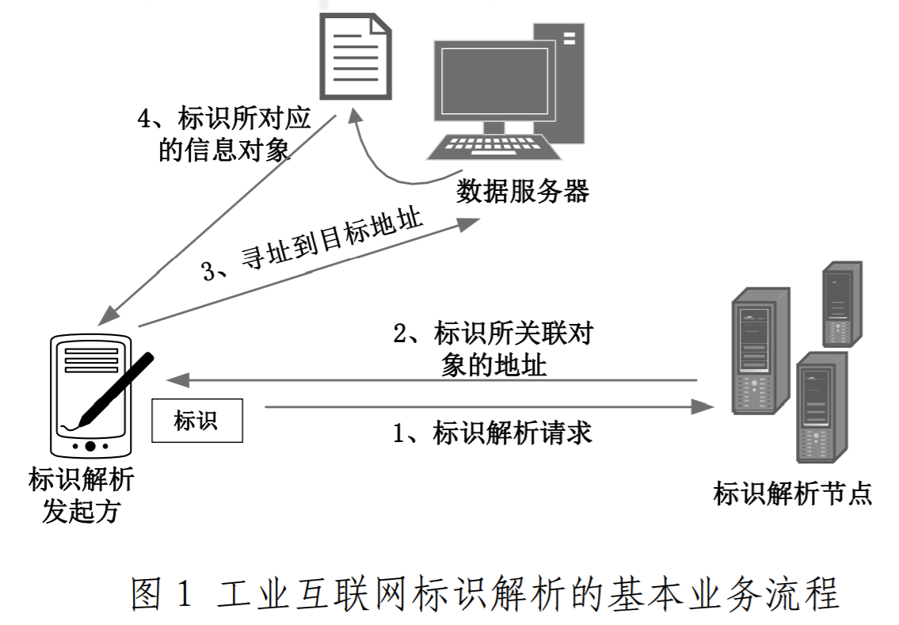
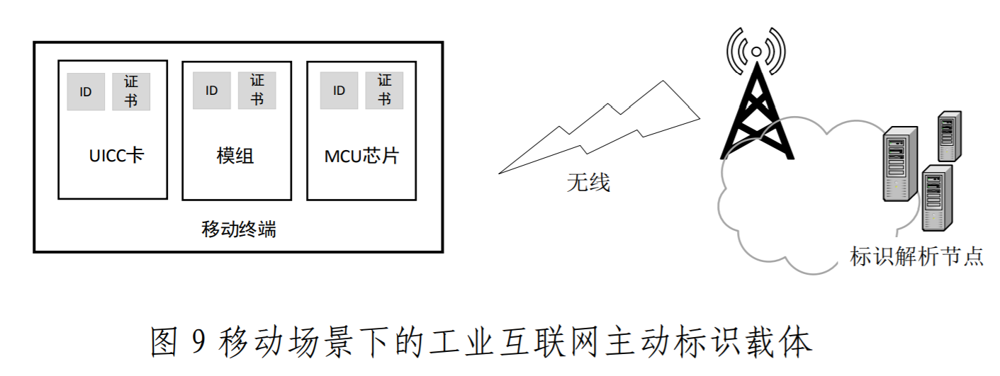
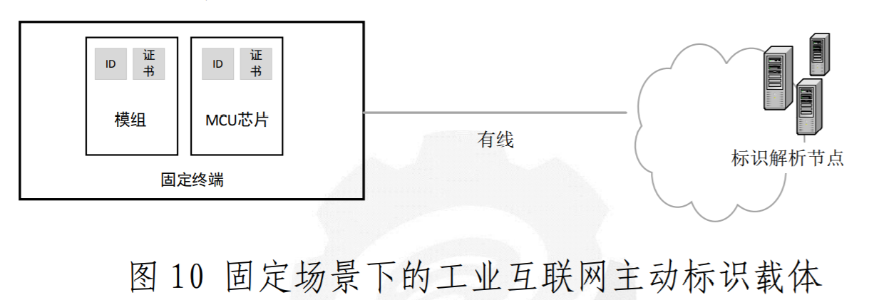
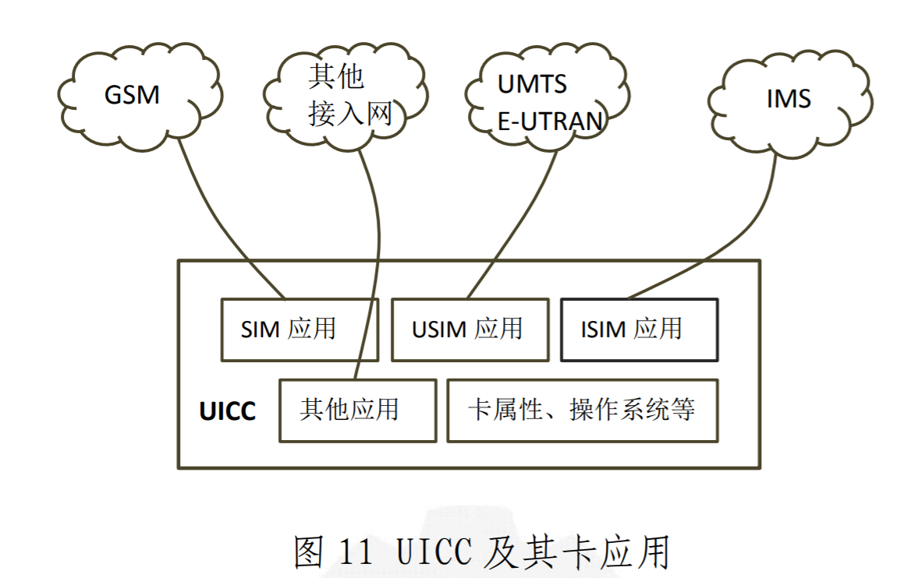
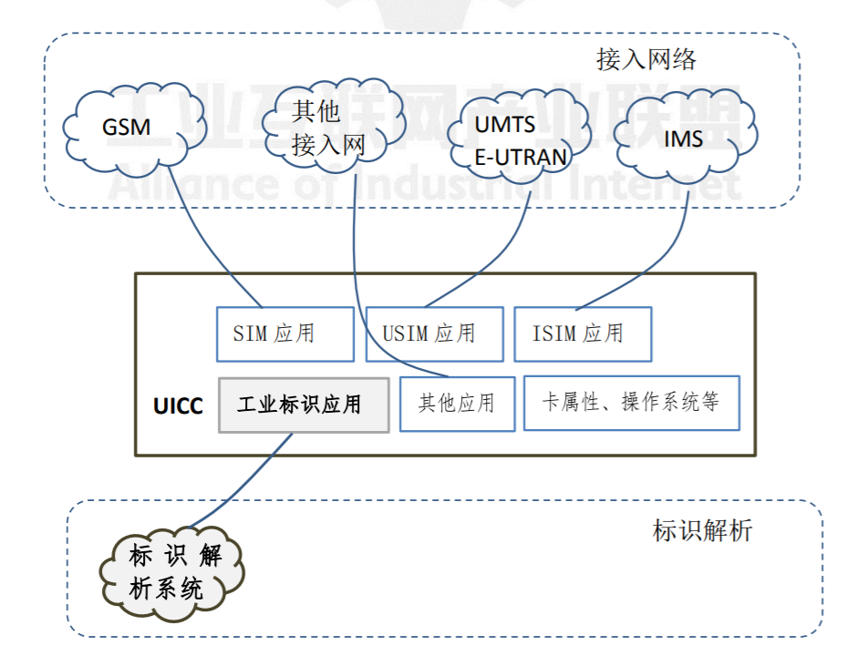
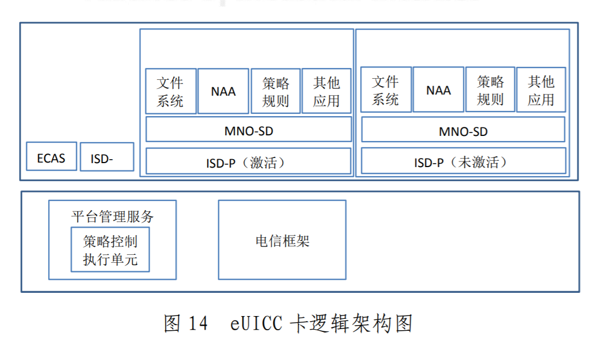

# 工业互联网标识解析体系

工业互联网标识解析体系是工业互联网网络架构重要的组成部分，既是支撑工业互联网网络互联互通的基础设施，也是实现工业互联网数据共享共用的核心关键。

## 背景
- 2017 年 11 月 27 日，国务院印发了《关于深化“互联网+先进制造业”发展工业互联网的指导意见》，将“推进标识解析体系建设”列为主要任务之一。
- 2018 年，工业和信息化部发布了《工业互联网发展行动计划（2018-2020 年）》，提出“标识解析体系构建行动”。2019 年，中央经济工作会议提出“要发挥投资关键作用，加大制造业技术改造和设备更新，加快 5G 商用步伐，加强人工智能、工业互联网、物联网等新型基础设施建设”。
- 目前，构建工业互联网标识解析体系，打造高效、安全、稳定的新型基础设施，开拓网络空间标识应用体系的各项工作正在进入发展快车道。
- 产业界和学术界针对工业互联网标识解析技术的创新探索正在逐步展开，降低工业互联网标识应用推广技术成本、挖掘其核心商业价值，已经成为重点探索方向之一。

## 基本概念
- 工业互联网标识编码是指能够唯一识别机器、产品等物理资源以及算法、工序等虚拟资源的身份符号。
- 工业互联网标识解析是指能够根据标识编码查询目标对象网络位置或者相关信息的系统装置，对机器和物品进行唯一性的定位和信息查询，是实现全球供应链系统和企业生产系统的精准对接、产品全生命周期管理和智能化服务的前提和基础。工业互联网标识解析的基本业务流程如图 1 所示。

>互联网域名解析与工业互联网标识解析的概念辨析
>互联网域名解析主要发生在应用服务体系（万维网/Web）和互联体系 (TCP/IP)之间，主要用于解决域名到 IP 地址的翻译问题。
>工业互联网中，标识是赋予每一个产品、零部件、机器设备唯一的“身份证”，解析是通过产品标识查询存储产品信息的服
务器地址，或直接查询产品相关信息及其他服务。
>工业互联网标识解析主要发生在应用支撑体系（万维网、应用协议）和网络互联体系之间，**主要用于解决标识到标识、标识到地址、标识到数据的映射和转换问题**。

- 标识载体，就是指承载标识编码资源的标签。根据标识载体是否能够主动与标识数据读写设备、标识解析服务节点、标识数据应用平台等发生通信交互，可以将标识载体分为主动标识载体和被动标识载体两类。

- 主动标识载体，一般是指可以嵌入在工业设备的内部，承载工业互联网标识编码及其必要的安全证书、算法和密钥，具备联网通信功能，能够主动向标识解析服务节点或标识数据应用平台等发起连接，而无需借助标识读写设备来触发。如图 2 所示，UICC、通信模组、MCU 等都是主动标识载体的例子。

> 主动标识载体的主要特征有：
> - 嵌入在工业设备内部，不容易被盗取或者误安装；
> - 具备网络连接能力，能够主动向标识解析服务器发起标识解析请求；同时也支持被其承载的标识及其相关信息的远程增删改查；
> - 除了承载工业标识符，还具有安全区域存储必要的证书、算法和密钥，能够提供工业标识符及其相关数据的加密传输、能够支持接入认证等可信相关功能。
> 将通用集成电路卡、芯片、模组、终端等信息通信技术引入工业互联网标识载体，有利于工业互联网标识相关产品的规模化、标准化和低成本化，进而有利于工业企业供应链管理、生产流程管理、产品生命周期管理等核心能力升级。

- 被动标识载体，一般是附着在工业设备或者产品的表面以方便读卡器读取。在工业互联网中，被动标识载体一般只承载工业互联网标识编码，而远程网络连接能力缺乏（某些被动标识载体，如 RFID、NFC，只具备短距离网络连接能力），需要依赖标识读写器才能向标识解析服务器发起标识解析请求。如图 3 所示，常见的被动标识载体有一维条形码、二维条形码、RFID、NFC 等。

>被动标识载体的主要特征有：
>- 一般附着在工业设备/耗材表面，标识信息易被读取、被复制、被盗用和被误用；
>- 网络连接能力受限，需要借助读写器向标识解析服务器发起标识解析请求；
>- 安全能力较弱，缺乏证书、算法和密钥等所需的必要安全能力（如安全存储区）；
>- 成本低，适用于承载低价值、数量大的工业单品标识。

> 二维码技术是在二维的平面空间里进行标识编码信息存储的方式，属于标识载体技术。二维码本身并不是某一种特定的标识编码方案，相反，二维码里可以存储很多种不同标识编码方案。
> 打个形象的比方，二维码就是可存写标识编码的“图形化 USB”。

## 标识载体关键技术及演进趋势

### 被动标识载体关键技术

被动标识载体技术，包括但不局限于一维条形码、二维条形码、RFID、NFC 等。

#### 一维条形码
一维条形码只在一个方向（一般是水平方向）表达信息，而在垂直方向则不表达任何信息，由黑白相间的条纹组成的图案，黑色部分称为“条”，白色部分称为“空”，“条”
和“空”代表二进制的 1 和 0，对其进行编码，从而可以组合不同粗细间隔的黑白图案，可以代表数字、字符和符号信息，反应某种信息。

常用的一维条形码有：UCC/EAN-128 条码、ITF-14 条码、EAN/UPC 条码，

- EAN/UPC 条码(包括 EAN-13、EAN-8、UPC-A和 UPC-E):用于对零售渠道销售的贸易项标识；同时也可用于标识非零售的贸易项目。
- ITF-14 条码 只能用于标识非零售的商品UCC/EAN-128 条码用于标识物流单元，不能用于POS 零售结算。
- UCC/EAN-128 条码用于标识物流单元，不能用于POS 零售结算。

特点：
- 一维条形码的应用可以提高信息录入速度、减少差错率；
- 一维条形码也存在容量较小（只有 30 个字节左右）、内容只能包含字母和数字、遭到损坏后不能阅读等缺陷。

彩虹码作为一种“升级”的码制，在国际通用 GS1 商品条码符号的基础上，增添了蓝绿两种颜色维度，可承载额外的信息。

#### 二维条形码

二维条形码是在一维条形码技术的基础上衍生而来的，在水平和垂直方向的二维空间存储信息的条形码，既记录横向信息也记录纵向信息，也是按照“0”和“1”的比特流原
理进行设计。二维条形码技术已广泛应用在国防、公共安全、交通运输、医疗保健、工业、商业等领域。目前，在支付领域应用最多。

特点：
- 二维条形码是较为经济、实用的一种自动识别技术
- 具备一维条形码的优点（提高信息录入速度、减少差错率）；
- 还具有信息容量大
- 信息密度高
- 纠错功能
- 可表示各种多媒体信息及多种文字信息
- 译码可靠性高
- 保密防伪性强等特点。

国内外常见的二维条形码包括 PDF417、QR 码、Data Matrix 码、Maxi Code 码等。从技术角度分类可以分为行排式二维条形码和矩阵式二维条形码两种类型。
- 有代表性的行排式二维条码有：PDF417、Code 16K、Code 49 等。
- 矩阵式二维条形码是平常见得最多的二维条形码，有代表性的矩阵式二维条形码
有：Maxi Code、QR Code、 Data Matrix、Aztec Code 等。

#### 射频识别

射频识别（RFID），是一种非接触式的自动识别技术，可通过无线电讯号识别特定目标对象并读写相关数据，而无需识别系统与特定目标之间建立机械或光学接触，适用于各种恶劣环境。

特点：
- 是条形码技术的进一步延拓；
- 可识别高速运动物体并可同时识别多个标签，操作快捷方便。
- 目前广泛应用于多个领域，典型的应用包括仓库物流、防伪识别、智能交通、身份识别、食品安全溯源等。

#### 近场通信
近场通信（NFC)，又称近距离无线通信，是一种短距离的高频无线通信技术，允许电子设备之间进行非接触式点对点数据传输（在 10cm 内）交换数据，主要用于手持设备的短距离数据通信，其通信方式如图 8 所示。它由非接触式射频识别（RFID）演变而来，并向下兼容 RFID。NFC 与 RFID 看似相似，但其实有很多区别，因为 RFID 本质上属于识别技术，而 NFC 属于通信技术。

NFC 的三个特点：
- 安全性，相比蓝牙或 WiFi 这些远距离通信连接协议，NFC 是一种短距离通信技术，设备必须靠得很近，从而提高数据传输过程的安全性；
- 连接快、功耗低，相比蓝牙连接速度更快，功耗更低，支持无电读取。NFC 设备之间采取自动连接，无需执行手动配置，只需晃动一下，就能迅速与可信设备建立连接；
- 私密性好，在可信的身份验证框架内，NFC 技术为设备之间的信息交换、数据共享提供安全。
- NFC 成本不高，但是隐形成本很大虽然说 NFC 芯片成本可能真的只要 20 块人民币，但是要打通手机 NFC 的各项关键节点需要投入很大的资金。
- 安装 NFC 可能需要重新设计手机 

### 主动标识载体关键技术

在移动场景下，移动终端可承载主动标识编码。工业互联网标识编码及其相关信息（如证书、密钥、算法等）可以保存在移动终端的部件中。以下三种移动终端部件可作为工业互联网主动标识载体，如图 9 所示：
- UICC 通用集成电路卡
- 移动通信模组
- MCU 芯片

在固定场景下，固定终端可承载主动标识编码。工业互联网标识编码及其相关信息（如证书、密钥、算法等）可以保存在固定终端的部件中。以下两种固定终端部件可作为工业互联网主动标识载体，如图 10 所示：
- 通信模组
- MCU 芯片

#### 通用集成电路卡

通用集成电路卡（UICC），是在全球移动通信系统中使用的智能卡，主要用于存储用户信息、鉴权密钥、短消息、付费方式等信息，还可以包括多种逻辑应用，例如用户标识模块（SIM）、通用用户标识模块（USIM）、IP 多媒体业务标识模块（ISIM）、以及其他如电子签名认证、电子钱包等非电信应用模块。UICC 中的逻辑应用可以单独存在，也可以多个同时存在。不同移动用户终端可以根据无线接入网络的类型，来选择使用相应的逻辑模块。

UICC 相关标准主要由 ISO/IEC、3GPP、ETSI、GSMA 等组织制定。

- ISO/IEC 7816-1（1987）、ISO/IEC 7816-2（1988）分别定义了标识集成电路卡的物理特性、物理尺寸和触点位置，关注智能卡的物理电气层面，是 UICC 标准的规范性引用文件之一；
- ETSI UICC 系列标准主要关注 UICC 与终端的接口，包括UICC 应用可编程接口、UICC 终端接口、卡应用工具包一致性、SIM 应用工具包等；
- 3GPP 制定 SIM、USIM 以及智能卡测试规范、终端与SIM/USIM 的测试规范等；
- GSMA 主要制定 eUICC 及其管理平台的规范；
- ITU-T 制定了 UICC 可承载的全球移动用户编码 IMSI、MSISND（即电话号码）等编码规范等。

考虑到工业互联网（面向企业，如野外监控设备）和消费互联网（面向消费者，如手环）的需求，目前 UICC 正朝着eUICC 的方向发展，不可插拔的 eUICC 更加适合于在工业环境下使用，eUICC 能满足更宽泛的不同等级的工作温度、湿度、持续工作时间的需求，在物理可靠性、功耗和尺寸等方面性能优于传统插拔式 UICC 卡，同时远程写卡应用的能力也更加适合于工业业务流程与运营商卡流程融合，具有支持丰富商业场景的条件。eUICC 卡逻辑架构图如图 14 所示。

- 国际标准组织 ETSI 率先面向物联网领域提出了 M2M eUICC 的概念，eUICC 即嵌入式卡，可为贴片式（SMD）或直接封装于通信模块中（SIP），主要特征是物理形态上由传统的可插拔式变为内嵌式，具有与终端不可分离的特性。
- GSMA 在原 eUICC 的物理特性基础上，又提出了“可自由切换卡文件”的定义，补充并丰富了 eUICC 的软件特性，即 eSIM 技术。GSMA 面向物联网 M2M 领域和消费电子 Consumer 领域分别制定了 eSIM 架构规范、技术和测试规范，定义了 eSIM 框架结构、传输协议和接口、消息构成及远程管理流程和方式。
- 此外，GSMA 正在制定安全认证规范 SGP.25、测试证书规范SGP.26。eUICC 卡会下载来自不同远程管理平台提供的Profile 数据包，这就对 eUICC 卡数据兼容性提出了较高的要求，SIMAlliance 负责制定 eUICC Profile 的下载、安装等相关技术要求和测试规范，验证 Profile 数据是否能够被正确的解析并加载到 eUICC 上，提升 eUICC 卡数据兼容性和互联互通性能。

eSIM 技术有多种实现方式，eUICC 是其中较为常见且标准化方案相对完善的一种。除 eUICC 外，eSIM 还可以通过TEE、eSE 和 iUICC 等方式实现：
- TEE（Trusted Execution Environment）是指利用终端可信执行环境，使用特定软件调用 eSIM 数据，这种方案成本较低，安全性不高。考虑其成本优势，可应用在一些对安全性要求不高的物联网终端设备中。
- eSE（embedded Security Element）是指利用通用安全芯片实现 eSIM 功能，安全级别较高，成本也很高，可应用在金融支付等对安全级别要求较高的场景；
- iUICC（integrated UICC）一体式通用集成电路卡是一种 SoC 解决方案，直接将 SIM 卡封装入通信模块，安全处理器内核与其他内核直接集成在一起，安全性高，成本也相应较高；
- Soft SIM 是指采用纯软件方案实现 eSIM 功能，没有实际的物理安全芯片作为依托，容易部署，但易受到攻击，安全级别非常低。

总体来看，随着工业互联网标识解析体系的建设和发展，以 UICC/eUICC 卡作为工业互联网标识及其相关保密数据（包括证书、密钥、算法）的载体更适合工业互联网终端接入工业互联网标识解析系统以及工业互联网应用，具有广阔发展前景，其自身的原有标识 ICCID/EID 也具有较高的利用价值。

