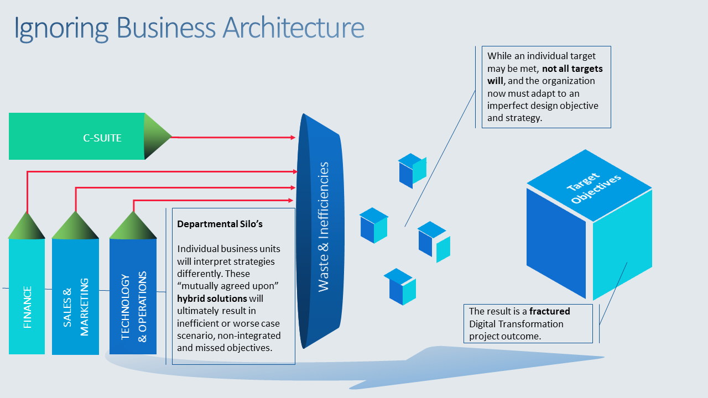
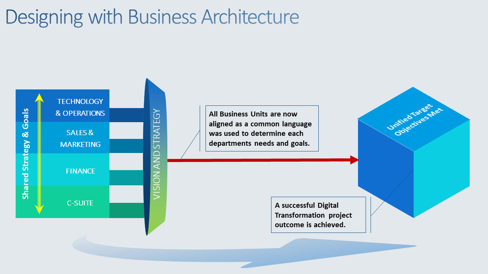

# 架构设计

## 领域建模

领域建模的根本目的就是统一认识、减少沟通成本。有两个层面的含义：一是工程技术规范、二是业务认识。

无论如何，领域建模一定要找到业务的流程节点，找到业务流程节点就成功了一半。

谈建模一定要限定范围。

模是业务场景的映射，不懂业务无法建模。

任何业务都存在一条稳定的业务流程。

业务流程中流程节点的产物就是业务骨架。

领域建模的方法步骤：
- 找出业务主流程；不管怎么讲，任何业务都有一套稳定的业务流程。
- 细分业务主流程：在主流程基础上继续分析子流程，主流程能让我们知道整体的业务流程，但还有些细节流程是在子流程中，有哪些关键属性？关键领域对象? 对象关联?
- 抽象: 从第二步中，我们得到更多具体对象，但此时要进行合并整理，并不是直接加到券模板或者优惠券实例关联部分上，这个过程是不断打磨的过程。

上面就是领域建模的三步方法：找出业务主流程、细分业务主流程、抽象。没有任何高深的理论、简单朴素的方法，至于为什么觉得简单，是因为前期铺垫唤醒了你之前的经历，再去做相似的事就会觉得有熟悉感。

## 业务架构

### 什么是业务架构？

企业架构和业务架构是互补的术语，有时甚至可以互换使用。然而，业务架构是企业架构中的一个关键（可能是关键）领域。业务架构提供了链接和对齐其余域的基础或锚点。

业务架构提供组织业务的整体蓝图，涵盖战略和运营两个方面。而企业架构提供了所有域的总体视图，包括其他域如何与业务架构保持一致。

企业架构通过应用原则和实践来指导组织完成所有其他架构域的集成和互操作，从而代表战略开发和执行的整体规划、分析、设计和实施。

业务架构代表能力、端到端价值交付、信息和组织结构的整体、多维业务视图；以及这些业务观点和战略、产品、政策、倡议和利益相关者之间的关系。

简而言之，我们将业务架构整体视为**企业运营方式的明确蓝图**。该蓝图使利益相关者在组织内就部门目标、目标、战略和战术如何支持和促进整体组织、目标、战略和计划达成共识。该蓝图还涉及企业的业务流程、治理结构和业务信息。因此，业务架构的主要重点是运营、激励和分析框架，所有这些框架都将通过企业链接在一起。

简而言之，业务架构将节省资源和时间。让我们来看看一些真实的场景： 政府机构使用 BA 寻求引入客户自助服务愿景，该愿景将被确立为一项新举措。考虑到潜在的收购，一家制药公司将利用 BA 来加快大规模合并。看到这一点，一家国际航空公司遵循同样的流程。一家全球金融公司将引入 BA 以使其企业运营与组织的新业务模式保持一致。一家大型金融机构面临着极其复杂的合并后投资组合，使用 BA 来有效简化合并流程并确定重叠领域。

不使用业务架构时：

使用业务架构：

业务架构是一个整体性的视角，它描述业务做什么What？如何交付利益相关者价值？如何沟通，以及如何组织的？换言之，业务架构是使用标准化视图对业务进行的抽象，它改进了各种计划和执行计划的结果。这些标准化视图包括一些核心元素：

能力 Capabilities：企业做什么？
信息 Information：使用什么词汇？
组织 Organization：企业如何组织？
价值流 Value Streams：企业如何向关键利益相关者提供价值？

四个核心元素作为业务架构的基础，如果再加上扩展的几个元素，将为业务提供了更大的洞察力，包括：

战略 Strategies：企业应如何竞争和发展？
政策 Policies：什么决定了战略、投资和行动？
利益相关者 Stakeholders：谁是内部和外部参与者？
举措 Initiatives：如何实现目标和目的？
产品 Products：为客户提供什么？
度量 Metrics：业务表现如何？
### 业务架构的组成

业务架构由组件组成，其中记录了：

- 商业动机（由愿景、目标、目的、使命、战略和计划定义）
- 商业产品和服务
- 业务组织结构、角色和地点
- 业务利益相关者（例如合作伙伴、供应商、监管机构和客户）
- 业务能力和流程
- 业务信息对象（高级对象：即客户信息、产品信息、客户销售）

这些组件有助于定义业务架构域，而业务架构域反过来又有助于向企业架构中的其他域提供与业务一致的技术治理。

### 业务架构的价值主张

您现在应该熟悉支持采用业务架构需求的一些战略要务和关键驱动因素。正是在这个阶段，需要建立一个价值主张，说明为什么需要向主要利益相关者展示业务架构的需求。一个引人注目的价值主张对于获得高层领导的支持至关重要。

Let us examine a few tips to get the wheels in motion:

#### 将战略和执行连接起来

- 定义哪些战略支柱将被哪些能力所支持？
- 识别和指定关键性能指标；这些治标将被评估和监测。
- 确定资金能够对齐所有核心能力（的需求）。

#### 对业务企业的360°视角进行简化
- 定义一个包含业务能力、数据、流程、资源和动机的综合的、连贯的视图。
- 确保所有人都能理解连通信（互联性），用于包括任何重叠的和协同的作用（ overlaps and synergies）

#### 开发通用语言

- 确保在业务和IT的可操作的框架中使用通用语言；
- 在整个组织中传达这一点，尤其是在缺乏业务和技术交流的地方。

#### 确保业务和IT孤岛的崩溃

- 从长远看来，由于概念化（设计）、构建和管理等能力的不同（The vary nature of conceptualizing, building and managing capabilities over the long-term ），将使关注点从寻找副业预算的孤立开发项目上移开（will pull the focus away from siloed developments looking for sideline budgets.）
  - 意思就是孤立的、边缘的项目总要被遗弃；
- 随着时间推移，战略要务将与运营（包括IT)策略携手并进。
  - 意思是，战略和运营不能差距过大，最好有机结合。

### 制作业务案例，向高层展示业务架构

看到你给出的价值主张是一件事，而定量定性的交付价值主张是另一件事。这需要时间准备。使用与业务架构相关的战略药物和业务/it 驱动因素列表是一个很好的起点。

在这里，您可以开始构建使用业务架构时的潜在结果列表，以及它们将如何在短期、中期和长期为企业带来收益。这些都必须在数量和质量上得到反映。

公平地说，向高级领导层推销这种做法本身既是一门艺术，也是一门科学。这不仅仅是关于清单有多长或问题和考虑因素的相关性，更重要的是，它还涉及你将如何生动地、如果需要的话，用鲜明的方式讲述原因和方式的故事。不要过分悲观和郁闷（doom and gloom），重点是保持在积极的方面足够重要，以便更好地构图。

### 业务架构中的框架很重要

讨论和决定框架可能会在那些仍然是纯粹主义者和那些将使用少数几个中最好的来构建他们的业务架构的人之间产生一些争议。我们可以提供的最佳建议是与我们的专业人士确切讨论哪种框架或同类最佳解决方案适合您的提案。MODAF、Zachman、PEAF、TOGAF、DODAF 是企业架构中可以考虑的一些框架。诚然，我们有点偏见，但我们确实拥有能够使用我们的企业流程中心 (EPC)平台管理您的业务架构的软件。

### 业务架构组件

到现在为止还挺好。迄今为止，您已经产生了重大影响。您已经制定了您的业务案例，获得了资金，现在必须创建您的业务架构。此时，花点时间确定您希望在业务架构中包含哪些组件。元素、实体和组件的范围因您询问的对象而异。现在最重要的是确定最小可行产品 (MVP) 或最小可行项目，然后逐步向前推进。例如，在接口处，以下只是使用的业务架构组件的几个示例：（更多信息在这里）

- 战略澄清——理解“为什么”
- 业务能力建模——在流程层次结构中捕获公司的核心业务块是什么
- 结构——了解组织的基本结构，重点关注角色、位置映射、识别渠道和解决下游架构所需的其他信息。
- 数据——捕获所有使用数据的业务数据资产、流和功能。

### 定义业务能力——模型或上限

业务能力只是业务在其基本功能级别上所做的“什么”。当我们选取一组能力并相应地组织它们时，我们刚刚创建了一个能力图，它是构成企业所做工作的整体视图。请记住，这不是流程或价值流图。虽然这两者对业务流程都至关重要，但它们都不是业务能力或业务能力模型。但是，它们需要与业务能力保持一致并链接

构建业务能力模型不是一件小事，但也一定不要在上面花费无数的时间。

 

最后的想法

业务架构是一门不断发展的学科。它将始终涉及对业务架构师和利益相关者等的艺术、科学和商业实践的培训。接口的顾问专业人员随时为您的团队提供业务架构服务和决策制定计划的指导。