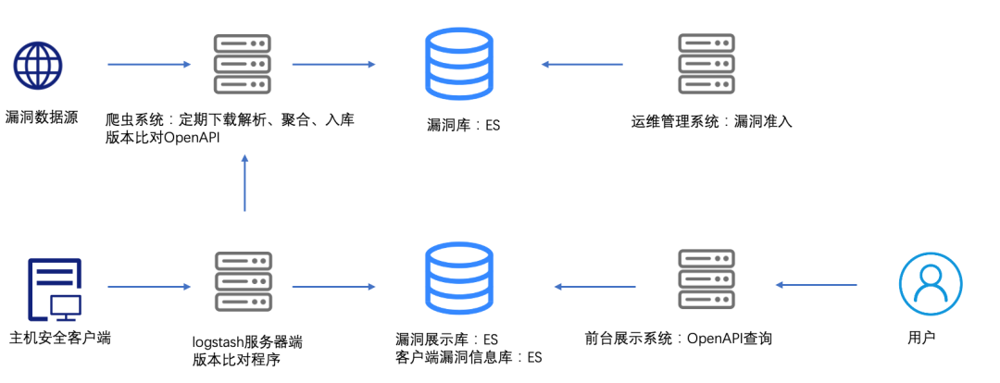
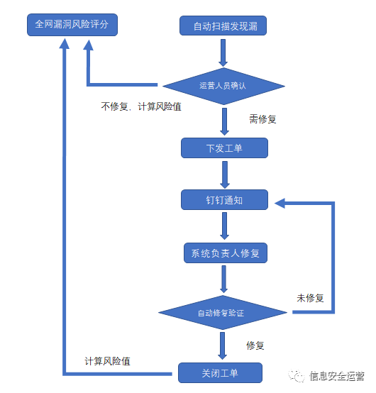

# 漏洞管理

## 概述
在中大型政府或者企业安全治理过程当中，业务系统漏洞管理十分重要，不可回避，原因有下列几点：
- 业务安全与日常安全运营的基本要求；
- 网信及公安等监管部门对平台等保合规的监管要求；例如监管要检查漏洞修复列表。
- 护网重保期间的应急响应要求；
- 抵御未知威胁、避免小概率大损失的有效方式。
- 新漏洞出现后，需要及时修复，防止攻击技术或代码扩散后加大威胁程度。

现实中，安全运营团队能充分利用安全产品，达到预期的效果用户的不多。主要困难有：
- 有限的安全运营人员，负责了上千台服务器、应用系统的漏洞管理，仅靠人工难以实现。
- 各种设备差异明显，原有的自动化流程不能实现闭环，难以实现批量自动化；
- 业务人员安全意识淡薄，对安全运营提出的修复置若罔闻，不配合甚至抵触。
- 安全运营设备或系统能力整合水平低，有很多环节需要人工操作，例如汇聚信息导出到excel，再由人工合并复检。
- 人才资金匮乏、缺乏对漏洞风险和受影响资产的感知能力、企业孤岛和部门战争、漏洞修复效率低下等

### 漏洞管理趋势

- 数据泄露大多与漏洞未修复有关。
  - 近年来60%的企业数据泄露与安全漏洞未得到修补有关。根据Ponemon Institute对近3,000个组织进行的最新调查显示，与2018年相比，2019年未能及时修补漏洞导致的停机给企业造成的损失增加了30％。
- 招兵买马+流程自动化
  - 根据ServiceNow/Ponemon的调查，70%的企业表示，他们计划在2020年雇用至少五名员工来进行漏洞管理。对于这些员工，企业的预期平均年成本为：650,000美元。
  - 45％的受访者表示，他们可以通过自动执行补丁管理流程来缩短补丁时间。70％的人说，如果法律迫使公司对数据泄露负责，他们将实施更好的补丁管理流程。
- 法规推动漏洞管理程序部署
  - 大多数据安全法规，例如PCI DSS和HIPAA，都要求合规实体具备漏洞管理程序。毫不奇怪，根据SANS研究所的调查，有84％的企业建立了漏洞管理程序，其中大约55％的已经制定了正式的漏洞管理计划。另有15％的企业表示计划在未来12个月内实施漏洞管理程序。
  - 大多数实施了漏洞管理程序的企业都使用风险评级指标来确定安全漏洞的严重性。三分之一的受访者表示，他们已经制定了正式的风险评估程序，而将近19％的受访者已制定了非正式的评估风险程序。根据调查，用于漏洞风险评级的一些最常见指标包括CVSS严重性评分、业务资产的重要性、来自威胁情报源的评分以及供应商严重性评级。
- 企业漏洞预防、检测和修补的成本正在上升
  - 2019年，企业平均每周花费139小时监控系统的漏洞和威胁，每周花费206小时来修补应用程序和系统。相比2018年的时间成本（127小时监控、153小时修复），尤其是漏洞修补的时间成本有较大幅度增长。根据ServiceNow/Ponemon的调查，今年企业将在与漏洞和补丁相关的任务上平均花费23,000多个小时。
  - 调查发现，2019年企业用于预防、检测、修补、记录和报告的漏洞管理工作平均每周费用为27688美元，与修补程序相关的停机时间损失每年约144万美元，后者比2018年的116万美元高出约24.4％。
- 漏洞管理扫描频率与响应时间
  - 根据Veracode的研究，与扫描频率较低的企业相比，扫描频率较高的企业在补救漏洞方面往往要快得多。该安全供应商发现，每天扫描其代码的软件开发组织所需的漏洞修补中位时间仅为19天，而每月扫描一次或更少时间的软件开发组织则为68天。
  - 据Veracode称，所有应用程序中，约有一半软件出现了老旧和未解决的漏洞（也称安全债），因为开发团队往往首先关注于更新的漏洞。这种趋势正在增加组织的数据泄露风险。Veracode表示：“扫描频率最高的前1％应用程序所承担的安全债比最低的三分之一低大约五倍。”
  - 数据表明，频繁扫描不仅可以帮助公司更快发现漏洞，还可以帮助他们大大降低网络风险。但是，根据安全牛《2020高效漏洞管理现状与趋势报告》，扫描频率并非越高越好，而是应该与其他漏洞管理流程环节的节奏相匹配，例如，你的漏洞修复节奏是每月一次，那么每天扫描也无助于改善结果。理想的状态是扫描频率与修复节奏同步，而且在变更时能够自动执行扫描。

- “打补丁”周期少于一周
  - 根据Tripwire的一项针对340位信息安全专业人员的调查，已经有9％的企业在获得安全补丁后立即部署了该补丁，49％的企业能在7天内完成补丁安装。有16％的企业表示他们在不到两周的时间内就部署了补丁程序，19％的企业表示花了长达一个月的时间，而6％的企业在三个月内安装了补丁程序。
  - Tripwire调查显示，多达40％的企业每月修补的漏洞少于10个，29％的企业每月修补10-50个漏洞。9％的企业表示他们每月修补50至100个漏洞，而有6％的企业每月修补的漏洞数量超过100个。令人惊讶的是，有15％的企业表示他们不知道自己每月修补了多少个安全漏洞。
- 多种因素导致补丁延迟
  - 尽管大多数安全企业都了解及时修补漏洞的重要性，但由于各种原因，该过程可能会延迟。在Ponemon的调查中，大多数（76％）的受访者表示，原因之一是IT和安全团队之间对应用程序和资产缺乏统一的看法。几乎相同的比例（74％）受访者表示，由于担心导致关键应用程序和系统停机，他们的修补过程经常被延迟。对于72％的用户，补丁优先级是导致延迟的主要问题。人员配备是另一个原因，只有64％的受访者表示他们有足够的人手及时部署补丁。
  - 调查显示，IT运营团队负责修补大多数漏洞（31％），安全运营团队负责组织中26％的漏洞修补任务，而CISO团队为17％，计算机安全事件响应团队（CSIRT）负责12％的企业漏洞修复工作。

- 对补丁延误的容忍度在降低
  - 在软件中发现安全漏洞后，大多数企业都希望开发人员能够迅速采取行动来解决问题。Tripwire的调查显示，当受访者被问及他们认为在漏洞发现与补丁发布之间可接受的时间范围时，有18％的人表示不接受任何等待。大约一半（48％）的人表示，他们愿意给开发者7天的时间来发布补丁，而16％的人接受在两周的时间内发布补丁程序。令人惊讶的是，有17％的人表示，如果需要，他们可以接受花费六个月时间等待补丁程序。
  - 调查显示，企业普遍期望软件开发人员即使在产品到期后仍会继续发布产品补丁。36％的人表示，他们希望开发人员在产品生命周期结束后的一到两年内发布补丁，而15％的人希望产品在三到五年内得到支持。有趣的是，有11％的人表示可以接受供应商在产品到期时立即停止所有补丁程序支持。

### 漏洞管理的几个原则
赢得高层支持

高层的态度对于漏洞管理项目来说意义重大，但是让高层心悦诚服而不是将信将疑地说 “支持” 其结果有着天壤之别。具体来说，你的项目计划能赢得领导多大程度的支持，很大一部分取决于你的表达能力和项目本身效果的“可视化”程度。如果成败的价值差异或者严重程度不足以打动领导，那么你的预算自然也是可有可无。

2
以资产发现为基本点

对漏洞管理范围的任何限制都会增加可见性风险。因此，必须将资产发现作为任何漏洞管理程序的核心组件。如果漏洞管理项目未能覆盖某些资产或特定业务领域，那么它在降低风险方面的效用也会大打折扣，因为您无法消除未知风险。同样，如果资产发现不是连续或者高频的，也会存在过时或失真风险。

3
高频扫描

高频扫描听上去有点像 “连续扫描”，给人不妙的感觉。现实情况是，进行高频率扫描的原因一般两个：首先是为了配合补救工作，其次是为了捕捉风险画像中的重要变化（例如，发现新的高风险漏洞）。

但有一点需要明确，扫描频率不是越高越好，而应该是合理的。频率的设定需要与两个目标关联在一起：首先，如果你的修复节奏是每月一次，那么每天扫描也无助于改善结果。但是，如果您的变更管理不够充分，那么可以考虑通过更频繁地扫描来降低某些风险。理想的状态是扫描频率与修复节奏同步，而且在变更时能够自动执行扫描。

4
融入业务环境

武无第一，同理漏洞风险也不是极限运动，如果你把布局重点放在一些绝对的风险上，忽略了业务环境和需求，那么你反而可能 “抓大放小”，漏掉了正真危险的，业务桌面上的 “小” 风险。高效漏洞管理的修复工作优先级，需要将漏洞放在业务环境和系统环境进行考量。说白了，就是要首先处理具有更高价值和更高业务风险的资产。

5
例外不是借口

您无法管理自己不知道的风险，通过扫描创建例外会带来很多未知风险。在环境中很可能存在无法扫描的设备，它们往往是一些稀疏分布的老旧设备。但这些 “犄角旮旯” 的例外并不能成为例外的理由，一台靠近窗户的老掉牙的复印机能有多大风险？只有那些积极主动测绘并完善防护面的企业才能防患于未然，在漏洞管理方面表现出色。

6
指标化管理

三人成虎的恐慌销售策略 (FUD) 是网络安全行业多年来的标准操作，但是有效的漏洞管理项目可不能建立在 FUD 战术之上，而是应该基于指标。只有把 “好” 给指标化了，你才能有效评估工作，找出工作的不足之处。

7
漏洞修复重在流程整合

查找和评估漏洞风险的目的并不是出一个漂亮的报告。关键是要制定更好的风险缓解决策，关键是要采取行动解决问题，交付结果。有效的漏洞管理必须结合有效的补救措施。很遗憾，没有漏洞评估工具会自动执行补救操作。你必须将有效的漏洞管理程序与补救工作流集成在一起，才能有效推动企业的漏洞管理水平，但难点是企业内部工作流往往数量众多，集成存在相当。

你需要首先 “摸底” 再 “捞底”，搞清楚企业的业务流程和不同部门的工作方式，然后找出将补救工作整合到流程中的方法。

市场已经有大量的漏洞评估产品，但是有效的漏洞管理却依然存在很大的改进空间。以上这七个原则，也许不一定能够让你 “七步成诗”，但如果能给你的工作带来一些新的思路和启发，也就足矣。
## 中大型企业工作负载漏洞管理实践
### 漏洞管理产品设计

整体架构

- 通过各种线上漏洞数据源，定期下载相关文件，xml解析，同时根据需求把各个漏洞数据写入到elastic search中。
- 同时下载yum/apt源数据，把yum/apt对应软件的版本低于漏洞数据源期望的软件版本，设置成不对用户展示。对新增漏洞在测试环境中自动修复，返回修复失败的软件也设置对用户不可见，实现漏洞库准入管理。
- 前台用户点击全局验证时，通过服务器端任务管理系统，下发检测命令，客户端会上传rpm、deb包数据。通过对比程序把存在漏洞的软件写入到漏洞展示库elastic search中。
- 前台用户点击自动修复时，通过服务器端任务管理系统，下发自动修复命令。由客户端执行，并且反馈结果到elastic search中。

#### 漏洞库

来源：
- https://oval.cisecurity.org/repository/download
- http://cve.mitre.org/data/downloads/index.html

漏洞相关信息包括：
- 漏洞公告id
- 公告中英文名称、描述
- 漏洞类型（国内外不同）
- 漏洞等级（可能存在多个）
- CVE,cvss关联信息
- 修复方式
- 影响实体
  
#### 漏洞检测OpenAPI
用检测漏洞

#### 漏洞管理API

#### 任务下发

### 漏洞运营

## 制造企业漏洞管理案例

比较传统的漏洞管理过程：
- 数据中心拥有大量监控设备，可以根据人工指令进行漏洞扫描；
- 漏洞扫描结果需要人工筛选、确认、通知系统负责人；
- 漏洞修复结果需要人工跟进和确认，之后进入下一轮。
- 总得来看，技术含量低、资源整合能力查，时间、过程、效果都不能有效保障。

某制造型企业漏洞管理思路：
- 利用已有安全平台，整合漏洞管理全流程，符合企业精益制造理念（减少平台投入和人力成本，提高自动化水平和闭环管理水平）
- 将漏洞管理过程涉及的发现、确认、工单开启、修复、复测、工单关闭等多个与人工相关的环节，通过流程自动化保证漏洞修复任务高效运行
- 实现漏洞生命周期自动化闭环管理。

### 漏洞管理业务流程

- 漏洞发现
  - 利用安全运营平台的漏洞管理模块，对接漏洞扫描工具，创建及管理扫描任务，下发指定范围和规则的周期性扫描任务；也可自定义扫描任务，对特定的漏洞或主机进行扫描，灵活处理紧急漏洞或漏扫任务。
- 漏洞确认，工单下发
  - 漏洞修复工作涉及到业务的正常运行，扫描出来的漏洞很多，安全运营人员需对漏洞进行筛选，判断高风险易于利用的漏洞，通过工单模块下发工单，工单信息通过集成的企业内部通讯工具自动下发通知到系统负责人。无需修复的漏洞通过漏洞管理模块将风险值计入全网的漏洞风险评估结果中。
- 漏洞修复：
  - 系统负责人收到工单消息提醒，对漏洞进行修复，如在规定时间内没有对工单进行处理，则再次触发消息提醒通知。
- 修复验证
  - 系统负责人对漏洞修复后，登录安全运营平台工单系统，对工单进行进关闭， 工单信息触发SOAR调用工单结果，触发对系统的复测扫描，验证漏洞是否修复，如已经修复，则触发钉钉通知运营人员工单处理完毕。如未漏洞修复，则会再次触发通知给系统负责人进行漏洞修复。
- 总结
  - 由于漏洞修复的复杂性，很难实现完全无人化的流程，需经过安全运营人员的确认后，再下发工单通知系统负责人，确保危险性高、易于利用的漏洞优先修复。对于威胁小，难于利用的漏洞，可暂不进行修复。通过运营人员的判断后，也减少了系统负责人对漏洞修复的工作量，降低运维风险。

### 建设成效 

漏洞修复自动化流程管理拓展了安全运营平台功能模块的漏洞管理能力，流程的建设对信息安全漏洞实现了从发现、风险评估、工单下发、修复到验证的自动化闭环管理。极大降低人工工作量提升漏洞修复时效，保障应用系统的安全稳定运行。通过整合，同时也提升了系统的利用率，符合制造型企业的精益制造的理念。