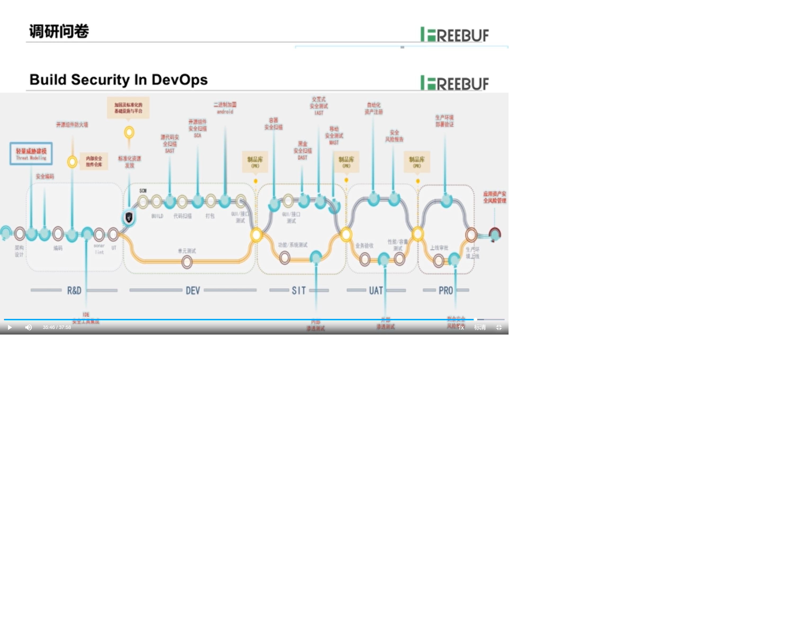

# 金融app应用安全架构设计

## 安全架构初探

Gartner的定义：安全架构是计划和设计组织的、概念的、逻辑的、物理的组件的规程和相关过程，这些组件以一致的方式进行交互，并与业务需求相适应，以达到和维护一种安全相关风险可被管理的状态。

ISF的定义：安全架构是一组表示形式，描述了环境中安全组件的功能，结构和相互关系。

### 安全架构的作用
安全架构的作用是采用一种结构化的方法，为组织、基础设施、应用等提供系统性的安全控制。

不同的企业可以有不同的安全架构，例如可分为3层：
- 概念化安全架构
- 逻辑安全架构
- 物理安全架构

### 安全架构方法论
典型的方法论是：
- SABSA 逻辑安全架构。
- OpenGroup 的 OSA

### 安全架构框架方法
- NIST CSF Core Functions & Categories，提供了一种方法为组织定义逻辑安全架构。

## 安全架构设计方法

很关键的一点，首先要遵循安全设计原则。
### 安全设计原则
MIT saltzer教授提出的经典安全原则：
- 开放性：设计不应是秘密，要能够接收检验。多使用业界成熟的安全的。即使设计全曝光，系统仍然安全可靠。
- 失败-默认安全
- 权限分离
- 最小权限
- 经济适用
- 最小公共化
- 完全仲裁
- 心理可承受
- 纵深防御
- 不要轻信
- 保护最薄弱缓解
- 提升隐私
### 安全架构设计过程
- 攻击面分析
- 威胁建模
  - 识别资产（价值数据）
  - 资产架构文档化
  - 解构应用
  - 识别威胁
  - 威胁文档化
  - 威胁评估、评测
  - 可以使用的框架：STRIDE攻击思路建模、隐私数据保护建模
- 安全设计方案
安全架构的设计方法，主要是通过威胁分析或威胁建模来展开，识别威胁，建立风险消减措施。
## 安全架构设计实战

经典方法比较重，要求时间和人力。业界现在采用较多的是轻量级的威胁建模和安全架构设计，适应敏捷。

安全需求分析与设计相结合，进行攻击面分析，建立安全威胁库。

### 案例1
- 产品概述：某投行一体化服务平台，有APP 和 WEB 2类平台
- 目标客户：内部人员、机构客户、第三方
- 安全目标：保护信息资产（机密性、完整性、可用性）

构建步骤：
#### 第一步进行调查问卷
主要了解：
- 系统架构
  - 架构图
  - 技术方案
  - 架构描述
  - 暴漏端口
  - 研发方式
- 重要数据
  - 系统数据
  - 敏感数据
  - 数据存储方式
- 使用场景
  - 主要用户场景
  - 系统面向用户
  - 系统角色
  - 访问方式
  - 身份认证方式
- 部署方式
  - 部署架构图
  - 外围依赖系统
  - 数据交互
- 资产清单
  - 服务器IP、域名等
  - 对外开放服务及端口
#### 第二步根据应用架构进行攻击分析

- 通过网络图、数据流图进行攻击面分析
- 使用安全威胁库（专家经验）
- STRIDE
- 敏感数据
#### 第三步结构安全

#### 第四步移动app安全

涉及面很多：
- 数据安全
  - 应用本地不存储敏感数据
  - 一定要存就要aes加密
  - 清除sdcard或内存中的敏感数据时，采用填充式清除
  - 移动端应用的release版本不输出任何暴漏应用的信息、log、err等。
- 业务安全
  - 防止欺诈、薅羊毛
  - 要进行多维数据采集，形成用户画像，根据画像进行响应。
  - 反欺诈平台建设
- 通信安全
  - 要全程加密（tls v1.2）保证机密性
  - 校验保证完整性
  - 要有证书防止抵赖
- 隐私安全
  - 内存信息
  - 调试信息
  - 个人信息
- 代码质量和构建安全
- 组件安全
- 第三方代码安全
- webview安全
- 应用包签名安全
- 代码混淆和加壳保护
  - 开源逆向分析工具：apktool\dex2jar\baksamli等很容易获得源代码。
  - 使用dex、so加壳
  - 加入动态调试检测进行反调试，例如调试器进程名检查、ptrace检测、xposed hook框架检测等。
  - 加固后一定要做兼容性、健壮性的测试，在安全的同时满足性能要求。
- 认证和会话管理

#### 第五步Web安全设计

### 安全设计方案

## DevSecOps实战
很多企业采用。

必须用自动化、工具化手段实现。

- 安全建模，还是手工多一些。

### 应用安全工程中台

案例：三叉戟应用安全工程中台
- 安全开发赋能DevSec
  - 安全SDK组件武器库
  - SDL安全开发全流程赋能平台
- 自动化安全测试平台
- 安全运维赋能SecOps
  - 漏洞全生命周期管理平台
  - 应用资产安全风险感知平台