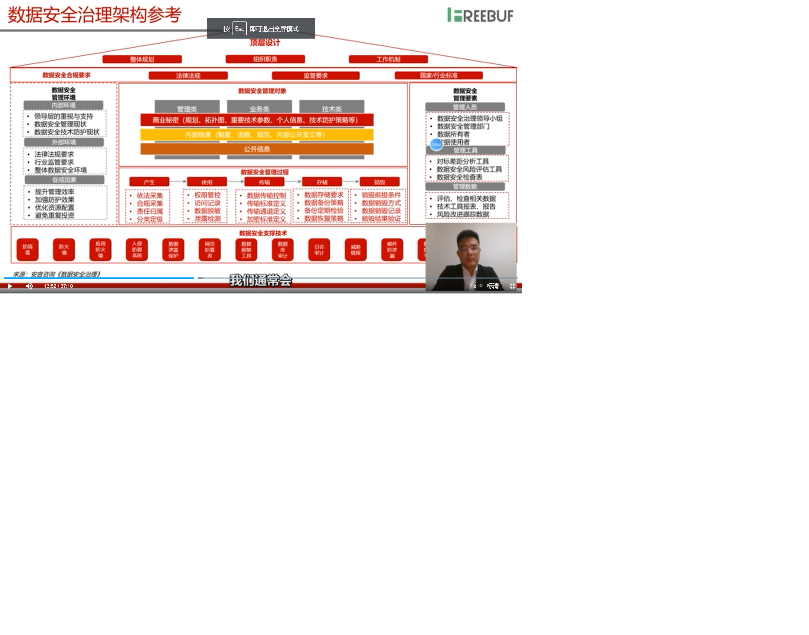

# 第3讲 金融科技安全发展的新态势和机遇

内容来源：秦峰讲课资料 

秦峰 上海市信息安全行业协会金融科技安全专委会秘书长 上海安言信息技术有限公司经理。

## fintech 安全发展趋势

### 金融科技发展趋势

2019年8月，央行印发了《金融科技发展规划（2019-2021）》明确了未来3年金融科技的指导思想、基本原则、发展目标、重点任务和保障措施。

焦点及趋势：主要聚焦人工智能、区块链、生物识别、云计算、大数据方面。

企业更重视用户，解决用户痛点，满足用户需求，提升用户体验，精细化管理，风控能力和服务水平等加大信息化。

能力及挑战：
- 加强金融科技战略部署
- 强化金融科技合理应用
- 赋能金融服务提质增效
- 增强金融风险技防能力
- 强化金融科技监管
- 夯实金融科技基础支持

### 金融科技安全所遇到的外部挑战

保险风险高
银行第三
热门漏洞：
- 敏感信息泄露
- 注入
- 弱口令
- 命令执行
- 未授权访问
- 逻辑漏洞
- SSCF

2019.10.央行向部分银行下发《个人金融信息（数据）保护试行办法》初稿，征求意见，逐步完善。个人信息采集，征信信息使用加大惩处力度。

2019.9，央行发布了金融行业标准《移动金融客户端应用软件安全管理规范》，规范要求加强客户端软件设计、开发、发布、维护等环节的安全管理，构建覆盖全生命周期的管理机制，保障客户端软件安全，加强客户端软件。

随着金融科技广泛应用，生态发生深刻变革，以互联网金融为代表的金融服务模式及金融安全技术创新层出不穷，金融科技安全领域也在酝酿下一波的商业模式的革新，金融科技安全三大挑战：
- 监管安全
- 业务安全
- 技术安全

#### 监管安全

传统模式下，事后的、手动的、基于传统结构性数据的监管范式已经不能满足金融科技新业态的监管需求。

以降低合规成本、有效防范金融风险为目标的监管科技（Regtech）正在称为金融科技的重要组成部分。

强化监管科技应用实践、积极利用各种技术丰富金融监管手段，提升跨行业、跨市场交叉性金融风险的甄别、防范和化解能力。

打造中国特有的监管科技。

#### 业务安全
业务安全方面，强化金融科技合理应用，在金融风控、反欺诈、生物识别、声纹识别、量子计算等领域进行重点突破，带动全局发展。

规范关键共性技术的选型、能力建设、应用场景以及安全管控，全面提升金融科技应用水平，将成为金融高质量发展的新引擎，坚决守住不发生系统性金融风险的底线。
#### 技术安全

在金融脱媒的背景下，金融科技安全需要正确处理安全与发展的关系，运用金融科技提升跨市场、跨业态、跨区域金融风险的识别、预警和处置能力，加强网络安全风险管控和金融信息保护，做好新技术应用风险防范。

## fintech 安全技术热点

### 数据安全

可以分为4个领域
- 数据安全合规
- 数据安全治理
- 数据安全管理
- 技术控制措施

#### 数据安全合规

##### 合规要求
- 法律法规层面
  - 网络安全法
  - 网络安全等级保护基本要求
  - 最高法、最高检关于办理侵犯公民个人信息刑事案件适用法律若干问题的解释
  - APP违法违规收集使用个人信息行为认定方法
  - 关于加强银行卡安全管理预防和打击银行卡犯罪的通知
  - 个人信息和重要数据出境安全评估办法
- 合规要求层面
  - 银行业金融机构数据治理指引
  - 信息科技风险管理指引
  - 银行业金融机构信息科技外包风险监管指引
  - 人行关于加强银行卡风险管理的通知
- 标准层面
  - GB/T 35273-2020 个人信息安全规范
  - GB/Z 28858-2012 信息安全技术公共及商用服务信息系统个人信息保护指南
  - JR/T 0171-2020 个人金融信息保护技术规范
  - ISO/IEC 27701 2019隐私管理ISO/IEC 27001和ISO/IEC 27001
  - ISO/IEC 29151:2017 个人身份信息保护实践指南
  - ISO/IEC 29134:2017隐私影响评估准则

##### 要解决的问题
- 需要符合哪些法律法规？
- 需要符合哪些监管要求？
- 需要符合哪些国家标准？
- 需要符合哪些行业标准？

##### 要做的工作
- 组织的合规符合性分析
- 数据安全合规要求映射/安全控制

##### 产出结果
- 数据安全符合性分析报告
- 数据安全合规要求映射表格/评审表格

#### 数据安全治理

##### 要解决的问题
- 数据有哪些？
- 数据安全风险有哪些？
- 数据安全责任如何划分？
- 如何确保数据安全合规？
- 如何评审验证数据安全成效？
- 数据安全怎样长期发展？

##### 要做的工作
- 建立数据安全管理组织
- 委派数据安全管理职责
- 建立数据分类分级和保护标准
- 确定数据安全风险评估方法
- 识别法律合规需求
- 建立数据安全KPI评价指标

##### 产出结果

- 建立数据安全治理架构
- 按规划发展安全治理
- 建立数据安全评价机制
- 确保数据安全法律合规

#### 数据安全管理
从数据生命周期考虑。
##### 要解决的问题
- 数据如何生成？
- 数据如何传输？
- 数据如何使用？
- 数据如何存储？
- 数据如何分享？
- 数据如何销毁？
##### 要做的工作
- 建立数据安全总体方针
- 编制数据安全管理制度
- 设定数据安全相关流程
- 数据安全意识技能培训
##### 产出结果
- 数据安全管理制度体系
#### 技术控制措施

##### 要解决的问题
- 如何高效确保数据安全？
- 如何防止信息泄露
- 如何确保安全存储
- 如何确保数据库安全
- 如何访问控制和权限管理

##### 要做的工作
- 梳理并分析数据安全需求
- 设计技术框架和发展路线
- 制订解决方案
- 建立项目目录并立项
- 产品选型、采购、部署
- 策略配置及持续运维
##### 产出结果
- 数据技术框架体系
- 数据安全技术项目目录
- 数据安全技术解决方案
- 产品实施相关材料

### 零信任安全体系架构和实践

传统网络安全在数据安全时代开始失效。

传统安全产品及局限性：
- TCP/IP协议设计缺陷
- 防火墙效能弱
- 0day
- DDoS

安全边界发生变化：
- 金融混合云计算环境
- 金融大数据分析
- 各种移动设备的引入

#### 零信任架构的特点
零信任架构摆脱了传统以边界划分为核心的安全建模思想，将安全思想转移到信任关系的建立上。安全的可信的链路建立是信任的基础和手段。从终端设备通电开始、从底层硬件开始，信任的链条逐一建立，一步一步直到最终资源访问。

- 安全可靠性更高。安全链条环环相扣，中间发生变化会导致整个链条的改变。容易发现和检测
- 攻击难度更大。信任链条是多维度建立的，例如用户信任通过双因子身份验证，设备间信任关系通过主机准人关系、基线状态、运行状态判断。维度增加导致黑客攻击成本升高。
- 持续校验，从不信任。信任都是会话的，会话结束信任关系结束，下次会话前仍需验证和授权、审计。
- 全链路管理。

#### 基于SOAR的安全运营

传统安全运营模式的通点：
- 难于在监控覆盖率、安全事件数量、告警准确率之间进行平衡。
- 运营部门面临系统运维成本和安全运营效能的矛盾
- 网络安全保障要求不断提升，高等级安全防护策略逐渐成为常态
- 安全运维人力物理花费大，但应急响应机制不一定有效。

##### SOAR
Security Orchestration, Automation and Response，意即安全编排自动化与响应。该技术聚焦安全运维领域，重点解决（但不并不限于）安全响应的问题，最早由 Gartner 在 2015 年提出。
https://www.aqniu.com/learn/52338.html

SOAR定义：使组织能够收集来自不同来源的安全威胁数据和警报技术，这些技术中可以利用人工和机器的组合力量来执行事件分析和分类，从而帮助定义、确定优先级，并根据标准工作流驱动标准化的事件响应活动。

SOAR的三大核心技术解析
就目前而言，SOAR 的三大核心技术能力分别是安全编排与自动化、安全事件响应平台、威胁情报平台。
- 安全编排与自动化：这是SOAR的核心能力和基本能力
- 安全事件响应平台：这是SOAR的关键功能，但也可以独立于SOAR存在
- 威胁情报平台：这是SOAR的重要功能，但也可以独立于SOAR存在

#### DevSecOps 金融机构的落地实践

单体应用架构正在被微服务架构取代，DevOps提供了敏捷、高效的软件开发流程，传统的s-sdlc开发安全管理流程已经无法跟上devops步伐。

##### 安全工作前置
在开发早期融入安全
- 开发测试人员的安全意识培训
- 编码安全开发规范培训
- 安全需求导入
- 开发源代码审计
- 上线前安全审查

##### 柔和嵌入现有开发流程
- 安全管理工具与devops开发平台实现无缝对接、快速迭代
- 安全需求导入至统一需求管理流程与工具
- 安全测试工作与CI/CD（持续集成/部署）对接
- 安全测试结果导入至缺陷管理工具等诸多环节。

##### 具体工作
- 代码数据流检测模式，通过持续收集功能测试流量主动触发漏洞检查、可覆盖加密、验证码等应用接口类安全漏洞。

- 自动化安全测试平台
- 精准发现漏洞，降低误报

##### 发展趋势
- 构建安全需求与威胁建模平台
- 漏洞自动化修复工具
- AVC漏洞关联分析
- 安全测试编排
- 流程平台持续运营