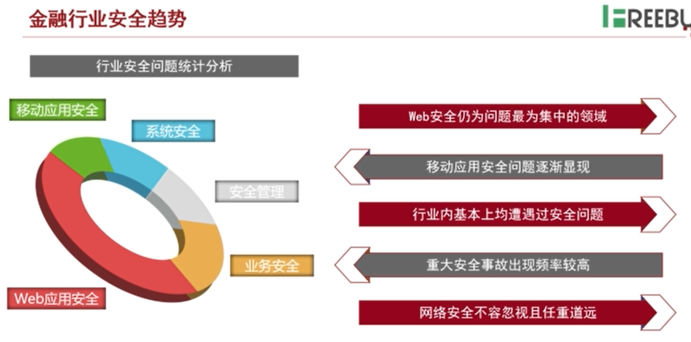
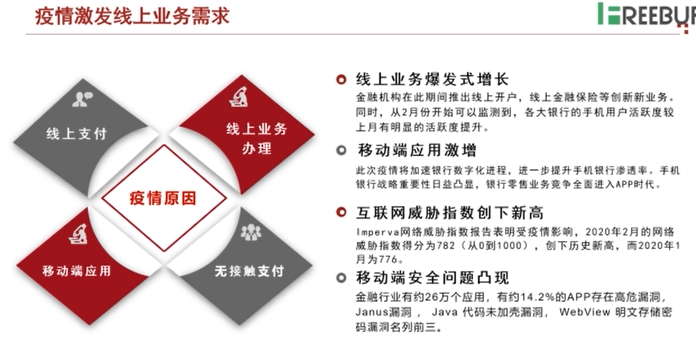
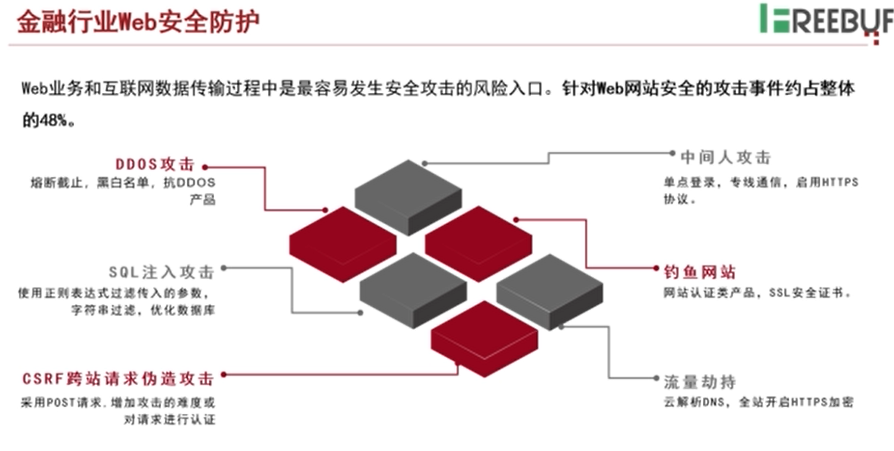
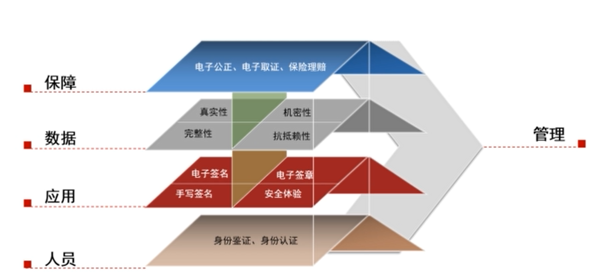
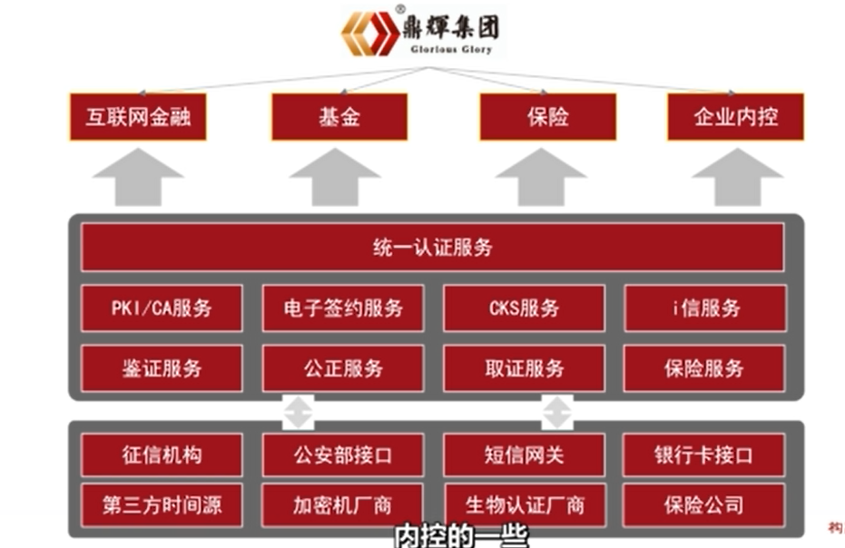

# 第4讲 金融行业数据安全的研究与实践

内容来源：陈大鹏讲义

## 金融行业安全趋势

- web 安全仍为最集中的风险域
- 移动安全问题逐渐突出
- 漏洞主要集中在业务逻辑漏洞、信息泄露、注入类漏洞。

## 2020疫情期间的业务爆发

- 线上业务爆发增长
- 移动端应用激增
- 互联网威胁指数创新高
  - Imperva网络威胁指数创新高。

主要工具：
- 边界类防护：防火墙
- 检测类：IDS、反病毒、反间谍
- AAA类：身份认证和访问控制
## 国产证书保驾护航

### web业务安全方面

使用好的证书可以加强https等安全防护。

#### 域信SSL证书（国产）

域信是由天威诚信经过WebTrust体系认证的，国产自主根CA品牌，自创立依赖一直为中国客户提供权威可信、安全规范、无忧保障、自主可控的可信网络认证产品与服务。

特点：
- 本地的OCSP/CRL服务
  - 比国际证书在访问过程中响应速度更快，业务更加稳定
- 高强度算法可选服务
  - 域信支持先进的ECC算法，是目前RSA算法性能的9倍。
- 网络安全服务
  - 全站HTTPS扫描服务
  - 企业PKI快速签发平台
  - 网站安全监控平台等多项服务
- 优质的兼容性保障
  - 支持win 7+
  - android 4.0+
  - IOS 5+
  - jdk 1.6.15+

##### CIM系统主要功能
域信有证书智能管理平台。

帮助企业管理证书。

主要功能：
- 监控状态
- 一键下单
- 云端智能分析
- 自动扫描
- 分析报告
- 密钥管理
  - 企业可能有几十份证书用于把不同场景。

#### 国密SSL证书

国家密码局推动。

推动原因：国家最新《密码法》中提到相关改造建议，在金融行业的内部文件中多次提到密码算法国产化的改造进度要求。

当前进度：阿里云、各大银行和部分地方银行已经完成对SM2算法的业务兼容性测试。

国密双证书方案：2019年取得Webtrust资质，通过天威诚信签发国密算法sm2证书+国际/国产RSA证书，双证书支持保障兼容性。

### 金融业务安全方面

消费金融、互联网金融、电子商务等业务要求安全保障。

#### PKI/CA解决方案

分为以下几个大方面：
- 身份鉴别
- 登录认证
- 业务操作
- 数据流转
- 数据保存

##### 身份鉴别

- 密码认证
- 短信认证
- 身份卡认证
- 银行卡验证
- 生物特征认证

##### 登录认证

- 验证密码
- 验证短信
- 验证令牌
- 验证证书
- 验证生物特征

##### 业务操作
- 二次身份认证
- 电子签名
- 电子签章
- 加盖时间戳

##### 数据流转
- 数据签名/验签
- 数据加密/解密

##### 数据保存

- 加密存储
- 电子取证

主要防护方面见下图：

