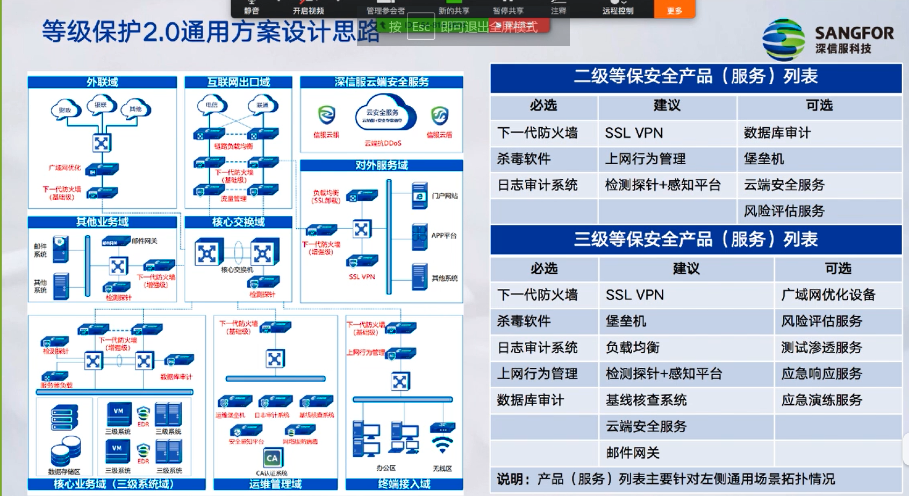

# 等级保护2.0

## 基本概念
### 发展历程：

### 相关标准

- GB/T 22239-2019 《信息安全技术 网络安全等级保护基本要求》
- GB/T 22240-2020 《信息安全技术 网络安全等级保护定级指南》
- GB/T 25058-2019 《信息安全技术 网络安全等级保护实施指南》
- GB/T 25070-2019 《信息安全技术 网络安全等级保护安全设计技术要求》	
- GB/T 36958-2018 《信息安全技术 网络安全等级保护安全管理中心技术要求》

- GB/T 28448-2019 《信息安全技术 网络安全等级保护测评要求》
- GB/T 28449-2018 《信息安全技术 网络安全等级保护测评过程指南》
- GB/T 36959-2018 《信息安全技术 网络安全等级保护测评机构能力要求和评估规范》
- GB/T 36627-2018 《信息安全技术 网络安全等级保护测试评估技术指南》

### 基本框架：

### 基本目标

- 分等级保护、突出重点、积极防御、综合防护
- “打防管控”一体化的网络安全防御体系
- 变被动防护为主动防护，变静态防护为动态防护
- 关键基础设施、重要信息系统和大数据安全重点防护
- 推动网络安全产业、企业快速健康发展
- 同步规划、同步建设、同步运行

主动防御：
- 目标：预警、检测、审计（多种机制）
- 技术：可信计算、主动免疫
  - 可用的技术很多：移动目标式的主动防御、机器学习、主动行为分析、安全情报及主动预测。
- 体系：动态防御
- 优势：
  - 易于使用、减轻运维和影响
  - 提高检测率
  - 区分自动化留恋共和人类流量
  - 防护技术提供：不仅基于特征的防护，还应主动安全模型。

### 工作流程

- 定级
  - 梳理资产和威胁
  - 初步确定定级对象
  - 专家评审
  - 主管部门审核
  - 公安机关备案审查
- 备案
  - 持定级报告、备案表等材料到当地公安机关网安部门备案
  - 公安机关会提供一套表格和线上系统，要求填写
- 建设整改
  - gb/t 22239
  - 参照信息系统当前等级要求和标准，对信息系统进行整改加固。
- 等级评测
  - 委托具备测评资质的测评机构对信息系统进行等级评测，形成正式的评测报告
- 监督检查
  - 公安来进行检查
  - 向当地公安机关网监部门提交测评报告，配合完成检查。

## 等保实务
### 过程
- 建立工作组
- 发布公司集、集团级的等保制度
- 宣贯：研究、培训、考试（持续进行）
- 执行：安全管理与技术能力建设

### 定级
关键：
- 自主准确定级，高了成本大，低了有风险
- 明确唯一的责任单位（负责建设、接受测评、整改和安全检查责任）
- 具有信息系统的基本要素，能够准确识别业务等级和系统等级
- 承载单一或相对独立的业务应用（不能多个系统的安全等级求平均数）

#### 定级的依据
##### 2018年6月公安部《网络安全等级保护条例（征求意见稿）》

- 第十六条 网络定级 “网络运营者应当在规划设计阶段确定网络的安全保护等级。当网络功能、服务范围、服务对象和处理的数据等发生重大变化时，网络运营者应当依法变更网络的安全保护等级。”
- 第十七条 定级评审 “对拟定为第二级以上的网络，其运营者应当组织专家评审；有行业主管部门的，应当在评审后报请主管部门核准。跨省或者全国统一联网运行的网络由行业主管部门统一拟定安全保护等级，统一组织定级评审。行业主管部门可以依据国家标准规范，结合本行业网络特点制定行业网络安全等级保护定级指导意见。”

##### 国家公共安全行业标准GA/T1389-2017 信息安全技术 网络安全等级保护定级指南

##### 国家标准GB/T 22240-2020

##### 各种行业标准（常为定量型）

#### 定级流程

- 确定定级对象
- 初步确定等级
  - 业务信息安全等级S
  - 系统信息安全等级A
- 专家评审
- 主管部门审核
- 公安机关备案审查
- 最终确定等级

#### 定级报告
非常重要的一份文件，是专家评审的对象和备案顺利通过的保障。

主要内容：
- xx信息系统描述
  - 简述该系统被列为定级对象的理由。一般从3个方面说明：一是描述承担信息系统安全责任的相关单位或部门，说明本单位或部门对信息系统具有安全保护责任，该系统为本单位或部门的定级对象；二是该定级对象是否具有信息系统的基本要素，描述基本要素、系统网络结构、系统边界和边界设备；三是该定级对象是否承建着单一或者相对独立的业务，业务情况描述。
- xx系统安全保护等级确定
  - 参考国家标准《等级保护定级指南》
  - 主要内容1：业务信息安全保护等级的确定，含1业务信息描述；2业务信息收到破坏时所侵害客体的确定；3信息收到破坏后对侵害客体的侵害程度的确定；4业务信息安全等级的确定。
  - 主要内容2：系统服务安全保护等级的确定，含1业务信息描述；2业务信息收到破坏时所侵害客体的确定；3信息收到破坏后对侵害客体的侵害程度的确定；4业务信息安全等级的确定。
  - 主要内容3：安全保护等级确定。
    - 由业务信息安全等级和系统服务安全等级较高者确定，最终确定xxx系统安全保护等级为第n级。

### 一些要点
- 安全管理中心建设和运行
- 个人隐私
- 密码国产化
- 可信计算环境与国产化

## 案例
### 腾讯数据安全专向
内部成立数据保护专项，提出了业务落地指标，从入侵视角提出保护指标，自动检测一些内容，纳入考核机制。统一的权限管理、监控、数据恢复机制等。

结合：人和技术，提供平台化

## 2020年公安部指导意见

> 内容来源：公安部网络安全保卫局 祝国邦《贯彻落实网络安全等级保护和关键信息基础设施安全保护制度指导意见解读》2020.09.03

### 指导思想、基本原则和工作目标

#### 指导思想

- 以制度为基础：以贯彻落实网络安全等级保护制度和关键基础设施安全保护制度为基础；
- 以关键重要为重点：以保护关键基础设施、重要网络和数据安全为重点，切实加强保卫、保护和保障；
- 全面加强监测管控：全面加强网络网络安全防范管理、监测预警、应急处置、侦查打击等各项措施，及时监测、处置网络安全风险和威胁。
- 依法惩治网络违法犯罪活动，切实提高网络安全保护能力
- 积极构建国家网络安全综合防控体系，切实维护国家网络空间主权、国家安全和社会公共利益。
- 保护人民群众的合法权益，保障和促进经济社会信息化健康发展。

#### 基本原则

- 坚持分等级保护、突出重点。重点保障关键信息基础设施、第三级以上网络、重要数据安全。
- 坚持积极防御、综合防护。充分利用人工智能、大数据分析等技术，强化安全监测、态势感知、通报预警和应急处置等重点工作。
- 坚持依法保护，形成合力。公安机关依法履行保卫和监管职责，行业主管部门履行本行业主管、监管责任，落实网络运营者主体防护责任。

#### 工作目标

- 网络安全等级保护制度深入贯彻实施。网络安全等级保护定级备案、等级测评、安全建设和检查等基础工作深入推进。网络安全保护“实战化、体系化、常态化”和“动态防御、主动防御、纵深防御、精准防护、整体防控、联防联控”的“三化六防”措施得到有效落实，网络安全保护良好生态基本建立。

- 2、关键信息基础设施安全保护制度建立实施。关键信息基础设施底数清晰，安全保护机构健全、职责明确、保障有力。在贯彻落实网络安全等级保护制度的基础上，关键岗位人员管理、供应链安全、数据安全、应急处置等重点安全保护措施得到有效落实，关键信息基础设施安全防护能力明显增强。
- 3、网络安全监测预警和应急处置能力显著提升。跨行业、跨部门、跨地区的立体化网络安全监测体系和网络安全保护平台基本建成，网络安全态势感知、通报预警和事件发现处置能力明显提高。网络安全预案科学齐备，应急处置机制完善，应急演练常态化开展，网络安全重大事件得到有效防范、遏制和处置。
- 4、网络安全综合防控体系基本形成。网络安全保护工作机制健全完善，党委统筹领导、各部门分工负责、社会力量多方参与的工作格局进一步完善。网络安全责任制得到有效落实，网络安全管理防范、监督指导和侦查打击等能力显著提升，“打防管控”一体化的网络安全综合防控体系基本形成。

### 深入贯彻实施国家网络安全等级保护制度

按照国家网络安全等级保护制度要求，各单位、各部门在公安机关指导监督下，认真组织、深入开展网络安全等级保护工作，建立良好的网络安全保护生态，切实履行主体责任，全面提升网络安全保护能力。

#### 深化网络定级备案工作

- 全面梳理本单位各类网络，特别是云计算、物联网、新型互联网、大数据、智能制造等新技术应用的基本情况。
- 科学确定网络的安全保护等级。
- 对第二级以上网络依法向公安机关备案，并向行业主管部门报备。
- 对新建网络，应在规划设计阶段确定安全保护等级。
公安机关进行备案审核。

#### 定期开展网络安全等级测评
- 依据《网络安全等级保护测评要求》等有关标准，对网络进行检测评估，查找可能存在的网络安全问题和隐患。
- 第三级以上网络运营者应委托等级测评机构，每年开展一次网络安全等级测评。
- 新建第三级以上网络应在通过等级测评后投入运行。
- 公安机关加强对等级测评机构的监督管理。

#### 科学开展安全建设整改

- 落实“同步规划、同步建设、同步使用”三同步要求。
- 依据《网络安全等级保护基本要求》《网络安全等级保护安全设计技术要求》等国家标准，按照“一个中心、三重防护”要求，应用可信计算等新技术开展安全建设和整改加固，提高内生安全、主动免疫、主动防御能力。
- 可将网络系统迁移上云，或将网络安全服务外包，利用- 云服务商和网络安全服务商提升保护能力和水平。
- 完善人员管理、教育培训、系统建设和运维等管理制度。

#### 强化安全责任落实

- 行业主管部门、网络运营者应依据《网络安全法》等法律法规和中央关于网络安全工作责任制要求，建立网络安全等级保护工作责任制，落实责任追究制度，作到“守土有责、守土尽责”。
- 网络运营者要定期组织专门力量开展网络安全自查和检测评估，行业主管部门要组织风险评估，及时发现网络安全隐患和薄弱环节并予以整改。

#### 加强供应链安全管理

- 应加强网络关键人员的安全管理，第三级以上网络运营者应对为其提供设计、建设、运维、技术服务的机构和人员加强管理，评估风险，并采取相应的管控措施。
- 应加强网络运维管理，因业务需要确需通过互联网远程运维的，应进行评估论证，并采取相应的管控措施。
- 应采购、使用符合国家法律法规和有关标准要求的网络产品及服务，积极应用安全可信的网络产品及服务。

#### 落实密码安全防护要求

- 应贯彻落实《密码法》等有关法律法规规定和密码应用相关标准规范。
- 第三级以上网络应正确、有效采用密码技术进行保护，并使用符合相关要求的密码产品和服务。
- 第三级以上网络运营者应在网络规划、建设和运行阶段，按照密码应用安全性评估管理办法和相关标准，在网络安全等级测评中同步开展密码应用安全性评估。

### 建立并实施关键信息基础安全保护制度

公安机关指导监督关键信息基础设施安全保护工作。各单位、各部门应加强关键信息基础设施安全的法律体系、政策体系、标准体系、保护体系、保卫体系和保障体系建设，建立并实施关键信息基础设施安全保护制度，在落实网络安全等级保护制度基础上，强化保护措施，切实维护关键信息基础设施安全。

#### 组织认定关键信息基础设施
- 公共通信和信息服务、能源、交通、水利、金融、公共服务、电子政务、国防科技工业等重要行业和领域的主管、监管部门（以下统称保护工作部门）应制定关键信息基础设施认定规则，并报公安部备案。
- 保护工作部门根据认定规则负责组织认定关键信息基础设施，及时将认定结果通知运营者，并报公安部。
- 应将符合认定条件的基础网络、大型专网、核心业务系统、云平台、大数据平台、物联网、工业控制系统、智能制造系统、新型互联网、新兴通讯设施等纳入关键信息基础设施。
- 关键信息基础设施清单实行动态调整机制，有关网络设施、信息系统发生较大变化，保护工作部门应组织重新认定，将认定结果通知运营者，并报公安部。

#### 明确关键信息基础设施安全保护工作职能分工

- 公安部指导监督关键信息基础设施安全保护工作、会同相关部门加强顶层设计和规划部署，健全完善关保制度体系。
- 保护工作部门负责本行业关保工作的组织领导，制定并实施关保总体规划和安全防护策略，落实指导监督责任。
- 关基运营者负责设置专门安全管理机构，组织开展关保工作，主要负责人对本单位关保工作负总责。 
- 关基运营者应依据等级保护标准开展安全建设并进行等级测评，发现问题和风险隐患要及时整改
- 依据关键信息基础设施安全保护标准，加强安全保护和保障，并进行安全检测评估
- 要梳理网络资产，建立资产档案，强化核心岗位人员管理、整体防护、监测预警、应急处置、数据保护等重点保护措施。
- 利用新技术开展网络安全保护，构建以密码技术、可信计算、人工智能、大数据分析等为核心的网络安全技术保护体系。
- 有条件的运营者应组建自己的安全服务机构，承担关键信息基础设施安全保护任务
- 也可通过迁移上云或购买安全服务等方式，提高网络安全专业化、集约化保障能力。
- 收敛互联网暴露面，加强攻击点管控
- 梳理网络资产，开展重点防护和加固
- 在关键节点架设监测设备，发现未知威胁
- 布设第二代密罐、沙箱，诱捕网络攻击
- 网络架构合理分区分域，加强纵深防御
- 建立威胁情报共享机制，加强主动防御
- 开展实战演习，提升攻防对抗能力

#### 加强重要数据和个人信息保护

- 运营者应建立并落实重要数据和个人信息安全保护制度，采取身份鉴别、访问控制、密码保护、安全审计、安全隔离、可信验证等关键技术措施，切实保护重要数据全生命周期安全。
- 研究新技术，架桥、加密、建模、应用，实现：数据不出门、可用不可见；不被我所有但为我所用。
- 个人信息和重要数据应当在境内存储，确需向境外提供的，应当遵守有关规定并进行安全评估。

#### 强化核心岗位人员和产品服务的安全管理
- 要对专门安全管理机构的负责人和关键岗位人员进行安全审查，加强管理。
- 要对设计、建设、运行、维护等服务实施安全管理，采购安全可信的网络产品和服务，确保供应链安全。
- 当采购产品和服务可能影响国家安全的，应按照国家有关规定通过安全审查。
- 公安机关加强对关键信息基础设施安全服务机构的安全管理，为运营者开展安全保护工作提供支持。

### 加强网络安全保护工作协作配合

行业主管部门、网络运营者与公安机关要密切协同，大力开展安全监测、通报预警、应急处置、威胁情报等工作，落实常态化措施，提升应对、处置网络安全突发事件和重大风险防控能力。

#### 加强网络安全立体化监测体系建设

- 全面加强网络安全监测，发现攻击和威胁，立即报告公安机关和有关部门，并采取有效措施处置。
- 要加强网络新技术研究和应用，研究绘制网络空间地理信息图谱（网络地图），实现挂图作战。
- 要建设网络安全保护业务平台，建设平台智慧大脑，依托平台和大数据开展保护工作，并与公安机关平台对接。
- 重点行业、网络运营者和公安机关要建设网络安全监控指挥中心，落实7×24小时值班值守制度。

#### 加强网络安全信息共享和通报预警

- 依托国家网络与信息安全信息通报机制，加强信息通报预警力量、机制，加强威胁情报工作，组织开展威胁分析和态势研判，及时通报预警和处置。
- 开展安全监测预警和信息通报工作，及时接收、处置来自各方的预警通报信息，按规定向行业主管部门、公安机关报送监测预警信息和网络安全事件。
- 公安机关要加强通报预警机制建设和力量建设。

#### 加强网络安全应急处置机制建设

- 制定应急预案，加强应急力量建设和应急资源储备，与公安机关密切配合，建立事件报告制度和应急处置机制。
- 定期开展应急演练，有效处置网络安全事件，并针对突出问题和漏洞隐患，及时整改加固，完善保护措施。
- 行业主管部门、网络运营者应配合公安机关每年组织开展的监督检查和实战化工作，提升保护和对抗能力。

#### 加强网络安全事件处置和案件侦办
- 关键信息基础设施、第三级以上网络发生重大网络安全威胁和事件时，行业主管部门、网络运营者和公安机关应联合开展处置。
- 电信业务经营者、网络服务提供者应提供支持及协助。
- 网络运营者应配合公安机关打击网络违法犯罪活动；发现违法犯罪线索、重大网络安全威胁和事件时，应及时报告公安机关和有关部门并提供必要协助。

#### 加强网络安全问题隐患整改督办

- 公安机关建立挂牌督办制度，针对工作不力、或存在较大风险、发生重大案事件的单位，会同行业主管部门对相关负责人进行约谈，挂牌督办。
- 加大监督检查和行政执法力度，依法依规进行行政处罚。
- 网络运营者应按照有关要求采取措施，及时进行整改，消除重大风险隐患。
- 发生重大网络安全案事件的，行业主管部门应组织全行业开展整改整顿。

### 加强网络安全工作各项保障

行业主管部门、网络运营者与公安机关要密切协同，大力开展安全监测、通报预警、应急处置、威胁情报等工作，落实常态化措施，提升应对、处置网络安全突发事件和重大风险防控能力。

#### 加强组织领导

- 要高度重视等级保护和关基保护工作，加强统筹领导和规划设计，认真研究解决机构设置、人员配备、经费投入、安全保护措施建设等重大问题。
- 行业主管部门和网络运营者要明确本单位主要负责人是网络安全的第一责任人，并确定一名领导班子成员分管网络安全工作，成立网络安全专门机构，明确任务分工，一级抓一级，层层抓落实。

#### 加强经费政策保障
- 通过现有经费渠道，保障开展等级测评、风险评估、密码应用检测、演练竞赛、安全建设整改、安全保护平台建设、密码保障系统建设、运维、教育培训等经费投入。
- 关基运营者应保障足额的网络安全投入，作出网络安全和信息化有关决策时应有网络安全管理机构人员参与。
- 有关部门要扶持重点网络安全技术产业和项目，支持技术研究开发和创新应用，推动网络安全产业健康发展。

#### 加强考核评价

- 各单位、各部门要进一步健全完善网络安全考核评价制度，明确考核指标，组织开展考核。
- 公安机关将网络安全工作纳入社会治安综合治理考核评价体系，每年组织对各地区网络安全工作进行考核评价，每年评选网络安全等级保护、关键信息基础设施安全保护工作先进单位，并将结果报告党委政府，通报网信部门。

- 建立“国家网络安全等级保护制度2.0与可信计算3.0攻关示范基地”，面向通用网络和云计算、物联网、移动互联、工控系统、大数据等新技术应用，组织产、学、研、用各领域代表性单位开展等级保护2.0和可信计算3.0联合技术攻关、适配测试、演示验证和示范应用。
- 构建安全可信的生态链，打造技术攻关、适配测试、典型示范和成果展示等平台，开展基础软硬件与网络安全产品的可信适配性测试和验证；开展联合攻关和验证；搭建典型应用系统，开展检测验证。

#### 加强技术攻关
- 联合建立“网络空间地理学”实验室，开展理论、技术研究，支撑实战（业务），提升整体能力。
- 充分调动网络安全企业、科研机构、专家等社会力量积极参与网络安全核心技术攻关，加强网络安全协同协作、互动互补、共治共享和群防群治。
- 公安机关要会同有关部门加强等级保护和关基保护标准制定工作，出台标准应用指南，加强标准宣贯和应用实施。
#### 加强人才培养
- 要加强等级保护和关基保护业务交流，通过组织开展比武竞赛等形式，发现选拔高精尖技术人才，建设人才库
- 高等院校和研究机构、网络安全企业要大力培养实战化人才
- 建立健全人才发现、培养、选拔和使用机制，为做好网络安全工作提供人才保障。

### 大城市网络安全

- 哪些是大城市？
  - 共有19个：北京、天津、上海、重庆以及15个副省级城市。
- 为什么选大城市？
  - 网络发达、应用多，重要，资源集中，有积极性。
- 做什么？
  - 机制、体系、保护、保障、应急、平台、监测、打击，形成网络安全综合防控体系。

### 网络安全企业素质要求
- 懂国家法律、法规和政策要求；懂技术标准。
- 懂行业需求，与业务切合，回应用户需要。
- 懂技术、懂规划；会设计、会实施；讲好故事。
- 与用户实际相适应。更新？维护？利旧？预算？
- 专业化的模块安全、综合保障、服务支撑能力。

## 定级

1.确定定级对象（组织的资产）。之后可以从两个方面进行考虑，即业务信息安全、系统服务安全两个方向。

2.确定业务信息安全受到破坏时所侵害的客体。

3.综合评定对客体的侵害程度。依据业务信息安全保护等级矩阵确定。

<table id="tab" cellpadding="1" cellspacing="1" border="1">
<tr><th colspan="4">业务信息/系统服务的安全保护等级矩阵表</th></tr>   
<tr>   
	<th rowspan="2">受侵害的客体</th>
	<th colspan="3">对客体的侵害程度</th>
</tr>   
<tr>   
	<th>一般损害</th> 
	<th>严重损害</th>
    <th>特别严重损害</th>
</tr>   
<tr>   
    <td>公民、法人和其它组织的合法权益</td>   
    <td>第一级</td>
    <td>第二级</td>
    <td>第三级</td>
</tr> 
<tr>   
    <td>社会秩序、公共利益</td>   
    <td>第二级</td>
    <td>第三级</td> 
    <td>第四级</td>
   
</tr> 
<tr>   
    <td>国家安全</td>   
    <td>第三级</td>
    <td>第四级</td>
    <td>第五级</td>
</tr>    
</table> 

4.业务信息安全等级。

5.确定系统服务安全受到破坏时所侵害的客体。

6.综合评定对客体的侵害程度。

7.系统服务安全等级。

8.定级对象的初步安全保护顶级。

|等级|对象|侵害客体|侵害程度|监管程度|
|-|-|-|-|-|
|第一级|一般系统|合法权益|损害|自主保护级|
|第二级|一般系统|合法权益/社会秩序和公共利益|严重损害/损害|指导保护级|
|第三级|重要系统|社会秩序和公共利益/国家安全|严重损害/损害|监督保护级|   
|第四级|重要系统|社会秩序和公共利益/国家安全|特别严重损害/严重损害|强制保护级|
|第五级|极端重要系统|国家安全|特别严重损害|专控保护级|

### 示例

例1：春运期间，12306受到网络攻击宕机数小时，此事件反应出该部门的业务信息安全类(S)、系统服务保障类（A）至少都要定3级，即S3A3.

## 备案

- 填写《信息系统安全等级保护备案表》

- 公安机关颁发备案证明

## 建设整改

## 等级评测
- 访谈
  - 通过引导信息系统相关进行有目的（针对性）交流以帮助测评人员理解、澄清或取得证据的过程
- 核查
  - 通过对测评队形（如制度文档、各类设备及相关安全配置等）进行观察、查验和分析，以帮助测评人员理解、澄清获取的证据的过程。
- 测试
  - 适用预订的方法/工具使评测对象（各类设备或安全配置）产生特定的结果，将运行结果与预期结果进行比对的过程。
  - 测试接入点的选择不同会有不同结果。差距还很大。

等级评测结果：
- 符合，综合得分100份
  - 未发现安全问题，所有测评项得分均为5分。
- 基本符合，70~80分
  - 存在安全问题，但不会导致信息系统面临高等级安全风险。
  - $\frac{\sum_{k=1}^p测评项的多对象平均分 \times 测评项权重}{\sum_{k=1}^p测评项权重} \times 20$, p为总测评项数，不含不适用的控制点和测评项，有修正的测评项以修正后测评项符合程度得分代入计算。
- 不符合，60分以下
  - 信息系统中存在高风险，若有则一票否决。
  - $60- \frac{\sum_{j=1}^l测评项的多对象平均分 \times 测评项权重}{\sum_{k=1}^p 测评项权重} \times 12$, l为安全问题数，p为总测评项，不含不适用的控制点和测评项，有修正的测评项以修正后测评项符合程度得分代入计算。

> 等保1.0中（已废弃）符合性判别依据：
> 1.信息系统中是否存在高风险，如果有，一票否决；
> 2.信息系统中没有高风险，且评测项综合得分为60~100为基本符合。

注意：
- 部分测评机构要求70分通过测评
- 全面革新测评结论：优、良、中、差。

## 等级保护2.0 安全通用要求技术部分要求及重点措施

此要求即《 GB/T 22239》

重点：**一个中心、三个方面**

2.0版安全通用要求技术部分要求项的主要变化

|分类|主要变化|
|-|-|
|安全管理中心|集中管控、集中监测、集中管理、集中事件分析|
|安全通信网络|通信传输：强化采用密码技术保证通信过程中数据的完整性和保密性；|
|安全区域边界|涉及边界防护、访问控制、入侵防范、恶意代码和垃圾邮件防范、安全审计多个方面|
|安全计算环境|涉及身份鉴别、强制访问控制、恶意代码防范、数据完整性和数据保密性、数据备份恢复等多方面；集中强调“剩余信息保护”和“个人信息保护”|

### 安全通信网络

#### 重点措施

##### 互联网边界访问控制

高危隐患判定条件：
- 互联网出口无任何访问控制措施；
- 配置不当，有较大安全隐患；
- 配置措施失效，无法起到访问控制功能。

补偿措施：
- 部署访问控制设备并合理配置，确保控制措施有效。
##### 传输保密性
高危隐患判定条件：
- 口令、密钥等重要敏感信息在网络中以明文传输。

补偿措施：
- 相关设备开启SSH或HTTPS协议或创建加密通道，通过这些加密方式传输敏感信息。
  
#### 安全区域边界

##### 内联检查措施

高危隐患判定条件：
- 非授权设备能够直接接入重要网络区域，如服务器区、管理网段等，且无任何告警、限制、阻断等措施。

补偿措施：
- 部署能够对非法内联行为进行检查、定位、阻断的安全准入产品。

##### 外联检查措施

高危隐患判定条件：
- 核心服务器设备、核心管理中断，无法对非授权网络访问的行为进行检查或限制；或内部有旁路绕过边界访问控制，私自外联互联网。

补偿措施：
- 部署能够对外非法外联的行为进行检查、定位和阻断的安全管理产品。

##### 内部网络攻击防御

高危隐患判定条件：
- 关键网络节点未采用任何防护措施，无法检查、阻止或限制从内部发起的网络攻击行为。

补偿措施：
- 部署相关的防护设备，检测、防止或限制内部发起的网络攻击行为。

##### 外部网络攻击防御

高危隐患判定条件：
- 关键网络节点未采用任何防护措施，无法检查、阻止或限制从内部发起的网络攻击行为。

补偿措施：
- 在关键网络节点部署入侵防御、WAF等设备。
- 购买云防等外部抗攻击服务。

##### 恶意代码防范
高危隐患判定条件：
- 主机和网络曾均无任何恶意代码检测和清除措施。

补偿措施：
- 在关键节点处部署恶意代码检测产品，且与主机恶意代码防护产品形成异构模式。

##### 网络安全审计措施

高危隐患判定条件：
- 在网络边界、重要节点无任何安全审计措施，无法对重要的用户行为和重要安全事件进行日志审计。

补偿措施：
- 建议在网络边界、重要网络节点，对重要的用户行为和重要安全事件进行日志审计，便于对相关事件或行为进行追溯。

### 安全计算环境

#### 网络设备、安全设备、应用系统双因素认证

高危隐患判定条件：
- 重要核心设备、操作系统等未采用两种或两种以上鉴别技术对用户身份进行鉴别。

补偿措施：
- 增加除用户名、口令以外的身份鉴别技术，如密码、令牌、生物鉴别方式等，实现双因子身份鉴别，增强身份鉴别的安全力度。

#### 安全设备、应用系统、安全审计

高危隐患判定条件：
- 重要核心网络设备、安全设备、os、db、app等来开启任何审计功能，无法对重要的用户行为和重要安全事件进行审计，也无法对事件进行溯源。

补偿措施：
- 重要核心网络设备、安全设备、os、db性能允许的前提下，开启用户操作类、安全事件类和重要用户操作、行为操作审计策略或使用第三方日志审计工具。

#### 已知重大漏洞修补

高危隐患判定条件：
- 对于互联网能访问的网络安全设备、安全设备、os、db等，如存在外界纰漏的重大漏洞，未及时修补更新；
- 应用系统所使用的环境、框架、组件等存在可被利用的高风险漏洞导致敏感数据泄露、网页篡改、服务器被入侵等安全事件的发生，可能造成严重后果。

补偿措施：
- 订阅安全厂商漏洞推送或本地安全软件，及时俩姐漏洞动态，在充分测试评估的基础上，弥补严重漏洞；
- 定期对app进行漏洞扫描，对可能存在的已知漏洞，在重复测试评估后及时进行修补，降低安全隐患。
#### 数据备份措施

高危隐患判定条件：
- 
补偿措施：

#### 异地备份措施

高危隐患判定条件：

补偿措施：

### 安全管理中心

#### 运行监控措施

高危隐患判定条件：

补偿措施：
#### 日志集中收集存储
高危隐患判定条件：

补偿措施：

#### 安全事件发现处置措施
高危隐患判定条件：

补偿措施：

## 等级保护2.0通用方案设计思路

## 云系统与应用

《信息安全技术 网络安全等级保护定级指南》云平台顶级要点：
- 责任主体一分为二，云服务商、云租户均需独立定级备案；
- 国家关键基础设施（重要云计算平台）的安全保护等级应不低于第三级。金融云要达到四级。
- 云平台承载或将要承载的等级保护对象的重要程度确定其安全保护等级，原则上不低于其承载的等级保护对象的安全保护等级；
- 对于大型云计算

## 高风险判定

高风险判定在等保测评中为一票否决的整改项，如果不改，无论得分多少都被备案为不合格。

### 重要核心设备、操作系统等未采用两种或两种以上的鉴别技术对用户身份进行鉴别。
所属分类：安全计算环境——8.1.4.1 身份认证：a）。

例如：仅使用用户名、密码进行身份验证。

高风险满足条件：
- 3级以上系统；
- 重要核心设备、操作系统等通过不可控网络环境远程进行管理。
- 设备未启用两种或两种以上鉴别技术对用户身份进行鉴别；4级系统中多种鉴别技术中未用到密码技术和生物技术。

整改方法：
- 使用堡垒机访问重要核心设备、操作系统；
- 开启堡垒机双因素认证功能。

### 应用系统访问控制策略存在缺陷，可越权访问功能模块或查看、操作其它用户的数据。如存在平行权限漏洞、低权限用户越权访问高权限功能模块等，可判定为高风险。

对应等保基本要求：8.1.4.2 访问控制：e）、f）。

高风险满足条件：应用系统访问控制策略存在缺陷，可越权访问功能模块或查看、操作其它用户的数据。如存在平行权限漏洞、低权限用户越权访问高权限功能模块等。

整改方法：
- 通过堡垒机来统一访问路径，进而实现集中管理权限。
- 部署数据库防火墙，实现表级访问控制。

### 重要核心网络设备、安全设备、操作系统、数据库等未开启任何审计功能，无法对重要的用户行为和重要安全事件进行审计，也无法对事件进行溯源，可判定为高风险。

“基本要求”条款：8.1.4.3 安全审计a)

高风险满足条件：
- 3级及以上系统；
- 重要核心网络设备、安全设备、操作系统、数据库等未开启任何审计功能，无法对重要的用户行为和重要安全事件进行审计，也无法对事件进行溯源；
- 无其他技术手段对重要的用户行为和重要安全事件进行溯源。

整改措施：
- 开启各种审计、日志功能。
- 审计员要对记录进行分析，建议使用大数据管理分析，实现自动化审计。
- 如果某些重要设备没有审计日志能力，可以使用堡垒机。

### 用户身份认证信息、个人敏感信息数据、重要业务数据、行业主管部门定义的非明文存储类数据等以明文方式存储，且无其它有效保护措施，可判定位高风险。

“基本要求”条款：8.1.4.8.数据保密性

满足条件：
- 用户身份认证信息、个人敏感信息数据、重要业务数据、行业主管部门定义的非明文存储类数据等以明文方式存储，且无其它有效保护措施；
- 无其他有效数据保护措施。

整改方法：
- 需要部署国密局认证备案的数据库加密系统（数据库加密&防火墙），通常采用透明数据库加密系统，可按列或表进行加密；

### 在采集和保存用户个人信息时，应通过正常渠道获得用户同意、授权，如在未授权情况下，采取、存储用户个人隐私信息，可判定为高风险。

“基本要求”条款：8.1.4.11 个人信息保护（新）a）。

满足条件：
- 在未授权情况下，采集、存储用户个人隐私信息，无论该信息是否是业务需要。
- 采集、保存法律法规、主管部门严令禁止采集、保存的用户隐私信息。

整改方式：
- 在采集个人信息时，先声明隐私协议，再进行授权操作。
- 隐私协议注意不要超过业务范围。

### 未授权访问和非法使用个人信息，如在未授权情况下将用户信息提交给第三方处理；或未脱敏情况下用于其它业务用途；未严格控制个人信息查询以及导出权限；非法买卖、泄露用户个人信息等，均可判定为高风险

基本要求条款：8.1.4.11个人信息保护（新）b)。

满足条件：
- 在未授权情况下将用户信息提交给其它公司、机构、个人（国家法律规定的公安、司法机构除外）；
- 未脱敏情况下用于其它业务，或测试环境；
- 未严格控制个人信息查询及导出权限；
- 非法买卖、泄露个人信息。

整改方法：
- 特别关注未脱敏的要求。

### 没有实现安全管理中心集中管控

安全管理中心集中管控应当是再大数据平台上的安全管控中心（更像是soc而不仅是siem）：
- 管理层
  - 敏感数据发现
  - 数据资产可视化
  - 统一的安全策略管理
  - 用户异常行为告警、处置
  - 数据安全风险排名
  - 数据安全合规报告
  - ...
- 热数据ES
  - 封装数据
  - 第三方数据输入、输出
  - 预处理数据
- 大数据分析层
  - 单一告警
  - 关联分析
  - IDS
  - 沙箱检测
  - 威胁情报
  - 规则引擎
  - 任务调度、配置
  - 检索
- 发现、响应层
  - NDR
  - EDR
  - CWPP
  - DLP
  - 堡垒机
  - 数据库审计、防火墙
  - 敏感数据发现
  - 数据加密

