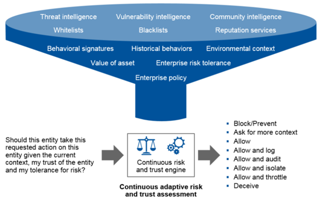
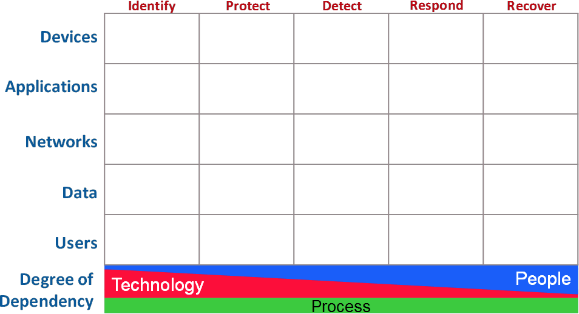
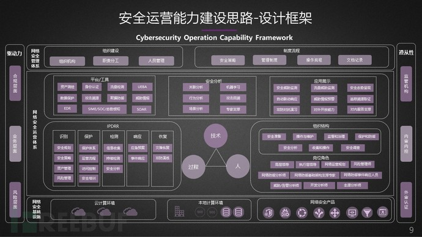
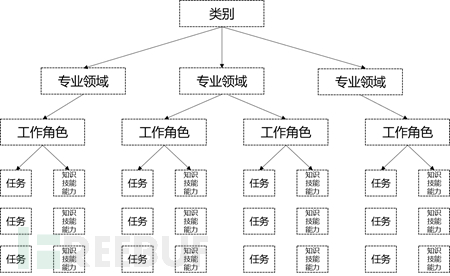
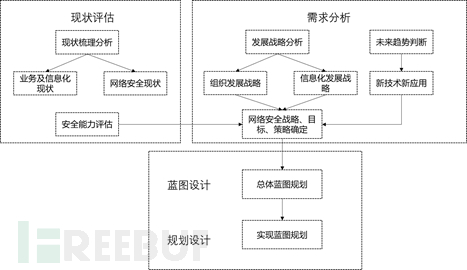
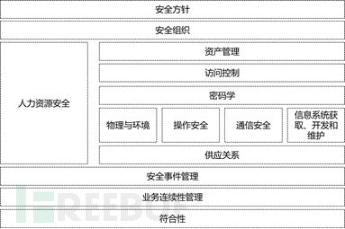
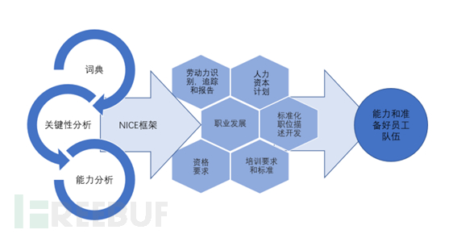

# 网络安全运营

>内容来自：Freebuf文章 [网络安全运营能力建设思路](https://www.freebuf.com/articles/es/253340.html) 

## 安全运营能力建设的意义

安全运营：指一系列规则、技术和应用的集合，用以保障组织核心业务平稳可持续运行的相关活动。

安全运营通过系统、动态、实际、基于时间且符合成本的策略与控制，达到组织和业务需要的安全服务水平。

安全运营需要明确目标，从系统性、动态性、实战性等角度进行考虑。

系统性
一是组织业务自身的系统性和完整性，二是针对防护体系的系统性和完整性。安全运营需要将构成业务系统完整运行的各个要素看成一个整体，防护体系的构建能够完整、有效的梳理并覆盖安全风险，不因遗落或木桶原理造成整体性影响。

动态性
IT技术的飞速发展使得网络攻击和防护水平能力不断提升，安全运营需要在不断迭代中提升管理和技术防护能力。同时，组织面临的网络安全风险层出不穷，除传统的外部攻击威胁，地下黑产驱动的漏洞利用，内部员工主动恶意行为都将导致组织业务系统的防护手段和方法要与时俱进，更是需要安全运营更加具有针对性，并及时调整工作流程和行为规范。

实战性
网络攻击具有突发性、隐蔽性、潜伏性、持续性等特点，安全运营也需要保证良好的网络安全攻防状态，有应对经验和攻防能力储备。安全运营团队不断进行深人思考与刻意练习，始终保持良好的预警监测、分析研判、处置总结的能力。

因此，**网络安全运营能力建设通应坚持“事先防范、事中控制、事后处置”的理念，以安全治理为核心、风险态势为导向、安全合规为基础，结合组织基础安全能力，在人、技术、过程层面不断完善组织网络安全体系，满足安全运营的系统性、动态性和实战性的需求，不断提升组织安全防御能力。**

## 安全运营能力建设的驱动力

### 合规

2017年6月正式出台《中华人民共和国网络安全法》，标志着网络安全工作已上升到国家层面，《中华人民共和国网络安全法》第一章第五条规定“采取措施，监测、防御、处置来源于中华人民共和国境内外的网络安全风险和威胁，保护关键信息基础设施免受攻击、侵入、干扰和破坏，依法惩治网络违法犯罪活动，维护网络空间安全和秩序”。第五章“监测预警与应急处置”则将监测预警机制提到了一个全新的高度，要求各行业和各领域均建立完善的网络安全监测预警机。

2019年12月1日《信息安全技术 网络安全等级保护》正式实施，宣告等级保护进入2.0时代。等级保护2.0提出网络安全战略规划目标，定级对象从传统的信息系统扩展到网络基础设施、信息系统、大数据、云计算平台、工业控制系统、物联网系统、采用移动互联技术的信息系统；网络安全综合防御体系包含安全技术体系、安全管理体系、风险管理体系、网络信任体系；覆盖全流程机制能力措施包括组织管理、机制建设、安全规划、安全监测、通告预警、应急处置、态势感知、能力建设、技术检测、安全可控、队伍建设、教育培训、经费保障。

### 业务层面

随着组织的信息化程度不断加深，IT系统的复杂度与开放度随之提升，以人工智能、大数据、云计算、边缘计算等基础的新技术带来组织业务发展的新模式，对传统的网络安全模型带来了巨大的挑战。人工智能与大数据对组织的运作基础起到了颠覆性的作用，组织以往的运营模式进入了依赖大量非结构化数据和无关数据的机器学习和深度学习建立模型的人工智能模式；而云计算和边缘计算使组织从传统的自建机房建设模式下的计算基础设施转换为集约化运营的云端以及业务成为可能，从新技术对网络安全影响的角度分析，呈现出无边界、零信任、不对称的趋势，对网络安全提出了重大的挑战。

### 风险层面
根据Verizon的全球安全事件调查报告显示，攻击者只需几个小时即可在不累积早期侦察和信息获取过程的情况下成功进行攻击和入侵。但是61%的公司或组织的安全部门需要数周甚至数月才能发现来自外部的攻击，然后需要数天至数周完成响应和修复工作。在Mandiant最新的高级安全威胁报告中公司或组织平均需要229天才能在黑暗中发现攻击者。更为令人担忧的是，只有33%的企业或组织发现了攻击本身。它是在被外部机构通知，暴露于黑暗网络甚至公共互联网后被发现的。Ponemon Institute对全球236个组织的1625起安全事件的统计数据发现，平均安全事件为43天。延迟发现和解决攻击的成本需要每天21555美元。针对全球安全现状，有权威机构大胆预测，到2020年，组织安全部门投入安全检测和响应的预算将高达60%，只是为了应对日益复杂的网络安全环境。

组织面临的常见风险：
- 看不清的资产（设备、数据、人员）
- 看不清的业务关系（业务、数据访问、第三方接入、内部主动暴露）
- 看不清潜藏的威胁（违规操作、越权访问、APT、恶意代码..)

## 安全运营能力建设总体思路

### 参考模型
近年来，一些机构纷纷提出了安全实践体系、方法论、解决方案。例如：Gartner CARTA 模型、NIST CSF 框架、OWASP 网络防御矩阵等，值得借鉴。
#### Gartner CARTA 模型
> 内容来自 [CARTA：持续自适应风险与信任评估](https://www.freebuf.com/articles/es/208206.html)

持续自适应风险与信任评估（Continuous Adaptive Risk and Trust Assessment），即 CARTA是Gartner在2018年十大安全技术趋势中首次提出，在2019年再次被列入十大安全项目，也是Gartner主推的一种应对当前及未来安全趋势先进战略方法。CARTA战略是一个庞大的体系，其包括大数据、AI、机器学习、自动化、行为分析、威胁检测、安全防护、安全评估等方面，集主流技术与一体打造出一个自适应自判断安全防护平台。

CARTA 强调对风险和信任的评估分析，这个分析的过程就是一个权衡的过程，告别传统安全门式允许/阻断的处置方式，旨在通过动态智能分析来评估用户行为，放弃追求完美的安全，不能要求零风险，不要求100%信任，寻求一种0和1之间的风险与信任的平衡。

传统安全是基于规则匹配的，应对方式也很简单，或者允许，或者拒绝，称为安全门式的防护策略。这种方式已经不适用与当前的安全环境，尤其是大型云平台。同样，也很难支持当前的企业安全需求，对于0day、APT、钓鱼邮件等威胁毫无办法，基于这种情况，CARTA战略应运而生。

风险，是指判定网络中安全风险，包括判定攻击、漏洞、违规、异常等等。持续自适应风险评估是从防护的角度看问题，力图识别出坏人（攻击、漏洞、威胁等）。

信任，是指判定身份，进行访问控制。持续自适应信任评估是从访问控制的角度看问题，力图识别出好人（授权、认证、访问）。

自适应，是指我们在判定风险（包括攻击）的时候，不能仅仅依靠阻止措施，我们还要对网络进行细致地监测与响应，这其实就是ASA自适应安全架构的范畴。另一方面，在我们进行身份与访问控制的时候，也不能仅仅依靠简单的凭据，还需要根据访问的相互联系和访问行为进行综合研判，动态赋权、变更权限。

持续，是指这个风险和信任的研判过程是持续不断，反复多次进行的。

CARTA 强调对风险和信任的评估分析，这个分析的过程就是一个权衡的过程。

CARTA的核心思想，这里用一个例子来说明一下。对于网络访问的主体（人、账户、设备或IP等），从进入网络开始便会被赋予两个数值，风险值=0.5，信任值=0.5（一下简称R/T值）。如果该主体仅是访问一些公开信息，做一些常规操作，那么他的R/T值保持不变；如果他尝试越权访问某信息，被告知没有权限不能访问，他的R/T值不变，但若是多次反复尝试越权访问，这时R/T值可能会变化（R=0.65，T=0.35），这时该主体将被系统列为需要优先监控的主体，对其部分权限进行限制，待一定事件后或者此后没有出现其他危险操作后，R/T值会恢复初始状态（R=0.5，T=0.5）。对于主体突然进行大范围端口扫描或尝试输入注入类预计，那么瞬间其R/T值将变为R=0.9，T=0.1，同时剥夺该主体所有权限，并重点监控。

这种基于动态的、自动化的、自适应的安全网络能够适应技术发展趋势，对于当前比较头痛的0day攻击、APT攻击、DDoS攻击效果明显，再配合欺骗防御式蜜网，可以让黑客无从下手，真正起到主动式防御效果，同时节省大量人力和时间，不用再去查看各类日志，对于安全事件启动应急响应预案等工作，这是传统安全无法提供的能力。

##### CARTA理论的实践可能性
先抛开要集成各种高大上的技术和数据深度分析这些难点，因为历史证明，技术难点被突破大多是时间问题，真正重要的是理论是否符合市场需求和导向，能否为社会带来价值。

安全与风险战略的核心目标是构建一个信任的和弹性的IT环境，使得企业能够顺利地、充分地参与到数字经济中去。

在数字时代的业务安全目标，除了传统的 CIA（保密、完整、可用），还包括 PSR（隐私、安全、可靠），这也是因为云大物移的影响所造成的，体现了现实与虚拟的融合。要达成上述愿景与目标，需要构建以下四种能力：程序、原则、情境、智能。同时，还要构建一个自适应的、情境感知的安全架构（包括技术、流程和服务），以及一套行之有效的治理结构和流程。

Gartner在落地方面给出了七点建议：
- 用可适应的、相互关联的安全平台替换一次性的安全门策略；
- 自适应发现、监控、访问和优先级风控，形成主动响应
- 在数字业务规划早期执行风险和信任评估；
- 用于全面、全堆栈可视性的仪器，报告敏感数据处理
- 利用分析、AI、自动化和编制来减少检测和响应时间，以及按需分配有限资源
- 架构安全应该是一个集成的、自适应可编程的系统，而非竖井
- 将持续的数据驱动的风险决策和风险责任带给业务单元和产品所有者。

#### NIST CSF 框架

旨在为寻求加强网络安全防御的组织提供指导。该框架侧重于使用业务驱动因素来指导网络安全活动和将网络安全风险视为组织风险管理流程的一部分。这个框架由三部分组成：框架核心、实现层和框架简介。框架核心是一系列网络安全活动、成果和跨部门和关键基础设施常见的信息参考。元素核心提供详细的指导，以发展个人的组织概况。

#### OWASP cyber defense matrix
OWASP提出的Cyber-defense-matrix项目，通过逻辑结构帮助了解需要组织的内容，以便在可以快速识别出哪些产品可以解决哪些问题，并可以了解给定产品的核心功能是什么。此外，“网络防御矩阵”提供了一种机制，以确保具有跨所有选项的功能，以帮助保护环境。尽管最初创建了网络防御矩阵来帮助组织安全技术，但仍发现了许多其他用例来帮助构建，管理和运行安全程序。该项目旨在捕获这些用例及其实现，以帮助安全从业人员完善其安全程序。

##### CDM的结构

有两个基本维度：
- 第一个维度由NIST CSF的5个运营功能构成：
  - IDENTITY
  - PROTECT
  - DETECT
  - RESPOND
  - RECOVER
- 第二个维度由5个需要保护的资产类组成：
  - DEVICES
  - APPLICATIONS
  - NETWORKS
  - DATA
  - USERS

两个维度组成了一个矩阵：

这个矩阵还有一个更重要的部分。在网格的底部展示了一个连续体，该连续体描述了在通过NIST网络安全框架的五个运营功能对技术，人员和流程的依赖程度。技术在识别和保护方面起着更大的作用。随着转向“检测”，“响应”和“恢复”，对技术的依赖性逐渐​​降低，而对人的依赖性也在增长。在所有五个操作功能中，对过程的依赖程度始终保持一致。这个连续体可以帮助了解在尝试解决网络安全挑战时，在依靠人员，过程和技术方面可能存在的不平衡之处。

### 总体框架

网络安全运营能力建设并非单一产品或平台的构建，而是覆盖组织全场景的安全运营体系建设。因此，需要按步骤、分阶段的逐渐完成。网络安全运营能力建设并不是一个项目，而更像是一项工程。为了有效地实践安全运营能力，形成网络安全的闭环，我们需要一个系统化的网络安全运营能力建设框架。

网络安全能力建设是在分析组织在合规层面、业务层面和风险层面所面临的挑战，结合组织网络安全目标和远景，融合业务、管理、技术、运营等方面的需求后，建设“以人为根本、以资产为核心，以数据为基础，以技术为支撑”的全面网络安全运营能力。

## 技术能力建设
安全技术能力建设工作并非从零开始，而是以组织基础设施安全建设为基础，围绕组织机构的安全目标，建立与制度流程相配套并保证有效执行的技术和工具集，技术工具建议使用标准的安全产品或平台，也可以是自主开发的组件或工具，技术能力建设需要进行整体规划和实现，且要和组织的业务系统和信息系统等进行衔接。同时，安全技术能力需要保证覆盖组织业务使用的各个场景中的安全需求。根据OWASP提出的Cyber-defense-matrix，将各项安全技术分别映射到不同层次的安全对象中。

### 资产测绘

随着组织越来越多的资产需要暴露在互联网空间，更大的网络空间暴露面带来了更多的网络空间安全威胁。特别是分支机构较多的大型组织，对资产及高危脆弱性的检查效率、准确性以及详尽的报告内容有着极高的要求，同时各监管机构要求组织能够预防并快速处置网络空间安全隐患，因此，组织需要理清资产，确定资产暴露面，快速定位并准确验证漏洞以提升网络和业务系统的健壮性和稳定性。同时，从运营者的视角出发，采用专业收集手段进行组织未知资产发现，以及对资产信息的变化和异动进行监测和管理，并分析资产间的关联性，自动梳理资产类型、服务与框架，帮助组织对资产进行透明化、智能化管理。

主要构建3个能力：
- 资产发现识别能力
资产发现能力是资产测绘的基础能力，必须在组织的某种环境或场景中发现存活资产，并且通过分析资产的所属业务属性来识别资产详情，包括资产所使用的操作系统、中间件、数据库、应用程序、开放端口以及与其他资产的关联关系等。资产发现能力还应是全面和精准的，避免因不完善的甚至错误的资产发现造成重大风险隐患。

- 资产持续监控能力
资产详细信息形成资产配置清单，这种清单并不是一成不变的，资产配置会随着业务需求的变更而不断变化，变化的范畴和频率是由业务的变更需求所引导的。要保证资产配置清单的持续有效，必须具备对资产配置变更的持续监控能力。安全运营人员一般可通过周期性资产发现和复查，及时发现资产信息的变化情况，进而对资产变更信息的确认和管理，确保后续安全运用过程中资产配置信息的准确性。

- 资产漏洞检测能力
安全运营人员通过定期的资产漏洞检测，特别是在出现0day、1day漏洞出现时，能够结合威胁情报信息全面、有效地识别资产存在的漏洞及风险情况，并利用安全运营团队技术实力和管理能力，持续进行整改加固，形成及时有效的漏洞响应处理能力。

### IAM

身份识别与访问管理IAM（Identity and Access Management）技术是一套全面建立和维护数字身份，提供有效安全的IT资源访问的业务流程和管理手段，实现组织资产统一的身份认证、授权和身份数据集中管理与控制。身份和访问管理是一套业务处理流程，也是一个用于创建、维护和使用数字身份的支持基础结构。

IAM是实现零信任网络架构的基础，组织中应用IAM主要是定义和管理个人网络用户的角色和访问权限，以及规定用户获得授权（或被拒绝授权）的条件。IAM系统的核心目标是为每个用户赋予一个身份。该数字身份一经建立，在用户的整个“访问生命周期”存续期间都应受到良好的维护、调整与监视。因此，身份管理的首要目标就是：从用户登录系统到权限授予到登出系统的整个过程中，根据需要在恰当的条件下及时赋予正确的用户对组织内适当资产的访问权。

IAM具有单点登录、强大的认证管理、基于策略的集中式授权和审计、动态授权、可管理性等功能。IAM系统为各个管理员提供了修改用户角色、跟踪用户活动、创建用户活动报告和贯彻管理策略的工具及技术。这些系统的出现就是为了能够管理整个组织内的用户访问，并确保用户活动符合组织规章制度与监管规定。

针对用户对访问组织业务服务的安全使用要求的多样性，结合访问需求和特点，IAM可以采用基于角色访问控制、基于风险的访问控制、基于属性访问控制等技术，通过制定基于主体属性和客体属性的访问控制授权策略来灵活设定用户对服务的使用权限，从而实现访问细粒度的访问控制。

### EDR
端点（PC、服务器、移动设备和嵌入式设备等）作为构建信息化网络的基本组成单元和重要元素，具有部署范围广、使用数量多、承担业务功能多样、存储重要信息数据等特点，容易成为攻击的对象。攻击者往往首先利用目标网络中的脆弱端点建立据点，再通过进一步的漏洞利用构筑长期驻留条件，最终迈向既定目标。端点检测与响应（Endpoint Detection and Response，EDR），相比于传统的端点安全防护手段，EDR一方面借助于云计算和人工智能的威胁分析来解决传统端点防护产品无法解决的APT攻击问题；另一方面重点加强自动化的智能响应能力，大大降低了应急响应的技术门槛，使其依赖系统就可以自动实现攻击阻止、隔离修复、取证分析和追踪溯源。

EDR的核心在于，一方面利用已有的黑名和基于特征的端点静态防御技术来阻止已知威胁，另一方面通过云端威胁情报、机器学习、异常行为分析、攻击指示器等方式，主动发现来自外部或内部的各类安全威胁。同时，基于端点的背景数据、恶意软件行为以及整体的高级威胁的生命周期的角度进行全面的检测和响应，并进行自动化阻止、取证、补救和溯源，从而有效地对端点进行安全防护。

在 EDR中，通常由端点和端点检测和响应中心组成，端点只具备信息上报、安全加固、行为监控、活动文件监控、快速响应和安全取证等基本功能，负责向端点检测与响应中心上报端点的运行信息，同时执行下发的安全策略和响应、取证指令等；而端点检测与响应中心负责资产发现、安全加固、威胁检测、响应取证等。

相较于传统的端点安全防御技术，EDR 借助于云计算和人工智能技术，完整覆盖端点安全防御全生命周期，主动发现和清除来自外部或内部的安全威胁，显著提升了端点应对 APT 和未知威胁的主动防御能力，将是下一代网络安全体系的重要组成部分。

### 数据保护
数据是数字经济时代最重要的生产要素之一，大数据高速发展的同时，数据破坏、泄露事件屡有发生，并且规模和严重程度越来越大，数据安全问题已成为各行业创新发展的制约因素之一。数据保护以数据为核心，聚焦数据安全生命周期，将数据生命周期的安全要求映射到数据安全实现技术上，分别对数据的采集、存储、传输、处理、交换和销毁过程域进行相应的安全控制，夯实数据安全技术底盘，构建数据安全场景落地，实现组织数据资产可视、数据血缘可溯、数据风险可控、数据威胁可管。

数据采集安全
数据采集阶段主要是在基础安全能力的基础上，增加安全验证、数据清洗、数据识别、数据标签等安全技术应对措施。

数据安全加密
数据存储隔离与加密采用前置代理及加密网关技术、应用层改造加密技术、基于文件级的加解密技术、基于视图及触发器的后置代理技术、基于表空间加密技术对数据进行加密存储；数据传输加密应明确需要进行加密传输的场景后，选择合适的加密算法对数据进行加密传输。

数据访问控制
可以采用基于角色访问控制、基于风险的访问控制、基于属性访问控制等技术，保证在数据生命周期的各个阶段和不同场景下的数据的机密性和完整性，允许合法使用者访问数据资产，防止非法使用者访问数据资产，防止合法使用者对数据资产进行非授权的操作访问。

数据泄漏防护
数据泄漏防护的核心思想就是沿着数据传递方向逐级进行防护，进而达到降低风险的效果。数据泄露防护在数据资产分类的基础上，结合组织的业务流程和数据流向，构建完善的可能导致数据泄露各个环节的安全，可以采用的主要技术包括数据加密技术、权限管控技术、基于内容深度识别的通道防护技术。

数据脱敏
为确保数据脱敏过程可控，对敏感数据采用有效脱敏技术的同时需适应业务需求，目前数据脱敏的技术主要有为基于数据失真/扰乱技术、数据加密技术和数据限制发布技术。

数据审计
数据安全审计需要由以系统为核心向以数据为核心进行转变，覆盖数据处理各参与方以及整个数据生命周期，制定覆盖系统行为和数据活动的安全审计策略与规程，明确审计对象、审计目的、审计内容、审计方法、审计频度、相关角色和职责、管理层承诺、供应链上各参与方协调、合规性分析等内容，建立数据安全审计规程与协调机制，确保审计事件的可追溯性。

数据销毁
数据销毁主要是指获得组织、用户的授权许可或请求后对数据进行清除或销毁。使用组织授权的技术和方法对敏感信息进行清除或销毁，保证无法还原，并且具备安全审计能力。

### 流量检测
高级持续网络攻击(APT攻击)能利用各种攻击手段针对特定目标实施攻击，在攻击后进行伪装，基于特征检测和行为检测的传统威胁检测手段已经越来越难以应对新型的安全攻击手法，因此需要多种基于流量的检测检测和分析技术组合应对。

病毒检测技术
通过对流量中的文件还原，将文件从传输协议中进行恢复。恢复的文件会经过多AV检测模块，对文件进行病毒查杀检测。通过威胁情报对还原的文件hash进行检测与对比，检查文件是否为流行恶意文件；通过文件规则检测，读取文件的特征，检测文件特征是否命中文件特征，对文件的特征指纹进行安全检查。

基因检测技术
传统安全威胁的检测是一种数字型检测，即使AI的检测结果也是通过值的对比来判断事件本身的安全性。但数值与数值之间的差异，容易产生误判。转换成基因图谱以后，无论文件如何改变、内容混淆，转后的图谱与已留存的家族图谱的内容几乎完全一致，误判率很低；且在家族图谱的存储过程中，过滤变化的内容，将固定不变的特征作为基因指纹，从而大大提高威胁变种的检测效率。

沙箱检测技术
沙箱是一个封闭的且独立检测环境，类似于蜜罐系统，用于检测网络攻击。沙箱技术也可以针对 0day 攻击，传统的异常检测使用的是特征检测方法，而 0day 攻击采用的是非未知的攻击技术，所以当有 0day 攻击时，使用沙箱进行检测可以提高防御入侵的能力，但被检测样本的复杂性和多样性使得沙箱检测变得非常局限。

异常检测技术
异常检测主要是识别异常活动，包括上下行数据异常流量比等行为特征。当遇到 APT 中的0day攻击时，没有异常的特征故无法检测，所以异常检测在平常首先需要采取的是对正常的网络行为建模，当检测的行为与建模行为有偏差时，就存在网络攻击。其核心是元数据的提取、对异常特征的检测和行为模式的检测。元数据包括时间、空间、流量等，用少量的数据去检测是否异常；异常特征涵盖了时间、空间、流量等基础特征，也可以用于互相计算而得出的新特征；行为模式主要是针对主机、服务器行为。

全流量检测技术
全流量是指对OSI七层协议每一层进行全方位检测。在应用层可以进行还原数据、内容，如还原下载附件，还可以还原行为。在传输层可以检测流量其是否加密，或者检测数据格式，还可以检测对消息的控制和管理。网络层是端到端的检测，可以检测数据包的大小，IP 地址等。数据链路层是单链路上的数据检测。物理层则可以用于检测帧、电流、信号等。

攻击溯源分析
网络攻击溯源通常是在网络攻击时对攻击者的查找，对应用层的ID 映射到 IP地址后，将应用层溯源转化成网络层的溯源，溯源内容包括攻击者发起的相关信息，如使用的设备、IP、邮件、日志、路由信息等等。然后可以将这些信息进行关联分析，提取特征或者找出交集，有利于对攻击源的快速定位、重建攻击链和识别攻击意图。在 APT 检测中，安全人员一般先检测出攻击或者预测出攻击，根据检测或者预测的结果进行碎片关联分析，最后查找攻击源。

### 攻击溯源
组织的攻击溯源能力是网络安全运营体系的重要组成部分，通过对资产与流量进行分析一定程度上还原攻击者的攻击路径与攻击手法，有助于提高组织主动防御的能力。攻击溯源能力应从应急响应流程为出发点，结合组织自身管理要求，构建以下能力：

事件取证能力
事件取证能力属于取证技术的一种，主要归类为信息发现技术，对能够获取的原始日志做进一步的分析和关联判断，如在入侵事件发生时段内资产的系统负荷、系统的访问记录、IP来源。同时，能够支持攻击、入侵、篡改等安全事件发生后的取证能力，包括页面内容获取与比对、文件快照等。

事件管理能力
安全事件主要由安全设备分析后上报的事件以及人工发现的安全事件，事件管理能力支持各类安全事件的集中接入和解析呈现，并能够对安全事件做初步的归一化处理，发现重大安全事件的告警和应急上报流程。

资产关联能力
资产关联能力能够与组织内的配置管理系统、资产管理系统进行资产同步，在发现安全事件告警后能够准确地定位到资产的详细信息和责任人，如安全资产的价值、安全资产所属的安全域信息，以便进一步做出应急处置判断。同时，能够与其他多个安全平台对接，实现多业务联动处置，做到人员、技术、平台多维度联动。

行为溯源能力
行为溯源属于网络追踪技术的一种形态，网络追踪技术是指通过收集分析网络中每台主机的有关信息，找到事件发生的源头，确定攻击者的网络地址以及展开攻击的路径，将攻击者在网络中的活动轨迹进行串接，通过准确分析安全事件路径，为实现近源端拦截提供技术支撑。通常的溯源路径为追踪溯源攻击主机、追踪溯源攻击控制主机、追踪溯源攻击者、追踪溯源攻击组织。

### UEBA
Gartner率先提出了用户行为分析UBA(User Behavior Analytics)的概念，旨在应对日益增长的内部威胁。后来，实体（Entity）的概念又被引入了UBA技术，并逐步演进成UEBA，其中E更多是指IT资产或设备，包括服务器、终端、网络设备等，通过对它们的行为异常分析可以发现外部或的网络攻击行为。

用户和实体行为分析是一种面向用户和实体的行为，通过对行为进行建模以创建基线，采用高级数据分析方法（如机器学习等方法）对用户和实体行为进行分析，并刻画用户和实体行为基线的技术，最后将其用于评估潜在风险。用户和实体行为分析与传统的网络安全检测手段最大的区别在于，传统的检测手段主要关注安全事件，而用户和实体行为分析是面向行为的。

用户和实体行为分析的重点在于分析用户和实体的行为，而行为分析更便于推测出用户或者实体行为的意图，可在海量的数据中发现用户和实体的可疑行为。用户和实体行为分析的数据来源包括用户信息、应用日志、设备资产信息、网络流量、主机日志和数据库日志等数据，从数据中提取用户和实体的各种行为，使用高级数据分析方法进行行为分析，并构建用户和实体的行为基线或模型，将偏离了行为基线的行为视为异常。

UEBA通过基于正常行为为人和机器行为创建基线来进行操作。使用数据科学创建用户或实体的每个适用属性的行为模型。给定足够的数据，可以识别出表示典型行为的趋势。与该基准的偏差很容易被视为异常行为和潜在威胁。UEBA可以帮助安全运营团队发现网络中隐藏的、或未知威胁，包括外部攻击和内部威胁；可以自适应动态的环境变化和业务变化；通过异常评分的定量分析，分析全部事件，无需硬编码的阈值，即使表面看起来细微的、慢速的、潜伏的行为，也可能被检测出来。

### 欺骗防御
面对各类新型的攻击手段，仅从防御者的角度出发、沿袭以往的修补漏洞、事后审计等传统网络安全防御思路已经落后，因此必须转换思路，引入更主动的、基于攻击者视角的网络安全新理念。而欺骗防御则是在这样的背景下催生的一门新兴前沿网络安全技术。欺骗防御技术是当前网络安全防御理念的一个重大转变，网络安全防御体系中的重要组成部分。与传统的“御敌于国门之外”“消灭一切漏洞和安全隐患”的安全防御理念有所不同，欺骗防御技术是一种主动式防御手段。

基于欺骗的防御技术是防御方为改变网络攻防不对称格局而引入的一种新思路，其核心思想是通过干扰攻击者的认知以促使攻击者采取有利于防御方的行动，从而记录攻击者的活动与方法、增加其实施攻击的代价、降低其攻击成功的概率。基于杀伤链攻击模型在欺骗防御中的应用如下：

侦查阶段和武器化阶段
组织需要识别和确定目标，根据目标环境决定采取的方法，如确定目标操作系统、安全防护软件、应用软件、存在的漏洞等。在此阶段可以通过隐藏操作系统类型、提供虚假设备、提供虚假服务等手段，从而误导攻击者的武器研制以挫败攻击，或将攻击者注意力转移到虚假目标上从而发现攻击。

投送阶段
在此阶段攻击者要将生成的攻击代码发送至目标系统以建立初步的立足点。常用的方法包括钓鱼邮件、水坑攻击、恶意站点等。此时，组织的网络欺骗防御与边界防御设备相结合，当边界防御设备检测到恶意特征之后则将攻击流量转移到欺骗环境，也可以通过改变组织结构外形使得攻击代码被投送到错误的目标。

漏洞利用阶段和安装阶段
在此阶段当检测到针对漏洞的利用企图时，透明的将攻击者的探测流量转移到未打补丁的诱饵，诱饵将会返回存在漏洞的响应。同时，可以在系统中留下欺骗防御技术的特征，使攻击者以为攻击行为被记录从而阻止进一步攻击动作。

命令控制与任务执行
执行的任务可以分为两种，一种是控制系统以作为跳板进一步渗透，另一种是获取系统上的数据资源。对于以控制系统为主的攻击，任务执行相当于再次发起攻击，即新一轮的侦查，通过在网络中布设欺骗防御环境可以检测到被控节点。而对于以系统数据为目标的攻击，如果攻击者访问了作为入侵指示器的数据资源同样意味着攻击暴露。

通过进行欺骗防御技术可以有效弥补传统安全防御手段应对高层次网络攻击中存在的局限性和不足，提高组织安全事件发生时的分析和响应速度。此外，捕获的攻击数据可加工形成标准的本地威胁情报输出，在其他安全设备和安全子系统中流动，增强组织原有安全体系整体防护能力。

### 威胁情报
随着新型漏洞和攻击的不断增长，网络安全面临严峻挑战。威胁情报已经成为网络空间安全对抗的重要资源，同时也是安全监测、威胁发现、主动防御、攻击溯源的能力基础。要构建“威胁情报驱动”的安全防御体系，以便能更好地实现威胁情报的收集、关联、整合、分析、生成、共享。建设以威胁情报为中心、大数据分析技术为手段、专家团队为支撑的数据驱动型动态网络安全防御思想，充分结合组织业务现状和需求，通过对内外部威胁情报的多维度分析，深度挖掘更高价值的威胁情报信息，并与组织现有业务和安全防护产品关联分析，提升发现威胁的精准度，不断优化安全防护体系，构建安全防护生态圈，有力应对网络安全威胁，形成防守和打击的合力。

威胁情报采集
依据威胁情报的核心特征，分为内部威胁情报源采集和外部威胁情报源采集。内部威胁情报针对组织内部各类基础信息，内部脆弱性信息、内部流量信息以及业务系统、网络设备、安全设备、终端等日志数据进行检测和收集，外部威胁情报源收集公开情报源、合作情报源、商业情报源提供的各类的威胁情报信息。

威胁情报分析
在大数据背景下，面对多源、海量、异构的威胁情报，威胁警报分析基于对威胁情报多维度分析，并与组织资产进行关联，实现对已知、未知威胁的研判，形成威胁情报特征库。

威胁情报应用
威胁情报应用通过采集大规模、多渠道的碎片化攻击或异常数据，集中地进行深度融合、归并和分析，形成与网络安全防护有关的威胁信息线索，并在此基础上进行主动、协同式的网络安全威胁预警、检测和响应，以降低网络安全威胁的防护成本，并提升整体的网络安全防护效率。

威胁线索追踪
威胁线索追踪是专业情报分析人员利用情报分析技术，将通过多种渠道获取的源威胁信息进行整合、萃取和提炼，最终形成有价值情报的活动，是威胁情报工作最核心的环节，包括威胁的类型分析、影响范围分析、严重程度分析等内容。威胁线索应用情报能有效还原已发生的攻击事件、评估网络安全态势并预测未来可能出现的威胁。

### SOAR
SOAR的全称是Security Orchestration, Automation and Response，意即安全编排自动化与响应。该技术聚焦在安全运营领域，重点解决安全响应的问题，最早由Gartner在2015年提出。随着安全运营技术的快速发展与演变，到了2017年，Gartner重新将SOAR定义为安全编排自动化与响应，并将其看作是安全编排与自动化、安全事件响应平台和威胁情报平台三种技术/工具的融合。Gartner认为，SOAR技术仍然在快速演化，内涵未来仍可能会变化，但其围绕安全运营，聚焦安全响应的目标不会改变。

安全编排与安全自动化是两个不同的概念。其中，安全编排是指将客户不同的系统或者一个系统内部不同组件的安全能力通过可编程接口和人工检查点，按照一定的逻辑关系组合到一起，用以完成某个特定安全操作的过程。安全自动化在这里特指自动化的编排过程，也就是一种特殊的编排。安全编排与自动化依赖于剧本，剧本是面向编排管理员的，让其聚焦于编排安全操作的逻辑本身，而隐藏了具体连接各个系统的编程接口及其指令实现。

安全事件响应平台可以可独立存在。如利用组织现有的SIEM/SOC/态势感知平台，顾名思义就是一个针对Incident进行响应和处置的平台。安全事件响应与安全编排与自动化的结合使得响应的能力获得了极大的提升。

威胁情报平台可以可独立存在，通多对多源威胁情报的收集、关联、分类、共享和集成，以及与其它系统的整合，协助用户实现攻击的阻断、检测和响应。

### SIEM/SOC/态势感知
SIEM (Security Information and Event Management，安全信息与事件管理)是软件和服务的组合，是SIM（安全信息管理）和SEM（安全事件管理）的融合体。两者的区别在 于SEM侧重于实时监控和事件处理方面，SIM侧重历史日志分析和取证方面。Gartner对SIEM进行了描述性的定义：SIEM为来自企业和组织中所有IT资源（包括网络、系统和应用）产生的安全信息（包括日志、告警等）进行统一的实时监控、历史分析，对来自外部的入侵和内部的违规、误操作行为进行监控、审计分析、调查取证、出具各种报表报告，实现IT资源合规性管理的目标，同时提升企业和组织的安全运营、威胁管理和应急响应能力。

SOC（Security Operation Center，安全运营中心）的存在是为了通过标准化和可重复的技术、流程和人员监视和保护组织的信息化资产，预防和防范敏感数据泄露。SOC 是“ 一个描述提供安全事故检测和响应服务的平台或平台的一部分的通用术语”，它通过实时监视、采集、分析各种安全设备产生的大量安全事件信息，能够准确发现安全违例的情况；另外，它还通过对安全设备的实时控制，对安全违例状况并采取有效的应对措施，以保障系统业务的持续安全运营、降低安全风险。SOC是以资产为核心，以安全事件管理为关键流程，采用安全域划分的思想，建立一套实时的资产风险模型，协助管理员进行事件及风险分析，预警管理，应急响应的集中安全管理系统。SOC是一个复杂的系统，它既有产品，又有服务，还有运维，SOC是技术、流程和人的有机结合。

态势感知早在 20 世纪 80 年代由美国空军提出，其包含感知、理解和预测三个层次。截止目前，业界对网络安全态势感知还没有一个统一全面的定义，基于美国Endsley博士的理论对网络安全态势感知做出的定义：“网络安全态势感知是综合分析网络安全要素，评估网络安全状况，预测其发展趋势，并以可视化的方式展现给用户，并给出相应的报表和应对措施。”Gartner对态势感知的定义是对威胁情报及资产漏洞信息的集成和分析，形成一幅对业务系统安全状态的准实时视图，包括四方面的能力：资产状态信息的收集：包括资产的配置状态、漏洞状态、连接情况和关键度；威胁行为信息的收集：包括外部威胁行为、用户行为、对手的信息，以及目标参数的风险级别；分析：支持风险估计、响应优先级划分、调查与即席查询；汇报：包括长期存储，以及预置和即席报表生成。

从以上的定义来看，SIEM重点在于对安全事件的感知和理解，SOC重点在于对安全事件的监测和流程化的处置，而态势感知重点在于通过大数据、机器学习等技术加深了对安全趋势的预测。而基于Gartner提出了CARTA安全体系框架，下一代安全运营的核心思想是利用安全设备、SIEM、SOC和SOAR，结合大数据分析技术、人工智能技术，寻找未知的攻击向量以及长期未检测出的攻击迹象，更加注重通过主动式、智能化的特性实现合规性。

多源的日志、流量、情报的采集和处理是下一代安全运营的基础，通过对网络系统中部署的各种主机、网络设备、安全防护产品等产生的日志、流量数据进行釆集，并结合威胁情报数据，经过预处理过程对不同角度的信息提取数据特征,进行数据归并,从而减小关联分析的数据量,提高分析的效率。

安全分析（Security Analytic）技术仍然是核心能力，Gartner认为，安全分析指对一些数据进行高级分析，以达到某种有用的安全结果。出了传统的基于规则的关联分析和基于统计的关联分析技术外，还需结合基于威胁情报的关联分析、基于情景的关联分析、基于大数据的关联分析技术等。

基于规则的关联分析
基于规则的关联分析是目前是最常用的一种关联分析模型，这种关联分析模型是指按预先内置关联规则，或者用户自定义维护的关联规则对安全事件进行分析。接收到经过范化的安全事件以后，通过事件维度与告警规则进行匹配，一旦匹配到符合条件的规则，规则就会被触发。在规则设定的时间窗口内，会将多条成功匹配规则的安全事件进行关联，并按规则设定进行告警。关联规则主要模拟攻击者攻击的行为，将采集的范化后的日志，通过有效的字段组合，进行规则模型匹配分析，基于规则的关联分析主要针对于已知安全事件的分析，还要基于组织实际网络结构，业务场景进行调整，满足企业实际环境的需求。

基于统计模型的关联分析
基于统计模型的关联是使用动态基线、基于行为的分析等模型。这种模型在用户行为异常分析中也大量使用(用户异常行为分析目前也有很多用机器学习算法来实现的。具体来说就是阈值没有办法提前知道，需要通过计算前面的一段时间得到阈值，然后根据阈值进行计算偏离的方法。

基于威胁情报的关联分析
基于威胁情报数据的关联分析，是组织安全管理平台未来的主要发展趋势，它可以大大提升安全事件分析效率和对威胁行为的检测能力和响应速度。情报数据包括IP指纹、web指纹、IP信息、域名信息、漏洞库、样本库、IP信誉、域名信誉、URL信誉、文件信誉、C&C信誉等，将情报数据与组织各类安全管理平台进行关联分析形成本地安全告警，并结合资产、风险情况判断安全告警的可信程度，过滤掉告警中的噪音事件，从而增加了本地安全告警的精准度，使得组织安全管理人员可以迅速定位威胁来源和相关联的资产和业务，并及时通过工单和处置流程进行快速响应；同时，利用威胁情报可以对攻击者进行深入分析和溯源取证。

基于情境的关联分析
基于情境的关联分析是指将安全事件与当前的实际运行的环境进行关联，根据更多业务信息，环境信息进行相关性分析，识别安全威胁。比如基于资产的关联，根据事件中的IP地址与资产的信息进行关联；比如基于漏洞的关联，将安全事件与该事件所针对的目标资产当前具有的漏洞信息进行关联；基于其他告警的关联，将安全事件与该事件所针对的目标资产当前发生的其他告警信息进行关联；基于拓扑的关联，结合网络拓扑中网络区域内的告警进行关联。

基于大数据的关联分析
基于大数据的关联分析是利用了大数据技术去处理分析数据，比如存储，检索，聚合等。利用大数据的分析能力可以分析以前由于数据太大不能分析的场景。但在大数据分析领域也有很多数据关联性分析算法：相关性分析、回归分析、交叉表卡方分析等。

在使用各种关联分析技术的基础上，采用可视化技术，将原本碎片化、零散化的行为告警、安全态势、资产管理等智能综合分析展现，形成多维度的安全状况展示，并结合SOAR等工具及时的面临的安全风险进行处置，帮助安全运营人员及时理解及定位问题，提高在风险处置环节的效率。

## 人员能力建设
“网络空间的竞争，归根结底是人才竞争”。加强网络安全人员能力建设已成为组织网络安全建设的核心需求，根据NIST Special Publication 800-181全国网络安全教育倡议（NICE）网络安全劳动力框架，组织的人员结构应包括安全准备、操作和维护、监督和治理、保护和防御、安全分析、收集和操作、安全调查，每种类型由相关专业领域组成并覆盖不同的工作角色，同时不同的工作角色需要由具备一定知识、技能和能力的人员来承当相应的任务。

### 组织结构
根据NIST Special Publication 800-181全国网络安全教育倡议（NICE）网络安全劳动力框架，组织机构的类别提供了组织总体组织结构，分别为监督和治理、安全准备、操作和维护、保护和防御、安全分析、收集和操作、安全调查，由不同的专业领域和工作角色组成。

|类别|	描述|	对应组织机构|
|-|-|-|
|安全准备|概念化，设计，采购和/或构建安全信息技术（IT）系统，并负责系统和/或网络开发的各个方面|网络安全和信息化领导小组/CEO、各业务部门、IT建设部门、安全运营部门|
|操作和维护	|提供确保有效和高效的信息技术（IT）系统性能和安全所需的支持，管理和维护|各业务部门、IT运行维护部门|
|监督和治理|提供领导，管理，指导，发展和倡导能力，以便组织可以有效地开展网络安全工作|各业务部门、IT建设部门、IT运行维护、安全运营部门|
|保护和防御|识别，分析和减轻内部信息技术（IT）系统和/或网络的威胁。|安全运营部门|
|安全分析|对传入的网络安全信息进行高度专业化的审查和评估，以确定其对情报的有用性。|安全运营部门|
|收集和操作|提供专门的拒绝和欺骗操作技能，并收集可用于开发情报的网络安全信息。|安全运营部门|
|安全调查|调查与信息技术（IT）系统，网络和数字证据相关的网络安全事件或犯罪。|安全运营部门|

不同的组织IT系统的建设、运行维护以及网络安全的责任部门有很大的差异，以上对应组织机构仅供参考。

### 专业领域
根据组织机构的类别，进一步细分为32个专业领域，每个专业领域都是网络安全和相关工作中集中工作或功能的领域，组织可以根据实际情况选择所需的专业领域或对各专业领域进行合并。

|分类|专业领域|专业领域描述|
|-|-|-|
|安全准备|风险管理|监督，评估和支持必要的文档，验证，评估和授权过程，以确保现有的和新的信息技术（IT）系统满足组织的网络安全和风险要求。 从内部和外部角度确保风险，合规性和保证的适当处理。|
|安全准备|软件开发|根据软件保证最佳实践开发和编写/编码新（或修改现有）计算机应用程序，软件或专用实用程序。|
|安全准备|系统架构|开发系统概念及开发系统开发生命周期的功能阶段; 将技术和环境条件（例如法律和法规）转化为系统和安全设计和流程。|
|安全准备|技术研发|进行技术评估和整合过程; 提供并支持原型能力和/或评估其效用。|
|安全准备|系统需求规划||协商收集和评估功能需求，并将这些需求转化为技术解决方案，提供有关信息系统适用性的指导以满足业务需求。|
|安全准备|测试和评估|开发和实施系统测试，通过应用成本效益计划，评估，验证和验证技术，功能和性能特征（包括互操作性）系统或包含 IT 的系统元素的原则和方法来评估符合规范和要求的情况。|
|安全准备|系统开发|在系统开发生命周期的开发阶段工作。|
|操作和维护|数据管理|开发和管理允许存储，查询，保护和使用数据的数据库和/或数据管理系统。|
|操作和维护|知识管理|管理和管理流程及工具，使组织能够识别，记录和访问知识资本和信息内容。|
|操作和维护|客户服务和技术支持|解决安装，配置，排除故障问题，提供查询维护和培训，通常为事件响应专业提供初始事件信息。|
|操作和维护|网络服务|安装，配置，测试，操作，维护和管理网络及其安全产品|
|操作和维护|系统管理|安装，配置，排除故障并维护服务器配置（硬件和软件）以确保其机密性，完整性和可用性。 管理账户和补丁。 负责访问控制，密码以及账户创建和管理。|
|操作和维护|系统分析|研究一个组织当前的计算机系统和程序，并设计信息系统解决方案，以帮助组织更安全，高效和有效地运作。 通过了解两者的需求和局限，将业务和信息技术（IT）融合在一起。|
|监督和治理|法律咨询和倡导|向领导层和员工就各种相关主题领域内提供合法的意见和建议。 宣扬法律和政策变更，并通过各种书面和口头工作产品代表客户提起诉讼，包括法律简报和诉讼程序。|
|监督和治理|培训、教育和意识|在相关学科领域内进行人员培训。 酌情制定，计划，协调，交付和/或评估培训课程，方法和技术。|
|监督和治理|网络安全管理|监督信息系统或网络的网络安全计划，包括管理组织内部的信息安全影响，特定计划或其他责任领域，包括战略，人员，基础设施，要求，政策执行，应急计划，安全意识和其他资源。|
|监督和治理|战略规划和策略|制定政策和计划和/或倡导改变支持组织网络空间举措或需要改变/增强的政策。|
|监督和治理|执行网络领导|监督，管理和/或领导执行网络和网络相关和/或网络运营工作的工作人员。|
|监督和治理|计划/项目管理（PMA）和收购|应用数据，信息，流程，组织交互，技能和分析专业知识以及系统，网络和信息交换能力的知识来管理采购项目。 执行管理硬件，软件和信息系统采购计划和其他计划管理政策的职责。为采用信息技术（IT）的采购提供直接支持，应用与 IT 相关的法律和政策，并在整个采购生命周期中提供与 IT 相关的指导。|
|保护和防御|网络防御分析|使用从各种来源收集的防御措施和信息来识别，分析和报告网络中发生或可能发生的事件，以保护信息，信息系统和网络免受威胁。|
|保护和防御|网络防御基础设施支持|测试，实施，部署，维护，审查和管理有效管理网络防御服务提供商网络和资源所需的基础架构硬件和软件，监控网络以主动修复未经授权的活动。|
|保护和防御|事件响应|应对相关领域内的危机或紧急情况，以缓解直接和潜在的威胁。根据需要使用缓解，准备以及响应和恢复方法，以最大限度地提高生存期，财产保全和信息安全。调查并分析所有相关的响应活动。|
|保护和防御|漏洞评估和管理|对威胁和脆弱性进行评估，确定风险可接受水平，并在运营和非运营情况下制定和/或建议适当的缓解对策。|
|安全分析|威胁分析|识别和评估网络安全罪犯或外国情报机构的能力和活动，产生调查结果以帮助初始化或支持执法和调查或活动。|
|安全分析|开发分析|分析收集到的信息以识别漏洞和潜在的利用。|
|安全分析|全源分析|分析情报社区中多个来源，学科和机构的威胁信息。在情境中合成和放置情报信息；吸取关于可能产生影响的见解。|
|安全分析|目标|应用当前对一个或多个地区，国家，非国家实体和/或技术的了解。|
|安全分析|语言分析|应用语言，文化和技术专业知识来支持信息收集，分析和其他网络安全活动。|
|收集操作|收集操作|使用适当的策略并在通过收集管理流程确定的优先级内执行收集。|
|收集操作|网络运营计划|执行深入的联合目标和网络安全规划过程。 收集信息并制定详细的操作计划和订单支持要求。针对综合信息和网络空间作战的全部业务执行战略和业务层面的规划。||
|收集操作|网络运营|执行活动收集犯罪或情报实体的证据，以缓解可能的或实时的威胁，防止外部共计或内部威胁。|
|安全调查|网络调查|全面的调查工具和流程应用策略，技巧和程序。|
|安全调查|数字取证|收集，处理，保存，分析和提供计算机相关证据，以支持网络漏洞缓解和/或犯罪，欺诈或执法调查。|

### 工作角色

工作角色是网络安全和相关工作中最详细的组合，其中包括以知识，技能和能力形式履行角色所需的属性列表以及在该角色中执行的任务。

|类别|领域|工作角色|工作角色描述|
|-|-|-|-|
|安全准备|风险管理|高层领导|高级官员或执行官，有权正式承担在组织运营（包括任务，职能，形象或声誉），组织资产，个人，其他组织和国家可接受的风险水平下运营信息系统的责任|
|安全准备|风险管理|风险管理师|对信息技术（IT）系统内部管理，运营和技术安全控制和增强控制进行独立综合评估，以确定控制的整体有效性|
|安全准备|软件开发|软件开发人员|开发，创建，维护和编写/编码新的（或修改现有的）计算机应用程序，软件或专用实用程序。|
|安全准备|软件开发|安全的软件评估|分析新的或现有的计算机应用程序，软件或专用实用程序的安全性并提供可操作的结果。
|安全准备|系统架构|系统架构师|开发并维护业务，系统和信息流程以支持企业任务需求;开发描述基线和目标体系结构的信息技术（IT）规则和要求。|
|安全准备|系统架构|安全架构师|确保在企业架构的所有方面（包括参考模型，细分市场和解决方案架构以及支持这些任务和业务流程的最终系统）充分解决保护组织的使命和业务流程所需的利益相关方安全需求。|
|安全准备|技术研发|研究和开发专家|开展软件和系统工程和软件系统研究，开发新功能，确保网络安全完全整合。开展全面的技术研究，以评估网络空间系统的潜在脆弱性。
|安全准备|系统需求规划|系统需求规划员|咨询客户以评估功能需求并将功能需求转化为技术解决方案。|
|安全准备|测试和评估|系统测试和评估专家|计划，准备并执行系统测试，根据规格和要求评估结果，并分析/报告测试结果|
|安全准备|系统开发|信息系统安全开发者|在整个系统开发生命周期中设计，开发，测试和评估信息系统安全。|
|安全准备|系统开发|系统开发者|在整个系统开发生命周期中设计，开发，测试和评估信息系统。|
|操作和维护|数据管理|数据库管理员|管理允许安全存储，查询，保护和使用数据的数据库和/或数据管理系统。|
|操作和维护|数据管理|数据分析师|检查来自多个不同来源的数据，以提供安全和隐私洞察力。设计并实现用于建模，数据挖掘和研究目的的复杂企业级数据集的自定义算法，工作流程和布局。|
|操作和维护|知识管理|知识经理|负责流程和工具的管理和管理，使组织能够识别，记录和访问智力资本和信息内容。|
|操作和维护|客户服务和技术支持|技术支持专家|根据既定或批准的组织过程组件,提供硬件和软件技术支持。|
|操作和维护|网络服务|网络运营专家|计划，实施和运营网络服务/系统，包括硬件和虚拟环境。|
|操作和维护|系统管理|系统管理员|负责设置和维护系统或系统的特定组件（例如，安装，配置和更新硬件和软件;建立和管理用户账户;监督或执行备份和恢复任务;实施操作和技术安全控制;并遵守组织安全政策和程序）。|
|操作和维护|系统分析|系统安全分析师|负责分析和开发系统安全的集成，测试，操作和维护。|
|监督和治理|法律咨询和倡导|网络法律顾问|就网络法相关主题提供法律咨询和建议。|
|监督和治理|法律咨询和倡导|隐私官/隐私合规经理|开发和监督隐私合规计划和隐私计划人员，支持隐私和安全管理人员及其团队的隐私合规性，治理/政策和事件响应需求。|
|监督和治理|培训，教育和意识|网络教育课程开发者|根据教学需求开发，计划，协调和评估网络培训/教育课程，方法和技术。|网络教师|开发并开展网络领域内人员的培训或教育。|
|监督和治理|网络安全管理|信息系统安全经理|负责项目，组织，系统或飞地的网络安全。|
|监督和治理|网络安全管理|通信安全经理|管理组织通信安全资源的个人或加密密钥管理系统的密钥管理员。|
|监督和治理|战略规划与政策|网络劳动力开发人员和经理|制定网络空间劳动力计划，战略和指导，以支持网络空间劳动力的人力，人员，培训和教育需求，并解决网络空间政策，原则，物资，部队结构以及教育和培训要求的变化。|
|监督和治理|战略规划与政策|网络政策和策略规划|制定和维护网络安全计划，战略和政策，以支持和协调组织网络安全举措和法规遵从。|
|监督和治理|行政网络领导力|执行层领导|执行决策权并为组织的网络和网络相关资源和/或运营确定愿景和方向。|
|监督和治理|行政网络领导力|项目经理|领导，协调，沟通，整合，并对项目的整体成功负责，确保与机构或企业优先事项保持一致。|
|监督和治理|行政网络领导力|IT项目经理|直接管理信息技术项目。|
|监督和治理|行政网络领导力|产品支持经理|管理现场所需的一揽子支持功能，并保持系统和组件的准备就绪和运营能力。|
|监督和治理|行政网络领导力|IT计划审计员|对IT计划或其各个组件进行评估，以确定是否符合公布的标准|
|保护和防御|网络防御分析|网络防御分析师|使用从各种网络防御工具（例如IDS警报，防火墙，网络流量日志）收集的数据来分析其环境中发生的事件，以减轻威胁。|
|保护和防御|网络防御基础设施支持|网络防御基础架构支持专家|测试，实施，部署，维护和管理基础架构硬件和软件。|
|保护和防御|事件响应|网络防御事件响应者|调查，分析并响应网络环境或飞地内的网络事件。|
|保护和防御|漏洞评估和管理|漏洞评估分析师|对网络环境内的系统和网络进行评估，并确定这些系统/网络偏离可接受配置，衡量深度防御架构针对已知漏洞的有效性。|
|分析|威胁分析|威胁/警告分析师|开发网络指标以保持对高度动态运行环境状态的认识。收集，处理，分析和传播网络威胁/警告评估。|
|分析|开发分析|开发分析师|确定通过网络收集和/或准备活动可以满足的访问和收集差距。利用所有授权资源和分析技术来渗透目标网络。|
|分析|全源分析|全源分析师|分析来自一个或多个来源的数据/信息，以开展环境准备，响应信息请求，并提交情报收集和生产要求以支持规划和运营。|任务评估专家|制定评估计划和绩效/有效性措施。根据网络活动的要求进行战略和运营效果评估。确定系统是否按预期执行，并为确定运有效性提供输入。|
|分析|目标|目标开发者|执行目标系统分析，构建和/或维护电子目标文件夹，以包括来自环境准备和/或内部或外部情报源的输入。与合作伙伴目标活动和情报组织协调，并提出候选目标进行审查和验证。|
|分析|目标|目标网络分析师|对收集和开源数据进行高级分析，以确保目标的连续性;分析目标及其活动;并开发获取更多目标信息的技术。根据对目标技术，数字网络及其应用程序的了解，确定目标如何进行通信，移动，操作和生活。|
|分析|语言分析|多学科语言分析师|应用具有目标/威胁和技术知识的语言和文化专业知识来处理，分析和/或传播从语言，语音和/或图形资料中获取的情报信息。创建并维护特定语言的数据库和工作辅助工具，以支持网络行动执行并确保关键知识共享。提供外语密集或跨学科项目的主题专业知识。|
|收集和操作|收集操作|全源收集经理|确定收集当局和环境;将优先信息要求纳入收集管理;开发符合领导意图的概念。确定可用收集资产的能力，确定新的收集能力;并构建和传播收集计划。监控任务收集的执行情况，以确保收集计划的有效执行。|
|收集和操作|网络运营规划|全源收集需求管理者|评估收集操作并开发基于效果的收集需求策略，使用可用的来源和方法来改进收集。开发，处理，验证和协调收集要求的提交。评估收集资产和收集操作的性能|
|收集和操作|网络运营规划|网络规划|制定详细的情报计划，以满足网络作战要求。与网络运营规划人员合作确定，验证和征收收集和分析要求。参与网络行动的选择，验证，同步和执行。同步情报活动以支持网络空间中的组织目标。|
|收集和操作|网络运营规划|网络运营规划|通过与其他计划者，运营商和/或分析师的合作，制定详细的计划，以管理或支持适用范围的网络运营。参与选择，验证，同步，并在网络行动执行期间实现整合|
|收集和操作|网络运营规划|合作伙伴集成规划员|致力于推动网络运营合作伙伴之间跨组织或国家边界的合作。通过提供指导，资源和协作来帮助合作伙伴网络团队的整合，以发展最佳实践并促进组织对实现综合网络行动目标的支持。|
|收集和操作|网络运营|网络运营商|进行系统的收集，处理和/或地理定位以利用，定位和/或跟踪感兴趣的目标。执行网络导航，战术取证分析，并在执行网络操作时执行|
|调查|网络调查|网络犯罪调查员|使用受控和记录的分析和调查技术识别，收集，检查和保存证据。|
|调查|数字取证|执法取证分析师|对基于计算机的犯罪行为进行详细调查，建立文件或物证，包括与网络入侵事件相关的数字媒体和日志。|
|调查|数字取证|网络防御取证分析师|分析数字证据并调查计算机安全事件以获取有用的信息，以支持系统/网络漏洞缓解。|

### 工作职责
不同角色的工作职责由其所承担的工作任务和所需的知识、技能和能力组成。任务是一项具体定义的工作，与其他确定的任务相结合，组成了特定专业领域或工作角色的工作。知识，技能和能力是执行工作角色所需要的属性，通常通过相关的经验，教育或培训来证明。

知识是直接应用于功能表现的一组信息。

技能通常被定义为执行可观察到的学习型心理行为的能力。 心理领域的技能描述了物理操纵工具或手段的能力， 如手或锤子。 网络安全所需的技能应该少依赖于对工具和工具的物理操纵，更多地依靠对组织或个人的网络安全状况产生影响的工具，框架，流程和控制。

能力是执行可观察行为或导致可观察到产品行为的能力。

从网络安全运营的角度，需要决策层、管理层、执行层，具体工作角色需要完成的任务以及所需掌握的知识、技能和能力如下：

#### 决策层
- 工作角色名称：决策层领导
- 工作职责描述：高级官员或执行官，有权正式承担在组织运营（包括任务，职能，形象或声誉），组织资产，个人，其他组织和国家可接受的风险水平下运营信息系统的责任。
- 任务：
  - 管理和批准组织相关认证体系；
  - 审核授权文件，以确认每个信息系统和网络的风险水平在可接受的范围内。
  - 为信息系统和网络建立可接受的限制
- 知识：
  - 了解组织的IT目标和网络安全目标；
  - 了解组织的核心业务/任务流程；
  - 了解风险管理流程以及组织的评估和验证要求；
  - 了解与网络安全和隐私相关的法律，法规，政策；
  - 了解网络安全失效的具体运营影响
- 技能：
  - 识别信息系统和网络的保护需求的技能；
  - 将网络安全和隐私原则应用于组织要求的技能。
- 能力：
  - 能够评估和预测满足组织目标的人力需求；
  - 能够根据支持组织网络活动的法律，法规，政策和标准制定政策，计划和战略；
  - 能够协调与其他组织职能或支持活动；
  - 能够将网络安全和隐私原则应用于组织需求。

#### 管理层

- 工作角色名称: 管理层领导
- 工作角色描述: 执行决策层制定的组织的网络安全运营的愿景和方向
- 任务
  - 获取和管理必要的资源，包括领导支持，财务资源和关键安全人员，以支持信息技术和网络安全目标，并降低整体组织风险;
  - 就网络安全计划，政策，流程，系统和要素的成本/收益分析向决策层领导提供建议;
  - 设计/整合网络战略，概述与组织战略计划相一致的愿景，使命和目标，领导并使IT安全优先事项与安全策略保持一致;
  - 与网络活动的内部和外部合作伙伴进行长期的战略规划工作，与外部组织的接口，以确保事件和其网络防御信息的适当和准确传播;
  - 执行网络安全风险评估，在发现网络安全事件或漏洞时监督或管理保护措施或纠正措施;
  - 监控和评估组织网络安全保障措施的有效性，确保提供预期的保护级别;
  - 在系统生命周期的所有阶段确定特定于信息技术（IT）系统的安全需求;
  - 领导和监督网络安全预算，人员配置和合同;
- 知识
  - 了解组织的IT目标和网络安全目标;
  - 了解组织的IT架构和网络安全安全架构;
  - 了解组织的核心业务/任务流程。
  - 了解构成网络攻击和网络攻击与威胁和漏洞之间关系的因素。
  - 了解新出现的安全问题，风险和漏洞。
  - 了解行业技术潜在的网络安全漏洞。
- 技能
  - 创建反映系统安全目标的策略的技能。
  - 熟练与包决策层领导成员在内的所有管理层进行沟通
  - 熟练掌握不断发展的技术基础设施
- 能力
  - 能够根据支持组织网络活动的法律，法规，政策和标准制定政策，计划和战略;
  - 确保信息安全管理流程的能力与战略和运营规划流程相结合;
  - 能够理解与网络及其组织影响相关的基本概念和问题;
  - 能够正确有效地确定优先次序并分配网络安全资源
#### 执行层
执行层包括网络安全运营规划师、风险管理师、漏洞分析师、网络防御分析师、网络防御基础架构支持专家、网络防御事件响应人员、威胁/警告分析师、开发分析师、全源分析师等工作角色。
##### 网络安全运营规划师

###### 工作角色名称
网络安全运营规划师

###### 工作角色描述
通过与其他计划者，运营商和/或分析师的合作，制定详细的计划，以管理或支持适用范围的网络运营。 参与定位选择，验证，同步，并使得网络操作的执行过程中的整合。

###### 任务:

- 为分析，设计，开发或获取用于实现目标的信息系统和网络提供输入。
- 评估目标漏洞和/或操作能力以确定行动方针
- 确定最适合具体网络运营目标的指标（如有效性度量）
- 制定，实施并建议对适当的计划程序和政策进行更改
- 制定，审查和实施支持网络运营的各级规划指导，确保执行和资源分配决策与组织目标保持一致 
- 识别网络安全运营规划中的差距和不足，设计，记录和验证规划文档 
- 与参与网络规划或相关领域的内部和外部合作伙伴保持关系

###### 知识

- 了解组织目标，领导优先级、决策风险，决策过程
- 了解风险管理流程，网络威胁和漏洞以及网络安全失效的具体运营影响。- 
- 了解网络法律和法律考虑及其对网络规划的影响 
- 了解与网络运营战略，政策和组织有关的现有，新兴和长期问题
- 了解组织网络运营计划，战略和资源 
- 了解组织规划概念的知识。 
- 掌握与网络运营计划相关的所需智能计划产品的知识 
- 与全面网络安全运营相关的组织结构知识，包括职能，责任和不同内部因素之间的相互关系

###### 技能

- 行政规划活动的技能，包括准备功能和具体的支持计划，准备和管理通信以及人员配置程序。 
- 制定运营进展/成功的指标的技能。 
- 创建和维护最新的规划文件和跟踪服务/生产的技能。 
- 预测可能促成领导决策的关键目标或威胁活动的技能。 
- 将操作评估程序与关键信息需求过程同步的技能。 
- 熟练开发和执行全面的网络安全操作评估程序，以评估和验证操作性能特征
- 分析和评估内部和外部合作伙伴网络安全运营能力和工具的技能

###### 能力

- 能够在协作环境中发挥作用，不断寻求与组织内部和外部的其他分析师和专家的持续磋商，以利用分析和技术专业知识.- 
- 能够应用批准的计划制定和人员配置流程
- 能够为没有先例存在的问题和情况制定或推荐计划解决方案 
- 能够解释和应用与组织网络目标相关的法律，法规，政策和指导 
- 根据需要作为计划小组，协调小组和专责小组的成员参与 
- 能够根据需求的制技术和计划信息
##### 风险管理师

###### 工作角色名称
风险管理师
###### 工作角色描述
- 对IT系统和网络的风险管理，运营和技术安全控制进行独立综合评估，以确定控制的整体有效性
###### 任务
- 为新IT系统和网络规划和执行安全授权审查和保证案例开发
- 验证信息系体/网络安全状态是按照说明实施的，文档偏差，并建议采取必要的措施来纠正这些偏差
- 为外部服务（例如，云服务提供商，数据中心）开发安全合规流程和/或审计
- 执行安全评估，找出安全架构中的差距，并制定安全风险管理计划
- 执行安全审查并确定安全体系结构中的安全漏洞，从而提出将其纳入风险缓解策略的建议。
- 每当网或系统发生重大变化时执行风险分析（例如，威胁，漏洞和发生概率） 为风险管理框架过程活动和相关文件（如系统生命周期支持计划，操作概念，操作程序和维护培训材料）提供输入。
- 验证并更新反映网络/系统安全设计功能的安全文档
- 参与风险管理流程，以提供安全风险，缓解措施和对其他技术风险的意见
- 确保针对风险评估，审计，检查等过程中发现的漏洞采取行动计划，里程碑计划或补救计划
- 确保安全要求和适当的IT政策和程序的成功实施和功能符合组织的使命和目标。
- 确保安全设计和网络安全开发活动得到适当记录（提供安全实施的功能描述）并根据需要进行更新
- 支持必要的合规活动
- 评估安全控制的有效性
###### 知识
- 了解组织的IT目标
- 了解组织的IT架构和网络安全概念、架构和参考模型
- 了解组织的核心业务/任务流程
- 了解风险管理框架（RMF）的要求
- 了解新兴的信息技术（IT）和网络安全技术
- 了解组织的信息分类程序和信息妥协程序
- 了解风险管理流程（例如评估和减轻风险的方法）
- 了解与网络安全和隐私相关的法律，法规，政策和道德
- 了解网络安全运营计划的业务连续性和灾难恢复连续性知识
- 了解网络威胁和漏洞
- 了解网络安全失效的具体运营影响
- 了解网络防御和漏洞评估工具及其功能
- 有关安全评估和授权过程的知识。
- 了解漏洞信息传播来源（例如警报，建议、公告）
- 通过使用基于标准的概念和功能评估，实施网络安全评估，监测，检测和补救工具和程序的当前行业方法的知识
###### 技能
- 进行漏洞扫描和识别安全系统漏洞方面的技能
- 确定安全系统应该如何工作的技巧（包括其弹性和可靠性能力）以及条件，操作或环境的变化如何影响这些结果。
- 网络安全和隐私原则应用于组织要求（与机密性，完整性，可用性，认证，不可否认性相关）的技能
- 识别信息系统和网络的保护需求（即安全控制）的技能
- 识别相对于系统目标的系统性能的度量或指标以及改进或纠正性能所需的行动的技能
- 识别和分类漏洞类型和相关的攻击的技能
- 识别测试和评估基础设施（人员，范围，工具，仪器）要求的技能
- 熟练管理测试资产，测试资源和测试人员，以确保有效完成测试事件
- 审查日志以确定过去入侵证据的技能
- 熟练解决和诊断网络防御基础设施异常并解决问题
- 技术整合和应用符合系统安全目标的策略
- 根据网络安全原则和原则评估安全控制的技能
- 执行影响/风险评估的技能
- 行政规划活动的技能，包括准备功能和具体的支持计划，准备和管理通信以及人员配置程序
- 分析目标或威胁来源的能力和精力的技能
###### 能力
- 能够根据漏洞和配置数据的分析识别系统安全问题。
- 能够设计有效和可靠的评估。
- 能够收集，验证和验证测试数据，分析测试数据的能力。
- 能够将数据和测试结果转化为评估结论。
- 能够识别和缓解可能影响分析的认知偏差
- 通过团队进行有效协作的能力
- 能够在协作环境中发挥作用，不断寻求与组织内部和外部的其他分析师和专家的持续磋商，以利用分析和技术专业知识
- 能够将组织动态背景下的战略，业务和技术联系起来
- 能够理解与组织过程和问题解决有关的技术，管理和领导问题
- 能够确定安全事件是否违反隐私原则或需要采取特定法律行动的法律标准
##### 漏洞分析师
###### 工作角色名称
- 漏洞评估分析师
###### 工作角色描述
- 对组织内的系统和网络进行评估，并确定这些系统/网络是否偏离可接受配置，测量深度防御架构针对已知漏洞的有效性
###### 任务
- 分析组织的网络防御政策和配置，并评估对法规和组织指令的遵守情况
- 对组织网络资产进行和/或支持授权渗透测试
- 维护可部署的网络防御审计工具包（例如专门的网络防御软件和硬件）以支持网络防御审计任务
- 保持与网络防御审计专门相关的适用网络防御政策，法规和合规性文件的相关知识
- 准备识别技术和程序结果的审计报告，并提供建议的补救策略/解决方案
- 在适当的环境下进行必要的评审
- 对相关技术重点领域（例如本地计算环境，网络和基础设施，支持基础设施和应用）进行技术（技术评估）和非技术（评估人员和运营）风险和漏洞评估
- 就选择具有成本效益的安全控制措施以降低风险（如保护信息，系统和流程）提出建议
######  知识
- 了解风险管理流程（例如评估和减轻风险的方法）
- 了解与网络安全和隐私相关的法律，法规，政策和道德
- 了解网络威胁和漏洞
- 了解网络安全失效的具体运营影响
- 了解网络流量，开放系统互连模型，信息技术基础设施库
- 了解构成网络攻击和网络攻击与威胁和漏洞之间关系的因素
- 了解不同类型的攻击
- 网络攻击者的知识
- 了解网络攻击阶段
- 有关道德黑客原则和技术的知识
- 了解基础设施支持信息技术（IT）的安全性，性能和可靠性
- 了解组织的信息分类程序和信息妥协程序
- 使用适当的工具了解数据包级分析
- 了解应用程序漏洞以及应用程序安全风险知识
###### 技能
- 进行漏洞扫描和识别安全系统漏洞方面的技能
- 熟练评估安全系统和设计的稳健性
- 模仿威胁行为的技巧
- 熟练使用渗透测试工具和技术
- 使用社会工程技术的技能
- 使用网络分析工具识别漏洞的技巧
- 审查日志以确定过去入侵证据的技能
- 进行应用程序漏洞评估的技能
- 执行影响/风险评估的技能
- 熟练掌握组织威胁环境的背景知识
- 将网络安全和隐私原则应用于组织要求（与机密性，完整性，可用性，认证，不可否认性相关）的技能。
######  能力
- 能够根据漏洞和配置数据的分析识别系统安全问题
- 能够分享有关组织威胁环境背景的有意义的见解，从而改善其风险管理姿态
- 能够将网络安全和隐私原则应用于组织需求
##### 网络防御分析师

###### 工作角色名称
- 网络防御分析师
###### 工作角色描述
- 使用从各种网络防御工具收集的数据来分析其环境中发生的事件，以减轻威胁。
###### 任务
- 为网络防御工具开发内容
- 表征和分析网络流量以识别异常活动和对网络资源的潜在威胁
- 与组织范围的网络防御人员协调以验证网络安全警报
- 确保支持网络安全的产品或其他补偿安全控制技术将已识别的风险降低到可接受的水平
- 记录并上报可能对环境造成持续和直接影响的事件（包括事件的历史，状态以及对进一步行动的潜在影响）
- 执行网络防御趋势分析和报告
- 执行安全审查并确定安全体系结构中的安全漏洞，从而提出将其纳入风险缓解策略的建议
- 根据结果或系统环境计划并建议修改或调整
- 提供与网络防御实践相关的网络事件和活动的每日总结报告
- 接收并分析来自组织内各种来源的网络警报，并确定此类警报的可能原因
- 提供可能的攻击/入侵，异常活动和误用活动的及时检测，识别和告警，并将这些事件和事件与良性活动区分开来
- 使用网络防御工具对系统活动进行持续监控和分析，以识别恶意活动
- 分析确定的恶意活动以确定利用漏洞，利用方法，对系统和信息的影响
- 确定入侵集的策略，技术和程序（TTP）
- 使用元数据识别和分析网络流量中的异常情况
- 在各种各样的源数据集（指示和警告）中进行研究，分析和关联
- 根据组织的网络事件响应计划，通知指定的管理人员，网络事故响应人员和网络安全服务提供商团队成员发生可疑的网络事件，并明确事件的历史，状态和对进一步行动的潜在影响。
- 监视外部数据源以维护网络防御威胁状态并确定哪些安全问题可能对组织产生影响
- 根据重大威胁和漏洞向领导层提供网络安全建议
- 与利益相关方合作解决网络安全事件和漏洞合规性
- 为灾难恢复，应急和运营计划的连续性提供建议和意见
###### 知识
- 了解风险管理流程（例如评估和减轻风险的方法）
- 了解与网络安全和隐私相关的法律，法规，政策和道德
- 了解网络威胁和漏洞
- 了解网络安全失效的具体运营影响
- 了解有关认证，授权和访问控制方法的知识。
- 了解网络防御和漏洞评估工具及其功能
- 了解漏洞信息传播来源（例如警报，建议公告）
- 了解事件响应和处理方法
- 网络流量分析方法的知识
- 了解新兴的信息技术（IT）和网络安全技术
- 解系统和应用程序安全威胁和漏洞
- 了解安全管理中的关键概念
- 了解构成网络攻击和网络攻击与威胁和漏洞之间关系的因素
- 知识威胁调查，报告，调查工具和法律/法规。
- 对抗战术，技术和程序的知识
- 深入防御原理和网络安全体系结构的知识
- 了解网络防御和信息安全政策，程序和法规
- 了解不同类型的攻击
- 网络攻击者的知识
- 了解网络攻击阶段
- 了解如何使用网络分析工具识别漏洞
######  技能
- 根据网络安全原则和原则评估安全控制的技能
- 执行数据包级分析技能
- 识别安全系统中的漏洞技能
- 进行趋势分析的技能
######  能力
- 使用利用各类工具识别网络入侵的能力
- 能够进行漏洞扫描并识别安全系统中的漏洞
- 能够准确完整地获取智能，评估和/或计划产品中使用的所有数据
- 确保信息安全管理流程的能力与战略和运营规划流程相结合
##### 网络防御基础架构支持专家
###### 工作角色名称
- 网络防御基础架构支持专家
###### 工作角色描述
- 测试，实施，部署，维护和管理基础架构硬件和软件。
###### 任务
- 与网络防御分析师协调，管理和管理专业网络防御应用程序的规则和签名更新对专业网络防御应用程序和系统设备执行系统管理，包括安装，配置，维护，备份和恢复
- 协助确定关键的网络防御基础设施和关键资源，确定优先次序并协调保护
- 构建，安装，配置和测试专用的网络防御硬件。
- 协助评估实施和维护专用网络防御基础设施的影响。
- 管理测试平台，测试和评估服务提供商管理的应用程序，硬件基础结构，规则/签名，访问控制和平台配置。
- 在专门的网络防御系统上创建，编辑和管理网络访问控制列表。
- 识别与实施任何网络防御工具（例如，工具和签名测试和优化）的潜在冲突。
- 对组织内的专用网络防御系统实施风险管理框架/安全评估和授权要求，并为其记录和保存记录
###### 知识
- 了解风险管理流程（例如评估和减轻风险的方法）
- 了解与网络安全和隐私相关的法律，法规，政策和道德
- 了解网络威胁和漏洞
- 了解网络安全失效的具体运营影响
- 网络流量分析知识（工具，方法，流程）
- 了解基本系统，网络和操作系统强化技术
- 了解网络安全体系结构概念，包括拓扑，协议，组件和原理
- 了解网络防御和信息安全政策，程序和法规
- 了解构成网络攻击和网络攻击与威胁和漏洞之间关系的因素
- 网络流量分析方法的知识
- 了解事件响应和处理方法
###### 技能
- 保护网络免受侵害的技巧。
- 熟练使用系统，网络和操作系统强化技术
- 熟练解决和诊断网络防御基础设施异常并解决问题
- 能力
- 能够将网络安全和隐私原则应用于组织需求
##### 网络防御时间响应人员
######  工作角色名称
- 网络防御事件响应人员
###### 工作角色描述
- 调查，分析并回应网络环境内的网络事件。
######  任务
- 协调并为企业级网络防御技术人员提供专家技术支持来解决网络防御事件
- 将事件数据关联起来以确定具体的漏洞并提出可以迅速补救的建议
- 执行来自各种来源的日志文件的分析以识别可能的网络安全威胁
- 执行网络防御事件分类，包括确定范围，紧迫性和潜在影响，确定具体的漏洞，并提出可以迅速补救的建议
- 执行初步的可靠的图像收集，并检查以识别企业系统可能的缓解/修复
- 执行实时网络防御事件处理以支持可部署的事件响应小组
- 接收并分析来自组织内各种来源的网络警报，并确定此类警报的可能原因
- 跟踪和记录从最初检测到最终解决方案的网络防御事件
- 采用经过批准的纵深防御原则和实践
- 收集入侵信息并使用发现的数据来缓解企业内潜在的网络防御事件
- 担任执法人员的技术专家和联络员，并根据需要解释事件详情
- 与各类分析师协调关联威胁评估数据
- 监视外部数据源以维护网络防御威胁状态的货币并确定哪些安全问题可能对组织产生影响
- 协调事件响应功能
###### 知识
- 了解风险管理流程（例如评估和减轻风险的方法）
- 了解与网络安全和隐私相关的法律，法规，政策和道德
- 了解网络威胁和漏洞
- 了解网络安全失效的具体运营影响。
- 运营计划的业务连续性和灾难恢复连续性知识。
- 了解事件类别，事件响应和响应时间表
- 了解事件响应和处理方法
- 了解系统和应用程序安全威胁和漏洞
- 了解构成网络攻击和网络攻击与威胁和漏洞之间关系的因素
- 了解网络防御和信息安全政策，程序和法规
- 了解不同类型的攻击
- 网络攻击者的知识
- 了解系统管理，网络和操作系统强化技术
- 了解网络攻击阶段
- 了解服务模型以及这些模型如何限制事件响应
- 了解组织的信息分类程序和信息妥协程序
######  技能
- 识别，捕获，包含和报告恶意行为的技巧
- 根据标准操作程序或国家标准保持证据完整性的技能
- 识别和分类漏洞类型和相关的攻击的技能
- 进行损害评估的技能
- 熟练使用安全事件关联工具
###### 能力
- 能够为云服务模型设计事件响应
- 使用各类工具识别和响应网络入侵的能力

##### 威胁/警告分析师
###### 工作角色名称
- 威胁/警告分析师
###### 工作角色描述
- 开发网络指标以保持对高度动态运行环境状态的认识。 收集，处理，分析和传播网络威胁/警告评估。
###### 任务
- 提供主题专业知识以制定共同的业务图景
- 提供主题专业知识以开发网络操作特定指标。
- 协助协调，验证和管理全源采集要求，计划和/或活动
- 协助确定情报收集不足
- 简要威胁和/或目标当前情况
- 与涉及相关领域的情报分析员/定位组织合作
- 进行深入的研究和分析
- 评估威胁决策过程
- 确定威胁策略和方法
- 监视并报告与指定的网络操作警告问题集有关的威胁处置，活动，策略，能力，目标等方面的变化。
- 监视并报告已验证的威胁活动
- 监视开放源代码网站是否存在针对组织或合作伙伴兴趣的恶意内容
- 监督运营环境并报告满足领导优先信息要求的对抗活动
- 酌情为关键的内部/外部利益相关者提供当前的情报支持。
- 提供必要的评估和反馈，以提高情报生产，情报报告，采集要求和作业。
- 提供信息和评估以便通知领导层和客户;发展和完善目标;支持运营计划和执行；并评估操作的效果
- 为指定的练习，计划活动和时间敏感操作提供情报分析和支持
- 及时通知可能影响组织目标，资源或能力的迫切意图或敌对意图或活动
- 报告情报衍生的重大网络事件和入侵
- 与规划人员，情报分析人员和收集经理密切合作，确保情报需求和收集计划的准确性和最新性
######  知识
- 了解风险管理流程（例如评估和减轻风险的方法）
- 了解与网络安全和隐私相关的法律，法规，政策和道德
- 了解网络威胁和漏洞
- 了解网络安全失效的具体运营影响
- 网络流量分析方法的知识
- 了解网络攻击阶段（例如，侦察，扫描，枚举，访问权限，特权升级，维护访问，网络开发）
- 攻击方法和技术的知识（DDoS，蛮力，欺骗等）
- 掌握网络情报/信息收集能力和知识库
- 对不断发展/新兴通信技术的了解
- 掌握基本的网络操作概念，术语/词典（即环境准备，网络攻击，网络防御），原理，能力，限制和效果
- 了解安全产品以及这些产品如何影响开发和减少漏洞。
- 了解如何提取，分析和使用元数据。
- 情报学科知识
- 了解情报准备环境和类似过程
- 了解预测和/或模拟威胁能力和行动的内部策略
- 掌握网络安全基础知识（例如，加密，防火墙，认证，蜜罐，边界防护）
- 了解目标或威胁使用互联网的方式
- 了解威胁和/或目标系统
######  技能
- 使用暗网进行研究的技巧
- 定义和操作环境特征所有相关方面的技能
- 能力开发或推荐分析方法或解决信息不完整或无先例存在的问题和情况
- 评估信息的可靠性，有效性和相关性方面的技能
- 识别关键目标元素的技能，包括网络领域的关键目标元素
- 识别可能危及组织和/或合作伙伴利益的网络威胁的技能
- 通过对物理，功能或行为关系的识别和链接分析，提供对目标或威胁系统的理解方面的技能
- 利用反馈改进流程，产品和服务的技能
######  能力
- 能够准确完整地获取情报，评估和/或计划产品中使用的所有数据
- 能够清晰地将知识要求转化为完善的研究问题和数据跟踪变量，以便进行查询追踪
- 能够针对信息不完整或无先例存在的问题和情况开发或推荐分析方法或解决方案
- 评估信息的可靠性，有效性和相关性的能力
- 能够评估，分析和综合大量数据（可能分散且矛盾）为高质量的融合目标/情报产品
- 能够在协作环境中发挥作用，不断寻求与组织内部和外部的其他分析师和专家的持续磋商，以利用分析和技术专业知识
- 能够识别情报差距。
- 能够识别和缓解可能影响分析的认知偏差
- 能够识别和减轻报告和分析中的欺骗行为
- 能够构建威胁场景
- 能够在所有情报领域利用多种情报来源

##### 开发分析师
###### 工作角色名称
- 开发分析师
###### 工作角色描述
- 合作确定通过网络收集和/或准备活动可以满足的访问和收集满意程度。利用所有授权资源和分析技术来渗透目标网络。
###### 任务
- 对组织网络资产进行和/或支持授权渗透测试
- 按照新的或更新的应用程序的要求执行渗透测试
- 应用和利用授权的网络功能来访问目标网络
- 应用网络收集，环境准备和参与专业知识，以实现新的开发和/或持续收集操作
- 适用并遵守适用的法律，法律，法规和政策
- 与其他内部和外部合作伙伴组织就目标访问和操作问题进行协作
- 进行独立深入的目标和技术分析，包括导致访问的目标特定信息
- 创建识别可利用的技术或操作漏洞的综合开发策略
- 检查拦截相关的元数据和内容，了解定位的重要性
- 开发人员协作，在提交工具要求中传达目标和技术知识，以加强工具开发
- 找出对目标技术理解的差距并开发创新的收集方法
- 通过地理空间分析技术识别，定位和跟踪目标
- 监视目标网络，以提供目标通信更改或处理失败的指示和警告
###### 知识
- 了解风险管理流程（例如评估和减轻风险的方法）
- 了解与网络安全和隐私相关的法律，法规，政策和道德
- 了解网络威胁和漏洞
- 了解网络安全失效的具体运营影响
- 了解收集管理流程，功能和限制
- 了解前端收集系统，包括流量收集，过滤和选择
- 了解网络攻击阶段（例如，侦察，扫描，枚举，访问权限，特权升级，维护访问，网络开发）
- 攻击方法和技术的知识（DDoS，蛮力，欺骗等）
- 掌握有关网络定位和开发的适用法律，法律，法规和政策的知识
- 了解内部和外部客户及合作伙伴组织，包括信息需求，目标，结构，能力等
- 入侵集知识
- 网络安全知识（例如，加密，防火墙，认证，蜜罐，边界保护）
- 有关目标研究的战略和工具的知识
- 了解目标情报收集和操作准备技术和生命周期
###### 技能
- 确定技术能力方面差距的技能
- 分析流量以识别网络设备的技巧
- 从数据包捕获中创建和提取重要信息的技能
- 创建采集需求以支持数据采集活动的技能
- 评估获取知识价值的技能
- 制定运营计划以支持任务和目标要求的技能
- 识别目标网络特征的技能
- 通过地理空间分析技术识别，定位和跟踪目标的技能
- 利用现有情报进行数据融合的技巧，以实现新的持续收集
- 识别和解释流量中的恶意网络活动的技能
- 技术研究流量中使用的漏洞和缺陷
###### 能力
- 能够准确完整地获取情报，评估和/或计划产品中使用的所有数据
- 能够针对信息不完整或无先例存在的问题和情况开发或推荐分析方法或解决方案
- 通过开展目标分析和收集来确定感兴趣的目标，从而扩大网络访问的能力
- 能够识别/描述目标漏洞
- 能够识别/描述对目标进行技术开发的技术/方法

##### 全源分析师
######  工作角色名称
- 全源分析师
###### 工作角色描述
- 分析来自一个或多个来源的数据/信息，以开展环境准备，回应信息请求，并提交情报收集和生产要求以支持规划和运营。
###### 任务
- 提供主题专业知识以开发网络操作特定指标
- 协助协调，验证和管理全源采集要求，计划和/或活动
- 协助确定情报收集不足
- 与涉及相关领域的情报分析员/定位组织合作
- 保持对内部和外部网络组织结构，优势以及员工和技术的使用的意识
- 评估威胁决策过程
- 识别威胁漏洞
- 确定威胁策略和方法
- 识别和评估威胁关键功能，需求和漏洞
- 监视并报告与指定的网络操作警告问题集有关的威胁处置，活动，策略，能力，目标等方面的变化
- 监视并报告已验证的威胁活动
- 监督运营环境并报告满足领导优先信息要求的对抗活动
- 制作及时的融合式全源网络操作警告的产品
- 为有效性评估提供分析和支持
- 提供必要的评估和反馈，以提高情报生产，情报报告，采集要求和作业。提供信息和评估以便通知领导层和客户;发展和完善目标;支持运营计划和执行;并评估操作的效果
- 提供意见并协助行动后有效性评估
- 为指定的练习，计划活动和时间敏感操作提供情报分析和支持
- 提供符合领导目标的目标建议
- 及时通知可能影响组织目标，资源或能力的迫切意图或敌对意图或活动
- 报告情报衍生的重大网络事件和入侵。
- 与规划人员，情报分析人员和收集经理密切合作，确保情报需求和收集计划的准确性和最新性
###### 知识
- 了解风险管理流程（例如评估和减轻风险的方法）
- 了解与网络安全和隐私相关的法律，法规，政策和道德
- 了解网络威胁和漏洞
- 了解网络安全失效的具体运营影响
- 网络流量分析方法的知识
- 了解网络攻击阶段（例如，侦察，扫描，枚举，访问权限，特权升级，维护访问，网络开发）
- 攻击方法和技术的知识（DDoS，蛮力，欺骗等）
- 了解当前基于计算机的入侵集
- 掌握网络情报/信息收集能力和知识库
- 对不断发展/新兴通信技术的了解
- 了解安全产品以及这些产品如何影响开发和减少漏洞
- 情报学科知识
- 了解预测和/或模拟威胁能力和行动的内部策略
- 了解组织层次结构和网络决策过程
- 了解目标或威胁使用互联网的方式
- 了解威胁和/或目标系统
- 了解组织特定计划，指导和授权的结构和意图
- 了解情报框架，流程和相关系统
- 了解目标发展（即概念，角色，责任，产品等）
- 了解内部和外部合作伙伴网络安全运营能力和工具
- 了解情报的可信度。
- 网络法律知识及其对网络规划的影响
######  技能
- 评估信息的可靠性，有效性和相关性方面的技能
- 识别可能危及组织和/或合作伙伴利益的网络威胁的技能
- 通过对物理，功能或行为关系的识别和链接分析，提供对目标或威胁系统的理解方面的技能
- 利用反馈改进流程，产品和服务的技能
- 分析和评估内部和外部合作伙伴网络运营能力和工具的技能
- 评估目标的参照系（例如，动机，技术能力，组织结构，敏感性）的技能
###### 能力
- 能够准确完整地获取情报，评估和/或计划产品中使用的所有数据
- 能够评估，分析和综合大量数据（可能分散且矛盾）为高质量的融合目标/情报产品
- 能够清晰地将知识要求转化为完善的研究问题和数据跟踪变量，以便进行查询追踪
- 评估信息的可靠性，有效性和相关性的能力
- 能够在协作环境中发挥作用，不断寻求与组织内部和外部的其他分析师和专家的持续磋商，以利用分析和技术专业知识
- 能够识别情报差距
- 能够识别和缓解可能影响分析的认知偏差
- 能够识别和减轻报告和分析中的欺骗行为
- 能够构建威胁场景
- 能够理解目标和效果
- 能够在所有情报领域利用多种情报来源

## 过程能力建设
过程能力建设是一个长期持续的过程，需要在组织内持续性的落实安全的相关制度和流程，并基于组织的业务变化和技术发展不断的调整和优化，安全也是一个不断螺旋上升的过程，通过持续对组织内外安全风险的监测，评估组织现有安全控制措施的有效性进行识别和判断，将技术工具与人员能力结合在组织内部的推广落地。

识别：开发组织理解管理过程，识别资产，数据和功能的网络安全风险

保护：制定并实施适当的保障措施，确保提供关键信息基础设施服务

检测：制定并实施适当的活动以确定网络安全事件的发生

响应：制定并执行适当的活动，以便就检测到的网络安全事件采取行动

恢复：制定并实施适当的活动，以维护恢复能力计划并恢复因网络安全事件而受损的任何功能或服务

### 识别
#### 安全规划

组织IT规划是在发展战略目标的指导下，在理解组织发展战略目标与业务规划的基础上，诊断、分析、评估组织管理和 IT 现状，优化组织业务流程，结合所属行业信息化方面的实践经验和对最新信息技术发展趋势的掌握，提出组织IT建设的远景、目标和战略。而网络安全与信息化是“一体之两翼 驱动之双轮”，网络安全规划自然与信息化规划密切相关。因此，网络安全规划是在理解组织信息化发展战略和目标的基础上，诊断分析目前组织网络安全现状，结合国家和行业组织安全的管理要求和对最新安全技术发展趋势的掌握，提出一段时间内其网络安全建设的愿景、目标、战略，对网络安全目标和内容进行整体规划，全面系统的指导组织信息安全建设的进程，协调发展的进行信息技术应用，以促进组织信息化战略目标的实现，最终实现组织可持续发展。

网络安全规划作为组织信息化规划的一部分，其常用的规划方法如下：

在识别组织网络安全规划的过程中，需从不同的维度遵循以下原则：

时间特性维度

网络安全规划涉及组织以往网络安全成果、目前网络安全现状以及未来网络安全的发展方向。因此从时间维度看，识别网络安全规划需要站在过去、现在和未来三个时间点进行考虑。

组织内外部环境维度

网络安全规划涉及的是组织网络安全工作的发展方向，因此识别过程必须全面分析掌握组织内部发展环境，包括业务发展趋势、信息技术发展趋势，组织所面临的机遇与挑战等。对外部环境而言，网络安全的发展趋势日新月异，行业发展趋势也随之变化，行业内领先组织的最佳实践和发展方向无疑是最佳参考。

业务需求关联维度

组织网络安全最终保障的是各项业务能够顺利安全开展。因此，识别组织安全规划需在组织业务发展战略的指导下进行，紧紧围绕保障业务开展为核心目标。

#### 安全策略

安全策略是一组规则,它们定义了一个组织要实现的安全目标和实现这些安全目标的途径。安全策略可以划分为两个部分,问题策略和功能策略。问题策略描述了一个组织所关心的安全领域和对这些领域内安全问题的基本态度。功能策略描述如何解决所关心的问题,包括制定具体的各项策略。

在识别组织安全策略的过程中，需要识别一下内容：

安全方针：安全方针指组织能够依据业务要求和相关法律、法规提供安全管理指导和支持，识别内容包括管理者承诺、安全管理方法、整体目标和范围、控制目标和控制措施的框架；重要安全策略、原则、标准和符合性要求说明；安全管理的一般和特定职责定义等。

安全组织：识别组织管理框架，包括内部组织和外部组织，内部组织包括管理承诺、安全协调、安全职责分配、设施授权过程、保密性协议、与政府部门的联系、与特定利益集团的联系以及独立审计等内容，外部组织包括与外部各方相关风险的识、处理外部各方协议中的安全问题等要求。

人力资源管理：识别组织在人员任用之前、任用中、任用终止或变化的要求。

资产管理：识别包括组织资产管理和信息分类相关的要求。

访问控制：识别组织访问控制的业务要求、用户访问管理、用户职责、网络访问控制、操作系统访问控制、应用和信息访问控制、移动计算和远程工作等要求。

密码学：识别住址使用密码控制的策略、密钥管理等要求。

物理和环境安全：识别组织安全区域和设备安全等要求。

操作安全：识别组织操作规程、恶意软件防护、备份、日志和监视、运行软件的控制、技术脆弱性管理、信息系统审计等要求。

通信安全：识别组织网络安全管理、信息传递等要求。

信息系统获取、开发和维护：识别组织信息系统的安全要求、开发和支持过程中的安全、测试数据等要求。

供应商关系：识别包括组织供应商关系的信息安全、供应商服务交付管理等要求。

安全事件管理：识别组织信息安全事件和改进的管理要求。

业务连续性管理：识别组织信息安全连续性、冗余等要求。

符合性：识别组织符合法律和合同要求、信息安全评审要求。

#### 资产管理

资产管理的过程就是将组织的业务工作这个抽象的概念逐步分解成定性、定量的资产安全性分析，或者说将组织的业务安全映射成资产的安全，使得我们能够科学的把握组织的业务安全需求及其变化。资产管理是通过资产测绘工具，由组织安全运营人员对组织的资产进行分类，进而确定组织战略、业务对资产的依赖程度，标记出资产重要性等级，并在资产发生变化时能够及时发现，调整其安全保护级别。

资产分类

根据GB/T 20984-2007 《信息安全技术 信息安全风险评估规范》中资产识别的描述，可将资产分为数据、服务、信息系统、平台或支撑系统、基础设施、人员管理等。在实际工作中，具体的资产分类方法可以根据组织的具体要求灵活把握。

资产赋值

资产管理不能从资产的原始价格角度进行管理，应从资产安全价值的角度进行分析，赋予每个资产在安全维度的价值属性，安全运营团队应从业务的角度关注组织的资产，在资产分类的基础上，组织需要建立资产与业务战略的映射起关系，进而对对资产进行赋值。一般而言，通过对资产的保密性、完整性和可用性三个最基本的安全属性进行赋值，结合业务战略对应关系，进而确定资产的重要程度级别。

资产持续监控

资产管理的信息初始化建设很重要，但资产基线建立后的变更识别维护过程，是一个更加重要的持续性过程，资产持续监控是安全运营团队利用资产测绘工具，依据已知资产分类和重要程度级别，进行全网资产侦测，识别全网全量资产，同时进行高频度的资产状态监测。依据资产更新状态，采用周期性监测的方式自动化梳理资产，基于业务视角对资产进行可视化管理，将安全风险与资产进行深度关联，建立完善的资产生命周期管理流程。

#### 风险管理

风险管理是任何组织的基本任务，它希望合理地意识到风险，如果不加以识别或监测，可能导致意外损失，甚至威胁到组织的生存。风险管理的目的是识别可信的威胁，并决定如何应对这些威胁。使用有效风险管理流程的组织经历的安全事件较少；那些确实发生的安全事件影响较小，并且组织已做好处理这些事件的准备。

风险管理是网络安全运营能力建设的基石，用于识别风险、了解其发生的可能性和对组织的潜在影响、根据既定的决策标准对这些风险做出决策，并衡量长期趋势分析和向管理层报告的安全和风险的关键属性。风险管理提供关键信息，使安全运营人员能够以最大可能降低风险的方式对资源进行优先排序。

风险管理是一种周期性的迭代活动，用于获取、分析和处理风险。根据GB/T 24364-2009 《信息安全技术  信息安全风险管理指南》中的描述，风险管理过程由一组结构化的活动组成，这些活动使组织能够系统地管理风险。与其他业务流程一样，风险管理流程因组织而异，但通常由以下活动组成：

背景建立阶段：确定风险管理的对象和范围，对涉及业务信息、文档等进行相关信息的调查分析，并准备风险管理的实施。

风险评估阶段：根据风险管理的范围识别资产，分析业务系统所面临的威胁以及脆弱性，结合采用安全控制措施，对组织所面临的风险进行综合判断，并对风险评估结果进行等级划分。

风险处理阶段：综合考虑风险控制的成本和风险造成的影响，从技术、管理、运维层面分析组织的安全需求，提出实际可行的安全措施。明确组织可接受的风险程度，采取接受、降低、规避或转移等控制措施。

批准监督阶段：包括决策和持续监督两部分。依据评估的结果和处理措施，判断能否满足组织的安全要求，决策层决定是否认可风险，并对业务相关环境的变化进行持续监督。

监控审核和沟通咨询贯穿于上述基本步骤，跟踪组织安全需求变化，对风险管理活动的过程和成本进行有效控制。

### 保护
保护体系

从网络安全的发展历程来看,除去早期以数据加密为主的机密性防护阶段,安全技术的发展可以分为三个阶段。
- 以边界保护、主机防毒为特点的传统安全防护阶段，该阶段基于传统的攻击防御的边界安全防护思路,利用经典的边界防护设备,采取堵漏洞、做高墙、防外攻等防范方法,对网络内部提供基本的安全保障；
- 以设备联动、功能融合为特点的安全免疫阶段，该阶段采用“积极防御、综合防范”的理念,结合多种安全防护思路,实现安全功能与网络设备融合以及不同安全功能的融合,使网络具备较强的安全免疫能力；
- 以信息资源保障为特点的可信阶段，可信网络基于信息资源保障的思想,通过建立统一的信任链,完善系统、人员及数据接入认证机制,保证设备、用户、应用等各个层面的可信,从而提供一个可信的网络环境,促进各种应用的发展,更好地发挥信息资源的效益。

边界防御体系最初是由美国国家安全局编制的《信息保障技术框架》中提出,其核心思想就是纵深防御战略,即采用一个多层次的、纵深的安全措施来保障网络及信息系统的安全。但随着网络安全技术的不断发展深化,单纯的层次化方法已经不能适应新的安全形势,必须以体系化思想重新定义纵深防御,形成一个纵深的、动态的安全保障框架,亦即纵深防御体系。纵深防御体系是一种网络安全防护系统设计方法论,其基本思想是综合治理,它以网络安全为中心,以多层面安全手段为基础,以流程化管控为抓手,以贯穿网络和信息系统的生命周期为管理范畴,采用等级化的思想,最终形成手段纵深、级别纵深、流程纵深的防御与保障体系。纵深防御的核心是引入安全域的概念，安全域是指实施了相同等级安全保护措施的相关联数据信息在网络系统中流动的区域范围。安全域概念强调三点：一是安全域内的数据信息必须是相关联的，比如同一应用系统内的数据信息；二是安全域内的数据信息必须是实施了相同等级安全保护措施的；三是安全域有明确的边界，数据信息基本上在边界之内流动。在特殊情况下，不同安全域之间可以交换数据信息。

随着组织的网络基础设施日益复杂，安全边界逐渐模糊。组织数字化转型推动了信息技术的快速演进，云计算、大数据、物联网、移动互联网等信息IT技术给组织带来了新的生产力，但同时也给组织网络基础设施带来了极大的复杂性。一方面，云计算、移动互联网等技术的采用让组织的人和业务、数据“走”出了组织的边界；另一方面，大数据、物联网等新技术的开放协同需求导致了外部人员、平台和服务“跨”过了组织的边界。组织复杂的网络基础设施已经不存在单一的、易识别的、明确的安全边界，或者说，组织的安全边界正在逐渐瓦解，传统的基于边界的网络安全架构和解决方案难以适应现代组织的网络基础设施。基于边界防护的网络架构假设或默认了组织内部比外部更安全，在某种程度商预设了对组织内部中的人、设备、系统和应用的信任，从而忽视组织内部安全措施的加强。随着网络攻防技术的发展，攻击者面对层次设防的网络边界，往往会放弃代价高昂的强攻手段，转而针对组织内部网络中的计算机，采取钓鱼邮件、水坑攻击等方法渗透到组织内部，轻松绕过网络边界安全防护措施进入内部，将对组织造成更大的损失。零信任对网络安全架构的思路提出了新的建议：默认情况下不应该信任网络内部和外部的任何人、设备、系统和应用，而是应该基于认证和授权重构访问控制的信任基础，并且这种授权和信任不是静态的，它需要基于对访问主体的风险度量进行动态调整。

组织安全运营团队在建立保护体系时，可根据自身业务模式按照以下步骤逐步实现：

安全需求分析

基于安全策略和安全最佳实践结合业务特点，识别组织对防护体系的要求，例如数据加密和保护要求、身份认证、会话管理、权限控制、日志和审计以及网络隔离等方面。

威胁建模分析

威胁建模是一种结构化方法，用来识别、量化并应对威胁。组织安全运营团队通过识别资产、描述架构、分解应用程序、识别威胁、归档并分类威胁、评价威胁的过程，分析组织面临的安全风险，建立威胁模型。

选择安全体系

组织安全运营团队根据安全需求分析和威胁建模结果，选择适合于组织的安全保护体系，如采用边界防护体系或在现有防护体系的基础上逐步过渡到零信任防护体系。

形成解决方案

在组织安全保护体系的框架下，根据组织安全技术能力的现状与安全要求的差距分析结果，安全运营团队形成解决方案，逐步选择安全技术产品和建设安全能力。

#### 运营流程

传统网络安全运维流程大多是仍通信网络运维流程演变而来，其主要工作目标是确保设备和系统稳定运行，内容是发现设备告警提示和故障信息，排除设备和系统敀障问题，同时对设备进行必要的策略配置，保证策略能满足业务通联需求。但随着云计算、物联网和大数据等新技术的迅猛发展和深度融合，网络安全环境发生了重大变化，业务规模不断扩大，系统关联性和结构复杂性成倍提升，各类信息和数据呈爆炸式增长，加上网络边界日益模糊等现实问题，导致网络安全威胁陡然增多，传统的设备运行维护流程已经不能确保网络安全。

为了突破安全技术运维的局限，从对安全设备、系统的运维支撑，过渡到关注安全能力的有效交付，安全运营不仅包括安全运维，而且高于安全运维，安全运营流程是在安全运维流程基础上，通过人、设备、数据和流程的有机结合，通过主动探测和动态防御，持续输出安全价值，解决安全风险、保证各类业务的实时安全稳定运行，同时通过安全运营流程的目标、活动、角色确保安全能力管控和测量。所以运营流程建设包括三方面建设：一是安全运营流程建设，二是安全运营流程执行，三是安全运营流程度量。

安全运营流程建设

为达到安全运营能力的有效交付，根据组织安全策略相应控制要求，在生命周期各阶段，梳理出需要的制度/规范文档，以风险控制点的方式来完成网络安全管理的目标。安全运营流程需要从组织层面整体考虑和设计，并形成体系框架。制度体系需要分层，层与层之间，同一层不同模块之间需要有关联逻辑，在内容上不能重复或矛盾。一般按照分为四级：

一级文件：方针和总纲是面向组织运营安全管理的顶层方针、策略、基本原则和总的管理要求等

二级文件：安全运营管理制度和办法指运营生命周期某个安全阶段或某个领域的具体规章制度要求

三级文件：安全运营各生命周期及某个安全域的操作流程、规范，及相应的作业指导书或指南，配套模板文件等

四级文件：执行安全运营管理制度产生的相应计划、表格、报告、各种运行/检查记录、日志文件等

为确保安全能力的持续、稳定运营，需建立一套基于安全运营流程的运作机制，具体包括安全事件流程、安全问题流程、安全变更流程、安全配置流程、安全发布流程、安全知识库管理流程以及安全服务台等，通过安全运营流程建设，可以提升组织的安全能力水平和提高安全运营效率，在满足组织内外部安全需求的同时，为组织提供性价比更高的安全能力支持，从而也确保安全产品的高效运转，缩减安全服务运营成本。

安全运营流程执行

基于组织安全规划和安全策略的要求，将安全运营流程分为资产梳理、安全数据接入、场景建模、威胁研判、响应处置和全局展示6个阶段。

资产梳理：资产是安全运营的核心，是安全防护的最终保护对象，资产梳理是安全运营最为关键的一步。

安全数据接入：接入网络流量日志、威胁情报、IT基础设施日志告警、漏洞等安全数据。

场景建模：根据业务和安全需求设置各种安全关联分析场景模型。

威胁研判：通过攻击链调查分析、各种安全引擎，并结合威胁情报等知识库和专家意见对威胁进行研判分析，最大限度地发现和处置风险。

响应处置：当威胁研判产生安全事件告警后，安全运营人员通过系统对产生的告警事件进行统一的响应处置。系统可提供多种响应处置方案，能够解决机构复杂、网络安全无法统一管理的问题。

全局展示：通过从宏观到微观的分析思路，采用关联分析，结合可视化技术，以安全人员的处置视角将威胁完美地呈现，从而有助于分析人员持续监控威胁、发现线索、下钻分析，进而极大地提升了威胁可视及处置的能力和效率。

安全运营流程度量

安全运营流程建设和执行的效果如何有效进行度量是体现安全运营能力的重要方面，众多安全产品运行的效能、物理、网络、主机、应用、数据、管理安全等各层次安全保护手段是否有效？今年与去年相比安全的效用、安全投资回报提高程度是多少？控制目标的覆盖率提高了多少百分点？关键过程的成熟度又提高了多少？如何将安全指标纳入到考核体系中，变被动安全为主动安全？真正使安全运营变得成熟、可视、可管理。基于以上问题提出基于关键目标指标（KGI），关键流程指标（KPI），关键成熟度指标（KCMI）的测量体系。

关键目标指标 KGI：将以关键控制目标为导向，偏向以结果为导向的测量方法。组织根据安全策略要求和实际情况有选择的圈定控制目标和权值，主要采用定量的方法来衡量。

关键过程指标KPI：将以关键过程为导向，偏向以过程为导向的测量方法，主要采用定性的方法来衡量。如关键过程是否有缺失？关键过程执行情况如何？

关键成熟度指标：将以关键控制过程为导向，偏向以过程为导向的测量方法，主要是定性的方法来衡量，如判断KPI成熟度如何？KGI的达到是预期的还是偶然的？ KPI 过程是成熟的还是杂乱无章？

#### 访问控制

问控制是保证网络安全的核心技术之一，它允许被授权的主体对某些客体进行访问，同时拒绝向非授权的主体提供服务。任何访问控制策略的建立离不开访问控制模型，需要基于一定的访问控制模型制定权限基线，常用的访问控制模型如下：

自主访问控制（DAC）

DAC 是根据自主访问控制思想建立的一种策略，允许合法用户以用户或用户组的身份访问策略规定的客体， 同时阻止非授权用户或用户组的访问，某些用户甚至还可以自主地把自己所拥有的对某客体的操作权限授予其他用户。而 DAC 根据主体的身份和授权来决定访问模式， 信息在移动过程中主体可能会将访问权限传递给其他主体，使访问权限关系发生改变。由于权限可以任意传递，一旦访问权限被传递出去将难以控制，无法阻挡特洛伊木马的攻击，给系统带来严重的安全问题。另外，如果主、客体数量过于庞大，采用 DAC 策略将带来极大的系统开销，因此其很少被应用到当今大型访问控制系统中。

强制访问控制（MAC）

MAC是一种基于格的访问控制(LBAC)或多级安全策略。MAC的本质是通过无法回避的存取限制来阻止直接或间接的非法入侵。它的两个关键规则是:不向上读和不向下写，即信息流只能从低安全级流向高安全级，任何违反非循环信息流的行为都是被禁止的。MAC系统中的主、客体都被分配了一个固定的安全属性。安全属性由策略管理员强制分配，主体不能改变自身或其他主、客体的安全属性。在实施访问控制时，系统通过对访问主体和受控对象的安全属性的级别进行比较，从而决定访问主体能否访问该受控对象。MAC保障了信息的机密性，却对完整性有所忽视。然而网络环境对信息完整性需求较高，使得MAC难以被较好地应用到当今网络中。此外，MAC对系统的授权管理比较僵硬，缺乏灵活性，应用领域较狭窄，通常只应用于对安全性需求非常高的领域。

基于角色的访问控制（RBAC）

角色是基于角色访问控制模型的核心概念，角色挖掘主要用于解决如何产生角色，并建立用户－角色、角色－权限的映射问题。相比于“自上而下”进行人为的角色设计，角色挖掘是“自下而上”地从已有的用户－权限分配关系中来自动化地实现角色定义和管理工作，以减小对管理员的依赖。因此，它能够有效缓解采用RBAC的应用中存在的过度授权和授权不足的现象。

基于风险的访问控制（BARAC）

当系统处于较为稳定的环境中时，只需要根据需求对访问控制策略进行局部调整即可保证访问生命周期的安全，但对于系统具有动态调整需求的组织而言，为了更好预估风险-利用平衡，需要根据实际需求对访问控制进行调整去适应新的环境，工作量大且不易试试。而基于风险的访问控制能够帮助组织更好的解决这类风险。基于风险的访问控制是根据访问的级别以及资产面临的风险，针对访问者对不同类型和不同等级的访问需求，综合分析访问者的角色和访问行为可能造成风险，进而判断对访问行为的允许或拒绝，实现动态地调整访问控制策略，以实现安全高效的访问控制。

基于属性的访问控制（ABAC）

基于属性的访问控制ABAC是“下一代”授权模型，在结构化语言中使用属性作为构建基石来定义并实施访问控制，提供上下文相关的细粒度动态访问控制服务。基于属性的访问控制把实体属性或实体属性组的概念贯穿于访问控制的整个过程，把所有与访问控制相关信息，例如实体采取的操作行为、访问请求及响应的时间节点、实体的地理位置当作主体、客体和环境的属性来统一建模，通过定义属性之间的关系描述复杂的授权和访问控制约束，在制定访问控制策略是不需要在根据用户的需求一个一个来制定，而是可以由主体、资源、环境、动作的属性的匹配与否来决定授权与否，具有很大的灵活性，解决了在复杂环境中的细粒度访问控制和大规模用户扩展问题。

随着网络的快速发展，各种基于互联网的新兴应用对分布式系统间互操作的需求越来越迫切。这些新的应用大多处于分布状态，需要相互协作、共享，在异构环境下需要进行跨域的安全访问。因此，需要安全运营团队基于业务关系建立动态访问控制策略，建议组织利用IAM技术工具，基于RBAC模型实现粗粒度授权，建立权限基线满足组织基本的最小授权原则，并基于主体、客体、风险和环境属性实现角色的动态映射和过滤机制，通过RBAC、BARAC、 ABAC的组合授权实现灵活的访问控制基线，基于信任等级实现分级的业务访问，同时，当访问上下文和环境存在风险时，需要对访问权限进行实时干预并评估是否对访问主体的信任进行降级。

另外，权限基线决定了一个访问主体允许访问的权限的全集，而在不同的访问时刻，主体被赋予的访问权限和访问上下文、信任等级、风险状态息息相关。因此，需要在访问控制基线之上，根据主体的信任等级和客体的安全等级实现分级访问控制策略。当主体的信任等级高于客体的安全等级时，访问权限被真正授予，否则访问请求被拒绝，从而缓解风险。根据持续信任评估，主体的信任等级会实时调整，最终实现访问权限是在访问控制基线范围内动态调整。

#### 安全培训

网络安全运营能力高低与信息系统的设计、实现、维护、管理、使用过程中每个人的防护能力密不可分，尤其是组织内部的网络安全岗位人员更应具备基本网络安全防护和应对能力。网络安全人才培养是一个跨越时间长、涉及人数多、覆盖范围广的问题，要求组织必须制定科学合理的中长期战略规划，做好顶层设计，健全人才培养体系，提升人才培养质量。

根据NIST Special Publication 800-181全国网络安全教育倡议（NICE）网络安全劳动力框架 ，网络安全运营的不同角色工作任务决定了需要具备的知识、技能、能力，组织可根据组织的实际情况，组织开展相关的安全培训。

### 检测
#### 信息收集

信息收集是检测阶段最重要的一个步骤，结合组织部署的各类安全产品，为检测与分析生成、组织和存储数据，因此，在这个阶段采取：威胁定义、量化风险、识别数据源和焦点缩小等措施塑造一个组织执行有效检测和分析的能力。

##### 威胁定义

为了实现以“威胁”为中心的安全，组织必须有一定的能力来定义面临的具体威胁，定义威胁的原则是：是否对组织资产机密性、完整性和可用性有负面的影响。在进行威胁定义时，需要是识别威胁的来源，动机、能力和频率是威胁的属性，威胁来源的不同决定所涉及威胁类别的不同。威胁来源可分为人为因素和环境因素。根据威胁的动机，人为因素又可分为恶意和非恶意两种。环境因素包括自然界不可抗的因素和其它物理因素。威胁作用形式可以是对业务或信息系统直接或间接的攻击，也可能是偶发的、或蓄意的事件。

根据GB/T 20984-2007 《信息安全技术 信息安全风险评估规》中定义的威胁来源，可以根据其表现形式将威胁主要定义为以下几类，形成威胁清单：

- 软硬件故障：对业务实施或系统运行产生影响的设备硬件故障、通讯链路中断、系统本身或软件缺陷等问题。
  - 子类：设备硬件故障、传输设备故障、存储媒体故障、系统软件故障、应用软件故障、数据库软件故障、开发环境故障等。
- 支撑系统故障：由于信息系统依托的第三方平台或者接口相关的系统出现问题。
  - 子类：第三方平台故障、第三方接口故障灯。
- 物理环境影响：对信息系统正常运行造成影响的物理环境问题和自然灾害。
  - 子类：断电、静电、灰尘、潮湿、温度、鼠蚁虫害、电磁干扰、洪灾、火灾、地震等。
- 无作为或操作失误：应该执行而没有执行相应的操作，或无意执行了错误的操作。
  - 子类：维护错误、操作失误等。
- 管理不到位：安全管理无法落实或不到位，从而破坏信息系统正常有序运行。
  - 子类：管理制度和策略不完善、管理规程缺失、职责不明确、监督控管机制不健全等。
- 恶意代码：故意在计算机系统上执行恶意任务的程序代码。
  - 子类：病毒、特洛伊木马、蠕虫、陷门、间谍软件、窃听软件等。
- 越权或滥用：通过采用一些措施，超越自己的权限访问了本来无权访问的资源，或者滥用自己的权限，做出破坏信息系统的行为。
  - 子类：非授权访问网络资源、非授权访问系统资源、滥用权限非正常修改系统配置或数据、滥用权限泄露秘密信息等。
- 网络攻击：利用工具和技术通过网络对信息系统进行攻击和入侵。
  - 子类：网络探测和信息采集、漏洞探测、嗅探（帐号、口令、权限等）、用户身份伪造和欺骗、用户或业务数据的窃取和破坏、系统运行的控制和破坏等。
- 物理攻击：通过物理的接触造成对软件、硬件、数据的破坏。
  - 子类：物理接触、物理破坏、盗窃等。
- 泄密：信息泄露给不应了解的他人。
  - 子类：内部信息泄露、外部信息泄露等。
- 篡改：非法修改信息，破坏信息的完整性使系统的安全性降低或信息不可用。
  - 子类：篡改网络配置信息、篡改系统配置信息、篡改安全配置信息、篡改用户身份信息或业务数据信息等。
- 抵赖：不承认收到的信息和所作的操作和交易。
  - 子类：原发抵赖、接收抵赖、第三方抵赖等。
- 供应链问题：由于信息系统开发商或者支撑的整个供应链出现问题。
  - 子类：供应商问题、第三方运维问题等。
- 网络流量不可控：由于信息系统部署在云计算平台或者托管在第三方机房，导致系统运行或者对外服务中产生的流量被获取，进而导致部分敏感数据泄露。
  - 子类：数据外泄等。
- 过度依赖：由于过度依赖开发商或者运维团队，导致业务系统变更或者运行，对服务商过度依赖。
  - 子类：开发商过度依赖、运维服务商过度依赖、云服务商过度依赖等。
- 数据残留：云计算平台数据无法验证是否删除，物联网相关智能电表、智能家电等数据存在设备中或者服务提供商处。
  - 子类：数据残留。
- 事件管控能力不足：安全事件的感知能力不足，安全事件发生后的响应不及时、不到位。
  - 子类：感知能力不足、响应能力不足、技术支撑缺乏、缺少专业支持。
- 人员安全失控：违背人员的可用性、人员误用，非法处理数据，安全意识不足，因好奇、自负、情报等原因产生的安全问题。
  - 子类：专业人员缺乏、不合适的招聘、安全培训缺乏、违规使用设备、安全意识不足、信息贿赂、输入伪造或措施数据、窃听、监视机制不完善、网络媒体滥用。
- 隐私保护不当：个人用户信息收集后，保护措施不到位，数据保护算法不透明，已被黑客攻破。
  - 子类：保护措施缺乏、无效，数据保护算法不当。

##### 量化威胁

一旦被确定潜在的威胁清单，安全运营团队需要将这些威胁进行优先级排序。实现排序的一种方法是结合威胁的动机、能力和频率，确定威胁发生的可能性等级。

威胁动机：根据业务在组织职能和发展战略中的定位、业务重要性和业务的经济价值，将威胁动机划分为五个不同的等级。

威胁能力：根据威胁来源的威胁能力，将威胁能力赋值划分为五个不同的等级。

威胁频率：需要综合考虑以往安全事件报告中出现过的威胁及其频率的统计；实际环境中通过检测工具以及各种日志发现的威胁及其频率的统计；实际环境中的监测数据发现的威胁极其频率的统计；近一两年来国际组织发布的对于整个社会或特定行业的威胁及其频率统计，以及发布的威胁预警。

威胁可能性等级可结合威胁发生的动机、能力、频率进行划分。

|等级|标识|定义|
|-|-|-|
|5|很高|威胁成功发生的可能性极大|
|4|高|威胁成功发生的可能性较大|
|3|中等|威胁成功发生的可能性较小|
|2|低|威胁成功发生的可能性极小|
|1|很低|威胁成功发生的可能性几乎为零|

##### 识别数据源

根据威胁可能性清单，对组织中的各类资产所提供的数据进行识别，包括全包捕获数据、会话数据、统计数据、包字符串数据、日志数据、告警数据等。

全包捕获数据：提供了两个端点之间的完全数据包统计。虽然全包捕获数据容量由于它的完整度可以变得十分庞大，但它的高粒度也为内容分析工作提供了非常有价值的信息。全包捕获数据可有组织部署的流量检测类安全产品提供。

会话数据：是两个网络设备之间行为的汇总，也称为会话或流。这个数据是最灵活、最有用的形式之一，而会话数据没有提供像全包捕获数据那么详细的信息，但它的小尺度使其可以保留更长的事件，在进行回顾性分析时，这是非常有价值的。会话数据可有组织部署的流量检测类安全产品提供。

统计数据：统计数据是对其他类型数据的组织、分析、解释和演示，可以采取很多不同形式，如统计值支持从一个标准偏差中检查异常，或者计算数据值用于确定两个实体之间随着事件推移的正负关系。

包字符串数据：是从全包捕获数据中导出的，以一种介于全包捕获数据和会话数据之间的中件数据格式存在。这种数据格式包括从指定协议报头中提取的明文字符串。其结果是，包字符串数据提供了粒度更接近于全包捕获数据的数据类型，同时保持着更容易管理的容量，并且允许增加数据保留周期。

日志数据：指由设备、系统或应用程序生成的原始日志文件，可以包括：应用程序日志、网络设备日志、安全产品日志、操作系统日志、中间件日志、数据库日志等。日志数据可由组织部署SIME/SOC/态势感知等产品收集并存储。

告警日志：当一个检测工具在任何被配置检查的数据中找出异常，其生成的通知成为警报数据。这个数据通常包含告警的说明，连同一个显示异常的数据指针。事件分析通常是基于告警数据的生成。告警数据由组织部署的各类安全产品产生。

结合威胁可能性清单和资产清单，对应识别的数据源，形成威胁与数据源对应列表，例如当文件服务器被入侵场景，当定义这个威胁时，应首先确定了这台服务器的架构、它所处的网络、谁有权限访问它、数据经它传入和流出的途径。根据这些信息，可以检查基于网络和基于主机的两个数据源，这个列表最终可能如下：

|威胁名称|威胁等级|数据源类型|数据源|
|-|-|-|-|
|文件服务器被入侵|高|基于网络|文件服务器所在VLAN-完整的数据包数据捕获;文件服务器所在VLAN-会话数据;文件服务器所在VLAN-吞吐量统计数据;安全产品-流量监测产品告警数据;安全产品-防火墙日志数据.|
|文件服务器被入侵|高|基于主机|文件服务器-操作系统的事件日志数据;文件服务器-EDR的告警数据;|

##### 焦点缩小

焦点缩小包括单独审查每个数据源，以了解其价值。在这个过程中，需要弄清哪些数据源在事件调查中会被频繁管理或引用。基于上诉文件服务器被场景，进一步细化结果如下：

|威胁名称|威胁等级|数据源类型|数据源|数据源聚焦|
|-|-|-|-|-|
|文件服务器被入侵|高|基于网络|文件服务器所在VLAN-完整的数据包数据捕获;|进入或流出文件服务器的所有端口和协议;所有流出VLAN的SMB流量.|
|文件服务器被入侵|高|基于网络|文件服务器所在VLAN-会话数据|VLAN的所有记录|
|文件服务器被入侵|高|基于网络文件服务器所在VLAN-吞吐量统计数据|文件服务器的数据吞吐量;每天、每周、每月的平均值|
|文件服务器被入侵|高|基于网络|安全产品-流量监测产品告警数据|所有网段告警;聚焦Windows系统和SMB协议的规则告警;聚焦文件服务器操作系统变更的告警;聚焦大批量或大流量的文件下载告警|
|文件服务器被入侵|高|基于网络|安全产品-防火墙日志数据|防火墙拒绝日志（外部-内部）|
|文件服务器被入侵|高|基于主机|文件服务器-操作系统的事件日志数据|系统日志数据;成功登录;失败登录;账号创建于修改;文件系统权限变更;软件安装;系统重启|
|文件服务器被入侵|高|基于主机|文件服务器-EDR的告警数据|EDR检测事件、阻止事件|

#### 持续检测

持续检测时通过对收集的数据进行检查，并根据观察到异常的事件和数据生成告警的过程，一旦检测机制生成数据提交个分析人员，检测环节即告结束，分析环节即告开始。通常是通过某种形式的签名、异常，或者基于统计的检测完成。

##### 基于威胁情报的检测

基于威胁情报的检测是方法依据威胁情报与收集数据进行对比进而确定恶意行为。威胁情报中常用到信誉度，信誉度是对某人或某物具有特殊习惯或特点的普遍性意见。实施威胁情报检测需要两种要素，首先需要一个IP或域名的威胁情报列表，可以是公开黑名单，或私有的、特定行业的、内部的列表，一旦具备了至少一个列表，就可以将其部署到某种检测方法中，使用列表中的内容实现基于威胁情报的检测。比如将恶意软件域名威胁情报列表与EDR的告警数据进行对比，可以得出资产是否存在恶意程序的威胁。

##### 基于特征的检测

基于特征的检测是安全产品常用的检测方法，特征检测又称误用检测(Misuse Detection), 它假设入侵者发出的攻击事件都可以用独立的特征描述并用一种模式将它表示出来, 防护的目标是检测主体活动是否符合这些模式。由于依据入侵模式库进行判断, 因而检测准确度较高, 并且由于检测结果有明确的参照, 也便于采取相应措施 , 但却对变形攻击的检测无能为力。其难点在于如何设计模式既能够表达入侵现象又不会将正常的活动包含进来。

##### 基于统计数据的异常检测

统计数据来源于对既有数据的收集、组织、分析、解释和呈现，基于统计数据的异常检测是假设入侵者活动异常于正常主体的活动。根据这一理念建立主体正常活动的行为档案, 如 利用组织SIME/SOC/态势感知等技术工具采集的生成各类统计数据,也可以通过观察系统并用统计的方法得出。然后将当前主体的活动状况与正常行为档案相比较, 当出现违反其统计规律时, 认为该活动可能是入侵行为。基于统计数据异常检测的难题在于如何建立正常行为档案以及如何设计统计算法, 从而不把正常的操作作为入侵或忽略真正的入侵行为。这类检测包括概率统计方法和神经网络方法。

##### 基于欺骗防御的检测

欺骗防御技术中使用较多的蜜罐，蜜罐是一种安全资源，其价值在于被探测、攻击或攻陷时掌握攻击者信息。蜜罐按照其提供的交互级别可以分为低交互蜜罐和高交互蜜罐，低交互蜜罐是由软件模拟一个或多个服务而实现的，提供的交互级别依赖于被模拟的服务及其软件自身。高交互蜜罐实际上被配置为真实系统的镜像，诱骗攻击者入侵系统，并在次期间为攻击者提供该操作系统的完全控制权限。组织在部署蜜罐时需要根据自身面临的威胁情况做出全面规划，一般需要经过确定模拟的设备和服务，确定蜜罐放置未知，建立警报和日志记录三个步骤。

#### 安全分析

分析过程是检测阶段最为重要的部分。在此过程中，分析人员取得检测机制的输出结果，从各种数据资源中采集信息，据此判断网络或网络所存储的信息是否受到损害。分析人员为实现该目标而采取的流程称为分析流程，但无论哪种分析流程都离不开输入、调查和输出，这三个元素的完成方法和组织形式即被定义为一种分析方法。在分析方法中比较常用的一种是管理调查，其流程如下：

##### 第一步：调查主要对象，对指控开展初步调查

在事件分析过程中，分析人员通常因为警报数据而得到事件通知，包括各类安全设备的警报。这类警报通常包含事件涉及的主机和警报的性质。分析人员需要对警报是否值得进一步调查做出初步判断。通常，这意味着需要仔细检查出发该警报的规则和检测机制，并确定相关流量是否真能与警报匹配。其实质就是快速地判断是否出现了误报。如果认为警报并非误报。分析人员接下来就应该开始收集警报涉及的主要对象的信息，如攻击方IP、涉及资产以及相关情报信息等。

##### 第二步：调查既往关系和当前接触情况

在此过程中，分析人员需要调查组织资产与攻击方之间的既往关系。该过程始于确定主机之间既往通信的性质，例如攻击方与组织资产之前是否有果通信，如果有，是什么端口、什么协议、涉及哪些服务等。随后，分析人员需要全面调查与初始警报有关的通信信息。此时，为了找到链接数据，需要提取多个来源的数据，并加以分析，例如采集全包捕获数据、由会话数据生成的统计数据等。有些情况下，在执行到这一步时，分析人员就可以确定是否发生了安全事件，但有些情况仍不能对事故明确判定，或者尚无法做出具体决策，就需要执行下一个步骤。

##### 第三步：调查次要对象及关系

在调查主要对象的过程中，通常会找出次要调查对象，它们是一些与指控由某种联系的对象。例如，分析人员在调查攻击者与组织资产之间的关系时，可能会发现组织资产与其他攻击者采用相同的通信方式，或该攻击者与组织其他资产的通信，这些主机都被视为次要对象。在找到次要调查对象后，分析人员应采用与调查主要对象相同的方式对其调查，其中，还要检查主要对象与次要对象之间的关系。

##### 第四步：深入调查对象和关系

对于对象及关联的调查应根据需要反复进行，可能还会引入三级甚至四级对象。随着调查的开展，分析人员应在前一步的基础之上，全面评估各个对象和各种关系，在进入下一个步骤之前，应彻底查明其对每个层次的影响。在分析结束后，分析人员能够描述出对象之间的关系以及恶意活动发生的原因。

### 响应
####  应急预案

网络安全应急预案指面对网络突发事件的应急管理、指挥、救援计划等，对包括信息系统运行在内的业务运行进行维持或恢复的策略和规程。这里的事件包括有害程序事件、网络攻击事件、信息破坏事件、信息内容安全事件、设备设施故障和灾害性事件等导致的业务中断、系统宕机、网络瘫痪等网络安全事件。为了应对各种安全风险，在一个有效的网络安全应急体系中，每种事件都要确定一种事件响应策略，即应急预案，以规定谁有启动事件的权利，并在事件发生之前建立支持性措施。网络安全应急预案的制定是一个周而复始、持续改 进的过程 , 包含应急响应预案的编制准备；编制应急预案文档；应急预案的测试、培训、演练和维护。应急预案与事件响应是相互补充与促进的关系。首先，应急预案为网络安全事件发生后的响应提供了指导策略和规程，否则，事件响应将陷入混乱，而毫无章法的应急响应 有可能造成比网络安全事件本身更大的损失。其次，事件响应可能发现事前应急预案的不足 ，从而吸取教训, 进而进一步完善应急预案。因此, 制定应急响应计划与应急响应是一个循环反复的过程。

##### 应急预案编制准备

应急预案的编制准备是编制应急响应计划文档的前期工作，风险评估、业务影响分析和制定应急响应策略三个方面组成。

风险评估目的是标识信息系统的资产价值,识别信息系统面临的自然的和人为的威胁,识别信息系统的脆弱性,分析各种威胁发生的可能性。风险评估是业务影响分析的基础。

业务影响分析是在风险评估的基础上分析各种网络安全事件发生时对业务功能可能产生的影响进而确定应急响应的恢复目标，因此它是应急预案制定前期的一项重要任务，其目的是将特定的系统组件与其提供的关键服务联系起来，并基于这些信息了解系统部件中断所产生的影响的特点，通过业务影响分析，估计业务停顿随时间而造成的损失，进而确定对企业而言比较合适的恢复时间目标。业务影响分析需要应急响应的恢复目标，包括关键业务功能及恢复的优先顺序；恢复时间范围,即恢复时间目标(RTO)和恢复点目标(RPO)的范围。

应急响应策略提供了在业务中断、系统宕机、网络瘫痪等突发重大网络安全事件发生后快速有效地恢复信息系统运行的方法。这些策略应涉及到在中确定的应急响应的恢复目标。制定应急响应策略主要需要考虑“系统恢复能力等级划分”、“系统恢复资源的要求”和“费用考虑”三个因素。组织应进行成本效益分析,以确定最佳应急响应策略。

##### 编制应急预案

编制应急预案是应急响应规划过程中的关键一步，也是应急响应工作的核心内容。应急预案文档应包含总则、角色及职责、预防和预警机制、应急响应流程、应急响应保障措施、附件六个基本要素。

总则部分提供了重要的背景或相关信息，使应急预案更容易理解、实施和维护。通常这部分包括编制目的、编制依据、适用范围、工作原则等。

组织应结合本单位日常机构建立信息安全应急响应的工作机构，并明确其职责。应急响应的工作机构由管理、业务、技术和行政后勤等人员组成，一般来说，按角色可划分为五个功能小组:应急响应领导小组、应急响应技术保障小组、应急响应专家小组、应急响应实施小组和应急响应日常运行小组等。实际中，可以不必专门成立对应的功能小组，组织可以根据自身情况由其具体的某个或某几个部门或部门中的某几个人担当其中的一个或几个角色。

预防和预警机制是一种防御性的方法，在可行和比较划算的情况下，防御性方法要比信息安全事件发生后进行应急响应更好。有很多防御性控制措施可供选择，它依赖于信息系统的类型和配置。

应急响应流程描述并规定了网络安全事件发生后应采取的工作流程和相应条款，目的是保证应急响应能够有组织的执行，从而最大程度的保证应急响应的有效性。整个应急响应流程中包含了网络安全事件通告、网络安全事件评估、应急启动、应急处置和后期处置几个部分。

应急响应保障措施是网络安全事件的重要组成部分，是保证网络安全事件发生后能够快速有效地实施应急预案的关键要素。考虑到各个组织的性质和需求可能存在很大的差异，也可以做适当调整，但人力保障、物质保障和技术保障这三个大的方面是必要的。

##### 应急预案的测试、培训、演练和维护

为了检验应急响应计划的有效性，同时使相关人员了解应急预案的目标和流程，熟悉应急响应的操作规程，组织还应按照一定的要求对急响应计划进行测试、培训、演练和维护。

预案的测试是有效的应急预案的关键要素。测试能确定和解决计划的缺陷，还协助评估和应急人员快速有效实施应急预案。每一个网络安全应急预案要素都应该得到测试，以确保各个恢复规程的正确性和计划整体的有效性。

预案的培训是对测试的补充。培训至少每年举办一次，拥有预案规定职责的人员应该在接受相应的培训，最终应使得他们能够无需实际文档的协助就能够执行相应的恢复规程。这在网络安全事件影响造成的最初几个小时里由于无法获得书面或电子版本的应急预案的情况下具有非常重要的意义。

预案的演练对运营人员来说是有益的，这样可以使他们做好准备并有时间对工作负荷进行优化调整。

由于业务需要的转移、技术的更新或新的内外政策会造成信息系统的频繁变化，应急预案的定期检查和更新是至关重要的，应作为机构变化管理过程的一部分以确保新的信息能够被添加进来，应急响应措施能够根据需要被修订。预案应该至少每年进行一次针对正确性和完整性的检查，在计划的任何部分发生重大变化时也应该进行，这是一项基本的要求。某些部分应该得到更频繁的检查，如联络清单。根据信息系统类型和重要程度的不同，对预案内容和规程的评估可能会更加频繁。

#### 事件响应

事件响应通常是指一个组织为了应对各种突发意外事件的发生所做的准备以及在事件发生后采取的措施和行动。事件响应的对象则是针对安全事件。所谓安全事件是计算机系统和网络上数据和信息的保密性、完整性，以及信息、应用、服务和网络等的可用性受到影响的事件。事件响应的内容则是针对安全事件的响应。所谓事件响应，指的是安全事件发生后采取的措施和行动。这些措施和行动通常是用于阻止该事件的发展和扩大，降低事件带来的负面影响。在安全事件的处置过程中，事件响应流程尤为重要，但是要对一个安全事件做出合理的、准确的、高效的响应判断则不是一件简单的事情，这不仅需要决策人员具有高层次的技术知识背景和丰富的安全处置经验，还需要做好充足的技术监测准备以及各方人员的紧密协作。合理的应急流程往往是经过实践检验的、切实有效的处理方式，对于不同的安全事件能够寻找处置共性，逐步实现处置标准化。安全事件的响应通常分为6个阶段，分别为准备、检测、抑制、根除、恢复、总结。

事件响应是安全运营能力的重要体现方式之一，为有效解决大量的安全事件需要安全分析师的介入，造成运营成本高、安全响应慢的问题，可通过大数据、机器学习、UEBA、SOAR、威胁情报等技术和工具，结合自动化流程和安全运营团队，打造“威胁感知、分析定位、智能决策、响应处置”的快速安全闭环能力，帮助组织打提升安全运营和安全管理效率、展现安全成果，最终实现“自动响应闭环、持续安全运营”的目标。

基于SOAR的安全编排、自动化与响应技术，通过四步即可制定安全响应策略来实现安全事件的自动响应及联动处置。

##### 事件定义

由于不同类型的安全事件处置流程有不同的步骤和方法，因此，在进行事件响应的自动化编排之前，需要根据应急预案自定义各类剧本Playbook，来应对众多不同安全事件处置中复杂的问题。

##### 联动响应

通过部署于边界和内网的各类安全威胁检测产品，结合威胁情报并同步至SIME/SOC等平台，利用机器学习与关联分析、UEBA等技术，全面发现已知/未知安全威胁。通过大量基于SOAR的自动响应策略以及事先自定义好的自动响应策略，联动边界防护组件、主机检测响应组件，实现主动化的处置。形成实现全面、及时、主动化防御整体能力。

##### 自动化处置

利用SOAR联动组织现有电子化工单系统，能够打造线上电子化的安全事件处置流程。对于大多数常见的安全事件，可通过事先定义的基于SOAR的自动响应策略来处理。而对于复杂的高级威胁事件、高危漏洞事件等需要通过人手动处置的事件，则通过生成事件处置工单并配合电子流程进行工单下发、确定责任人、处置进度和状态、处置结果反馈等全流程处理和可视。

##### 效果评估

组织可根据安全运营指标考核体系预先设置需要展现的工作成果，实现自动化输出和运营工作相关的绩效指标，如风险主机处置率、事件处置率、漏洞修复率、整体风险指数等，最终将需要处理的事件和已处理事件的数量、处理进度等情况，进行汇总综合展示。在考核指标体系设计方面，可根据银行实际情况设置终端、网络、系统、业务等维度的指标，以满足不同需求场景及安全工作目标的设定。

### 恢复
#### 灾难恢复

随着信息技术的发展和信息化的不断深入，特别是数据集中和业务集中以及由此产生的对信息系统越来越强的依赖性，导致信息系统相关事件对组织业务运营的影响越来越严重，从而使信息系统灾难备份和恢复越来越成为组织需要迫切解决的问题之一。对组织而言，信息系统失效无疑是一场灾难。在这种情况下，组织的业务无法正常运作，甚至可能陷入完全瘫痪。然而，有许多因素威胁着信息系统的正常运转，大到自然灾害，小到失窃、断电乃至运营人员误操作，都会影响系统的正常运转甚至造成整个系统完全瘫痪。当且仅当组织在灾难前或灾难后采取了必要的措施后，组织可以改变这种情况。业务持续性计划和灾难恢复计划服务确保组织业务持续的生存性。

灾难恢复规划是为了减少灾难带来的损失和保障信息系统所支持的关键业务功能在灾难发生后能及时恢复和继续运作所做的事前计划和安排。灾难恢复预案/计划是定义信息系统灾难恢复过程中所需的任务、行动、数据和资源的文件，用于指导运营团队在预定的灾难恢复目标内恢复信息系统支持的关键业务功能。灾难恢复能力是在灾难发生后利用灾难恢复资源和灾难恢复预案及时恢复和继续运作的能力。业务连续性规划是灾难事件的预防和反应机制，是一系列实现制定的策略和规划，确保组织在面临突发的灾难事件时，关键业务功能能够持续运作、有效地发挥作用，以保证业务的正常和连续，不仅包括对信息系统的恢复，还包括关键业务运作、人员及其他重要资源等的恢复和持续。业务连续性预案/计划是在主备就绪方面所开发、编制和维护的程序和信息的文件集，用于在事件中使组织能够继续交付其关键服务，通常包括业务恢复计划、运行连续性计划、事件响应计划、应急响应计划和灾难恢复计划等。业务连续性管理是保护组织的利益、声誉、品牌和价值创造活动，找出对组织有潜在影响的威胁，提供建设组织有效反应恢复能力的框架的整体管理过程，包括组织在面临灾难时对恢复和连续性的管理，以及为保证业务连续性计划或灾难恢复预案的有效性的培训、演练和检查的全过程。

信息系统的灾难恢复工作，不仅包括灾难恢复规划和灾难备份中心的日常运行，还包括灾难发生后的应急响应、关键业务功能在灾难备份中心的恢复和重续运行，以及生成系统的灾后重建和回退工作，还涉及突发事件的应急响应。其中灾难恢复规划是灾难恢复管理工作中最重要的一项工作，是其他灾难恢复工作基础。组织应对灾难恢复规划这些工作本身有适当的管理，如应评估灾难恢复规划过程本身的风险、筹备所需资源、确定详细任务及时间表、监督和管理规划活动、跟踪和报告任务进展和对问题和变更进行管理。另外，灾难恢复的外部协作，也是确保信息系统能够及时有效恢复的因素之一，最后，组织灾难恢复的等级评定、灾难恢复预案的制定，应按有关规定进行审计和备案。

组织灾难恢复规划是一个周而复始、持续改进的过程，包括以下4个阶段：灾难恢复需求分析、灾难恢复策略制定、灾难恢复策略实现、灾难恢复预案的制定和管理：

##### 灾难恢复需求分析

灾难恢复需求分析主要包括风险分析、业务影响分析和确定灾难恢复目标三个子步骤。确定灾难恢复目标，是根据风险分析和业务影响分析的结果，确定灾难恢复目标，包括：关键业务功能及恢复的优先级顺序；灾难恢复时间范围，即RTO和RPO两个指标要求。

##### 灾难恢复策略制定

制定灾难恢复策略，即要明确需要各项灾难恢复资源的获取方式，以及对各项灾难恢复资源的具体要求（即需要具备的灾难恢复能力级别）。组织应根据灾难恢复需求/目标，按照灾难恢复资源的成本与风险可能造成的损失之间取得平衡的原则，确定每项关键业务功能的灾难恢复策略，不同的业务功能可采取不同的灾难恢复策略。首先，要明确所需的灾难恢复资源，通常将灾难恢复资源分为7大类，即数据备份系统、备用数据处理系统、备用网络系统、备用基础设施、专业技术支持能力、运行维护管理能力和灾难恢复预案。其次，要明确灾难恢复资源的获取方式；最后，明确对灾难恢复资源的具体要求。

##### 灾难恢复策略实现

在制定灾难恢复策略后，就要实现灾难恢复策略。灾难恢复策略实现通常包括选择和建设灾难备份中心、实现灾难备份系统技术方案、实现专业技术支持能力和实现运行维护管理能力4个步骤。选择和建设灾难备份中心应根据风险评估结果，避免灾难备份中心与生成中心同时遭受同类风险，具备数据备份和灾难恢复所需的通信、电力等资源；实现灾难备份系统技术方案主要经过技术方案的设计、技术方案的验证、确认和系统开发，系统安装和测试；实现专业技术支持能力，组织应根据灾难恢复策略的要求，获取对灾难备份系统的技术支持能力，定期对运营人员进行技能的教育和培训；实现运行维护管理能力，为了实现灾难恢复目标，灾难备份中心应建立各种操作规程和管理制度，用于保证数据备份的及时性和有效性，备用数据处理系统和备用网络处于正常状态，并于生产系统的参数保持一致，有效的应急响应、处理能力。

##### 灾难恢复预案的制定和管理

灾难恢复预案制定和管理是灾难恢复规划的重要内容，包括二方面的工作，第一，制定灾难恢复预案，灾难恢复预案的制定应遵守完整性、易用性、明确性、有效性和兼容性原则；第二，教育、培训和更新维护灾难恢复预案。

#### 攻防演练

网络安全攻防演练是在真实的网络环境中进行攻击、防御，发现并解决存在的安全问题，为提升网络与信息安全保障能力积累经验。攻防演练既要做到对业务系统具有破坏性，又不影响整体信息系统的正常使用；既有危害性，又具有可控性。为了达到攻防演练力求实效、管控有序，造成的风险降到最低，需要对实战演练进行认真部署。常态化网络安全攻防演练的组织一般分为四个阶段：

组织策划阶段：此阶段明确演练最终实现的目标，组织策划演练各项工作，形成可落地、可实施的攻防演练方案，并需得到领导层认可。

前期准备阶段：在已确定实施方案基础上开展资源和人员的准备，落实人财物。

实战攻防演练阶段：是整个演练的核心，由组织方协调攻防两方及其他参演单位完成演练工作，包括演练启动、演练过程、演练保障等。

演习总结阶段：先恢复所有业务系统至日常运行状态，再进行工作成果汇总，为后期整改建设提供依据。

网络安全攻防演练可以采用以下四种模式：

- 单对单对抗模式

参演队员以自己的计算机作为阵地，攻击目标是其他参演队员的计算机。在演练过程中每位队员既是攻击者也是防御者。

- 单向攻击对抗模式

演练过程中，攻击方进攻防守方控制的阵地网络，目标是控制阵地网络中某些网络节点，防守方在阵地网络中进行操作系统加固和网络结构、安全性升级。

- 高地抢夺模式

高地网络是精心设计的，网络结构复杂，节点中存在多种考察点。参演队员将个人计算机接入网络，以高地网络为目标，搜索目标网络的位置，探索目标网络中网络节点的脆弱点，攻击直至占有该网络。

- 阵地互攻击模式

每位参演队员都有属于自己的阵地网络，并且所有的阵地网络完全相同。演练过程中，各位队员需要防护自己的网络同时侵占其他队员的网络。在此过程中，参演队员同时具有攻击者和防守者的角色，需要首先挖掘并修复己方阵地网络中的漏洞，同时攻击他方阵地网络中的漏洞。

网络攻防实战演练，能够发现组织在安全意识、技术措施和应急协调等方面的不足，树立安全防护一盘棋的意识，促进网络安全与应用安全的融合、促进网络安全运营部门与业务部门的合作，逐步制定和完善从演练策划、组织实施、评价总结、案例分析和持续优化的一整套网络安全攻防演练体系。增强应急响应意识，进一步完善安全事件应急处置预案，提升安全事件应急处置能力，以达到快速响应、准确定位、及时恢复的高效处置目标，有效提升组织网络和系统安全保障能力。

## 总结
网络安全运营的基本原则是，网络是动态的、开放的，安全运营也必须符合动态性和开放性这一要求，要能随着业务系统的发展和变化，不断调整防护的重点和优先级。这就要求网络安全防护不能再仅仅满足合规性需求，还必须具有扩展性和对抗性，以切实应对各种内部和外部的攻击。在各类应用快速扩张的网络环境中，通过安全运营，防护体系要能具备持续不断的漏洞发现和修补能力，要能在各类攻击过程中保持业务持续稳定运行；通过安全运营持续的安全评估，安全防护设备能具备灵活部署性和联动能力，安全运营的持续动态性，就是为了应对不断变化的安全威胁，通过不断改变和优化组织的网络安全防护机构，使得网络安全防护更加具有实时性和有效性。

安全运营能力建设核心价值是提升运营效率、提升安全效果、体现安全绩效、缓解合规压力，通过建设安全技术能力、安全人员能力、安全过程能力的建设，打造技术、流程、人员各部分的能力并形成有机结合的整体，实现组织现有安全运营效率和安全建设效果的提升，有效体现了安全部门和安全工作人员的价值，满足国家法律法规和标准规范中对网络安全运营管理方面的要求，提升组织的整体安全能力。