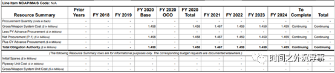
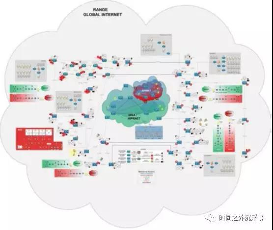
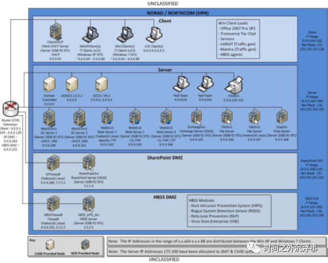

# 靶场（Cyber Range）综述

> 内容来源：https://mp.weixin.qq.com/s/B_oA7FCkFnRj4WOyVeFGmA

## 背景
近年来，全球逐渐兴起以网络空间靶场（Cyber Range）等信息安全和网络空间安全等新理论的革新研究与应用推广。

世界各国均高度重视网络空间靶场建设工作，在这一方面，美国走在了世界的前列，除了建成多个小型网络空间靶场外，业已开展国家级的网络空间靶场建设，并建立了基于全美“广域分布、逻辑一体”的庞大联合靶场测试群。

美国建设国家网络空间靶场引起了各国高度重视。英、德、俄、日、韩、法、澳、瑞典等国为保持其优势，借鉴美国经验建设了同类项目，作为支撑网络空间安全技术演示验证、网络武器装备研制试验的重要工具。

全球各大安全公司及新兴创新公司均不同程度地设计研发面向不同应用场景的网络靶场产品及方案。

## 概念

从理论设计到实际部署，网络空间靶场将作为支撑网络空间技术验证、网络武器装备试验、攻防对抗演练和网络风险评估的重要基础设施，成为新兴网络安全战略、专业人才队伍建设的重要支撑手段。

## 发展历程
网络空间靶场从概念形成到目前的成熟体系，历经了一段时间的探索。

大概在1998年左右（经过资料查证，美军于1998年的《Joint Doctrine for Information Operations》中明确提出了建立信息作战靶场的概念和路线图建议），美军为满足信息安全力量建设需要，着手规划启动信息安全靶场建设。该靶场即为美军联合参谋部联合信息作战靶场（JIOR）。该靶场从目前公开可查的资料上看，应是属于最早成体系化和平台化发展的靶场。**在这之前，所有的针对信息安全的试验测试和安全研究均基于实验室测试环境，一是不具备体系化和平台化特征，二是尚无网络空间领域或数字领域“靶场”的明确概念。**

随着形势和任务变化，美军诸多军兵种也逐渐兴建各自的小型网络测试靶场，最具代表性的事件是2008年美国国防部国防高级研究计划局(DARPA)牵头建立的国家网络空间靶场NCR，首次提出建立大型的国家级网络空间靶场。以此为契机，在学术界、工业界等相关的网络空间靶场理论和体系框架也随之进入探索试验的快车道。这个时间段内虚拟化技术以及由此形成的云计算、大数据、软件定义网络等蓬勃式发展，为网络空间靶场的迅速落地提供了坚实的实现和发展技术前提。这个时期的网络空间靶场逐渐从军队走向学术界和工业界，并不断发展出系列军民融合靶场、虚实结合靶场、民用测试靶场、商业网络靶场等。

直至目前，各国军事网络空间靶场正在向成为全频谱信息安全/网络空间靶场的目标迈进。**全频谱网络空间靶场是指包含了全部网络空间内容的数字靶场，如互联网、工控网、卫星网、电信网、物联网、电磁网、无线网、天地一体化网络等所有的网络通讯类型，以及由此涉及和涵盖的网络、计算机、移动设备、多媒体、传感器、无人系统、智能设备等所有可见终端类型。**如我们所见，在人工智能、数字孪生等新兴技术，万事万物互联发展的今天，全频谱网络空间靶场将模拟和仿真我们的整个现实世界，并将现实世界映射至全频谱网络空间靶场用于网络空间安全技术验证、网络武器装备试验、攻防对抗演练和网络风险评估等试验演训。

### 美军典型靶场发展现状
靶场概念最先源于美军网络安全攻防建设引申而出。研究美军的网络空间靶场发展思路及具体过程，以期了解和研判美军当前的网络空间靶场发展态势。

从公开资料研究显示，目前美军大型的网络空间靶场主要由美军战略司令部和美军国防部主要协同管理，而从美军战略司令部分离出来的美军网络司令部现目前尚未从美军战略司令部和美军国防部手中接过各大网络空间靶场的管辖权。目前在美军战略司令部手中的美军大型网络靶场包括美军战略司令部联合网络空间靶场（JCOR），在美军国防部管辖下的大型网络空间靶场包括弗吉尼亚州美军联合参谋部J7联合信息作战靶场（JIOR）、美军国家网络靶场（NCR）、美军国防信息系统局赛博安全靶场（CSR）以及隶属于美军联合参谋部J6的指挥、控制、通信和计算评估（C4AD）靶场。除了上述靶场以外，美各军兵种还根据自身需求建立了各自的靶场，包括：海军的战术赛博靶场、陆军赛博靶场、海军网络空间作战靶场（NCOR）等。

美国防部管辖的四大网络空间靶场，除NCR外，还包括C4 Assessment Division(C4AD) 、DoD CybersecurityRange（美军国防信息系统局赛博安全靶场）、Joint IO Range(JIOR)等，四大靶场使命和能力对比如下：

#### 指挥控制通信和计算机评估部 C4 Assessment Division(C4AD)

##### 使命
C4AD在持续的C4环境中评估现有和新兴的命令、控制、通信和计算（C4）功能，以实现满足联合作战需求的可互操作和集成的解决方案。复制联合作战人员、C4系统和解决这些系统之间的互操作性。
##### 能力

- C4AD可以连接到美军联合参谋部联合信息作战靶场（JIOR）或以独立模式运行。
- 用实际的硬件和软件复制可操作的命令和控制（C2）环境，从而能够评估系统和系统间的互操作性、操作能力、过程合规性以及技术适用性，以确认准备就绪情况。
- C4AD具有结合培训练习和测试事件来完成测试和培训以及认证目标的经验。

#### 美国防部赛博安全靶场（IAR/CSR）、美国国防信息系统局赛博安全靶场 CSR

> 内容来源：https://mp.weixin.qq.com/s/rijHYfo6jmaRHfQmi3XwGw

##### 使命

**提供持久的环境以支持测试和评估、演训、培训和教育**。

模拟全球信息网格（GIG）及其服务，支持信息保障（IA）和计算机网络防御（CND）试验演训，培训官兵的信息保障能力，进行新型技战术测试评估
##### 能力
•美军国防信息系统局赛博安全靶场可以独立运行，或者指挥官/服务/机构（CC/S/A）及其各自的网络环境也可以通过以下方式连接到该靶场：
o美军联合参谋部联合信息作战靶场（JIOR）
o通过Internet和国防研究与工程网络（DREN）的虚拟专用网（VPN）连接。
•专注于网络安全和计算机网络防御的持久环境。
•模拟全球信息网格（GIG）及其服务。
•持信息保障（IA）和计算机网络防御（CND）试验演训。
•服务包括流量生成、可配置的用户仿真。可以在环境中模拟恶意软件、间谍软件和BOTnet并将其用于混淆培训环境。

##### CSR背景

美国国防部在2018年依据美国白宫公布的《国家网络战略》（National CyberStrategy），制定其《国防部网络战略》（Department ofDefense Cyber Strategy），**阐明落实网络战略目标的五大路线：建立致命战力、网络空间竞争与吓阻、强化同盟并吸引新合作伙伴、部内组织改革、以及人才培育**。依循此路线，美国国防部在其网络战略中，亦**明确指出三个作战概念，遂行网络作战：收集情报、为危机或冲突时所需的军事网络作战能力进行准备、「前沿防御」（Defend forward）以从源头破坏或终止恶意网络行动（disrupt or haltmalicious cyber activity at its source）**。新的作战概念「前沿防御」，意味着美国会采取更具攻击性的手段进行防御，此概念势必透过网络任务部队的编制、演训等来实施，为此美军已实施网络空间靶场综合体及网络作战平台“统一平台”等实施载体，CSR作为网络空间靶场综合体的一部分，本小节将介绍美国国防部赛博安全靶场。

##### 基本情况

CSR全称是DoD Cyber SecurityRange，中文简称赛博安全靶场，是美国国防部国防信息系统局组织建设的一个**专门模拟仿真美军国防网络环境的测试与评估靶场**，是美国国防部四大靶场之一。美军国防信息系统局赛博安全靶场（CSR）前身是2010年美军组建的信息保障/计算机网络防御靶场（DoD IA/CND Range，IAR），以下简称IAR靶场。后来根据使命任务及作战演训需要，以及**2014年美军将“信息保障”重新定义为“赛博安全”，将“全球信息栅格GIG”变更为“国防部信息网络”**，该靶场的名称也随之变更为美国国防部赛博安全靶场（CSR）或美军国防信息系统局赛博安全靶场。同时，作为美国国家网络空间靶场综合体计划的一部分，美军国防信息系统局赛博安全靶场（CSR）同时也和国防部的其他三大靶场如JIOR、NCR以及C4AD靶场进行互联互通和资源共享。

**全球信息栅格（GIG）的普遍互连性使其日益成为网络攻击新的源头，对攻击者的吸引力日益增加**，美军为保障全球信息栅格（GIG）的信息安全，着手准备建立针对全球信息栅格（GIG）的模拟仿真靶场，以研究和测试全球信息栅格（GIG）信息保障和防御技术，并更好的保护全球信息栅格（GIG）。全球信息栅格GIG是美国在2014年之前主要运行的，通过光缆连通分布全球的美军基地国防信息基础设施全部节点，囊括各军种作战网络和军事卫星网、联合战术无线网络的全球军用作战网络。2014年升级为国防部信息网络（DoDIN）。

IAR靶场基于美国国家全面网络安全计划（CNCI）、国家安全总统令54、国土安全部总统令23进行构建，由国防部CIO、DISA和HQMC C4联合执行。计划支持信息保障（IA）、计算机网络防御（CND）和其他源自网络中心战略和国家综合网络安全计划（CNCI）的国防部（DoD）网络要求，以提高国网网络的安全性网络并培育网络安全教育。IAR**靶场提供了操作上逼真和可控的网络仿真模拟环境，以支持演习、培训、测试和评估，而不会对运营网络造成任何风险。它还提供网络操作（NetOps）、CND、IA以及可利用和攻击的网络事件，并支持新功能的测试和评估，具有快速经验积累的沉浸式培训，战术技术和程序（TTP）的开发和验证，系统互操作性和集成测试，运营和开发测试以及认证和鉴定能力测试等。**

该靶场主要由美泰科技（ManTech）进行构建，包括第一代的IAR靶场以及第二代的CSR靶场。美泰科技创立于1968年，总部位于美国弗吉尼亚州Fairfax，全职雇员7,000人，是一家国防信息安全技术服务供应商，为美国国防及政府设计、开发、采购和维护任务关键的企业信息技术。美泰科技为CSR提供的现实世界网络效果建模如下图所示：

和上述小节我们概述的JIOR和JCOR靶场的不同点在于，IAR靶场/CSR是模拟美军国防及涉及国防的企业网络环境，而JIOR是美军诸多兵军种网络测试环境的联合体，JCOR则是美军诸多兵军种各自的模拟器建模的专网环境的测试环境联合体。CSR最初是的使命也是为了基于仿真的国防网络环境测试和评估新功能以及培训国防网络维护者的计算机防御技能。

##### IAR架构

IAR靶场是一个基础架构平台，旨在将分布式和异构的信息保障（IA）体系结构系统和解决方案与国防部（DoD）计算机网络防御（CND）操作层次结构进行集成。IAR靶场为国防部利益相关者提供了增强GIG安全态势的途径。

IAR靶场为网络演习，CNDSP培训以及CND产品和操作策略、技术和程序（TTP）的测试和评估提供了一个联合服务环境，该环境反映了DoD NetOps 1-3层上的全球信息栅格（GIG）的信息保障/计算机网络防御（IA/CND）功能和网络服务。IAR靶场1-3层典型的层级结构如下图所示：

如图所示，IAR靶场提供了通用的国防部（DoD）第1、第2和第3层功能。

第1层-企业层：提供模拟仿真的全球骨干网、企业CND工具（HBSS，ArcSight，Sourcefire）、企业服务（防火墙，网络流量生成，带宽整形，虚拟主机设施（DECC和CDC））、虚拟互联网（Internet访问点，虚拟Internet）等。该层通过上述服务模拟仿真GIG的全球网络，包括位于全球的美军基地的国防信息基础设施节，包括各军种作战网络和军事卫星网、联合战术无线网络等。

第2层–组件层：提供特定的安全服务，如边界访问控制、安全隔离、安全防御等；以及包括海军区域网络、空军机载网络、陆军战术互联网等战区网络远程连接（隧道）到IAR靶场的网络通道，接口；并在服务/组件级别对这些资源进行管理。

第3层-资源层：提供基础的网络架构，以及海量的主机设备等靶场资源。该层主要模拟的是GIG的战术网络，包括海军区域网子网、陆战队战术网、空军战术网、营区/哨所/兵站节点等大规模的节点。

IAR靶场可以在独立的模拟器模式下运行，也可以与作战司令部，服务和机构（CC/S/A）提供的其他靶场进行交互和互操作。IAR靶场的所有部分与作战司令部，服务和机构（CC/S/A）靶场之间的通信经过加密信道传输，保障在传输过程中的安全性。所有IAR靶场流量路由及与其他靶场互联路由均位于封闭的网络环境中，不会影响到真实环境中运行的网络。

在建设的第一期美军IAR靶场中，IAR靶场提供了一个多协议标签交换（MPLS）云，该云由代表DISA GIG的多个供应商边缘（PE）路由器组成。在PE路由器的下游是交互式基础设施，该基础设施由用于网络（核心层，分布层，访问层）的标准Cisco设计模型组成，具有8个不同的分布区域（用户区域），以模拟给定的基础设施，以及托管以下服务的服务器场：电子邮件（MS Exchange），Active Directory，域名系统（DNS），超文本传输协议（HTTP），文件共享和打印服务。一个基地内的每个用户区域可以支持10个虚拟局域网（VLAN），每个VLAN包含254个用户。从第六台PE路由器的下游有两个设施，用于托管专用应用程序，类似于国防信息系统局（DISA）国防企业计算中心（DECC）和社区数据中心（CDC）的功能。比如IAR靶场CDC托管的ArcSight和SourceFire

如上图所示，处于图中央的核心部分是以骨干网级路由器构成的美军全球信息栅格（GIG）骨干网模拟区域，周围是依托美军全球信息栅格（GIG）骨干网而存续的美国防保障网络模拟区域及区域下属的模拟交互式基地；每个交互式基地都具有传统的边界体系结构，该体系结构由屏蔽路由器，防火墙和接入路由器组成。在此边界结构内，存在受信任区和不受信任区域的非军事区（DMZ），DMZ将作为隔离两区域而存在，并设置网络感测设备对流量进行感测分析。

此外，IAR靶场**还提供了由恶意网站和正常网站组成的虚拟互联网功能，以及真正的DNS体系结构。**还复制了互联网的接入点（IAP），允许GIG结构与虚拟互联网连接。IAP体系结构中提供了互联网屏蔽路由器，.mil代理（国防网络站点）和企业递归服务。真实再现美军国防网络互联环境及安全防护体系，结合美军全球信息栅格（GIG）骨干网模拟区域及交互式基地环境以及互联网模拟区域，美军将真实再现演练模拟攻击者通过互联网对美军全球信息栅格（GIG）骨干网实施网络攻击的情形，并测试和评估计算机网络防御策略。

IAR靶场**基于灵活的开放式体系结构设计，并配置为支持每个攻防事件/练习的要求。包括培训和演习所需的网络流量生成，威胁注入，操作系统类型，补丁程序级别，计算机和网络服务等，这些所需资源均根据攻防事件/练习要求进行配置。**该靶场的开放式体系结构允许在国防网络1，2和3层上集成作战司令部，服务和机构（CC/S/A）的特定设备，应用程序和配置。因此，**该靶场允许测试、评估和确保企业信息保障（IA）设备和应用程序的互操作性。并可以根据特定的测试要求配置虚拟网络环境和区域资源。**

##### IAR网络环境和流量生成

IAR靶场使用诸如Systems Administrator Simulation Trainer（SAST）和Breaking Point之类的工具来创建和仿真模拟真实的国防网络环境。

SAST是由太平洋西北国家实验室创建的一套软件，旨在为培训人员进行练习及测试工具时为其提供一个逼真的网络靶场环境。是一个用于构建靶场网络环境功能的框架，该功能**允许用户通过输入参数描述用户行为并生成相应的活动流量和行为特征，仿真和模拟真实环境下的网络活动**。SAST中有一个网络流量合成器（ANTS）功能套件：
- 多用户流量工具（MUTT）：是一整套插件，可让ANTS用户人员通过定义描述并产生用户操作行为，即**用户行为流量生成器**。它主要是为产生正常的自然活动流量而设计。MUTT是一款合成使用邮件客户端、Web客户端、SSH客户端等工具的虚拟人代理插件集。当虚拟人代理插件集在靶场环境运行时，根据用户定义的描述参数或自定义默认参数，这些虚拟人代理插件集就会创建比如邮件发送、Web访问、SSH连接等用户操作行为的网络流量，为靶场人员测试安全设备和培训提供自然流量。
- 协同攻击工具（CAT）：是一整套插件，可让ANTS**描述攻击者并生成其行为。CAT本身并不真正攻击网络，而是依赖于现成的攻击工具（如Metasploit）的攻击方案创建攻击行为**。CAT是该靶场创建攻击流量所使用的工具，同时，靶场人员也可使用该协同工具实时网络攻击，或根据攻击方案编写自动化脚本实施自动化攻击。
- 虚拟互联网提供模块（VIPER）也是一套插件，使ANTS能够**描述和提供在互联网或靶场本地局域网上可以找到的服务**，比如Web服务，DNS解析服务，电子邮件服务等。此功能的目的是增加通常靶场的互联网仿真度，为该靶场的添加互联网模拟资源。
- 管理套件工具SEAL。用于**管理IAR靶场广泛的资源以及参与者的本地和远程体验，并具有多对多视图**。它具有以下概念：管理员可被授予管理靶场的权限，并对靶场的资源进行增删改查等操作，参与者将创建测试和评估任务，并基于靶场环境进行测试和攻防演训，管理员将监控参与者的靶场任务活动情况并可对参与者任务进行干预。

此外，IAR靶场还通过商业产品BreakingPoint来进行实际应用程序，实时安全攻击和数百万用户模拟来重新创建大规模互联网的仿真模拟。包括：
- 用户及网络流量：为交互式基地、虚拟互联网、美军全球信息栅格（GIG）骨干网和其他军兵种靶场创建大量逼真的用户及应用程序流量。
- 大规模网络仿真：创建可以与IAR靶场交互并使IAR靶场实现大规模网络环境仿真的模拟网络节点。
- 管理及网络服务流量：在IAR靶场内创建逼真的网络管理和服务流量，以模拟网络管理员和专门的网络服务。
- 其他通讯介质模拟：修改给定网段的特征，使其看起来像跨其他某种媒体类型（如卫星通信模拟、无线网络模拟）。
- 威胁流量：创建大量以交互式基地和其他靶场位置为目的地的逼真威胁流量。
- 用于设备测试的脚本测试数据流（可重复和比较测试）。
- 捕获遍历IAR靶场的流量并将其保存（以供后续处理和数据流量在IAR靶场内重放）。
- 支持和仿真MPLS和IPv6等高级网络协议。
- 创建将以上各项组合到单个测试方案中的方案管理和应用流程。 

##### IAR物理组成

IAR靶场构造具有多个服务器场来管理网络服务，所有服务器场均从刀片服务器中央机架中提取其计算资源。在2010年建设的IAR靶场中，IAR靶场采用Dell Blade Center的刀片服务器，该刀片服务器具有16个（双CPU）服务器刀片，并安装运行虚拟阿虎程序为IAR靶场提供虚拟化计算资源，然后，虚拟机将运行为Iat靶场的服务器场运行所需的服务及应用程序。其中，每个模拟的DECC和CDC需运行10台虚拟服务器（每台），基础数据库运行需20台虚拟服务器，其他的各类应用程序及虚拟互联网等模块也将运行各自所需的虚拟机服务器数量。这些虚拟机运行的服务及应用程序所需数量及资源都是弹性伸缩的，会根据用户定义场景的大小进行缩减和扩容以满足要求。此外，模拟 ArcSight 和 Sourcefire 采用的是物理服务器。在存放IAR靶场的物理机架中，除了上述服务器提供的资源外，IAR在机架内还将提供安全设备、网络设备以及靶场使用的系列专用设备。

IAR靶场构造使用路由器和交换机来创建交互式环境，如DECC、CDC、虚拟互联网和GIG骨干网等。像真实世界一样，IAR靶场在不同的位置使用不同的技术来确保功能适当并且设计看起来尽可能的真实。为此IAR靶场构造设计使用3层设计模型：1）用户连接的访问层，2）远程办公室连接到网络其余部分的分发层，以及3）数据运行到达的核心层（或网络主干）外面的位置。每个交互式环境有4个Cisco路由器（每个交互式环境可以增加到10个），虚拟的GIG骨干网中有8个Cisco路由器，DECC和CDC中有1个Juniper路由器（每个）。

IAR靶场构造使用防火墙来模拟军事基地在边界获得外部连接的位置。在IAR靶场构造中，这些是必需的，以便为战斗人员提供他们在其基地看到的正常结构并应用该基地具有的常规安全惯例。在2010年建设部署的架构设计中，防火墙采用有Cisco ASA防火墙、Cisco PIX防火墙和Fortigate防火墙等主流常见防火墙产品。
此外，IAR靶场还基于McAfee ePO产品套件构建了基于主机的安全系统（HBSS）。

注：
- [ArcSight](https://www.microfocus.com/en-us/cyberres/secops/arcsight-esm)：企业安全管理器，Empower your security operations team with ArcSight Enterprise Security Manager (ESM), a powerful, adaptable SIEM that delivers real-time threat detection and native SOAR technology to your SOC.
- Sourcefire：	Sourcefire公司为客户提供了从下一代网络安全平台到高级的恶意软件保护的整体解决方案， 同时提供给客户Agile Security™技术，该技术是就像现实世界中攻击和防护一样的动态安全技术。

##### IAR任务支柱

IAR靶场在初始目标构建中，其主要核心目标是加强全球信息栅格（GIG）的安全防护，并基于构建的IAR靶场通过安全演习、安全测试与评估及人员训练来达成目标。

演习以及训练都是基于IAR靶场构建的网络环境及工具进行的攻防活动，在美军十几年的重大靶场构建中，JIOR以及JCOR等均已经为其提供了足够强大且经验丰富的构建框架和运营方式。因此，美军针对IAR靶场构建的测试与评估（T＆E）任务格外重视。**为了支持其测试与评估任务，IAR靶场结合“深度防御”设计原则，为国防部组织提供了系统的、可重复的和可验证的网络测试与评估（T＆E）框架（由基于绩效的指标支持），以衡量（即量化和鉴定））网络防御人员协同整合人员组织、运营和技术以保护、监视、检测、分析、诊断和响应（包含清除和恢复）网络安全攻击的能力。除了提供与运营环境隔离的真实测试与评估（T＆E）环境（降低IA风险并将技术和运营影响最小化为零）之外，IAR靶场还为国防部组织提供了一个衡量安全人员运营绩效的网络环境，该环境将就网络安全服务的充分性（CND工具和机制）进行衡量，并验证已建立和强制执行的信息保障（IA）和计算机网络防御（CND）策略，技术和程序（TTP）**。

IAR靶场测试与评估（T＆E）框架将根据改进的要求和规范验证信息保障（IA）和计算机网络运营（CNO）技术和运营概念。具体来说，IAR靶场将寻求实现以下测试与评估（T＆E）目标：
- 通过评估改善网络安全人员的运营绩效和能力；
- 验证计算机网络防御（CND）工具和机制提供的功能和服务；
- 验证和改进计算机网络防御（CND）的策略，技术和程序（TTP）；
- 验证计算机网络防御服务提供商（CNDSP）的可接受服务水平；
- 验证记录IA缓解策略。

###### 通过评估改善网络安全人员的运营绩效和能力

如图所示，IAR靶场通过性能指标来衡量模拟敌军的网络攻击活动以及保护、监视、检测、分析、诊断和响应网络攻击的计算机网络防御情况，从而提高了网络安全人员的运营绩效和能力。首先，IAR靶场为模拟敌军网络攻击配备了一支部队（OPFOR）来执行网络攻击方案，并根据黑客或网络攻击部队攻击可能执行的攻击步骤进行分解并建立攻击行为模型，类似于ATT&CK攻击生命周期的攻击行为模型。通过攻击行为模型，观察攻击者的TTP（技术、战术和过程），并将其应用于检测、防御和响应过程，并针对攻击行为、检测、防御和响应过程进行性能指标基线关联分析和评估，为提高网络安全人员的运营绩效和能力构造可行的评估模型。

###### 验证CND工具和机制提供的功能和服务
CND工具或机制是一种提供以下一项或多项功能和服务的设备：保护、监视、检测、分析和诊断/或对事件做出响应（包含清除和恢复）。为了支持计算机网络防御（CND）新兴技术，IAR靶场提供了一系列的工具和服务，可以更有效地提高计算机网络防御（CND）技术的设计，实施和验证。这包括验证这些设备提供的功能和服务，以及在整个全球信息栅格（GIG）中实施不同和替代安全技术策略的评估及权衡。

另外，由于构成全球信息栅格（GIG）的组件、系统、基础设施和操作环境的规模，复杂性和多样性在国防部中是空前的，因此在全球信息栅格（GIG）没有一种解决方案能适合所有情况。**为此IAR靶场设计了一套标准规范，所有接入IAR靶场的解决方案都需要遵循共同指导原则、标准、接口和数据类型；并设计了一套支配系统设计和演进的功能和工具集，从而实现多个组件间集成的互操作性**。基于此，IAR靶场将为全球信息栅格（GIG）的测试与评估提供全生命周期的保障支撑。既可以改善仍处于研发阶段的技术，也可以测试现有的部署机制，从而验证IT的大规模架构模型的系统和基础设施，从概念到深度防御功能的测试评估，并促进这些功能的成熟可用。

###### 验证和改进CND策略，技术和程序（TTP）
在实施一个计算机网络防御（CND）技术体系时，往往需要人员、运营和技术三个方面的配合协同工作，而这三者在实施策略，技术和规程（TTP）中通常是主要验证和改进的对象。

IAR靶场将在整个靶场内验证和改进计算机网络防御（CND）和信息保障（IA）的TTP，并达到最佳的准备状态。

###### 验证CNDSP的可接受服务水平
CNDSP指的是为美国国防部（DoD）提供计算机网络防御（CND）和事件响应服务的供应商，**这些供应商所提供的服务与计算机紧急响应小组（CERT）和计算机安全事件响应小组（CSIRT）所提供的服务相似**。**传统的这些服务小组可以计算给定系统的安全风险并证明该系统的安全控制措施可以充分缓解该风险，而CNDSP则可以评估IAR靶场内解决方案风险并保证最低接入服务标准**。也就是说，IAR靶场开发了专门针对国防部采购解决方案的测试与评估标准，可使用IAR靶场来验证常规的服务及解决方案是否满足预定义的标准或GIG体系结构设计的要求。具体来说，其可通过利用度量标准来衡量CNDSP在以下四个主要类别中提供的服务的充分性来验证这些标准：

如图所示，具体的度量指标包括保护、监视、检测、分析和诊断、响应以及事件恢复和持续运营能力。

###### 验证记录IA风险缓解策略
IAR靶场还可以帮助验证反复出现的计算机网络防御（CND）和信息保障（IA）缓解策略，并改善用于测试和评估其缓解策略的功能和有效性。计算机网络防御（CND）和信息保障（IA）风险缓解包括通过风险评估的手段确定优先级，然后根据级别评估和实施适当的降低风险的控制措施。因为风险不可能完全消除，因此可以使用IAR靶场来测试和验证成本最低的方法和最适当的控制措施，以将任务风险降低到可接受的水平。

此外，IAR靶场的测试评估功能还用于验证信息保障（IA）控制继承的状态。信息保障（IA）控件继承是一种常见状态，其需要继承的信息包括控件的验证结果和合规性状态，这些信息保障（IA）控件状态可从原始信息系统（IS）传递或“继承”到接收IS。通过信息保障（IA）控制合规性状态共享，可以加速从业人员在多个IS之间共享安全机制的建模环境，加速他们的测试和评估进程。此外，也可保证每个控件被测试评估过后，其验证结果和合规性状态可以重复使用。

##### IAR靶场的使用情况
根据DISA的说法，截止于2013年，主要包括以下演训事件：
- DISA PEO-MA –DISA组织的小型网络CTF夺旗练习–以及TTP开发
- DISA FSO – HBSSCNDSP 501培训（国防部供应商的主机安全防护代理）
- USAF–美空军战术通信培训演习
- USSTRATCOM – JCCLOE网络警察培训
- USCYBERCOM –小型网络CTF夺旗练习
- NSA –非持久性桌面浏览器测试
- USA–“旅者级”网络战士培训
- USMC –指挥参谋学院网络选修课
- USN –用于SAGA战舰网络通讯器岸上命令测试培训
- DIA--反英特尔调查培训
- OSD –向服务学校提供攻防培训支持
- VPE--供应商产品评估

##### CSR2.0情况

美国国防部DISA将IAR靶场的信息保障（IA）运行时期称为DoD Cyber Security RangeV1.0(DoD CSR1.0)版本，除了其支撑的信息作战概念是“赛博安全（Cyber Security）”之前的“信息保障（IA）”，DoD CSR1.0还体现在其主要由物理设备进行构建，包括定制化的物理机架和物理设备堆栈以及需要经过大量的手工繁琐的密集型配置；进化到DoD CyberSecurity Range V2.0(DoD CSR2.0)版本后。**CSR2.0设计的主要目标是设计和实施所有分类级别的通用靶场自动化框架、自动化GIG环境控制和配置、集成商品硬件，虚拟化和专用硬件的自动化控制。CSR2.0大量使用虚拟化云计算、大数据、软件定义网络、网络虚拟化等技术，最大限度实现物理设备虚拟化，并基于靶场演训重用构建标准环境镜像组件，以进行大规模环境的复制生成和资源快速回收利用**。赛博安全靶场2.0还提供所有密级的共用靶场自动化框架，自动化环境控制与供给，集成的、自动化的硬件，虚拟化与专用硬件控制等复杂资源异构管理。**DoD CSR2.0最大限度地使用虚拟化的资源池和技术，大批量的将专用设备移植到虚拟化中，且将C/S架构更改为B/S架构，B/S架构通过浏览器技术管理虚拟基础架构及CSR靶场所有的资源，并基于网络拓扑及管控资源建立典型的模拟仿真场景网络环境，以便在培训和练习中重复使用**。

通过CSR2.0的通用逻辑层虚拟化，将虚拟机、容器、专用硬件及商品硬件资源通过通用资源对象进行定义，逻辑抽象为CSR资源虚拟化或数字对象。基于逻辑抽象的虚拟化或数字对象实现自动化操作和配置，并保证后续攻击事件、流量事件等创作的一致性，提高后续安全事件的创作和编排效率以及配置、验证、监视、控制和评估功能。

定义了CSR2.0所有异构资源的通用逻辑抽象后，**CSR2.0的架构设计将来自资源对象的持久库的图形化通过拖放拓扑的可视化界面操作与配置来进行资源对象的管理和编排**。通过可视化的拓扑资源对象网络及位置关系的定义，可从所有CSR资源（虚拟，专业硬件和商品硬件）的统一视图中构建事件拓扑，快速实现自动安全事件拓扑定义，并可快速定位连接到事件拓扑，以进行事件特定的配置、验证、监视、控制和评估。

除了自动化安全事件编排和定义，基于可视化拓扑的CSR2.0资源对象还可针对构建的拓扑实现拓扑实例化（生成环境）编排。比如针对虚拟化的对象资源，根据拓扑定义的逻辑资源对象，可自动化生成虚拟化实例资源，并对其进行配置编辑和管理；此外，网络的实例化、专用硬件及服务器等的实例化编排，均通过不同程度的代理或插件技术等实现自动化的生成和配置管理。基于拓扑的实例化，CSR的承建单位美泰科技采购了美国初创公司Cypherpath.com的SDI软件定义基础设施软件来构建。Cypherpath SDI OS是一个单一的分布式软件操作系统，可将IT基础架构和应用程序抽象为便携式自包含软件定义的网络环境（SDI）。Cypherpath SDI OS最初上线时有社区版本以及相应的社区场景包，后来在2019年9月份关闭了社区版本的下载，在此之前，公共还可以申请下载社区版本进行测试和使用。

2014年，全球信息栅格GIG升级为"国防部信息网络"（DoDIN），作为模拟全球信息栅格GIG的CSR2.0也相应的针对国防部信息网络（DoDIN）进行复制和建模。美泰科技在这其中，一直不断根据DoD的要求对CSR进行开发和技术架构升级。（美泰科技目前主要为美国国防部的靶场建设和维护三大合同项目：1、美国国防部赛博安全靶场（CSR）；2、美海军陆战队网络靶场（MCCR）；3、网络培训与评估平台（CTEP）CSR2.0提供了DoD信息网络（DoDIN）的持续不断的环境复制，而MCCR提供了美海军陆战队Tier2 / Tier3网络测试，培训和训练环境，以模拟/复制/仿真真实的实时网络情形和体验。CTEP提供了一个训练环境，可以模拟网络战场并模拟网络防守和攻击行动）。

CSR2.0最终的建设目标是为美军提供训练即实战的真实感。美军可以通过安全的虚拟专网采用边界组件远程访问赛博安全靶场（CSR）。赛博安全靶场（CSR2.0）目前真实地重建国防部信息网（DODIN）环境，提供对事件的直接指挥控制以及观察，支持赛博事件的重复、刷新以及回应，支持红队/蓝队，帮助用户快速熟悉靶场及作战环境，改进赛博战士工具，验证预先制定的计划并生成配置变更，评估并验证各种战术、技术与程序（TTP）以及赛博安全/计算机赛博防御工具，支持渗透测试以及突发事件响应能力等。

CSR2.0互联架构如下图所示：

CSR1.0升级到2.0架构如下图所示

在CSR2.0中，在基础架构层提供DISN核心路由器与骨干、DODIN域名核心服务、MPLS路由、感知节点、因特网接入点以及联合区域安全栈（JRSS）。其中，非密靶场提供非密基础架构层，并协调DISA互联网接入点与JRSS。保密靶场将提供全混合基础架构层以及全虚拟基础设施互联网接入点与JRSS栈。

每个联合区域安全栈（JRSS）的架构如下图所示：

JRSS由一系列相辅相成的安全站点、设备和机制构成的定制化机架式设备组合，主要执行防火墙功能、入侵检测和防御、企业管理、虚拟路由和转发（VRF）并提供大量网络安全功能。vJRSS是完全由虚拟技术构建的JRSS预生产堆栈的镜像，也就是JRSS的虚拟化版本，用于部署在CSR2.0中，所有B/P/C/S流量都经过vJRSS（例如VLAN间，基地间，机构间，互联网等），并通过vJRSS大数据分析处理和其它安全能力（如审计）等功能实现流量管控。在之前的CSR1.0或IAR中，这部分的功能是通过DMZ区域中的部署的安全设备如入侵检测等实现的。目前vJRSS主要用于CPT练习和CND情景训练。

vIAP和vJRSS类似，也是互联网接入点的虚拟化版本部署到CSR2.0中，主要为CSR2.0提供提供因特网和DoDIN之间的第一道防线和连接。提供以下功能的套件：
- Web内容过滤（WCF）：PaloAlto，Splunk，ArcSight
- 企业协同操作传感器（ECOS）：（SourceFire，SiLK，WireShark，Bivio）
- 分布式拒绝服务防护（DDoS-TR）：Arbor

此外，vIAP还需实现虚拟互联网与DoDIN第2层、DoDIN第3层之间的路由功能。

目前在CSR2.0中，虚拟化版本的vJRSS和vIAP在2018年DISA Defender中正式进行了测试和使用，后续将根据演习和训练使用进行迭代优化，不断改进虚拟化版本的vJRSS和vIAP功能，使其达到物理版本的功能与性能。
下图显示了CSR2.0的最终最核心的功能：

如图所示，虚拟互联网、vIAP、vJRSS、vMPLS、B/P/C/S将作为CSR2.0的核心功能。其他DoDIN企业功能还包括：
- 企业电子邮件（EEMSG）
- PKI和证书管理
- SSL中断和检查
- 大数据分析和机器学习

其他社会责任能力集成包括：
- 改进的环境可访问性，用于远程配置管理
- PCTE支持和集成

##### 美海军对CSR的管理和使用
美海军部在2012年由首席信息官签署《海军网络空间靶场政策指引》备忘录指出，美海军要以美国国防部赛博安全靶场（CSR）统一海军和海军陆战队的网络空间作战训练、演习、测试和评估活动。目前美海军和美海军陆战队已陆续将自个的网络靶场训练环境通过集成或互联的方式接入到了美国国防部赛博安全靶场（CSR），其中包括美海军陆战队网络空间靶场（MCCR），美海军网络空间作战靶场（NCOR）等海军单位的网络靶场环境。其构成的总体架构如下图所示。

美海军首席信息官（DON CIO）的目的是巩固和开展DoD CSR靶场内的美海军和美海军陆战队网络培训、演习以及测试和评估活动。该备忘录将总部海军陆战队（HQMC）指挥、控制、通信和计算机（C4）确立为建立、运营和维护美海军和美海军陆战队网络靶场环境的管理和运营组织。

#### 美军联合参谋部联合信息作战靶场 JIOR
##### 使命
创建一个**灵活、无缝和持久的环境（基础结构）**，使作战指挥官和部队指挥官在运用动能武器所拥有的信息作战（IO）武器时达到相同的信心和专业水平。
##### 能力
- **封闭的多层安全性**（最高机密/敏感隔离信息（TS/SCI）环境，旨在进行网络和其他非攻击活动）。
- 在全球大约68个位置具有服务节点的**分布式网络**。
- 形成一个**现实且相关的实时火力网络空间环境**，以支持信息作战（IO）和网络空间任务区域的作战指挥，服务，机构以及测试社区的培训，测试和试验。
- 可以**为联盟合作伙伴提供安全的连接和传输**。
- 具有多个安全级别的多个同时发生的事件。
- 符合军队的联合作战意图概念，并提供关键的联合部队网络空间培训和测试环境。它是联合培训企业中唯一支持网络空间和信息作战（IO）相关目标的“实时射击”靶场。

##### 基本情况

美军联合参谋部联合信息作战靶场Joint InformationOperations Range，英文简称（JIOR）。其主要起源于美军《信息作战路线图》并为其服务。1998年美军国防部的开始研究信息技术对军事变革和作战所带来的影响，**并内部推出《信息作战路线图》，在美军国防部DoD的信息作战（IO）路线图中：“国防部需要一个集成的测试靶场，以增加网络攻击信心并更好地确保可预测的结果。测试靶场支持计算机网络攻击（CNA），电子战（EW）和其他IO功能的练习、测试和开发**。”随后在2001年美军《四年一度国防评估》将信息作战（IO）确定为在美军国防部内部着力于转型工作的六个关键作战目标之一。它要求美军国防部将IO以及情报和太空资产一并对待，不仅要视其为现役部队的力量，还应视其为未来部队的核心能力。随后，2004-2009财年的国防计划指南（DPG）指示IO成为一项核心军事能力，已完全融入到有意和危机行动计划中，并能够执行支持和保障信息作战（IO）的行动计划。

《信息作战路线图》为美国国防部提供了一项计划，以推进将信息作战作为核心军事能力的目标。它提供了一个了解IO的通用框架，以及赋予战斗指挥官计划和集成IO的权力的政策和程序。它整合了对IO的监督、倡导和分析支持。它要求有一支敬业的执行队伍，并加强对IO的培训和教育。最后，它要求建立创新的组织结构，以提高作战能力，以适应作战人员的需求并支持国防转型。《信息作战路线图》是美国国防部致力于提高军事能力以跟上新出现的威胁并利用创新和快速发展的信息技术提供的新作战范式转变的另一个例子。《信息作战路线图》是将IO发展为军事战斗能力的过程指导方针。时任美军国防部长的Donald H.Rumsfeld签署了该项计划，并指示DoD和作战司令部支持并实施该计划。作为该计划的一部分，美军联合参谋部联合信息作战靶场应运而生。

基于该靶场使命，美军要求该靶场具备以下的关键属性：
- 该靶场需具备安全的网络测试隔离环境，且该网络测试环境可扩展和可移植；
- 该靶场需具备分布式部署和接入环境，一是可接入分布于不同地域的美军各单位的网络安全测试环境，比如利用现有和扩展的网络（DISN，DREN，JTEN，ESNet等）；二是美军测试人员可通过随时随地的远程访问手段接入环境进行网络安全测试；
- 该靶场需保持持久性环境（PE）和战术事件环境，用于DIA（美国国防情报局）和美军作战司令部认可的安全培训和测试，包括七个潜在的安全级别（从未分类到敏感隔离信息（SCI））中尝试攻击性和防御性的网络空间功能。这些持久性环境（PE）和战术事件环境需通过一系列安全工具和资源库进行构建，比如：威胁环境、关键基础架构和关键资源（CIKR）、流量仿真、网络仿真、网络红蓝队的进攻性和防御性网络能力等。

该靶场培训环境的基本角色如下图所示：

美军联合参谋部联合信息作战靶场由于上述特性，其总体架构上就是一个巨大的覆盖美军全球基地的全球测试网络，其节点遍布美国本土以及欧洲、澳大利亚、韩国等的美军基地。下图显示了美军联合参谋部联合信息作战靶场的网络架构图：

美军联合参谋部联合信息作战靶场的网络架构总体上根据作战演习需要及功能作用，划分为多个不同的功能单元，其中**最为主要的三个单元是演习环境规划单元、II级NOSC（演习监控和分析）单元、III级Engineering（作战执行和工程操作）单元**。

其中，演习环境规划单元作为网络作战演习的活动策划，类似今天的网络攻防比赛的赛事组委会和专家策划组，这些专家协调和设计网络演习的持久和战术环境，以满足作战司令部、服务和政府机构的网络和信息作战要求。下图显示了演习环境规划单元的专家组正在进行活动策划的场景：

II级NOSC（演习监控和分析）单元通过安全防护设备和安全分析设备对网络安全作战演习的进程及任务进行监控和导调，对演习过程出现的异常或紧急事件进行处置等工作。

III级Engineering（作战执行和工程操作）单元作为最终的演习执行单位，主要由参与作战演习的美军各军兵种组成，这些作战演习的执行单位即可以在美军基地接入所测网络，也可以在家接入所测网络，该靶场的特性决定了分布式远程接入的灵活性。III级Engineering（作战执行和工程操作）单元如下图所示：

当这些单元通过既定的规划设计和网络连接装置连接到一起后，就可以组成一个逻辑的测试靶场。如下图所示，该图展现了各个不同类型的靶场实物单元通过网络连接装置连接到一起形成的一个能够实现网络演训活动的网络空间靶场：

这些靶场的实物单元通过连接的网络连接装置，美军进行标准化设置，其中包含两种不同类型的连接点装置，分别是机架式服务交付点（Rack MountedService Delivery Point，PMSDP）和微型盒式服务交付点（Pico Service Delivery Point，PSDP）。机架式服务交付点主要用于连接大型的网络基础设施，比如美军的驻日基地；微型盒式服务交付点用于连接较小型的网络基础设施或用于美军测试人员接入靶场测试环境。机架式服务交付点如下图所示：

微型盒式服务交付点如下图所示

由于美军联合参谋部联合信息作战靶场的联合靶场特性，其节点遍布美国本土以及欧洲、澳大利亚、韩国等的美军基地。该靶场拥有的节点数量随着时间及建设升级不断增加，下图显示了美军联合参谋部联合信息作战靶场节点数量升级的时间路线图：

如路线图所示，美军在2003年开始计划建立信息作战（IO）和计算机网络攻击（CNA）系列网络靶场，并于2005年由国防部授权美国联合部队司令部正式开始进行靶场建设工作（DepSecDef Englanddesignates JFCOM as LA）。现在由总部位于弗吉尼亚州萨福克的美军联合参谋部J-7负责管理，美军联合参谋部J-7负责联合部队发展的六个职能：管理联合部队的开发过程和DOD术语程序、为联合部队提供军事教育、识别并发展未来与实验，负责组织联合部队培训、演习，并进行经验总结，出具培训、演习等最佳实践用于持续改进。

在路线图中，该靶场于2006年建设统筹了10个节点数量的测试环境，共进行3次演训作业。2007年，进行试验演习事件达到11次；2008年升级到40个节点，进行18次的试验演习作业；2009年扩容到57个节点，2010年到达64个节点，2011年达到70个节点，2012年达到75个节点，2014年达到90个节点，并且试验演习作业也达到了60余个；2015年实现了100多个节点的升级，目前已扩展到全球120多个节点，并在进一步进行扩容升级中，目前美军联合参谋部联合信息作战靶场的足迹也将扩展到民用领域（例如，国民警卫队、政府机构、安全联盟等），实现数百节点的扩容升级计划。下图显示了2016年美军联合参谋部联合信息作战靶场全球的120+节点位置图：

目前，美军联合参谋部联合信息作战靶场（JIOR）为美军国防部提供一个闭环网络，该网络形成了覆盖全球美军基地的实战信息作战靶场综合集群。JIOR在现有传输上使用加密隧道网络进行任务演练、培训、测试、概念开发和试验，以支持信息作战（IO）、电子战（EW）、进攻性网络作战（OCO）等演练活动；在真实的威胁代表环境中，JIOR也在积极推进防御性网络作战（DCO）、频谱战、太空作战和特种作战环境建设和演习活动。由于JIOR的分布式部署和接入特性，JIOR架构支持不同分类级别的多个网络隔离措施和场景活动。如下图所示，JIOR采用VPN加密隧道技术实现分布式接入组网和网络场景隔离。在下图中，显示的Patch Panel站点可以控制与IO Range的连接。（IO Range为最初的名称，意思为信息作战靶场）。

在JIOR的VPN架构中，设置Patch Panel站点，分为边缘Patch Panel站点和IO Range Patch Panel站点。首先边缘Patch Panel站点和IO Range Patch Panel站点进行一对一的端口连接，打通链路；然后边缘Patch Panel站点的端口再和接入的Type-3 VPN隧道一对一连接，这样就形成了点对点连接组网网络。在网络隔离方面，和站点的连接通过互联网建立Type-1 VPN加密隧道，然后在客户端和站点之间携带多个Type-3加密VLAN，根据规则允许或者不允许该Type-3加密VLAN通过即可实现网络访问的隔离与快速切换。

除了信息作战及电子战等演练能力外，JIOR还提供训练能力并向美军的网络任务部队提供各种网络武器/能力认证。在培训训练能力上，JIOR通过“模拟训练练习平台-STEP”进行网络技能训练，STEP通过提供针对个人和团队操作演习空间网络拓扑的动手实验室，为个人或团队提供训练指导和训练环境；STEP确保多个团队可以同时部署和访问多个隔离的独立训练环境，包含不同的角色操作环境，如红队、蓝队、灰队和白队等角色。

JIOR在国防部内为军队提供网络武器/能力认证。JIOR通过DIA（美国国防情报局）的认可在多个独立的安全级别（MILS）环境中，通过顶级机密信息（TS-SCI）未分类的操作来实现各个网络武器在这些环境中的效能评估和测试验证。JIOR已被特殊访问程序批准使用（SAP），特殊访问要求程序（SAR）和特殊技术操作（STO）。

JIOR还为作战司令部、服务和机构（C/S/A）和主要盟友提供了以下能力测试部署，并在当前和将来的操作环境下协作获得对高级网络空间和电子战（EW）功能的演练评估等服务。JIOR整合了广泛可用的网络空间培训/测试对象，可以访问低密度/高需求的测试和培训资源，包括关键基础设施、特定网络靶标、互联网流量和敌对力量模拟网络等。JIOR还进行国防部/部门间网络漏洞评估，为作战司令部、服务和机构（C/S/A）进行每年数百次的任务排练、培训、测试和试验演习活动。下图显示了2016年JIOR全年的工作内容占比：

根据美军国防部2020年财务预算，JIOR采购资金用于购买JIOR企业网络的技术升级/现代化。计划中的设备和软件现代化可使JIOR将服务扩展到36个，同时继续支持现有的138个JIOR接入点。这些场所中有7个的设备将在2020财年采购。

从历史上看，JIOR的IT更新资金有限，并且由于故障、寿命终止或服务终止限制而无法进行集中的现代化工作。鉴于越来越多的重要网络任务云集，美军将在2020年逐年开始对JIOR进行技术现代化升级，以使JIOR更加高效，敏捷且足够强大，以适应未来美军的网络战略和战术扩展，从而满足美军网络任务部队的额外需求。

#### 美军国家网络靶场 NCR
##### 使命
提供高保真、超逼真的大规模网络环境，以便在系统生命周期的所有阶段进行复杂的网络培训并支持网络测试，以及对复杂的系统系统进行攻防演训。NCR带来了国家网络靶场能力的革命，并加速了技术过渡。
##### 能力
- NCR可以连接到JIOR，JMETC多独立安全级别（MILS）网络（JMN），或以独立模式运行。
- **专用软件有助于快速进行网络设计、重新配置和清理以及网络扩展**。
- **安全架构：可将通用基础架构划分为MILS并利用真实的恶意软件**。
- **端到端工具包**，可自动完成创建高保真测试环境的冗长过程。
- **网络领域、网络测试、网络靶场管理和网络测试工具方面的自动化流程结合**。

##### 基本情况

美《国家网络空间靶场》（NCR）和美国防部建设的JIOR以及JCOR等纯军事靶场不同，**美《国家网络空间靶场》（NCR）是DARPA为美国《国家网络安全综合倡议》（CNCI）提供的一个“测试平台”，用于对各种网络技术和安全技术进行定量和定性的评估**。主要目的是响应《国家网络安全综合倡议》（CNCI），为美国国家网络安全研究组织测试信息系统的安全提供一个创新的，安全的可控的环境。美《国家网络安全综合倡议》（CNCI）是2008年1月8日由美国布什总统发布的国家安全总政令第54号令/国土安全总统行政令第23号令（密令）提出的，该计划旨在保护美国的网络安全，防止美国遭受各种恶意或敌对的电子攻击，并能对敌方展开网络攻击。2010年３月２日，应美国国内多方呼吁，美国总统奥巴马高调宣布解密其部分内容，我们得以窥见其中部分内容。

DARPA作为先进技术的构想和研究者，在网络空间安全的问题上，其提出将网络攻击/防御等网络空间安全技术当做科学研究来进行操作和实践。从科学发展的角度看，生物学因为有了显微镜的出现而出现大发展，天文学因为有了望远镜而获得突破，粒子物理因为有了粒子加速器而实现重大突破。此外，其他各大科学技术的进步都离不开与这些科学研究过程中对其进行观察、测量和分析的工具。DARPA认为网络空间安全也应该具有类似的工具用于网络空间安全的科学研究观察、测量和分析，这个工具就是DARPA提出的构想--“《国家网络空间靶场》（NCR）”。

基于此构想将促进在美国国家网络能力的上一场革命，而且会加速技术转让来支持《国家网络安全综合倡议》（CNCI）。因此，在2008年，作为《国家网络安全综合倡议》（CNCI）的一个重要组成部分，美国国会批巨资建设《国家网络空间靶场》（NCR）项目，该项目将分四个阶段实施，旨在搭建一个真实的、高质量的测量、评估、检验平台与环境，允许在靶场上同时进行不同安全级别的实验，供政府各机构和国防部使用。

备注：作为《国家网络安全综合倡议》（CNCI）的另外一个重要组成部分：美国防部赛博安全靶场（IAR/CSR）于2010年获批进行建设。

《国家网络空间靶场》（NCR）项目和本文上述其他小节梳理的美军网络空间靶场如JIOR、JCOR以及CSR等纯军事靶场不同，首先，《国家网络空间靶场》（NCR）项目是一个军民融合共建、用于科学研究测试评估的综合性国家资源。美国认为网络空间安全不仅仅是国防的问题，而是关系到整个国家的战略安全问题。因此《国家网络空间靶场》（NCR）项目在网络空间建设和管理上，采取了“顶层设计、顶层推动”的模式，而其他纯军事靶场均由美国防部组织进行建设，在顶层设计上没有《国家网络空间靶场》（NCR）项目高。美国《国家网络安全综合倡议》（CNCI）负责机构分工如下表所示：

表格 1美国《国家网络安全综合倡议》（CNCI）负责机构分工

其次，《国家网络空间靶场》（NCR）项目既侧重大规模、国家级网络测试面，也支持个人、企业等小型网络测试面，而美国防部网络空间靶场仅仅支持纯军事层面或军民融合层面，两者的建设目标及建设维度不一致，各有各的侧重点。第三，美国的《国家网络安全综合倡议》（CNCI）在国家安全委员会和国土安全部统一协调下，由多个机构按方向分头负责，涉及到国防、政府、行业等多个部门，同时加强了与同盟国的跨域合作；而美国防部网络空间靶场仅作为美军内部的网络作战演训靶场，为保证演训内容及作战机密，一般不予其他行业、部门及同盟国分享。第四，美国建设《国家网络空间靶场》（NCR）首先考虑的是整个国家的战略安全，要求美国政府所有与安全有关的部门都参与《国家网络空间靶场》（NCR）计划的实施，并积极把企业纳入《国家网络空间靶场》（NCR）的建设序列；而美国防部网络空间靶场首要目标的保证网络作战其次才是军民融合协同，两者的建设主体及运作主体不同。

因此，**《国家网络空间靶场》（NCR）是面向各类用户,涵盖各领域各行业典型应用的、军民融合的科研与试验保障环境,具有网络空间安全体系规划论证、网络安全防御技术演示验证和体系化安全性评估等能力。《国家网络空间靶场》（NCR）的概念体系包括行业域、任务域和应用域三个层面。在行业领域，《国家网络空间靶场》（NCR）核心涵盖政府、国防、金融、电信、工业等领域，以满足其网络空间基础设施安全体系建设与科研试验需求；在任务领域，《国家网络空间靶场》（NCR）通过顶层设计与体系建设，完成网络空间安全体系规划、测试评估、人才教育培养等任务；在应用领域，《国家网络空间靶场》（NCR）可为各类用户提供一系列网络化联合应用，包括支撑国家基础设施安全防护体系建设、自主可控软硬件安全性测试等。**

美《国家网络空间靶场》（NCR）建设分为四个阶段实施,共需要6～7年的时间,四个阶段实施计划如下表所示。

备注：「全作战能力」（Full Operational Capability,FOC）是一个军事术语，包括「初始作战能力（IOC，Initial OperationalCapability）」和「全面作战能力」两个部分。在《国家网络空间靶场》（NCR）的实施计划中，表示《国家网络空间靶场》（NCR）需要在第三阶段完成《国家网络空间靶场》（NCR）概念体系所描绘的行业域、任务域和应用域的任务、需求及试验测试等「初始作战能力」和「全面作战能力」。《国家网络空间靶场》（NCR）建造完毕后，经过功能和运行测定，能够完成所述目标即为达成「初始作战能力」，最后完成战术与实际运行验证后，才具备全面作战能力。

在《国家网络空间靶场》（NCR）整个项目建设过程中，前后合计共有70余家美国企业、科研院所及机构牵头参与了陆、海、空、天、电、磁各领域的项目建设研发。这些单位既有洛克希德﹒马丁公司、诺斯罗普﹒格鲁曼公司等世界知名的军工巨头，也有ICT行业背景的如微软、惠普、思科、赛门铁克、AT&T、McAfee公司等众多跨国公司，还有约翰.霍普金斯大学、德州大学圣安东尼奥分校、范德比尔特大学、加利福尼亚大学伯克利分校、乔治梅森大学等高校和科研单位。

在《国家网络空间靶场》（NCR）项目建设的四个阶段：方案设计、原型设计、靶场建设和运行管理中。第一阶段的方案设计主要由7家单位分担，分别是BAE系统公司、通用动力公司、约翰﹒霍普金斯大学、洛克希德﹒马丁公司、诺斯罗普﹒格鲁曼公司、国际科学应用公司和斯巴达公司，主要工作是设计初步的“《国家网络空间靶场》（NCR）”规划方案及建造方案。DARPA曾经列明了基本的计划目标。《国家网络空间靶场》（NCR）项目承包商每个都将采用他们自己的方法和计划来开展承担部分的技术或任务，而且承担部分的技术或任务无需向DARPA进行标准、技术和方法的解释和融合，并且这些内容的知识产权可以归属承包商所有。每个承包商队伍都将在自个的办公或科研试验测试地点开展他们自己的关于《国家网络空间靶场》（NCR）项目承担部分的技术方法研究。

第二阶段的原型设计主要由洛克希德﹒马丁公司和约翰﹒霍普金斯大学共同合作，以建设和评测《国家网络空间靶场》（NCR）原型，并研究其相应通信技术，确保靶场软件和硬件的稳定。在该阶段，洛克希德﹒马丁公司主要通过结合设计阶段各家承担的靶场技术内容及应用系统进行综合评估，并设计《国家网络空间靶场》（NCR）的原型框架和体系架构，并基于此进行技术测试和评估以保证能够集成设计阶段各家的靶场任务内容。此外，在该阶段的测试评估地点主要存在于洛克希德﹒马丁公司内部，至于第三阶段的系统集成以及靶场建设的最终场地，将由第三阶段中标的承包商和政府协商确定。

第三阶段则由一家承包商对《国家网络空间靶场》（NCR）系统集成和建设，并通过大量实验完成对《国家网络空间靶场》（NCR）的评估。第三阶段的系统集成承包商为洛克希德﹒马丁公司，其获得了总价为1.4亿美元的靶场建造合同。在该阶段，每个承包商队伍都将各自的《国家网络空间靶场》（NCR）任务内容通过第二阶段规划测试评估的接口及标准提交到第三阶段的承包商洛克希德﹒马丁公司手中，洛克希德﹒马丁公司组织研发人员基于《国家网络空间靶场》（NCR）原型进行系统集成和测试评估服务。在该阶段，由于是洛克希德﹒马丁公司继续中标，因此最终《国家网络空间靶场》（NCR）的最终建设位置就定在了佛罗里达州奥兰多。

在第四阶段的运行管理中，根据DARPA的计划，DARPA将会把《国家网络空间靶场》（NCR）在建造完成达到FOC之后转让给一个运营合作方协同实施运行管理。时间转到2014年，在洛克希德﹒马丁公司建造完毕并完成《国家网络空间靶场》（NCR）「全作战能力」（FOC）测定后，第四阶段开启。在第四阶段继续由洛克希德﹒马丁公司得标，由该公司位于佛罗里达州奥兰多（Orlando, Florida）的「任务系统与训练事业群」（Mission Systemsand Training）负责规划及营运，故《国家网络空间靶场》（NCR）实际所在位置，即是洛克希德﹒马丁公司该事业群的内部设施，且持续获得后续系统维持合同至2019年11月。位于该地理位置的《国家网络空间靶场》（NCR）包括四个部分，即硬体设施、封装架构与操作流程、整合式网络事件工具套件以及网络测试团队。其他政府及军队、企业或个人科研测试活动，依照规划，可从「联合信息作战靶场」（JIOR）或透过「联合任务环境测试能力架构」（Joint MissionEnvironment Test Capability）由远端登入《国家网络空间靶场》（NCR）。在该阶段，研究人员将使用《国家网络空间靶场》（NCR）设施完成特定领域的实验操作，检验其作为国家级研究与开发资源所具备的能力。

根据美国《国家网络空间靶场》（NCR）公布的资料，上述《国家网络空间靶场》（NCR）的实施计划由于参与单位众多，建设进度严重滞后，导致美军各军兵种严重不满，开始规划建设各自的军兵种靶场，于是从2010年开始，美各军兵种出现建设网络空间靶场的高潮，催生了一批美国本土市场基于网络空间靶场的创新创业企业。

尽管建设进度不如人意，美国的《国家网络空间靶场》（NCR）的第四阶段建设任务还是在2013财年开始时，由国防部副部长{（USD）负责采购、技术和物流（AT＆L）}将《国家网络空间靶场》（NCR）的管理权从DARPA移交给了测试资源管理中心（TRMC）。由此形成了基于美国防部测试资源管理中心（TRMC）执行管理权和洛克希德﹒马丁公司执行运营权的协同运行管理格局。

**美军《国家网络空间靶场》（NCR）的关键能力包括：利用多重独立安全等级（MILS）架构支持多个并发的不同密级的测试：快速仿真复杂、典型的网络运行环境（可实现40000个高仿真度虚拟节点，支持红队、蓝队、灰队—演习中提供网络流量或仿真但本身不扮演进攻或防御角色的一方，以及包括武器系统在内的各种专用系统）；具备高度自动化，可显著提高效率，支持更为频繁以及更为准确的事件；可以将所有测试过程中出现的异常或损坏系统恢复；可以适应广泛的事件类型与用途（测试、训练、研究等），支持多样化的用户数据库；还可以通过联合任务环境测试能力（JMETC）连接其他同盟国基础设施与美国其他军、民靶场联合运行。**

2018年，洛克希德•马丁公司再次获得了美军《国家网络空间靶场》（NCR）升级合同，继续就靶场能力进行更新迭代。洛克希德•马丁公司下属的导弹与火控系统分部与美国陆军司令部签署总价值约3390万美元的网络靶场升级合同。根据合同要求，洛克希德•马丁公司将对《国家网络空间靶场》（NCR）的现有能力进行深度升级和大幅扩展，能够演示和研究目前最具破坏性的网络病毒以及隐蔽性最强的恶意代码，同时将其传播有效控制在靶场范围内，避免向公用或军用网络泄漏。此外，《国家网络空间靶场》（NCR）还将有能力测试和评估更多复杂的网络攻防技术，包括恶意软件、木马程序、主被动防御手段等。洛克希德•马丁公司的能力提升项目完成后，美国《国家网络空间靶场》（NCR）还将具备测试新的网络协议、卫星和射频通信系统，以及战术机动通信和海事通信系统的能力。

##### 美国《国家网络空间靶场》（NCR）建设主要参与单位
###### 斯巴达公司（SPARTA）

是美国系统工程方面的专业公司，被英国科巴姆公司收购，作为科巴姆的子公司。主要是为美国情报和导弹防御市场提供系统工程和技术服务。

建设方向：情报系统

共有15家合作单位

###### BAE系统公司（BAE SYSTEMS）

具有一流的系统提供能力，在海军平台上有很成熟的技术，军事航行器、电子产品、系统集成和其他技术世界上第二大防卫公司，第三大国防航空公司，第三大电子航空公司。

建设方向：电子系统

共有11家合作单位

###### 美国通用动力公司（GENERAL YNAMICS）

是美国最大的军火商，也是国防承包商之一，主要产业分为四大领域，一是航海设备，主要是制造军舰和核潜艇；二是航空领域，包括商用飞机和战斗机；三是信息系统和技术部门；四是攻击性武器的制造。

建设方向：空中系统

共有14家合作单位

###### 约翰.霍普金斯大学应用物理实验室(APL)

主要从事民用和军用太空计划研究，包括导弹、防空及对国家安全的分析等APL的主要职责是为美国国防部、美国国家航空航天局和其他政府机构提供技术资源。

建设方向：空间开发

共有9家合作单位

###### 洛克希德·马丁公司(LOCKHEED MARTIN)

目前是美国第一大国防承包商。核心业务领域是系统集成、航空、航天和技术服务。公司的目标是成为世界上最好的航空航天、防务和技术服务领域的集成商。

建设方向：系统集成

共有5家合作单位

###### 诺斯罗普·格鲁曼(Northrop Grumman)

是一家全球领先的安全公司，在美国军事工业领域享有盛誉。

建设方向：安全系统

共有4家合作单位

###### SAIC科学应用国际公司( SAIC )

是一家高科技研究与工程技术公司，主要从事电脑软件开发研究，现在成为综合性的科技开发研究。目前列在美国前50 位大型私有公司之中，公司主要搞科技开发研究,一般不生产产品。

建设方向：软件开发

共有12家合作单位

##### NCR 的目标

根据美国防部高级研究计划局（DARPA）公开的NCR项目的综合部局通告（BAA）【DARPA-BAA-08-43】文件，《国家网络空间靶场》（NCR）将成为美国测试各种网络研发项目的国家级资源，将为美国网络战能力带来革命性飞跃。通过该靶场，研究人员可以在具有代表性的网络环境中对各种信息保障工具进行定性及定量的评估，可复现各种复杂的大规模异构网络，在一个网络架构同时进行多个独立的测试，进而对互联网规模级或美国防信息网络规模级的网络研究进行高置信度仿真，同时开发最新的网络测试技术，以科学的手段对网络技术进行严格的测试。NCR测试的对象是信息技术发展的最新成果，其中包括全新的操作系统、系统内核、工作站/终端部件、主机安全系统、局域网安全工具和组件、网络操作系统和设备、网络拓扑结构以及网络协议。

为实现上述愿景，NCR项目将达成以下目标：
- 全部必要的资源，包括试验设施、共用设施、安全设施等；
- 设计、运行和管理靶场所需的全部人员，包括管理人员和工程人员；
- 所有必要的管理工作，包括必要的认证、运行模式的开发、安全管理、试验时间表和流程制定；
- 复现大规模军用网络和政府网络的能力；
- 复现商用无线网络和战术无线网络及控制系统的能力；
- 需要使用某种特定能力、效果或设施时，连接分布式、定制设施及资源的能力；
- 交互性测试组件用于设计、配置、监控、分析和释放试验资源；
- 鲁棒性的靶场管理软件；
- 大型异构系统（节点）池以及快速集成新节点的能力；
- 快速生成并集成新机器副本的能力；
- 集成新型网络协议的能力；
- 重用配置方案与系统架构所需的测试工具包/仓库；
- 定量的数据采集、分析和呈现；
- 真实地重现人类行为和弱点；
- 逼真、复杂的国家级攻防力量；
- 针对安装、故障检测及测试的专门现场支持；
- 加快和减慢相对测试时间的能力；
- 封装、隔离测试、数据库和网络的能力；
- 保存测试样品和经验的数据库，供未来研究使用；
- 恶意软件数据库。

NCR将自动化构建所需的网络环境、安全事件及参与角色。比如试验设计主管可通过基于图形化的用户接口操作画布进行拖拽式的快速构建起网络结构，设定主机、系统延迟、环境参数、安全事件和角色类型。该环境创建完毕后，研究人员可以立即投入试验。除了快速构建试验平台并节省试验时间，NCR可以人为地使被测系统出现故障，然后重新启动系统并再次试验。通过一个自动设置过程，研究人员可以快速操作很多场景，开发出各种可能的新结构来应对威胁。

NCR还能够减慢或加快试验和仿真的速度。以慢速进行一个网络安全试验，研究人员可以观察系统的启动过程以及不同的过程如何通过网络互操作。控制运行时间的另一个应用是使网络以正常速度运行，但降低网络上计算机的速度，这样网络上的流量更高。这一功能可供研究人员测试网络带宽。未来网络的带宽将比今天高得多，研究人员需要试验如何对它保密、防御敌人攻击并监控网络运行。NCR能够测试并评估网络的复杂性。随着网络变得日益复杂，它们开始像生物系统一样对环境变化做出响应。通过改变不同网络流程的速度，研究人员将更好地理解复杂系统中出现的异常。

##### NCR基础设施与测试流程
NCR由洛克希德﹒马丁公司位于佛罗里达州奥兰多的「任务系统与训练事业群」负责规划及营运。根据NCR相关资料，其靶场基础设施主要包括四个部分，即硬件设施、封装架构与操作流程、整合式网络事件工具套件以及网络测试团队。

###### NCR硬件设施及资源池

NCR的硬件基础设施布局图如下所示：

根据NCR的硬件基础设施布局图，我们大概能够了解NCR的相关基础设施场地的建设概貌。在该场地内，靶场的场地、相应配套的电力、通信设施等均建立在NCR硬件基础设施中，并且该数据中心需要具备NCR高安全规格的标准，承载靶场测试与评估所需的硬件/软件计算资源池。此外，在该靶场场地内，还设置有运营靶场的靶场营运中心、可重新配置的测试套件以及安全存储与安全运营办公室等。这些NCR的专用隔离设施包括的数据中心以及用于大型和小型团队协作的房间，不仅可以在多个分类级别上进行24小时操作，并且可以扩展以满足高容量需求。另外，现场设置有大型无线测试的专业设备可满足一系列无线通信分析要求。

**NCR的靶场运营中心侧重进行靶场的态势感知、运营管理和认证维护**。各种态势感知工具可以在靶场中进行测试以对比其性能。例如，对一个工具进行测试演示它比另一个工具的优点，结果可反馈给用户和研究机构。此外，靶场运营中心还可以让基于用户测试与评估的拓扑改变数据采集传感器在网络拓扑中的位置，从而测试和评估该应用程序的态势感知功能。NCR的靶场运营中心态势感知针对靶场构建仿真环境的各类系统、网络和状态参数，各型被测和待测产品和技术状态参数，以及测试与评估中进行攻防行为的信息进行全方位的感知、监控、测量和数据采集。

**靶场传感器采集靶场系统及相关网络组件中系统日志、网络流量数据、安全告警信息、工业控制系统相关的环境数据、相关的监测、审计类传感器数据、风险评估数据以及来自于第三方的威胁情报数据等大规模的异构数据**。

数据存储对采集的数据进行关键信息提取、格式归一化转换和信息富化处理。处理后的信息将分别输送到存储和大数据分析部分。由支撑大数据的安全存储层完成对海量安全数据的安全保存。

数据分析流式计算引擎对流量进行实时处理后送威胁感知、脆弱分析、安全风险分析等安全引擎完成安全威胁分析功能。同时数据还会提供快速的数据检索功能，以支持大量非实时性分析工作，提供高性能的存储计算支持。

靶场运营中心最终为靶场态势感知、认证维护及运营方汇总分析得出攻防测试与评估态势和评估指标结论。因此NCR侧重于对靶场环境内产生的安全行为进行观测和分析，通过上帝视角对安全攻防进行审视，以科学的手段和试验结果反复测量运算，最终为安全技术的进步作出科学性的试验结论。NCR的靶场态势感知是针对构建的靶场测试环境而建立的，和美国《国家网络安全综合倡议》（CNCI）中倡议的国家级态势感知项目不同，美国《国家网络安全综合倡议》（CNCI）中倡议的国家级态势感知项目针对的是全美关键和核心节点的流量镜像和攻击行为监控等内容。

此外，在该靶场场地中，还设置有两套可重新配置的测试套件，这两套重新配置的测试套件表现在具体的场地布局建设中。每套可重新配置的测试套件的包含2间操作室和1间简述/汇报的会议室，意味着在现场就NCR进行测试与评估服务，NCR至少可以同时开展两场现场级的测试事件。在每套可重新配置的测试套件中，可用于不同的安全级别。比如2间操作室保证了其测试与评估支持的种类与人员，如最新安全病毒样本的测试与评估服务，2间操作室可保证容纳更多现场的测试人员；此外，在红蓝对抗及攻防对抗测试中，2间不同的操作室也可分别提供给不同的红蓝队伍进行使用，保证相互之间的物理隔离性。

最后，在该靶场的场地中还规划设置了靶场技术支持中心，靶场技术支持中心设置用于对靶场进行靶场运维、社区合作及资源整合。靶场运维将全面监控靶场资源使用状态和业务运行状态，及时发现故障并报警，实现靶场全局运行态势监控和运维流程管理。除此之外，还将支持远程接入靶场进行测试与评估的测试团队的安全链路及信息通路，保障远程接入环境的安全和稳定，并保持现场技术力量为远程测试团队提供现场服务。社区合作将为NCR的外部用户提供社区接入与评估的技术保障支持。NCR在其开发设计之初就规划了其是一个开放式的设计，社区合作的存在一方面就是专门为其集成更多资源进行技术支持，另外一方面也为外部用户的测试与评估服务提供社区帮助和运营。资源整合是通过靶场技术支持中心，接入其他美国的靶场、测试环境及同盟国的靶场，将其靶场及测试环境的资源整合进NCR并形成测试能力的过程。资源整合将为该服务提供技术集成和接口服务。NCR强调的是一种国家资源，其需要更多的计算能力和仿真模拟能力，因此资源整合会形成标准化和模块化的服务及接口提供给外部的资源体。

NCR云资源池基础架构管理和调度软硬件资源的逻辑组件，它负责构建资源池，生成简单资源供应的技术服务（原子服务），定义资源运维的操作流程。为了组成资源池，一般将同质的设备集中安装，相互连接，并通过一定的管理软件来监管和配置。资源池由同质的一组资源组成，用户可以通过云资源池基础架构管理层软件从资源池中申请资源，指定该资源实例的配置，并管理其运行。管理员可以监控每个资源池的资源使用率、健康状况和性能状况。资源管理层将以技术服务的形式对外发布所有的资源操作接口。这一层要屏蔽掉不同虚拟化类别以及物理设备等的差异，使得上层无法感知。

NCR云资源池基础架构融合了云计算、软件定义网络等技术，将离散异构资源变为统一的资源池，集中管理所有软硬件资源、异构虚拟化基础架构，将传统以硬件为核心的数据中心的基础架构与服务解耦。并能够对这些资源自动发现、自动配置、统一调度和快速部署，并提供相关开放接口，以便响应来自应用服务的请求，对基础架构业务流程和服务进行实时编排调整。

###### NCR封装架构与操作流程
NCR封装架构与操作流程开发用隔离在多个分类级别（即未分类、机密、最高机密等）的计算和网络资源的最新解决方案提供非常快速地清理和重用NCR资源的功能。NCR封装架构与操作流程可以将NCR资源根据测试环境需求组合，完成对测试环境的仿真复现。NCR封装架构与操作流程构建与设计逻辑组件，负责定义服务的结构、流程等信息，组装原子服务，生成业务服务，发布到服务目录，监控服务运行状况等，形成完整的服务生命周期管理。业务用户可以通过NCR封装架构与操作流程获取资源池服务；管理员可以通过NCR封装架构与操作流程监控所有服务实例的整体状况；服务开发人员可以通过NCR封装架构与操作流程定义和发布服务。NCR封装架构与操作流程将下层的可视化组网引擎自动创建对外发布的所有的服务操作接口为依据展开服务目录的定义工作。

**NCR封装架构与操作流程本质上生成的是一组具有拓扑关系的测试环境IaaS/PaaS资源组合模板，是一种对云资源及相互关系进行抽象建模和生命周期管理的方法。NCR封装架构与操作流程构建的环境模板描述了资源的详细配置和关联关系，应用模板可以生成拥有该配置和关系的资源。通过该功能用户可以快速地复制一整套环境，规划和评估系统架构，并实现资源结构跨区域的复用**。

NCR封装架构与操作流程除了资源编排和逻辑组件封装之外，还具有环境模板仿真验证的功能。如上图所示，NCR构建的隔离的测试环境通过防火墙连接到靶场管理区域。在用户使用该测试环境时，通过封装工具和自动化工具包从公共资源池中提取资源，并通过NCR封装架构与操作流程自动化构建测试网络设计与预配置功能之间的准确映射。在构建环境之前，NCR封装架构与操作流程的自动化过程以电子方式验证测试环境中所有计算机的配置，然后生成报告供客户在测试开始之前进行检查和验证。比如在测试与评估开始之前，用户可通过NCR封装架构与操作流程进行预定义配置的配置环境生成检查和验证测试，保证用户设计的方案和环境是能够基于NCR准确进行生成和构建的，即通过NCR封装架构与操作流程可先测试之前对测试方案进行检测和评估，及时纠正可能导致的置备错误。

NCR封装架构与操作流程的构建服务通过“测试规范工具”（TST）来定义测试环境的配置。像复杂的增强型网络图工具一样，TST允许测试设计人员选择将在测试环境中表示的计算机硬件类型、软件应用程序、配置以及各种其他变量。TST基于Web的HTML5技术实现，是一个Web画布，用于编辑网络的拓扑结构，它具有图形化的编辑界面，并且提供由各种通信实体组成的组件库，如交换机、路由器、PLC、服务器、数据库、工程师站等。测试人员可以通过简单的拖放操作在Web画布的工作区中快速、方便的配置起自己的网络拓扑，也可以对网络中各种设备的属性进行设置。测试人员还可以建立新的组件或在已有组件的基础上进行修改。通过在Web界面选择网络拓扑图标，实现自由拖拽组网功能，待网络环境组建完毕后，TST将生成一个测试环境拓扑蓝图。接下来，TST调用NCR封装架构与操作流程的网络环境构建服务接口，该接口自动将Web端的TST测试环境拓扑图转化为可自动化配置的虚拟化网络环境，实现对网络拓扑图中的虚拟机以及网络的自动化配置，并完成整个环境的构建工作。整个最底层的链路是通过特定设计的自动电子交换设备的电气将选定的资产通过物理链路布线到与所有其他NCR资源和活动隔离的测试台网络中。

NCR封装架构与操作流程除了构建服务，还将实现测试环境的消毒与资源回收的封装逻辑和操作接口，用户在使用过程中，通过靶场提供的NCR整合式网络事件工具套件对NCR的资源进行消毒与重复利用。在清理过程中，NCR系统以消除测试工件残留的方式重新设定基线。在网络层面，NCR系统采用了一种自动电子交换机实现网络交换的自动化切换和定义工作。该操作通过使用自动电子交换代替机械物理层交换机，可以在非常低的通信协议堆栈级别实现隔离和链路切换。自动电子交换设备在单个平台上实现了电口和光口混合的无阻塞交换架构，支持L1交换和L2-4层报文过滤、编辑、卸载头部、加时戳、截断等功能的融合。自动电子交换设备提供任意端口间的连接，可以同时集成测试接入端口和多播功能，低延迟监控和1对多连接。自动电子交换设备端口提供报文过滤、汇聚、负载均衡等高级功能，智能处理和优化监控应用。设备机框设计为全冗余架构，提供高可靠性。自动电子交换设备通过NCR封装架构与操作流程提供的GUI和CLI方式进行配置和管理。在统一的管理界面中，可实现对多台设备进行管理与配置，使管理员能够快速构建、存储、调度和执行所有已存储的物理拓扑。同时，NCR封装架构与操作流程可自动识别交换机与端口类型，计算端口的带宽负载情况，对于超出带宽能力的连接配置向用户实时提出告警。实时显示设备的状态及告警，智能化进行故障隔离。通过直观的点击方式进行跨越多网络设备的端到端定位操作、启用多样化配置和自动化的拓扑搭建与切换管理。自动进行端口联动，当物理端口连接的一端端口关闭后，连接的另外一端端口自动关闭掉。通过NCR封装架构与操作流程接口，自动化运维人员与测试人员可以自己通过GUI和CLI方式来配置和管理网络拓扑而不用知道该资产是虚拟设备还是实物设备。因此，自动电子交换设备可以根据测试用例的变化而变化，从而节省大量测试人员与运维人员手工排线的时间，极大的降低人工排线出错的风险，同时延长设备与模块的使用寿命。

在计算和存储消毒层面，NCR封装架构与操作流程首先通过网络层面的隔离切换，将该测试环境进行隔离，并针对测试与评估过程中产生的测试数据进行抽取保存后，实施计算与存储资源的存储器差擦除操作。通俗来说就是删除虚拟机、删除虚拟机挂载的存储内容。独特的清理过程不仅消除了易失性存储器上的所有信息，而且还包括重新映像计算机中的所有非易失性存储器。该过程在测试事件结束后的几个小时内执行，而不是传统上重置网络测试与评估资源所需的长达数天的时间范围。因此，测试团队、运营团队和技术支持团队均通过NCR封装架构与操作流程控制NCR资源以实现可重复的科学测试。

###### NCR整合式网络事件工具套件

NCR整合式网络事件工具套件包含支持NCR活动策划的工具、定义和管理资源需求的工具以及自动执行的工具（辅助进行构建、验证和清理环境和支持事件执行的工具）。主要为NCR的测试团队提供更快，更可靠的事件环境创建和测试评估活动执行提供便捷化操作。NCR整合式网络事件工具套件是一个开放的基础测试与评估资源库，运营团队可以随着测试与评估的需求不断增加这些资源，以满足程序特定的要求。

NCR整合式网络事件工具套件根据NCR活动策划-执行-结束的流程提供全生命周期的工具集自动化手段支持，NCR活动的生命周期流程如下图所示：

首先，在NCR的活动策划阶段，NCR整合式网络事件工具套件的活动策划工具将提供一系列的流程套件，用于测试团队进行测试与评估活动的策划和设计验证工作。在NCR的活动策划中，主要分为两个步骤：第一步需要进行活动前期策划工作，包括NCR活动策划的团队讨论、NCR活动测试的用例开发；基于第一步定义的NCR活动前期策划内容，进行第二步的NCR活动设计工作。第二步进行NCR活动设计，包括活动的目标、目的和假设，成果和数据收集计划以及测试与评估环境的设计。NCR整合式网络事件工具套件为上述两个步骤提供并开发了一系列的支持性工具集，靶场的测试与评估用户可基于该工具集快速完成NCR的活动策划工作。

其次，NCR整合式网络事件工具套件通过NCR定义和管理资源需求工具支持NCR活动的开发工作。基于第二步设计的NCR活动目标及环境，进行第三步的活动开发工作，NCR活动开发包括红队攻击开发（自动化攻击脚本或攻击安全事件引擎）和网络环境的建设与验证测试。NCR定义和管理资源需求工具包括提供各种物理、虚拟和仿真计算机和网络配置的功能。根据对红队和蓝队攻防对抗的要求，NCR整合式网络事件工具套件提供或支持多种攻击和防御工具。这些工具包括流量生成工具（例如Breaking Point，Lariat和定制开发的解决方案库），扫描和漏洞分析，数据和数据包捕获，传感器以及恶意软件资源等。此外，网络环境的建设与验证测试过程中，NCR整合式网络事件工具套件通过调用NCR封装架构与操作流程服务与接口实现整个网络环境的预仿真置备测试，保证在NCR活动开发阶段的网络环境能够正常运行。

最后，NCR整合式网络事件工具套件通过自动执行工具完成NCR活动正式的活动演训自动化操作支持。包括具体的环境自动化构建、安全事件自动化执行、自动化的测试过程执行、测试数据的产生、测试评估过程中的数据采集、测试结果的自动化生成等内容。此外，提供的工具还支持基于测试结果，调整结果参数实现对测试过程和参数的逆向推演，并复现调整后的自动化过程测试推演过程。通过这些高级工具的自动化执行支持，靶场用户可以很方便的实现高度复杂性的测试与评估工作。在测试评估工作完成后，自动执行工具对NCR活动的整体数据进行分析，并出具具体的测试过程及总结报告、数据分析报告、测试安全简报以及下次活动的规划建议等内容。

通过NCR整合式网络事件工具套件，NCR可实现自动网络测试流程。

###### NCR网络测试团队
美国政府以及拥有授权的进行网络测试的试验组织（TO）将与NCR管理和运营方协调试验时间和资源，NCR将为特定试验分配具体的资源，搭建临时的逻辑试验平台。试验组织（TO）将指派一个试验主管（TD）根据NCR的活动测试标准和要求制定试验计划和配置方案，负责在其特定测试床上进行测试设计、配置、分析和安全性问题。如果需要，NCR的工作人员将提供现场的技术支持以及复杂的攻守对抗团队对测试进行高级支持。NCR提供给网络测试团队的测试将支持多个并行或分段试验，试验结束时，靶场将释放分配的试验资源，由靶场完成资源回收并消毒后重新分配使用。

在NCR网络测试团队中，NCR执行严格的测试流程及测试职责。NCR指定由联邦资助的研发中心（FFRDC）担任独立的测试主管，并与政府和网络测试团队合作，以解决可能存在的任何利益冲突，并保证隔离和质量/测试严格性问题。此外，每家网络测试团队通过NCR进行测试活动，都需要和NCR管理和运营方签订测试合同，测试合同条款保证了试验组织（TO）的测试数据安全性、隔离性和唯一性，确保专有信息受到保护。基于此，NCR管理和运营方认为完善和健全的测试试验体系可为双方都带来收益。比如说网络测试团队可以为NCR运营团队带来了一系列的网络空间安全设计、开发和测试的专业知识，针对不同行业及不同应用领域的测试试验方案将扩展成为NCR本身能力的一部分。而NCR则可以灵活地为网络测试团队提供从手动到完全自动化的测试框架及测试工具集支持，以及设计攻击和防御策略的所有细节，并将其应用到要测试的系统。

根据NCR制定的测试计划管理程序，NCR总监将负责与美国防部实验资源管理中心（TRMC）的项目经理（PM）进行测试对接，包括协调NCR资源，审查当前的NCR试验任务时间表并做出后续NCR试验活动的规划。NCR总监和美国防部实验资源管理中心（TRMC）的项目经理（PM）双方将共同敲定NCR活动计划列表和NCR活动日程表。“NCR活动计划列表”描述了当前处于讨论/计划阶段且已计划但尚未运行的活动事件，NCR活动日程表描述了正在靶场上举行的活动事件。按照测试任务安排流程，NCR总监和美国防部实验资源管理中心（TRMC）的项目经理（PM）每月举行一次NCR活动计划审查，一是将NCR活动计划列表的任务事件正式添加/移动到NCR活动日程表；二是查看客户对测试的反馈；三是查看活动计划的客户申请情况及NCR测试资源运行情况。

试验组织（TO）除了进行NCR资源的现场测试评估，还可以通过美军的联合信息作战靶场（JIOR）以及美国防部实验资源管理中心（Test ResourceManagement Center，TRMC）提供的联合任务环境试验能力（Joint MissionEnvironment Test Capability，JMETC）进行远程连接访问测试。一般地，美军方JIOR靶场的拥有者通常采用联合信息作战靶场（JIOR）连接到NCR进行网络测试，其他部门和单位通常采用联合任务环境试验能力（JMETC）远程连接到NCR进行网络测试。联合信息作战靶场（JIOR）在上述小节我们已经对其进行了大概介绍，本小节不做阐述。而联合任务环境试验能力（JMETC）作为驻留于保密的国防研究与工程网络（SDREN）上的一种永久性的基础设施结构，使美国防部用户可以在一种联合背景下研制和试验作战能力。为了促进和保障该能力发展，美国防部依托试验资源管理中心（TRMC）从军事需求、技术和经济等角度综合考虑，按严格的规程筛选出包括试验与评价核心投资计划（Central Test andEvaluation Investment Program，CTEIP）、试验评价/科技（Test Evaluation/Science andTechnology, T&E/S&T）计划和联合任务环境试验能力（JMETC）计划等在内的重大投资计划，从而持续、有序地推动联合试验能力的全面提升。据美国联合试验与训练使能体系结构（TENA）网站2016年透露，当前，联合任务环境试验能力（JMETC）支持两种截然不同的分布式试验网络体系结构：JMETC保密网（JSN）和JMETC多重独立保密等级（MILS）网（JMN）。JMETC除了提供接入NCR的远程测试以及其他网络空间靶场的联合试验测试外，还与美国联合参谋部J7联合环境副主任管理的联合国家训练能力（JNTC）保持协同和互补，以促进试验、训练和实验之间的协作。

最后，基于上述NCR团队之间的协同合作，NCR运营支持模型如下图所示：

测试组织（TO）客户可以从NCR工作人员中选择所需的支持级别，根据支持级别的不同，NCR运营团队投入的资源及人员不同。相关团队在美国全境有近百只。

##### NCR 和 TRMC

美国国防部2004年成立了试验资源管理中心（TRMC），实现了国防试验与鉴定资源的统筹规划和集中监管，具体从三个层次对全社会的设施资源进行统筹利用，提升科技资源的利用效率和投资效益。第一个层次是国防部内部的设施资源，重点是重大靶场设施资源（MRTFB），以及分布在国防部下属实验室、试验与鉴定中心的其他设施，这一层次是监管的重点，由国防部直接规划建设并给予稳定投入；第二个层次是能源部、NASA等其他政府部门的设施资源。这一层次主要通过部际委员会进行协调或签署合作备忘录等方式进行资源共享。第三个层次是全国范围内与国防科研密切相关的设施资源，包括分布在大学、工业界等的设施，这一层次主要通过合同的方式进行利用。

根据2014年公开的资料，美国国防部试验资源管理中心（TRMC）主要管辖的靶场和测试设施基础（MRTFB）：包含的“关键核心”23个站点：其中陆军8个、海军6个、空军7个、国防部直属2个。如下图所示：

DARPA将NCR移交给美国防部试验资源管理中心（TRMC）之后，美国防部试验资源管理中心（TRMC）专门为NCR建立了管理办公室。NCR测试资源在美国防试验与鉴定资源的统筹规划体系中的位置如下图所示。

在TRMC组织架构中，TRMC为管理NCR设立了管理办公室，如下图所示：

TRMC接手NCR之后持续对NCR进行投资，并将其用于响应国防部DoD 5000.02（美国国防部采办指导文件）的要求。其采办周期如下图所示：

通过NCR，TRMC为美国国防测试与评估发展部（DASD [DT＆E]）确定了在采办过程中使用NCR进行国防采办项目的网络安全测试与评估，并将其T＆E（测试与评估）流程应用到NCR自动化测试流程中。在NCR中，TRMC为采办设计的满足其网络安全DT＆E流程中的关键测试提供一系列能力和流程。比如在采办初期，采办人员需要了解网络安全要求，可使用NCR来分析操作环境中的系统和威胁，以确定风险类别，任务保证类别和机密性级别。NCR可以在这些早期阶段协助项目经理探索替代性网络技术，检查威胁以及拟议的防御/进攻策略如何大规模运行以及架构取舍。通过应用模型来模拟网络和虚拟化以大规模表示系统，可以在进行大量投资之前完善初始概念和策略。其二，可以将采办的待选系统通过NCR进行安全测试。通过NCR了解系统产品和系统运行的总体环境，包括连接情况、应用程序运行环境、数据依存关系、可移动媒体的使用情况等，并使用NCR的网络环境及自动化测试工具对其可能的利用途径进行假设和测试。通过测试，可以根据有缺陷的网络安全假设，尽早调整架构，以避免昂贵的设计和开发工作。除此之外，NCR还包含了采办过程中网络安全测试与评估流程中的网络杀戮链、测试与评价、网络漏洞评估和网络运营弹性评估等关键采办能力支撑。

除了NCR原来设计的目标及国防采办测试与评估活动外，TRMC还对NCR进行资源和能力扩充。包括在全美西海岸为NCR建立3个镜像实例站点以及为NCR扩充覆盖全美及全球同盟国的分布式测试网络架构和链路。

#### 美国空军网络空间训练靶场 SIMTEX

美军联合网络空间作战靶场（Joint CyberOperation Range，JCOR）主要由空军模拟器（SIMTEX)、海军网络空间作战靶场（NCOR）、陆军国民警卫队模拟器（ARGENTS）、美军战略司令部模拟器（SCOR）等组成，本小节将详细介绍美空军模拟器（SIMTEX)的技术组成情况。

##### SIMTEX背景
SIMTEX项目源于美国空军在2002年进行了名为“Black Demon”的“同类首个”计算机网络防御演习。美国空军希望制定应对大规模计算机网络攻击的防御策略。“Black Demon”最初的**演习重点是为美空军侦察及内部人员制定战术，技术和程序（TTP）。包括威胁识别、Web攻击及病毒入侵检测以及其他恶意威胁检测等，辅助目标包括提高美空军网络运营商的态势感知，对多种威胁的响应以及网络防御策略的重新配置以验证防御攻击的目标**。

美空军将网络作战的训练和演习借鉴成熟的飞行模拟器（建模与仿真）来构建模拟美国空军作战网络的第一代（简单）网络。实际上，针对美空军的战机电子作战网络，美空军专门有建设的基于建模与仿真技术构建的美空军电子战网络靶场（ACR），**美空军电子战网络靶场（ACR）是建模与仿真技术的巅峰级应用，其复杂程度远超SIMTEX项目**。

在第一次“Black Demon”演习中，其主要是通过旨在模拟美空军作战网络的第一代（简单）网络模拟器（称为 Range“靶场”）上进行的。该模拟器为美空军网络防御者提供了一个相当接近与美空军网络作战环境的模拟环境，并使这些美军士兵能够在其中与参与攻防游戏并进行防御策略训练和演习。这时候的美空军模拟器还比较简陋，主要表现在：
- 靶场之间没有配置控制
- 无法真实识别红队（攻击者）活动的网络流量
- 重置模拟器需要花费数小时
- 为了保证运营商网络的安全性，互联接入的链路采用VPN技术，并对其限制在56K（串行）虚拟专用网（VPN）的连接上，以防止网络饱和和攻击事件“溢出”到真实的运营网络中。

尽管存在靶场上的环境缺陷，但《Black Demon演习》（2002年）发布的《演习总结报告》中对演习所积累的经验及探索表示赞赏，并建议美空军开发永久性的靶场测试环境。该永久性的靶场测试环境将提供一个可控隔离的环境，参与者（包括空军的网络运营单位）可以在其中进行演习并练习其技能，以及开发出其他策略来防御网络威胁。该建议对现在的美空军模拟器培训和演练（SIMTEX）程序产生了原始要求。
在2003年，美空军继续跟踪Black Demon取得的成功，并开发了SIMTEX网络，该网络首次用于美空军的季度网络作战训练演习。训练活动通常着重于对整个空军使用的新的或特定的网络作战或防御工具进行作战训练。在2004年的Black Demon事件中，**空军推出了标准仿真器套件SIMTEX，该仿真器套件用于以其网络核心作战信息传输系统（CITS）为模型的演习（如图所示）**。

在过去的十多年中，通过技术进步和经验教训，SIMTEX已发展成为一个基于开放系统体系结构的可互操作的网络环境，该体系结构包括物理，虚拟和模拟的网络组件。SIMTEX对美空军企业网络的架构进行了建模，起初通过联合网络空间作战靶场（JCOR）VPN进行扩展，以包括广域网连接，并和其他“服务与作战司令部”（COCOM）网络模拟器和靶场进行联合演习和培训。

目前，SIMTEX空军项目部联合美海陆及战略司令部联合组成联合网络空间作战靶场（JCOR）。**联合网络空间作战靶场（JCOR）更多的是一种联合作战演习及培训的模拟器测试靶场群**。而且联合网络空间作战靶场（JCOR）在国防部，也是属于美空军的专门办公室管理。现在的SIMTEX及JCOR靶场，作为美国国家测试靶场综合体计划的一部分，通过美军近年来开发设计的**靶场互联标准协作框架及规范工具**进行于NCR以及JIOR等靶场的互联互通和资源共享。

##### SIMTEX的迭代演进

美空军SIMTEX模拟器主要分为三代，第一代由美空军于2002年构建，第二代主要由EADS公司构建，第三代也是最新的一代由MetovaCyberCENTS'SLAM-R© 构建。根据美空军财报，由EADS公司构建的SIMTEX模拟器继续运作，并每年拨款聘请EADS公司（已被收购）的高级工程师驻场对 SIMTEX 模拟器进行技术保障支撑。最新的SIMTEX模拟器加入了 Metova CyberCENTS’ SLAM-R© 商业应用程序的强大功能，并根据美空军需求进行定制化开发。继续在EADS公司构建的SIMTEX模拟器基础上进行能力扩展。

MetovaCyberCENTS’ SLAM-R©（Sentinel-legion-AutoBuild-Myrmidon-Reconstitution）。Metova CyberCENTS**解决方案为演示、培训、练习、工具开发和测试全频谱网络空间功能提供了一个相关的、集成的、实时虚拟建设性（LVC）的网络靶场环境**。Metova CyberCENTS解决方案允许在网络靶场环境中，**通过封闭网络连接或使用VPN实现多个互连环境相互访问与隔离**。**每个Metova CyberCENTS解决方案的单元均具有符合IEEE RFC的流量生成、动态流量和协议生成功能，可对其进行操作以遵循客户需要的背景流量仿真和自然流量仿真**。**环境的模拟元素（例如，用户，流量，攻击，互联网）与系统的虚拟化和物理元素进行交互，从而提供真实的系统响应（无预先编程的响应；事件将继续运行/影响目标直到停止或缓解）。所有元素都是用户可配置的，并且每个网络靶场环境都是独立的，仅需要Internet连接才能用于远程用户访问或在不同位置的系统之间进行互连。该解决方案具有社交媒体服务以及多层动态网站。所有IP地址和网站URL都在网络空间靶场的DNS中解析。所有虚拟化的互联网 IP空间都使用实际的geo-IP地址。网络场景以自动或手动模式执行。每个Metova CyberCENTS解决方案都可以在数分钟内重新配制。所有IP地址和网站URL都在网络范围的DNS中解析。所有虚拟化的Internet IP空间都使用实际的geo-IP地址。网络场景以自动或手动模式执行**。

Metova CyberCENTS解决方案根据应用场景的不同，将产品版本合分为不同的型号和模块。下表显示了Metova CyberCENTS解决方案的不同版本功能对比：

目前的Metova Cyber CENTS是Meta Federal的一个部门，其不仅仅在为美空军的SIMTEX提供技术支持，还同时为美国防部的PCTE网络培训练习环境提供技术和产品支持，其是PCTE构建的四家单位之一。此外，美军的各个网络任务部队（CMF），如美海军的模拟器以及美海军网络作战部队的培训练习环境也是Metova Cyber CENTS进行提供。

Metova Cyber CENTS主要为美国防部及美网络任务部队四个主要的网络靶场技术领域：
- 蓝队空间 –基于高保真标准的蓝队空间功能，主要提供受攻击靶标的环境的运营和网络仿真模拟以及防御仿真演练。蓝队空间基于Metova Federal的CENTS®网络靶场组件产品线和自动化引擎SLAM-R®中的AutoBuild技术。构建蓝队空间网络关键地形，网络/动能武器系统组件的物理/逻辑覆盖，军事力量结构组成，部队专用工具和作战指挥官，以及特定对手的网络架构和技术。
- 灰队空间 -基于高保真标准的灰队空间功能，由Global Internet RGI®产品和Global Traffic Tracker技术实现。该技术通过模拟网络服务、Web服务、Web mail、文件共享、消息传递和社交媒体，创建了商业互联网和国防信息网络体系结构。
- Meta Federal的SLAM-R和Myrmidon模块提供流量生成和威胁仿真。SLAM-R的技术提供预编程的/动态的流量配置文件修改和威胁注入，以表示与高级持续性威胁（APT）相关的取证指标（IOC），这些威胁代表了网络战士所面对的不断发展的对手。此外，在面向美国防部及网络任务部队提供的培训和演习环境模拟仿真中，Meta Federal的Metova Cyber CENTS为其提供多域计算和仿真集成（M&S），电子战（EW），情报和动能（空，陆，海，空）领域的建模仿真靶场技术。

##### SIMTEX网络环境
在2001年美空军计划开始之时，虚拟化的发展不如今天这般成熟。导致SIMTEX每个核心服务、应用程序、基础结构设备或安全设备都是模拟器中的物理服务器或专用设备，其中一个典型的基础架构设施就占据了42（U）机架的空间。**如今，SIMTEX借助虚拟化技术，一个典型的基础架构设施服务器仅占用2-3U的容量，目前，一个典型的模拟空军基地网络的SIMTEX单元大约占据9U的架构空间**。

目前，**为了减少占用空间并能够对模拟器的所有组件进行快照，新的网络模拟器的正在将安全设备等进行虚拟化迁移和设置，以采用完全虚拟化的模拟器**。但是基于美空军网络的特殊性及专用设备的虚拟化程度，**目前的模拟器还是处于虚拟机和硬件在环的混合体状态，这样目前的技术和方案是能够仿真和模拟最为真实的美空军网络**。

##### SIMTEX自动化攻击引擎
在网络演习的早期，攻击是由美空军的信息战中队（红队）实施的。在2003年下半年，美空军决定在通讯学校里安装SIMTEX模拟器，让现场玩家（红队攻击者）亲自执行每次攻击并不划算也不符合实际要求。因此美空军开发了一种替代方法，将红队攻击进行自动化实现。学员在进行训练时，其所面临的攻击/事件是有教员或专职攻击的学员通过SIMTEX自动化攻击引擎实现的。部署到学校进行人才培养，造就了在2003年，最初的红队自动化攻击的需求，即对攻击者的攻击行为进行建模仿真，并实现对模拟仿真网络的攻击。

SIMTEX（SLAM-R Myrmidon模块）中使用的自动化攻击引擎会在SIMTEX模拟器的网络环境内生成网络攻击。**该动化攻击引擎包括一个模块，该模块配置为针对网络设备（物理的或虚拟的）创建一个或多个攻击事件。其中可将攻击事件组合或分组形成攻击方案。攻击事件包括利用已发布的漏洞（例如每年Web、网络、系统等排名前10位的漏洞）以及模拟器内的硬件和软件故障。还创建了情景以复制影响空军作战的实际事件**。

根据来自2007年Bulwark Defender的评论，SIMTEX模拟器开发了图形用户界面（GUI）来使用自动化攻击引擎。随着方案变得越来越复杂，控制器需要洞悉方案中每个攻击/事件的执行状态。此外，控制人员需要快速查看每个攻击/事件的详细信息（攻击的描述，攻击的目标，事件的系统指示和警告以及攻击者和目标信息）。下图显示老版本的SIMTEX模拟器自动化攻击引擎图形用户界面（GUI）。

**SIMTEX模拟器自动化攻击引擎图形用户界面（GUI）提供了用于控制和监视攻击事件的创建和执行的界面**。该GUI包括攻击事件编辑器，该攻击事件编辑器被配置为将攻击事件写入标准的可扩展标记语言（XML）文件中，并且其中控制模块被配置为在每个攻击事件内自动生成唯一属性。属性包括：攻击源（Internet协议（IP）和媒体访问控制（MAC）地址），攻击目标，攻击应开始多长时间进入场景以及攻击应持续多长时间等内容。

早期的SIMTEX模拟器自动化攻击引擎需要控制器或指导员在键盘/鼠标旁边才能执行事件。练习参与者和学员在键盘/控制器上输入与发生事件的时间有关的位置才能进行事件练习。后来，**添加了场景中事件在时间轴上自动执行的功能。管理员/讲师可以在场景中的时间轴上开始、停止、暂停、重新滚动和调整事件启动时间。**

为了显示攻击/事件的状态，事件开始时会填充攻击场景执行管理器选项卡。在执行时，利用所创建的攻击事件中的至少一个在仿真器的机器人内生成机器人服务器模块。执行模块被配置为监视攻击事件的创建和传输，包括模拟器内攻击事件的成功和攻击事件的属性。该信息通过机器人通过控制窗口转发回控制器/教师。下图显示了自动化攻击引擎的攻击事件属性界面。

##### SIMTEX网络流量
在设计标准化SIMTEX模拟器套件时，其中一项要求是生成网络流量。流量的目的是在代表设备日常流量模式的“正常”流量中掩盖红队的活动。在过去的五年中，**美空军整合了两个不同的商业流量生成器，以向SIMTEX模拟器提供真实的网络作战流量。但是，可用的解决方案不满足“真实”的要求**。所选解决方案经过了性能测试，无法生成符合RFC的数据包，以至于网络设备（防火墙，入侵检测系统，代理服务器）能够检查数据包（深度数据包检查）并将这些数据包丢弃。这种不足意味着安全设备和应用程序未抛出正确的指示器和警告，代表RFC并归因于模拟器域（源IP和/或目标IP）的日常活动的网络流量难以捉摸。当时，还没有找到一种经济有效的解决方案，可提供满足网络模拟器要求的流量。这导致了专注于产生网络效果的流量生成能力的Metova CyberCENTS’ SLAM-R©有机会进入美空军SIMTEX靶场的后续竞标中。

SIMTEX中的流量生成器（Legion模块）在模拟器内创建网络流量模式，从而复制空军作战网络环境中的实际网络流量模式。创建的模式在模拟器内的多个网络设备（路由器到路由器，路由器到服务器，服务器到服务器，服务器到工作站，工作站到服务器）之间生成网络流量。该模块被配置用于利用一个或多个模式来创建网络流量代理。流量代理是一组一个或多个模式。Metova CyberCENTS’ SLAM-R©提供的流量生成器（Legion模块）架构如下图所示：

该模块还被配置用于创建流量场景，该流量场景包括一组创建的代理和流量场景的虚拟机（VM）。虚拟机充当数据包的发送方和接收方，下图定义了场景中一个或多个代理之间的关系。

接口配置为：
- 接收模式元数据并将接收到的元数据添加到关联的模式
- 将模式添加到流量配置文件
- 生成方案虚拟机，并将虚拟机添加到流量方案中进行部署

合并的网络流量模式包括从组中选择的一个或多个网络流量协议。（例如域名服务（DNS）请求和DNS响应，超文本传输协议（HTTP）和HTTP安全（HTTPS）请求和响应，简单邮件传输协议（SMTP）发送和SMTP接收，互联网控制消息协议（ICMP），传输控制协议（TCP）和各种远程过程调用（RPC））。结果是网络流量具有源/目标IP地址，有效的电子邮件地址，符合RFC，具有有效的数据有效载荷以及具有可通过模拟器的DNS结构解析的IP地址或URL。在随后的“全球闪电行动”中，来自运营空军信息作战平台（IOP）的参与者的反馈，**CyberCENTS’ SLAM-R©提供的流量生成器（Legion模块）的流量是他们所见过的最真实的流量**。

CyberCENTS’SLAM-R©提供的流量生成器（Legion模块）具有提供多种流量模式的能力，因而具备强大的流量模拟和仿真能力，能够满足美空军的需求。生成这些模式的示例算法是：用户输入100个不同网站的名称，然后，用户选择一个整数，该整数可用作基本流量模式之间差异水平的输入。然后应用数学算法，生成一个数字对序列，以使它们表示浏览的网站以及直到要读取下一个为止的时间（以秒为单位）。以[23,30:99,13:40]表示立即浏览第23个网站，然后在30秒后浏览第99个网站，然后在13秒后浏览第40个网站。在此示例中，包含100个不同网站的列表以及方差整数提供了指定的条件。根据练习或训练中攻击/事件场景的要求，通过应用算法来创建单个流量场景即可。

##### SIMTEX全球互联网模拟
在2008年的Bulwark Defender 中，美空军发现将强大的HTTP流量添加到模拟器中，并将Web攻击漏洞添加到了可用的攻击/事件中后，针对Web的攻击产生了对根DNS服务的需求。尽管HTTP通信是真实的，但是本地模拟器的结构之外的URL会产生错误，因为模拟器本身并不具备解析流量里面URL A记录的能力。基于这个需求，美空军要求供应商随后开发了模拟互联网功能的功能模块。该功能可提供针对互联网网络环境的逼真模拟，包括互联网IP地址、DNS根节点及DNS解析，并且生成的HTTP流量（入站和出站）都有实际的源和目标地址。

2009年，**欧洲司令部（EUCOM）实施“innocent victim””的要求规定了更真实的对手、目标和环境。其中包括僵尸网络，僵尸网络在全球范围内危害“无辜的受害者”机器，演习要求中详细介绍了全球僵尸网络攻击情形**。为了补充当前的SIMTEX模拟器/JCOR，设计并实现了模拟全球互联网（RGI），一种综合的非动能合成轰炸靶场。

RGI的外观与实际Internet相当。它提供了公共领域之外受控且安全的测试和培训方案。RGI已完全虚拟化，并在可能的情况下使用开源实用程序，并利用了全球Internet结构中的真实IP。RGI具有与SIMTEX模拟器相同的开放架构，其灵活性允许将物理设备（例如网络或威胁系统）和虚拟设备整合在一起。RGI由76个骨干路由器和270多个C类子网组成组成，支持400多个国内外网站和社交媒体网站（Cambook和Critter）。RGI还包括功能齐全的电子邮件，FTP和聊天服务器，以及全局DNS和网络时间协议（NTP）服务。符合RFC的Internet流量生成功能提供Internet路由器之间的完全仿真的日常流量活动，包括对实际服务器的DNS查询，网站“ GET”请求，电子邮件生成以及其他各种随机流量（例如ICMP）等。RGI由分布在六个大洲的四个互连网络组成。全球代表多种位置类型：医院、银行、大学、网吧、商业、教堂、政府实体和军队。这些位置具有完整的域服务和纵深防御能力。有了True-IP全球路由基础架构，并且各种位置类型遍布全球的子网，工程师便可为作战演习和训练建立了灰队空间。在演习过程中，根据模拟器这些功能的综合作用，灰队空间虚拟机（以及僵尸网络的受害者机器）将实际上位于世界各地，也就无限逼近真实世界的僵尸网络情景。

##### SIMTEX的工业控制系统模拟
作为空军网络，其存在大量工业控制系统，以上的模拟器功能均可为信息系统的网络提供较为真实的建模仿真功能，实现网络作战演训和评估测试。随着工业控制系统越来越受到重视，结合美空军的工业控制系统网络，SIMTEX就着手准备进行工业控制系统网络的建模仿真工作，并作为今后建模仿真的主要工作之一。

工业控制系统（ICS）是几种类型控制系统的总称，包括监控和数据采集（SCADA）系统、分布式控制系统（DCS）和其它控制系统，如在工业部门和关键基础设施中经常可以看到的撬装式的可编程逻辑控制器（PLC）。ICS通常用于诸如电力、水和污水处理、石油和天然气、化工、交通运输、制药、纸浆和造纸、食品和饮料以及离散制造（如汽车、航空航天和耐用品）等行业。这些控制系统是美国关键基础设施运作的关键，通常是高度相互关联和相互依存的系统。在美国，大约有90％的国家关键基础设施是私人拥有和经营的，美国政府也经营了上面提到的许多工业流程。空军网络作为航空航天领域专属的军事作战领域，其核心关键是工业控制系统，因此SIMTEX需要进一步开发工业控制系统的建模仿真。

在2010年，美国政府发起的针对关键基础设施的攻击Stuxnet是第一个受到公众认可的真实案例。这是一种计算机蠕虫，于2010年6月首次发现。Stuxnet针对西门子工业软件和设备，对PLC进行重新编程，并破坏伊朗的铀浓缩基础设施。

从我国来说，我国的工业控制系统和关键信息基础设施的主要核心设备受制于国外进口，保护我国关键信息基础设施和工业控制系统面临着很严峻的挑战。根据国家工业信息安全发展研究中心提供的数据统计，**我国重要信息系统和工业控制系统关键设备和基础软硬件采用国外产品的比例仍很高，安全基础不牢。从重要工业控制系统情况看，57.07%的数据采集与监控（SCADA）系统、47.05%的分布式控制系统（DCS）、63.81%的过程控制系统（PCS）、79.24%的可编程控制器（PLC）均为国外产品。从传统信息系统情况看，95.62%的操作系统、91.66%的数据库、82.04%的服务器以及73.85%的数据存储设备为国外产品，国外产品占绝对主导地位。同时，根据我国近几年重点领域信息安全检查工作统计，数千个工业控制系统由国外厂商提供运行维护，我们不具备自主维护能力，系统运行的可控能力较低，同时缺乏对国外产品和服务的监管，缺少必要的技术检测措施和安全可控方案，安全风险难以掌控。因此我国也是有必要尽快建立工业网络靶场进行安全测试与评估的**。

目前，**针对工业控制系统的建模仿真，SIMTEX还在继续进行设计开发工作。其主要的侧重点是，针对空军网络的工业控制系统特点进行一系列针对性开发，包括自身控制网络以及模拟的对手控制网络环境、攻击及防御工具、测试与评估工具等。**

##### SIMTEX自动场景生成器
**SIMTEX自动场景生成器创建易受攻击的虚拟机和特定的剧情，生成随机化的易受攻击系统和特定剧情环境。虚拟机基于场景规范创建，该场景规范描述了要创建的虚拟机的约束和属性**。例如，方案可以指定创建具有可远程利用的漏洞的系统，该漏洞将导致用户级别的泄露，以及可导致根级别泄露的本地可利用漏洞。这将要求攻击者发现并利用随机选择的两个漏洞，以获得对系统的root访问权限。或者，定义的方案可以更具体，指定某些类型的服务（例如FTP或SMB）或甚至确切的漏洞（通过CVE编号）。

SIMTEX自动场景生成器是一个应用程序，具有XML配置语言。SIMTEX自动场景生成器读取其配置，包括可用的漏洞、服务、网络、用户和内容，读取所请求方案的定义，应用逻辑以随机化方案，并利用SIMTEX模拟器来配置所需的虚拟机及其环境。

SIMTEX自动场景生成器的主要意义在于，现有的SIMTEX网络环境模拟是预配置或静态配置范畴，学员只能根据设计的规范进行技能训练，在仿真真实环境的实践技能上面有所欠缺，因此**考虑采用动态的SIMTEX自动场景生成器，定义随机化的安全场景用于实践技能和磨炼战术，具有和真实环境一致的体验，也确保了培训更具多样化，训练和实践的攻防能力更能体现培训指标**。此外，现有培训的关键问题之一是同一位学员不能轻易地重复练习所遇到的问题和困难，因为在所有场景都通过预先策划的情况下，每个学员在进行再次练习时会再次经历先前一模一样的所有路径，因为有先前的知识，学员再次练习将下意识避免掉可能存在问题的路径，从而无法完全锻炼学员的不足和盲点。**通过引入人工智能的自我学习和进化技术，以计算方式生成学员们的问题环境，那么该学员可能会不断地反复遇到类似的情景，从而对锻炼他们的技能方法方面的不足和盲点。**
SIMTEX自动场景生成器采用人工智能（AI）技术，构建自动化的基于人员训练情景的场景，其使用进化算法（EA）的概念来计算生成网络操作的有用训练环境。在人工智能（AI）中，进化算法（EA）是一种基于人口的通用元启发式优化算法，其算法的灵感来自自然生物学的进化。如下图所示：

进化算法（EA）中用于将大量可能的解决方案发展为最佳解决方案的主要机制是：
- 基于适合度的父母选择
- 重组
- 变异
- 根据健康状况选择幸存者

进化是一个有力的隐喻，在自然界和计算机科学界都展现出巨大的创造力。

在SIMTEX自动场景生成器中，具体使用到的两种进化算法（EA）包括学习分类器系统（LCS）和基因编程（GP）方法，以及基于Serious Games技术趋势的综合形成自动化的基于情景的场景生成能力。

学习分类器系统（LCS）是一种在由称为规则集的规则组成的总体上运行的进化算法（EA）：此规则集用于尝试对情况进行分类。在创建遗传算法（GA）之后不久就创建了第一个学习分类器系统（LCS），被认为是经典的进化算法之一。

基因编程（GP）是一种基于进化算法（EA）的方法，用于查找执行用户定义任务的计算机程序。基因编程（GP）是进化算法（EA）的一种专业化应用，其中每个人都是部分或完整的计算机程序。这是一种机器学习技术，用于根据程序执行给定计算任务的能力确定的适应性状况，开发和优化计算机程序的种群。从基因编程（GP）衍生的技术可以应用于生成训练环境的领域。可以将AI、符号处理和机器学习中许多看似不同的问题视为需要发现计算机程序的计算机，该计算机程序会为特定输入生成一些所需的输出。当以这种方式查看时，解决这些问题的过程等同于在可能的计算机程序的空间中搜索“最适合”的单个计算机程序。

使用LCS和GP根据网络运营单位的先前响应以计算方式生成攻击场景，将允许对网络操作进行培训和模拟，将其作为一种可以补充人类驱动环境的游戏。众所周知，Serious Games是现目前交互性、沉浸式较强的产品，网络安全技能培训和游戏的结合，是目前世界上较为潮流的实训仿真趋势和技术之一【Serious Games在2017年出现在美国，主要由美国军方的采购需求所驱动，详见本人公众号之前的文章：ThreatGEN：Red vs. Blue--在游戏中学习网络安全技能】。基于游戏的学习（GBL）是游戏的一个分支，处理具有明确学习成果的应用程序。GBL凭借其参与度、动机、角色扮演和可重复性，具有改善培训活动和计划的潜力。通过GP将Serious Games集成到网络模拟器中可能具有巨大的价值，从而可以根据玩家的技能/进度自动生成场景。

#### 美国防部企业级赛博靶场环境（DECRE）

##### DECRE背景

美国防部作战试验鉴定局将网络安全评估作为作战试验鉴定的一部分，评估系统在预期作战环境中面对真实网络安全威胁情况下完成任务的能力。为了规范网络安全作战试验鉴定工作，**美国防部作战试验鉴定局于2014年发布了新版的《采办项目网络安全作战试验鉴定程序》，要求作战试验必须检验系统面对真实网络威胁的能力**。考虑到网络安全和保密因素，美国防部作战试验鉴定局建议**充分运用仿真能力、形成封闭环境和建设网络靶场以模拟真实的网络攻击，使用网络空间靶场或实验室开展对抗性网络安全作战试验**。

为了实现国防试验与鉴定资源的统筹规划和集中监管，满足美国防部作战试验鉴定局的《采办项目网络安全作战试验鉴定程序》及**日益增长的测试评估需求，改善赛博靶场基础设施和试验技术，提高试验设施和试验资源的互联、互通、互操作性。美国防部美联合参谋部J6以联合参谋部J6的本身的C4评估部试验鉴定测试靶场为基础，针对网络安全作战武器装备作战效能、适用性和生存能力的测试与评估以及试验资源的互联、互通、互操作性组建了美国防部企业级赛博靶场环境（DECRE）**（以下简称DECRE）。DECRE在筹建过程中，充分利用美国防部内部官方认定的四大网络空间靶场资源，包括美国家网络空间靶场（NCR）、美国防部信息系统局赛博安全靶场（CSR）、联合参谋部J7的联合信息作战靶场（JIOR）和联合参谋部J6的本身的C4评估部试验鉴定测试靶场（C5AD，以前称为C4AD，主要对指挥、控制、通信与计算机的互操作和集成进行评估测试，后来增加Cyber成为C5AD）。四大网络空间靶场利用各自优势能力集成到DECRE中实现所需的试验鉴定测试与评估服务，其组成及作用介绍如下表所示：

为了更好的通过DECRE统筹美国防部四大网络空间靶场，在筹建DECRE过程中，**美国防部测试资源管理中心（TRMC）与MIT林肯实验室于2012年合作成立了网络空间靶场互操作性标准工作组（CRIS WG），一是为DECRE的建设集成提供理论体系探索与研究工作，二是编制设计标准化的网络空间靶场互操作性的指南文件。**网络空间靶场互操作性标准工作组（CRIS WG）成立之后，业已发布了网络空间靶场互操作性标准指南V1.0版本、网络空间靶场标准词典、网络空间靶场事件的基准流程等工作成果。

基于标准化的网络空间靶场互操作性标准、网络空间靶场事件的基准流程等理论基础，DECRE构建了DECRE的指挥控制信息系统（C2IS），用于统筹管理DECRE接入的所有分布式逻辑资源体。**DECRE的指挥控制信息系统（C2IS）提供了一种可以真实运行的赛博靶场能力，可以定量测量赛博威胁、赛博探测与阻止工具的效果、对蓝军任务以及C4I任务能力的赛博效果，以及在真实环境中蓝军赛博响应行动效果**。DECRE使烟囱式分布的赛博靶场集成为一个联合体，构建了一种各赛博靶场、试验设施、仿真资源之间互操作、可重用、可组合的逻辑靶场，可以更好地支持装备体系作战的测试、试验与评估。

DECRE背景情况:

##### DECRE的集成及能力
DECRE的协同能力改善了网络的完整性，能更好地保护网络与系统。美军已通过一系列验证活动证明DECRE能够更好地满足各种指挥与信息系统的安全、弹性以及互操作性的需求。这些测试活动包括：

2013-2014年：在这期间主要进行美国-加拿大北美航空航天防御司令部（NORAD）和美国北方司令部（USNORTHCOM）的防空和导弹防御系统测试评估活动；并在该期间举办了NORAD-USNORTHCOM支持的“Vigilil SHIELD 2014”演习活动。

2015年：NORAD-USNORTHCOM继续保持利用DECRE进行防空和导弹防御系统测试评估活动和网络安全演习活动，并接入了AEGIS武器系统和导弹防御C2系统。此外，美国欧洲司令部（EUCOM）的“Austere Challenge 2015”演习也开始采用DECRE。在这些活动过程中，为了对实时试验和演练数据进行更加精准的采集和数据分析，DECRE还将一系列的NORAD-USNORTHCOM- EUCOM的安全运营中心纳入环境，用于实时展示联动的试验评估和攻防演练数据。

2016-2017年：DECRE新纳入了对美国太平洋司令部（USPACOM）试验和演习任务的支持，为美国太平洋司令部（USPACOM）进行了一系列网络培训和任务演练活动，任务演练活动包括PACIFIC SENTRY16-2和16-3。此外，还构建了一个秘密的演练环境，以支持美国太平洋司令部（USPACOM）和澳大利亚国防军的训练和TALISMAN SABER 17的任务演习。在这过程中，集成了美国太平洋司令部（USPACOM）一系列试验测试环境和试验评估资源。

DECRE C2IS 2018年时间表：

经过至2013年从美国防部四大网络空间靶场开始集成，到逐年的活动支持与接入集成的各军兵种的在用或开发中的一些环境，包括导弹防御系统、卫星系统等的扩展，DECRE已实现一系列资源的综合集成验证测试和试验评估与攻防演习验证。

DECRE核心网络拓扑：

2017年，DECRE已集成的测试资源如下图所示：

在2018年，随着支持的军兵种增加及任务的扩展，DECRE集成的资源如下图所示：

这些集成的综合资源说明如下：

表格 5综合资源说明

通过这些集成的各大测试操作资源，**DECRE创建了一个具备红蓝队任务攻防演练、试验测试评估及C2系统互动的操作环境，具备真实的C2系统和网络以及虚拟C2系统和网络、NIPR和SIPR（针对JOC、MOC、AOC、JFLCC），并实现针对已记录的试验演习数据或试验演习中的实时数据以驱动C2数据的采集、分析和挖掘，集成仪器以量化系统性能、生存能力和任务影响，实现对网络运营商和防御者、企业运营中心（EOC）、网络安全服务提供商（CSSP）以及网络任务部队和系统进行综合培训**。

截止到2018年，DECRE已利用C2IS在赛博靶场的封闭环境中进行了58次的活动，每次活动的周期大概为两到三周的时间。下图显示了这些活动的参与团队及接入资源的分布情况。

DECRE这些活动的开展，均利用C2IS构建持久的秘密网络/联合CCMD（作战网络）环境以及集成互操作的各种试验演习资源，由这些资源基础上构建的基于培训和演习的建模与仿真实现。这些联合环境通过JIOR或JMETC的JMN网络进行互联，可模拟DODIN环境以及互连的基地/岗位/营地/车站节点，也可模拟NIPRNet和SIPRNet节点，可模拟海军作战网络、空军作战网络以及陆军作战网络，也可模拟敌对网络力量网络环境。**DECRE在攻防演练活动中，针对背景流量和仿真流量，通过集成互操作的NIPR / SIPR和C2系统的流量仿真来实现。在蓝队操作工具方面，引入自动化的蓝队工具用于安装/配置蓝队的网络防御应用程序/传感器/规则集。在态势感知和数据分析方面，使用互操作的SOLARWINDS和RIVERBED进行网络运行监视和分析以及每次活动的事后复查能力，事后复查能力包括场景和流量回放、攻击行为回溯及过程推演等内容。**

DECRE C2IS培训和演练的活动足迹：

DECRE C2IS在2014年集成能力的网络架构图如下所示：

DECRE C2IS在2016年集成能力的网络架构图如下所示：

与NCR集成的NCR信息系统网络拓扑：

网络空间靶场互操作性：

##### C5评估部（C5AD）情况
C5评估部（C5AD）作为DECRE筹划建设单位，在本身具有一个试验评估测试靶场的情况下，筹建更大规模的测试评估靶场，基于真实的LVC（真实的（Live）、虚拟的（Virtual）、构造的（Constructive））试验资源联合起来进行的仿真试验评估测试，能够实现更大规模、更具复杂网络环境的试验评估测试。

C5评估部（C5AD）在持续的环境中对现有和新兴的网络和C4能力进行评估，以实现可满足联合、机构间和任务部队合作伙伴运营要求的可互操作和集成的解决方案。C5评估部（C5AD）之前的C4AD评估鉴定测试靶场，其**主要的构建技术是基于建模与仿真技术实现的指挥、控制、通信与计算机的互操作和集成进行评估测试**，和赛博靶场采用的虚拟化技术、实物构建不同，建模与仿真技术是通过软件构造数学模型的方式对指挥、控制、通信与计算机的互操作和集成进行建模和分析运算，其具有一定的局限性。再后来根据试验评估鉴定的需求增加赛博方面的互操作集成测试后，一定程度上**建立了基于虚拟化技术和实物环境的仿真测试靶场网络环境，但是规模有限**，无法进行大规模网络环境的赛博、指挥、控制、通信与计算机的互操作和集成测试评估与试验鉴定。因此构建更大规模的LVC联合试验靶场DECRE就成为了C5评估部（C5AD）比较急迫的任务。
各大测试资源间的互操作性是一个持续而复杂的挑战。在小到系统功能模块间、大到靶场及国家资源体之间，均存在集成的互操作性问题。诸如命令与控制（C2）和情报、监视与侦察（ISR）之类的功能之间的集成就存在很多互操作性问题，特别是美军强调的联合作战体系更是要求各大战术、战略、C2及联军内部各部门之间进行无缝的联合指挥、控制、通信与协同调度，这种跨局部资源及全局资源的互操作性对联合作战体系的支撑作用影响力较大，甚至可以说是联合作战体系的基石。C5AD提供了一个持久的环境，其中有专门的实验室用于集成联盟互操作性和网络设计，这些实验室旨在复制联合特遣部队网络/联合特遣部队联合信息作战体系，并利用C5评估部专业知识来进行最动态的C4ISR系统评估，以支撑各大测试资源、各军兵种联合作战体系的互操作性问题。

C5AD提供的持久评估网络环境，用于网络能力发展，评估和培训。如下图所示：

C5评估部（C5AD）的任务职能除了互操作的集成的测试评估鉴定，还拥有针对美军网络任务部队（Cyber MissionForce，CMF）技能训练和评估鉴定的职能。2009年6月23日，美国国防部正式成立赛博战司令部，以统一协调保障美军赛博安全和开展赛博战等军事行动，应对日益严重的赛博安全威胁。美各军种也成立了赛博空间司令部和相关的赛博战部队，虽然在力量构成上不尽相同，但基本思路是一致的，都是将分布在不同部门的情报、信息作战、网络运行、电子战和空间战等力量进行整合，以形成整体赛博空间作战能力。美赛博战司令部将网络任务部队形成战力的训练科目分为四个阶段，第一阶段为基本个人训练（Basic IndividualTraining），此时由各兵种基于其训练标准进行初阶本职技能训练。第二至四阶段之训练标准由网络司令部订定，其中第二阶段之个人基础训练（IndividualFoundation Training）目前仍由网络司令部负责，由授权代理单位进行专长训练，如国家安全局（National SecurityAgency）、国防网络调查训练学院（Defense CyberInvestigation Academy）等。第三阶段则是共同训练（CollectiveTraining），包括让部队层级单位取得专长签证之各项活动，如在职训练及演习等，通过第三阶段视为具备作战能力。最后的第四阶段则是维持训练（SustainingTraining）。C5评估部（C5AD）通过建模与仿真的评估鉴定环境通过提供一系列的用于识别、评估和解决C4 /网络能力和部队准备就绪的工具，评估系统漏洞，互操作性和集成。网络任务部队可以使用C5评估部（C5AD）持久环境进行作战训练评估和技能鉴定，在C5评估部（C5AD）提供的评估训练环境中，网络任务部队通过现场仿真建模环境进行攻击或防御任务的训练或演习，C5评估部（C5AD）的评估分析师一对一对网络任务部队的作战技能进行评估鉴定，确保网络任务部队的成员的训练技能达到训练阶段要求的全面作战能力水平。

在集成DECRE C2IS后，DECRE C2IS在操作真实的环境中提供保真度（体系结构和数据）、真实性（不同层级的威胁）和大根规模的网络环境和复杂度的培训频率。确保网络任务部队在国防部信息网络环境、命令和控制系统、信息通信系统、应用程序和服务、赛博战等方面联合协同作战能力达到联合作战体系的要求。

##### DECRE C2IS的逻辑靶场构造

**DECRE C2IS针对大量综合测试资源的靶场构建技术，其实是采用的资源抽象构造逻辑靶场的过程，也就是针对这些资源进行逻辑靶场构造和网络靶场事件构造，这个构造的方法采用的是传统的建模与仿真（M＆S）方法**。但是资源不在仅仅针对建模仿真的数学模型，而是包含大量异构的建模仿真、虚拟化和实物的资源组合。

DECRE C2IS是基于网络空间靶场事件驱动的构造环境，通过建模与仿真（M＆S）方法构造的DECRE逻辑靶场，提供了与地理位置无关的方式构造事件环境，以及将其应用于网络空间靶场事件的各个阶段。为什么是基于事件驱动的逻辑靶场构造环境，是因为DECRE C2IS将其任务与职能都抽象为事件，对并事件所完成的任务进行分类和定义，比如测试、培训和演习事件等。通过创建这些网络空间靶场事件，并遵循DECRE C2IS设计的事件基线过程，即可流畅完成大规模复制异构环境的逻辑靶场与事件环境构造，并完成特定任务事件内容。

DECRE C2IS设计的网络空间靶场事件的总体流程如下图所示：

上图描述了DECRE C2IS靶场网络事件的整体流程。在图的顶部，显示了大多数网络空间靶场事件的四个不同阶段：计划，部署，执行和分析。**计划阶段的活动（显示在“计划”下方)包括事件要求的收集和规范，例如事件目标，事件各个方面的设计以及事件的安排。计划阶段的输出将被捕获并存储，以供其余阶段使用**。对于某些具有“持久性事件环境”的事件，可能不存在完整的计划阶段，该事件已被计划一次，然后使用上一个事件的事件配置即可进行重复部署。

部署阶段包括逻辑靶场的部署。逻辑靶场既提供事件可伸缩性，又提供通过合并其他系统将逻辑靶场扩大到试验评估或培训事件的机会。事件是一个逻辑的构造，其具有分布式的特性。比如某一个事件所需的网络功能或基础架构可能无法通过单个网络空间靶场的单个站点提供，因此，可能需要将一个或多个网络空间靶场的多个站点互连以支持该事件。另外，单个网络空间靶场可能同时支持多个事件。逻辑靶场是根据在靶场事件计划阶段开发的需求和设计而创建的，构造将根据靶场事件配置文件提取靶场基础结构元素（包括特定资产和功能）物理位置的详细信息及资产用于构造。在构造出来的逻辑靶场中，每个逻辑靶场的网络环境都是独立的，在靶场事件需要的情况下，可实现多个逻辑靶场间的互联互通。**默认的逻辑靶场隔离是网络空间靶场的标配，这种隔离有两个目的。一、在逻辑靶场内部署的病毒或木马等内容不会泄漏到真实世界中造成可能的损害。二、这种隔离可以保证提供相同的复制环境给到不同的训练演习人员或团队。**

在执行和分析阶段，通过逻辑靶场构造后提供的靶场事件操作平面和靶场事件管理平面进行具体的执行操作和数据分析。事件操作平面包括潜在的一个或多个系统测试（SUT）以及具体的操作角色，比如红蓝队。这些角色可在定义靶场事件的时候对角色进行创建和定义，根据靶场事件设计，在逻辑靶场部署过程中，将会创建靶场事件操作环境平面的操作角色。

**靶场事件控制平面部署在逻辑靶场内，用于控制事件操作环境中的执行活动。事件执行活动的角色按团队或小组进行组织，这些角色或团队包括白队、绿队、灰队、红队和蓝队**。其中，DECRE C2IS将绿队设置为逻辑靶场的支持团队，其主要负责构建逻辑靶场的基础结构的正常运转和可用性。该团队监视基础结构，确保其正常运行，并根据白色团队的需要对基础结构的配置进行变更。灰队负责在操作环境中生成流量，这些流量提供用于成功进行事件所需的必要的背景流量和自然流量。该团队还监视其负责的流量生成系统的运行状况和状态。白队对整个逻辑靶场、参与者和基础结构具有完全的权限，可以在事件期间的任何时间进行任何更改。黄队在操作环境中安装适当的数据采集探针，并且负责事件数据的收集和归档，以便于后续分析阶段的数据分析和回溯。

DRCRE指挥与控制系统及支持性建模与仿真:

DRCRE指挥与控制系统对逻辑靶场及靶场事件进行具体建模与仿真的流程图：

在DRCRE指挥与控制系统建设过程中，DRCRE将采用已批准公开发布的《JLVC联合身份验证集成指南》规定的JLVC联合身份验证集成标准。JS J7 JLVC 1.0 联合身份验证集成框架如图所示：

##### DECRE C2IS数据收集与分析

DECRE C2IS数据收集与分析职责范围是进行数据收集和分析任务。DECRE C2IS数据收集与分析的引擎系统是JDAT（Joint Deployable AnalysisTeam），JDAT对DECRE C2IS和逻辑靶场进行数据差集分析，生成试验评估和攻防演练汇报的工作小组。该工作小组还基于决策质量数据的报告用于改善联合C2系统集成和互操作性功能。

DECRE C2IS的JDAT数据收集架构：

DECRE C2IS的JDAT数据收集架构采用部署数据采集探针和各集成合作伙伴靶场及测试环境提供所需数据的的模式对数据进行采集。比如基于集成的C5AD评估部靶场的现场分析人员或系统，其主要观察并记录C2 IS操作、C2 IS操作员日志并将数据提交给DECRE C2IS的JDAT。此外，DECRE C2IS的JDAT采用了约翰·霍普金斯大学应用物理实验室开发的部分工具用于数据分析工作，这些工具包括：**Pointillist（近实时网络活动可视化工具）、Galaxy（任务后网络流量可视化工具，用于显示各个网络节点之间的流量和协议）、Dagger（用于可视化总体任务成功的依赖模型）**。

架构图中的简写说明如下：

DECRE C2IS的JDAT针对数据分析，提供近实时和事后分析功能。其主要的工作步骤如下表所示：

DECRE C2IS的JDAT在靶场事件活动期间，近实时分析使用了实时数据；事件后分析使用记录的系统日志文件。回溯及推演使用标记的时间节点数据，可基于标记的时间节点进行特定节点的回溯分析和过程推演。

### 欧洲网络靶场
欧洲作为仅次于美军的经济和军事发达地区，网络空间靶场的建设也不甘落后。在美军珠玉在前的网络空间靶场建设态势下，英国、法国、瑞典、芬兰等欧洲国家先后建立了自己的网络空间靶场。本文将欧洲的网络空间靶场类型分为三种：一是美系支持或建设的网络空间靶场，典型的包括英国的联邦网络空间靶场、北约在爱沙尼亚塔林建立的北约网络空间靶场；二是部分欧洲国家自主建设的网络空间靶场，如法国、瑞典的网络空间靶场；三是基于欧盟体系，由欧盟防卫局统一组织兴建的欧洲联合网络空间靶场。

#### 英国联邦网络空间靶场FCR
英国联邦网络空间靶场（FCR）主要由诺斯罗普•格鲁曼公司（Northrop Grumman Corporation）研制，诺斯罗普•格鲁曼公司是美国NCR的主要供应商之一，也推出有自身的网络空间靶场，其网络空间靶场主要的客户主要是欧美系的军政单位，比较知名的除英国联邦网络空间靶场（FCR），还有澳大利亚国防军的网络空间靶场。英国联邦网络空间靶场（FCR）于2010年10月发布，主要部署在英国法汉姆（Fareham）郡。

英国国防部发布的该网络空间靶场起源于一个合作的研究计划SATURN，SATURN致力于进行一系列实验（弹性网络下的自组织自适应技术）国防研究计划，并专注于信息基础架构的安全研究。该研究计划由英国电信、英国牛津大学（商学院）、沃里克大学（工程学院）和伦敦帝国学院（电气和电子工程学院）共同合作实施。作为英国技术战略委员会投资研究项目之一，SATURN程序的主要功能是在实时的网络环境中快速发现和融合关键的网络数据流，该程序还将开发新颖的工具和技术，以可视化和理解服务层与基础物理网络之间的复杂相互依赖关系。此外，它将增强关键国家基础设施领域中复杂网络的理论，创建专门针对保护当前和未来基础设施的新建模和仿真功能。

诺斯罗普·格鲁曼公司是英国技术战略委员会选定的BT团队的主要成员，该团队旨在开发网络测试靶场，以研究和测试大型网络上的网络安全威胁。基于SATURN程序的网络和关键基础设施建模仿真功能，后续在结合诺斯罗普·格鲁曼公司的技术产品能力，最终升级为英国的“联邦网络空间靶场（FCR）”。

英国联邦网络空间靶场（FCR）看起来类似于企业数据中心。但是，它具有支持网络空间靶场关键功能的特殊硬件和软件，并且可以在联邦网络空间靶场（FCR）上进行某些测试，而这些测试是无法在企业数据中心或云平台进行复制实现的。英国联邦网络空间靶场（FCR）是模拟网络攻击和防御以及评估各种系统和网络安全性的安全环境。以下这四个领域囊括了英国联邦网络空间靶场（FCR）的常见用途：

- 体系结构评估
- 组件测试
- 研发
- 培训

联邦网络空间靶场（FCR）仿照飞行模拟器的设计培训思路进行设计和建造，其流程和运作模式也和飞行模拟器非常相似。联邦网络空间靶场（FCR）提供了各种计算机和关键基础架构网络的逻辑“虚拟”模型。这些“虚拟”模型的外观和感觉就像真实的网络环境一样，具有虚拟用户、部门、站点和流量操作。在此环境中模拟病毒、间谍软件和网络攻击可为运营商和决策者提供响应培训。联邦网络空间靶场（FCR）控制器作为总体的控制大脑，可以随时停止测试、重置测试并使用干净的系统重新启动，对其之前在“虚拟”模型释放的恶意软件、病毒和特洛伊木马，联邦网络空间靶场（FCR）控制器会进行消毒处理，保证虚拟环境的干净有效。
联邦网络空间靶场（FCR）也可以模拟大型复杂网络，能够在安全可控的环境下进行相关测试实验，评估关键基础设施在网络攻击下的安全性和生存能力。

英国联邦网络空间靶场（FCR）的组成及主要功能：

FCR设计的架构可以分析当受到攻击时，网络可能以导致迄今未知的行为（包括级联效应）的方式做出反应的方式和行为。此外，FCR可以对各种网络和操作进行建模，除了企业计算机网络外，还包括基础结构网络（例如电网和运输网络等类型）。
目前，英国以及诺斯罗普•格鲁曼公司已经针对该靶场的规模和容量进行进一步的升级扩容，以满足日益增长的网络威胁、保护基础设施安全方面需求。该靶场还与美国NCR连接，进行世界级靶场的高强度网络作战演习。此外，作为北约建立成员，英国定期参与北约的网络演习、计划和行动。它也在其他小区域和同盟的欧盟内外的其他国家，进行双边网络相关防御演习。作为演习计划的一部分，英国联邦网络空间靶场（FCR）会常规性的和其他一小部分欧盟国家组织在一起，试验更先进的网络防御能力。

#### 北约网络空间靶场（NCR）
北约网络空间靶场（NCR）是建立在爱沙尼亚塔林的一个由爱沙尼亚国防军负责维护、北约成员国集体出资兴建的一个全球性网络空间实战演习靶场。该靶场是北约联盟的一部分，在北约中，所有北约成员国会将其国民生产总值（GDP）的2％用于国防开支，并利用这些资金，北约联盟能够执行其年度预算，用于进行网络战等军事计划。爱沙尼亚国防军负责的爱沙尼亚北约网络靶场是北约在爱沙尼亚进行演习和培训的平台。
爱沙尼亚曾在2007年遭受过一次大规模的网络攻击，这些攻击摧毁了包括爱沙尼亚银行、政府邮件和媒体商店等在内的关键网络服务，从而导致爱沙尼亚民众无法使用自动取款机取钱，政府也失去了及时发布消息及沟通协作的能力。由于这些攻击造成的破坏，爱沙尼亚因此成为国家网络防御的狂热推动者。在2007年网络攻击十二年后，爱沙尼亚国防部（MoD）于2011年建立了爱沙尼亚网络空间靶场CR-14。该网络空间靶场旨在创建一个协作式网络工作区，以便工业、学术界和政府可以在其中测试和设计新的网络功能，并能够提供对付对抗性网络攻击的能力。迄今为止，爱沙尼亚已花费超过1000万欧元开发该网络空间靶场功能。

在2014年威尔士北约峰会上，北约决定根据爱沙尼亚的网络空间靶场CR-14建立北约网络空间靶场（NCR），并由北约成员国和伙伴国签署的谅解备忘录（MOU）-《增强型网络防御政策》及其随附的行动计划提供资金支持，在爱沙尼亚网络空间靶场CR-14上进行升级扩容。升级扩容的北约网络空间靶场（NCR）使北约联盟及其合作伙伴有能力举办一些世界上最先进的网络演习。比如北约的旗舰年度网络防御演习“网络联盟”，以及北约合作组织的卓越网络防御中心（CCDCOE）组织的网络演习“锁盾系列”演习。北约合作网络防御卓越中心（CCDCOE）是北约理事会于2008年批准在爱沙尼亚塔林设立，并赋予其国际军事组织地位的常设机构。目前共有28个国家参与该中心工作，包括美国、爱沙尼亚、德国、法国、英国、比利时、斯洛伐克、意大利、葡萄牙、立陶宛、拉脱维亚、西班牙、匈牙利、捷克、波兰、荷兰、希腊以及土耳其。非北约成员国奥地利、芬兰和瑞典是该中心伙伴国。而锁盾演习（Locked Shields）则是世界上最大、最先进的基于场景的实时网络防御演习，始于2010年，由北约卓越网络防御合作中心（CCDCOE，Cooperative Cyber DefenceCentre of Excellence）每年举办一次。演习旨在考验防御人员在严重网络攻击的巨大压力下，如何保护IT系统和关键基础设施。参赛团队除了维护基本的网络和服务外，还需要处置和报告网络安全事件、对安全事件核查取证，并就法律和策略问题开展多方沟通。为了与市场发展同步，锁盾演习高度关注已有的、前沿的技术、网络形态和攻击方法。演习的组织方一般驻扎在CCDCOE的总部（爱沙尼亚首都塔林），而参加比赛的”蓝队”可以现场也可以足不出户远程在线参与。

2018年，Guardtime宣布获得最新的北约网络空间靶场（NCR）的合同订单，新的合同需要Guardtime增强北约网络空间靶场的能力，设计包含电子战和情报收集、武器测试、应急演练和任务感知等在内的能力，并促进先进工具、技术和程序（TTP）的有效使用与协作，为北约用户提供红蓝队攻防演练活动所需的更加可靠和强大的功能。Guardtime是一家全球化的公司，总部设在瑞士，同时在爱沙尼亚塔林和美国设有分支机构，并与美国军火商洛克希德·马丁公司保持着合作关系。

#### 瑞典网络靶场和训练环境（CRATE）

瑞典网络靶场和训练环境（Cyber Range And TrainingEnvironment，CRATE）由瑞典国防研究局组织兴建，其最开始组织的时候采用的是瑞典超级计算中心及瑞典其他组织淘汰的服务器及存储等设备，后来逐渐申请经费进行更新迭代而成。瑞典网络靶场和训练环境（CRATE）建成后先后为Baltic Cyber Shield等比赛提供竞赛演练的网络空间靶场环境，还为瑞典政府及军队提供网络空间安全性测试服务。

瑞典网络靶场和训练环境（CRATE）在物理层面由大约800台服务器存储以及组建网络环境所需的交换机和各种辅助设备（例如，用于远程访问）组成。并通过开发的虚拟化和云计算平台实现虚拟机和容器等计算资源的编排和置备。除了典型的企业软件外，瑞典网络靶场和训练环境（CRATE）还提供社交网络服务，工业控制系统和简化的全球搜索引擎的靶场版本。通过针对全球网络环境及用户行为的模拟仿真，瑞典网络靶场和训练环境（CRATE）能够构建大型的基于真实环境的网络拓扑和场景剧情，并用于实战演训和武器装备测试。其网络结构划分为管理网（AdministrationNetwork）和试验演训网（Game Network）。其典型的网络架构如下：

瑞典网络靶场和训练环境（CRATE）通过基于Web的图形用户界面进行操作

该界面使实验设计人员可以操纵参数来控制操作系统、应用程序软件、防火墙配置、网络拓扑、用户、Windows域、网络流量、模型仿真等。在设计试验阶段之后，CRATE将按脚本集中部署与设计匹配的计算资源和仿真资源，并能够使整个过程完全自动化实现。
由于瑞典和北约的关系以及属于欧盟成员国，因此该靶场也和在北约的大规模网络演习和欧洲网络防御演习中联合集成使用。

#### 西班牙联合网络防御司令部网络空间靶场

西班牙联合网络防御司令部组织兴建的网络空间靶场主要用于西班牙军队在网络空间中进行和执行军事行动的能力。作为西班牙军方的主要网络空间靶场，西班牙军方除了自身的试验演训之外，还联合来自几个拉丁美洲国家的军方一起建设联合网络空间靶场，也可以称之为葡语系联合网络空间靶场。
西班牙联合网络防御司令部网络空间靶场态势感知示意图：

西班牙联合网络防御司令部网络空间靶场可为西班牙武装部队提供网络空间领域的训练、评估和演习能力。2018年，西班牙联合网络防御司令部利用西班牙网络空间靶场与来自伊比利亚的军队一起实现了协作式网络攻防作战演习，目的是以协调的方式共享知识并应对全球袭击。
西班牙联合网络防御司令部网络空间靶场采用的是Indra Cyber Range解决方案，该解决方案和其他后续的网络空间靶场一样，采用了基于虚拟化云计算技术和游戏化技术结合来实现网络环境的自动化构建和试验演训的剧情趣味性结合，能够为士兵的操作训练、演习及评估提供灵活的、沉浸式用户体验。

作为专注于军事作战网络培训与演习的解决方案靶场，该靶场集成了与北约通信和信息局（NCIA）合作的公司的网络模块，采购的军事版本可拥有一键启用与北约网络作战信息网络和北约网络空间靶场协作联动的能力，与北约网络作战信息网络联动后，一方面，该靶场集成到北约网络作战信息网络中，可借助北约强大的监测体系，交换网络安全情报，增强相互的态势感知并发现、预防和应对针对北约网络作战信息网络及自身作战网络的网络攻击能力，另外一方面，该靶场可作为北约网络作战信息网络监测体系的一员或一个本地节点，提供本地网络的监测情况和数据资源，是一种双方互利互惠的联合协作模式。

#### 荷兰网络空间靶场

2016年泰雷兹（Thales）网络安全公司宣布，其赢得荷兰国防部的国防网络司令部（DCC）的网络空间靶场合同，将为荷兰建立一个新的网络空间靶场，主要用于网络安全培训和装备武器测试等功能。该公司表示，在网络空间靶场内，将在各种国防部系统、信息技术环境和通信链路上模拟和测试网络攻击、事件和防护措施。

荷兰国防部的国防网络司令部负责发展和准备网络战能力，并在国防部内部进行网络运营。荷兰国防部的国防网络司令部于2014年9月开始运作。主要由之前的荷兰国防网络专业知识中心（DCEC）及其他网络部门抽调组成。

作为北约网络防御能力的一部分，荷兰需要为2017年北约建立的网络运营中心--北约计算机事件响应能力（NCIRC）中心提供服务。作为提升自身网络能力的一部分，荷兰的网络空间靶场将为荷兰国防军提供所需的网络测试基础设施外，还将用于支持北约的行动，连接北约的信息和通信系统，并捍卫北约的网络环境，实现和北约的网络防御及事件响应等的能力和资源共享。

作为欧洲联合网络靶场的一部分，荷兰需要领导组织实施欧洲联合网络空间靶场的项目管理工作，因此荷兰建设自己的网络空间靶场也是为了更好的对欧洲联合网络靶场进行项目管理和实施监理工作基础和资源。

#### 欧洲联合网络空间靶场
2013年《欧盟网络安全战略》将网络防御视为欧盟的战略重点之一，各国元首和政府首脑于2013年12月决定将网络防御作为能力发展的四个关键领域之一，并在2014年能力发展计划中，计划建立一个欧洲国家间的网络空间靶场合作共享计划。该计划将欧洲国家的网络测试基础设施通过标准化的互联接口连接在一起，形成一个覆盖欧洲地区的大规模联合网络空间靶场。
该靶场联盟项目由荷兰、芬兰和希腊的共同领导实施，11个会员国联合组成其国家网络空间靶场，并提高各自的网络防御培训能力。该项目的目标是将各个会员国各自国家开发的网络空间靶场进行互联互通，达到“广域分布、逻辑一体”的分布式联合网络靶场架构，并能进行资源共享和任务调度。因此随着该项目的实施，参与的大部分欧洲国家开始建设自己的国家网络空间靶场。包括参与其中的11个欧洲国家均将自己的国家网络空间靶场互联到欧洲联合网络空间靶场中。这些国家分别是荷兰、芬兰、希腊、奥地利，比利时、德国、爱沙尼亚、爱尔兰、拉脱维亚、葡萄牙和瑞典。也就意味着目前欧洲国家中，这11个国家已经建设和拥有了属于自己的国家网络空间靶场。
该项目总共规划有30个工作包，分为两个阶段。由荷兰领导的项目管理委员会第一次会议将开始由19个不同工作包组成的第一个阶段工作。剩下的11个工作包将在对第2阶段芬兰的领导下对第1阶段的结果进行审查后完成。
在联合建设中，所有国家的网络空间靶场通过统一调度平台网络防御培训和演习协调平台（CD TEXP）进行资源共享和任务调度。该平台目前由EDA领导开发，也是该靶场联盟项目第一阶段的重要组成部分，包括开发正式标准和用于互连欧洲国家网络空间靶场的高级技术架构草案。标准的产生则利用包括军事和学术界代表在内的所有参与会员国的知识和经验共同进行编制。北约作为观察员参加了第一阶段的工作。根据2016年欧盟-北约（EU-NATO）联合声明，欧洲联合网络空间靶场还将在下一阶段研究与北约网络空间靶场进行合作与协调的对接集成方式。
该项目于2018年9月5日启动第二阶段建设工作，由芬兰领导，将主要着眼于满足上述要求并予以实施。

#### 小结
从美军及欧洲的网络空间靶场的建设中我们可以归纳以下几点：
1、涉及网络战及测试演训建设的网络空间靶场多由国家级安全部门或军方单位牵头，并且建设规模和资金不小；

2、网络空间靶场强调联合资源共享和调度，从国家级的联合网络空间靶场到国家及行业、军种的专业靶场，均涉及大规模的靶场间联合资源共享和任务调度。这是由于网络空间靶场需要模拟仿真的范围太广，资源太多，**只有联合各家靶场资源，才能更加真实的反应真实世界的反馈变化，其所测试和试验的价值才会无限毕竟真实环境，其测试和试验的经验和工具才能直接作用于真实环境环境之上。因此，网络空间靶场具有适用范围大，内容涵盖广，用户种类多等的特点。这为我们建设网络空间靶场提供了较好的经验价值**；

3、网络空间靶场的建设、运营和维护多采取出军民融合的模式，大部分的国家网络空间靶场都交给网络安防领域实力强大的军工或专业软件企业负责；最为典型的是美国的军火商洛克希德•马丁公司、诺斯罗普·格鲁曼公司和雷神公司等。这些军火商不但在全球提供飞机大炮，航母战舰，还为各国提供网络武器及网络空间靶场，如英国、澳大利亚等过的网络空间靶场就是诺斯罗普·格鲁曼公司提供，北约网络靶场与洛克希德•马丁公司有些关系等。

### 美国持续网络训练环境 PCTE

随着美国对网络战的政策及顶层设计越来越清晰，美军继续构建网络任务部队（Cyber MissionForce, CMF）并将专业的网络军团制度化，美国开始着手进行网络（赛博）空间作战培训平台的规划建设工作。网络空间作战培训平台强调持续网络训练环境（PersistentTraining Environment，缩写PTE）的概念，虽然美国网络司令部每年都会举办大规模的演习，比如“网络卫士”和“网络夺旗”项目，但已无法满足美军网络任务部队的网络作战试验演训需求。根据美国国防部规划的内容，“持续网络训练环境（PCTE）将为国防部（DoD）网络任务部队**提供标准化的培训能力，使他们能够访问现有的网络培训靶场（CTR）以及可用的培训资源和内容。当前环境没有能力维持持久性环境，并且主要用于大型演习（例如，Cyber Flag）。服务网络组件已经建立了自己的培训环境，但是没有标准化的功能或内容**。2015年11月17日，PCTE系统方法与国防部负责采购、技术和物流的副部长办公室（OUSD AT＆L）的输出以及由参谋长联席会议主席（CJCS）J6领导的“替代方案的网络靶场评估（EOA）”结果和议题文件审议”。计划、模拟、培训和仪器仪表执行办公室（PEO STRI）被指定为PCTE的国防部采购负责人。该计划由2016年《国防授权法》第1645条所指示。根据PCTE执行委员会制定的IOC定义、原型、集成和测试工作将在2019财年完成，以达到初始作战能力（IOC）所需的能力。”美国国防部于2016年邀请美国陆军负责领导网络持续训练环境（PersistentTraining Environment，PTE）的项目开发工作，以帮助在实时虚拟环境中培训来自美国网络司令部的网络任务部队（CMF）。这个项目就是至**NCR项目之后美国国防部又一重量级的网络空间靶场建设项目--持续赛博训练环境（Persistent Cyber Training Environment，PCTE）**。目前该项目由美陆军模拟、培训和仪器计划执行办公室（PEOSTRI）管理。

建立持续赛博训练环境（Persistent Cyber Training Environment，PCTE）的背景原因，主要和美国的网络作战力量-网络任务部队（CMF）的作战能力建设有关。要梳理清楚背后的逻辑关系及美军网络任务部分在现有网络靶场训练所面临的困境因而寻求建设新的网络空间作战靶场培训平台的意图，我们需要明晰美军网络任务（CMF）部队的发展历史及训练演变过程。

首先，美军于2009年6月23日由美国国防部正式成立网络（赛博）战司令部，以统一协调保障美军赛博安全和开展网络战等军事行动，应对日益严重的赛博安全威胁。此外，美各军种也成立了网络空间司令部和相关的网络战部队。这个时期的网络（赛博）战司令部及美各军种网络空间司令部的网络战部队主要建设思路是将分布在不同部门的情报、信息作战、网络运行、电子战和空间战等力量进行整合，以形成整体网络空间作战能力的过程。根据报道，广义上的美军网络战部队人数达到9万人之众。

其次，美军为了更进一步形成绝对的网络战核心能力，美军网络司令部自2012年始建构其直属战力—网络任务部队（CMF）。网络任务部队（CMF）是美国网络司令部的行动部门，由各小组执行指挥部的任务，指导、同步和协调网络空间行动。自2013年起，网络任务部队不断加强其能力建设和规模建。到2018年，美军网络司令部直属战力—网络任务部队（CMF）共有133支部队（包括陆军41支，海军40支，空军39支，海军陆战队13支），约6,200名人员。其中各部队之职掌为：网络防卫小组负责美国国防部信息网络（DOD InformationNetwork, 即美军军网）防护并在遭到入侵时进行应变；国家任务小组负责侦测对手活动、阻止对手对美国发起攻击并反击；战斗任务小组则是进行战斗网络攻击作战行动，以支援各作战司令部的优先任务；最后则是提供任务分析与计划支援的网络支援小组，依照其协助对象，又可再分为国家支援小组及战斗支援小组。各任务小组通常由多种不同专长技能的成员组成，以执行其所职掌之网络作战任务。一般而言，小组主体为网战官、网战专员及情报分析师。需进行攻击行动以及支援相关任务的国家任务小组、战斗任务小组和国家支援小组可能有随时在外候命的网络攻击执行技术军士，网络防卫小组则有专职防卫之网络防卫技术军士。各任务小组视需要亦可能配有语言专家协助提供语言环境针对目标国发起攻击。有些小组的任务与战斗指挥部保持一致，以支持作战指挥官的优先任务，同步网络空间与海陆空天四大领域的作战行动；还有些小组则与个别防御任务服务保持一致。其他各小组的任务直接由隶属于美国网络司令部、网络国家任务部队和国防部信息网络联合部队总部（JFHQ-DODIN）的指挥部门负责传达。

再次，在发展和建设网络任务部队的过程中，如之前靶场发展态势小节所述，**美网络司令部将网络任务部队（CMF）形成战力的训练科目分为四个阶段**，**第一阶段为基本个人训练**，此时由各兵种基于其训练标准进行初阶本职技能训练。第二至四阶段之训练标准由网络司令部订定，其中**第二阶段之个人基础训练**目前仍由网络司令部负责，由授权代理单位进行专长训练，如国家安全局、国防网络调查训练学院等。**第三阶段则是共同训练**，包括让部队层级单位取得专长签证之各项活动，如在职训练及演习等，通过第三阶段视为具备作战能力（FOC）。**最后的第四阶段则是维持训练**。网络司令部对**「全作战能力」（FOC）的定义，包括作战概念验证，以及具备高比例的经受训合格且具有专长签证的人员两部分**。专长测验即有相当部分是在特别设计的演训活动中，于模拟高压实战环境下达成任务。在这些特别设计的演训活动中，比较为众所周知的有「网络骑士」（Cyber Knight）、「网络守卫」（Cyber Guard）及「网络旗」（Cyber Flag），均是每年或定期举行。其中「网络骑士」提供网络任务部队进行针对国家级或较低层级之任务集（mission set）进行演练，而「网络守卫」及「网络旗」，则是提供一动态的联合网络演训环境，让所有网络任务部队均能参与。「网络守卫」针对国家级事件进行全国应变，除了网络任务部队外，参与单位亦包括美国政府相关部门，如国土安全部及联邦调查局等。「网络旗」则是涵盖「五眼联盟」（Five Eyes）成员的跨国共同演训活动。

最后，经过精心设计的网络任务部队能力建设和实地训练，美国网络司令部于2018年5月宣布现有133支网络任务部队已全数达成FOC的里程碑。然而，对于已经达成FOC里程碑的网络司令部，要维持网络作战部队的战力，以落实其作战概念，仍是一项需要不断尝试以及改进的挑战。因此，美国国防部需要一个持续训练环境对具备作战能力的网络任务部队保持战力训练，现有的网络空间靶场就稍显不足。主要体现在：
- 现有靶场无法满足要求：现有的网络空间靶场设计之初没有考虑到网络任务部队保持战力训练的一系列对于未来作战概念落实可能会面临的训练挑战的设计和环境，及如何在网络空间靶场里实现和传统军事战力保持一样的网络战战备及演训活动的高烈度支撑。因此在这一步尚需要现有网络空间靶场进行能力扩充和尝试摸索，并为网络任务部队的战备状态找出最佳的网络空间靶场训练解决方案。
- 现有训练体系无法满足要求：达成FOC后，网络司令部将由监督后续训练的责任，逐渐转移至各军种部队上。但首先各军种间训练内容必须整合，以作为专长技能训练签证之基础。因此，除了既有的NCR外以及各大演训活动，训练环境的提供仍需要更大弹性，才能满足分散各地、各军种网络作战部队的训练需求。
- 现有训练内容无法满足要求：达成FOC后，网络司令部的许多网络任务部队军官表表示对持续训练和培训的需求，因为目前的训练没有达到应有的水平。美军调查也认为，专注于以网络空间进行作战的网络任务部队应该像传统部队一样保持高强度的训练，目前的网络任务部队使用的现有靶场资源及演训资源及集体训练“严重不够”。目前的网络空间靶场训练方法需要太多时间来准备提供训练的环境，而且演训的内容都是通过预置进行事先规划好的，对于具备FOC的网络任务部队来说，不能满足要求。

因此，由美国国防部于2016年指定由陆军主导建设的持续网络训练环境（PCTE），即是**建立一个基于混合式云端服务（Hybrid Cloud）的训练平台，透过平台将训练整合并集中化，PCTE不仅能协助网络司令部更有效的训练网络任务部队，改善现今各军种为达到FOC而各行其政的现况。还能为网络任务部队提供持久的场景事件管理、高质量的个人与集体训练和任务推演能力**。

为了推进持续网络训练环境（PCTE），在2015年美国国防部特地为美国陆军设立了网络训练靶场的执行代理办公室。美国陆军网络训练靶场的执行代理和上述我们描述的其他美国海军、美国空军、海军陆战队等军兵种一样，这些军兵种很早就是美国国防部试验测试资源管理中心（TRMC）设立有网络空间靶场的执行代理办公室，用于统筹规划本军兵种的网络空间靶场资源建设与利用。在传统的网络空间靶场建设与利用中，美国海军、美国空军、海军陆战队等军兵种在网络空间靶场上比陆军相对积极，因此也建设了类似美海军的MCCR、美海军陆战队管辖的DECRE、空军管辖的JCOR等。美国国防部为美国陆军设立了网络训练靶场的执行代理办公室之后，即在项目预算审查中，专门为美国陆军提供了一些资源执行PTE计划，以领头提升整个国防部的网络任务部队能力。
为了充分利用现有靶场资源，**持续网络训练环境（PCTE）项目将利用在佛罗里达州奥兰多的国家网络空间靶场（NCR）、弗吉尼亚州的赛博安全靶场（CSR）和位于维吉尼亚州萨福克联合参谋部J-7的联合信息作战靶场（JIOR）以及的C5评估部的C5AD和国防企业级网络空间靶场（赛博）环境（DECRE）。**持续网络训练环境（PCTE）项目是一个网络空间作战培训平台，它允许网络任务部队使用当前的网络工具套件在模拟的网络环境中进行训练。除了通过跨多个类别的分布式封闭网络进行大规模练习和实验外，持续网络训练环境（PCTE）还支持个人和团队培训。平台的发展将主要集中在可用应用程序的集成上，实现更高的自动化程度，从而最终支持多个同时进行的培训活动。持续网络训练环境（PCTE）只是美国网络司令部进行的较大教育工作的一个组成部分，到成熟时，会与位于美国军事基地内或附近的训练场相结合，美国国防部（DoD）联合持续网络训练环境（PCTE）将成为联盟的、可互操作的通用培训能力的组成部分，从而实现从个人能力到团队、集体、小组和部队训练、演习、TTP的全方位培训发展和任务演练的网络空间训练靶场环境保障环境。

持续网络训练环境（PCTE）将为网络任务部队提供可比的现实环境，以使用与战场上相同的工具进行培训。开发持续网络训练环境（PCTE）的目的是提供一种精确复制真实战斗场景的网络战训练环境。除了真实性之外，网络团队还需要一个场地来持续训练以掌握结合了所有联合服务的最新技术和操作。利用环境来磨练自己的技能，网络任务部队将能够在模拟演习中互相对抗或与自动对立部队进行战斗。他们将担任进攻和防御角色，在团队中学习和制定虚拟战场的策略。这种环境不仅使网络任务部队可以在相距仅数分钟或数英里的地方一起训练，而且在使用相同工具学习相同策略的同时，也可以提供相同的感觉和强度。安全权限将决定系统的访问权限，因此，拥有顶级权限的用户将比拥有更少权限的用户能够看到更多的详细信息和不同的安全级别网络。
要实现持续的网络任务，需要进行实践培训，这意味着要适应每个网络任务部队成员的学习风格，满足每个服务部门的独特需求，并将网络战争转变为标准的军事实践。这种方法为作战指挥官提供了战术手册和大量知识，可在计划任务时借鉴。

在陆军的研究和发展预算文件中，该服务要求2019财年用于训练环境的资金为6,580万美元，到2023财年的需求为4.294亿美元。PCTE的投标申请书计划于2019财年发布，随后在2020财年授予合同。该合同在8年拟定了8亿美元的资金费用用于建设PCTE。

为了达成这项目标，美国陆军在持续网络训练环境（PCTE）项目采购中进行采取多项新的采购尝试，并未遵照一般政府采购程序来执行。因为没有蓝图，所以陆军让用户参与了原型设计工作和早期开发。首先是将整个采购交给以美泰科技（ManTech）为首的四家系统服务厂商共同合作，并由美泰科技整合其他三家提出的方案，让各厂商能专注其负责项目，而非直接交付给一家厂商完成整项计划。美泰科技（ManTech）是选择为PCTE计划的第一部分开发培训工具的四个一级供应商之一，其他供应商是Circadence，Metova和SimSpace。更在两年内透过由非营利组织国家安全科技加速器（National SecurityTechnology Accelerator, NSTXL）所管理的训练与战备加速器（ Training andReadiness Accelerator, TReX），提出五次“网络创新挑战”（Cyber InnovationsChallenges, CIC）给得标的四家厂商参与，以评估将不同功能结合至PCTE 基础解决方案，在技术上是否可行。
此外，不同于现有的政府与民间网络作战训练平台，PCTE的设计并没有一个既定的课程或训练项目，而是一个互动式、动态的虚拟环境，同时能储存相关资料，以进行演习前规划、演习后分析检讨甚至是透过重演情境进行训练。既然PCTE是相当于“无剧本演习”的虚拟环境，在其开发过程中就非常需要与潜在使用者互动。故PCTE开发采取多次释出产品原型的快速原型法（rapid prototyping），让潜在使用者直接对产品原型进行测试，并将意见回馈给开发者进行修改。由陆军主办的Cyber Anvil以及海军主办的Cyber Forge，即是专门提供网络任务部队针对PCTE原型进行测试的演训。如此敏捷、递回的开发模式，是业界现行的最佳作法，但是针对政府采购层面上来说，这个实践也算是相当大胆。
持续网络培训环境（PCTE）的建设内容主要包括：

#### 一、持续网络培训环境（PCTE）的事件管理
描述：为PCTE开发事件计划、分配和管理功能，以包括事件设计，计划和执行，并由标准化的培训评估工具和功能来支持。

2018年计划：
继续开发和管理PCTE的事件管理，以包括物理和逻辑基础结构培训平台和核心培训环境，可以在个人和团队中进行自动化培训活动水平。它还将包括未分类、秘密和最高秘密分类级别的实例。活动管理是支持培训活动的多个应用程序的集成。这些功能包括主控制器、集中订单门户、事件设计、事件控制、自动对立部队、技术支持、评估和反馈、内容库和工具管理存储库以及虚拟教室。2017年包括事件管理应用程序原型的采购和评估。在2018年，这些事件管理应用程序将集成到PCTE平台中，并提供给服务网络组件。

2019年计划：
事件管理功能将通过引入新功能并继续完善基于网络任务部队（CMF）评估已整合的功能，在上一年的努力基础上继续发展。计划管理办公室将继续开发，集成和评估原型应用程序，这些应用程序将满足PCTE要求的差距。

#### 二、持续网络培训环境（PCTE）的环境运营和管理
描述：用真实的场景开发PCTE，作为个人和集体培训系统（课程表）的一部分，其中包括认证和实际任务排练。
2018年计划：
提供创建健壮的云网络的能力，以连接参与的网络培训靶场和PCTE的能力；
在参与的网络培训靶场内利用资源和内容。这样就无需为每个PCTE实例复制那些环境。该环境包括蓝队、红队、绿队和灰队网络的仿真，以及复制工业控制系统（ICS）以及监督控制和数据采集（SCADA）环境的能力。2018年将提供与PCTE的虚拟连接，以便CMF受训人员在建立培训活动时选择机动环境。这还包括“消毒”功能。培训结束后，让下一个学生有一个中立的环境。这还将包括使用当前威胁信息和情报以确保环境保持最新和相关性的能力，从而提供切合实际的培训环境。

2019年计划：
2019年将继续利用参与的网络培训靶场构建仿真环境和混合云环境，以支持团队/小组以及部队水平的培训活动。仿真环境包括蓝队、红队、绿队、和灰队网络的仿真，以及复制工业控制系统（ICS）以及监督控制和数据采集的能力（SCADA）环境。这些环境为网络任务部队（CMF）提供了“机动”空间和训练场。

#### 三、持续网络培训环境（PCTE）的物理和虚拟连接
描述：无论参与者位于何处，都可以按需进行可靠，安全的物理和虚拟全局访问。一个核心的网络演习网络和事件管理平台，可以访问国防部、服务及政府机构间，跨国公司和私人机构等分布式系统的全套套件。
2018年计划：
提供多个安全级别的连接以及计算和存储要求以支持处理PCTE和所需的数据。2018年将为PCTE初始功能文档中定义的网络靶场提供强大的连接性，以支持2016年NDAA的1645节新站点将支持云环境的建立，并提供从参与的网络培训靶场和服务网络组件访问资源和内容的权限。
2019年计划：
将继续在前几年建立的初始连接基础上进行完善和完善，包括建立一个强大的混合云环境，以及扩展以访问一个地理位置内的多个培训设施。将优化与CMF站点的当前连接，以减少现有持续主干传输带宽上的延迟和效率。这将包括在培训站点和网络靶场内提供直接支持PCTE的网络节点。
#### 四、持续网络培训环境（PCTE）测试和评估
2018年计划：
持续网络培训环境（PCTE）是多个应用程序和环境的集成，以及与现有网络靶场的连接。2018来将用于进行重大测试并实现集成测试、现场评估和运营测试。
2019年计划：
继续完成对单个产品，集成功能和功能下降的评估和测试的多级。这包括集成测试，现场评估和操作测试。在释放功能降级之前执行正式的验证和验证事件，以确保功能按预期执行。

#### 原型

根据美泰科技（ManTech）等项目人员动态及资讯可知，在对PCTE需求文档进行编纂的同时，美泰科技（ManTech）等项目供应商也进行了一些简化的A版原型设计。
##### A版原型
从2016年6月Cyber Forge演训的公开讯息可知，目前PCTE 能让六个团队由四个不同地点登入以进行多项演训任务，并举行探索新型网络威胁情境的年度对抗训练。已知的测试地点有马里兰州劳雷尔（Laurel, Maryland）的应用物理实验室（Applied Physics Lab）、德州圣安东尼奥联合基地（Joint Base San Antonio,Texas）的空军教育训练司令部（Air ForceEducation and Training Command）、乔治亚州戈登堡（Fort Gordon,Georgia）的陆军网络军团以及网络卓越中心（Army Cyber Corpsand Cyber Center of Excellence）、以及夏威夷欧胡岛库尼亚（Kunia, Hawaii）的国家安全局夏威夷密码中心（HawaiiCryptologic Center）。这显示PCTE目前已经相当接近2018年揭露的阶段性目标，即让部队由六个不同地点同时登入进行演训。
##### B版原型
B版原型设计：主要重点是建立基础架构和培训平台。在2019年的2月份，持续网络训练环境（PCTE）B版平台原型用于联合网络演习“Cyber Anvil”演习中。并同步在3月举行的“Cyber Valhalla”演习活动也使用了这套训练环境。在这两次活动中，B版平台原型从约翰·霍普金斯大学的一个指挥所进行并行、分布式的集体和个人级培训试验测试。训练演习的网络任务部队包括横跨海军、空军、陆军和海军陆战队以及空军国民警卫队和空军后备队的作战部队，在作战上能够支持多个战斗人员的指挥。来自马里兰州、佛罗里达、乔治亚州、德克萨斯州和夏威夷的多个地点的人员都与PCTE的平台原型相连，总体涵盖了五个时区和七个分布式站点的近100名参与者，测试了PCTE的平台原型的分布式接入测试培训与自动化训练效果。
##### C版原型
C版原型设计：根据最新的资讯结果：PCTE的平台原型设计C版在2019年7月份交付。在C版原型设计中，不但验证人工智能、机器学习、游戏化等当前主流的技术集成到PCTE中，还会验证和测试“数字孪生”的解决方案。在A、B原型设计中，CMF培训方案已使用多种技术手动部署生成各种网络培训靶场资源，但是测试的结果这些技术还是缺乏保真度、互操作性、可重用性和扩展能力，无法满足预计的CMF需求。因此，在C版原型设计中，PCTE平台通过提供工具来快速创建“数字孪生”解决了这些差距。在PCTE平台中复制网络空间操作环境，以执行逼真的培训和任务演练。此外，PCTE的“数字孪生”解决方案还将解决的是接入工业控制系统（ICS）之类的现实世界物理安全资产的问题，为了应对这一挑战，PCTE平台后续正在进行以快速识别框架、用例和敏捷原型设计方案，以将PCTE与远程物理资产集成在一起，从而实现“数字孪生”环境的环境复制。

#### PCTE第一阶段四家供应商简述
Circadence提供了许多与网络相关的产品和服务。为PCTE提供的核心产品之一是Ares项目，本人在2017年曾经对Ares项目做过内部调研，并在本人公众号发布了部分局部内容。Ares项目是一款“由人工智能驱动的游戏化、持续的网络培训环境。”Ares是希腊神话中的战争之神，Ares项目的名称和意义是十分明显的。Ares网络安全培训与评估平台模仿了实际的网络，使用实时威胁情报，并提供机器学习和游戏化来教育网络战士。

ManTech为PCTE提供计划的网络、培训和部署环境功能集成。该公司主要帮助美国陆军PCTE建立独特的物理和虚拟计算设备，并通过其开放式微服务企业框架提供基础架构和集成支持。此外，ManTech还将LMS以及部分功能分包给了其他供应商，比如分包商终极知识研究所（UKI）提供用于网络培训的EMF 360学习管理系统（LMS）。LMS支持面向全球学生的讲师指导或自定进度的在线课程。SimSpace为PCTE计划开发订单门户和内容存储库，这将使学生（网络使命部队（CMF）的成员）能够访问PCTE平台和相关的培训工具。Metova将支持通过网络靶场相关的技术和PCTE集成：包括基于Metova的SLAM-R的蓝色空间，其重点是建立网络关键地形；灰色空间，支持商业和国防部信息网络架构；基于Metova的SLAM-R技术的流量生成和威胁模拟以及基于WarfighterPlatforms的网络集成，最终要为PCTE集成的内容包括建模与仿真、电子战、情报和动力学等领域。

#### 美国持续网络训练环境（PCTE）2019 内容简报 
> 内容来源：https://mp.weixin.qq.com/s/6Fz7lJ4jCqrbeiRppTVPgg

美国陆军在2019年11月25号发布了最新的持续网络培训环境（PCTE）的项目CYBER TRIDENT（网络培训、就绪、集成、交付和企业技术）网络培训合同要求的最新信息。项目合同额度将近9.570亿美元。PCTE最主要的建设目标是为美国网络司令部网络任务部队提供一个云端的可以从世界任何地方登录以进行培训和演习任务的强大网络培训环境。
同时在2019年12月2日举行的持续网络培训环境（PCTE）行业日发布了最新工作说明书，提供了有关CYBER TRIDENT（网络培训、就绪、集成、交付和企业技术）总体合同的详细信息，该合同将把培训服务从网络司令部扩展到联合服务部。更新的文档描述了承包商应为持续网络培训环境（PCTE）提供的各种管理、维护和升级服务。这些服务包括：
    平台架构和产品管理
    敏捷开发和交付系统工程流程
    开发与自动化
    硬件和软件基础架构管理
    事件或活动支持
    网络创新挑战（CIC）功能集成和事件支持
    开发运营（DevOps）环境管理
    在各种供应商和利益相关者之间进行分布式配置管理
    PCTE基础架构工具管理
    许可证管理
    现场和远程支持

其他文件包括三个单独的交货单的详细信息。第一个涉及对基础结构和维护的支持，第二个涉及对PCTE功能的集成工厂的支持，第三个涉及PCTE平台功能生产的详细信息。

美国陆军目前正处于持续网络培训环境（PCTE）的原型阶段。他们利用所谓的“网络创新挑战赛”（Cyber InnovationChallenges）向较小的公司授予该计划的一部分，用于逐步构建一个原型测试平台。该平台目前正在被网络司令部的网络任务部队使用，用于测试和验证持续网络培训环境（PCTE）的概念和功能，完善最终合同的要求并降低风险。

随着CYBER TRIDENT总体合同的发布，业已开始针对美国公司征求建议书，目前征求建议书的最终截止日期已经结束。根据行业里发布的时间节点计划，最终定于2020年3月左右提出项目的正式的RFP。并根据RFP在2020年末授予CYBER TRIDENT合同。

根据发布的PCTE文件，本文摘取部分内容用于描述PCTE情况：

##### 当前美军的网络任务部队培训体系及流程

如下图所示

##### 建设PCTE后美军的网络任务部队培训体系及流程

如下图所示：

##### 建设PCTE后，将网络任务部队的训练环境变为真实的作战环境

基于任务、条件、标准和操作环境=演训方案（想定设计）设计PCTE的演训流程：
- 确定任务、条件、标准和操作环境；
- 发现/修改现有内容；创建新内容；
- 规划和设计演训事件（自动化过程）；
- 为训练事件环境提供靶场资源；
- 自动化执行演训事件；
- 收集数据以进行评估、回放和任务推演；
- 存储验证事件、工具和评估以供重用；

##### 进行全方位的网络空间运营培训、演练和任务推演

##### PCTE事件演训流程

##### PCTE敏捷整合能力

##### PCTE设计测试验证原型预览：
- 基于CMF角色的PCTE门户访问

- 事件策划与设计

- 自动化事件部署、执行和管理

- 事件流量可视化

- 用户事件跟踪、进度、评估

- 事件套餐目录（个人和集体）

- 查看、编辑、克隆事件包

- 从构件块创建事件包（网络、用户、威胁）

- 事件调度和用户分配

##### PCTE从原型到生产的转变，通过P-CIDC合同进行建设

#### 马斯塔图克城市训练中心（MUTC）与PCTE
持续网络培训环境（PCTE）是**一个可扩展的网络空间作战虚拟培训平台，通过建立真实的模拟仿真环境和真实的威胁行为体，对网络任务部队进行全方位的网络作战培训**。在上述小节中，描述了持续网络培训环境（PCTE）的背景及项目的大体情况。

本小节将描述，作为支撑持续网络培训环境（PCTE）项目功能靶场项之一，美国军方的马斯塔图克城市训练中心（Muscatatuck UrbanTraining Center）的网络空间靶场项目—Cybertropolis。根据PCTE的建设构想，Cybertropolis的设想角色是独特的功能靶场，**该功能靶场为分布式网络测试和培训活动提供实时工业控制系统和IoT环境**。该Cybertropolis功能靶场在PCTE的组织和角色定位中，属于联合网络培训企业（JCTE）。在PCTE项目规划中，为了联合多家靶场及解决方案资源，美国国防部设计构想的PCTE项目是针对网络任务部队训练的培训平台，是实质性的解决方案。但是培训的网络空间资源，由于其环境的复杂性、多样性、规模性，因此需要联合多家资源体协同提供培训所需的真实环境和培训资源。而提供这些资源体的角色在PCTE项目被定义为联合网络培训企业（JCTE）。联合网络培训企业（JCTE）被视为与实质性解决方案（PCTE）结合发展运营、人员和流程方面的解决方案。基于马斯塔图克城市训练中心（MUTC）的—Cybertropolis就是PCTE其中之一的联合网络培训企业（JCTE），其他的有比较熟知的如美国国家网络空间靶场（NCR）等系列靶场。

Cybertropolis位于美国印第安纳州巴特勒维尔（Butlerville）的印第安纳国民警卫队马斯塔图克城市训练中心（MUTC），是属于其马斯塔图克城市训练中心（MUTC）上可进行网络空间作战演训的美国国防部（DoD）资源。

Cybertropolis在美国国防部中被定义为网络空间的城市靶场，该城市靶场将实物、网络、控制、通讯和电磁等联系起来，可以将Cybertropolis可视化为高度逼真的城市关键基础设施动力学训练环境的数字和电磁层。自成立以来，Cybertropolis举办许多使用多种技术的培训和试验活动。从纯军事的角度或者本体论的角色来说，Cybertropolis是一个基于纯军事的城市靶场训练设施--马斯塔图克城市训练中心（MUTC）的基础上构建而来的，以前的马斯塔图克城市训练中心（MUTC）是一个真实的城市，包括一个已建成的物理基础设施，一个完备的网络物理环境、电磁效应系统和人员训练运营团队。马斯塔图克城市训练中心（MUTC）包含水处理、监狱、医院、交通控制系统等城市常见结构及物理网络基础设施，并可模拟城市电磁环境、空域和人类活动的训练中心。

随着网络空间安全及美军内部的网络战顶层设计规划，美军需要一个真实的城市环境进行网络战实际的作战训练和演训战备。因为作为一个军事角度的攻击载体或体系，网络战最终实现的目标都是对目标国的实体施加攻击影响，比如目标国的城市、电力基础设施、军事兵工厂等实体环境。此外，在保护自身的网络空间安全和基础设施的时候，同样也存在网络实体的资源，网络物理系统（如军事设施，安全系统，智慧城市管理系统，甚至包括数字控制系统要素的武器平台）的关键基础设施的安全方面也需要一个实体的靶场对这些网络战防御的能力施加验证影响。为保障涉及国防和民生的关键基础设施安全、摸清关键基础设施安全脉络、验证安全预案的有效性，美军决心基于马斯塔图克城市训练中心（MUTC）的现有实体城市训练靶场构建城市网络空间靶场Cybertropolis，对关键基础设施服务、能源、交通、政务媒体、IoT等几大类关键基础设施网络和所有参与者进行大型演训。Cybertropolis提供逼真的、灵活的和可靠的培训和测试方案。该站点支持定制的真实/虚拟/构造性（LVC）培训、开发测试和评估。

##### 马斯塔图克城市训练中心（MUTC）情况
[MUTC](https://www.atterburymuscatatuck.in.ng.mil/Muscatatuck/About-Muscatatuck-Urban-Training-Center/)

在2005年，美国国防部长办公室（OSD）就开始规划能够支持综合和新兴技术测试和培训的设施，马斯塔图克城市训练中心（MUTC）就在这个时间节点成立了。而Cybertropolis的根源在于从2009年到2011年期间，美国国防部长办公室（OSD）发起了一个联合城市测试能力（JUTC）计划，该计划旨在提供一个在城市环境中进行技术测试的场所，主要用于国防部开发技术来识别、爆破城市中携带、安装部署的简易爆炸装置（IED）以及由此造成的影响。而马斯塔图克城市训练中心（MUTC）作为美国国防部的城市军事训练基地，于2005年在美国印第安纳州巴特勒维尔附近的前马斯塔图克州立医院的所在地创建。其是美国国防部最大的城市训练机构，并且是美国陆军部（HQDA）记录计划总部，是美国唯一的高级城市训练机构（AUTF）。马斯塔图克城市训练中心（MUTC）的场地占地面积达1000英亩，包括300多个建筑物，70座多层建筑，一英里的隧道和9英里的道路。该设施配备了大量的模拟系统和事后回顾（AAR）摄像头系统用于支撑美军进行城市军事作战演训。

马斯塔图克城市训练中心（MUTC）包括几个核心的基础设施：
1、Cybertropolis
2、马斯塔图克城市基础设施
3、联合兵种集体训练设施（CACTF）
4、开发测试平台
5、运营平台

Cybertropolis是一个网络空间靶场组件，Cybertropolis能够通过实时/虚拟/构造性（LVC）培训平台，为任何梯队的三个域【网络空间三个域】的多域运营（MDO）的所有用户提供实时的进攻和防御操作。这种集成的MDO环境触及21世纪的陆、空、海、网络空间和太空领域，并包括电磁频谱和信息环境。用户定期添加角色扮演者来创建密集的城市地形（DUT）。上述提到的网络空间三个域是国外针对网络空间概念及组成的表达，主要包括下图所示的三个域：
- 物理网络层，由地理部分和物理网络部分组成。它是数据传输的媒介。
- 逻辑网络层，由网络中哪些从物理网络中抽象出来的方式相互关联的元素组成，即形式或关系未绑定到单独的特定路径或节点。
- 网络抽象层，代表网络空间中逻辑网络的更高层次的抽象；它使用适用于逻辑网络层的规则来开发网络空间中个人或实体身份的数字表示。网络抽象层由实际在网络上的人员组成。

马斯塔图克城市基础设施是马斯塔图克城市训练中心（MUTC）的核心组成部分，也是所有训练设施平台的基石。马斯塔图克城市训练中心（MUTC）当前现有的基础设施包括：

联合兵种集体训练设施（CACTF）为个人提供营级、驻地、城市作战训练。它允许部队在城市训练设施中进行模拟地下训练，训练士兵在建筑物进入和房间清理技术方面能力，这些设施足够大，可以在营/特遣部队进行联合兵力的集体训练。

联合兵种集体训练设施（CACTF）由25座建筑物和近300台摄像机组成。近300台摄像机可以记录在监狱综合大楼，加油站，足球场，棚户区以及多个办公楼和独户住宅中的培训活动。除了记录士兵在建筑物中的活动以外，CACTF的工作人员还可以为受训的士兵提供各种战场效果，包括气味和声音。培训完成后，训练团队可以通过事后回顾（AAR）设施，以查看和讨论演训情况并进行任务推演。

马斯塔图克城市训练中心（MUTC）是一个完全可操作的城市环境，里面装有各种人工操作和模拟的电磁系统。这种密度为客户提供了强大的电磁环境（EME），可用于各种测试和培训方案。该设施拥有广泛的光纤电缆/数据基础架构，可提供快速适应性和可配置性的数据传输环境。

马斯塔图克城市训练中心（MUTC）的开发测试平台为政府和私人实体提供进行开发和评估测试的场所。代理测试的示例包括：
    海军航空系统司令部（NAVAIR）
    国防高级研究计划局（DARPA）
    美国陆军研究实验室（ARL）
    美国能源部（DOE）
    美国陆军工程兵团
    海军水面作战中心（NSWC）
    各种私营行业等
最后马斯塔图克城市训练中心（MUTC）的运营中心和平台设施为马斯塔图克城市训练中心（MUTC）的运营活动提供服务体系支撑，包括对接开发测试活动、军事演习策划与协同、来访人员接待等。

##### Cybertropolis情况
2011年，随着对工业控制系统，网络物理设备和物联网（IoT）的网络安全问题的关注，马斯塔图克城市训练中心（MUTC）开始基于城市训练环境的建筑物环境，通过在MUTC上添加更多的无线系统、工业控制系统和其他技术来实现实时城市环境的信息化改造升级，实现基于控制系统和信息系统控制管理的智能化城市。并基于此提供工业控制系统、网络物理设备和物联网（IoT）的网络安全试验实训和测试评估工作。而随着马斯塔图克城市训练中心（MUTC）信息化程度的提高，**能够实现演训的网络空间能力就被称为Cybertropolis。因此可以将Cybertropolis理解为一种基于真实城市关键基础设施环境的网络持续培训环境**。

Cybertropolis可提供高级的网络物理系统培训和实体环境支持。这个独特的场地可训练联合网络任务部队，使联合网络任务部队能够进入**由真正的工业控制系统（ICS）、数据采集与监控系统（SCADA）、可编程逻辑控制器（PLC）、完全网络集成的网络通信环境（WiFi、3G、4G、卫星等）和社交网络组成的真实城市城市服务、能源、交通、政务媒体几大类关键基础设施网络**。

Cybertropolis由于是基于真实城市环境开发的网络空间演训靶场，因此其能够针对关键基础设施系统、工业控制系统、网络物理系统、IoT系统等基于软件驱动的实体环境进行实时的进攻和防御行动。

Cybertropolis的所有设施和设备都是真实的，因此对其的网络攻击都会产生实时的实际物理效果影响，而其他的网络空间靶场仅能够提供虚拟的可视化效果互动。 

Cybertropolis基于马斯塔图克城市训练中心（MUTC）构建的网络训练设施，能够：
- 提供健壮、逼真的闭环3G（UMTS和EVDO）和4G LTE网络，并且可扩展到2G和5G；
- 能够复制多个供应商环境，并能够提供各种电磁和通信环境，包括民用和军用通信环境；
- 提供关键基础设施、工业控制系统。网络物理系统及IoT等环境；
- 集成的Metro Wi-Fi，具有流量生成功能，包括用户配置文件，同时附加的数据会话（GSN），语音呼叫（MSC）和移动短信消息（SMSC）等互动行为及内容；
- 复制互联网的网络环境。

Cybertropolis通过其安全分区信息设施（SCIF），使用各种安全网络，包括联合信息作战靶场（JIOR）和联合训练与评估网络（JTEN）与国防部（DOD）企业级赛博靶场环境（DECRE）和其他靶场和基础设施进行连接，实现演训互联互通互操作。

能够和Cybertropolis协同联动实现作战演训的Cybertropolis基础设施包括：
1、网络空间靶场运营中心（CYROC）
2、各种关键基础设施（比如污水处理厂、交通系统等）
网络空间靶场运营中心（CYROC）是一个可配置的指挥与控制（C2）中心，也是Cybertropolis的中央技术中心。CYROC为活动团队提供必要的工作空间和计算资源，以发挥其在测试、培训或发展性网络运营中的作用。
Cybertropolis虚拟环境（VE）由计算资源组成，可支持多达30000个并发虚拟机。Cybertropolis虚拟环境（VE）与其他美国国防部网络空间靶场最相似，但实时物理基础设施、RF系统和实时网络物理系统的集成使该靶场本身成为独特的一面旗帜。Cybertropolis场地物理网络能够完全集成到Cybertropolis虚拟环境（VE）中，从而创建混合的实时虚拟事件环境。
在Cybertropolis中，拥有一个仿真模拟真实的互联网环境的模拟系统—SMEIR，SMEIR为Cybertropolis提供一个互联网复制环境，该复制环境不仅仅只是仿真，该模拟系统的独特性在于，出了建立的真实互联网骨干网络的实物设备，还通过技术引入了互联网环境的真实流量。美国本身的国家级态势感知项目本身就通过遍布全美的数据采集节点将全球互联网的网络流量数据镜像出来，其引入互联网真实流量的技术和功能是非常容易的。
此外，Cybertropolis的Onyx系统提供了一个包含统一软件核心网络的闭环蜂窝网络，该网络能够为3G（UMTS和EVDO）和4G LTE技术提供完全集成的支持，并为用户提供针对当前和未来任务准备要求的实际培训方案。该系统还具有生成流量以增加测试/培训方案的真实性和复杂性的能力。MUTC还可以与合作伙伴一起创建受GPS限制或拒绝的环境。其他功能包括网络和呼叫业务量生成和数据收集系统。
然后在各种关键基础设施（比如污水处理厂、交通系统等）中与Cybertropolis虚拟环境（VE）进行联动。比如马斯塔图克城市训练中心（MUTC）的监狱。该监狱设置在为一个可充分利用的2.5英亩场地，带有两个封闭的车辆进出入口。建筑物和结构包括多个安全塔和2个主要建筑物，这些主要建筑物从地下到地面最高3层。Cybertropolis在进行网络空间靶场演训过程中，主要使用网络攻击或防御活动针对监狱的控制系统，比如自动监狱牢房，安全控制点和多个网络、监狱的车辆进出入口控制系统、用于所有入口和监狱牢房的可编程逻辑控制器（PLC）管理的门禁系统、地下隧道网络控制系统、外部安全栅栏上的突破点以及配置的门和墙高压电的控制系统、IP摄像机系统和对讲系统等等一系列事关真实监狱运行和保障的真实系统。
在马斯塔图克城市训练中心（MUTC）的各种关键基础设施都是基于真实的生产环境进行构建的，有些是通过采购真实的工厂有些是基于真实工厂的规模进行建设。比如马斯塔图克城市训练中心（MUTC）水处理厂是一家大规模的真实工厂，一直使用到2014年退休后才转给马斯塔图克城市训练中心（MUTC）用于军事训练。旧版控制系统包括MicroLogix控制系统，该系统可以控制过滤水的浊度、流量监控、化学监控和控制以及高服务泵。此外，马斯塔图克城市训练中心（MUTC）的废水处理厂也是一个大型的真实工厂，后来马斯塔图克城市训练中心（MUTC）通过收购将其用于军事训练。
此外，马斯塔图克城市训练中心（MUTC）构建的智能房屋是基于真实小区和楼房进行建设的智能小区，包含各种物联网（IoT）系统的最新实现。比如智能插座、检漏监控器、运动检测传感器、隐藏门传感器、窗户传感器、内部摄像头系统、车库门开启器、围栏/门传感器和HVAC控件等常见的智能家居控制系统。而且这些所有物联网系统，只要是市面上常见的都在智能家居中进行使用，包括包括WiFi、蓝牙、Z-wave和ZigBee协议等。
除了描述了这几个关键基础设施，马斯塔图克城市训练中心（MUTC）还拥有上述大量的关键基础设施用于和Cybertropolis联动，有些基础设施由于经费等问题一直处于计划中，但是马斯塔图克城市训练中心（MUTC）一直在有条不紊的进行所有关键基础设施的更新改造，并将重点仿在国防部相关的专门领域和关键基础设施、物联网领域。比如后续的马斯塔图克城市训练中心（MUTC）就在进行智能制造的工厂建设工程，用于建造一座真实的配备工业机器人的制造工厂；一座发电和配电的工厂；升级现有地铁站，建设地铁线路及地铁站控制系统；升级现有燃煤蒸汽厂（存在物理场所），建设燃煤蒸汽厂信息系统和控制系统；升级现有火车站/汽车站，建设火车站/汽车站信息系统和控制系统；升级现有足球场（设有体育馆），建设智能化足球场及场馆的控制系统等。
由于物理损伤训练与网络空间训练协同一起进行，因此马斯塔图克城市训练中心（MUTC）拥有强大的光纤布线（FOC）基础设施用于保护网络链路传输，其中包括成千上万条未使用的或深色的纤维，可用于轻松配置事件环境。这种广泛的单模FOC基础架构可保护该设施上几乎所有坚固的结构的网络传输稳定运行。
除这些功能外，Cybertropolis还拥有“联合信息作战靶场”（JIOR）上的一个节点，该节点可提供与美国国防部清单中其他网络空间靶场的连通性，以及“联合训练和实验网络”（JTEN）上的一个节点。这些连接提供了机会，可以连接到全球靶场内的各种DoD靶场和研究实验室，以进行实时、虚拟和构造性（LVC）测试和培训活动。
##### Cybertropolis与PCTE
基于美国防部专注开发的持续网络培训环境（PCTE），Cybertropolis团队将根据规划专注于
（1）开发PCTE子组件，该子组件专注于支持国民警卫队和预备役部队的网络任务部队；
（2）为总体的PCTE提供真实的关键基础设施和物联网等测试演训环境；
（3）网络物理环境的进一步发展，包括开发影响国防及重大民生领域的关键基础设施和实体环境，并为美军的训练提供持续的培训环境。
持续网络培训环境（PCTE）加入Cybertropolis目的在于，根据上述小节我们了解到的持续网络培训环境（PCTE）背景，形成攻击手段战力的美网络任务部队需要一个真实的目标和场地进行攻击和训练，而且这个场地是需要真实的，而不是虚拟化或模拟的。美军经过多年的网络空间靶场建设探索以及网络任务部队培训经验，认为虚拟化技术与真实环境相比，性能不尽相同；其次，人类对虚拟化技术与实际真实环境的反应不同；此外，基于真实场景的培训增加了不确定性和压力，即培养网络战士的心里活动或心里承受能力，这些压力在虚拟化或云的靶场或实验室环境中无法复制。
因此作为PCTE真实持续培训环境的一个组成部分，Cybertropolis在2018子2019年获得了经费用于建设大量关键基础设施的控制系统和信息系统，并保持对后续大量环境的更新升级和迭代，同时也开始承接大量美军活动演训并对现有基础设施进行测试验证。比如在2018来8月20日，由美国陆军网络保护旅（Army Cyber Protection Brigade）两个网络保护分队（Cyber Protection Team）组成的一个任务组在马斯塔图克城市训练中心（MUTC）开展为期一周的不间断城市环境网络攻防演练。美国知名网络安全机构SANS Institute将提供全面的技术支持。根据演练规划，马斯塔图克城市训练中心（MUTC）将充当一个“物理活动与网络空间的交汇点”，例如其中一个演练科目就是模拟黑客入侵建筑工地吊机的工控系统，并试图对城市的港口设施造成物理损坏。该演练活动不单将测试美国陆军网络战单位是否已做好网络空间战斗准备，同时也能为演练参与者提供在美国城市关键基础设施类似环境中演练网络与物理攻防的宝贵体验机会。参加演练的网络战单位将面临一整周每日24小时不间断的考验，因为真实中对手不会休息，因此有必要对此开展针对性的训练。由此我们可以看到真正的网络战攻击行动的持续高强度，以及由此提供的持续培训环境的重要性。

##### 小结：
持续网络培训环境（PCTE）解决方案为美军保持网络任务部队的高强度训练、真实度训练的网络战战备状态提供了比拟于传统军事训练靶场的功用，是一个真正意义上的军事网络空间靶场。Cybertropolis作为持续网络培训环境（PCTE）的一个联合网络培训企业（JCTE）角色，负责基于现有的基础设施升级改造控制系统用于支撑持续网络培训环境（PCTE）的真实环境培训，很好的复用了传统军事训练靶场的设施设备，有效节省了军事费用开支。类似的思路，Cybertropolis仅仅是持续网络培训环境（PCTE）其中的一个联合网络培训企业（JCTE）角色，在美国国防部的规划下，目前在全美有多个支撑持续网络培训环境（PCTE）的联合网络培训企业（JCTE）角色存在，每个角色充当的资源及方式均保持独特优势外，相互之间还可以实现功用互补。比如某个联合网络培训企业（JCTE）角色就专注于开发基于“数字孪生”解决方案。通过资源复用利旧与新兴技术的同步迭代优化，在整体的测试训练资源统筹设计上，值得我们借鉴。

## 研究

### 网络靶场是研究的科学装置

DARPA（美国国防部国防高级研究计划局）当初在对网络空间靶场进行定位和构想的时候，曾提出这样的观点和定位：网络空间靶场是网络空间安全科学研究、测量和分析的科学装置。作为先进技术的构想和研究者，DARPA在网络空间安全的问题上，认为和其他科学研究的问题一样，网络空间靶场应该是研究网络空间安全科学问题的科学研究装置，或者说应该这样来定位网络空间靶场的作用。作为一门新兴的学科，网络空间安全极度缺乏在科研上进行科学研究、测量和分析的装置。其在最初的申报材料中，DARPA这样写道：从科学发展的角度看，生物学因为有了显微镜的出现而出现大发展，天文学因为有了望远镜而获得突破，粒子物理因为有了粒子加速器而实现重大进展。此外，其他各大科学技术的进步都离不开与这些科学研究过程中对其进行观察、测量和分析的工具。DARPA认为网络空间安全也应该具有类似的工具用于网络空间安全的科学研究、测量和分析，这个工具就是DARPA提出的国家网络空间靶场构想。从科学发展和历史进程层面，作为一个创新性项目（在当时来说），这样的立意和构想无疑是伟大的；而我也这样认为，网络空间靶场即可以实现网络空间安全的科学研究，也实现由此而出的科研成果转化应用，所以网络空间靶场应该是产学研用一体化的最佳载体。从整个立意和情怀层面，或者从网络空间靶场的定位层面，网络空间靶场应该是网络空间安全科学研究、测量和分析的科学装置。这样的立意足够高，定位足够清晰，大众也容易理解。

正如DARPA立意所言，科学装置是现代科学技术诸多领域取得突破的必要条件。在科学技术领域的国际竞争主要表现在对诸多前沿研究领域的突破能力。20世纪中叶以来，科学技术发展中出现了一个新的态势，即许多科学领域已经发展到这样一种地步，它们的进一步发展、或者说它们的研究前沿的突破，都离不开由此观测和分析研究的科学装置。比如量子科学、人工智能，这些科学技术的发展哪一个不需要建设专门的装置就能完成理论和技术研究的吗？世界各国以巨大的投入建立科学装置，其推动力即在于此。相关科学装置的发展状态将决定我国在众多领域的前沿研究取得突破的能力，从而决定了我国在国际上的科学技术竞争能力。所以网络空间靶场的理论设计和建设技术，本质上是网络空间安全科学技术的竞争。

从这个角度上说，我国的科研部门和前沿的科研领军者们是有很清晰的认识的。据我所知，在美国执行《国家网络空间靶场》计划后，中国科学院计算所就组织了专题论证，并在2009年启动了相关网络空间靶场的技术和原型验证，并研发了“天玑网络靶场”，并于2011年公众科学日上有过展出。

那么网络空间靶场和网络空间安全科学技术之间的关联是怎样的呢？为什么说网络空间靶场一定就是网络空间安全科学技术的科学研究装置，而不是其他的设备或者形态？这个问题也促使我进一步去思考“网络空间靶场是网络空间安全科学研究、测量和分析的科学装置”这个命题。

网络空间安全是一门科学，从早期的观点来看，强调信息本身的安全属性，即机密性、完整性和可用性（CIA）。随着科学理论和技术的发展，对网络空间安全的认识和理论上升到更高维度的抽象，或者说从更高的抽象级别去解释网络安全的行为观点，而不仅仅限制于当前网络防御的机密性、完整性和可用性（CIA）模型。对这一网络空间安全理论作出重大贡献是的亚历山大·科特（AlexanderKott），他提出了一种全新的针对网络空间安全研究的理论模型，该模型指出，网络安全研究的关键对象应为：

●攻击者A，以及攻击者的工具（战术）和技术漏洞Ta。

●防御者D，以及防御者的防御工具和技术Td，以及作战资产、网络和系统Nd。

●策略P，是防御者对应该发生和不应该发生的事件的一套主张或要求 I；简化为不应该发生的网络事件。

亚历山大·科特（Alexander Kott）将网络安全概括为如下公式的4元组M，作为表示我们在网络事件中可能遇到的情况的简写：$M=\{I,T_d,N_d,T_a\}$

该网络模型描述是比CIA更高维度的抽象，以此来描述网络空间的安全事件，或者说指导网络空间安全科学的研究对象。

I：网络事件，可以理解为不应该发生的网络安全事件

Td：防御者的防御工具和技术

Nd：运营者的运营资产，网络和系统

Ta：攻击者的工具（战术）和技术

这个4元组的价值在于，其为网络空间安全研究的科学家或者工程师提供了一个可以看到整个网络问题空间而不会迷失细节的建模性描述。这个理论模型是描述网络空间安全的一个基础模型，但是其意义是巨大的。通过这个模型，我们可以对网络安全科学进行建模，对我们的网络空间环境和资产运营建立任务的上下文，对由此产生的网络空间安全事件进行整体追溯和关联分析。这个理论模型作为重要的网络空间安概念模型，在网络空间安全科学技术研究上指导着后续网络空间安全科学技术的研究和发展。

亚历山大·科特（Alexander Kott）针对这个模型的描述论文可以看【https://www.researchgate.net/publication/285808824_Towards_Fundamental_Science_of_Cyber_Security】

这个理论模型支撑了网络空间安全科学技术的发展，也支撑了网络空间靶场针对网络空间安全的建模和仿真。网络空间靶场的核心，就是基于这个概念模型建立对网络空间的建模和运营仿真，并在此基础上，提供对建模和运营仿真的网络空间进行观察、测量和分析的技术手段和工具。基于这样的定位和功用，可以在较高层次上将网络空间靶场的构建技术抽象为三类：①网络空间靶场核心技术、②网络空间靶场基础结构技术和③网络空间靶场交互呈现技术。

网络空间靶场核心技术是对目标网络空间场景/组织的基础结构进行建模的技术。这个建模可以使用目标方案/组织的实际元素设备或资产，这是最理想的建模情况，但这种方法难以管理和扩展。因此，目前往往使用虚拟化技术和仿真技术、以及结合不可模拟的实际设备进行虚实结合构造。从这个维度上，网络空间靶场需要构造或合成上述理论模型的4元组，即{I：网络事件，可以理解为不应该发生的网络安全事件}、{Td：防御者的防御工具和技术}、{Nd：运营者的运营资产，网络和系统}、{ Ta：攻击者的工具（战术）和技术}。

网络空间靶场基础结构技术是用于设置、管理和控制网络空间靶场的技术。这些技术位于网络空间靶场核心和网络空间靶场交互呈现技术之间，可以被视为网络空间靶场的智能/大脑，也可以视为网络空间靶场的命令与控制系统（C2）。这些技术可以对网络空间靶场内构造或合成的元素进行一系列网络空间研究的观测、调试、验证和分析等控制。

最后，网络空间靶场交互呈现技术是用于为最终用户提供与网络空间靶场核心和基础结构技术进行交互呈现的技术。根据目标元素（网络空间靶场核心或基础结构）和用户类型，可以利用不同的交互呈现技术。最终的目的是能够灵活使用网络空间靶场这个装置进行科学研究并输出想要的结果信息。

综上，利用该网络安全研究理论模型，建立网络空间靶场和网络空间安全科学技术基础，为“网络空间靶场是网络空间安全科学研究、测量和分析的科学装置”这个命题建立纽带和具体的实现途径。

### 数字孪生与网络空间靶场

数字孪生结合网络空间靶场
数字孪生（Digital Twin）是物理实体的数字化映像。它是从设计/仿真，延伸到产品全生命周期。建立数字孪生测试床可以在建立的实物测试床基础上，进行更多的破坏性信息安全研究试验，能够基于此挖掘出更多的未知漏洞。数字孪生网络空间靶场可用于指导、测试和评估网络空间靶场的风险评估、漏洞分析、漏洞挖掘等功能。数字孪生靶场将最前沿的技术应用于信息安全领域，服务于信息安全的测试研究，相比较而言，**数字孪生比虚拟仿真更加接近真实的实物系统，由于其是实物的1:1映射，因此基于数字孪生技术的网络空间靶场可实现实物测试无法比拟的反复测试、安全检测等优势**。

数字孪生，是以数字化方式为物理对象创建的虚拟模型，来模拟其在现实环境中的行为。也被称为“数字镜像”，“数字双胞胎”或“数字化映射”。通过搭建整合制造流程的数字孪生生产系统，能实现从产品设计、生产计划到制造执行的全过程数字化，将产品创新、制造效率和有效性水平提升至一个新的高度。

从技术角度看，数字孪生靶场涵盖“网络空间靶场”所需的三大层次数字表示和映射，成为数据驱动决策、技术综合集成的网络空间靶场综合技术支撑体系。实现实物世界的虚拟感知、可视可控。其本质是通过数据全域标识、状态精准感知、数据实时分析、模型科学决策、智能精准执行，构建数字孪生靶场数据闭环赋能体系，实现网络空间靶场的模拟、监控、诊断、预测和控制，解决网络空间靶场构建、检测、运行、漏挖挖掘、风险评估的复杂性和不确定性。

从仿真模拟发展看，数字孪生靶场是未来实体测试仿真模拟的虚拟映射对象和智能操控体，形成虚实对应、相互映射、协同交互的复杂巨系统，是实现网络空间靶场的最终仿真程度最高的“虚拟世界”，即支撑网络空间靶场全要素数字化和虚拟化、网络空间靶场全状态实时化和可视化、网络空间靶场决策协同化和智能化，实现网络空间靶场服务情景交融，驱动网络空间靶场智能运行、迭代创新。

数字孪生靶场可在数字化水平相对较高、需要运行机理建模、实现虚实空间协同优化、彰显多维智能决策支撑等方向，如安全防护策略、攻防对抗、网络攻击测试、漏洞挖掘等领域优先落地实施，以数字孪生靶场为代表的新型数字孪生仿真建模发展新理念和新模式或将变为现实，成为网络空间靶场高水平建设的必由之路，成为网络空间靶场数字化高保真的重要参考。

**在网络空间靶场搭建过程中应用数字孪生技术，一是可快速复现实物现场真实状态，更准确评估攻防影响；二是可有效避免攻防验证过程中带来的物理元器件损坏，节省测试成本；三是可通过数字孪生靶场构建复杂大型测试场，对漏洞、病毒、木马、网络攻击武器等在大型网络环境下的传播破坏能力进行验证。**

#### 数字孪生是否已经在网络靶场的应用中进行研究？
数字孪生自提出以来，吸引产业界广泛关注，成为技术创新和业务拓展的重要方向。多地学术机构开展关于“数字孪生”的专题研讨，探索数字孪生技术对于城市治理、工业制造等领域的应用和价值。以 BIM、 CIM(City Information Model)、VR/AR、AI 等先进技术为主攻方向的科技公司发力“数字孪生”方案研发，并已应用到多个行业。数字孪生涉及技术门类较多，诸如新型测绘、地理信息、物联感知、三维建模、图像渲染、虚拟现实、仿真推演、深度学习、智能控制等，几乎涉及信息产业所有链条。在工业领域，通过数字孪生模型与仿真技术，对高成本高复杂性大型设备产品进行设计、生产、装配全流程的数字化，并借助传感器实时数据与运行数据，实现对设备产品的远程监控和预测性维护，已成为大型工业制造企业的共识。西门子建立了贯穿于产品生命周期各环节间的数据模型，仿真模拟一些工厂的实际操作空间；通用电气与 ANSYS 公司借助数字孪生概念，提出物理机械和分析技术融合的实现途径，让每个引擎，每个涡轮每台核磁共振都拥有一个数字化的“双胞胎”；德国软件公司 SAP利用数字孪生概念，在产品试验阶段采集设备的运行状况，通过分析后得出产品的实际性能，再与需求设计的目标比较，从而形成产品研发的闭环体系。波音 737 MAX8 不到半年发生两次重大事故，而数字孪生技术可用于航空飞机的维护与保障。美国空军已经和波音合作构建了机体数字孪生模型。波音公司在最新的 NMA 项目上，已经率先使用数字孪生技术进行研发。在我国电力行业，业已利用数字孪生技术建立了电厂规划设计和运营服务的一体化系统，目前已经在国家能源集团和中石油等企业投入使用。

针对数字孪生能否针对网络靶场的仿真对象做到真正的数字孪生问题，首先，从数字孪生的应用层面上来说，数字孪生在网络空间靶场的数字孪生对象是智慧城市、工业控制系统等物理世界设备和对象，承载网络空间靶场的虚拟化资源并不需要进行数字孪生。具体来说，目前较为成熟的是将工业控制系统领域的数字孪生应用到网络靶场领域。此外，针对网络空间靶场构建的整体仿真某一网络环境进行整体的数字孪生构建。从国产的产品层面进行技术调研和分析发现，通过和国产厂家合作可共同完成国产化的数字孪生体建设，达到真正的数字孪生。从国外厂家产品层面来上来看，部分提供仿真软件功能的厂家如西门子等，通过分析仿真软件可实现半黑盒化的数字孪生体，不提供仿真软件的通过黑盒化的方式实现数字孪生体。在针对国外进行黑盒还原的数字孪生过程中，结合安全测试方法和安全测试工具，我们可不断对其内部机理进行分析和识别，从而逆向或梳理整个产品的架构及技术机理，可帮助从安全测试、漏洞挖掘等角度进行全方位的深入分析和持久化研究。从安全的角度上进行的安全测试和漏洞挖掘，其方法和工具总是有限的，而最好的方式就是建立一种持久化的探索和研究机制，针对靶场仿真对象的数字孪生是目前最为合理和仿真模型程度最高的方式之一，通过建立数字孪生平台，靶场仿真对象的数字孪生真实度成为该平台持续改进和研究的目标之一，和安全测试和漏洞挖掘本身并不冲突，数字孪生化的靶场仿真对象将成为在安全测试和漏洞挖掘过程中不断发现和探索出新的方向的最有力工具和测试环境。

在ITEA项目中（https://itea3.org/），CyberFactory#1项目目前正在进行数字孪生技术和网络空间靶场的融合技术验证和研究工作。其目标的成果包括：

##### 工业界的数字孪生
在CyberFactory＃1项目的框架中，已经实现了对工业机器人和可编程逻辑控制器（PLC）在数字孪生方面的技术准备水平（TRL）的评估。该研究针对全球七家主要的机器人和PLC制造商，详细介绍了其数字孪生解决方案的不同应用领域以及所获得的业务收益。下表总结了被研究公司有关数字孪生的TRL及其解决方案的主要应用领域。 TRL评估基于空中客车公司的标准方法。该研究表明，工业界肯定正在走向全球数字化，数字孪生是其中的重要组成部分。有影响力的市场情报公司，例如Gartner，IDC，ABI Researchs，BITKOM等，断言了这一数字孪生的到来和潜力，使其跻身所有“十大战略技术趋势”排名。除了CAD、虚拟/增强现实、传感器、统计和分析、建模和仿真等尚未成熟的技术外，当前物联网、云计算和机器学习技术的繁荣无疑也证实了未来十年将有助于行业中各个部门的数字双胞胎。工业界数字孪生的出现无疑将与全球网络安全解决方案对保护数据，资产和生产线的强烈需求结合在一起。

##### 数字孪生与网络空间靶场的融合研究
网络物理系统建模和仿真技术得益于巨大的技术水平，尤其是自动化供应商为改善其产品的生命周期管理而进行的开发。迄今为止，还没有已知的尝试对数字双胞胎进行安全测试和模拟的尝试。毫无疑问，这是一个有趣的研究主题，并且可能会给数字孪生带来新的面貌，从而能够支持针对工业环境的网络安全设计、培训和仿真，同时能够理解影响其所代表系统的网络事件的影响。、物理和逻辑维度。 CyberFactory＃1的新颖性正是这一点。简而言之，数字双胞胎可能是支持改善网络安全测试和培训以及网络空间靶场以支持风险预测和准确影响预测的最强大盟友。图1说明了数字孪生与网络空间靶场之间的协作以增强网络安全性。网络测试工程师设计了一组场景和练习、集成了目标系统模型及其已知漏洞。这样，网络空间靶场就会对目标数字孪生产生流量和攻击，从而测试其弱点和潜在的网络破坏。通过评估这些攻击的业务影响（运营损失、生产延误、财务损失等），网络空间靶场可为运营商提供有价值的决策支持。该培训通常基于“真实团队”定义的各种实际情况，通过“蓝队/红队”演习来实现个性化的网络安全能力建设。

#### 国内类似的先驱和研究
一是从公开的渠道获知，中央军委装备发展部信息系统局关于2019年全军共用信息系统装备预研（系统类项目）第二批指南发布公告中的《15075305基于数字孪生的测试网络构建技术》就是针对数字孪生技术结合网络空间靶场进行研究的课题和原型系统设计：

研究内容：（1）网络系统数字孪生构建技术：研究与被测网络规模一致、网络结构相同、业务应用孪生、网络状态同步、安全威胁等同的系统虚拟重建技术，实现被测网络的精确同步和虚拟复现，确保孪生网络的高逼真度。（2）网络资源动态管控技术：研究被测网络资源动态管控机制和交互协议，能够在孪生网络中验证被测网络资源根据网络拓扑、资源容量和安全等级等因素生成资源控制策略，保证网络的资源动态分配和资源快速回收。（3）网络流量隔离控制技术：研究网络流量隔离与引导技术，能够在孪生系统中抽取和还原被测网络特征流量，并引导攻击流量进入孪生网络，实现在孪生网络中分析检测威胁流量的能力。
主要战术技术指标：（1）孪生网络在复制被测网络时，保留业务应用、网络状态关键特征，隐藏敏感军事特征，保护跨域互联安全系统信息免遭泄露；（2）支持至少10万节点的网络构建和资源管理，全网资源动态调整时间不超过10分钟；（3）支持被测网络流量到孪生网络的重定向和流量隔离，具备攻击场景记录和重放功能。

针对网络靶场构建中网络元素、网络连接、网络行为逼真度要求高的问题，引入数字孪生理念，研究数字孪生网络构建技术，实现对被测网络高逼真数字复现，以此验证资源控制策略和分析攻击流量，提升网络系统可靠性、可用性和安全性。经过预研，该项目技术成熟度达到4级。
而针对其国家级的项目（具体不便说明）也在方案中预研了数字孪生和网络空间靶场的融合技术研究和具体的项目系统设计建议。

### 商业网络培训靶场发展
我们身处的时代，网络攻击正愈演愈烈，特别是网络空间领域上升到网络战的战略高度之后，几乎每天都有网络攻击事件发生，而目前网络安全厂商竭尽全力开发的安全软硬件在保护个人和企业的信息安全方面始终存在差距。现今的网络安全技术及产品只解决了安全一半的问题，更关键的另一半需要我们的网络安全技术人员在关键的时候进行干预和解决。这就对我们的网络安全技术人员提出了要求，技术人员必须能够胜任网络安全的岗位的能力并拥有对应解决问题的技能。但是当前的网络安全技能培训方法在很大程度上依赖于安全专家或网络红队，这些安全专家或网络红队为网络人员的安全培训提供了具有挑战性的培训路径和彼此磨炼战术的对手。这样的培训周期长、人力培训成本高且培训的安全专家或网络红队始终不足，无法满足大规模网络人员安全培训的技能要求；而提供的网络安全培训产品在一定程度上又无法满足实战性技能培训人才的要求。

面对这样的不足，市面上从事网络安全培训及产品研发的厂商也不断的在寻找和探索合适的技术和流程来解决上述不足。网络培训靶场的出现是解决这样不足的其中之一。在网络培训靶场中，**安全厂商期望将安全专家或网络红队提供的培训路径和磨炼战术的对手通过软件和流程进行仿真模拟，以实现使用模拟使此培训环境自动化，并满足不断增长的网络安全人才培训需求**。本文基于网络培训靶场及现今网络安全培训的当前状态，介绍了目前的安全厂商在探索解决网络安全培训需求的前瞻性研究实践。

#### 基于网络空间靶场的网络安全培训

国外靶场核心功能包括构建网络仿真场景所需的：
- 设备模块，设备模块需要进行大规模资源异构的逻辑编排和统一管控，其中包括虚拟设备（如虚拟机、网元等）以及实物设备等。
- 仿真模块，仿真模块用于进行虚拟机器和虚拟人员的仿真，包括由此产生的用户操作行为，仿真的互联网等内容，主要通过仿真系统为网络环境创造所需仿真的真实环境的其他互动内容。
- 流量模块，流量模块用于仿真背景流量和攻击/防护流量的自动化编排和管控，用于创建安全事件，扰乱选手视线等。
- 攻击模块, 攻击模块用于实现渗透测试自动化编排和管控，能够智能化提高靶场用户的攻防操作训练流程及反复测试训练的效果，减少人工进行渗透测试所需的人力成本。
- 网络模块, 网络模块用于网络环境的自动化编排构建和管控，包括通过可视化方式拖拽组网编排网络环境和命令方式以及配置文件方式编排网络环境。

基于此，由五大模块构建的网络环境仿真，开发实现流程化的攻防演练、产品测试、风险评估、教育培训及漏洞挖掘等实际应用。

我们可以理解为上述五个方面的仿真模拟是网络培训靶场为实现针对真实环境进行建模元素，这些建模元素对应了真实环境中的网络、设备、流量、攻击、人员交互行为等实体。网络培训靶场实现了这些元素的仿真建模，之后将这些建模元素进行合成，构建一个逼真的真实环境。所以我们可以将网络培训靶场理解是合成的构建环境，**首要的目标是模拟真实世界中的数字网络环境**。有了这样的逼真仿真环境，在根据安全培训的要求构建安全事件以及培训演练流程，比如演练网络安全人员如何防御关键网络设施受到攻击，以及针对假定目标实施网络攻击。这样想来，网络培训靶场与熟悉的军事导弹、射击或飞行靶场相似，网络培训靶场为体外网络能力的使用、研究和评估提供受控和仪器化的环境。

接着让我们想想，传统射击靶场有了训练环境，训练选手在进行射击训练的时候，首先得有射击教练教授训练选手进行射击的技巧，然后训练选手再根据掌握的射击技巧进行射击训练，不断的射击从而达成熟练度。再此过程当中，射击靶场还会根据每次射击的精度等进行数据分析和评估，并反馈到训练选手身上，训练选手根据上次射击的反馈修正、优化射击姿势和射击角度等，从而再次进行射击训练。这个过程是**仿真训练中必不可少的部分, 是确保训练正常有序运行、实现人与系统/靶场交互的关键**。在军事训练靶场中，实现上述操作的是成熟的靶场导调系统。靶场导调系统保障作战模拟训练的正常运行,对训练起着十分重要且关键性的作用。它对训练系统/靶场进行导演、运行管理和控制,从而使训练系统/靶场人员能按照设计好的模式正常运转,保证训练任务的顺利完成。

从训练的角度来看，**靶场导调系统主要从训练的整个生命周期对其进行全访问的控制和管理**。我们可以将训练分为四个阶段, 即:
- 训练前的管理,训练前的管理包括:资源加载、网络维护、硬件检测和系统启动等;
- 训练初始化,训练的初始化包括:环境初始化、网络初始化、态势初始化和实体初始化;
- 训练中的管理,训练中的管理包括:网络监视、数据采集和实时记录;
- 训练后的管理,训练后的管理包括:回放、分析统计、评估报告和结果存档等。

网络培训靶场之所以称之为靶场，主要是其本质和军事训练靶场一样，只不过实现的领域有所差别。所以，网络培训靶场有了实现真实环境快速复现、网络仿真和环境复制的能力，就保证了靶场的训练环境具备了基本的训练条件。接下来网络培训靶场要实现网络安全训练，就需要构建靶场导调系统对整个训练流程进行指挥和控制。在网络培训靶场中，**靶场导调系统是体现人对网络安全训练进程实时控制和指挥灵活运用的核心,是实现“虚实世界交互”的主要环节,确保训练的各个环节按照预定的网络安全训练进程和设想有序高效地运行**。因此,靶场导调系统主要有四项基本功能,即:

- 训练规划(配置等)
- 构设训练初始态势
- 监控训练状态
- 传输导调信息和命令

1)训练规划(配置)功能。能够根据受训人员和训练要求的不同,有针对性地对网络安全模拟训练中的设备、网络、人员和流量等进行配置, 以此组织和实施训练, 完成不同的训练目的和训练任务。

2)构设训练初始态势功能。根据训练目的,制定安全模拟训练想定,规划训练流程,完成脚本编辑,并对需要参与训练的设备、网络、人员和流量等进行初始化, 并对所参与的实体进行态势的初始化。

3)监控训练状态功能。在训练进行中,通过可视化的手段和方法对训练态势和受训人员的现场进行监控。

4)传输导调信息和命令功能。作为“虚实世界交互”的重要体现, 可以通过人机交互形式对训练过程进行干预和调整,引导训练进程,达到训练目的。

在网络培训靶场中，根据调研的国外靶场功能情况及应用情况，主要由构建的网络培训靶场白方系统来承担和包含传统军事靶场的导调系统。网络培训靶场中，**靶场导调系统隶属于白方系统,它主要和脚本编辑与生成系统、运行管理成员、运行监控成员、导调成员、态势显示成员、数据采集成员配合完成对红蓝方队成员行为的引导和调整,确保训练按预定的剧情顺利展开,并为训练评估提供数据支持**。我也看见有些靶场建设建设方也直接将靶场导调系统独立出白方系统的模式，但是不管如何，从网络培训靶场角色的职责设立上看，靶场导调系统是归属靶场白方系统的一个工具和子系统，是白方系统或白队成员实现靶场训练的有力管控工具。

具体的例子：以色列的Cyberbit是践行和探索该体系较为成为的培训厂商之一。所以在网络靶场成为培训新的市场关注点后，成功成为全球销售靠前的网络培训靶场。Cyberbit的“网络培训靶场”产品组件包括：

- 虚拟化网络 - 模仿真实网络的副本，包括主机节点、交换机、路由器、数据库、服务器和最终用户设备，以及公共互联网等。
- 攻击引擎 - 以自动化和可重复的方式向虚拟化网络发起各种网络攻击，攻击引擎模拟DdoS、勒索软件、网络钓鱼、数据泄露和网络破坏等攻击场景。（即红队自动化工具，也可人工手动进行攻击）
- 流量生成器 - 模仿普通企业网络的自然背景流量和“威胁流量”，目前该组件可生成电子邮件和Web浏览流量。
- 虚拟SOC - 为学员提供检测、调查和响应网络攻击所需的工具。
- 训练管理器-- 训练管理器就是靶场导调系统，包括针对所有训练操作的全生命周期管理。

感兴趣的可关注了解**他们的培训流程，很好的将军事靶场的导调系统运用到网络培训靶场培训领域，明晰网络安全培训的流程**。由于Cyberbit Range率先在业界提供明晰的培训流程，因此其在新兴产品解决方案中占据大部分购买力市场。从企业角度来说，企业购买Cyberbit Range主要用它来改变企业自身的网络安全培训方式；从服务提供商角度来说，购买Cyberbit Range主要用它来提供培训服务；此外，大学也是Cyberbit Range的主要购买力客户。

#### 网络培训靶场即服务（CyRaaS）

在网络培训靶场在培训和竞赛领域获得较为成熟的应用后，在其他方面也跟进尝试探索，比如取证、欺骗防御。在这其中，网络培训靶场即服务（CyRaaS）是和公有云结合进行新的商业模式的探索。**2018年9月，Cyberbit和CloudRange宣布了第一个商业化的网络攻击模拟培训平台即服务（CASTaaS）**。CloudRange培训可以远程进行，也可以在客户现场进行，由CloudRange讲师进行管理。培训课程的范围从入门到高级，涵盖最重要的安全方案，包括事件响应、取证、工业控制系统（ICS）攻击以及自定义方案功能。网络培训靶场即服务（CyRaaS）可以使“逼真的仿真环境”场景可以在封闭的虚拟网络中作为Web应用程序使用，这种使用模式也符合现今主流的软件使用方式。该网络培训靶场即服务（CyRaaS）由CyberbitRange和CloudRange的网络安全仿真培训能力相结合，提供了通过模拟系统体验网络安全专业人员的操作感受，并为这些训练课程提供了评估和数据分析功能，可通过课程学习和实验训练的跟踪反馈来提高学习质量。

2019年，Cyberbit也上线了自己的网络培训靶场即服务（Cyberbit Cloud Range）。此外，美国Circadence公司上线了基于Project Ares®战神项目的网络培训靶场即服务（CyRaaS）。美国 Circadence 公司在云环境中为其网络培训靶场即服务（CyRaaS）提供模板和工具，以构建模拟环境以仿真实际场景。网络培训靶场即服务（CyRaaS）允许通过模板来复制“真实”网络，“真实”企业甚至“真实”城市，或用户也可以自定义构建旨在与其企业相似的定制环境。

网络培训靶场即服务（CyRaaS）将培训能力作为一项服务提供，即学即用，这种模式也正在成为当今网络安全的巨大趋势之一。优势体现是哪里呢？在我看来：
- 第三方软件许可
- 远程访问管理
- 凭据/用户管理
- 网络配置管理
- 自动化和标准化
- 靶场本身的安全性（虚拟化安全）等

公有云会为我们提供上述的便捷性和安全性。当然公有云也可能遭受到黑客攻击，也会有漏洞。但是公有云的组件足够标准化，安全相对于本地的靶场虚拟化环境的安全性会相对较好。另外，实验性质的许多软件，采用云模式的即用即付模式，不用掏大笔的第三方软件许可的钱，只需要购买服务实验的时间的钱即可。网络培训靶场上云和传统IT环境上云的好处我觉得是差不多的，因为云的本质就是这样的商业模式。**经过多年的实践的经验和国外的研究来看，云基础设施通常比本地虚拟化更安全**，从而导致使用网络培训靶场即服务成为更安全的选择，**唯一不足的是会牺牲数据的私密性**。

#### 通过游戏和AI进行网络安全培训

虽然通过网络培训靶场实现了部分培训的自动化，但是我们发现是不是每次进行训练的时候靶场导调部分还是需要白队成员进行整体的训练的控制与管理。**在大规模进行训练的情况下，靶场导调白队成员也会需要巨大的人力成本。并且训练的反复的演练和校正，靶场导调白队成员很难一直陪着训练选手进行训练，人不是机器，人对于如此枯燥无味的重复天然的具有拒绝情绪。**因此，如何解决如此反复枯燥无味的训练呢？我们说人工智能是机器的兴起，是机器代替人类来实现重复枯燥无趣的工作的特征之一。因此解决其实从两个层面来解决：
- 对于训练选手，引入游戏化的机制，增强训练趣味性；
- 对于训练白队，引入人工智能的机器人，辅助进行训练的控制和管理。

科学技术的革新始终在推动时代巨轮轰鸣向前。随着游戏和人工智能的软硬件技术的成熟，比如在技术和工程层面，通过硬件能够实现针对游戏和人工智能的专用芯片、各种专用硬件卡、网络IO等的成本下降和技术成熟，这些基础能力构成了通过游戏和人工智能实现网络安全培训和发展的技术前提。而通过游戏和AI进行网络安全培训的发展也终将会随着相关软硬件技术、社会价值和商业模式的发展成熟而瓜熟蒂落。

##### 一、网络安全的游戏化机制
众所周知，游戏是现目前交互性、沉浸式较强的产品，网络安全技能培训和游戏的结合，是目前世界上较为潮流的实训仿真趋势和技术之一。该技术趋势在2017年出现在美国，主要由美国军方的采购需求所驱动。游戏具有在规则范围内的强力趣味性，能够引导现在的青少年基于游戏化的方法掌握网络安全实战技能。最古老的游戏要追溯到棋盘游戏。棋盘游戏的起源可以追溯到几千年前，当时围棋在中国被发明，并且被认为是迄今为止还能够连续发挥作用的最古老的棋盘游戏。随着时间的推移，各种游戏工具已被指挥官和工作人员用于支持军事演习。今天的建模与仿真(M&S)环境的前身是在19世纪初设计的。最开始，基于中国的棋盘游戏，由Baron von Reisswitz于1812年基于国际象棋创建了军棋，用于训练普鲁士军队。后来，他的儿子LT Georg H.R.J. von Reisswitz在1824年为军棋游戏制定了一套书面规则，使游戏和结果更加一致。在美国，基于军事化的网络战采购需求和成熟的游戏化军事演习理论，诞生了基于游戏化思维培训网络安全战士的理论体系，并为其取名专有的名称“Serious Games”。该术语用于识别为娱乐以外的目的而开发的游戏和游戏环境。和军事演习不同，“Serious Games” 主要焦点是支持教育和培训。基于这样的趋势，目前很多公司的产品在网络安全培训上结合了游戏化的机制。**现在的最新趋势认为，游戏化的网络安全培训是最完美的技能培训方法**。身临其境的游戏化和模拟提供了一种有吸引力的娱乐方式！游戏化和模拟使学生处于有趣，引人入胜的故事情节和环境中，他们参与叙事（通常与其他学生竞争）、练习技能和执行工具，其操作和现实生活中一样。通过游戏化与沉浸式仿真模拟环境相结合，学员是游戏的一部分，他们的操作具有直接的反馈和结果，因此更能够引导学员深度参与其中。这不仅可以提高知识保留率，而且学员还可以在学习中享受这个游戏的过程！目前在美国，“Serious Games”年销售额为15亿美元。

##### 二、网络安全的人工智能辅助
人工智能（AI）和机器学习（ML）的出现也起到了弥补知识和能力差距的作用。使用AI和ML可以帮助人类处理大量信息，以指导用户做出最佳决策。目前全球大量的网络安全公司正在研发基于人工智能（AI）和机器学习（ML）的产品，目前比较常用的领域是基于Endpoint Detection and Response（EDR）的产品，比如FireEye、Carbon Black、Guideance、Cybeeason、Symantec、RSA、Webroot，McAfee、Sophos和VIPRE等公司的产品，这些产品使用端点和网络监视数据，并使用机器学习（ML）的处理引擎来提供分析、检测、调查、告警和生成报告。

将人工智能（AI）和机器学习（ML）和网络培训靶场相结合时，人工智能（AI）和机器学习（ML）工具提供的智能学习信息将用于帮助网络培训靶场内的用户在仿真过程中做出决策或指导其训练操作。也就是我们上述提到的通过人工智能（AI）和机器学习（ML）实现部分的白队成员的导调功能自动化、智能化。现阶段当然不能够完全替代，但是辅助白队成员完全是可能的。比如重复的训练就完全不需要白队人员再次进行监督导调，利用人工智能（AI）和机器学习（ML）助手完全可以实现监督导调功能。此外，人工智能的另外一大应用就是聊天机器人，在网络安全训练中引入AI聊天机器人，可用于在模拟过程中指导用户如何处理事件或提供有关如何实现所选事件的更多信息。AI聊天机器人做得足够好，可以部分的替换掉靶场训练教练的角色。目前调研的结果来看，几乎所有的公司具使用其作为辅助助手，尚未完全取代掉人的角色和地位。时机成熟，我们可以期待！

##### 三、通过AI和游戏进行网络安全培训的例子
###### Circadence ProjectAres®战神项目
Project Ares®战神项目是由美国Circadence公司开发的一款网络安全培训平台，该平台结合云计算提供仿真的真实网络环境，集成网络进攻/防御工具，大量实际环境仿真的任务场景库以及人工智能组件，人工智能组件为学员提供按需支持和反馈信息互动，并通过自动评分和动态跟踪，大大减少教师的工作量。Ares项目采用模块化架构，使平台能够快速，轻松地添加新的任务，以应对快速变化的威胁、战术和工具。Project Ares®战神项目中有一个依赖AI技术的游戏中顾问，用于提供训练的指导和训练进度的跟踪和评价。此外。ProjectAres®战神项目的游戏化机制旨在增加用户练习任务的兴趣。

图4 Project Ares®战神项目

美国Circadence公司是一家网络安全公司，该公司成立于1995年，主要工作内容是提供在线游戏内容制作，主要产品是VR-1，最初为包括美国在线游戏频道和德国电信在内的客户制作并发布了在线视频游戏。该公司是最早开始大规模开发多人游戏的公司之一，并于1996年至1997年间发布了包括Air Attack和SARAC在内的游戏，并首次进入美国全国市场。2000年，公司更名为Circadence，专注于可加速应用程序性能的软件。Circadence于2001年2月将VR-1娱乐部门出售给了盈科数码日本公司。

2005年，Circadence在密西西比州的图珀洛开了第二间办公室。2005年到2008年间，公司的收入增长了四倍，在此期间，Circadence开发了名为CircadenceMVO™的应用优化技术。从一线分支机构到企业数据中心，MVO评估、批准和实施用于应用加速领域，以支持美国国防部，美国联合部队司令部，美国国土安全部，美国陆军，美国海军和美国海军研究实验室。其他客户还包括美国政府，州和地方执法部门，急救人员，卫星传输用户，远程办公企业，农村和城市卫生机构以及需要确保运营连续性的研究机构。

2010年，由于威胁和入侵模式的复杂性日益高涨，加上政府重视并投资扩大国家网络安全机构，Circadence的业务发展将重点转移到下一代网络安全解决方案—网络靶场（Cyber Range）。该公司开始开发其网络靶场（Cyber Ranges）产品，为网络测试和评估社区构建、管理和维护提供工具和平台。
在2016年，Circadence推出项目战神®下一代的网络安全培训平台，利用该公司的软件和大型多玩家游戏的发展历史，以及其应用优化的深刻理解。Ares项目为政府，军事，商业和关键基础设施的网络安全团队提供了一个完全身临其境，由AI支持的专有网络安全培训平台。

##### Derezzed Inc ThreatGEN™Redvs.Blue
Derezzed Inc.的游戏化安全培训平台全称为ThreatGEN™Redvs.Blue，是业界第一款多玩家策略计算机游戏，玩家可以相互竞争，控制/维持对计算机网络的控制。这不是像消费者游戏市场那样的基于虚构的游戏应用。这是一个基于模拟仿真现场工控环境，玩家与玩家“游戏化”的训练模拟器，旨在教授身临其境的互动应用学习环境中的网络安全技能。在该网络安全游戏中，具有很多传统游戏的功能，比如单人对阵计算机AI（红队或蓝队），1对1互联网和本地热门排行的多人游戏挑战、跨平台的多人组队游戏、初学者教程等等。ThreatGEN：Red vs. Blue是一款回合制战略游戏，与流行的棋盘游戏非常相似。“游戏板”不是世界地图，而是由计算机网络组成，玩家争夺控制权。玩家使用类似于交易卡游戏的“动作卡”来选择和提交动作，该计算机网络不是虚拟的计算机终端，而是基于真实服务器硬件仿真模拟的虚拟机和3D建模渲染的物理反馈。该计算机游戏完全继承了传统游戏的游戏化设计并结合到网络安全技能培训内容中。

Derezzed Inc.（dbaThreatGEN）是一家美国小企业，位于休斯顿德克萨斯州，目前专注于新兴技术应用领域，从事网络安全（工控安全）培训、工控安全服务咨询及工控安全威胁监控的解决方案。在网络安全（工控安全）培训服务中，该公司使用先进的计算机游戏引擎构建了网络安全（工控安全）培训平台，使得该平台基于游戏化的规则结合开发的系列工控安全培训课程TGICS101、TGICS201和TGICS301进行工控安全培训。该公司创立时间比较久远，公司的产品和技术方向也跟随这最新技术的发展而不断变化。相对于工控安全领域，该公司是新人，在技术创新上，采用目前最流行的网络安全游戏化和人工智能化培训模式构建网络安全（工控安全）培训课程及体系。

图片
图5 ThreatGEN™Redvs. Blue
##### Cyberbit Range
在2019年下旬，Cyberbit Range做了最新的版本更新，主要改进的新功能主要包括两点：
- 人工智能：引入AI虚拟教练功能，旨在补充人类教练的不足
- 游戏化机制：添加游戏化培训模式并添加新的培训内容，增加新的攻击场景

Cyberbit Range的新版本增加了两个主要的新功能。第一个是Virtual Instructor，一个AI驱动的虚拟教练，在整个事件响应过程中评估受训者的表现。在Cyberbit Range之前的3.5及更早版本上，针对受训者的表现评估是通过比较简单的特定几个维度的星级评价来实现的，这些评价通常情况下是由Cyberbit Range的教练来完成的。在CyberbitRange的教练控制台中，CyberbitRange能够通过虚拟桌面重影来实现对受训者的操作界面进行实时监控，通过人为的方式来对受训者的操作技能及熟练度进行打分评价。在引入虚拟教练后，虚拟教练根据学员完成任务，比如在检测、响应和修复威胁方面的进展，以及红队的完成进度，虚拟教练自动化进行数据采集和分析，并根据指标进行自动化评估评价。虚拟教练添加了一些自动化的操作过程反馈和自动化评价功能，并部分的解放了训练管理教练的控制管理压力。在Cyberbit来看，虚拟教练是人类教练的补充，是人类教练的人工智能助手。
另外一个新功能是：增加了网络安全游戏化机制及攻击场景。在网络安全游戏化方面，根据目前市面上最新的网络安全培训游戏化理念而改进或新增的功能，主要是通过游戏化的方式增加学习和训练网络安全技能的趣味性。

#### 商业网络培训靶场技术成熟度分类

如果我将网络培训靶场进行技术成熟度分类，我倾向于将培训靶场分为三个阶段，分别是V1.0时代，2.0时代和3.0时代。
##### 网络培训靶场V1.0时代
网络培训靶场**V1.0时代的特征是实现了网络培训靶场中网络空间的仿真建模，并且能够自动化、快速、大规模的复制真实生产环境**。这些仿真建模的对象包括网络、设备、流量、攻击、人员交互行为等实体。网络培训靶场V1.0时代我总结归纳来看，通常可以描述为四个关键元素的组成，它们经过扩展和量身定制以满足靶场的特定要求。

- 设施：承载通用数据中心服务（例如机架空间、电源和冷却设备）的物理站点。特定于靶场的其他设施可能包括操作员培训和训练空间。
- 资产：满足计算要求所必需的计算和网络设备（例如服务器、路由器和负载均衡器）的集合。特定于靶场的其他资产可能包括特定的目标系统，战术或任务系统以及相关的基础结构。
- 人员：核心数据中心服务运营商团队，例如系统管理员、工程师和管理人员。扩展靶场的团队可能包括测试设计工程师、分析和建模专家、作战领域专家以及红队模拟器等。
- 流程：保持数据中心运行的业务流程的集合，例如变更配置管理、安全性程序和策略以及客户管理。靶场特定的扩展过程包括靶场活动（例如流量生成）、仪器和隔离等。

通过物理及虚拟的元素将真实环境在网络空间中建模仿真并复现相似架构，基于此开发流程化的攻防演练、教育培训等特定应用系统对其进行运营和使用。能够具备这一能力的网络培训靶场可算是网络培训靶场V1.0时代的产品和技术。

##### 网络培训靶场V2.0时代
网络培训靶场V2.0时代的特征是基于V1.0基础上，**能够实现安全事件想定的智能化、靶场导调的流程化、任务评估与推演的自动化**。即实现基于V1.0基础上“三化”。

**安全事件想定的智能化需实现安全事件想定的智能化设定和建模**。想定(Scenario)原意是脚本、剧本。在军事领域是指挥员将作战意图转化成的具体的作战实施计划和方案。想定作为作战计划和方案, 是为满足作战需要而出现的, 是对实际作战过程的预想, 是进行指挥作战不可缺少的一环。网络培训靶场的想定成为安全事件想定，网络空间靶场在建模靶标环境后，后续就需要根据需要进行安全事件的数字想定，也就是建立安全事件的想定模型。**网络空间靶场本质上就是要仿真模拟安全事件，并安全事件进行一系列的操作。安全事件想定模型不但秉承了想定关于安全事件的所有内容, 而且为了服务于仿真, 安全事件想定模型包含了描述的设计安全事件运行的所有内容**，比如邮件系统、点击触发的URL及用户点击行为、物理实体等都要被真正的可运行的仿真模型来建模执行。灵活多样的安全事件想定模型, 意味着靶场能够完成更多的仿真目标, 更具有逼真性; 安全事件想定模型的快速开发和智能化构建, 也意味着靶场系统设置或置备一场训练的速度和能力也就越是快速和便捷。

**靶场导调的流程化主要通过导演和调理的手段对训练中的各环节进行控制，把预期的安全事件想定和训练中的临时事件作为导入情况，让受训人员判断或解决这些问题**。完成训练管理、人员管理、导调干预、数据汇总等功能。此外，导调功能还必须流程化裁决功能，利用现代梳理分析手段，按照胜负裁判规则和成绩评定标准，对受训人员训练质量进行的评价和裁判。主要对“红、蓝”双方组织指挥与行动进行定量和定性分析。裁决方式以系统自动裁决为主、人工裁决为辅，内容包括对抗结果裁决和行动过程裁决。

**任务评估与推演的自动化需实现针对网络侦查工具、攻击工具、防御设备以及支撑保障设备做出综合性效果、性能评估；对演练、对抗过程中战术、技术、过程做出评估，给出综合的分析结果及建议；对业务进行过的任务进行可视化过程推演和溯源分析**。此外，根据训练要求或考核指标，对不同的训练科目、内容和对象，针对训练过程中反映出的组织和实施情况进行系统回顾和检讨讲评。通过效果评估，全面分析训练活动，准备掌握训练现状和整体训练能力水平，查找训练中的问题，分析出现的原因，制定针对性的改进措施。

##### 网络培训靶场V3.0时代
网络培训靶场V3.0时代的特征是基于V2.0基础上，**实现人工智能、机器学习及游戏化机制等在内的更高层次的自动化和趣味化**。典型的是在网络培训靶场中使用人工智能技术**代替人力进行导调、裁决、跟踪、评价等功能，并基于人工智能、机器学习推理等建立“无剧本”式的培训环境和安全事件。**此外，还得在网络培训靶场运用游戏化的机制来提升培训人员的积极性，增加对网络培训的保留和兴趣，游戏化模块将为保持良好行为提供奖励和激励，鼓励与同龄人讨论汲取的教训，对他们尚未学习或与之斗争的知识负责，并通过人工智能技术的监督参与其进步状态跟踪和评判。

### CrystalNet (ONE) 网络仿真技术实现

论文《CrystalNet: Faithfully Emulating LargeProduction Networks》【中文翻译版 CrystalNet：超逼真地仿真大型生产网络】描述了微软在大型仿真网络方面的学术研究成果，也揭示了部分技术细节和架构实现方法。2018年，微软将其更名为开放网络仿真器（Open Network Emulator，简称ONE），该仿真器可以通过模拟整个Azure网络基础架构，来查找最终导致网络中断的Bugs、故障和其他恶意软件，并且微软打算开源这项技术。

就公布的论文来看，本文将着重基于论文的理解简要提炼微软在实现Azure网络基础架构仿真方面的技术实践。微软网络仿真器的开发团队认为，**理想的测试应该包含：实际生产配置+软件+硬件+拓扑**。最终利用网络仿真器完成Azure网络基础架构相似的网络操作验证。所以在微软网络仿真器架构中，首要条件是网络仿真器要有足够的可扩展性以仿真大型Azure网络，微软给的答案是只有基于云的网络仿真器才能仿真云规模的网络，因此微软网络仿真器是基于云架构的，可在公有云和私有云以及不同云之间进行部署和联动，可以跨越云的边界，具备云资源的调度和编排能力，因此具备足够多的资源来仿真云规模的网络拓扑和环境。其次是要很好的兼容生产配置，也就是Azure网络基础架构中使用的交换机和路由器设备，在网络仿真器中也需要运行相同的设备固件、软件版本、配置文件，这样构建出来的相同拓扑才具有在生产环境直接作用的意义。还有其他一些基于成本、性能等方面的考量而确定的仿真边界等问题（不仿真互联网）而最终构建的网络仿真器。

Open Network Emulator（CrystalNet）仿真器的架构根据论文的描述，其主要架构如下图所示：

网络仿真器由几个部分组成：
- Orchestrator（协调器/编排器）：Orchestrator（协调器/编排器）是网络仿真器的“控制大脑”。通过读取生产网络的信息来配置和编排仿真网络环境，并监控和采集仿真网络环境的状态。此外，Orchestrator（协调器/编排器）对外提供API接口供其他程序进行功能调用。
- 设备虚拟化沙箱：设备虚拟化沙箱是网络仿真器用来进行隔离的装置的基本格式，基于容器进行构建。主要用于隔离设备与设备之间的运行环境、虚拟接口等内容，同时也将其异构的不同类型的虚拟机、容器等形式进行同质化。虚拟化最大的贡献是将异构的资源标准化和模块化，基于标准化和模块化的资源才能和海运的集装箱一般实现快速编排和管理。设备虚拟化沙箱也是类似的思想，通过标准化和模块化的沙箱对异构的资源进行同构。按照论文的描述，网络仿真器的设备虚拟化沙箱主要有两种：基于VM的、基于Docker的和基于硬件的。设备虚拟化沙箱主要包含什么东西呢？设备虚拟化沙箱的内部架构如下图所示：

上图是一个典型的容器沙箱的内部架构图，我们可以看到，在典型的容器沙箱内部，包括三个组成部分：
- 一是Docker运行的路由器（vRouter）、交换机（vSwitch）、固件（vFirmware）及可能的业务（虚拟化部署的业务应用）；
- 第二是作为网络连接的物理网络层封装，主要提供虚拟接口和网络连接等功能；
- 三是在物理网络层封装和Docker容器之间有一个网络命名空间将两者连接起来。

虚拟机沙箱和容器沙箱类似，虚拟机沙箱三层结构，区别在容器层，该容器运行的是一台打包过的虚拟机，包括虚拟机映像、KVM管理程序二进制文件和生成设备虚拟机的脚本。也就是通过容器来运行虚拟机。所有在该容器运行着KVM程序和虚拟机的操作系统（设备固件）。
基于硬件的沙箱主要运用于虚实互联的场景。我们在虚实互联小节来说明。

在这三种类型的沙箱中，统一的物理网络层或者PhyNet容器层包含所有虚拟接口，并作为目标拓扑连接。网络仿真器在PhyNet容器层中放置常用的工具，如Tcpdump、包注入和提取脚本等，可以很方便实现流量监控、跟踪及镜像等内容。PhyNet容器层可以说是网络仿真器针对虚拟机和容器的封装，网络仿真器所有的操作均针对PhyNet容器层进行，不使用虚拟机或容器的接口。本质上，沙箱是通过PhyNet容器层实现的对Docker和虚拟机的再次封装。因此沙箱其实本质上是两个容器组成的，因此沙箱又可以使用标准化的Docker管理引擎来实现编排和管理。

网络仿真器实现异构设备的管理和维护的关键思想：**使用同质的容器层维护网络，为每个交换机路由器仿真设备启动一个PhyNet容器，在PhyNet容器之间建立Vxlan网络，打通隧道。并通过PhyNet容器中管理Vxlan网络实现高效和自动化**。

**虚拟链路：有了控制器，有了标准沙箱之后，就需要使用“网线”将这些沙箱按照需要仿真的拓扑结构连接起来**。就需要在云或虚拟化网络中实现虚拟链路，虚拟链路将实现沙箱与沙箱之间的连接。**网络仿真器使用的虚拟链路技术是Linux Bridge和Vxlan**。通过Linux Bridge和Vxlan建立沙箱与沙箱之间的网络隧道，即可完成沙箱与沙箱之间的以太网数据包传输，并且是在安全隔离的通道中传输，保证了相互之间互不影响，实现和网络一样的通讯效果。

在该网络仿真器中，和生产网络环境一样，基于Vxlan构建了业务网络和管理网络虚拟链路，每种类型的链路将实现各种的功效。
业务网络的虚拟链路实现方式如下图所示：

图5业务网络虚拟链路实现方式

在每个沙箱内，PhyNet容器层虚拟接口会首先和Linux Bridge的网桥接口进行连接，PhyNet容器层会维护一对veth接口，一端是PhyNet容器层的虚拟接口，另一端是LinuxBridge上的虚拟接口。两个接口总是成对出现的，这样就建立一个沙箱到Linux Bridge的链路。如果沙箱和沙箱之间是实现内部通讯而不用进行远端通讯，那么使用Linux Bridge建立的内部链路即可完成通讯和数据包传输工作。如果要实现和远端沙箱的通讯，那么就需要使用Linux Bridge构建VXLANOverlay网络，实现和远端沙箱的对等隧道通讯，也就是建立起一条虚拟链路实现本地沙箱和远端沙箱的连接。在建立的VXLAN Overlay网络中，每个LinuxBridge也有一个VXLAN隧道接口，VXLAN隧道接口也是成对出现的，并且通过给每个链路分配一个唯一的VXLAN ID来隔离每个虚拟链路。这样的话，在正常的IP网络传输中，这对沙箱的通讯就是透明的。
对于管理网络，这个网络仿真器实现的是集中管控方式。

图6管理网络虚拟链路实现方式

如上图，该网络仿真器的管理网络也同样使用Linux Bridge和Vxlan来构建虚拟链路管理通道。区别在于，该管理网络将所有沙箱都连接起来并统一集到一台管理运维机器Jumpbox VM上。Jumpbox VM安装部署了一系列的管理工具，并可以像在生产管理运维那样去访问沙箱里面的仿真设备。其他JumpboxVM（例如基于Windows的jumpbox）通过VPN连接到Linuxjumpbox。当然，通过Vlan同样可以将管理网络延伸到其他远端。

**仿真边界：另外一个重要的方面是仿真边界，也就是网络仿真器只仿真内部的云数据中心网络，不仿真互联网**。但是云数据中心网络涉及到和互联网的交互，这一块怎么解决网络仿真器的交互问题呢？网络仿真器需要引入一种外部设备来实现仿真网络和互联网的交互。外部设备保持与仿真设备的连接，然后可定制的初始仿真路径。也就是说，正常情况下，运营商给到我们数据中心的访问路由地址和路由规则是不太可能变动频繁的，我们只需要有这个外部设备能够（类似互联网）与仿真网络保持连接，看起来是互联网连接的样子，也就是通讯的交互和互联网类似即可。**这个外部设备的仿真边界不需要对内部的仿真网络本身发生的路由更新、变化等作出反应，它只要安安静静保持类似互联网的通讯交互接口。因此微软也称之为静态仿真边界。即对仿真内部的动态不会主动给予反应。通过这种比较省成本的方式来解决网络仿真器和互联网的交互问题。**

图7典型的静态仿真边界
虚实互联。最后，网络仿真器还涉及到和真实物理设备的交互。比如有些网络设备是没有虚拟化版本的，那么真实物理设备接入到网络仿真器中进行生产业务的对标就很重要。因此，网络仿真器还需支持虚实互联的功能。那么该网络仿真器是如何实现虚实互联的？

图8基于硬件的沙箱组成

**网络仿真器在硬件接入层面，会有一个特定的交换机，每个物理设备都接入到交换机端口上，交换机通过物理网线和服务器（硬件沙箱）进行连接。**在调度虚实互联的过程中，交换机一端由交换机的管理软件来对交换机端口进行vlan标签的标记从而进行链路互联的切换。而是硬件沙箱的虚拟接口层面，则由PhyNet容器层对虚拟接口进行管理，最后PhyNet容器层和交换机管理软件相互调用和关联，就讲物理接口和虚拟接口打通，建立了一条基于vlan标签的虚实互联通道。而硬件沙箱就是包含PhyNet容器层和交换机管理软件的典型容器。

以上就是微软这款网络仿真器实现的一些技术原理，当然还有很多技术细节论文并未一一说明，但是论文已经把关键点技术点说清楚了。上述的技术点也非常容易就能实现，属于比较常用的系列技术。

## 目标
- 通过试验演练，快速掌握先进安全理论和技术
- 通过靶场试验，加速配套武器装备研发
- 通过靶场演练，使安全训练或培训和武器装备的建设发展与安全理论革新相适应。
- 为使安全人员能够应对愈加复杂的安全形势和攻防技术，通过靶场训练和对抗演练，提升红、蓝队的技战术能力，使人员技能、设备建设发展与安全理论革新相适应。
- 通过靶场试验，开展网络风险评估

## References

- Metova CyberCENTSTechnologies Selected for DoD Persistent Cyber Training Environment (PCTE)Prototype
- CyberoperationsEnhanced Network and Training Simulators (CENTS®) are specifically designed tooptimize the effectiveness of cyber operations and protection workforce todefend against malicious actors. Each cyber range environment is powered bySLAM-R©
- Synthetic CyberEnvironments for Training and Exercising Cyberspace Operations
- [ThreatGEN：Red vs. Blue--在游戏中学习网络安全技能](https://mp.weixin.qq.com/s/OoCTXMYALjDQvCEOXvG2ZQ)
- https://defensesystems.com/articles/2010/12/01/dod-launches-cyber-test-range.aspx
- 美军信息网络安全架构解析--贺小川
- Cyber Security Range (CSR)v2.0 Architecture and Capability --James Curry .2016
- Cyber Security Range 2019--James Curry
- DoD IA Range Overview--Mr.Ray A. Letteer
- Modeling & Simulation ofCyber Effects in a Degraded Environment ITEA 2012 Cyber Conference—ManTech 2012
- Department of Defense InformationAssurance Range:A Venue for Test and Evaluation In Cyberspace--Timothy"Kevin" Holmes 2011
- DEPARTMENT OF THE NAVY CYBERRANGE POLICY GUIDANCE --2012
- 新领导新气象，紧抓网络攻防不放松-东方证券
- National Cyber Range Overview--2014 IEEE
- National Cyber Range Overview--Peter Christensen ,February 24, 2015
- Distributed Testing with the NCR -- Lori Pridmore DARPA-BAA-08-43