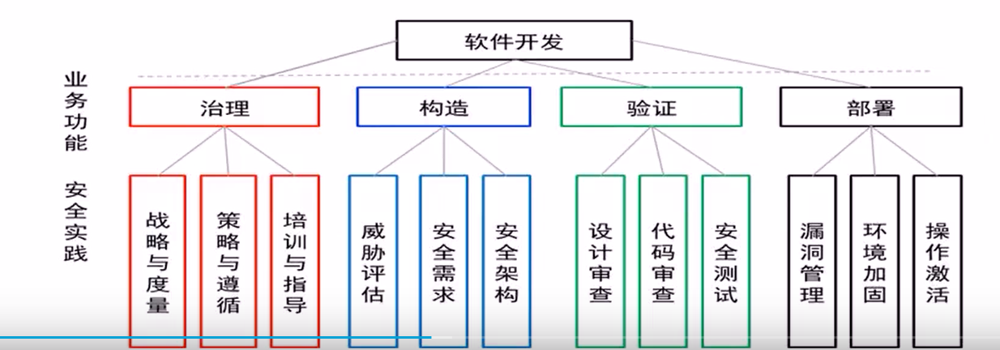

# 软件安全开发基础

开发软件的时候应该注意的安全问题。

软件安全开发涉及：
- 软件安全开发生命周期
- 软件安全需求及涉及
- 软件安全实现
- 软件安全测试
- 软件安全交付

## 软件安全的重要性

软件危机

> 了解三次软件危机产生的原因、特点、解决方案
> 了解软件安全和软件安全保障的基本概念

- 第一次 软件危机，20世纪60年代
  - 根源：日益庞大和复杂的程序对开发管理的要求越来越高。
  - 解决：引入软件工程
- 第二次 软件危机，20世纪80年代
  - 根源：软件规模继续扩大，程序数百万行，数百人同时开发，可维护性难。
  - 解决：面向对象语言出现，软件版本控制
- 第三次 软件危机，21世纪头10年
  - 根源：软件安全
  - 解决：软件安全开发生命周期管理。


## 软件生命周期模型

### 瀑布模型
最早出现的软件开发模型。基本过程是：系统需求——软件需求——初步设计——详细设计——编码与调试——测试——运行与维护。

核心思想：
- 按工序将问题简化
- 将功能的实现与涉及分开

不足：
- 没有对开发周期后期发现错误做出相应的规定。
- 只能向上回滚一步，不能反复迭代。

### 迭代模型
属于瀑布模型的小型化。

有完整的工作流程。
可以降低风险
- 增量开支的风险
- 产品无法安全进入市场的风险

加快开发进度
- 任务清晰
- 需求更容易随需而变

### 增量模板（当前主流）

融合了瀑布模型和迭代模型，本质上是迭代，每个增量发布一个可操作产品。

### 螺旋模型

兼顾快速原型的迭代的特征以及瀑布模型的系统化与严格监控。

引入了其他模型不具备的风险分析，使软件在无法排除重大风险时有机会停止，以减小损失。

构建原型是螺旋模型用以减少风险的途径。


### 快速原型模型

又称原型模型，是增量模型的另一形式；在开发真实系统前先构造一个原型，在该原型的基础上，逐渐完成整个系统的开发工作。

### 净室模型

一种应用数学和统计学理论以经济的方式生产高质量软件的工程技术。力图通过严格的工程化的软件过程达到开发中的零缺陷或接近零缺陷。


### 小结
软件缺陷是普遍存在的，千行代码缺陷数量：
- 普通软件公司4~40
- 高管理软件公司：2~4
- NASA等：0.1

漏洞数量：国家漏洞库统计数据表明，最近5年最高一年入库7000+漏洞信息条目。

软件安全问题的内在原因：
- 软件规模增大，功能越来越多，越来越复杂
- 软件模块服用，导致安全漏洞延续
- 软件扩展模块带啦的安全问题

软件安全问题的外在原因：
- 互联网发展对软件安全的挑战
- 开发环境和开发人员对软件安全的挑战
  - 缺乏安全开发的冬季
  - 缺乏知识
  - 缺乏工具（开发配置套管理、测试工具）

软件安全开发覆盖软件整个生命周期。
NIST研究表明软件发布后进行修复是软件设计和开发时修复的代价的80倍。

## 软件安全生命周期模型
- SDL
- CLASP
- CMMI
- SAMM
- BSIMM

### SDL 

SDL安全开发生命周期


SDL包含多个安全开发生命阶段：
- 5+2个阶段
  - 培训、要求、设计、实施、验证、发布、响应
- 17项必须的安全活动
  - 培训：核心安全培训
  - 要求：确定安全要求、创建质量门/bug栏、安全和隐私风险评估
  - 设计：确定设计要求、分析攻击面、威胁建模
  - 实施：使用批准的工具、弃用不安全的函数、静态分析
  - 验证：动态分析、模糊测试、攻击面评析
  - 发布：事件响应计划、最终安全评析、发布存档
  - 响应：执行事件响应计划


### CLASP

综合的轻量应用安全过程（Comprehensive Lightweight Application Security Process，CLASP）用于构建安全软件的轻量级过程。包括由30个特定的活动（activities）和辅助资源构成的集合。

CLASP针对这些活动给出了相应的指南、导则、检查表。

特点：基于角色的安排。常见于小型研发机构。

### CMMI

软件能力成熟度模型（capability maturity model integration)

CMMI分为5级：
- ml5 优化级
- ml4 定量管理级
- ml3 定义级
- ml2 管理级
- ml1 初始级

过程区域

### SAMM

软件保证成熟度模型（Software Assurance Maturity Mode，SAMM），提供了一个开放的框架，用以帮助软件公司制定并实施所面临来自软件安全的特定风险的策略。

主要内容：
- 治理（Administration）
- 构造（Building）
- 验证（Checking）
- 部署（Developing）



### BSI 系列模型

BSI(Building Security IN)
- 使安全成为软件开发必须的部分
- 强调应该使用工程化的方法来保证软件安全

软件安全的三根支柱：
- 风险管理：策略性方法
- 接触点：一套轻量级最优化工程化方法，攻击与防御综合考虑
- 安全知识：强调对安全经验和专业技术进行收集汇总，对软件开发人员进行培训，并通过安全接触点实际运用。

### BSIMM

BSI成熟度模型/指南
- 对真实的软件安全项目所开展的活动进行量化
- 构建和不断发展软件安全行动的指南


### 小结

各模型比较

- SDL：文档丰富、维护更新及时；较多工具支持；适合大型企业。
- CLASP：轻量级过程；以角色及其职责为核心；适合小型企业。
- SAMM：开放框架；安全知识要求较低；和BSIMM的安全活动能对应起来。
- CMMI：自动的、可扩展的框架；集成化框架，消除了各个模型的不一致性；持续改进，可以克服开发中的困难。
- BSI：接触点：强调开发安全重点；注重实用方法；上手容易。
- BSIMM：最佳实践参考；集他山指示；不强制实践。


## 软件安全需求及设计

软件安全需求和设计是开发安全软件的基础。

### 软件安全需求分析

基本思路：
- 以风险管理为基础，建立“威胁”分析计划；
- 建立软件安全需求定义，确保软件安全需求定义正确；
- 安全需求应当文档化；
- 需求变更要走变更程序。

安全需求分类：
- 安全功能需求
- 安全保障要求（按等保等合规要求进行分析）

安全需求分析的要点：
- 安全需求进行有效定义（明确、共享、文档化）
- 不仅考虑系统应该做什么（功能），还要考虑系统不应该做什么（安全）
- 功能需求、安全需求、安全目标要实现平衡。
- 要从正常用户和攻击者两方面考虑问题。


#### 需求分析过程

- 1.系统调查（资产清查）
- 2.定性分析系统的脆弱点和可能遭受的安全威胁
- 3.脆弱点和安全威胁的定量分析
- 4.需求的确定

### 软件安全设计

软件系统的每一项需求，都应该在软件安全设计阶段认真考虑。50%的安全问题都是由安全设计瑕疵引起的。介入越早，效益越高，成本越低。

#### 安全概要设计阶段

包括但不限于：
- 安全体系结构设计
- 各功能模块间的处理流程
- 与其他功能的关系
- 安全协议设计
- 安全接口设计

#### 安全详细设计阶段

详细设计阶段作为安全功能的程序设计阶段，应当直接指导安全功能的编码工作。包括但不限于：
- 模块设计
- 内部处理流程
- 数据结构
- 输入、输出项
- 算法
- 逻辑流程图

根据安全需求方案中确定的安全目标，对初步风险评估确定的控制措施的具体技术实现而进行安全设计。

安全设计的主要活动：
- 详细风险评估
- 控制措施选择
- 安全技术实现
- 安全设计评审


安全设计原则（每个都应该遵守）：
- 最小特权原则
- 权限分离原则（一项操作应当由两个用户协作才能完成，例如认证、授权、审计要分开）
- 最少共享机制原则（不能一人多角色，不能共用账号）
- 完全中立原则
- 心理可接受度原则
- 默认故障处理保护原则
- 经济机制原则
- 不信任原则
- 纵深防御原则
- 保护最薄弱环节原则（没有漏洞修补机制属于违反此原则）
- 公开设计原则（最好使用经得起考验、受过充分讨论的方案）
- 隐私保护原则
- 攻击面最小化原则

降低软件攻击面的通常做法：

|较高受攻击面|较低受攻击面|
|-|-|
|默认执行|默认拒绝、关闭|
|打开网络连接|关闭网络连接|
|同时监听UDP和TCP|仅监听TCP|
|匿名访问|鉴别用户访问|
|粗粒度ACL|细粒度ACL|
|管理员访问|普通用户访问|
|因特网访问|本地子网访问|
|代码以管理员或root权限运行|代码以NetworkService、LocalServices或自定义的低权限账户运行|
|统一缺省配置|用户可选的配置|
|ActiveX控件|.NET代码|
|标记有脚本安全的ActiveX控件|未标记有脚本安全的ActiveX控件|
|非SiteLocked ActiveX控件|SiteLocked ActiveX控件|


### 安全设计方法——威胁建模

#### 威胁建模

威胁建模是了解系统面临的安全威胁，确定威胁风险并通过适当的缓解措施以降低风险，提供系统安全性的过程。

为什么要威胁建模？
- 帮助在设计阶段充分了解各种安全威胁，并指导选择适当的应对措施；
- 对可能的风险进行管理
- 可以重新验证其架构和设计
- 有助于软件的受攻击面降低。

建模流程：
- 确定对象
  - 资产、使用实例、应用场景、部署方式、配置、用户使用方式
- 识别威胁
  - 识别每一个可能的威胁（STRIDE:假冒身份、篡改数据、抵赖、信息泄露、拒绝服务、权限提升）
  - 威胁不等于漏洞
  - 威胁永远存在
  - 理解软件可能面临的威胁是安全开发的前提
- 评估威胁
- 消减威胁


## 软件安全实现

### 通用安全编码原则

#### 验证输入

原则：对所有输入数据进行检查、验证及过滤。应用软件的“数据防火墙”，避免恶意数据进入。

验证时机:
- 最初接收数据时；
- 数据变更时；
- 数据使用时（至少在初次使用时验证）。

常见输入源：
- 命令行：参数数量、格式、内容
- 环境变量
  - 可能超出预期
  - 有的环境变量存储格式存在危险

- 文件
  - 不信任可以被不可信用户控制的文件内容
  - 不信任临时文件

- 网络
  - 来自网络的数据均为不可信
- 其他来源


##### 输入验证细节(OWASP安全编码规范快速参考指南)
- 在可信系统（比如：服务器）上执行所有的数据验证。
- 识别所有的数据源，并将其分为可信的和不可信的。验证所有来自不可信数据源（比如：数据库，文件流，等）的数据。
- 应当为应用程序应提供一个集中的输入验证规则。
- 为所有输入明确恰当的字符集，比如：UTF-8。
- 在输入验证前，将数据按照常用字符进行编码（规范化）。
- 丢弃任何没有通过输入验证的数据。
- 确定系统是否支持 UTF-8 扩展字符集，如果支持，在 UTF-8 解码完成以后进行输入验证。
- 在处理以前，验证所有来自客户端的数据，包括：所有参数、URL、HTTP 头信息（比如：cookie 名字和数据值）。确定包括了来自 JavaScript、Flash 或其他嵌入代码的 post back 信息。
- 验证在请求和响应的报头信息中只含有 ASCII 字符。
- 核实来自重定向输入的数据（一个攻击者可能向重定向的目标直接提交恶意代码，从而避开应用程序逻辑以及在重定向前执行的任何验证）。
- 验证正确的数据类型。
- 验证数据范围。
- 验证数据长度。
- 尽可能采用“白名单”形式，验证所有的输入。
- 如果任何潜在的危险字符必须被作为输入，请确保您执行了额外的控制，比如：输出编码、特定的安全 API、以及在应用程序中使用的原因。部分常见的危险字符包括：```< > " ' % ( ) & + \ \' \" ```。
- 如果您使用的标准验证规则无法验证下面的输入，那么它们需要被单独验证：
  - 验证空字节 (```%00```)；
  - 验证换行符 (```%0d, %0a, \r, \n```)；
  - 验证路径替代字符“点-点-斜杠”（```../```或 ```..\```）。如果支持 UTF-8 扩展字符集编码，验证替代字符： ```%c0%ae%c0%ae/``` (使用规范化验证双编码或其他类型的编码攻击)。

#### 内存管理

要避免缓冲区溢出。

(OWASP安全编码规范快速参考指南)相关内容：

- 对不可信数据进行输入和输出控制。
- 重复确认缓存空间的大小是否和指定的大小一样。
- 当使用允许多字节拷贝的函数时，比如 strncpy()，如果目的缓存容量和源缓存容量相等时，需要留意字符串没有 NULL 终止。
- 如果在循环中调用函数时，检查缓存大小，以确保不会出现超出分配空间大小的危险。
- 在将输入字符串传递给拷贝和连接函数前，将所有输入的字符串缩短到合理的长度。
- 关闭资源时要特别注意，不要依赖垃圾回收机制（比如：连接对象、文档处理，等）。
- 在可能的情况下，使用不可执行的堆栈。
- 避免使用已知有漏洞的函数（比如：printf，strcat，strcpy等）。
- 当方法结束时和在所有的退出节点时，正确地清空所分配的内存。

不安全函数举例

- strcpy, wcscpy, trcpy, _tcscpy, _ftcscpy, _mbscpy
- strcat, wcscat, trcat, strcat, _tcscat, _ftscat, _mbscat
- vsprintf, vswprintf, wvsprintf, wvnsprintf, _vstprintf
- sprintf, swprintf, wsprintf, wnsprintf, _stprintf
- gets, _getws, _getts

解决方法：
- 填充数据时计算边界
  - 动态分配内存
  - 控制输入
- 使用没有缓冲区溢出问题的函数
  - 例如strncpy, strncat, std:string
- 使用替代库
  - libmib, libsafe
- 基于探测方法的防御
  - 例如使用stackedGuard, propolice, /gs等技术进行防御
  - 原理是将一个“探测值（例如安全cookie）”插入到返回地址之前。
- 非执行的堆栈防御
  - 不可在堆栈上执行代码，例如windows的DEP，编译选项即/nx

#### 输出编码(OWASP安全编码规范快速参考指南)

- 在可信系统（比如：服务器）上执行所有的编码。
- 为每一种输出编码方法采用一个标准的、已通过测试的规则。
- 通过语义输出编码方式，对所有返回到客户端的来自于应用程序信任边界之外的数据进行编码。HTML 实体编码是一个例子，但不是在所有的情况下都可用。
- 除非对目标编译器是安全的，否则请对所有字符进行编码。
- 针对 SQL、XML 和 LDAP 查询，语义净化所有不可信数据的输出。
- 对于操作系统命令，净化所有不可信数据输出。

#### 身份验证和密码管理(OWASP安全编码规范快速参考指南)
- 除了那些特定设为“公开”的内容以外，对所有的网页和资源要求身份验证。
- 所有的身份验证过程必须在可信系统（比如：服务器）上执行。
- 在任何可能的情况下，建立并使用标准的、已通过测试的身份验证服务。
- 为所有身份验证控制使用一个集中实现的方法，其中包括利用库文件请求外部身份验证服务。
- 将身份验证逻辑从被请求的资源中隔离开，并使用重定向到或来自集中的身份验证控制。
- 所有的身份验证控制应当安全的处理未成功的身份验证。
- 所有的管理和账户管理功能至少应当具有和主要身份验证机制一样的安全性。
- 如果您的应用程序管理着凭证的存储，那么应当保证只保存了通过使用强加密单向 salted 哈希算法得到的密码，并且只有应用程序具有对保存密码和密钥的表/文件的写权限（如果可以避免的话，不要使用 MD5 算法）。
- 密码哈希必须在可信系统（比如：服务器）上执行。
- 只有当所有的数据输入以后，才进行身份验证数据的验证，特别是对连续身份验证机制。
- 身份验证的失败提示信息应当避免过于明确。比如：可以使用“用户名和/或密码错误”，而不要使用“用户名错误”或者“密码错误”。错误提示信息在显示和源代码中应保持一致。
- 为涉及敏感信息或功能的外部系统连接使用身份验证。
- 用于访问应用程序以外服务的身份验证凭据信息应当加密，并存储在一个可信系统（比如：服务器）中受到保护的地方。源代码不是一个安全的地方。
- 只使用 HTTP Post 请求传输身份验证的凭据信息。
- 非临时密码只在加密连接中发送或作为加密的数据（比如，一封加密的邮件）。通过邮件重设临时密码可以是一个例外。
- 通过政策或规则加强密码复杂度的要求（比如：要求使用字母、数字和/或特殊符号）。身份验证的凭据信息应当足够复杂以对抗在其所部署环境中的各种威胁攻击。
- 通过政策和规则加强密码长度要求。常用的是 8 个字符长度，但是 16 个字符长度更好，或者考虑使用多单词密码短语。
- 输入的密码应当在用户的屏幕上模糊显示（比如：在 Web 表单中使用“password”输入类型）。
- 当连续多次登录失败后（比如：通常情况下是 5 次），应强制锁定账户。账户锁定的时间必须足够长，以阻止暴力攻击猜测登录信息，但是不能长到允许执行一次拒绝服务攻击。
- 密码重设和更改操作需要类似于账户创建和身份验证的同样控制等级。
- 密码重设问题应当支持尽可能随机的提问（比如：“最喜爱的书”是一个坏的问题，因为《圣经》是最常见的答案）。
- 如果使用基于邮件的重设，只将临时链接或密码发送到预先注册的邮件地址。
- 临时密码和链接应当有一个短暂的有效期。
- 当再次使用临时密码时，强制修改临时密码。
- 当密码重新设置时，通知用户。
- 阻止密码重复使用。
- 密码在被更改前应当至少使用了一天，以阻止密码重用攻击。
- 根据政策或规则的要求，强制定期更改密码。关键系统可能会要求更频繁的更改。更改时间周期必须进行明确。
- 为密码填写框禁用“记住密码”功能。
- 用户账号的上一次使用信息（成功或失败）应当在下一次成功登录时向用户报告。
- 执行监控以确定针对使用相同密码的多用户帐户攻击。当用户 ID 可以被得到或被猜到时，该攻击模式用来绕开标准的锁死功能。
- 更改所有厂商提供的默认用户 ID 和密码，或者禁用相关帐号。
- 在执行关键操作以前，对用户再次进行身份验证。
- 为高度敏感或重要的交易账户使用多因子身份验证机制。
- 如果使用了第三方身份验证的代码，仔细检查代码以保证其不会受到任何恶意代码的影响。

#### 会话管理(OWASP安全编码规范快速参考指南)
- 使用服务器或者框架的会话管理控制。应用程序应当只识别有效的会话标识符。
- 会话标识符必须总是在一个可信系统（比如：服务器）上创建。
- 会话管理控制应当使用通过审查的算法以保证足够的随机会话标识符。
- 为包含已验证的会话标识符的 cookie 设置域和路径，以为站点设置一个恰当的限制值。
- 注销功能应当完全终止相关的会话或连接。
- 注销功能应当可用于所有受身份验证保护的网页。
- 在平衡的风险和业务功能需求的基础上，设置一个尽量短的会话超时时间。通常情况下，应当不超过几个小时。
- 禁止连续的登录并强制执行周期性的会话终止，即使是活动的会话。特别是对于支持富网络连接或连接到关键系统的应用程序。终止时机应当可以根据业务需求调整，并且用户应当收到足够的通知已减少带来的负面影响。
- 如果一个会话在登录以前就建立，在成功登录以后，关闭该会话并创建一个新的会话。
- 在任何重新身份验证过程中建立一个新的会话标识符。
- 不允许同一用户 ID 的并发登录。
- 不要在 URL、错误信息或日志中暴露会话标识符。会话标识符应当只出现在 HTTP cookie 头信息中。比如，不要将会话标识符以 GET 参数进行传递。
- 通过在服务器上使用恰当的访问控制，保护服务器端会话数据免受来自服务器其他用户的未授权访问。
- 生成一个新的会话标识符并周期性地使旧会话标识符失效（这可以缓解那些原标识符被获得的特定会话劫持情况）。
- 在身份验证的时候，如果连接从 HTTP 变为 HTTPS，则生成一个新的会话标识符。在应用程序中，推荐持续使用 HTTPS，而非在 HTTP 和 HTTPS 之间转换。
- 为服务器端的操作执行标准的会话管理，比如，通过在每个会话中使用强随机令牌或参数来管理账户。该方法可以用来防止跨站点请求伪造攻击。
- 通过在每个请求或每个会话中使用强随机令牌或参数，为高度敏感或关键的操作提供标准的会话管理。
- 为在 TLS 连接上传输的 cookie 设置“安全”属性。
- 将 cookie 设置为 HttpOnly 属性，除非在应用程序中明确要求了客户端脚本程序读取或者设置cookie 的值。

#### 访问控制(OWASP安全编码规范快速参考指南)
- 只使用可信系统对象（比如：服务器端会话对象）以做出访问授权的决定。
- 使用一个单独的全站点部件以检查访问授权。这包括调用外部授权服务的库文件。
- 安全的处理访问控制失败的操作。
- 如果应用程序无法访问其安全配置信息，则拒绝所有的访问。
- 在每个请求中加强授权控制，包括：服务器端脚本产生的请求，“includes”和来自象 AJAX 和FLASH 那样的富客户端技术的请求。
- 将有特权的逻辑从其他应用程序代码中隔离开。
- 限制只有授权的用户才能访问文件或其他资源，包括那些应用程序外部的直接控制。
- 限制只有授权的用户才能访问受保护的 URL。
- 限制只有授权的用户才能访问受保护的功能。
- 限制只有授权的用户才能访问直接对象引用。
- 限制只有授权的用户才能访问服务。
- 限制只有授权的用户才能访问应用程序数据。
- 限制通过使用访问控制来访问用户、数据属性和策略信息。
- 限制只有授权的用户才能访问与安全相关的配置信息。
- 服务器端执行的访问控制规则和表示层实施的访问控制规则必须匹配。
- 如果状态数据必须存储在客户端，使用加密算法，并在服务器端检查完整性以捕获状态的改变。
- 强制应用程序逻辑流程遵照业务规则。
- 限制单一用户或设备在一段时间内可以执行的事务数量。事务数量/时间应当高于实际的业务需求，但也应该足够低以判定自动化攻击。
- 仅使用“referer”头作为补偿性质的检查，它永远不能被单独用来进行身份验证检查，因为它可以被伪造。
- 如果长的身份验证会话被允许，周期性的重新验证用户的身份，以确保他们的权限没有改变。如果发生改变，注销该用户，并强制他们重新执行身份验证。
- 执行帐户审计并将没有使用的帐号强制失效（比如：在用户密码过期后的 30 天以内）。
- 应用程序必须支持帐户失效，并在帐户停止使用时终止会话（比如：角色、职务状况、业务处理的改变，等等）。
- 服务帐户，或连接到或来自外部系统的帐号，应当只有尽可能小的权限。
- 建立一个“访问控制政策”以明确一个应用程序的业务规则、数据类型和身份验证的标准或处理流程，确保访问可以被恰当的提供和控制。这包括了为数据和系统资源确定访问需求。

#### 加密规范(OWASP安全编码规范快速参考指南)
- 所有用于保护来自应用程序用户秘密信息的加密功能都必须在一个可信系统（比如：服务器）上执行。
- 保护主要秘密信息免受未授权的访问。
- 安全的处理加密模块失败的操作。
- 为防范对随机数据的猜测攻击，应当使用加密模块中已验证的随机数生成器生成所有的随机数、随机文件名、随机 GUID 和随机字符串。
- 应用程序使用的加密模块应当遵从 FIPS 140-2 或其他等同的标准（请见：http://csrc.nist.gov/groups/STM/cmvp/validation.html）。
  - 国内应当遵循《密码法》及配套标准。
- 建立并使用相关的政策和流程以实现加、解密的密钥管理。

#### 错误处理和日志(OWASP安全编码规范快速参考指南)
- 不要在错误响应中泄露敏感信息，包括：系统的详细信息、会话标识符或者帐号信息。
- 使用错误处理以避免显示调试或堆栈跟踪信息。
- 使用通用的错误消息并使用定制的错误页面。
- 应用程序应当处理应用程序错误，并且不依赖服务器配置。
- 当错误条件发生时，适当的清空分配的内存。
- 在默认情况下，应当拒绝访问与安全控制相关联的错误处理逻辑。
- 所有的日志记录控制应当在可信系统（比如：服务器）上执行。
- 日志记录控制应当支持记录特定安全事件的成功或者失败操作。
- 确保日志记录包含了重要的日志事件数据。
- 确保日志记录中包含的不可信数据，不会在查看界面或者软件时以代码的形式被执行。
- 限制只有授权的个人才能访问日志。
- 为所有的日志记录采用一个主要的常规操作。
- 不要在日志中保存敏感信息，包括：不必要的系统详细信息、会话标识符或密码。
- 确保一个执行日志查询分析机制的存在。
- 记录所有失败的输入验证。
- 记录所有的身份验证尝试，特别是失败的验证。
- 记录所有失败的访问控制。
- 记录明显的修改事件，包括对于状态数据非期待的修改。
- 记录连接无效或者已过期的会话令牌尝试。
- 记录所有的系统例外。
- 记录所有的管理功能行为，包括对于安全配置设置的更改。
- 记录所有失败的后端 TLS 链接。
- 记录加密模块的错误。
- 使用加密哈希功能以验证日志记录的完整性。

#### 数据保护(OWASP安全编码规范快速参考指南)
- 授予最低权限，以限制用户只能访问为完成任务所需要的功能、数据和系统信息。
- 保护所有存放在服务器上缓存的或临时拷贝的敏感数据，以避免非授权的访问，并在临时工作文件不再需要时被尽快清除。
- 即使在服务器端，任然要加密存储的高度机密信息，比如，身份验证的验证数据。总是使用已经被很好验证过的算法，更多指导信息请参见“加密规范”部分。
- 保护服务器端的源代码不被用户下载。
- 不要在客户端上以明文形式或其他非加密安全模式保存密码、连接字符串或其他敏感信息。这包括嵌入在不安全的形式中：MS viewstate、Adobe flash 或者已编译的代码。
- 删除用户可访问产品中的注释，以防止泄露后台系统或者其他敏感信息。
- 删除不需要的应用程序和系统文档，因为这些也可能向攻击者泄露有用的信息。
- 不要在 HTTP GET 请求参数中包含敏感信息。
- 禁止表单中的自动填充功能，因为表单中可能包含敏感信息，包括身份验证信息。
- 禁止客户端缓存网页，因为可能包含敏感信息。“```Cache-Control: no-store```”，可以和 HTTP 报头控制“```Pragma: no-cache```”一起使用，该控制不是非常有效，但是与 ```HTTP/1.0``` 向后兼容。
- 应用程序应当支持，当数据不再需要的时候，删除敏感信息（比如：个人信息或者特定财务数据）。

- 为存储在服务器中的敏感信息提供恰当的访问控制。这包括缓存的数据、临时文件以及只允许特定系统用户访问的数据。

#### 通讯安全(OWASP安全编码规范快速参考指南)
- 为所有敏感信息采用加密传输。其中应该包括使用 TLS 对连接的保护，以及支持对敏感文件或非基于 HTTP 连接的不连续加密。
- TLS 证书应当是有效的，有正确且未过期的域名，并且在需要时，可以和中间证书一起安装。
- 没有成功的 TLS 连接不应当后退成为一个不安全的连接。
- 为所有要求身份验证的访问内容和所有其他的敏感信息提供 TLS 连接。
- 为包含敏感信息或功能、且连接到外部系统的连接使用 TLS。
- 使用配置合理的单一标准 TLS 连接。
- 为所有的连接明确字符编码。
- 当链接到外部站点时，过滤来自 HTTP referer 中包含敏感信息的参数。

#### 系统配置(OWASP安全编码规范快速参考指南)
- 确保服务器、框架和系统部件采用了认可的最新版本。
- 确保服务器、框架和系统部件安装了当前使用版本的所有补丁。
- 关闭目录列表功能。
- 将 Web 服务器、进程和服务的账户限制为尽可能低的权限。
- 当例外发生时，安全的进行错误处理。
- 移除所有不需要的功能和文件。
- 在部署前，移除测试代码和产品不需要的功能。
- 通过将不进行对外检索的路径目录放在一个隔离的父目录里，以防止目录结构在 robots.txt 文档中暴露。然后，在 robots.txt 文档中“禁止”整个父目录，而不是对每个单独目录的“禁止”。
- 明确应用程序采用哪种 HTTP 方法：GET 或 POST，以及是否需要在应用程序不同网页中以不同的方式进行处理。
- 禁用不需要的 HTTP 方法，比如 WebDAV 扩展。如果需要使用一个扩展的 HTTP 方法以支持文件处理，则使用一个好的经过验证的身份验证机制。
- 如果 Web 服务器支持 HTTP1.0 和 1.1，确保以相似的方式对它们进行配置，或者确保您理解了它们之间可能存在差异（比如：处理扩展的 HTTP 方法）。
- 移除在 HTTP 相应报头中有关 OS、Web 服务版本和应用程序框架的无关信息。
- 应用程序存储的安全配置信息应当可以以可读的形式输出，以支持审计。
- 使用一个资产管理系统，并将系统部件和软件注册在其中。
- 将开发环境从生成网络隔离开，并只提供给授权的开发和测试团队访问。开发环境往往没有实际生成环境那么安全，攻击者可以使用这些差别发现共有的弱点或者是可被利用的漏洞。
- 使用一个软件变更管理系统以管理和记录在开发和产品中代码的变更。


#### 数据库安全(OWASP安全编码规范快速参考指南)
- 使用强类型的参数化查询方法。
- 使用输入验证和输出编码，并确保处理了元字符。如果失败，则不执行数据库命令。
- 确保变量是强类型的。
- 当应用程序访问数据库时，应使用尽可能最低的权限。
- 为数据库访问使用安全凭证。
- 连接字符串不应当在应用程序中硬编码。连接字符串应当存储在一个可信服务器的独立配置文件中，并且应当被加密。
- 使用存储过程以实现抽象访问数据，并允许对数据库中表的删除权限。
- 尽可能地快速关闭数据库连接。
- 删除或者修改所有默认的数据库管理员密码。使用强密码、强短语，或者使用多因子身份验证。
- 关闭所有不必要的数据库功能（比如：不必要的存储过程或服务、应用程序包、仅最小化安装需要的功能和选项（表面范围缩减））。
- 删除厂商提供的不必要的默认信息（比如：数据库模式示例）。
- 禁用任何不支持业务需求的默认帐户。
- 应用程序应当以不同的凭证为每个信任的角色（比如：用户、只读用户、访问用户、管理员）连接数据库。

#### 文件管理
- 不要把用户提交的数据直接传送给任何动态调用功能。
- 在允许上传一个文档以前进行身份验证。
- 只允许上传满足业务需要的相关文档类型。
- 通过检查文件报头信息，验证上传文档是否是所期待的类型。只验证文件类型扩展是不够的。
- 不要把文件保存在与应用程序相同的 Web 环境中。文件应当保存在内容服务器或者数据库中。
- 防止或限制上传任意可能被 Web 服务器解析的文件。
- 关闭在文件上传目录的运行权限。
- 通过装上目标文件路径作为使用了相关路径或者已变更根目录环境的逻辑盘，在 UNIX 中实现安全的文件上传服务。
- 当引用已有文件时，使用一个白名单记录允许的文件名和类型。验证传递的参数值，如果与预期的值不匹配，则拒绝使用，或者使用默认的硬编码文件值代替。
- 不要将用户提交的数据传递到动态重定向中。如果必须允许使用，那么重定向应当只接受通过验证的相对路径 URL。
- 不要传递目录或文件路径，使用预先设置路径列表中的匹配索引值。
- 绝对不要将绝对文件路径传递给客户。
- 确保应用程序文件和资源是只读的。
- 对用户上传的文件扫描进行病毒和恶意软件。


#### 通用编码规范(OWASP安全编码规范快速参考指南)
- 为常用的任务使用已测试且已认可的托管代码，而不创建新的非托管代码。
- 使用特定任务的内置 API 以执行操作系统的任务。不允许应用程序直接将代码发送给操作系统，特别是通过使用应用程序初始的命令 shell。
- 使用校验和或哈希值验证编译后的代码、库文件、可执行文件和配置文件的完整性。
- 使用死锁来防止多个同时发送的请求，或使用一个同步机制防止竞态条件。
- 在同时发生不恰当的访问时，保护共享的变量和资源。
- 在声明时或在第一次使用前，明确初始化您的所有变量和其他数据存储。
- 当应用程序运行发生必须提升权限的情况时，尽量晚点提升权限，并且尽快放弃所提升的权限。
- 通过了解您使用的编程语言的底层表达式以及它们是如何进行数学计算，从而避免计算错误。密切注意字节大小依赖、精确度、有无符合、截尾操作、转换、字节之间的组合、“not-a-number”计算、以及对于编程语言底层表达式如何处理非常大或者非常小的数。
- 不要将用户提供的数据传递给任何动态运行的功能。
- 限制用户生成新代码或更改现有代码。
- 审核所有从属的应用程序、第三方代码和库文件，以确定业务的需要，并验证功能的安全性，因为它们可能产生新的漏洞。
- 执行安全更新。如果应用程序采用自动更新，则为您的代码使用加密签名，以确保的您的下载客户端验证这些签名。使用加密的信道传输来自主机服务器的代码。

### 代码安全编译

- 使用最新版本的编译器和支持工具
- 使用可靠的编译工具
- 使用编译器内置的防御特性（如：GS,DEP,ASLR）

### 代码安全审核

## 软件安全测试

软件测试的目的在于寻找更多的bug。软件是否满足功能需求应当由第三方的监理来进行测试。

基本概念：
- 测试用例
- 测试覆盖度

### 代码审计

通过分析或检查源程序的语法、结构、过程、接口等来检查程序的正确性，报告源代码中可能隐藏的错误和缺陷。

源代码审核方式：
- 人工审核
- 工具审核

软件安全测试的涵义：
- 软件安全测试是确定软件的安全特性实现是否与预期设计保持一致的测试过程。
- 是有关验证软件安全等级和识别潜在安全缺陷的过程；
- 是查找软件自身程序设计中存在的安全隐患，并检查应用程序对非法侵入的防范能力。

软件安全测试方法：
- 功能性安全测试
- 对抗性安全测试

安全测试方法：
- 模糊测试
- 渗透测试
- 静态代码审核

## 软件安全交付

供应链安全概念：
- 目前软件安全开发生命周期中新的威胁，涉及到软件的代码编写、编译、分发、更新；
- 代码编写：开源、共享库其中包含高危漏洞
- 代码编译：被污染的编译工具
- 软件分发、更新：检查软件更新的源头，谨防污染源头

供应链安全应对策略
- 安全流程覆盖到引入的第三方代码中
- 可靠的编译软件获取方式
- 官方渠道、发布验证

## 软件验收和部署

软件验收：
- 正式的验收流程
- 安全纳入到验收考虑中

安全部署：
- 提供软件部署所需要的文档和工具
- 软件加固
- 软件安全配置

