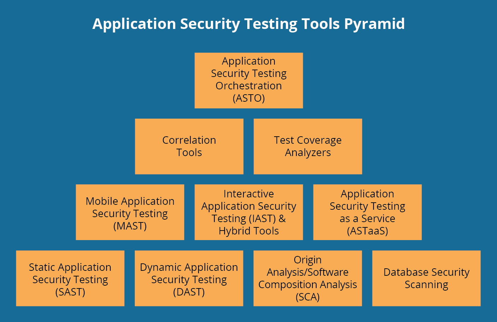
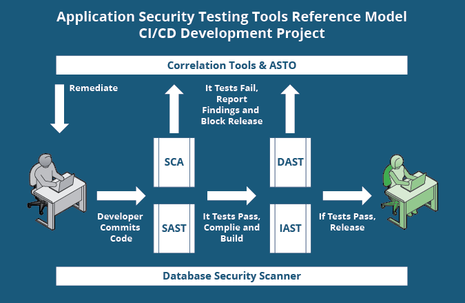
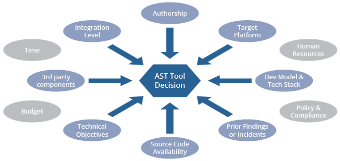

# 软件安全测试  application security testing (AST)

## 概述

我们采用美国国土安全部网站 BUILD SECURITY IN 中的提法

软件安全测试包括：
- 识别软件架构、设计和实现风险Identification of architectural, design, and implementation risks
- 制订风险驱动的测试计划 Risk-driven test creation
- 依赖性攻击 Dependency attacks
- 用户接口类攻击 User Interface attacks
- 文件系统类攻击 File system attacks
- 设计/业务逻辑攻击 Design attacks
- 实现攻击 Implementation attacks
- 渗透攻击 Penetration testing
- 静态漏洞扫描 Static vulnerability scanning
- 测试覆盖度分析 Test coverage
- 测试深度分析 Test depth analysis

## 方法
主要方法有：
- SAST
- DAST
- 
### 静态应用安全测试 SAST
SAST工具可以被认为是白帽测试或白盒测试，测试人员可以在其中了解有关被测系统或软件的信息，包括体系结构图，对源代码的访问等。[SAST工具](https://samate.nist.gov/index.php/Source_Code_Security_Analyzers.html)可以检查源代码（静止）检测并报告可能导致安全漏洞的弱点。

源代码分析器可以在未编译的代码上运行，以检查缺陷，例如数字错误，输入验证，竞争条件，路径遍历，指针和引用等。二进制和字节码分析器对已构建和已编译的代码执行相同的操作。一些工具仅在源代码上运行，一些仅在编译后的代码上运行，而在两者上都运行。

常见的SAST工具有：
- [SD Elements](https://www.securitycompass.com/sdelements/) 
- [Secure Code Warrior](https://securecodewarrior.com/)
- [Micro Focus Fortify软件安全中心](https://www.microfocus.com/en-us/products/software-security-assurance-sdlc/overview)
- IBM APPSCAN
- VERACODE
- WHITEHAAT

github上的开源SAST:
- nodejsscan
- sast-scan
- sast-scan

- [OWASP 开源免费SAST工具列表](https://owasp.org/www-community/Source_Code_Analysis_Tools)
### 动态应用程序安全性测试（DAST）
与SAST工具相比，DAST工具可以被认为是黑帽或黑匣子测试，测试人员没有系统的先验知识。它们[检测指示应用程序处于运行状态的安全漏洞的条件](https://www.gartner.com/en/information-technology/glossary/dynamic-application-security-testing-dast)。DAST工具在操作代码上运行，以检测界面，请求，响应，脚本（即JavaScript），数据注入，会话，身份验证等问题。

DAST工具采用模糊测试：经常在应用程序上抛出已知的无效和意外测试用例。

- [Rapid7 InsightAppSec](https://www.rapid7.com/products/insightappsec/)
- [Rapid7 appspider](https://www.rapid7.com/products/appspider/)
- [Netsparker](https://www.netsparker.com/)

### 来源分析/软件组成分析 Origin Analysis/Software Composition Analysis （SCA)

依靠人工检查的软件管理流程容易失败。SCA工具检查软件，以确定软件中所有组件和库的来源。这些工具在识别和发现常见和流行组件（尤其是开源组件）中的漏洞方面非常有效。但是，它们不会检测内部自定义开发组件的漏洞。

SCA工具最有效地找到常见和流行的库和组件，尤其是开放源代码的组件。它们通过将代码中找到的已知模块与已知漏洞列表进行比较来工作。SCA工具查找具有已知漏洞并已记录漏洞的组件，并且通常会建议组件是否过时或具有可用的补丁程序。

为了进行比较，几乎所有SCA工具都使用NIST国家漏洞数据库的常见漏洞和披露（[CVE](https://nvd.nist.gov/)）作为已知漏洞的来源。许多商业SCA产品还使用VulnDB商业漏洞数据库作为来源，以及一些其他公共和专有来源。SCA工具可以在源代码，字节代码，二进制代码或某些组合上运行。
### 数据库安全扫描

2003年的SQL Slammer蠕虫利用了数据库管理系统中的一个已知漏洞，该漏洞具有一个在攻击之前一年以上发布的补丁程序。尽管并不总是将数据库视为应用程序的一部分，但是应用程序开发人员经常严重依赖数据库，而应用程序通常会严重影响数据库。数据库安全扫描工具检查更新的补丁程序和版本，弱密码，配置错误，访问控制列表（ACL）问题等。一些工具可以挖掘日志，以查找不规则的模式或操作，例如过度的管理操作。

数据库扫描程序通常在数据库管理系统运行时静态的静态数据上运行。一些扫描仪可以监视正在传输的数据。

### 交互式应用程序安全测试（IAST）和混合工具 Interactive Application Security Testing (IAST) and Hybrid Tools

混合方法已经存在很长时间了，但是最近使用术语IAST进行了分类和讨论。IAST工具结合了静态和动态分析技术。他们可以测试正在运行的应用程序的漏洞是否可以被实际利用。

IAST工具利用对应用程序流和数据流的了解，创建高级攻击方案，并递归使用动态分析结果：在执行动态扫描时，这类工具将基于应用程序对测试用例的响应方式来学习有关应用程序的知识。

一些工具将使用这些知识来创建其他测试用例，然后可以为更多的测试用例产生更多的知识，依此类推。

IAST工具能有效减少误报的数量，并且在敏捷和DevOps环境中运行良好，在这些环境中，传统的单独的DAST和SAST工具在开发周期中可能会占用大量时间。

- [HCL AppScan](https://www.hcltechsw.com/wps/portal/products/appscan/home) 
  - 以前称为IBM Security AppScan Standard，于2019年7月成为HCL Software的财产。
- [Acunetix Vulnerability Scanner](https://www.acunetix.com/vulnerability-scanner/)
- [Checkmarx CxSAST](https://www.checkmarx.com/products/static-application-security-testing)

### Mobile Application Security Testing (MAST)

开放Web应用程序安全项目（OWASP）将2016年的十大移动风险列为:
- 平台使用不当
- 不安全的数据存储
- 不安全的沟通
- 不安全的身份验证
- 密码不足
- 不安全的授权
- 客户代码质量
- 篡改代码
- 逆向工程
- 无关功能

MAST工具融合了静态，动态和取证分析。它们执行与传统静态和动态分析器相同的功能，但也使移动代码也可以通过其中的许多分析器运行。MAST工具具有专门针对移动应用程序的问题的专门功能，例如越狱或生根设备，欺骗性的WI-FI连接，证书的处理和验证，防止数据泄漏等。

### 应用程序安全性测试即服务（ASTaaS）

顾名思义，使用ASTaaS，您需要付费来对应用程序执行安全测试。该服务通常是静态和动态分析，渗透测试，应用程序编程接口（API）测试，风险评估等的组合。ASTaaS可用于传统应用程序，尤其是移动和Web应用程序。

使用ASTaaS的动力来自云应用程序的使用，在云计算应用程序中，用于测试的资源更易于配置。全球在公共云计算上的支出预计将从2015年的$ 67B增加到2020年的$ 162B。

### 关联分析

处理误报是应用程序安全测试中的一个大问题。关联工具可以通过为其他AST工具的发现提供中央存储库来帮助降低某些噪声。

不同的AST工具会有不同的发现，因此相关工具可以关联和分析来自不同AST工具的结果，并有助于对发现（包括修复工作流程）进行确认和优先级排序。尽管某些关联工具包括代码扫描器，但它们主要用于从其他工具导入结果。

### 测试覆盖率分析

测试覆盖率分析测量所有程序代码已经被分析了多少。结果可以用语句覆盖率（测试的代码行的百分比）或分支覆盖率（测试的可用路径的百分比）的形式表示。

对于大型应用程序，可以预先确定可接受的覆盖范围，然后将其与测试覆盖率分析仪产生的结果进行比较，以加快测试和发布过程。这些工具还可以检测在程序执行期间是否实际上无法到达特定的代码行或逻辑分支，这效率低下并且可能引起安全隐患。一些SAST工具将此功能集成到其产品中，但也存在独立产品。

由于覆盖率分析功能已合并到其他一些AST工具类型中，因此独立的覆盖率分析器主要用于细分市场。

### 应用安全测试流程（ASTO）

ASTO在整个软件开发生命周期（SDLC）中集成了安全工具。Gartner提出的 “ASTO”一词。ASTO的想法是对生态系统中运行的所有不同AST工具进行集中，协调的管理和报告。要知道该术语和产品线是否能承受还为时过早，但是随着自动化测试变得越来越普遍，ASTO确实满足了需求。

### Security Orchestration, Automation and Response (SOAR)

2019流行起来的新词。

## 工具

软件的安全性不是一个判断题，不是在判断应用是安全的或不安全的之后就结束了，安全性给出了一个能够提供安全手段，防范风险的方法和列表。

人工源代码审计和传统测试计划在确认软件安全性时，非常耗费时间，企业难以接受，而且新的漏洞可能不断的在被引入和发现。使用AST工具成为必然，这也是很多法规或合规性指令中明确要求的。而且很多恶意团体也在使用这些工具，来加速渗透，所以我们需要有思路、有工具，两者结合。

使用AST工具有很多好处，它们可以提高测试应用程序的速度，效率和覆盖范围。他们进行的测试是可重复的并且可以很好地扩展-一旦在工具中开发了一个测试用例，就可以以很少的增量成本针对多行代码执行该测试用例。AST工具可以有效地发现已知的漏洞，问题和弱点，并且使用户能够对发现的问题进行分类和分类。它们还可以用于补救工作流中，尤其是在验证中，并且可以用于关联和识别趋势和模式。
### 选择测试工具类型

从这些不同类型的AST工具中进行选择时，有许多因素需要考虑。如果您想知道如何开始，那么最大的决定就是开始使用这些工具。根据2013年Microsoft的安全性研究，美国76％的开发人员不使用安全的应用程序流程，全球40％以上的软件开发人员表示，安全并不是他们的重中之重。我们最强烈的建议是您将自己排除在这些百分比之外。

有一些因素可以帮助您确定要使用的AST工具类型，并确定要使用的AST工具类中的哪些产品。重要的是要注意，但是，没有任何一种工具可以解决所有问题。如上所述，安全性不是二进制的。目标是减少风险和接触。

在查看特定的AST产品之前，第一步是确定哪种AST工具类型适合您的应用程序。在您的应用软件测试变得越来越复杂之前，大多数工具将使用金字塔底部的AST工具完成，如下图蓝色所示。这些是解决最常见缺点的最成熟的AST工具。

下图描述了应用程序安全测试工具的类或类别。边界有时会模糊不清，因为特定的产品可以执行多种类别的元素，但是这些大致是该领域内的工具类别。有一个粗略的层次结构，即金字塔底部的工具是基础工具，随着他们的熟练程度的提高，组织可能会希望使用金字塔中较高的一些更先进的方法。

从长远来看，将AST工具纳入开发流程应该可以通过及早发现问题来节省返工的时间和精力。但是，实际上，实施AST工具需要投入一些时间和资源。上面提供的指导旨在帮助您选择合适的起点。在您开始使用AST工具之后，它们会产生很多结果，并且必须有人对其进行管理并采取行动。

使用一种工具分析结果时，可能需要在环境中引入其他工具。作为参考示例，下图描述了在持续集成和持续交付（CI / CD）开发过程中可以有效部署多少类工具。不打算将所有这些工具立即引入环境。此图显示了某些类的工具适合您的位置，以帮助您做出决策并提供最终的路线图。

## 选择AST工具时要考虑的决策因素

在查看特定的AST产品之前，您应该确定哪种AST工具适合您的应用程序。要完成此任务，有许多因素可以帮助您确定要使用的AST工具的类或类型。我在下面介绍了一些最重要的因素，并为决策提供了支持。尽管每个因素都是单独提出和讨论的，但在决策过程中应该将所有因素相互综合考虑。

请记住，没有一种工具类型可以解决所有问题，因此从长远来看，建议使用多种工具。但是，这里的因素主要是从选择单个AST工具以将附加工具引入环境之前着手进行安全自动化的角度进行讨论的。最常见的是，使用的第一种工具类型是静态应用程序安全测试（SAST），动态应用程序安全测试（DAST）或起源分析/软件组成分析（SCA）工具（图中金字塔底部的工具）下面）。

#### 源代码可用性角度分析

如果源代码可用，则SAST工具是最佳选择。如上所述，SAST工具最强大，应尽可能使用。如果源代码不可用，则最好使用DAST工具。
如果源代码可用且其他因素允许，则应同时使用DAST和SAST工具。在这种情况下，交互式应用程序安全测试（IAST）和混合工具也成为一种选择。
如果应用程序是由第三方编写的，并且源代码不可用，则除了传统的DAST工具外，还应使用模糊测试和负面测试工具和技术。
如果应用程序是由第三方编写的，并且源代码可用，请考虑运行构建和比较工具，以验证所交付的可执行文件是否可以与所交付的源代码完全相同。
#### 第三方组件

如果应用程序大量使用第三方组件和库或在关键区域使用它们，则SCA工具是首选，即使在SAST工具之前也是如此。SCA工具可以找到应用程序中不存在的组件和库。因此，应尽可能使用SCA工具。
如果应用程序很少使用或不使用第三方组件和库，则首选使用SAST工具。
如果应用程序主要是在内部编写的，而很少使用库，请使用SAST和SCA。
如果应用程序是由第三方编写的，并且您不确定库的使用情况，请使用SCA和DAST。

#### 开发模型和目标平台

目标平台是指将在其中部署应用程序的环境和技术堆栈。显然，如果目标平台是移动设备，那么最适合移动应用程序的测试工具将是最受关注的。同样，如果应用程序针对云部署，则应用程序安全性测试即服务（ASTaaS）可能很有吸引力，因为它可以轻松地与许多云产品集成。如果将应用程序部署到公共Internet，则建议使用DAST工具，因为该应用程序容易受到Internet上任何人的黑帽攻击。

如果使用传统的瀑布式 软件开发生命周期（SDLC），则SAST工具非常适合此过程。DAST工具也非常适合。
如果使用敏捷方法（可能与DevOps结合使用），则IAST和混合工具通常更适合，因为传统的独立DAST和SAST工具在开发周期中可能会花费大量时间。
在连续集成/连续交付（CI / CD）模型中，IAST和混合工具再次更适合，但如果频繁使用第三方组件，则在这些开发模型中通常最重要的是SCA。
如果应用程序是由第三方编写的，则开发模型并不是决定因素，但是出于这个原因，您可能希望选择ASTaaS。
如果使用了敏捷和/或CI / CD开发模型，并且已知使用了第三方组件和库，则在尽可能早的开发周期中，SCA就成为了必须。
#### 整合水平

集成级别的因素与在开发生命周期中添加AST工具的能力和可行性有关。这里的一般原则是左移-尽快将AST工具集成到该过程中。

如果可以在流程的早期阶段集成工具，则强烈建议使用SAST和SCA工具。
如果无法在开发周期的早期就集成工具，请使用DAST工具以及模糊测试和负面测试工具。
如果工具根本无法集成到开发生命周期中，请考虑使用ASTaaS。
如果应用程序是由第三方编写的并且针对云计算，并且无法将工具集成到开发中，请使用专注于DAST和SCA的ASTaaS。
#### 合规

安全流程或控制通常由政策，合同和法规规定。常见的例子有：风险管理框架（RMF），联邦信息安全管理法案（FISMA），健康保险可移植性和责任法案（HIPAA），萨班斯-奥克斯利法案（SOX），支付卡行业（PCI）遵从性，控制目标信息和相关技术（COBIT），以及国际标准化组织（ISO）9000。一些工具包括映射到这些政策，合同和法规。

如果您不认为要遵循任何标准，请考虑诸如OWASP Top 10，SANS Top 25和CERT编码标准之类的列表。由于许多合规性指令涉及数据的存储和保护，因此数据库安全扫描程序特别有用。关联和ASTO工具对于报告也很有用。
如果应用程序是使用瀑布式SDLC在内部编写的，并且需要严格的《健康保险可移植性和责任法案》（HIPAA）遵守和报告，请使用具有关联工具和数据库扫描工具的多个SAST。
#### 先前的发现或事件

如果您具有以前的应用程序弱点的历史知识，则可以使用它们来帮助您确定应用程序软件测试的策略。
如果您的应用程序以前是使用已知漏洞利用的，请确保使用强大的SCA工具或可能使用的多种工具。
如果手动代码检查显示出较差的编码实践，请在开发过程的早期就实施SAST工具。
如果该应用程序是内部编写的，并且主要是Web应用程序，但是您还可以构建一个移动版本，该版本已经收到许多客户对崩溃和错误的投诉，请使用SAST，DAST和移动应用程序安全测试（MAST）工具。请记住，崩溃是进一步利用的门户。
#### AST工具类型的决策因素摘要

检查每个因素将使您能够构建要考虑的AST工具类型列表。这些因素在上面分别列出，但是在制定决策时需要综合考虑。有些因素可能会将您推向某种工具类型，而其他因素则可能使您远离该工具类型。理想情况下，您将实现工具的组合。SAST，DAST和SCA应尽可能结合使用。如果需要，可以使用IAST和混合工具来获得最大的覆盖范围。

在仅考虑一种或两种工具类型的情况下，上述决策因素应有助于您确定可以做什么的优先级。但是请记住，对传统的SAST，DAST和SCA的深入了解对于做出有关MAST，IAST和ASTaaS的决策很有用。关联，测试覆盖率和ASTO工具可以提高其他AST工具类型的性能和有效性，但通常不是首先要实现的工具类型。

#### AST工具选择的决策因素

在知道应用程序需要哪种AST工具类型之后，实际的工具选择与任何其他技术评估并没有太大不同。下面是选择特定AST产品时要考虑的一些因素。

##### 预算

幸运的是，有许多免费的开源AST工具，尤其是SAST，DAST和SCA。在选择商业供应商之前，最好先测试您是否将AST工具与开源产品一起使用。但是，商业AST工具供应商提供的工具通常具有更多的功能。如果您的预算仅允许使用一种或两种商业AST工具，则可以使用开源工具对其进行补充。

IAST和混合工具可以通过将SAST和DAST工具的功能组合到一个产品中，而不是购买和操作多个产品来帮助您控制成本。ASTaaS可能很昂贵，但从长远来看可能会更便宜，并且通常使预算计算更加容易，因为通常可以通过多年协议将这些安排作为固定费用服务进行谈判。

#### 开发语言和技术栈

显然，您需要选择一种支持您的开发语言的AST工具，这有助于缩小候选工具的范围。流行语言（例如Java，.NET和C / C ++）有很多选项。寻找与开发人员的集成开发环境（IDE）集成的工具。有些具有本机集成或健壮的API。

大型的商业AST工具支持多种语言，这可以节省整个项目的成本。一些较小的AST工具仅支持一种语言，但效果很好。但是，如果您使用小众语言，则选择可能会受到限制，并且可能必须从商业供应商处购买可选的插件。

#### 技术目标

在应用程序需求，组织策略，合规性指令，合同和类似指南中可能描述了特定的技术目标。示例包括与已知的常见漏洞和披露（CVE）， SQL注入，输入验证和清理，缓冲区溢出，跨站点脚本，密码管理，ACL和最低特权等相关的控件。这些都是AST工具旨在解决的问题，但是如果您对某些方面有特定要求，则需要确保AST能够正确处理它们。许可证遵守和管理是SCA工具可以帮助的两个示例。

#### 时间和人力资源

从长远来看，将AST工具纳入开发流程应该可以通过及早发现问题来节省返工的时间和精力。但是，实施AST工具需要投入一些时间和资源。

AST工具可以产生很多结果，并且某人必须能够对其进行管理并采取行动。这些工具还具有许多用于校准输出的旋钮和按钮，但是将它们设置在理想的水平需要花费时间。如果未正确设置工具，则误报和误报都会带来麻烦。

关联和ASTO工具可以帮助管理补救工作流程并酌情解决问题。

## 参考资源

- [SANS研究所](https://www.sans.org/about/) 安全研究与教育组织
- owasp
- NIST [软件保障度量和工具评估（SAMATE）项目](https://samate.nist.gov/Main_Page.html)。
- [软件工程学院工具与方法](https://www.sei.cmu.edu/publications/software-tools/index.cfm)
- [美国政府 build security in](https://www.us-cert.gov/bsi)

