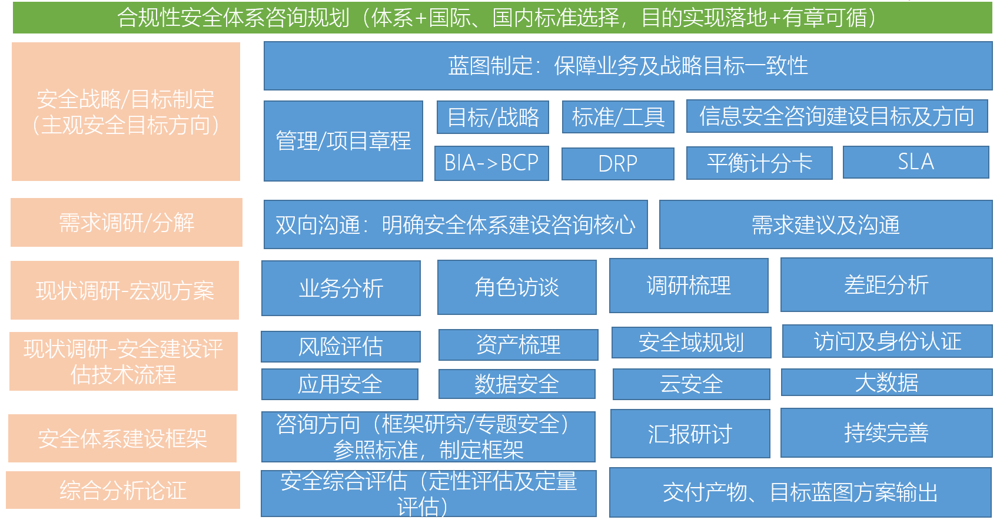
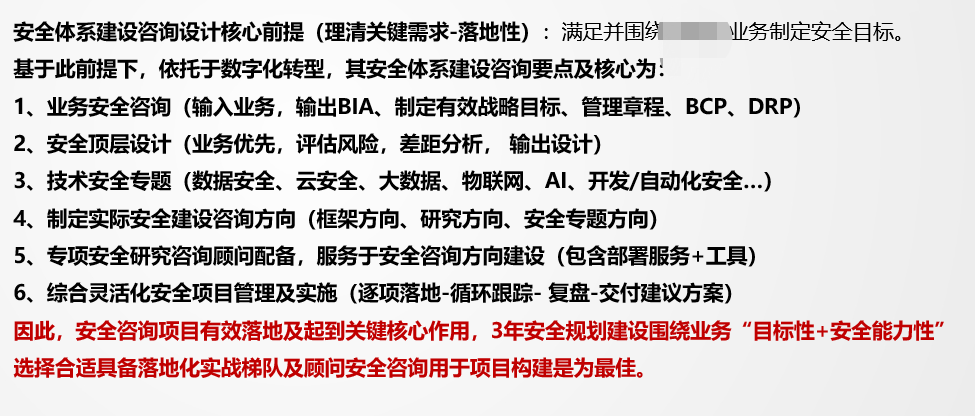
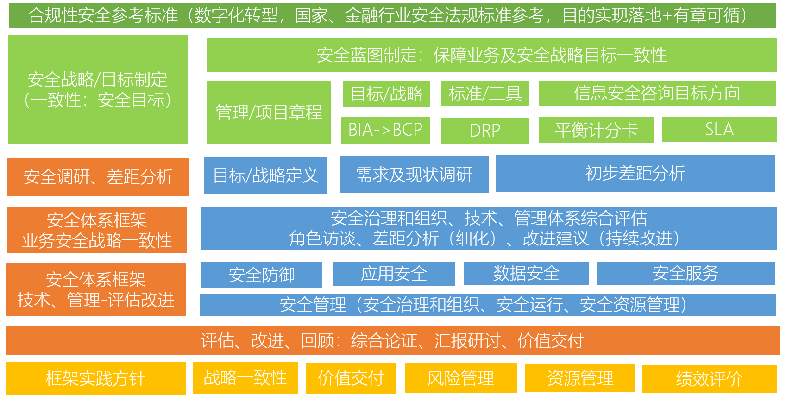
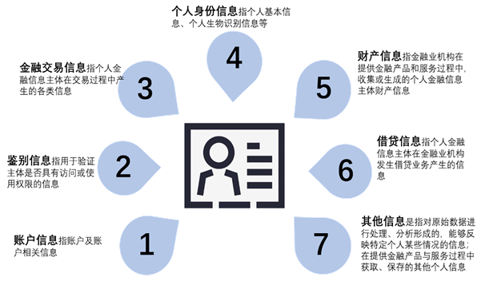

# 金融企业安全体系建设

> 内容来自：https://www.freebuf.com/articles/es/258300.html

金融企业数字化转型过程中，会遇到诸如：数据中心迁移、数据丢失、遭受网络攻击等问题。企业会希望构建完整的安全体系，并要求有流程、实施规划和时间计划、并阐明如何落地、框架导向、参照标准、对标情况等。

## 安全体系建设框架图

上图是一家安全咨询专家提出的“安全体系规划 –安全建设体系咨询落地模块”图，目的是引导客户理解体系规划过程。但还没有与金融行业结合，没有落地。

分为几点：
- 安全战略、目标制定
- 需求调研
- 现状分析
- 安全建设评估技术流程
- 安全体系建设框架
- 综合分析论证

若客户关注安全体系建设，关注数据安全建设，那么可以考虑下图中的体系建设架构图：

之后再迭代一次，有下面：

## 咨询建议书
接下来可以草拟安全体系建设咨询建议书.
### 金融安全体系规划设计需求及必要性
#### 金融商业银行指引和监管应对策略

《JRT 0072-2020金融行业网络安全等级保护测评指南》标准规定了金融行业对第二级、第三级和第四级的等级保护对象的安全测评通用要求和安全测评扩展要求。适用于指导金融机构、测评机构和金融行业网络安全等级保护主管部门对等级保护对象的安全状况进行安全测评。为金融行业网络安全等级保护测评工作提供指导，可参考本标准对金融行业网络安全等级保护对象的安全状况进行测评、自查和评估，进一步完善了金融行业网络安全等级保护体系。

应对策略将结合《JRT 0072-2020金融行业网络安全等级保护测评指南》落实方案中的安全体系框架及安全规划内容，包含安全技术规划设计、安全管理规划设计内容。

针对《JRT 0071-2020个人金融信息保护技术规范》目的在于加强个人金融信息安全管理，指导各相关机构规范处理个人金融信息， 最大程度保障个人金融信息主体合法权益，维护金融市场稳定。应对策略一方面结合个人金融信息保护技术规范中规定的个人金融信息在收集、传输、存储、使用、删除、销毁等生命周期各环节的安全防护要求，从安全技术和安全管理两个方面，对个人金融信息保护提出了规范性要求。

应对策略针对《JRT 0071-2020个人金融信息保护技术规范》要求，参照本方案中的“安全规划内容-数据安全专题设计”落实数据全生命周期管理，进而满足个人金融股信息保护技术规范。同时，在个人金融信息保护技术规范所要求的个人信息保护方面，应结合个人金融信息类型（账户信息、鉴别信息、金融交易信息、个人身份信息、财产信息、借贷信息、其他信息）等提供完善的防护方案，内容包括：

#### 业务及安全战略一致性
为有效实现安全体系建设咨询项目顺利落地，应在安全体系建设咨询项目开始前，明确安全战略目标并实现业务及安全战略一致性，具体包括：

1）安全战略制定：安全战略建设制定前提应遵循业务发展阶段及业务战略目标，安全战略目标制定应围绕业务战略目标要求进行有效制定，更好的辅助业务战略落地及发展（例如针对业务连续性、业务灾备、业务数据安全性保障等方面综合制定安全战略）。

2）落地性保障：围绕业务战略目标所规划设定的安全战略目标，因其贴合于业务发展规划设计，因此在安全体系建设咨询项目的可用性、组织内外的项目推动性方面存在巨大优势，为安全体系建设落地性提供必要保障。

3）资源获取支撑：有效的安全体系建设，在项目章程构建、项目启动及项目实施过程所需的组织架构高层领导及利益相关方的有效配合，协助安全体系建设咨询方提供必要的安全体系建设资源获取支撑，将为顺利落地安全体系建设框架工作提供必要支撑及保障。

#### 金融安全资源投入规划
数据中心规划【省略，主要为安全建设现状描述】

已有安全资源投入包括安全产品投入、周期性的信息安全服务、风险评估及安全态势感知监测、安全资产的保障应用。但面临新数据中心搬迁后，现网经过未来3-5年内逐步迁移过程中如何确保有效的安全防护建设等问题。同时网络设备、安全设备，目前无法进行合理化使用。采购、购置必要的安全产品、安全服务无有效的参考标准及安全资源投入规划基线及指标依据。信息安全管理工作仍可能存在着不能满足《网络安全法》和相关监管部门相关要求之处，也存在着新的法律法规提出的新风险。在现有的信息安全管理制度有待完善，缺乏信息安全建设规划和实施步骤，企业信息安全工作缺乏明确的目标、方向和详细工作指引。

### 安全体系规划设计框架-框架定义
#### 安全体系框架-设计模型
依据安全建设现状、新数据中心安全需求及3-5年蓝图发展目标的概述，实现定制化安全体系建设框架设计“安全体系建设-咨询整体框架图 V1.0”（图2-讨论稿）。作为第一版安全体系建设咨询项目有效落地重要参考依据，方便理解安全体系建设咨询流程、咨询内容、资源任务分配方面内容，框架图中流程、任务、评估维度以不同颜色模块呈现，并对安全合规性参照、安全体系建设咨询框架设计及服务流程、安全体系框架实践方针进行详细划分，具体如下：

深绿色（TOP层）：合规性安全参考标准，针对数字化转型战略方针，国家、金融行业安全法律法规、标准作为合规性依据，目的在于确保安全体系建设框架设计落地性同时，实现落地、合规性的有章可循。

浅绿色：浅绿色作为客户方需针对安全体系建设咨询框架设计方提供的理解及输入模块部分，一般以相关模块客户方已有的输入材料作为依据。一方面便于安全体系建设咨询方提供咨询方向选择建议；另一方面，作为安全体系建设咨询项目顶层规划中-宏观方向参考指南及依据，实现基于项目客户方、安全体系建设咨询规划方对咨询项目理解双向的一致性，以及安全体系建设框架设计输出模块部分的落地性及价值交付。

橘色：橘色作为安全体系建设咨询框架设计方的输出流程部分，此部分对安全体系建设咨询方提供的咨询服务流程阶段进行定义。

蓝色：蓝色作为安全体系建设咨询框架设计方的输入部分，此部分输入作为安全体系建设咨询项目的具体价值交付部分呈现，确保安全体系建设咨询项目的落地性实施、操作及价值交付。

黄色：黄色作为安全体系建设咨询框架设计方在框架设计实践阶段，所遵循的最佳实践方针指南参照。即有效指导项目落地及价值交付，说明安全体系建设咨询的框架设计是基于战略一致性、价值交付、风险管理、资源管理、绩效评价五项方针实现框架设计落地性的保证的。
### 安全体系规划设计-详细设计
基于上面安全体系规划框架可以定出整体的每个部分要做的内容及层面了，因此在设计的时候除了将上面的框架进行细化后，同时结合体系框架的核心做具体的描述及输出。篇幅较多，略。