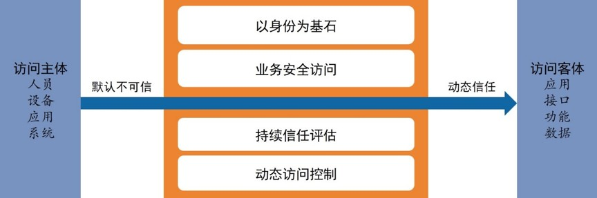
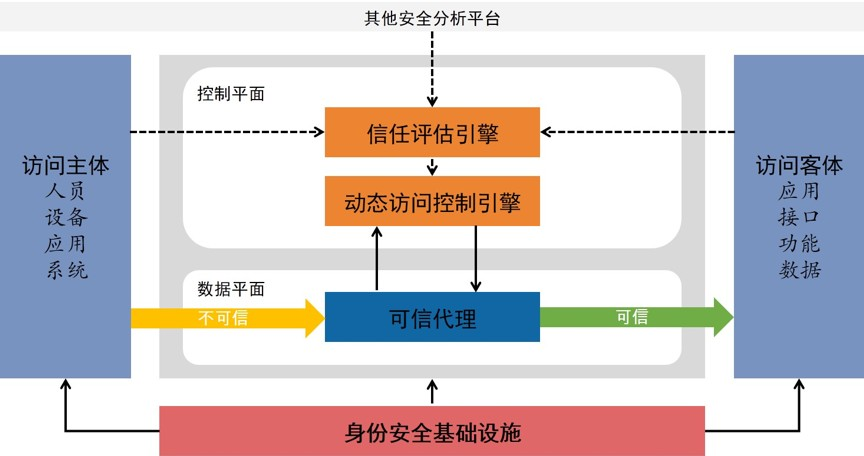
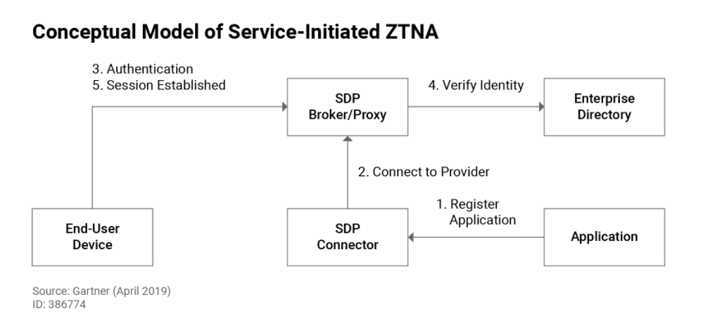
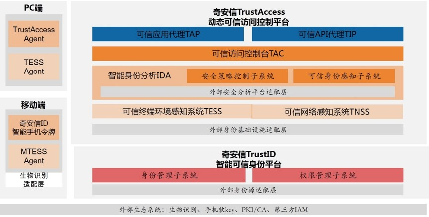
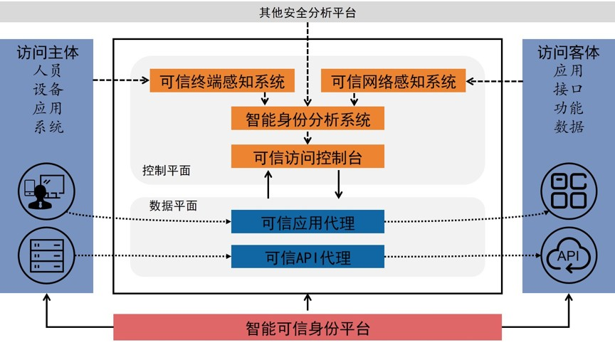
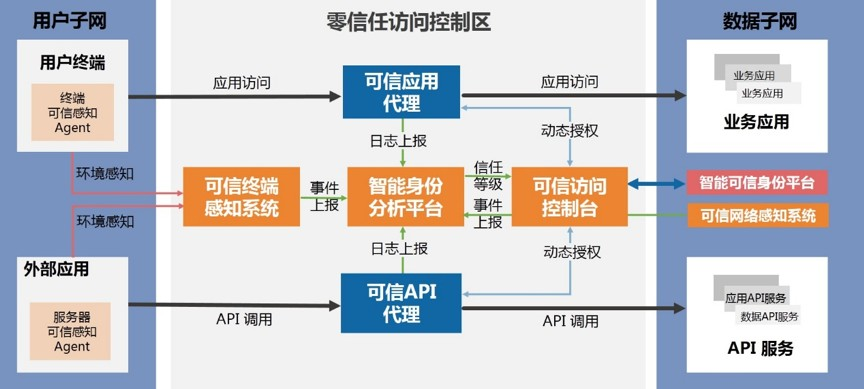
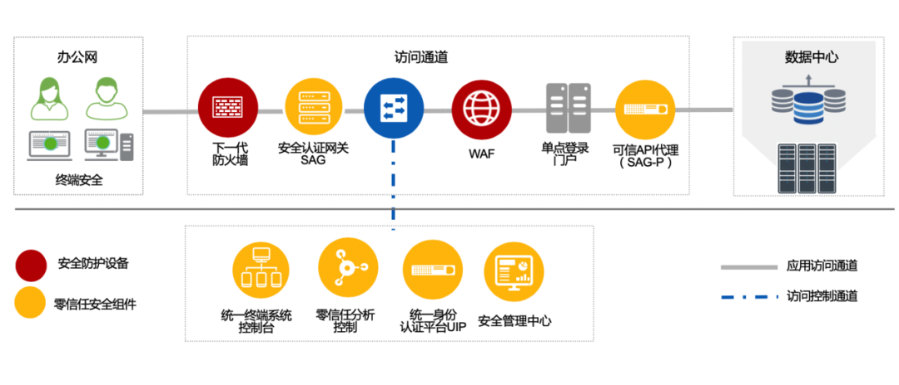
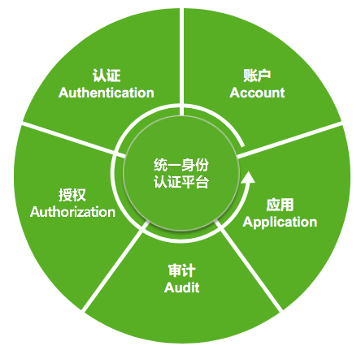
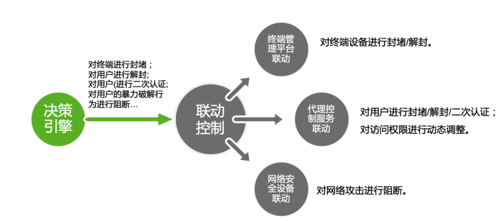

# 零信任
随着技术、应用、业务、社会（疫情）的发展和变化，网络边界变得模糊，可信任成为异常昂贵或难以赋予的属性。

零信任成为一种思考，演变为一种策略或文化，最终落地需要强有力的技术与适配的管理策略。

## 什么是零信任？

云计算、移动互联网、物联网等技术的发展使原有的基于边界的网络安全面临众多挑战，为了使任何设备、任何人、任何位置的安全，谷歌提出了“零信任”安全的概念。

我们对网络信息系统应当始终抱怀疑态度：
- 一定有未被发现的漏洞
- 一定有已发现但未修复的漏洞
- 系统可能已被渗透
- 内部人员有误操作或不可信

在《零信任网络》一书中，埃文.吉尔曼（Evan Gilman）和道格.巴斯(Doug Barth)将零信任的定义建立在如下五个基本假定之上：
- 网络无时无刻不处于危险的环境中。
- 网络中自始至终存在外部或内部威胁。
- 网络的位置不足以决定网络的可信程度。
- 所有的设备、用户和网络流量都应当经过认证和授权。
- 安全策略必须是动态的，并基于尽可能多的数据源计算而来。

NIST在最近发表的《零信任架构》（草案）中指出，零信任架构是一种网络/数据安全的端到端方法，关注身份、凭证、访问管理、运营、终端、主机环境和互联的基础设施，认为零信任是一种关注数据保护的架构方法，认为传统安全方案只关注边界防护，对授权用户开放了过多的访问权限。零信任的首要目标就是基于身份进行细粒度的访问控制，以便应对越来越严峻的越权横向移动风险。

基于如上观点，NIST对零信任及零信任架构定义如下：

零信任（ZT）提供了一系列概念和思想，旨在面对失陷网络时，减少在信息系统和服务中执行准确的、按请求访问决策时的不确定性。零信任架构（ZTA）是一种企业网络安全规划，它利用零信任概念，并囊括其组件关系、工作流规划与访问策略。

零信任的最早雏形源于2004年成立的耶利哥论坛（Jericho Forum ），其成立的使命正是为了定义无边界趋势下的网络安全问题并寻求解决方案。2010年，零信任这个术语正式出现，并指出所有的网络流量都是不可信的，需要对访问任何资源的任何请求进行安全控制，零信任提出之初，其解决方案专注于通过微隔离对网络进行细粒度的访问控制以便限制攻击者的横向移动。

2014年开始，Google基于其内部项目BeyondCorp的研究成果，陆续发表了多篇论文，阐述了在Google内部如何为其员工构建零信任架构。BeyondCorp的出发点在于仅仅针对企业边界构建安全控制已经不够了，需要把访问控制从边界迁移到每个用户和设备。通过构建零信任，Google成功地摒弃了对传统VPN的采用，通过全新架构体系确保所有来自不安全网络的用户能安全地访问企业业务。

通过业界对零信任理论和实践的不断完善，零信任已经超越了最初的网络层微分段的范畴，演变为以身份为基石的，能覆盖云环境、大数据中心、微服务等众多场景的新一代安全解决方案。

综合分析各种零信任的定义和框架，不难看出零信任架构的本质是以身份为基石的动态可信访问控制，聚焦身份、信任、业务访问和动态访问控制等维度的安全能力，基于业务场景的人、流程、环境、访问上下文等多维的因素，对信任进行持续评估，并通过信任等级对权限进行动态调整，形成具备较强风险应对能力的动态自适应的安全闭环体系。

## 零信任参考架构

零信任安全有4大关键能力：
- 以身份为基石
  - 例如基于属性的身份认证与访问控制
- 业务安全访问
  - 例如CASB云安全访问代理、安全访问服务边缘SASE、SD-WAN
- 持续信任评估
- 动态访问控制

功能：
- 全面身份验证
- 动态授权
- 风险可计量
- 弱化网络边界防护
- 自动化管理

### 关键能力模型

零信任的本质是在访问主体和客体之间构建以身份为基石的动态可信访问控制体系，通过以身份为基石、业务安全访问、持续信任评估和动态访问控制的关键能力，基于对网络所有参与实体的数字身份，对默认不可信的所有访问请求进行加密、认证和强制授权，汇聚关联各种数据源进行持续信任评估，并根据信任的程度动态对权限进行调整，最终在访问主体和访问客体之间建立一种动态的信任关系。

零信任架构下，访问客体是核心保护的资源，针对被保护资源构建保护面，资源包括但不限于企业的业务应用、服务接口、操作功能和资产数据。访问主体包括人员、设备、应用和系统等身份化之后的数字实体，在一定的访问上下文中，这些实体还可以进行组合绑定，进一步对主体进行明确和限定。

零信任架构的关键能力包括：以身份为基石、业务安全访问、持续信任评估和动态访问控制。

1) 以身份为基石

基于身份而非网络位置来构建访问控制体系，首先需要为网络中的人和设备赋予数字身份，将身份化的人和设备进行运行时组合构建访问主体，并为访问主体设定其所需的最小权限。

在零信任安全架构中，根据一定的访问上下文，访问主体可以是人、设备和应用等实体数字身份的动态组合，在《零信任网络》一书中，将这种组合称为网络代理。网络代理指在网络请求中用于描述请求发起者的信息集合，一般包括用户、应用程序和设备共三类实体信息，用户、应用程序和设备信息是访问请求密不可分的上下文。网络代理具有短时性特征，在进行授权决策时按需临时生成。访问代理的构成要素（用户或设备）信息一般存放在数据库中，在授权时实时查询并进行组合，因此，网络代理代表的是用户和设备各个维度的属性在授权时刻的实时状态。

最小权限原则是任何安全架构必须遵循的关键实践之一，然而零信任架构将最小权限原则又推进了一大步，遵循了动态的最小权限原则。如果用户确实需要更高的访问权限，那么用户可以并且只能在需要的时候获得这些特权。而反观传统的身份与访问控制相关实现方案，一般对人、设备进行单独授权，零信任这种以网络代理作为授权主体的范式，在授权决策时刻按需临时生成主体，具有较强的动态性和风险感知能力，可以极大地缓解凭证窃取、越权访问等安全威胁。

2) 业务安全访问

零信任架构关注业务保护面的构建，通过业务保护面实现对资源的保护，在零信任架构中，应用、服务、接口、数据都可以视作业务资源。通过构建保护面实现对暴露面的收缩，要求所有业务默认隐藏，根据授权结果进行最小限度的开放，所有的业务访问请求都应该进行全流量加密和强制授权，业务安全访问相关机制需要尽可能工作在应用协议层。

构建零信任安全架构，需要关注待保护的核心资产，梳理核心资产的各种暴露面，并通过技术手段将暴露面进行隐藏。这样，核心资产的各种访问路径就隐藏在零信任架构组件之后，默认情况对访问主体不可见，只有经过认证、具有权限、信任等级符合安全策略要求的访问请求才予以放行。通过业务隐藏，除了满足最小权限原则，还能很好的缓解针对核心资产的扫描探测、拒绝服务、漏洞利用、非法爬取等安全威胁。

3) 持续信任评估

持续信任评估是零信任架构从零开始构建信任的关键手段，通过信任评估模型和算法，实现基于身份的信任评估能力，同时需要对访问的上下文环境进行风险判定，对访问请求进行异常行为识别并对信任评估结果进行调整。

在零信任架构中，访问主体是人、设备和应用程序三位一体构成的网络代理，因此在基础的身份信任的基础上，还需要评估主体信任，主体信任是对身份信任在当前访问上下文中的动态调整，和认证强度、风险状态和环境因素等相关，身份信任相对稳定，而主体信任和网络代理一样，具有短时性特征，是一种动态信任，基于主体的信任等级进行动态访问控制也是零信任的本质所在。

信任和风险如影随形，在某些特定场景下，甚至是一体两面。在零信任架构中，除了信任评估，还需要考虑环境风险的影响因素，需要对各类环境风险进行判定和响应。但需要特别注意，并非所有的风险都会影响身份或主体的信任度。

基于行为的异常发现和信任评估能力必不可少，包括主体（所对应的数字身份）个体行为的基线偏差、主体与群体的基线偏差、主体环境的攻击行为、主体环境的风险行为等都需要建立模型进行量化评估，是影响信任的关键要素。当然，行为分析需要结合身份态势进行综合度量，以减少误判，降低对使用者操作体验的负面影响。

4) 动态访问控制

动态访问控制是零信任架构的安全闭环能力的重要体现。建议通过RBAC和ABAC的组合授权实现灵活的访问控制基线，基于信任等级实现分级的业务访问，同时，当访问上下文和环境存在风险时，需要对访问权限进行实时干预并评估是否对访问主体的信任进行降级。

任何访问控制体系的建立离不开访问控制模型，需要基于一定的访问控制模型制定权限基线。零信任强调灰度哲学，从实践经验来看，也大可不必去纠结RBAC好还是ABAC好，而是考虑如何兼顾融合，建议基于RBAC模型实现粗粒度授权，建立权限基线满足企业基本的最小权限原则，并基于主体、客体和环境属性实现角色的动态映射和过滤机制，充分发挥ABAC的动态性和灵活性。权限基线决定了一个访问主体允许访问的权限的全集，而在不同的访问时刻，主体被赋予的访问权限和访问上下文、信任等级、风险状态息息相关。

需要注意，并非所有的风险都对信任有影响，特别是环境风险，但风险一旦发生，就需要对应的处置策略，常见手段是撤销访问会话。因此，零信任架构的控制平面需要能接收外部风险平台的风险通报，并对当前访问会话进行按需处理，从而实现风险处置的联动，真正将零信任架构体系和企业现存的其他安全体系融合贯穿。

### 基本原则

安全能力有架构组件实现支持，设计安全组件及其关系时，要遵循一些安全原则：
- 全面身份化原则，所有的访问主体都要有身份标识、都要在一致的安全上下文中运行。安全主体包括：人、设备、应用等等。
- 应用级访问控制原则，业务访问要在应用层，而不是网络层，即不只是限制ip与端口。可能会使用各类应用层代理，要求这些代理是全流量的、加密的。
- 安全闭环原则
- 业务强聚合原则
- 全面场景覆盖
- 组件高度联动原则

### 核心架构组件

基于前述关键能力模型和基本架构原则，零信任架构的核心逻辑架构组件如图：

1) 可信代理

可信代理是零信任架构的数据平面组件，是确保业务安全访问的第一道关口，是动态访问控制能力的策略执行点。

可信代理拦截访问请求后，通过动态访问控制引擎对访问主体进行认证，对访问主体的权限进行动态判定。只有认证通过、并且具有访问权限的访问请求才予以放行。同时，可信代理需要对所有的访问流量进行加密。全流量加密对可信代理也提出了高性能和高伸缩性的需求，支持水平扩展是零信任可信代理必须具备的核心能力。

2) 动态访问控制引擎

动态访问控制引擎和可信代理联动，对所有访问请求进行认证和动态授权，是零信任架构控制平面的策略判定点。

动态访问控制引擎对所有的访问请求进行权限判定，权限判定不再基于简单的静态规则，而是基于上下文属性、信任等级和安全策略进行动态判定。动态访问控制进行权限判定的依据是身份库、权限库和信任库。其中身份库提供访问主体的身份属性，权限库提供基础的权限基线，信任库则由身份分析引擎通过实时的风险多维关联和信任评估进行持续维护。

3) 信任评估引擎

信任评估引擎是是零信任架构中实现持续信任评估能力的核心组件，和动态访问控制引擎联动，为其提供信任等级评估作为授权判定依据。

信任评估引擎持续接收可信代理、动态访问控制引擎的日志信息，结合身份库、权限库数据，基于大数据和人工智能技术，对身份进行持续画像，对访问行为进行持续分析，对信任进行持续评估，最终生成和维护信任库，为动态访问控制引擎提供决策依据。另外，信任评估引擎也可以接收外部安全分析平台的分析结果，包括：终端可信环境感知、持续威胁检测、态势感知等安全分析平台，这些外部风险源可以很好的补充身份分析所需的场景数据，丰富上下文，从而进行更精准的风险识别和信任评估。

4) 身份安全基础设施

身份基础设施是是实现零信任架构以身份为基石能力的关键支撑组件。

身份基础设施至少包含身份管理和权限管理功能组件，通过身份管理实现各种实体的身份化及身份生命周期管理，通过权限管理，对授权策略进行细粒度的管理和跟踪分析。

零信任架构的身份安全基础设施需要能满足现代IT环境下复杂、高效的管理要求，传统的静态、封闭的身份与权限管理机制已经不能满足新技术环境的要求，无法支撑企业构建零信任安全架构的战略愿景，需要足够敏捷和灵活，需要为更多新的场景和应用进行身份和权限管理。另外，为了提高管理效率，自助服务和工作流引擎等现代身份管理的关键能力也必不可少。

### ZTNA

### 四大核心
- 新一代安全沙箱
- 高性能网络隧道
- 软件定义边界
- AI安全策略引擎

## 解决方案

### 奇安信解决方案

奇安信零信任安全解决方案主要包括：奇安信TrustAccess动态可信访问控制平台、奇安信TrustID智能可信身份平台、奇安信ID智能手机令牌及各种终端Agent组成，如图3所示。奇安信零信任安全解决方案中，动态可信访问控制平台和智能可信身份平台逻辑上进行解耦，当客户现有身份安全基础设施满足零信任架构要求的情况下，可以不用部署智能可信身份平台，通过利旧降低建设成本。

1) 奇安信TrustAccess动态可信访问控制平台

奇安信TrustAccess提供零信任架构中动态可信访问控制的核心能力，可以为企业快速构建零信任安全架构，实现企业数据的零信任架构迁移。

TrustAccess的核心组件包括：可信应用代理TAP、可信API代理TIP、可信访问控制台TAC、智能身份分析系统IDA、可信终端环境感知系统TESS和可信网络感知系统TNSS。

可信应用代理系统TAP

可信应用代理系统TAP是零信任参考架构中的可信代理在业务访问场景的产品实现。

针对企业应用级访问控制需求，实现了应用的分层安全接入、一站式应用访问、应用单点登录、应用审计等能力。

可信API代理系统TIP

可信API代理系统TIP是零信任参考架构中的可信代理在数据交换场景的产品实现。

针对API服务的安全保护需求，实现了API接口的统一代理、访问认证、数据加密、安全防护、应用审计等能力。

可信访问控制台TAC

可信访问控制台TAC是零信任参考架构中动态访问控制引擎的产品实现。

TAC为TAP/TIP提供自适应认证服务、动态访问控制和集中管理能力，针对企业的各个业务访问场景，实现了自适应认证服务、访问控制策略统一配置管理、WEB应用和API服务集中管理、动态授权、风险汇聚关联、应用审计等功能。

智能身份分析系统IDA

智能身份分析系统IDA是零信任参考架构中信任评估引擎的产品实现。

IDA基于身份及权限信息、TAP/TIP/TAC访问日志、可信环境感知上报的属性和风险评估、其他外部分析平台上报的日志及事件进行综合风险关联判定，利用大数据分析和人工智能技术，构建信任评估模型进行持续信任评估，为TAC提供信任等级作为决策依据。

可信终端环境感知系统TESS

可信终端环境感知系统TESS提供各种场景的终端环境的安全状态和环境感知，为IDA提供实时的终端可信度的判断依据，是IDA的重要数据源。

可信网络环境感知系统TNSS

可信网络环境感知系统TNSS提供网络环境的安全状态和环境感知，为IDA提供实时的网络可信度的判断依据，是IDA的重要数据源。

2) 奇安信TrustID智能可信身份平台

奇安信TrustID智能可信身份平台是零信任参考架构身份安全基础设施的产品实现，是一种现代身份与权限管理系统。

TrustID可为企业提供更高级、更灵活的现代身份与权限管理能力，当TrustAccess自带的基础身份和权限管理能力，或企业现有的身份基础设施无法满足企业的管理需求时，可借助TrustID对身份与权限管理方面的能力进行提升，达到零信任架构对身份安全基础设施的能力要求。除了为TrustAccess服务，TrustID也可为企业的业务系统和其他需要身份、认证、授权的场景提供身份及权限基础服务。

奇安信TrustID也支持对接企业现有的外部身份源系统，包括PKI、4A、AD等，通过将企业现有的身份源进行汇聚和同步，形成完善的身份生命周期管理能力，为TrustAccess提供身份基础设施服务。

3) 奇安信零信任安全解决方案与参考架构的关系

奇安信零信任安全解决方案在零信任参考架构的基础上对产品组件进行了拆分和扩展，但在总体架构上保持了高度一致，将其产品组件映射到零信任参考架构如图4所示：

另外，奇安信零信任安全解决方案和奇安信丰富的安全产品和平台之间可以实现联动，比如，和奇安信的移动安全解决方案联动，可以实现强大的移动零信任解决方案；和奇安信的数据安全解决方案联动，可以实现数据访问场景的零信任解决方案；和奇安信云安全管理平台联动，可以实现云及虚拟化场景的零信任解决方案。

3.2. 典型场景方案

下面以一个典型应用场景为例，描述奇安信零信任安全解决方案的逻辑原理。此应用场景数据子网需要保护的资源包括业务应用和API服务，用户/外部平台子网的用户终端需要访问业务应用，外部应用需要通过接口调用API服务，方案逻辑图如图5所示，本图只是逻辑原理图，实际物理部署需要根据具体的网络拓扑、安全分区情况确定。

在此方案中，通过在用户子网和数据子网之间部署逻辑的零信任访问控制区构建端到端的零信任解决方案。通过可信应用代理接管所有的用户终端业务访问请求，通过可信API代理接管所有的外部应用API调用请求，所有的访问请求通过可信访问控制台进行身份验证及动态授权。

可信终端感知系统持续对终端进行感知和评估，可信网络感知系统持续对网络流量进行感知和评估，并生成安全事件上报至智能身份分析平台，智能身份分析平台综合访问日志信息、安全事件信息、身份与权限信息进行信息关键和信任评估，为可信访问控制台输出信任等级作为权限判定或撤销的依据。

### 绿盟零信任解决方案

零信任安全的核心理念，对于任何用户、设备、网络、系统、应用，默认都是不信任的，除非信任关系得到证明。

绿盟科技零信任安全解决方案，遵循零信任安全理念，组合以下部分构成：
- 终端安全
- 身份识别与管理
- 网络安全
- 应用和数据安全
- 安全分析协作与响应等模块

构建以用户信任和设备信任为基础，持续评估访问过程的行为可信，自适应访问控制的零信任安全架构。 

#### 方案架构与组件

##### 部署架构

绿盟科技零信任安全解决方案，逻辑上划分为数据平面和控制平面。数据平面是指用户访问应用系统的业务界面，控制平面是信任和风险分析和策略控制的界面。

控制平面，汇聚来自终端，网络，用户等多个因素，并执行风险分析，根据风险结果向具有执行能力的组件下发指令，实现动态访问控制。

用户可信：任何和用户，在访问应用前先取得认证和授权才能访问资源；

设备可信：设备当前安全性，终端安全防护措施，以及安全基线情况（比如重要补丁，关键注册表项，用户，程序，当前进程等）等需要经过验证；

访问行为可信持续评估：访问会话建立后，持续评估用户和终端的行为，确保没有恶意行为发生。一旦发现访问实体的异常行为，比如扫描或者暴力破解，意味着信任等级的降低，零信任网络可以切断这种访问，从而降低安全风险；

自适应访问控制：根据用户、设备、访问行为等持续的信息收集和风险评价，自动化的决策并按照规则相应，比如切断会话，或者降低访问等级等操作。

##### 方案组件

零信任安全解决方案，组合多个安全产品作为方案组件，构建零信任安全架构。在用户访问会话建立之初，评估用户信任和设备信任；访问会话过程中，持续评估用户和实体行为，确保访问行为可信；风险发生变化，自动调整访问级别，实现自适应访问控制。

###### 安全认证网关（SAG）

安全认证网关，以反向代理方式，对外发布应用资源。安全认证网关将外网用户和内网资源隔离，过滤非法的访问。安全认证网关为内部应用资源提供加密访问通道，与设备之间通过证书来认证，增强安全性。

###### 统一身份认证平台（UIP）

统一身份平台，集合了用户、认证、授权、应用、审计的统一管理功能，是用户身份和访问管理的平台。用户管理，将各子系统的账户关联到主账户中，实现账号体系的统一，方便员工的生命周期管理。 统一身份平台可以利用第三方账户数据，周期同步。

###### 零信任分析与控制（ISOP-ZTA）

零信任分析与控制模块的作用相当于零信任案安全系统的大脑。通过收集和汇聚风险因素，经过分析评估之后，根据信任评估的结果作出决策，下发决策指令给到相关的安全设备或者软件系统，实现访问控制。

收集信息包括：
- 终端安全状态
- 用户与实体行为分析数据
- 用户认证和授权的信息
- 网络安全风险数据等。

根据收集的信息，在会话建立请求阶段，对用户和设备作出允许访问或者拒绝访问的决策；在访问期间，持续分析用户和实体行为，结合网络风险，评估访问信用，基于信用结果向关联设备或者软件联动控制。

###### 统一终端系统（UES）

绿盟统一终端系统是终端安全组件，提供终端设备的安全状态信息。终端安全状态，包含多个方面，比如操作系统的版本，补丁更新，软件和进程，安全配置等等。策略引擎平台可以根据这些选项，判断访问终端设备是否达到了策略要求的基线，决定是否允许访问。

###### 安全管理平台

安全管理平台，能够对全网设备的漏洞和威胁、日志持续监控和分析，获得风险可视化，自动化响应能力（SOAR）。安管平台的UEBA模块，持续检测用户和终端的行为，评估访问主体的安全风险。

#### 典型场景

1)远程办公场景

2020年初的新冠病毒疫情，需要企业员工远程办公。零信任架构能够取代传统的VPN管道，成为更安全更便捷的远程访问公司内部应用，以及云端应用。

员工访问单点登录的门户，需要先行认证，加上验证码实现双因素认证后，根据用户的角色，授予访问应用的权限。更进一步，增强的终端安全感知，还需要评估访问终端的安全性，只有通过安全监测的终端才能访问。

2)数据安全防护场景

零信任架构的终极目标，是保护后台的应用和数据安全。安全产品部署，应用在终端、网络、用户、数据、应用等实体系统。比如在网络上，需要部署防火墙，网络入侵检测，Web应用防火墙等。
安全防护措施最大化，权限最小化。安全防护和零信任架构相结合，确保后台的应用系统和数据的安全性。

## 参考资料

- 国内首份零信任安全白皮书：全面解读零信任安全架构 https://www.secrss.com/articles/18624
- https://github.com/ukncsc/zero-trust-architecture
- https://github.com/smallstep/cli
- https://github.com/pomerium/awesome-zero-trust
- https://www.cisco.com/c/en/us/products/security/zero-trust.html
- https://www.microsoft.com/zh-cn/security/business/zero-trust